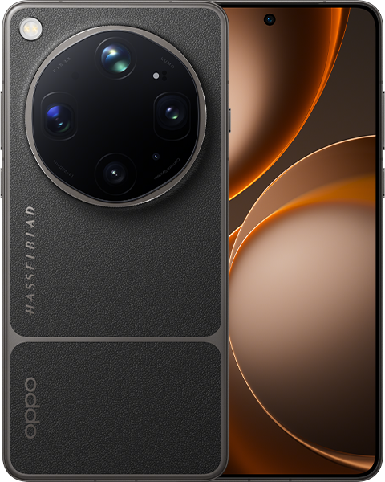
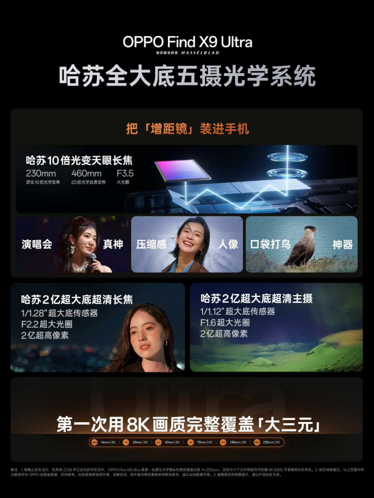
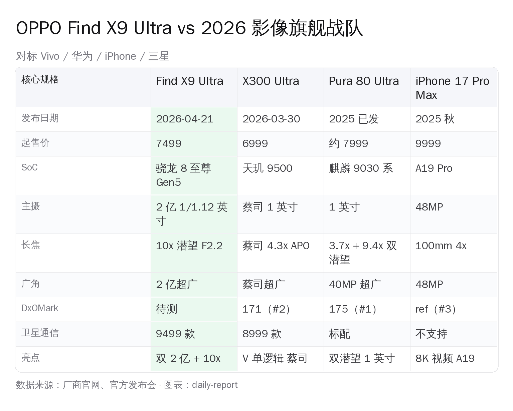
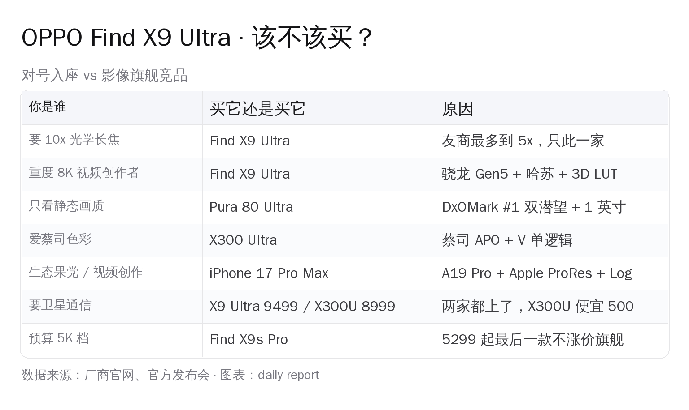

# OPPO 4/21 全场清单 · 从 849 的耳夹到 11999 的哈苏大师套装 · 该买谁？

> 2026 年 4 月 21 日晚成都 · OPPO 一口气甩出 **9 件新品**，价格从 **849 元**（Enco Clip 2）到 **11999 元**（Hasselblad 探索者大师套装）。Find X9 Ultra 7499 起是主角，但 Pad 5 Pro 4299 起 / Pad Mini 3699 起 / Watch X3 Mini 1799 起也都有爆点。这篇把**全场新品清单 + Ultra vs 影像旗舰战队对决 + 各档推荐**讲清楚。

---

## 📋 OPPO 4/21 全场清单（按主次排序）

**🏆 主角**
- 📱 **Find X9 Ultra** 7499 起 — 双 2 亿哈苏 + 10x 光学潜望

**🥈 次主角**
- 📱 **Find X9s Pro** 5299 起 — "最后一款不涨价旗舰"，小屏哈苏双 2 亿

**🥉 平板线**
- 📟 **Pad 5 Pro** 4299 起 — 13.2" 3.4K 144Hz，骁龙 8 至尊 Gen5，13380 mAh
- 📟 **Pad Mini** 3699 起 — 8.8" 2.5K OLED，279g，8000 mAh

**⌚ 穿戴 + 音频线**
- ⌚ **Watch X3 Mini** 1799 起 — 骁龙 W5，首发生理周期运动指导
- 🎧 **Enco Clip 2** 849 起 — 开放式耳夹，Dynaudio 调音

**📷 影像配件线**
- 📷 **Hasselblad Professional Kit** 2499 — 手机外接专业影像套件
- 📷 **Hasselblad Earth Explorer Master Kit** 11999 — 300mm 长焦镜头 + 相机握柄手机壳，五月开售

**🔌 充电头**
- 🔌 **120W Mini / 100W Mini Pro** — GaN 方块砖型

下面分头讲重点。

---

## 一、🏆 Find X9 Ultra 三件狠事

### 狠事一：10 倍光学潜望镜

五反射棱镜 + 空气光阑撑起来的真·光学 10x，品质延展到 20 倍。友商目前最多 5x。**手机望远端天花板被单颗镜头抬高一档**。

### 狠事二：双 2 亿哈苏 + 2 亿超广角

- **23mm 主摄**：1/1.12 英寸 2 亿像素 F1.5
- **70mm 长焦**：1/1.28 英寸 2 亿像素 F2.2
- **14mm 超广角**：进光量 +156%
- **10x 天眼潜望** + 50MP 前摄

视频：**10-bit 8K 30fps Log、4K 120fps Log**，机内 3D LUT，哈苏联调色彩。

### 狠事三：价格 7499 起，但满配 9499

12+256 **7499** / 12+512 7999 / 16+512 8499 / 16+1TB 9299 / 16+1TB **卫星通信版 9499**（4/30 开售）。

刘作虎那句"**Find X9s Pro 可能是今年最后一款不涨价旗舰**"立住了涨价预期。**Ultra 7499 已经是涨价后的门票价**。

---

## 二、✊ Ultra vs 影像旗舰战队对决

关键点：

**1. DxOMark 现状**：华为 Pura 80 Ultra 175 分 #1、Vivo X300 Pro 171 分 #2、iPhone 17 Pro #3、三星 S26 Ultra 只排 18 位。OPPO X9 Ultra 还未送测。

**2. 蓝厂抢跑 20 天**：Vivo X300 Ultra 2026-04-03 开售，**6999 起比 Ultra 便宜 500**。蔡司 V 单 + 1 英寸主摄 + 4.3x APO 长焦。

**3. 华为是真正画质王**：1 英寸 + 双潜望（3.7x + 9.4x）。要极致静态画质选它，接受鸿蒙。

**4. iPhone 17 Pro Max 是视频之王**：A19 Pro + ProRes RAW + Log + Apple 生态。

**5. 三星 S26 Ultra 已经"不够打"**：DxOMark 18 位是尴尬成绩，同价位被国产全面压制。

---

## 三、🥈 Find X9s Pro · 小屏党的哈苏

**5299 起，可能是今年最后一款不涨价旗舰**。

- **屏幕**：6.32 英寸 1.5K 144Hz **天马 U9 Pro 直屏**，超声波指纹
- **SoC**：天玑 9500
- **影像**：**后置哈苏双 2 亿**（HPE 1/1.4" 主摄 + HP5 1/1.56" F2.6 2.8x 潜望）+ 50MP 超广角 + 3.2MP 多光谱
- **电池**：**7025mAh**，80W 有线 + 50W 无线
- **机身**：198g，8.4mm，IP66/68/69，ColorOS 16

**定价**：12+256 5299 / 12+512 5699 / 16+512 5999 / 16+1TB 6999。

**这就是"小屏影像旗舰"的新标杆**——同时兼顾哈苏双 2 亿和 6.3 英寸小屏手感，市面上只有它。

---

## 四、🥉 平板双子星：Pad 5 Pro + Pad Mini

### 📟 OPPO Pad 5 Pro · 安卓最强平板

**4299 起**（8+256 国补 3799）。

- **屏幕**：**13.2 英寸 3.4K 144Hz 原彩屏**，ΔE≈0.7 / 杜比视界 / HDR Vivid
- **SoC**：**第五代骁龙 8 至尊版 Gen5**（和 Find X9 Ultra 同款！）
- **电池**：**13380 mAh**，67W 快充
- **声音**：Hi-Fi 级 8 扬声器
- **配件**：触控笔（分开卖）

**定位**：13 寸档"轻量生产力平板" — 骁龙 Gen5 给了桌面级性能，3.4K 屏够剪辑用，8 扬声器是看片神器。

**对比**：华为 MatePad Pro 13.2 (2024) 4999 起 · iPad Pro M5 13" 8999 起。Pad 5 Pro **4299 起的价位是"安卓 13 寸最强"**。

### 📟 OPPO Pad Mini · 279g 8.8" 口袋平板

**3699 起**（国补 3199）。

- **屏幕**：**8.8 英寸 2.5K OLED 明眸柔光屏**，144Hz
- **SoC**：**第五代骁龙 8 旗舰芯片**
- **电池**：8000 mAh
- **机身**：**279g**、5.39mm 厚、**2.99mm 超窄边框**
- **存储**：8+256 / 12+256 / 12+512

**定位**：小屏党阅读/看视频神器 — 8.8 英寸这个尺寸国产只此一家。和 iPad Mini 7 (M2) 4499 起相比便宜 800，屏幕更亮（OLED vs LCD），系统生态差一截。**追求便携且不想上果系选它**。

---

## 五、⌚🎧 穿戴与耳夹：Watch X3 Mini + Enco Clip 2

### ⌚ Watch X3 Mini · 1799 起

- **SoC**：骁龙 W5
- **新功能**：**首发生理周期运动指导**（女性用户友好）
- 三档配色/价位：亮金 2499、摩卡棕/星光银 1999、蓝牙版 1799

### 🎧 Enco Clip 2 · 849 促销起

- **类型**：开放式耳夹（不入耳）
- **调音**：Dynaudio（丹麦音响厂牌）
- 售价 899，上市期 849 · 双配色（亮面白 / 深空灰）

**两件都是 4/24 开售**，小众刚需人群好评居多。

---

## 六、📷 哈苏外接镜头套装

**Hasselblad Professional Imaging Accessory Kit 2499 元**（5 月发售）
**Hasselblad Earth Explorer Master Kit 11999 元**（4/24 预售）：含 300mm 长焦 + 相机握柄手机壳

这是 OPPO 这次**最激进的配件策略** — 让你用手机 + 外接镜头组合成一台"准专业单反"。定位极其小众（只适合旅行+野生动物拍摄），但也把"手机影像"概念往**可替换镜头生态**方向又推一步。

---

## 七、💡 你该买哪个？

**实操建议（扩展全系）**：

- 💡 **要 10x 光学长焦 / 8K 视频创作**：**Find X9 Ultra 7499** 没得选。
- 💡 **5K 档影像党 + 小屏**：**Find X9s Pro 5299** — 哈苏双 2 亿 + 7025mAh + 6.3" 小屏。
- 💡 **13 寸生产力平板**：**Pad 5 Pro 4299** — 骁龙 Gen5 + 3.4K 144Hz + 13380mAh。
- 💡 **8.8 寸口袋平板**：**Pad Mini 3699** — 2.5K OLED + 279g + 骁龙 Gen5。
- 💡 **只看静态画质**：**华为 Pura 80 Ultra** DxOMark #1，接受鸿蒙。
- 💡 **爱蔡司色彩**：**Vivo X300 Ultra 6999 起**，比 OPPO 便宜 500。
- 💡 **果党生态 + 视频剪辑**：**iPhone 17 Pro Max**。
- 💡 **Watch 女性用户**：**Watch X3 Mini 1799**，生理周期运动指导。
- 💡 **开放式耳机党**：**Enco Clip 2 849**，Dynaudio 调音。

🚫 **Galaxy S26 Ultra 不推荐**：同价位被国产全面碾压。

---

## 八、📌 收官

**OPPO 这场发布会是"个人生产力 + 哈苏影像"双全家桶**——从 849 的耳夹到 11999 的外接镜头套装一次铺满，核心叙事是"**你所有生产力和创作场景，OPPO 都有解**"。

**主角 Find X9 Ultra 赢在 10x 光学，5299 的 Find X9s Pro 是本场性价比之王。平板双子星填满 8.8" 到 13.2" 空白。Watch 女性友好，Enco Clip 开放耳夹党好选。不买 OPPO 旗舰的理由只有一个——华为 / Vivo 在画质和蔡司上还是有底蕴。**

---

*参考：[IT 之家 X9 Ultra 评测](https://www.ithome.com/0/941/820.htm) · [IT 之家 Pad 5 Pro 发布](https://www.ithome.com/0/941/818.htm) · [IT 之家 Find X9s Pro 发布](https://www.ithome.com/0/941/819.htm) · [IT 之家 Watch X3 Mini](https://www.ithome.com/0/941/822.htm) · [快科技 vivo X300 Ultra 发布](https://news.mydrivers.com/1/1112/1112580.htm) · [Gizmochina DxOMark 排名](https://www.gizmochina.com/2026/03/09/iphone-17-pro-beats-galaxy-s26-ultra-in-dxomarks-initial-camera-test/)*
