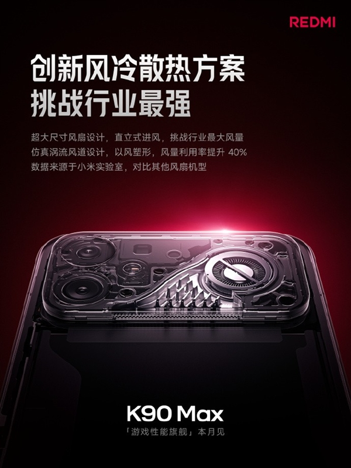
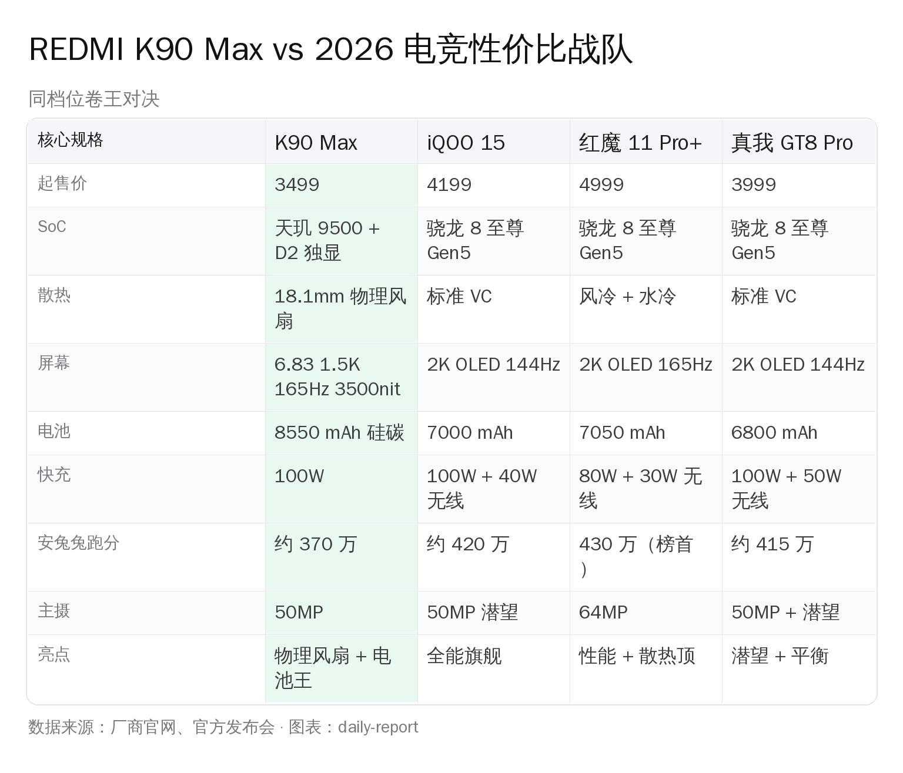
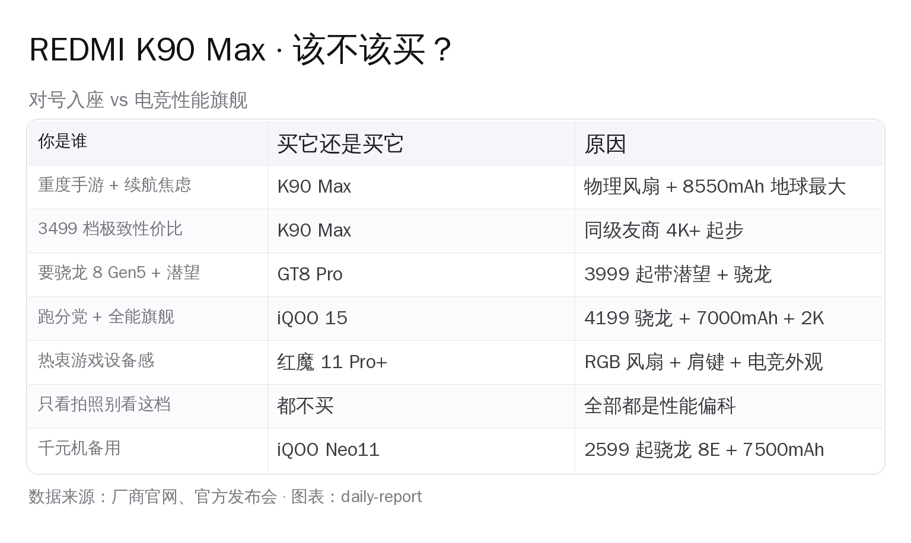

# REDMI 4/21 全场清单 · 从 229 的耳机到 9699 的顶配笔电 · 该买谁？

> 2026 年 4 月 21 日晚北京 · Redmi 一场发布会甩出 **5 件新品**，价格从 **229 元**（Buds 8）到 **9699 元**（Book Pro 16 顶配）一次铺满。**K90 Max 3499 起 + 真·物理风扇 + 8550mAh 电池**是主角，但 K Pad 2 电竞平板 3599 起、Book Pro 14/16 笔记本 6999/7199 起也都是高关注度产品。这一篇把**全场清单 + K90 Max vs 电竞战队对决 + 各档推荐**讲清楚。

---

## 📋 REDMI 4/21 全场清单（按主次排序）

**🏆 主角**
- 📱 **K90 Max** 3499 起 — 天玑 9500 + D2 独显 + **18.1mm 物理风扇** + 8550mAh

**🥈 次主角**
- 📟 **K Pad 2 电竞平板** 3599 起 — 首销档位 3399（首销价减 200）

**🥉 笔记本线**
- 💻 **Book Pro 14 (2026)** 6999 起 — 酷睿 Ultra 5/7 至 X7 358H 顶配 9499
- 💻 **Book Pro 16 (2026)** 7199 起 — 顶配 X7 358H 9699

**🎧 配件**
- 🎧 **Buds 8** 229 元首销（学生再减 20）

下面分头讲重点。

---

## 一、🏆 K90 Max 四件狠事

### 狠事一：真·物理风扇

**不是外挂散热背夹**。机身里真正转起来嗡嗡响的 active cooling fan，**直径 18.1mm**，配涡旋风道，100 秒降 10℃，**保修 6 年**。

### 狠事二：天玑 9500 + 小米 D2 独显

D2 图形芯片专攻 GPU 加速——光追、超采样、120FPS 游戏优化。**安兔兔跑分约 370 万**。

跑分不如骁龙 8 至尊版 Gen5 的 420-430 万，但**游戏实际帧率稳定性和散热表现领先同级**（风扇功劳）。

### 狠事三：8550 mAh 单电芯，同级电池天花板

**硅碳负极 8550 mAh**，主流手机地球第一大电池。100W 快充。重度手游 6 小时不虚。

对比：iQOO 15 7000mAh、红魔 11 Pro+ 7050mAh、真我 GT8 Pro 6800mAh。K90 Max **领先第二名 22%**。

### 狠事四：3499 起的"亏钱定价"

- 12+256 **3499**（国补后约 2999）
- 卢伟冰微博："**这个价格我们是亏着卖的**"

同 SoC 友商起步：iQOO 15 4199、真我 GT8 Pro 3999、红魔 11 Pro+ 4999。**Redmi 直接砸地板**，发布 4 小时刷新近一年 3K-4K 档全渠道首销纪录。

**槽点**：50MP 主摄 + 8MP 超广角 + 20MP 前摄，**长焦砍掉**。摄影党请绕行。风扇多 10g 重量、多一个故障点。

---

## 二、✊ K90 Max vs 电竞旗舰战队对决

几个不在参数表的关键点：

**1. 跑分天花板**：红魔 11 Pro+ 430 万登顶骁龙 Gen5 阵营。K90 Max 370 万在天玑阵营领跑。**性能党看跑分请选红魔；散热+游戏体感请选 K90 Max**。

**2. 同价位骁龙选真我 GT8 Pro**：3999 起，骁龙 8 至尊 Gen5 + 潜望长焦 + 2K OLED。**比 K90 Max 贵 500，换骁龙 + 潜望**。

**3. iQOO 15 是"全能旗舰"**：4199 但给 2K + 100W + 40W 无线 + 7000mAh + 骁龙 Gen5 + 潜望。**要拍照 + 性能全能选 iQOO 15**。

**4. 红魔 11 Pro+ 是游戏设备，不是日常机**：RGB + 肩键 + 透明背盖 + 风冷水冷。**不适合日常**。

**5. 续航王 8550mAh 不是白来的**：227g 机身重量、增加机械部件、硅碳负极——**三个设计都为重度游戏党服务，轻度用户上手反而累**。

---

## 三、🥈 K Pad 2 电竞平板 · 3599 起

**首销价 3399**（首销减 200）。

- **8+256 3599 首销 3399**
- **12+256 3999 首销 3799**
- **16+512 4999 首销 4799**

**定位**：电竞平板——面向重度手游 / 手柄用户 / 云游戏。上一代 K Pad 定下了 "平板里打游戏最爽" 的标签，K Pad 2 延续。

**对比**：联想拯救者 Y700 4999 起 · iPad mini 7 M2 4499 起。K Pad 2 首销 3399 **把电竞平板地板价再压 600 元**，同级最便宜。

---

## 四、🥉 Book Pro 14/16 · 6999 起到 9699 顶配

### 💻 Book Pro 14 (2026)

- **Ultra 5 325 + 24GB + 1TB**：6999 元首销
- **Ultra 5 338H + 32GB + 1TB**：7999 元首销
- **Ultra 7 X7 358H + 32GB + 1TB**：9499 元首销

### 💻 Book Pro 16 (2026)

- **Ultra 5 325 + 24GB + 1TB**：7199 元首销
- **Ultra 5 338H + 32GB + 1TB**：8199 元首销
- **Ultra 7 X7 358H + 32GB + 1TB**：**9699 元首销（全场最贵）**

**新卖点**：搭载英特尔 Core Ultra 酷睿系列 + 独显 + OLED 屏。

**对比**：华为 MateBook X Pro (2025) 9999 起、小米 Book Pro 15 (2025) 7499 起。**Book Pro 14 **6999 起轻薄本档**比华为 X Pro 便宜 3000，比小米自家 15" 贵 500 但 CPU 更新一代。**

---

## 五、🎧 Buds 8 · 229 元

- **首销价 229**（学生再减 20，实付 209）
- 入门主动降噪，蓝牙 5.4

**定位**：Redmi 给"学生 + 年轻用户"准备的低价 ANC 真无线。229 元做 ANC 耳机，**同价位友商根本做不到**。

---

## 六、💡 你该买哪个？

**实操建议（扩展全系）**：

- 💡 **重度手游党 + 续航焦虑**：**K90 Max 3499 起** — 物理风扇 + 8550mAh 地球最大。
- 💡 **骁龙 Gen5 + 潜望拍照**：**真我 GT8 Pro 3999 起**。
- 💡 **跑分党 + 全能旗舰**：**iQOO 15 4199 起**，最平衡。
- 💡 **真电竞党**：**红魔 11 Pro+ 4999 起**，安兔兔榜首。
- 💡 **电竞平板用户**：**K Pad 2 首销 3399**，同级最便宜。
- 💡 **14 寸轻薄本**：**Book Pro 14 6999**，酷睿 Ultra 5 + 24GB + 1TB。
- 💡 **16 寸+独显生产力**：**Book Pro 16 顶配 9699**，X7 358H。
- 💡 **229 元学生降噪耳机**：**Buds 8 209 学生价**。
- 🚫 **拍照党别看 Redmi 全系**：长焦潜望都是"顺带"，要影像跳 OPPO Find X9 Ultra 或 Vivo X300 Ultra。

---

## 七、📌 收官

**Redmi 这场发布会的叙事很清楚：每个价位只做"同级最便宜的性能王"——K90 Max 把 3K 档电竞手机打到 3499，K Pad 2 把电竞平板打到 3399，Book Pro 14 把轻薄本打到 6999，Buds 8 把 ANC 耳机打到 229。**

**K90 Max 是"重度手游 + 续航焦虑"人群的唯一选择。其他产品各自也是同价位地板线。不买 Redmi 的理由只有一个：你要影像或全能旗舰。**

---

*参考：[IT 之家 K90 Max 发布会](http://tech.caijing.com.cn/20260421/5155001.shtml) · [IT 之家 Book Pro 2026 发布](https://www.ithome.com/0/941/797.htm) · [Qooah K Pad 2 + Book Pro 双新品](https://qooah.com/2026/04/22/xiaomi-redmis-two-new-spring-products-k-pad-2-gaming-tablet-and-book-pro-2026/) · [腾讯新闻 全场清单](https://news.qq.com/rain/a/20260421A07JQM00) · [ZAKER 12 月安兔兔性能榜](https://applocal.myzaker.com/article/695c8cdf8e9f0941f657d870)*
