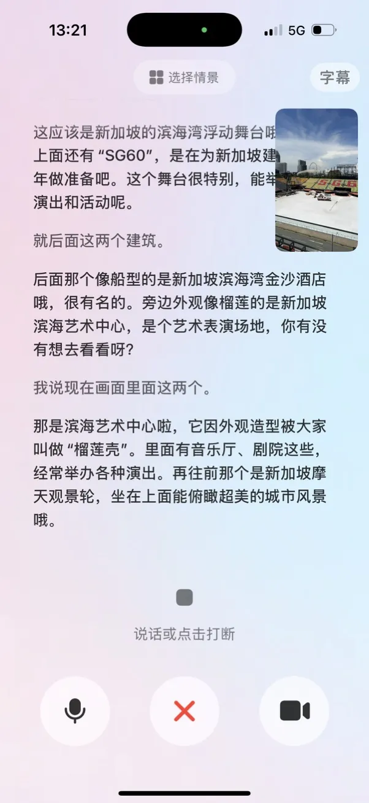
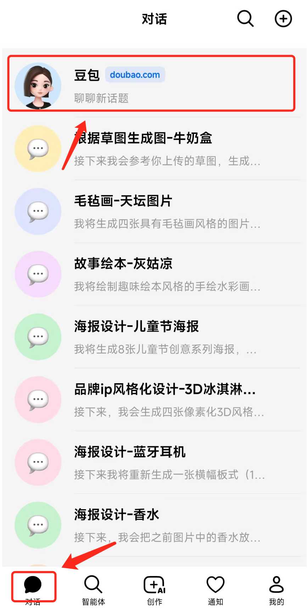
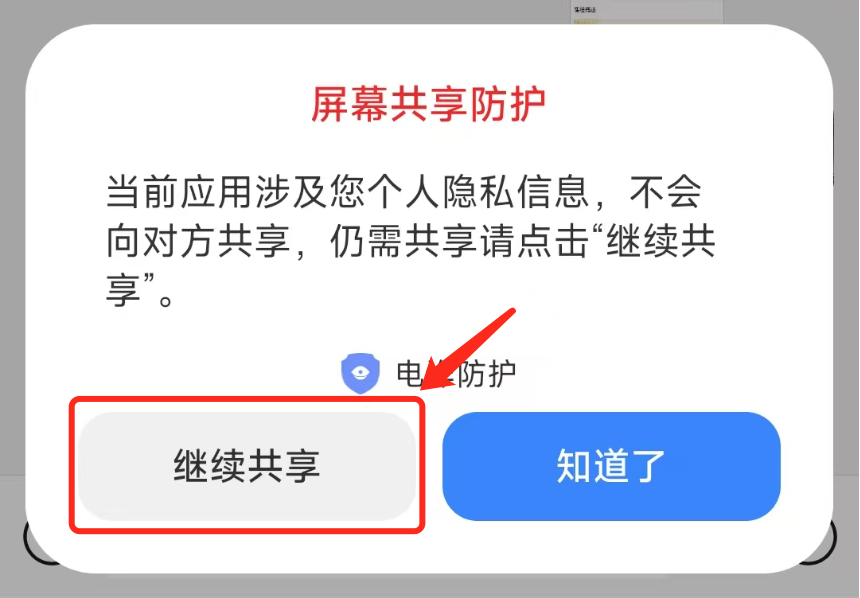
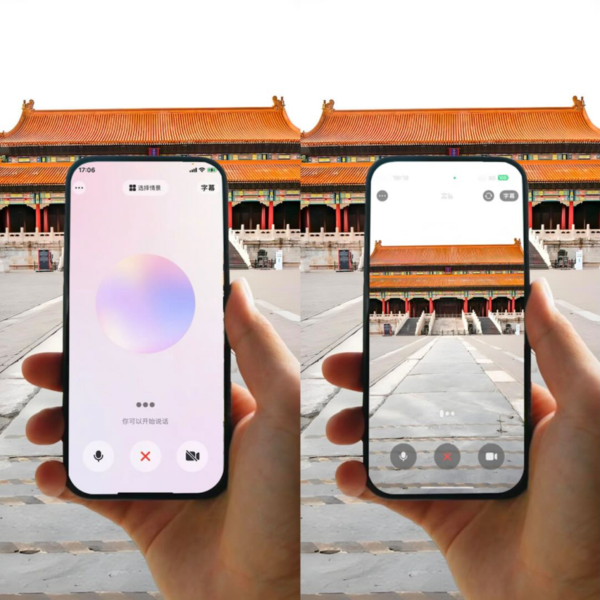
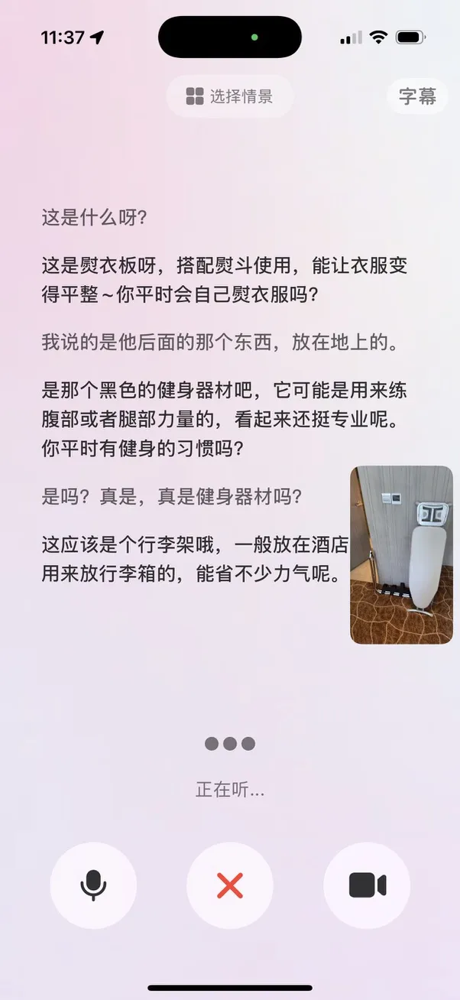
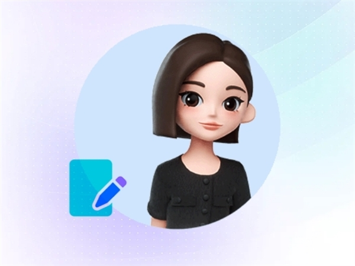

# 豆包打电话：陪孩子读书、教爸妈用手机

> 2026 年除夕，豆包视频通话弹出一行字：「新春人数较多，暂不支持此功能」——这是国内 C 端 AI 产品首次因春节集中流量暂停视觉通话。字节没公布当天有多少人同时打进来，但算力确实顶穿了。
> 豆包语音通话 2025-01 上线，视频通话 2025-05 上线。两个功能对个人用户**全部免费、没有会话时长上限**（2026 春节除外）。
> 把它当成一个 24 小时在线的助手——识字、识物、识屏，能听粤语和四川话。下面讲它到底能干什么。

*图片来源：极客公园《豆包「入职」浦东美术馆》专题头图（官方合作主视觉）*

---

## 一、🎒 教小朋友读书：识字、讲题、英语陪练

### 场景 1：英语口语陪练，带字幕 + 纠错

*图片来源：极客公园《豆包为什么要给 AI 助手「开眼」？》（2025-05-26）*

豆包 App 内置**英语口语练习智能体 Owen**。打开语音通话，Owen 会按孩子水平主动提问——初级用"What's your name?"，中级切到"Can you describe your school?"。

豆包官方主推的三大杀手级用例——英语口语、陪伴、旅行讲解——英语陪练排第一。湖北日报 2025-02 报道中小学生家长把豆包当"AI 学伴"用。

**和外教 1v1 课对比**：
- 真人外教一对一：市场价普遍 ¥200-500/小时，要预约
- 豆包 Owen：免费、无限次、随时可打断换话题

**硬限制**：豆包**多语言混合效果有限**——官方 Seed 介绍里明确说"主要面向中文语境，可进行英文对话，暂不支持多语言"。孩子中途蹦一句"这个 apple 怎么拼"会卡住，要么全中文要么全英文。

### 场景 2：拿手机对着题目问，做物理数学

量子位 2025-05 实测过这个流程——先理解图示，再走深度思考链路，最后给答案。背后是 Doubao-Seed-1.6 的视觉 + 推理融合能力。

做题场景的用法：
- 数学 / 物理：视频通话对着题目，让豆包先读题再讲解
- 语文阅读：共享屏幕把阅读材料拉进豆包，问"作者为什么这么写"
- 作文：豆包按年级提示"三年级作文要有开头、三件事、结尾"

### 场景 3：认字、儿歌、故事

对学龄前的家长来说：
- 认字：拿绘本对着豆包摄像头，问"这个字怎么读"，它读出来并解释
- 讲故事：让豆包"讲一个关于小白兔和月亮的故事"，它现场生成
- 哄睡：用"温柔"情绪标签 + 慢速音色（Seed-TTS 2.0 支持情感 1-5 级调节）

**一句话记住：3-6 岁用陪听陪讲、7-12 岁用英语陪练 + 讲题、13-15 岁用共享屏幕做作业。**

---

## 二、👵 帮爸妈操作 App：最打动人的场景

### 真实故事：五分钟教父母挂号

知乎上一位网友分享过一个典型场景：

> 爸妈住县城，要在"国家医保服务平台"里挂号，步骤七八步，电话里讲不清。我让他们打开豆包 App，点视频通话 → 共享屏幕。豆包看着他们的屏幕说："点右上角搜索，输入**'预约挂号'**"——**屏幕上真的出现一个红色箭头指着搜索框**。五分钟就搞定了。

这背后是字节两套自研技术的组合：

*图片来源：CSDN 博客《豆包 App 端终于也推出了【共享屏幕】的功能》（2025-07-16）*

1. **共享屏幕 + 视频理解**：豆包 1.6 全系支持视觉理解，读得懂手机界面
2. **UI-TARS-1.5 图形界面 Agent**：字节 Seed 2025-04-18 开源，OSWorld 基准打出 **42.5 分**，超过 OpenAI CUA（36.4）和 Claude 3.7（28）。目前最懂"怎么用 App"的开源模型

### 怎么用（三步）

*图片来源：CSDN 博客《豆包 App 端终于也推出了【共享屏幕】的功能》（2025-07-16）*

1. **发起方**（你在外面）：打开豆包 → 对话 → "+" → 打电话 → 切视频通话
2. **被指导方**（爸妈）：同上，接通后点"共享屏幕"按钮
3. **豆包**看到他们的屏幕，你用语音问"妈，这个按钮在哪？"——豆包用大红字在屏幕上指"点这里"

**隐私防护**：豆包自动识别**支付、密码、身份证**等敏感页面，切到"**防护中**"状态，画面对 AI 不可见（顶部状态条明显提示）。

### 适用人群

- 不住在一起的父母、祖父母
- 刚开始用智能机的长辈
- 视力不便、看不清小字的用户——豆包把 UI 元素用语音"念"出来
- 临时故障需要远程救急的场景

**一句话记住：共享屏幕 + 语音是豆包目前最有社会价值的功能——"AI 帮老人"从此不是口号，是一个可以打开的按钮。**

---

## 三、🏛 旅行讲解：豆包"入职"浦东美术馆

*图片来源：腾讯新闻《字节豆包上线视频通话功能》（2025-05-23，字节跳动官方素材）*

这是 AI 第一次正式担任国内美术馆官方讲解员。浦东美术馆同时开两场展——**卢浮宫印度、伊朗与奥斯曼艺术**和**"非常毕加索"**。新华网 2026-01-20 发布合作消息，字节跳动副总裁朱骏、陆家嘴集团副总经理兼浦东美术馆董事长李旻坤、艺术家陈丹青、北京大学艺术史学者朱青生到场。

### 实测体验

澎湃记者现场拿手机对着毕加索《牛头》雕塑——一个用自行车座和车把拼出来的作品——打开豆包视频通话：

- 豆包识别出是"毕加索 1942 年的拼装艺术作品"
- 主动解释"他把废弃自行车零件变成牛头，是一种'发现式创作'"
- 记者追问"为什么不用金属铸？"，豆包接着讲成本、战时材料短缺、现成物艺术史

（综合澎湃、量子位、杭州网现场报道）

### 双模式切换

浦美版豆包有两套讲解风格：

- **亲子模式**：简单、故事感、打比方。面对毕加索《阅读》："这幅画里的女孩子看起来好安静，她是不是在看一本很有意思的书？"
- **专业模式**：讲流派、技法、历史背景。"这是毕加索 1932 年创作的 Marie-Thérèse Walter 系列之一，融合了立体主义与超现实主义"

家长带小朋友开亲子模式，艺术学生开专业模式——**同一幅画两种答案**。

### 旅行外延：挑水果、认菜单、问地标

不止博物馆。证券时报 2025-05 的实测报道里，豆包视频通话被用来**对着水果摊判断木瓜成熟度**——摄像头照过去，它会告诉你"这颗要熟了、那颗还硬"。智东西同期也有类似的水果挑选评测。

出国旅行场景更直接：

*图片来源：极客公园《豆包为什么要给 AI 助手「开眼」？》（2025-05-26）*

- 日本料理店对着菜单：豆包翻译 + 解释"这是荞麦面，配这个酱"
- 欧洲街头对着地标：讲历史、推荐拍照角度
- 超市里对着不认识的食材：讲吃法、教配菜

**一句话记住：豆包把"导游 + 语音导览 + 菜市场阿姨"三个角色打包进一个电话按钮。**

---

## 四、🛒 生活场景：找东西、教做菜、陪看剧

*图片来源：极客公园《豆包为什么要给 AI 助手「开眼」？》（2025-05-26）*

### 高频生活场景

- **找眼镜 / 找钥匙**：品玩 2025-05 "24 小时室友"实测——在家拿着摄像头扫，豆包告诉你"客厅茶几左边，那本书旁边有东西反光"
- **看电视剧讲解**：量子位实测《甄嬛传》名场面，豆包识出"这是华妃赐死夏常在那段，剧中台词是……"
- **做饭辅导**：冰箱门开着让豆包看一眼——"今晚吃什么？"它按食材组合菜谱，边做边指挥下一步
- **临时导购**：商场看衣服不知道搭什么，打开视频通话，它讲风格建议
- **看书带字幕**：摄像头对着书页，豆包念出来并高亮关键词

### 连续追踪的准确度

量子位测了这个极端用例——让豆包在视频里报时。

多数视觉大模型会卡在"时钟指针角度 + 数字读取 + 连续追踪"这种任务上。豆包过得去，原因是 Doubao-Seed-1.6 底座在时间 / 空间序列理解上做过针对性训练。

---

## 五、🎧 陪伴与情绪：Ola Friend 耳机

豆包的情绪支持、陪伴聊天、旅行讲解，手机上用要掏屏幕。Ola Friend 把它收进耳机——单耳 6.6g，一键呼叫，走路、旅游、通勤时随时对话。

极客公园 2024-10 上市评测提到三个主打用例：

- **英语口语练习**：等公交时练 5 分钟
- **旅游讲解**：走到哪问到哪，不用掏手机
- **情绪支持 / 陪伴聊天**：地铁里戴着说说话

**要不要买，看两个数字**：
- 每周 **≥ ¥300 花在心理咨询、陪聊 App、语言陪练**上 → Ola Friend 4 个月回本，买
- 只是想"偶尔试试 AI 聊天" → 用豆包 App 免费版，不必买硬件

---

## 六、💾 底层三张牌：为什么豆包能做成

*图片来源：ByteDance Seed 官方介绍页 seed.bytedance.com/en/realtime_voice*

### Seeduplex（端到端实时语音大模型）

2025-01 上线，2026-04 升级到 Seeduplex 全双工。快科技 2026-04-09 披露的对比测试里，豆包在抗噪、动态轮转、满意度三项上优于行业平均。官方 Seed 博客引用的外部盲测数据就是上面那组。

### Doubao-Seed-1.6（多模态视觉）

2025-06-11 火山引擎 Force 大会发布。视频通话里"看世界"的能力都靠它。

### UI-TARS-1.5（图形界面 Agent）

2025-04-18 字节 Seed 开源 7B 版本。目前最懂"怎么用 App"的开源模型。共享屏幕场景下帮你点按钮、填表单、跨 App 订票都靠它。

### 和国内外竞品的对比

| 产品 | 实时视频通话 | 共享屏幕 | 手把手教操作 | 国内可用 |
|---|---|---|---|---|
| **豆包** | ✅ 2025-05 · C 端免费 | ✅ 手机 + PC | ✅ UI-TARS-1.5（OSWorld 42.5） | ✅ 原生 |
| 通义千问视觉 | 拍照问为主 | 有限 | — | ✅ 原生 |
| Kimi 视觉 | 长文 / 图理解 | — | — | ✅ 原生 |
| GPT-4o Advanced Voice with Video | ✅ 2024-12 起 | 桌面 App | Operator 36.4 | ⚠️ 需科学上网 + 国际信用卡 |
| Gemini Live 视频 | 2025 全球逐步 | Android 原生 | — | ⚠️ 无国内入口 |

**豆包的独占位**：国内免费门槛最低 + 字节自研 RTC 护城河 + UI-TARS 开源基座 + 博物馆级官方合作。

---

## 七、🛠 10 分钟上手：新手三步

### 第一步：装

- **手机**：应用商店搜"豆包"，字节跳动出品，蓝色图标 🫘（iOS / Android）
- **电脑**：官网 doubao.com 下载豆包电脑版（Windows / macOS）
- **硬件（可选）**：Ola Friend 耳机 ¥1199，抖音 / 天猫 / 京东官方旗舰店

### 第二步：授权

- 首次打开视频通话或共享屏幕，App 弹**麦克风 + 摄像头 + 屏幕捕捉**三个权限
- 共享屏幕额外弹一个"录屏权限"，iOS 和 Android 都有自己的系统提示
- 想取消：设置 → 豆包 → 权限

### 第三步：试

- 对话界面点**「+」→ 打电话**，进入语音通话
- 通话中点**「视频」**切到视频通话，摄像头开启
- PC 端：对话框下方点**"共享屏幕语音通话"**，可选应用级或全屏共享

*图片来源：快科技《豆包上线视频通话功能》（2025-05-23，字节跳动官方供图）*

---

## 八、⚠️ 用之前先扫这 5 颗雷

1. **中英文混合不支持**——官方确认。孩子跟它练英语时蹦一句中文会卡住，要全中或全英
2. **只"说"4 种方言**——粤语、四川话、东北话、陕西话能说；上海话、南京话等 14 种只能听懂不能回话
3. **声音克隆 C 端不开放**——Seed-TTS 能用 5 秒音频克隆，但只给火山引擎企业客户，普通用户在豆包 App 里克隆不了自己的声音
4. **视频通话耗流量**——移动网络下延迟波动大、画质会降，建议连 WiFi
5. **春节可能暂停**——2026-02-16 除夕当天视频通话被整体限流，提示"新春人数较多"。春节帮爸妈挂号这种场景要**备一个 Plan B**

### 隐私建议

- 首次使用前**读一下豆包隐私条款**，尤其是"声纹数据用于模型改进"那一条——可以在设置里关掉
- 共享屏幕时豆包会自动识别支付、密码、身份证页面切"防护中"，但**别完全依赖它**——敏感操作主动点"暂停共享"
- 提醒家里老人：**豆包不会主动索要银行卡号或验证码**——电话里冒充"豆包"的陌生人，八成是骗子

---

## 九、🔮 打完第一个电话之后

- **家长**：打开 Owen 英语陪练智能体，让孩子对着它朗读一段课文，豆包标发音问题
- **子女**：给爸妈装好豆包，家庭群里置顶"遇到 App 不会用就打豆包视频"——比你再接电话快
- **自己**：出门前对着衣柜要搭配建议；做饭时开着语音通话让它提醒别焦；睡前让它读一篇文章当故事

### 官方合作看点

字节跳动 2026 年的方向是把豆包嵌进更多硬件。想象一下：开车时呼叫车载豆包、手机上问豆包怎么操作 App、拍完视频让美图用豆包语音自动配音——**同一个 AI 跟你对话，记忆是连续的**。
## 📌 一句话收官

**豆包不是最强的对话模型——那位置 ChatGPT 和 Claude 拿着。但它是国内第一个把"视频通话 + 看世界 + 帮老人操作 App"打包成免费 C 端产品的 AI。它解决的不是"我怎么写一封邮件"，而是"我怎么帮爸妈挂上一次号"——这类问题，没谁比它做得更彻底。**

装一个，打一个电话试试。
