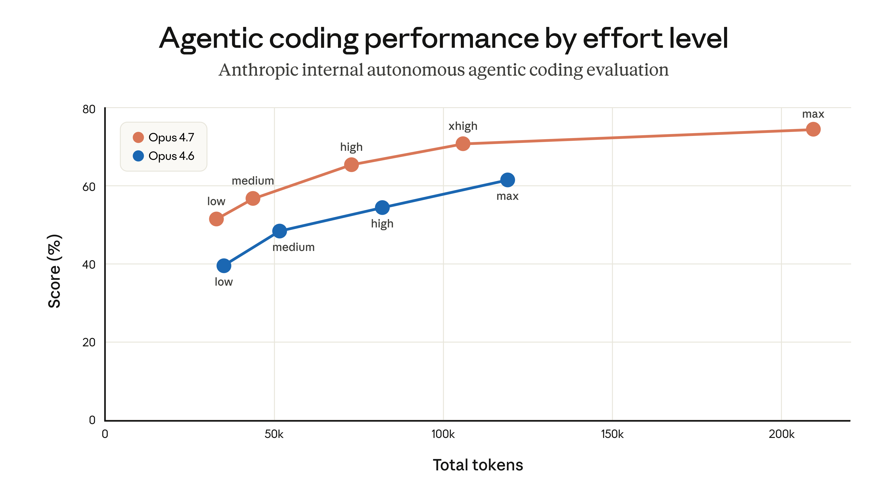
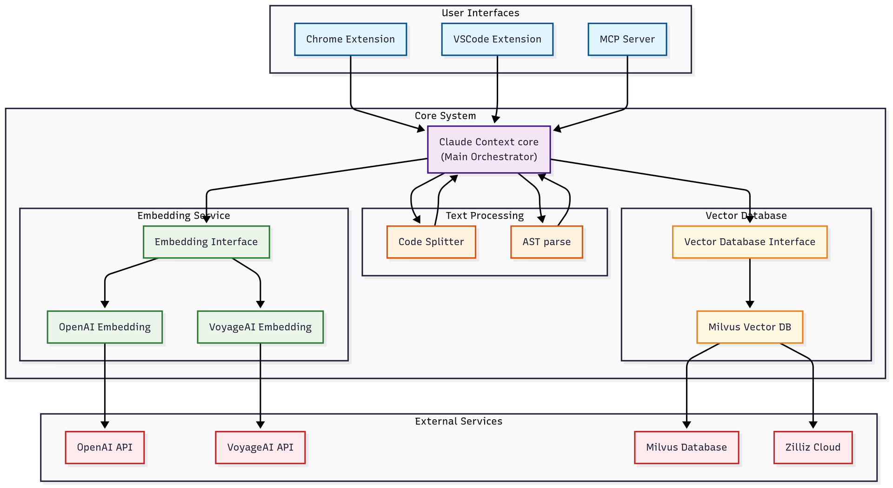
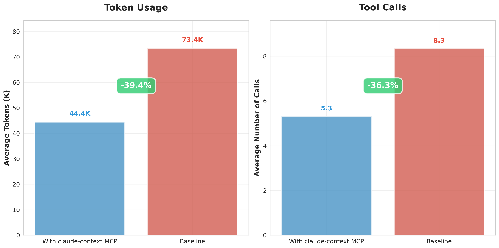
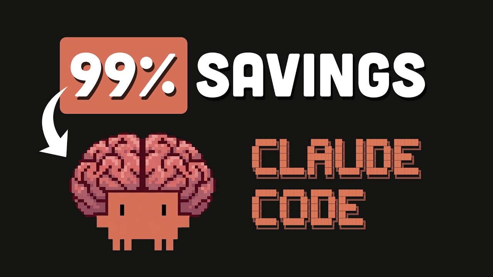
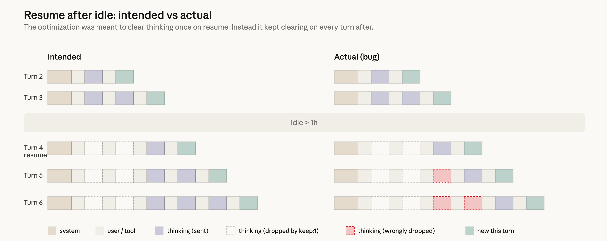

# Claude Code 的 48 天、3% 掉分、9.5k 星：Anthropic 补锅，社区已经魔改上瘾



> **3 月 4 日到 4 月 20 日，Claude Code 被三个独立改动叠加打到 eval 掉 3%；Anthropic 在 4 月 23 日深夜出了 postmortem，HN 冲上 668 赞 / 507 条评论。** 道歉本身不算新鲜，更值得看的是同一周里，三个社区魔改工具在 GitHub 并排拔到 9,591、8,632、6,031 stars——`context-mode` 从创建到这个量级只用了 2 个月。下面把 postmortem、这三件工具、HN 上那场「爱之深责之切」的群起讨伐放在一起看。

---

## 48 天里的三个独立改动叠加到一起

Postmortem 列了三个完全独立的改动，时间跨度 48 天：

| 日期 | 改动 | 受影响直到 |
|---|---|---|
| 2026-03-04 | 默认 reasoning effort 从 `high` 降到 `medium`（为了延迟） | 2026-04-07 回滚 |
| 2026-03-26 | 缓存优化 bug：`idle 超过 1 小时清一次 thinking history` 被错误实现成 `每轮都清` | 2026-04-10 回滚 |
| 2026-04-16 | 加 system prompt：工具调用之间 ≤25 词，最终回复 ≤100 词 | 2026-04-20 回滚 |

三件事交织起来的后果，Anthropic 自己写得最准：

> "Claude would continue executing, but increasingly without memory of why it had chosen to do what it was doing."

Claude 会继续执行，但越来越不记得自己当初为什么要这么做。这正是那段时间 Claude Code 用户最常抱怨的症状——一个跑了一小时的重构任务，突然开始「忘掉目标」，一边还在改代码一边说不出改这行的理由。

Anthropic 披露的量化影响：在内部的广义 eval 上，**Opus 4.6 和 4.7 都出现 3% 的得分下降**。3 个百分点听着小，但在 coding 场景下意味着每 33 个任务多一个翻车——Claude Code 的典型用户一天要发十几次任务。

### Opus 4.7 自己 debug 出了自己被改坏的 bug

Postmortem 里埋着一句话，后来被 HN 和 Twitter 反复截图：

> "When provided the code repositories necessary to gather complete context, Opus 4.7 found the bug, while Opus 4.6 didn't."

给它完整代码仓库的上下文之后，Opus 4.7 找出了这个 bug，Opus 4.6 没找到。

**Opus 4.7 自己 debug 出了自己被改坏的 bug**。这句话同时传两个信号——强模型真能自救；也是 Anthropic 在反复强调「模型本身没退化」的间接证据。

更戏剧性的是 4 月 16 日那条 system prompt，原文直接贴了出来：

> "Length limits: keep text between tool calls to ≤25 words. Keep final responses to ≤100 words unless the task requires more detail."

让 Claude 在工具调用之间最多说 25 个词，最终回复最多 100 词。听起来是让它「少废话」的好主意——但对一个强制简短的 reasoning 模型，短到一定程度就开始丢失中间思考。**强行闭嘴反而害死了模型。**

---

## HN 的 507 条评论：用户骂的不是 bug，是半个月的沉默

Postmortem 上线几个小时内，HN 就冲到 668 赞 / 507 条评论。评论区的情绪光谱很清楚——**用户不是在骂 Anthropic 有 bug，是在骂 Anthropic 半个月内一直没承认**。


摘几条有代表性的：

**@troupo**（最尖锐的一条）：

> "Anthropic literally advertises long sessions, 1M context, high reasoning etc … while silently changing how the product works."

Anthropic 嘴上宣传长 session、1M context、高 reasoning，背地里却默默改产品行为。

**@CjHuber**（用户续费决策被伤到）：

> "I would not have renewed my subscription if I knew that they started doing this … they're just throwing most the relevant stuff out all out without any notice when I resume my session after a few days? This is insane."

早知道他们这么干我就不续费了。session 隔几天回来他们默默把相关 context 全扔了？这太离谱了。

**@BoppreH**（直接把阴谋论摆上台面）：

> "Isn't that exactly what people had been accusing Anthropic of doing, silently making Claude dumber on purpose to cut costs?"

这不就是一直以来大家指控 Anthropic 在干的事吗——为了省成本悄悄把 Claude 变笨？

**@mtilsted**（文档与产品自相矛盾的段子）：

> "Claude Code answered: 'No. A 2-hour gap doesn't change my output … The prompt cache may expire (5 min TTL).' This answer directly contradict your post."

我问 Claude Code「session 隔 2 小时有影响吗」，它回答「不会，只是 prompt cache 5 分钟过期」——这直接跟 Anthropic 这篇 post 矛盾。

这条被点赞特别高，原因简单——**一个 AI 产品自己的 Chat 回答，直接证伪了自己公司的官方工程 blog**。

### 507 条评论里几乎没人提替代品

翻完这 507 条会发现一件事：**几乎没人把矛头指向替代产品**。

没人说「那我换 Cursor 吧」、没人说「Aider 更好」、没人说「Copilot Agent mode 可以顶」。愤怒全部集中在 Anthropic 一家。这种分布暗示一个事实——在这批重度开发者眼里，Claude Code 目前**没有真正的替代品**。这 507 条评论里是「爱之深责之切」的怒气，不是「我随时可以走」的怒气。

正是这种「走不了」的状态，催生了这一周最真实的变化——不是开发者换工具，而是开发者**自己动手改工具**。

---

## 同一个周末，三个魔改工具冲上 GitHub Trending 前三页

每一个都在解决 Anthropic 自己承认的问题的某一部分。

| 项目 | Stars (live) | 角度 | 解决什么 |
|---|---|---|---|
| `context-mode` (mksglu) | 9,591 | Tool output 压缩 | Playwright snapshot 56 KB 变 299 B，98% 缩减 |
| `claude-context` (zilliztech) | 8,632 | 代码库语义搜索 | 给 agent 一次性灌整个代码库 |
| `free-claude-code` (Alishahryar1) | 6,031 | Provider 切换 | 2 个环境变量把 Claude Code 后端换成 NIM / OpenRouter / 本地 |

三件事放一起看，像一份「当 Anthropic 掉链子时，社区自发补齐的 TODO 列表」。

### claude-context：给 Claude Code 装一个语义搜索大脑

`claude-context` 解决的是所有 AI coding agent 都绕不开的问题——**agent 反复 grep 同一个 codebase，token 烧得心疼**。



本质是一个 MCP server。装上后 Claude Code 能调 4 个工具：

- `index_codebase` — 给整个仓库建语义索引
- `search_code` — 自然语言搜「把消息发到 Slack 的那个重试逻辑在哪儿」
- `clear_index` — 清索引
- `get_indexing_status` — 进度查询

技术上做了三件事：用 OpenAI `text-embedding-3-small`（或 VoyageAI/Ollama/Gemini）做 embedding，用 Milvus 或 Zilliz Cloud 存向量，Merkle tree 做增量索引——只有改过的文件才重新算 embedding。

README 给的数字是 **~40% token reduction under the condition of equivalent retrieval quality**——同等检索质量下节省 40% token。

装起来是一行 MCP 命令：

```bash
claude mcp add claude-context \
  -e OPENAI_API_KEY=sk-... \
  -e MILVUS_ADDRESS=your-zilliz-cloud-endpoint \
  -e MILVUS_TOKEN=your-zilliz-cloud-api-key \
  -- npx @zilliz/claude-context-mcp@latest
```

`zilliz` 是做 Milvus 向量数据库的公司，`claude-context` 本质是他们的**商业化触角**——免费的 Milvus 自托管能用，但托管的 Zilliz Cloud 才好接进 AI agent 生态。「工具免费、向量库导流」是开源 RAG 产品最近一年最清晰的商业 pattern 之一。



### context-mode：给 Claude Code 装一个会压缩废话的沙箱

`claude-context` 在解决「怎么给 agent 塞进更多东西」，`context-mode` 解决的是**完全相反的问题**——

> "Every MCP tool call dumps raw data into your context window. A Playwright snapshot costs 56 KB. Twenty GitHub issues cost 59 KB. One access log — 45 KB. After 30 minutes, 40% of your context is gone."

每个 MCP 工具调用都往 context 里倾倒原始数据。Playwright 快照 56 KB，20 个 GitHub issue 59 KB，一份访问日志 45 KB。半小时后 40% 的 context 就没了。

作者的头屏 pitch 叫这个是 **"the other half of the context problem"**——context 问题的另一面。塞进去的不是代码不够多，是工具 output 太废话。

做法是：

1. **Sandbox tool output**：原始数据跑在隔离子进程里，只让 stdout 进入 context window
2. **FTS5 索引**：output 超过 5 KB 时，全量索引进 SQLite FTS5
3. **BM25 检索**：对话压缩时不把原数据 dump 回 context，用 BM25 搜索只取相关片段

这套机制带来的具体数字（README 原文）：

| 场景 | 原始大小 | 压缩后 | 节省 |
|---|---|---|---|
| Playwright 快照 | 56.2 KB | 299 B | 99% |
| 20 条 GitHub issues | 58.9 KB | 1.1 KB | 98% |
| 500 个请求的访问日志 | 45.1 KB | 155 B | 100% |
| 完整 session | 315 KB | 5.4 KB | 98% |

315 KB 变 5.4 KB，session 平均时长从 30 分钟延长到 3 小时。这把 Anthropic 自己在 postmortem 里承认的「idle>1h 清 thinking history」那个根本矛盾，从另一端解决掉。

支持的平台列表也值得一看：Claude Code、Gemini CLI、VS Code Copilot、Cursor、OpenCode、KiloCode、OpenClaw、Codex CLI、Antigravity、Kiro、Zed、Pi Coding Agent——**12 个**，覆盖了几乎所有主流 AI coding agent。从生态位上看，`context-mode` 不是「Claude Code 插件」，是**AI coding agent 的通用肠胃**。



两个月，9,591 stars。项目 **2026 年 2 月 23 日才创建**。同期的 `claude-context` 从 2025 年 6 月创建到现在也才 8,632 stars。9.5k 这个数字不是平静增长，是**被 postmortem 爆雷前后这波恐慌直接打上去的**。

装起来也很简单：

```bash
npm install -g context-mode
```

数据不出本机。README 原文：

> "Nothing leaves your machine. No telemetry, no cloud sync, no usage tracking, no account required."

### free-claude-code：给 Claude Code 装一个「换 provider 开关」

前两件工具都在「让 Claude Code 更好用」。第三件更干脆——**让 Claude Code 不用 Anthropic**。

`free-claude-code` 是一个 proxy，劫持 Claude Code 发给 `api.anthropic.com` 的请求，转发到任意一个兼容的后端：

- **NVIDIA NIM**——40 req/min 免费档
- **OpenRouter**——几百个模型，有免费有收费
- **DeepSeek**——直连官方 API
- **LM Studio**——本地
- **llama.cpp**——本地，Anthropic endpoint 兼容

README 原文的 pitch 是：

> "Drop-in Replacement: Set 2 env vars. No modifications to Claude Code CLI or VSCode extension needed."

两个环境变量搞定。不用改 Claude Code CLI 或 VSCode 插件本体。


还有一个更激进的玩法——**Discord bot 集成**。步骤：

1. Discord Developer Portal 建 bot 拿 token
2. 打开 Message Content Intent
3. 配 `.env`：`MESSAGING_PLATFORM="discord"`、`DISCORD_BOT_TOKEN`、`ALLOWED_DISCORD_CHANNELS`
4. 起 proxy
5. 用 OAuth2 URL 把 bot 拉进服务器

把 Claude Code 扔进 Discord 群里当聊天机器人。这个项目 fork 率 16.6%（1,004 forks / 6,031 stars），偏高得离谱——意味着**非常多人在自己部署、自己魔改**。

⚠️ **有一个风险要讲清楚**：`free-claude-code` 的 README 从头到尾**没有任何 Anthropic ToS 的合规说明**。走 NIM / OpenRouter / 本地模型这些后端本身合规（你在买他们的服务），但项目名字叫 "free-claude-code"、宣传语是 "No Anthropic API key required"，读到的人容易误以为可以「白嫖 Anthropic」。最准确的法律定位是——**把 Claude Code 的客户端能力解耦给用户**。客户端是 Anthropic 开源的（去年随 Claude Code 公开），但绕过 Anthropic API 这件事本身不是它授权的用法。重度用户最好先评估清楚。

---

## 为什么三个项目一起在这一周爆发

**2026 年 4 月的 Claude Code 用户画像，和一年前不是同一批人。**

- 一年前：个人开发者 hobbyist、curious 早期用户、想玩玩 AI coding 的研究员
- 现在：每天上 8 小时 Claude Code、在重构 50k 行代码库的资深工程师、在跑 devops 自动化脚本的 SRE

这批人的特征：

1. **愿意付钱但不愿意忍工具掉链子**——已经把 Claude Code 编排进 git workflow、CI、incident response 流程
2. **有能力自己魔改**——知道 MCP 是什么、会写 proxy、看 Milvus 文档不费力
3. **信任系数高但记忆也长**——这次掉分事件他们会记三个月

`claude-context` 从去年 6 月开始慢热、`context-mode` 两个月冲到 9.5k、`free-claude-code` 创建于今年 1 月——这个时间梯度恰好对齐**重度用户群从 curious 过渡到 reliant 的速度**。Postmortem 爆雷只是点了火，柴早就堆好了。



Anthropic 在 postmortem 的最后一段写了三条承诺：

> "we'll ensure that a larger share of internal staff use the exact public build of Claude Code"

让更多内部员工用和公众完全一样的 Claude Code build（dogfooding）。

> "expand the evaluations we run … ensuring that we evaluate changes on each model we serve independently"

扩大 eval 覆盖范围，每个对外提供的模型独立评测。

> "audit tooling"

给 prompt 修改加审计工具。

加上 4 月 23 日给所有订阅用户 usage limit 重置一次作为补偿。

三条承诺本身没毛病。507 条 HN 评论里最让我意外的是——**没人对这三条承诺表达信心**。大部分评论的潜台词是「我姑且信你一次」，不是「问题解决了」。

重度用户在 48 天里失去的不是 3% 的 eval 分——是**相信 Anthropic 默认配置是合理的**这件事。这件事不能靠 postmortem 挽回，只能靠接下来六个月 Anthropic 不再静默改产品来挽回。

---

## 对国内开发者意味着什么

### 魔改上瘾是健康的

三个工具全部开源，都能在国内直接装上用（`context-mode` 和 `claude-context` 的 npm 包都能拉到，`free-claude-code` 一行 `uv tool install` 就行）。`context-mode` 是最没风险、最直接有感的那一个——一行 `npm install -g context-mode` 装完，下一次对话能跑的时间直接从半小时延长到几个小时。

### Postmortem 比宣传稿可信

Anthropic 这份 postmortem 写得很干，日期、代码级 bug、eval 数字都贴出来了。它同时也是一个模板——**国内云厂商和大模型公司基本没有这种级别的公开 postmortem 文化**。下次看到一个模型「悄悄变聪明了」或「悄悄变笨了」，问自己一句：**上次看到国内厂商写这么具体的故障复盘是哪年？**

### MCP 生态已经在打扫 Anthropic 的烂摊子

`claude-context` 是一个 MCP、`context-mode` 支持 12 个平台全是通过 MCP。Anthropic 2024 年推出 MCP 时很多人觉得是噱头——2026 年 4 月这一周证明了 MCP 是真的在解决问题。国内做 agent 生态的厂商，**是否把 MCP 支持做扎实**，接下来半年会是一个分水岭。

---

## 这 48 小时在 AI coding 历史上的位置

一份写得干净的 postmortem、三个冲起来的社区工具、一场清醒的 HN 讨论。2026 年 4 月 23-24 日这 48 小时，大概等同于 2020 年 10 月 Stack Overflow 封 GPT-3 的那个周末——那时候我们看到 AI 写代码的边界，现在我们看到 AI 写代码工具的边界。

真正让人乐观的是：**无论 Anthropic 接下来一年做得怎样，`context-mode` 和 `claude-context` 这种项目都已经长出来了**。社区魔改的底座一旦搭成，用户从任何一个 provider 身上摔下来，都能站得住。这就是开源 AI coding 生态从 2026 年开始最不一样的地方。

---

**本文数据**：Anthropic postmortem 原文（2026-04-23）；HN item 47878905（668 pts / 507 comments，2026-04-23 17:48 UTC）；GitHub API live 数据（2026-04-24 UTC+8 抓取）：`mksglu/context-mode` 9,591 stars / 660 forks / 34 open issues、`zilliztech/claude-context` 8,632 stars / 672 forks / 112 open issues、`Alishahryar1/free-claude-code` 6,031 stars / 1,004 forks / 23 open issues。所有英文引语来自原始 Anthropic blog / HN 评论原文。
