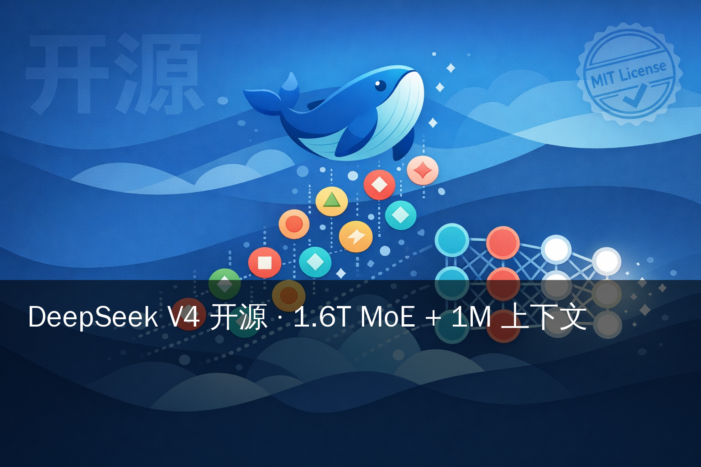
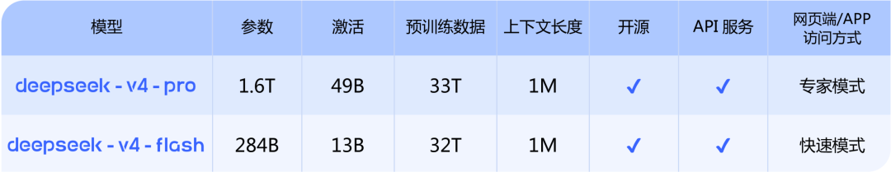
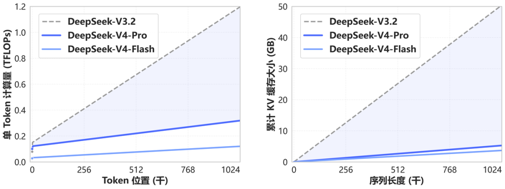
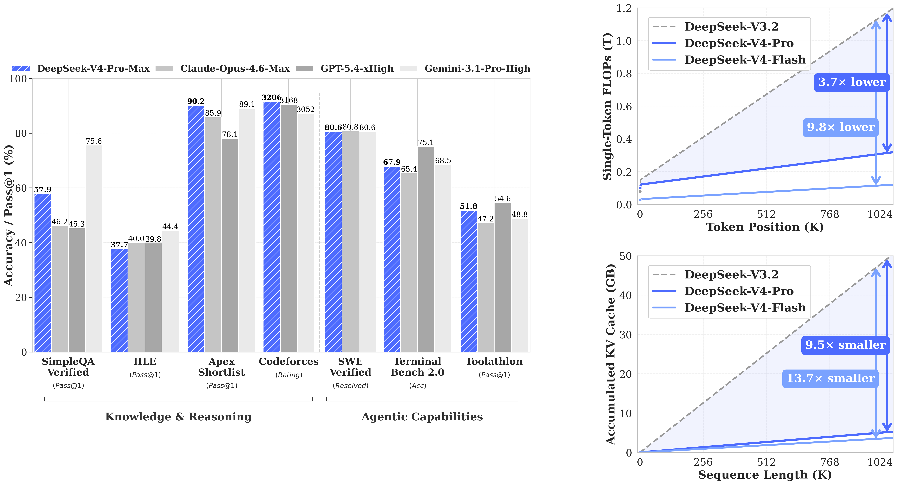
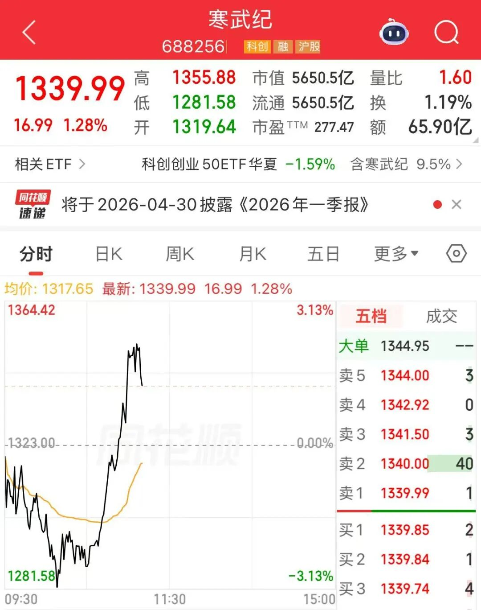
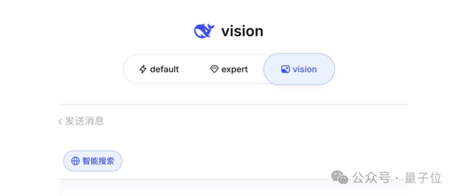
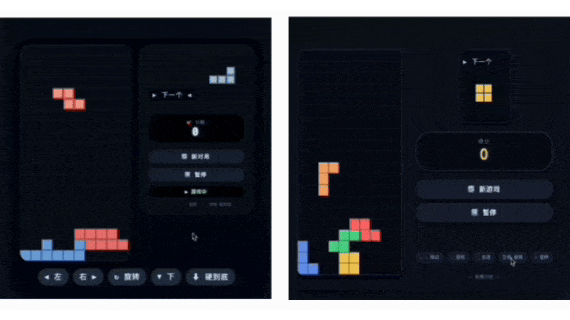

# DeepSeek V4 开源：¥24/M 输出 + 1M 上下文

> **输出价 ¥24/M，是 Claude Opus 4.7 的 1/7.5。** 2026-04-24 凌晨，DeepSeek 把 V4-Pro（1.6T 总参 / 49B 激活）和 V4-Flash（284B / 13B）双 MoE、Base 权重、Engram 长记忆模块一次性挂到 HuggingFace，License 全部 MIT。chat.deepseek.com 同步切新版，加"快速 / 专家 / 视觉"三模式开关。
>
> 真实定位不是"反超 GPT-5.4"。V4-Pro 的 SWE-Bench Pro 55.4 分，低于 Kimi K2.6（58.6）、GPT-5.4 xhigh（57.7）和 Claude Opus 4.6 Max（57.3）三家。看点是另外三件事：**1M 上下文开源独家**、**输出价 ¥24/M 是 Claude Opus 4.7 的 1/7.5**、**华为昇腾深度适配**（但未完全脱 CUDA）。



---

## 一、🆕 这次到底发了什么

**2026-04-24 凌晨，HuggingFace 同步上线 4 个 checkpoint**：

- `deepseek-ai/DeepSeek-V4-Pro`（Instruct，1.6T 总参 MoE）
- `deepseek-ai/DeepSeek-V4-Pro-Base`（1.6T 总参完整底模）
- `deepseek-ai/DeepSeek-V4-Flash`（Instruct，284B 总参 MoE）
- `deepseek-ai/DeepSeek-V4-Flash-Base`（284B 总参完整底模）

并列仓库 **`deepseek-ai/Engram`**（Conditional Memory 模块、N-gram 记忆检索）不是今天才开源——早于 V4 已存在，但随 V4 的 1M 上下文设计一起被重点推向视野。

官方口径是 "Preview"（预览版），正式版时间未公告。没有单独拆 Coder / Math / VL 变体——同一个 Pro 模型同时吃文本、代码、推理。



*图片来源：新浪财经 2026-04-24 转载 DeepSeek 官方规格对比表*

### 和 V3.2 的关键差距

| 维度 | V3.2 | V4-Pro |
|---|---|---|
| 总参 | 236B MoE | 1.6T MoE |
| 激活 | 21B | 49B |
| 上下文 | 128K | **1M** |
| FLOPs（1M 上下文） | 基线 | **0.27×**（降 73%） |
| KV Cache（1M 上下文） | 基线 | **0.10×**（降 90%） |

一年时间：总参翻 7 倍、上下文翻 8 倍、同上下文计算量压到 1/4。这才是 V4 真正的工程底色。

---

## 二、🧠 架构：1M 上下文还能降价的底层

**一年前被 V3 带火的 MLA（Multi-head Latent Attention）已经不够用。** V4 上了一套组合拳：



*图片来源：新浪财经 2026-04-24 DeepSeek 官方注意力机制图解*

### Hybrid Attention · CSA + HCA

- **CSA（Compressed Sparse Attention）**：压缩稀疏注意力，吃中短距离 token 关系
- **HCA（Heavily Compressed Attention）**：高压稀疏注意力，吃超长距离

两者混合，把 1M 上下文的注意力开销压到可工程化的量级。

### Manifold-Constrained Hyper-Connections（mHC）

超连接（Hyper-Connections）是 2024 年提出的技术——在残差连接里加权重。V4 加的 "Manifold-Constrained" 把这些权重约束在流形上，避免数值漂移。

### Muon 优化器

V4 在超大 MoE 上**大规模使用 Muon 替代 AdamW**——大部分模块跑 Muon，embedding / prediction head / mHC 参数 / RMSNorm 保留 AdamW。Muon 对参数矩阵做谱归一化，训练效率更高。此前只有 Kimi K2 在较小规模上公开验证过。

### FP4 MoE + FP8 非 MoE 混合精度

V4-Pro 的 MoE 专家跑 **FP4**（4-bit 浮点），其余层（attention、gating）跑 **FP8**。FP4 MoE 是 2026 年训练侧最激进的精度选择——同规模显存可降约 40%。

### Engram · 外挂长记忆

`deepseek-ai/Engram` 是一套 N-gram 记忆检索模块（早于 V4 开源，随 V4 重点推广）。V4 跑长上下文时从 Engram 检索历史片段，降低纯注意力的负担。它不在 V4 权重内——是**可插拔外挂**。

> V4 的"1M 上下文 + 27% FLOPs"不是单靠缩注意力缩出来的。是 CSA+HCA + mHC + Muon + FP4/FP8 + Engram 一整套组合拳。

---

## 三、📊 Benchmark：强在 Codeforces，弱在 SWE-Bench Pro



*图片来源：HuggingFace deepseek-ai/DeepSeek-V4-Pro 官方 model card · assets/dsv4_performance.png*

### 官方 HF Model Card 给的数字

| Benchmark | V4-Pro | Claude Opus 4.6 Max | GPT-5.4 xHigh | Gemini 3.1 Pro High |
|---|---|---|---|---|
| SimpleQA Verified | **57.9** | 46.2 | 45.3 | 75.6 |
| HLE（Humanity's Last Exam） | 37.7 | 40.0 | 39.8 | 44.4 |
| Apex Shortlist | **90.2** | 85.9 | 86.6 | 89.1 |
| **Codeforces Rating** | **3206** | — | 3168 | — |
| SWE-Bench Verified | **80.6** | 80.8 | 80.6 | 80.6 |
| SWE-Bench Pro | 55.4 | 57.3 | 57.7 | 54.2 |
| Terminal Bench 2.0 | **67.9** | 67.0 | 66.1 | 67.5 |
| Toolathlon | 51.8 | 47.2 | 54.6 | 48.8 |
| MMLU-Pro | 87.5 | — | — | — |
| GPQA Diamond | 90.1 | — | — | — |
| LiveCodeBench | **93.5** | 88.8 | — | 91.7 |
| MRCR 1M（长上下文） | 83.5 | — | — | — |

### 拿到第一的四项

- **Codeforces Rating 3206**：算法竞赛开源第一，超 GPT-5.4 xHigh（3168）
- **LiveCodeBench 93.5**：超 Gemini 3.1 Pro（91.7）、Claude Opus 4.6 Max（88.8）
- **Apex Shortlist 90.2 / Toolathlon 51.8**：规划与独立解题类任务领先

### 没拿到第一的四项（避免叙事带偏）

- **SWE-Bench Pro 55.4**：低于 Kimi K2.6（58.6）、GPT-5.4 xhigh（57.7）、Claude Opus 4.6 Max（57.3）三家
- **SWE-Bench Verified 80.6**：与 Claude Opus 4.6 Max（80.8）几乎持平，距 Opus 4.7（87.6）还差 7pp
- **HLE 37.7**：推理深度不如 Gemini 3.1 Pro（44.4）、Opus 4.6 Max（40.0）、GPT-5.4 xhigh（39.8）
- **SimpleQA Verified 57.9 vs Gemini 75.6**：通识准确度差距明显

> V4 强在"独立解题"（Codeforces、LiveCodeBench）。弱在"长程修 bug"（SWE-Bench Pro）和"通识准确度"。

---

## 四、💰 价格：开源前沿最低档被刷新

| 模型 | 输入 | 输出 | 缓存输入 |
|---|---|---|---|
| **V4-Flash** | **¥1/M** | **¥2/M** | ¥0.2/M |
| **V4-Pro** | **¥12/M** | **¥24/M** | ¥1/M |
| Claude Opus 4.7 | ¥36/M（$5） | **¥180/M**（$25） | — |
| GPT-5.4 xhigh | ¥18/M（$2.5） | ¥108/M（$15） | — |
| Kimi K2.6 | ~¥6.8/M（$0.95） | ~¥29/M（$4） | — |
| Gemini 3.1 Pro | ¥14/M（$2） | ¥86/M（$12） | 缓存最高 -75% |
| Qwen3.6-Max-Preview | 未公布 | — | — |

（人民币换算按 ¥7.2/$ 近似）

### 核心对比

- **V4-Pro 输出价 ¥24/M ≈ Claude Opus 4.7 的 1/7.5、GPT-5.4 的 1/4.5**
- **V4-Flash 输出价 ¥2/M**，是所有开源前沿模型里最便宜的
- 对比自家 V3.2 降幅不算大。但 V4-Pro 能力段对标 Opus 4.6 Max，价格只有它的 1/10

DeepSeek 在 SCMP 采访里留了一句："**等华为昇腾 950PR 超节点量产，下半年还会再降。**" 潜台词是——当前价格受 950PR 产能限制，不是 DeepSeek 的成本上限。

---

## 五、🏗 华为昇腾：叙事级突破，不是性能级突破

**媒体版本**：V4 是首款完全在华为昇腾（Ascend 910C 训练 + 950PR 推理）上跑的前沿级模型，"告别英伟达"。

**官方版本**：HuggingFace model card 没有明确说用了昇腾，只提"为国产芯片供应商提供了优先的 kernel 适配"。技术报告里同时保留 NVIDIA CUDA kernel。

叙事和事实之间有三道缝：

### 缝 1：推理性能仅 H100 的 60%

Tom's Hardware 引 DeepSeek 自己的数据：Ascend 910C 在相同负载下，推理吞吐仅为 NVIDIA H100 的约 60%。要追平 H100，需要多用约 1.67 倍的卡。

### 缝 2：产能紧张是真的限流

SCMP 和多家财经分析指出 V4-Pro 当前吞吐受限于高端算力供给——换句话说，V4-Pro 想全量放量，昇腾 950PR 超节点产能还不够。

### 缝 3：没有"脱 CUDA"宣言

DeepSeek 没官方声明"V4 脱离 CUDA"。技术栈同时保留 NVIDIA 和华为 CANN 两条路径——是**渐进脱钩**，不是替代。

**V4 对英伟达的真实冲击**：不在性能级（昇腾仍慢 40%），在**叙事级**——打破"前沿模型必须跑在 NVIDIA 上"的心智绑定。冲的是议价权和股价故事，不是市场份额。



*图片来源：每日经济新闻 2026-04-24《DeepSeek-V4 预览版本正式上线并开源》行情截图*

---

## 六、🥊 国产开源三巨头：V4 补了哪块位

Qwen3.6-Max 4 月 20 日首次闭源后，国产开源前沿阵营只剩三家——

| 维度 | DeepSeek V4-Pro | Kimi K2.6 | Qwen3.6-27B |
|---|---|---|---|
| 总参 / 激活 | 1.6T / 49B | 1T / 32B | 27B（Dense） |
| 架构 | MoE | MoE | Dense |
| 上下文 | **1M** | 256K | 262K（可扩到 1M） |
| License | **MIT** | Modified MIT（有用量门槛） | Apache 2.0 |
| SWE-Bench Verified | 80.6 | 80.2 | 77.2 |
| SWE-Bench Pro | 55.4 | **58.6** | — |
| 多模态 | 未披露 | 原生支持图像+视频 | 无 |
| 可本地单卡跑 | ❌（需多卡） | ❌（需多卡） | ✅（M 系列 Mac 32GB 可跑 Q4_K_M 量化） |
| 训练芯片 | 华为昇腾（媒体口径） | NVIDIA H800/H100 | NVIDIA H800 |

### 三家各守一个生态位

- **DeepSeek V4**：规模 + 价格 + 国产算力。给多卡服务器、想自托管的企业
- **Kimi K2.6**：Agent Swarm（300 子 agent / 4000 步）+ 多模态。给重度编码 Agent 场景
- **Qwen3.6-27B**：单卡可跑的 Dense 模型。给个人开发者跑本地 AI

不是互相替代，是把开源前沿的三块空白同时补齐。这是 2026 年国产开源对闭源阵营的组合拳。

---

## 七、🚀 三种入口：5 分钟上手

### 方式 1：网页端（最快，零配置）



*图片来源：量子位 2026-04-24 实测 chat.deepseek.com 新版界面*

打开 **[chat.deepseek.com](https://chat.deepseek.com)**，顶部切三档：

- **default（快速模式）** → V4-Flash，近乎即时，日常闲聊和搜索用
- **expert（专家模式）** → V4-Pro 开思考模式，复杂代码、长文档、推理用
- **vision（视觉）** → 灰测多模态模型，可传图提问

**国内直连免费**，不用科学上网。

### 方式 2：API（接到自己应用）

V4 API 同时兼容两种主流格式——

```bash
# OpenAI 格式
curl https://api.deepseek.com/v1/chat/completions \
  -H "Authorization: Bearer $DEEPSEEK_API_KEY" \
  -d '{"model": "deepseek-v4-pro", "messages": [{"role": "user", "content": "写一个 tetris 游戏"}]}'

# Anthropic 格式（model 参数兼容 Claude 生态工具）
curl https://api.deepseek.com/anthropic/v1/messages \
  -H "x-api-key: $DEEPSEEK_API_KEY" \
  -d '{"model": "deepseek-v4-pro", "messages": [...]}'
```

在 **[platform.deepseek.com](https://platform.deepseek.com)** 注册、拿 API key、充值（支持支付宝 / 微信 / 企业对公转账）。

**一个关键细节**：V4 API 就是 DeepSeek Anthropic 格式的默认 endpoint。所有用 Claude Code / Cline / 其他 Claude 生态工具的国内用户，换个 base URL 就能直接跑 V4。这是给 Claude 国内用户最友好的迁移路径。

### 方式 3：HuggingFace 下载自部署

- 模型卡：[huggingface.co/deepseek-ai/DeepSeek-V4-Pro](https://huggingface.co/deepseek-ai/DeepSeek-V4-Pro)
- Flash 版：[DeepSeek-V4-Flash](https://huggingface.co/deepseek-ai/DeepSeek-V4-Flash)
- MIT License，商用放开，无 MAU 门槛

**硬件门槛**（Flash 已是下限）：
- V4-Flash 推理：约 8×H100 或 8×910C
- V4-Pro 推理：约 32×H100（太贵）

个人开发者想本地跑，继续用 Qwen3.6-27B。V4 是企业级自托管选项。

---

## 八、👤 实测：Expert 和 Fast 差在哪



*图片来源：量子位 V4 双模式实测动图*

### 模式定位

- **Fast 模式（V4-Flash）**：走 284B 非思考档，响应近实时——对话、代码补全、搜索类任务
- **Expert 模式（V4-Pro）**：走 1.6T 思考档，先思考再输出——复杂代码、长文档、Agent 任务
- **Vision 模式**：灰测多模态，部分用户可见，稳定性未达正式版

### 官方 benchmark 映射到实测的四条经验

1. **Fast 够用的场景**：短对话、代码补全、简短搜索。V4-Flash 的 MMLU-Pro 83.0 / HumanEval 69.5 足以覆盖日常
2. **Expert 值得等的场景**：长文档摘要、多步 Agent、算法题。V4-Pro 的 LiveCodeBench 93.5 / Codeforces 3206 是它的舒适区
3. **长上下文是 V4 的硬实力**：MRCR 1M 上下文分数 83.5 领先阵营，意味着喂 500K+ tokens 文档后还能准确定位细节
4. **别押 V4 做 Agent 重任务**：SWE-Bench Pro 55.4 落后 Kimi K2.6 的 58.6。真修 bug 场景 Kimi 仍领先

### 早期媒体实测反馈（非官方数字）

量子位、第一财经、华尔街见闻等媒体在发布当天有多篇现场实测，核心结论一致：**V4-Pro 在算法 / 工具调用 / 长文档场景显著好于 V3.2，价格比 GPT/Claude 低一个数量级**，但**重度 Agent / 多步修 bug 场景仍未追平 Kimi K2.6**。
## 📌 收官

**V4 不是"国产首个超过 GPT-5.4 的编码模型"——这句话在 4/24 不成立。** SWE-Bench Pro 55.4 低于 Kimi K2.6 的 58.6。Verified 80.6 对标的是 Claude Opus 4.6，不是 4.7。

**它是什么**：国产第一个 **1.6T MoE + 1M 上下文 + MIT 开源 + ¥24/M 输出** 的组合拳。架构把 V3.2 的 FLOPs 压到 27%，价格把 Opus 4.7 踩到 1/7.5。真正的威胁不是 benchmark 分数，是 Claude / GPT 的国内替代方案第一次同时满足"性能够、价格低、开源、国产算力"四个条件。

**华为昇腾这条线**：叙事级突破已兑现（股市 +6% 拉升海光信息）。性能级兑现要等 2026 下半年产能释放。2026 全年最值得追踪的一条供应链。

**今天就动手**：打开 chat.deepseek.com 试 expert 模式，或把 Claude Code 的 base_url 切到 `api.deepseek.com/anthropic`——给自己留一条不依赖科学上网的退路。
