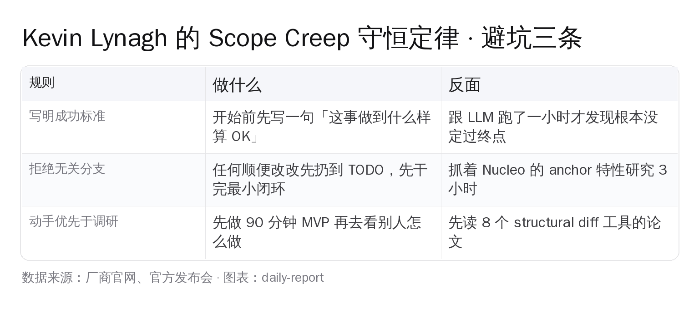

# LLM 写一小时，代码全删了——Kevin Lynagh 的"Scope Creep 守恒定律"

> **HackerNews 288 票、27 条顶层讨论，国内零翻译零解读**。Kevin Lynagh 估计"用 LLM 几小时搞定"的 Emacs 插件，最后花了一整天，LLM 写的代码**全删了**。他在 2026-04-20 的 newsletter 里甩出一句话，比任何 AI coding 教程都更值得贴在显示器边上。Kevin 是阿姆斯特丹的 UI 设计师，做过 UI 设计工具 Subform 和 ClojureScript 数据可视化库 C2。

---

## 288 票热门，一句假说点燃 HN

事件现场：

| 字段 | 实查值 |
|---|---|
| 文章标题 | On sabotaging projects by overthinking, scope creep, and structural diffing |
| 首发站 | kevinlynagh.com/newsletter/2026_04_overthinking |
| 首发日期 | 2026-04-20 |
| HN 提交 | 2026-04-24 14:28 UTC（@alcazar 提交） |
| HN 评分 | 288 分（截至 2026-04-24 20:30 UTC） |
| HN 评论 | 首屏 27 条顶层线程 |

点燃评论区的不是标题，是 Kevin 顺手丢出的一条假说：

> "Any increases in programming speed will be offset by a corresponding increase in unnecessary features, rabbit holes, and diversions."

翻过来一句话：**AI 省下来的编程时间，会被 scope creep 等量吃回去**。

听起来像抖机灵。Kevin 接着把自己当靶子，演示了这件事怎么发生。

---

## 第一幕：一个货架做完了，一个 diff 工具没开始

Kevin 最近干了两件事，对比得扎心。

**场景 A（完成）**：周末和朋友 Marcin 做厨房货架。家里剩的废料，挂钩 3D 打印。两天搞定，愉快。

**场景 B（卡住）**：给 Emacs 做"结构化 diff"工具，按语法树 diff、不按行。花 4 小时读了一圈方案——SemanticDiff、Diffsitter、GumTree（2014 年的学术方案，Java 实现）、Mergiraf、Weave、Diffast、Autochrome，还翻出了 Tristan Hume 那篇用动态规划和 A\* 设计树 diff 算法的长文。

**结果：一行代码没落地**。

Kevin 的反思很狠：

> "I'd much rather have _done_ a lot than have only _considered_ a lot."

**我宁愿做了很多，而不是只想了很多。**

区别不在难度。木工货架每块料都要现裁现切，比装个 Emacs 包复杂。区别在**成功标准**：

- 货架的成功标准是"跟 Marcin 一起做木工"——做什么都算成功
- Diff 工具的成功标准模糊——要不要支持所有语言？要不要替代现有工具？要不要做成 library 给别人用？

**成功标准不清楚，4 小时就能变成 0 行代码**。

---

## 第二幕：LLM 写了一小时代码，全删了

全文最值钱的案例。

[Finda](https://keminglabs.com/finda/) 是 Kevin 自己的老项目，文件系统模糊搜索。这次想在 Emacs 里复刻一个。同样的功能自己做过一遍，他估计**让 LLM 打辅助、几小时搞定**。

然后他掉进了坑：

- LLM 用 Nucleo（模糊匹配库）帮他接好了搜索
- 他顺手翻 Nucleo 文档，发现支持 anchor 匹配——`^foo` 只匹配行首
- **这一眼毁了他剩下的一天**
- 他开始和 LLM 一起设计路径 segment 级别的 anchor 匹配——怎么处理 `^/usr/foo`？怎么让 `foo^` 只匹配以 foo 结尾的路径段？
- 数小时跟 LLM 来回改代码、写测试
- 回过神问自己：**我一开始想要 anchor 功能吗？**
- 答案：**不**。从来没想过
- **更扎心的**：直接在 query 里加斜杠（`/foo`）就能覆盖绝大多数场景，只差"锚定到文件名末尾"这一种
- 所有 anchor 相关代码**全删了**

**一下午的 LLM 对话，git diff 里的 anchor 代码，收获为零。**

Kevin 的总结——**"Scope Creep 守恒定律"**：

> 任何编程速度的提升，都会被"不必要的功能、兔子洞、岔路"等量抵消。

LLM 的问题不是不够聪明，是**太好用了**。"顺便加一下 anchor"几分钟就能实现，你于是真的加了。

人脑稀缺的是**注意力**，不是手速。AI 把手速拉上去了好几档，注意力的总量却没涨——**省下来的时间会被全部花在不该加的功能上**。

---

## HN 评论区里最扎心的三条

bennettnate5 主楼下有两条高赞分支，再加一条另起炉灶的顶层评论。挑出来看。

**第一条**：评论者 **Kichererbsen** 自述"在某个教授讲席下工作了 12 年，见过一堆 PhD 熬论文"。他给出的生存建议非常狠——focus on finishing, reduce scope ruthlessly。

**第二条**：同一主楼下的 **sidewndr46** 用 Day 1 / Day 400 的段子把 PhD 论文通病撕开——

> 第 1 天："We aim to demonstrate the effectiveness of an existing industrial catalyst..."
>
> 第 400 天："Having thoroughly described a universal theory of everything..."

**博士生写 paper 的典型模式**：第一天立一个小 flag，400 天后变成"统一场论"。Kevin 写代码的状态，和 PhD 写论文是同一种病。

**第三条**：另一条顶层评论里，**omoikane** 提出用 game jam / 比赛当强制约束——

> 有固定截止时间，才能强迫自己"做完"而不是"想完"

对应到中国开发者更熟的场景：Hackathon 比独立项目更容易出东西，不是因为时间长，是因为**截止时间硬**。

最扎心的是另一位评论者的一句——

> LLMs enable true perfectionism.

**LLM 让完美主义真能落地**。以前想处理所有边缘 case，手速不够被迫妥协。现在 LLM 帮你打辅助，你真能全部实现。

**于是你真去实现，然后卡在边缘 case 上出不来**。

---

## 用 Claude Code / Cursor / Codex 的我们，踩的是同一个坑

Kevin 不是在黑 AI，他自己也在用 LLM。他指出的这个定律，跟中国开发者过去半年用 Claude Code 的体感**完全重合**。

三个经典场景：

**场景 1**：你让 Claude 给一个函数加一个参数。它"顺便"发现错误处理可以完善，加了 try-catch。顺便改了 logger。顺便统一了异常类型。**你让它改一行，它改了 50 行**。

**场景 2**：你让 Cursor 补一个类型。它"顺便"发现这个类型可以和另一个抽公共父类，递给你一个重构 PR。读了 10 分钟发现重构不对，commit 扔了。

**场景 3**：你让 Codex 写一个脚本，跑不通，让它修。它"顺便"把脚本改成"通用工具"，加 argparse、加 config 文件、加日志。**你原本只要一个 20 行的 oneshot**。

每一次都不是 AI 错了。AI 顺手做的每件事单独看都有道理。

**错在你没预先写死"到哪里算完"**。没有这根绳子，AI 会一路"帮你变得更好"，直到你自己忘了最初要什么。

---

## 把这三条贴在键盘旁边

结合 Kevin 原文和 HN 高赞评论，三条实操反制。

**一：开 LLM 会话前，先用一句话写死"做到什么样算完"**

Kevin 的货架能完成，是因为"跟 Marcin 一起做"就是终点。Diff 工具卡住，是因为终点没定。

翻到 AI coding 的实操——跟 Claude 开会话前，prompt 里先写死：

> "目标：给 XX 函数加一个 timeout 参数（默认 30 秒）。success criteria：函数签名加一个可选参数，所有现有调用点不变。不要做任何重构，不要改其他函数。**写完就停**。"

越严格越好。越严格越快。

**二：LLM 提"顺便改一下 XX"的所有建议，全部先扔 TODO，绝不当场做**

Kevin 掉进 anchor 坑的那一刻，是他"顺手翻了 Nucleo 文档"那一秒。翻到 anchor 功能时，正确动作是写一行 `// Nucleo 支持 anchor，未来考虑`，然后回到 Finda 搜索主线。

AI coding 里 95% 的 scope creep 都来自"既然已经改到这里了，顺便也把 XX 做了吧"。**这个"顺便"必须被制度性拒绝**。

**三：先做 30-90 分钟的最 low 版本，再决定要不要大做**

Kevin 花 4 小时研究 diff 工具。如果他先花 30 分钟写一个最粗糙的版本（按文件 diff、不做结构化分析），大概率会立刻发现"其实普通 git diff 够用"。

但研究了 4 小时之后，他已经**在理论上说服了自己这个东西很重要**。退出成本变高了。

动手成本低 → 退出成本低 → 取舍更准。
调研时间一长 → 沉没成本堆上来 → 开始为研究而研究。

---

## Kevin 没点破的那半句

Kevin 文章结尾留了一个收束：

> "Sometimes I just want a shelf."

**有时候我就是想做个货架。**

对用 AI 的开发者，这句话的 subtext 更狠——

有时候你就是想让 AI 帮你改那一行代码。不需要它顺便重构、顺便加监控、顺便写单元测试、顺便建 CI/CD、顺便补文档。

你就是想要那一行。

**管住 AI 的手不是工具问题，是产品边界问题**。

---

## 瓶颈已经换了

2026 年过了三分之一。AI coding 从 Cursor / Copilot / Claude Code / Codex / Kimi Code 到国内无数平替，手速早已不是瓶颈。

真正的瓶颈变成了——**你多快能决定"到这里就够了"**。

Kevin Lynagh 用一个木工货架和一个删掉的 Emacs 插件，把这件事讲透。下次打开 Claude Code 前，先问自己一句：

> 这次对话的 success criteria 是什么？三句话写出来。

写不出三句话，就别开这个对话。
