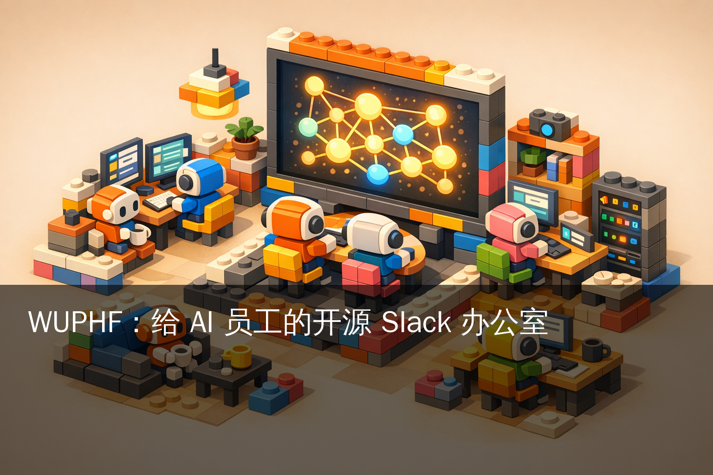
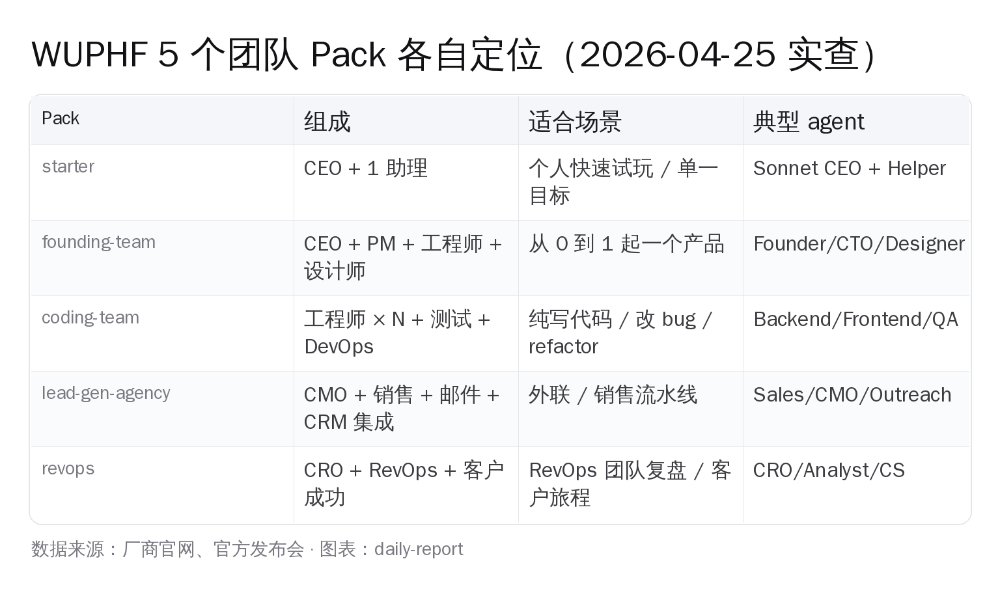
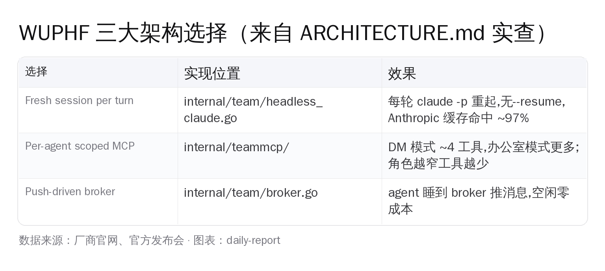
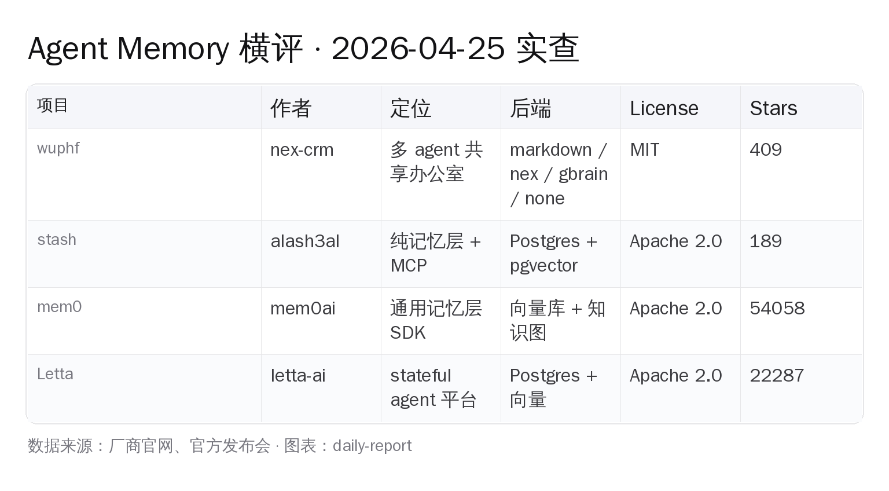
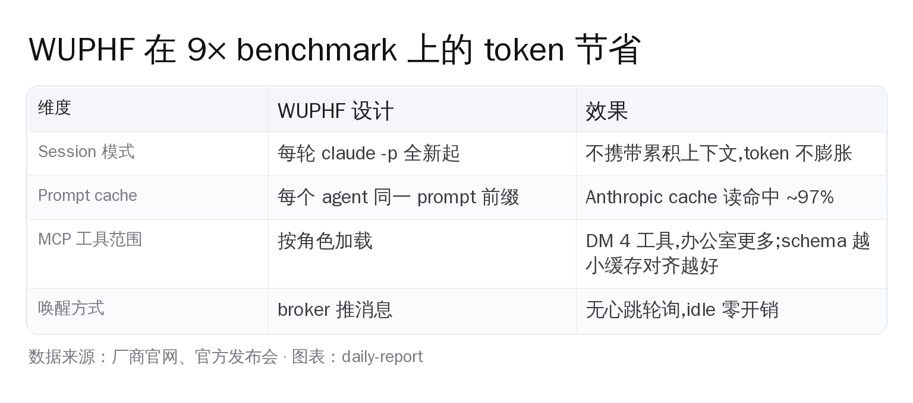

# 把 Slack 和 The Office 杂交一下：WUPHF 给 5 种 AI 员工开了一间办公室



`nex-crm/wuphf` 在 4 月 25 日 20:00 UTC 时 GitHub 上 **409 star、18 fork、11 个 open issue**——一个月前才建仓——同一晚 HN 已经把它顶到了 213 分、97 条评论的位置（展示标题完整版是 *"Show HN: A Karpathy-style LLM wiki your agents maintain (Markdown and Git)"*）。

它不是又一个 agent memory 库。`description` 字段写得直接：

> Slack for AI employees with a shared brain. Get Claudes, Codexes and OpenClaws to collaborate and do your work autonomously while never losing context.

这句话的三个限定词全都是这周的硬热点：「Slack 那种聊天频道」、「shared brain（共享记忆）」、「Claude / Codex / OpenClaw 三家 agent CLI 同台」。再叠加一句 `topics`：`agents, autonomous-agents, claude-code, knowledge-graph`——这是把 4 月之前的 mem0、Letta 那种"agent memory SDK"路线推到下一阶段：**不只是给一个 agent 一段记忆，而是给一支 agent 团队一间办公室**。

## 现状：一行命令进办公室

WUPHF 的安装是一个动作：

```bash
npx wuphf
```

仓库 README 写得很清楚——这条命令完成后，浏览器会自动开 `http://localhost:7891`，里面就是 The Office：`#general` 频道、agent 团队、下方一个 composer，跟 Slack 长得几乎没差别。前置条件只有一项："至少有一条 agent CLI 在 PATH 里"——Claude Code 是默认，加 `--provider codex` 就走 OpenAI Codex CLI，要切到 tmux 形态再加 `--tui`。

仓库给了一段非常诚实的 *Pre-1.0* 警告：`main` 每天都动，建议 fork 的人 pin 到 release tag，而不是 `main`——这是开发期产品该说的话，不是宣传稿口径。

我把当晚 20:01 UTC 的 GitHub API 响应贴在这里作为基线：

| 字段 | 值（2026-04-25 20:01 UTC） |
|---|---|
| `stargazers_count` | 409 |
| `forks_count` | 18 |
| `open_issues_count` | 11 |
| `subscribers_count` | 1（GitHub API 里 `watchers_count` 是 stargazers 的别名——历史命名 bug；真正订阅数看 `subscribers_count`）|
| `language` | Go |
| `license.spdx_id` | MIT |
| `created_at` | 2026-03-25T13:27:01Z |
| `pushed_at` | 2026-04-25T19:59:16Z（一分钟前还在 push）|
| `topics` | agents, autonomous-agents, claude-code, knowledge-graph |
| `homepage` | https://wuphf.team/ |

仓库下的核心目录是 `cmd/`、`internal/team/`、`internal/teammcp/`、`internal/agent/`、`web/`、`mcp/`、`assets/`、`bench/`、`brand/`、`claude-code-plugin/` 这一列；项目本身是 Go 实现的，CLI 入口在 `cmd/wuphf/`。README 反复用 The Office 那部 NBC 喜剧的梗——"WUPHF 就是 Slack 给 AI 员工的版本"——这是产品定位声明，不是 marketing 包装。

## 5 个 agent pack：从 starter 到 RevOps，谁先冒头给谁让位

WUPHF 第一个不像 mem0 / Letta 的地方，是它把 *角色团* 当成一等公民。仓库 `internal/agent/packs.go` 里写死了 5 套缺省团队，可以用 `--pack <name>` 切换：



`README` 在 *Options* 表里给的标准化解释是这样的：

| Flag | 作用 |
|---|---|
| `--pack <name>` | 选 agent pack（`starter`、`founding-team`、`coding-team`、`lead-gen-agency`、`revops`） |
| `--opus-ceo` | 把 CEO 从 Sonnet 升到 Opus |
| `--memory-backend <name>` | 选 wiki 后端（`nex`、`gbrain`、`markdown`、`none`） |
| `--no-nex` | 不用 Nex 后端（无 context graph、无 Nex 托管的集成） |
| `--collab` | 协作模式——所有 agent 都能看到所有消息（这是默认） |
| `--tui` | 用 tmux TUI 而不是 web UI |
| `--no-open` | 不自动打开浏览器 |
| `--unsafe` | 跳过 agent 权限检查（仅本地开发用） |
| `--web-port <n>` | 改 web UI 端口（默认 7891） |
| `--provider <name>` | LLM provider（`claude-code`、`codex`） |

读到这里很多 agent 老玩家会怀疑：5 个团队套件能不能当真？

别小看 `--pack lead-gen-agency`。它的存在意味着 WUPHF 的作者团队已经把 agent 协作的最早一批商业化场景写进默认值了——SaaS 销售、外联营销、CRM 录入这种"重复劳动密集型"任务，就是真实订单最先肯掏钱的地方。`revops` 同理。这两个 pack 也是 README 里反复出现的"这就是为什么我们做这个"的暗线。

## Memory：notebook 和 wiki 是两层东西

WUPHF 真正区别于 mem0 / Letta 的地方不是"5 个 pack"，是它的双层 memory 架构。在 README 的 *Memory: Notebooks and the Wiki* 节里写得很清楚：

> Every agent gets its own **notebook**. The team shares a **wiki**. New installs get the wiki as a local git repo of markdown articles — file-over-app, readable, `git clone`-able.

翻译一下这个分工：

- **Notebook** ＝ 每个 agent 自己的私有"草稿本"，记录 raw context、临时观察、待验证的结论。
- **Wiki** ＝ 整个团队共享的"知识库"，存放被验证过的事实、可复用的 playbook、entity 之间的关系。
- 提升路径："agent 写 notebook → 看到一条 promotion hint → agent 自己决定要不要把这条搬到 wiki"。**没有自动晋级**——每条信息升不升级，由 agent 自己判断，这是 WUPHF 故意保留的人为审查点。
- Wiki 里的每条事实会反过来指向 *最近一次记录这条信息的 agent*——这样后来的人知道该 `@mention` 谁去要更新鲜的工作进度。

仓库提供 4 种 wiki 后端：

| `--memory-backend` 取值 | 后端 | 何时用 |
|---|---|---|
| `markdown`（默认，自 v0.0.6 起） | 本地 git repo 的 markdown 知识图，存在 `~/.wuphf/wiki/` | 新装、个人 / 小团队、想 100% 离线 |
| `nex` | 接 nex-crm 的 context graph + 集成中台 | 已经在用 Nex 平台的工作流 |
| `gbrain` | mount `gbrain serve` 当 wiki 后端，要 OpenAI / Anthropic key 在 `/init` 时填 | 想要全套 embeddings + vector search |
| `none` | 关掉共享 wiki | 只想要 notebook、不想跨 agent 同步 |

注意 README 明确写了一句：选 `gbrain` 时 "OpenAI 给你 full path with embeddings and vector search，Anthropic alone 是 reduced mode"——也就是 Anthropic 单家不带 embedding 走的是降级路径。这一行在大多数 agent 文档里是不会写出来的，WUPHF 把这事儿摊在桌面上，省得后来人踩坑。

`markdown` 后端尤其值得拆开看。README 用了一段非常长的句子定义它：

> It is not just a markdown folder. It is a living knowledge graph: typed facts with triplets, per-entity append-only fact logs, LLM-synthesized briefs committed under the `archivist` identity, `/lookup` cited-answer retrieval, and a `/lint` suite that flags contradictions, orphans, stale claims, and broken cross-references.

这一段每个词都重要：

- **typed facts with triplets**：fact 不是自由文本，而是 `(subject, predicate, object)` 三元组——这是 knowledge-graph 的基础单元。
- **per-entity append-only fact logs**：每个实体（人、公司、deal）都有自己的事实日志，append-only，不允许就地修改。
- **archivist identity commit**：agent 综合多条 fact 生成的"摘要"会以 `archivist` 这个特殊身份签名 commit 进 git。读 git log 时一眼能区分"哪条是原始观察、哪条是 LLM 综合"。
- **`/lookup`**：cited-answer retrieval，给查询带回引用源——而不是 RAG 那种"我看了一些文档，你看着办"。
- **`/lint`**：跑一套类似 ESLint 的规则集，扫整个 wiki 找 contradictions / orphans / stale claims / broken cross-references。这是把 *知识库的代码 review* 变成了一等公民。

最后那句 "**No API key required**" 才是关键——`markdown` 后端等于一句话：你的所有团队记忆都是一个本地的 `git clone` 出去的 markdown 仓库。`cat`、`grep`、`git log`、`git clone` 一切照旧。这是 *file-over-app* 派的胜利。

### MCP 工具表

WUPHF 内部把 notebook 称为 `private` memory、wiki 称为 `shared` memory。在 `markdown` 后端下，每个 agent 的 MCP 工具表是这一组——

```
notebook_write | notebook_read | notebook_list | notebook_search | notebook_promote
team_wiki_read | team_wiki_search | team_wiki_list | team_wiki_write
wuphf_wiki_lookup | run_lint | resolve_contradiction
```

而切到 `nex` / `gbrain` 后端，工具表会变成 *legacy* 三件套：

```
team_memory_query | team_memory_write | team_memory_promote
```

README 注明："The two tool sets never coexist on one server instance — backend selection flips the surface."——同一台 WUPHF 永远只有一套工具暴露给 agent，不会两套并存。这是把后端做成"切换式而非叠加式"的工程决定，对维护成本是好事，对想要"一边 markdown 一边 vector"的混合方案则是个 trade-off。

更详细的 wiki schema 写在 `docs/specs/WIKI-SCHEMA.md` 和 `DESIGN-WIKI.md` 两个文件里，README 主动指了路。

## 三个不要忽略的架构决定

WUPHF 把 ARCHITECTURE.md 当成产品说明书写——一页纸搞定。我把里面三句最值钱的话提出来：



这三个选择对应仓库里三个具体文件：`internal/team/headless_claude.go` / `internal/teammcp/` / `internal/team/broker.go`。读这三个 Go 文件就能看到整个 WUPHF 的实现骨架。

### 选择 1：每轮重起 session，不用 `--resume`

`headless_claude.go` 的实现是这样的——每次 agent 收到一条新消息，WUPHF 就 shell out 一条 `claude -p "<prompt>"`，从零开始一次。**不会**用 `--resume` 把上一次的 session 接着跑。

ARCHITECTURE.md 里给出了为什么这么干：

> Combined with identical prompt prefixes, Anthropic's prompt cache gives ~97% read hit rates — the primary driver of the benchmark's token savings.

每次请求带的 prompt 前缀都是一样的（agent 的角色卡 + MCP 工具表 + 频道历史的最新一段），在 Anthropic 那边触发 prompt cache 命中。读命中率约 97%——也就是大部分前缀 token 是缓存里读出来、不重新计费的。这跟"持续追加 conversation 历史"那种思路相反：后者会让前缀越来越长、缓存对齐越来越差。WUPHF 的这个选择牺牲了"agent 自己有连续记忆"，换来的是 token 成本可控——在多 agent 协作场景下，这个 trade-off 是对的，因为记忆放在 wiki 里、不放在 session 里。

### 选择 2：每个 agent 只看到自己用得上的 MCP 工具

`internal/teammcp/` 的实现做了一件 mem0 / Letta 都没有显式做的事——按 *角色 + 上下文* 给 agent 加载工具表。README 给了具体数字：

> Per-agent scoped (DM loads 4, full office loads 27)

DM 模式（你直接私聊某个 agent）只装 4 个工具，因为 1:1 对话不需要"跨频道协作"那一套；进入 `#general` 这种全员频道时，才把 27 个工具全装上。schema 越小，prompt 越短，token 越便宜，缓存对齐也越准。

这件事的反面例子就是把 100 个 MCP 工具一股脑塞进每个 agent 的 prompt 里——既贵又乱又容易让 agent 把不该用的工具拿出来用。WUPHF 用 packs.go 把团队角色当 schema 的一维，从源头限定了。

### 选择 3：broker 推消息，agent 不轮询

`broker.go` 是一个 pub/sub + 队列。agent 不会以心跳方式去问 broker "有没有给我的消息"——而是 broker 在有消息进来时主动把它推给 agent，把 agent 唤醒。idle 时 agent 是真的睡着的，不烧 token。

ARCHITECTURE.md 还给了 7 步数据流：

1. Human 在 web UI 输入 → POST 到 broker。
2. broker 决定谁醒（focus 模式：只 CEO 醒，除非 @ 到别人；collab 模式：全部醒）。
3. `launcher.go` 给被叫醒的每个 agent 拼一份 prompt + scoped MCP manifest。
4. `headless_claude.go` 在 agent 自己的 git worktree 里 shell out 一条 `claude -p`。
5. stdout 流式回到 broker，再转发给 web UI。
6. agent 的回复里如果有 `@other-agent`，再回到第 2 步循环。
7. mutating 类型的工具调用进 `Requests` 面板等人审，除非 `--unsafe` 跳过。

第 7 条是 WUPHF 把 *人在环* 做成默认值的体现——发邮件、改 CRM、推 git 这种带副作用的工具调用必须走 Requests 面板批准，不会让 agent 在你不知道的情况下偷偷搞事情。

### 整篇 ARCHITECTURE.md 还做了两个减法声明

> No central LLM proxy, no "model router" layer.
> No conversation-persistent sessions.
> No SaaS backend.

不做"统一的模型路由"、不做"持久化对话"、不做云端后端——这是 WUPHF 跟主流 SaaS agent 平台（n8n / Lindy / 阿里云 ModelScope agent）的根本分野：它就是要做一个 *能跑在你笔记本上的 single binary*，所有数据落在 `~/.wuphf/`，全部本地。

## Bridge：Telegram、Composio、One CLI、OpenClaw

Core WUPHF 只是 broker + launcher + headless runners + worktrees。**所有外部接入都是 load-time optional**——这是 README 反复强调的 *Optional integrations*。

### Telegram bridge

直接走 `/connect` 命令、贴 BotFather 的 token、选群组或 DM。消息双向流。仓库里实现在 `internal/team/telegram.go`。

### Composio vs One CLI：两条路

WUPHF 让 agent 真正能做事（发邮件、更新 CRM）的是 *action provider*——README 给了两种：

- **One CLI**（默认，本地优先）：用本地 CLI 二进制干活。所有凭证留在本机。
  ```
  /config set action_provider one
  ```
- **Composio**（云托管）：注册 Composio 项目、生成 API key、连 Gmail / Slack / 等账号、再切回 WUPHF：
  ```
  /config set composio_api_key <key>
  /config set action_provider composio
  ```

这两个选项的取舍点是单一的：你愿不愿意把 SaaS 凭证交给第三方。One CLI 把所有 OAuth 留在本机；Composio 让 OAuth 流走 Composio 的 hosted endpoint。

### OpenClaw bridge：国内开发者会最先关心的那一项

WUPHF 给"已经在跑 OpenClaw"的玩家留了一道桥——这是这篇文章里国内开发者最会先去看的章节。原文：

> Already running OpenClaw agents? You can bring them into the WUPHF office. Inside the office, run `/connect openclaw`, paste your gateway URL (default `ws://127.0.0.1:18789`) and the `gateway.auth.token` from your `~/.openclaw/openclaw.json`, then pick which sessions to bridge.

每个 OpenClaw session 桥过来之后会成为 WUPHF 频道里的"一等公民"——可以 `@mention`、可以拉进多 agent 协作。OpenClaw 那边继续在自己的 sandbox 里跑，WUPHF 只是给了它一个共享办公室。

身份验证用 Ed25519 keypair：

> WUPHF authenticates to the gateway using an Ed25519 keypair (persisted at `~/.wuphf/openclaw/identity.json`, 0600), signed against the server-issued nonce during every connect. OpenClaw grants zero scopes to token-only clients, so device pairing is mandatory — on loopback the gateway approves silently on first use.

注意三件事：

1. 私钥落盘在 `~/.wuphf/openclaw/identity.json`，权限 `0600`——只 owner 能读，符合 SSH 私钥惯例。
2. 每次 connect 都用 server 下发的 nonce 现场签名，不是 token-replay 模式。
3. token-only 客户端拿到 *zero scopes*，所以必须走 device pairing。loopback（127.0.0.1）上首次 pairing 会自动通过——这是给本机调试开的口子。

实操对国内 OpenClaw 用户意味着什么？现在你可以让"OpenClaw 跑在国产 LLM（DeepSeek / Qwen / 通义）上"和"WUPHF 默认的 Claude Code / Codex"在同一个频道里同台。这是一个比单纯换 LLM provider 更高维度的协作——不同 model 同台辩论同一个任务，而不是切换。

## 横评：mem0、Letta、Stash 是另一类东西

WUPHF 不是 mem0、Letta、Stash 的替代品，它是上一层。当晚 GitHub API 取的实数：



- **mem0** (`mem0ai/mem0`)：54,058 ⭐ / 6,084 fork / Apache-2.0。`description` 是 `Universal memory layer for AI Agents`。**SDK 形态**——你 import mem0、调 API，给一个 agent 加长期记忆。它不管 agent 之间怎么协作。
- **Letta** (`letta-ai/letta`)：22,287 ⭐ / 2,362 fork / Apache-2.0。`description` 是 `Letta is the platform for building stateful agents: AI with advanced memory that can learn and self-improve over time`。**stateful agent 服务器形态**——前身是 MemGPT 论文，现在做成 Postgres + 向量库、跑一台 server，让 agent 在 server 上有持久 state。
- **Stash** (`alash3al/stash`)：4 月 25 日 20:00 UTC 时 189 ⭐ / 4 fork / Apache-2.0（数字会以小时级速度漂）。仓库 `created_at` 是 2026-04-24T22:05:12Z——也就是 *昨天才建仓的*，HN 当晚 155 分。`description` 字段原话：

  > Stash — persistent memory layer for AI agents. Episodes, facts, and working context stored in Postgres. MCP server included. Self-hosted, single binary, no cloud required.

  Stash 的卖点是 8 阶段 consolidation pipeline——README 拆解的具体阶段是：facts → relationships → causal links → goal tracking → failure patterns → hypothesis verification → confidence decay，再加 episode 抽取作起点共 8 段。每个阶段只处理上次跑完之后的新数据。`docker compose up` 一条命令起来，自带 MCP server，可以直接被 Claude Desktop / Cursor / Windsurf / Cline / Continue / OpenAI Agents / Ollama / OpenRouter 调用。

四个项目的真正分野：

- 你只要给 *单个 agent* 加记忆？用 **mem0**（SDK）或 **Stash**（MCP server）。
- 你要让 agent 在 server 上有持久 state、自我改进？用 **Letta**。
- 你要让 *一支 agent 团队* 在一个共享办公室里跑、同时各自有 notebook、共用一个 wiki？用 **WUPHF**。

WUPHF 真正的护城河不在 memory 层（它的 markdown 后端跟"你自己 setup 一个 git repo"差不太多），而在 *把 5 个角色团 + 双层 memory + 7891 端口的 web UI + 4 种 bridge* 全栈打成 single binary 的工程取舍。

## 国内开发者怎么用：合规 / 国产 LLM / OpenClaw

WUPHF 默认走 Claude Code 和 Codex 两条 CLI，国内开发者要落地需要先解决几件事：

1. **LLM provider**：`--provider claude-code` 和 `--provider codex` 是 README 里给的两条路。如果想接国产 LLM（DeepSeek / Qwen），最现实的路径是把 DeepSeek 的 OpenAI 兼容接口挂在 Codex CLI 后面（Codex 支持自定义 base URL）。再不行就 fork 一份，加一个 `headless_deepseek.go` 的 runner，照着 `headless_claude.go` 的模式写。
2. **数据合规**：WUPHF 的 *single-binary、本地 sqlite、wiki 落 `~/.wuphf/wiki/` 本地 git*——这种 file-over-app 的设计，对企业内部合规是很友好的：数据从来没有离开过员工电脑，不存在跨境传输问题。把这一点放在 README 第一行卖给企业 IT 是合理的。
3. **OpenClaw 接入**：国内已经在用 OpenClaw 跑 LLM 的玩家，可以直接用 `/connect openclaw` 把 OpenClaw 的 sessions 桥进来。loopback 模式下首次 device pairing 自动通过，这是为本机调试开的便利。
4. **组合套：lead-gen-agency + Composio**：要做"AI 销售员队"的国内 SaaS 卖家可以先按 `--pack lead-gen-agency` 起来，把 Composio 的账号挂上，连 Gmail / Salesforce / Slack。这种组合的人力替换价值比"我用 ChatGPT 写邮件"高一个数量级——后者只是 prompt assistant，前者是 *24×7 自跑* 的销售流水线。

注意一个负向信号：WUPHF 是 pre-1.0、`main` 每天动。如果你打算把它放到生产环境，README 自己说要 pin 到 release tag。这跟我们昨天写过的 Open-Generative-AI 是同一个状态——开源新秀、热度高、稳定性还在搭。**先在内部团队跑两周，再决定是否给客户做演示**。

## Benchmark：9× token 节省，怎么算的

WUPHF 在 README 末尾有 *Benchmark* 节，和 `scripts/benchmark.sh` 一起放出。我把架构层的逻辑拆出来——这是它能省 token 的四个机制：



简言之：fresh session per turn 让前缀稳定 → prompt cache 命中 → 省 token；scoped MCP 让 schema 短 → 省 token；push-driven broker 让 idle 不烧；prompt 中没有 conversation 历史的累积 → 不会越聊越贵。

这套设计的代价是 *agent 没有跨轮的隐式记忆*——上一轮聊过什么不会自动留在 model 的 context 里。但这正是 wiki 层补的——记忆该存的存进 wiki，不该存的就让它过去。这是把"上下文工程"从 prompt 层下沉到 *知识管理* 层的一次很标准的取舍。

## 选型建议：5 个画像

| 你是谁 | 该不该上 WUPHF |
|---|---|
| 个人玩家、想把多个 LLM 拉进一个频道辩论 | 上。`--pack starter` + `--collab` 起手即可 |
| 早期创业团队、想验证"AI 员工组"能不能闭环 | 上。用 `--pack founding-team` 跑两周看结果 |
| SaaS 销售 / 外联团队 | 重点关注。`--pack lead-gen-agency` + Composio + Gmail / HubSpot 是它最早商业化方向 |
| 已经在用 mem0 / Letta 给单个 agent 加记忆 | 不冲突。把 mem0 / Letta 留在 SDK 层、把 WUPHF 当协作层 |
| 要给生产线上线 | 现在还不行。pre-1.0、`main` 每天动、issue 11 个未关 |

如果你只想要 *记忆层、不要团队*，请直接看 Stash（189 ⭐、明天可能就到 2k）或 mem0——WUPHF 是给 *团队* 准备的方案，单 agent 用 WUPHF 是在用航空母舰运行李。

## 接下来一周的看点

1. **OpenClaw 桥接的实战故事**。国内 OpenClaw 玩家是 WUPHF 在中文圈最自然的第一批用户，预计这周会出现"OpenClaw + WUPHF 把 Qwen / DeepSeek 拉进同一个频道"的实战贴。
2. **`markdown` wiki 后端会不会被复用到非 WUPHF 项目里**。它本身 *typed facts 三元组 + git 仓库* 的设计很值得拆出来当 *任何 agent 的共享记忆库*——预计会有人把它单独剥出来发包。
3. **lead-gen-agency / revops 这两个 pack 会不会成为 nex-crm 的 SaaS 入口**。仓库 description 里挂的 `nex` backend 已经很明显地暗示了商业模式：免费 self-hosted 拉用户，托管的 nex-crm 平台收费。
4. **Stash 的 stars 曲线**。Stash 4 月 24 日才建仓，HN 当天 155 分，今天 189 ⭐。如果 4 月底冲到 2k 以上，agent memory 层的真正爆发就到了——届时这类 *MCP 原生 + Postgres + 8-stage consolidation* 的设计会被快速复制。

## 为什么 WUPHF 这种项目值得提前看

WUPHF 这类 *agent 协作 stack* 的开源项目，往往是国内厂商两到四周后才会跟进报道的方向——它不出 PR 通稿，也没有发布会，靠的是开发者自己 `npx` 跑一遍后拍桌子。

真正在写代码的开发者，4 月 25 日晚上看到 HN 213 分的帖子、点开仓库、跑过一遍 demo——这种实测信号比媒体报道领先 14 天。你今天读完，明天就能给老板做出比同行早两周的"我们要不要试试 multi-agent office 形态"的判断。

WUPHF 不会替代谁——它只是把 mem0 / Letta 那种"给 agent 加记忆"的故事抬升到了 *给 agent 团队加办公室* 这一层。下一步该看的，是这个抽象层会不会被 LangChain / LlamaIndex 这种巨头复制，还是 nex-crm 自己跑出来一个 "Slack of AI agents" 的品类老大。

留 4 月 26 日这个时间戳，半年后回头看。

---

*所有引用的数字都来自 2026-04-25 20:00-20:03 UTC 的 GitHub API + HackerNews algolia API 实查；项目状态属于 pre-1.0，`stargazers_count` / `description` 等字段会随时间变化。*
