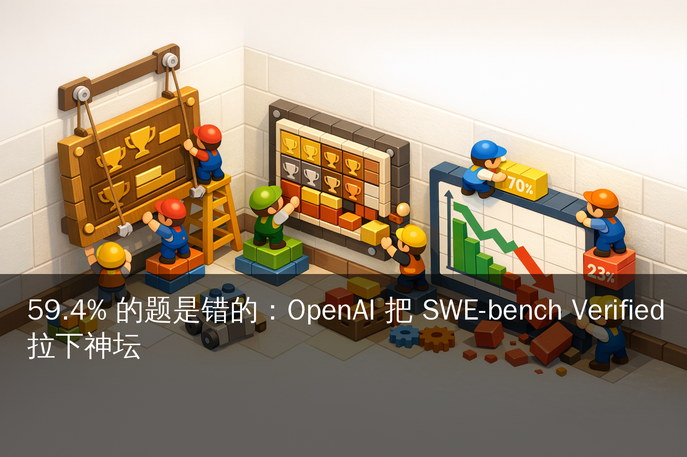

# 59.4% 的题是错的：OpenAI 把全行业卷了 20 个月的 SWE-bench Verified 摘下王冠

> OpenAI 在官博 *Why SWE-bench Verified no longer measures frontier coding capabilities* 中正式给 SWE-bench Verified 写了讣告。两个理由都很重：
>
> - 实测发现 **59.4%** 的题面带瑕疵——测试用例过严、把功能正确的解判错；
> - 所有前沿模型都能复现题面里那条 ground-truth 修复 patch，说明它们 "都在训练里见过"。
>
> 替代品 OpenAI 给出了一个，叫 **SWE-bench Pro**，由 Scale Labs 团队在 2025 年 9 月发布、4 月最新榜上 **SoTA 是 GPT-5.4 xHigh 的 59.10±3.56 分**。Verified 上模型普遍 70%+，Pro 公开榜在 2025 年 9 月首发时 GPT-5 / Claude Opus 4.1 都只有 **23.x%**。
>
> 这则官博 4 月 26 日上 Hacker News 拿到 **181 pts / 245 评论**（截至 2026-04-27 04:30 UTC+8 快照，HN 上仍在攀升中）。

写过模型 release 帖的人都知道这条数据：**SWE-bench Verified xx.x%**。从 2024 年 8 月这个榜立起来，所有家的发布会、所有家的 launch blog、所有家的 PR 稿都要附一行——这一行有时候比模型名还重要。

DeepSeek V4 上周发布，公布的也是这个：**80.6%**，比 Claude Opus 4.6 只低 0.2 分。Qwen3.6-Max-Preview 4 月 20 号发布时号称 SWE-bench Pro 等六项编码 benchmark 同时登顶。整个 AI Coding 行业，过去 20 个月有一种心照不宣的默契——发模型跑 SWE-bench Verified、跑出比上一家高 0.x 分、写在通稿第一行。

**OpenAI 4 月底说它不再相信这条数据。**

---

## 一、官博的两板斧：59.4% 错题 + 训练污染

OpenAI 在那篇博文里把"为什么不再用 Verified"拆成两件事讲：

**第一件事：59.4% 的题面有问题。** 不是题目本身错，是测试用例写得太死。OpenAI 说他们做了一次审计，发现至少有 59.4% 的任务存在 *flawed test cases*——这些测试要求实现者必须以原作者那条 patch 完全相同的方式修复 bug，但实际上大多数 bug 有多种功能等价的修法。LLM 可能给出了一个完全正确的解，但因为不是那条特定的 patch，测试会判它错。

换句话说，**Verified 在测的不是"模型会不会修这个 bug"，而是"模型猜不猜得出原作者会怎么修"**。这是两件事。

**第二件事：所有前沿模型都见过题。** OpenAI 说他们测的所有前沿模型都能在合适的提示下复现 ground-truth 那条 patch，或者说出题面里某些可识别的细节。这个意思是模型在训练阶段已经看过这套数据——SWE-bench Verified 的题面来自 12 个开源仓库的 issue + PR，公开可爬，谁都没办法不让它进训练语料。

这两件事叠起来的结论 OpenAI 写得直白：**进步分数 "increasingly reflects what a model has seen, not how well it codes"**——分数高更多反映模型见过多少题，不是写得多好。

那条社区视角更刺耳的复述出现在 The Decoder 的报道里：*"OpenAI wants to retire the AI coding benchmark that everyone has been competing on"*。这条标题本身就是新闻。

---

## 二、SWE-bench Verified：从神坛到天花板，500 题 20 个月

回头看一眼这个被 OpenAI 抛下的榜：

- **2024 年 8 月**，OpenAI 自己发布的 SWE-bench Verified，从原版 SWE-bench 的 2294 题里筛出 **500 道经过人工验证、测试稳定** 的样本子集。
- 立项目的就是修复原版 SWE-bench 的"测试不稳定 / 不可复现 / 题面歧义"的痛点。当时这条说法是：Verified 比原版可信。
- 2024 下半年开始，所有 frontier 模型的 release 都把它写进通稿。Anthropic / OpenAI / Google / Meta / 阿里 Qwen / DeepSeek / Mistral 全部上场。
- 2025 一整年里，**模型成绩从 50%+ 飙到 70%+**。2026 年 4 月 25 日 DeepSeek V4 发布时已经到 80.6%，0.2 分差距追到了 Claude Opus 4.6。
- 4 月 26 日 OpenAI 官博：**这个 80% 多 1 分少 1 分，没什么意义了。**

500 题、20 个月、80%+ 饱和——这是任何一个 benchmark 的自然生命周期。Verified 没什么好可惜的。问题在于全行业 PR 通稿都得跟着改：以后写 "我们的模型 SWE-bench Verified XX%" 等于是承认自己还在卷一个被官方 deprecate 的指标。

---

## 三、SWE-bench Pro：1865 题、41 仓库、80% 是私有数据

OpenAI 推荐的替代品是 **SWE-bench Pro**，但这套不是 OpenAI 自己做的，是 Scale Labs（Scale AI 旗下的评测团队）在 2025 年 9 月 21 日 arxiv 论文 *SWE-Bench Pro: Can AI Agents Solve Long-Horizon Software Engineering Tasks?* 发布的。论文 ID `2509.16941`。

Pro 相比 Verified 改了三件事：

| 维度 | SWE-bench Verified | SWE-bench Pro |
|---|---|---|
| 题量 | 500 | 1,865 |
| 仓库数 | 12 | 41 |
| 公开题量 | 全部 500 | 731 |
| 私有/隐藏题 | 无 | 1,134（276 私有 + 858 held-out） |
| 仓库类型 | 开源知名项目 | 商业仓库 + 早期 startup 私有代码 |
| 平均改动 | 较短 | 107.4 行跨 4.1 个文件 |
| 任务时长 | 较短 | "可能要资深工程师花数小时到数天" |
| License 反污染 | 无 | 公开题用 GPL 等强 copyleft 反爬 |

**最关键的改动是私有题集**——Scale 跟 18 家 startup 签了 partnership，从他们的真实商业代码库里抽题。这些题不公开、不可爬、不可能进训练语料。这是反训练污染的硬手段，不是社区好意做的事，是要拿 NDA 签下来的事。

公开榜（Public Set）有 731 题，覆盖 11 个 GPL/copyleft 项目。私有榜（Private Set）276 题。剩下 858 题是 held-out 的 12 个仓库——这部分也不公开评测，只在 Scale 自己的 leaderboard 上跑。

---

## 四、Pro 上模型成绩：从首发的 23%，到 4 月底的 59%

这是 SWE-bench Pro 公开榜（Public Set）截至 2026 年 4 月最新成绩，前 10 名：

| 排名 | 模型 | 得分（±标准误差） | 厂商 |
|---|---|---|---|
| 1 | gpt-5.4 (xHigh) | 59.10 ± 3.56 | OpenAI |
| 2 | Muse Spark | 55.00 ± 3.60 | （未注明） |
| 3 | claude-opus-4-6 (thinking) | 51.90 ± 3.61 | Anthropic |
| 4 | gemini-3.1-pro (thinking) | 46.10 ± 3.60 | Google |
| 5 | claude-opus-4-5-20251101 | 45.89 ± 3.60 | Anthropic |
| 6 | claude-4-5-Sonnet | 43.60 ± 3.60 | Anthropic |
| 7 | gemini-3-pro-preview | 43.30 ± 3.60 | Google |
| 8 | claude-4-Sonnet | 42.70 ± 3.59 | Anthropic |
| 9 | gpt-5-2025-08-07 (High) | 41.78 ± 3.49 | OpenAI |
| 10 | gpt-5.2-codex | 41.04 ± 3.57 | OpenAI |

> 数据来源：Scale Labs 公开 leaderboard 截至 2026-04-26 UTC 20:00 的快照。Pro 榜单更新频次比 Verified 高，下面的具体名次可能在小时级窗口内漂移。

注意几条线：

**第一，差距重新拉开了。** Verified 上排名前列的模型早已挤在 80% 上下 1 分以内 —— DeepSeek V4 80.6%、Claude Opus 4.6 80.8%、GPT-5.4 大概类似。Pro 上 #1（gpt-5.4 xHigh 59.10）比 #10（gpt-5.2-codex 41.04）多了 18 分，这才是 benchmark 应该有的分辨率。

**第二，旧分数的语义变了。** Pro 刚发布时（2025-09），最强模型 GPT-5 / Claude Opus 4.1 都跑在 **23.3% / 23.1%**（Scale Labs blog 与 v2 修订一致；arxiv 论文 v1 给的是 22.7%，后被勘误为 23.1%）。8 个月后顶尖模型已经摸到 60%。Pro 在饱和路径上，但比 Verified 的 70%+ 还有空间。

**第三，Anthropic 在 Pro 上的相对优势更大。** Verified 80% 区间 Claude / DeepSeek / OpenAI / Qwen 都挤一起 1 分内分胜负；Pro 前 10 里 Anthropic 一家占 4 席（Opus 4.6 / Opus 4.5 / Sonnet 4.5 / Sonnet 4），覆盖 thinking 与非 thinking 两档。Scale 团队在 Pro 早期阶段还在公开渠道祝贺 Anthropic 横扫 Pro 前列。

**第四，OpenAI 推荐 Pro 之外，自己还在造私榜。** 官博明说他们正在搭非公开的内部测试集，这是行业正在分裂的信号——以前一个 SWE-bench Verified 给所有人当统一比较基准，往后大概率每家用各自的私榜+Pro 的混合，PR 通稿对比起来更难。

---

## 五、Verified 80% 以后，国内厂商怎么办

这是个具体的问题。看一下国内最近几个 release 当时挂的成绩：

- **DeepSeek V4**（2026-04-25 发布，国内主流媒体已重点报道）：SWE-bench Verified **80.6%**。
- **Qwen3.6-Max-Preview**（2026-04-20 发布）：SWE-bench Pro 等六项编码 benchmark 同时登顶。
- **DeepSeek V4-Pro / V4-Flash**（4-25 / 4-26 同期）：Pro 版 SWE-bench Verified 80.6 / Flash 版 74.8。

**Qwen3.6 Max 已经先跑 Pro 了**，这是国内厂商里走得最前的。这一步走得没错——4 月 26 号官博一发，Pro 上的成绩一下子比 Verified 上的成绩"含金量"高一档。

DeepSeek V4 发布会主打 Verified 80.6 没问题，因为 4-25 那天 OpenAI 还没把官博放出来。但下一次 release（V4.x 或 V5）如果还只挂 Verified，会被国外一线开发者当 "在卷过期 benchmark"。这个口碑代价不小。

**国内厂商接下来三条路：**

1. **只挂 Pro**——Qwen3.6 Max 已经这么做了。激进但安全。
2. **Verified + Pro 双榜挂**——保留 Verified 给国内媒体看，加上 Pro 给海外开发者看。次稳。
3. **Verified + 自家私榜挂**——OpenAI 的玩法，但要求模型团队自己有评测能力。门槛高。

对**国内 AI 编程产品团队**（Cursor / Augment / 通义灵码 / CodeGeeX / Kimi Code / 文心快码 / 等下游）的影响更直接：

- 选模型不能只看 Verified 排名了。Verified 80% 上头的几个模型在 Pro 上相差 18 分，这才是"真的好不好用"。
- 如果你内部做 A/B 测试，**Pro 是更接近你产线的 distribution**——平均改动 107 行跨 4 个文件，跟实际 IDE 里 multi-file 重构的代码量量级匹配。
- 如果你在选开源模型，DeepSeek V4 / Qwen3.6 在 Pro 上的成绩比 Verified 上的更值得参考。

---

## 六、SWE-bench 不是唯一选项：可以看的另外几个榜

OpenAI 官博只推 Pro 一个，但行业里 benchmark 不止这一条。给做 AI coding 工具的团队列几个并行参考：

**Aider Polyglot Benchmark** — Aider 维护，针对多语言（C++/Python/Rust/Go/Java/JS/TS 等）真实 issue 修复的混合语言评测。比 SWE-bench 的 Python 单语言深，更接近 polyglot 团队的实际场景。

**Terminal-Bench 2.0** — 评测模型在终端环境下完成长任务的能力（不止 PR 修复，还有 git / docker / shell 一系列动作）。Qwen3.6-Max 在这上面也登顶过。

**LiveCodeBench** — 针对从 LeetCode / Codeforces / AtCoder 抓的题，按时间窗滚动更新（解决 contamination 问题的另一种思路）。

**SWE-rebench** — 学术界对 Verified 题面做更严格 re-grading 的版本，Pro 出来之前是较权威的"修订版"。

**国内 benchmark：BuildFastWithAI 系列** — 国内团队维护的多 benchmark 综合榜，覆盖 SWE-bench Pro / Terminal-Bench 2.0 / SkillsBench / QwenClawBench / QwenWebBench / SciCode 六项，Qwen3.6 Max 4 月 20 号在上面拿过六项登顶。

选哪个看你做什么：
- 如果你是模型厂商，Pro 是 SWE-bench 系列的"接班人"，必须挂。
- 如果你是 AI coding IDE 产品，**Pro + LiveCodeBench 双指标**更稳——前者管"复杂修复能力"，后者管"防作弊+时间相关"。
- 如果你是企业内部团队选模型，**自己用线上 issue tracker 抽 50-100 题做 micro-eval** 比看任何公开榜都准。OpenAI 在官博里也强调了这条 path。

---

## 七、SWE-bench 的退役给行业留下的事

最后一点小总结。这场 benchmark 切换不是 OpenAI 一家在做，是整个 AI Coding 评测体系在重组：

- **饱和的指标会贬值。** Verified 上那 0.2 分差，过去半年里所有家在朋友圈和发布会上吹的"Coding 实力领先"，4 月 26 日之后失去了一半的说服力。
- **训练污染是无解的副作用。** 任何公开 benchmark 上线 18 个月以上、被多家厂商反复跑过、题面在 GitHub 公开可爬——基本都会污染。这是 Pro 用 GPL copyleft 反爬 + 私有题集来扛的方向，但其他 benchmark 没这个能力。
- **每家自己造私榜会成主流。** OpenAI 已经在搭。Anthropic / Google 的内部 eval 集合大概率也已经有了，只是不公开。这意味着发模型时的"客观横评"会越来越难做。
- **细分场景的小 benchmark 会冒头。** Aider Polyglot、Terminal-Bench、CodeForce 类——以及更细分的"Rust 重构"、"DBMS 内核"、"前端组件迁移"这种垂直 benchmark。

对国内开发者最实用的一条：**下次看到一家 AI 模型公司说 "SWE-bench Verified XX% 行业第一"，回头问一句 "Pro 上跑了吗？多少分？"**。这句话现在能用。

---

*题图：SWE-bench Verified 卸下王冠的概念配图（PIL 自动生成）*

*相关阅读：*
*- 4-25 日报《DeepSeek V4 开源：¥24/M 把 Opus 踩到 1/7.5》*
*- 4-22 日报《Qwen3.6-Max-Preview 闭源化 + 六项编码 benchmark 登顶》*

