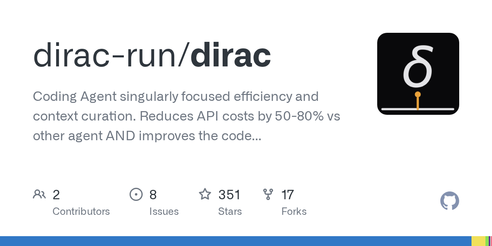
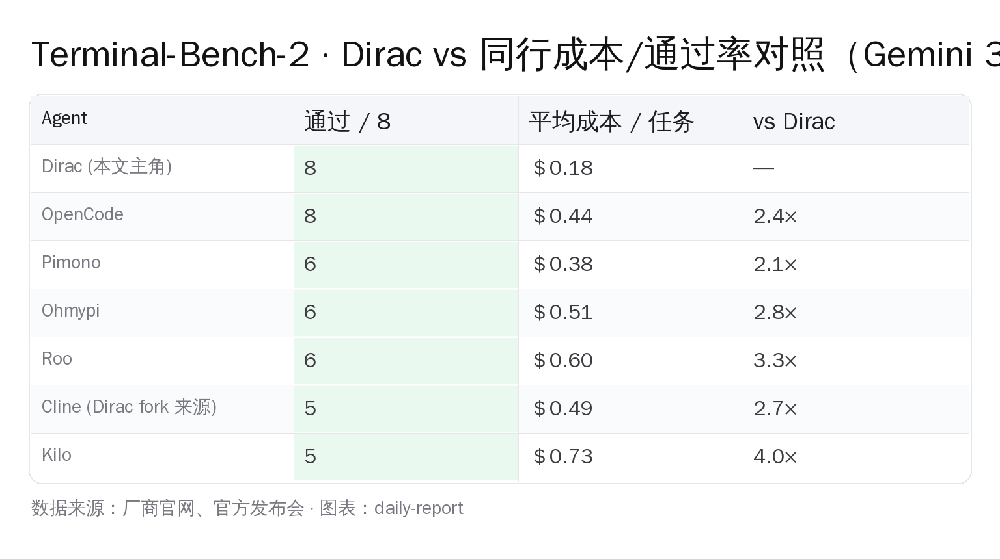

# 65.2 vs 64.3：一个 4 月才建库的 OSS 小作坊把 Junie CLI 顶下榜

> Terminal-Bench-2 的 `gemini-3-flash-preview` 子榜 4 月 27 日刷新：第一名 **Dirac 65.2 分**，第二名 **Junie CLI 64.3 分**，第三名 Google 自家 official baseline **47.6 分**。
>
> 抢到第一的 Dirac 是个 4 月 5 日才在 GitHub 建仓的开源项目，**截至 2026-04-28 04:00 UTC+8 仓库 527 ⭐ / 21 fork**（仍在攀升），Apache 2.0 协议，作者明说自己 fork 自 Cline。
>
> Show HN 4 月 27 日上 Hacker News 拿到 **263 pts / 99 评论**（HN 47920787，快照仍在攀升）；作者自测的 8 题任务样本里，**Dirac 每题平均成本 $0.18，同期 OpenCode $0.44、Cline $0.49、Pimono $0.38、Roo $0.60、Kilo $0.73**——把"贵 2 到 4 倍"这件事算成了同一张表里看得见的事实。

Terminal-Bench 过去半年是 frontier 模型 launch 通稿最爱盯的 agentic benchmark。

它要求 agent 在真实终端里跑一连串带依赖的 shell + 代码操作。跟 SWE-bench 那种"读 PR、写 patch"的纯代码题完全是两个量级的工程任务。

JetBrains 2025 年下半年把自家 IDE 内的 AI 助手 **Junie 拆出 CLI 版本**，挂上了 Terminal-Bench-2 常胜军位。Google 4 月初放出 Gemini 3 Flash 时，自家 Gemini CLI 跑出 baseline 47.6 分。

**4 月 27 日发生的事是：一个独立开发者把 Gemini 3 Flash Preview 同一个模型套了一层自己写的 harness，跑出 65.2 分。**

比 Junie 高 0.9 分，比 Google 自家高 17.6 分。

99 条 HN 评论的主基调一致：harness 这一圈的工程，比换更大的模型更重要。

代表性发言之一来自评论者 deskamess：*"I always wondered why AST's were not more of a part in both editing and scoping of changes/parsing code."* —— AST 这件事早该被 agent 工具圈重视。



*图片来源：opengraph.githubassets.com 实时生成的仓库 OG 卡片快照*

---

## 一、Terminal-Bench-2 这条线，凭什么值得看

Terminal-Bench-2 由 harborframework 团队 2025 年下半年发布，覆盖 50+ 真实终端任务。

里面既有"装一个有依赖冲突的 Python 包"、"把 npm 包升级到指定版本还能让测试跑"，也有"在某 vscode fork 仓库里改一个按钮快捷键并保证编译通过"这类纯工程操作。

跟 SWE-bench 比，Terminal-Bench-2 三个特征：
- **端到端任务**——不是给 PR 写 patch，是给 fresh shell + 一个目标，agent 自己 `ls` / `cat` / `git log` / `npm install`；
- **失败成本可见**——每条任务标注 token 成本（input + output + cached），堵死"砸 100 倍 token 换 1 分准确率"的刷法；
- **leaderboard 公开但人工审核**——提交人要把跑日志整体上传 HuggingFace 数据集，社区可查。

Junie CLI 4 月初的 64.3 是这套流程审过的。Dirac 4 月 27 日交的 65.2 走的是同一道审核——不是"作者自测"。

> *快照说明*：本文引用的 Dirac 65.2 / Junie 64.3 / Google official 47.6 来自 2026-04-27 当天 HuggingFace 数据集 *harborframework/terminal-bench-2-leaderboard* 的提交贴 + 社区 discussion + Show HN 帖。具体排位数字仍可能在 8-10 天的后台审核期内调整。

---

## 二、Dirac 凭什么便宜 2.8 倍：四件事拆开讲

0.9 分的领先没那么戏剧。**真正炸裂的是成本——便宜 2.8 倍。**

Dirac README 里贴了一张内部 8 题对照表：同样 8 道任务（来自 transformers / vscode / django 三个项目的真实 issue），用 Cline / Kilo / Ohmypi / OpenCode / Pimono / Roo 这 6 个主流开源 agent 跑一遍，再用 Dirac 跑一遍，**数字一字未抹**：



*图片来源：根据 Dirac 仓库 README 的 8 题 cost 表手工整理 PIL 渲染*

读完这张表能说清楚两件事：

**第一，通过率 Dirac 8/8 不是孤例，OpenCode 也是 8/8。** 真正拉开差距的是平均成本——Dirac $0.18，OpenCode $0.44。同样跑通，Dirac 花 OpenCode 的 41%。

**第二，便宜不是用通过率换的。** 8 道题里 Dirac 每道都是最便宜或并列最便宜的那个，没有"我便宜但只跑通 6 道"这种 trade-off。

那作者怎么把成本压下去的？README 里写了四件事：

### 1. Hash-Anchored Edits（哈希锚点编辑）

传统 agent 改代码用"行号 + 内容"定位——`第 47 行的 const foo = 1 改成 const foo = 2`。LLM 一次改十几行，文件中间一动行号就全废。

Dirac 改用"行内容稳定哈希"作为锚点。每行先算一次哈希，agent 输出 patch 给的是 `hash:abc123 → 新内容`，不依赖行号。

同一次 LLM 调用可以原子地改十几个位置不互相打架，**不用回 LLM 二次确认**。

### 2. AST-Native Precision（语法树感知）

内置 AST 解析支持 TypeScript / Python / C++。Dirac 不把整个文件甩给模型，而是先解析成语法树，只把"被请求修改的那个函数 + 它依赖的符号"切出来塞进上下文。

README 把这件事写成产品承诺——**"100% 句法准确率"**：只要 patch 应用了，结果一定能编译通过，不会出"AI 漏写一个括号让整个文件 syntax error"的低级翻车。

### 3. Multi-File Batching（多文件批量）

跑一次 Terminal-Bench 任务通常要改 8-25 个文件。同行做法是"一个 LLM 调用改一个文件"——25 个文件就 25 次往返。

Dirac 把多个文件打包到**同一次 LLM 调用**，让模型一次产出 N 个 patch。HN 评论提到这一招配合 prefix caching 能让 token 成本再砍一半（Anthropic 缓存命中是原价 10%）。

### 4. High-Bandwidth Context（高带宽上下文）

作者写得抽象，能总结的是三条工程实践：
- **文件骨架先抽**——大文件压成"类 + 函数签名"再喂模型，避免每次都贴整个 1000 行；
- **递归符号依赖追踪**——改一个函数先找谁调用它，把调用方一并塞进上下文；
- **SQLite 增量索引**——项目变化只 reindex 改动部分，不重解析整库。

> Dirac 没改模型，改的是"模型外面那一圈"。这一回合 harness 论赢了。

---

## 三、Cline 的影子：fork 来源与丢失的 git history

诚实讲一件事：**Dirac 不是从零写的，作者自己在 README 标注 *"Dirac is a fork of the Cline project"*。**

Cline 是过去一年开源 coding agent 圈最有口碑的那一支——VS Code 扩展 + 全 model provider 通吃，2024 年 7 月起步，截至 2026-04-28 已经攒到 GitHub 61k+ ⭐。Dirac 在它基础上做了上面四件事的工程改写，把代码、测试、文档全重写了一遍。

HN 评论区两种声音——

**第一种**：fork 没问题，Apache 2.0 允许。但 Dirac 的仓库**没保留 Cline 的 git 历史**——`git log` 第一条 commit 是 2026-04-05 "Initial commit"，看不到从 Cline 哪里来、改了什么。Apache 2.0 下"合规但不优雅"，社区追溯哪几行变过很难。

**第二种**：这是常见做法。需要"彻底重组目录结构 + 改命名"的 fork，保留 git history 反而让新仓库前 200 个 commit 全是 Cline 旧代码。新建仓 + README 显式 acknowledge 已经是行业惯例。

**我站第一种**：真正能让社区信任的开源项目应该保留来源，特别是当你 fork 的是另一个活跃维护的项目。这件事不影响 Dirac 自己写的那部分代码的工程价值，但影响项目治理诚意。

---

## 四、Show HN 评论区：harness 论 vs model 论

99 条评论的主线是"这件事到底证明了什么"。

**harness 论**：作者 GodelNumbering 在自家 Show HN 帖里把 Dirac 对 Junie 的 0.9 分领先 + 对 Google 自家 47.6 baseline 的 17.6 分领先，**全部算给 Hash-Anchored Edits / AST 解析 / Multi-File Batching / High-Bandwidth Context 这四件 harness 工程**——模型没换，模型外面那一圈做精了。

支持这条的评论占多数，理由集中在两件事：(1) 同一模型同一 prompt budget 下能拉开 17.6 分，证明 harness 还远没被业界做到天花板；(2) AST 这件事早该被 agent 工具圈认真当一回事，不是另一个加大模型能解决的。

**model 论**（怀疑派）：

- 多名评论者质疑 65.2 这个分数只在 Gemini 3 Flash Preview 上跑过，Sonnet / Opus 上换个模型差距可能塌掉。作者 GodelNumbering 直接坦白：*"I have only done functionality testing, no benchmark testing on Opus (decided to pay my rent instead)."* 关于 Sonnet 也只补一句 *"I did limited testing using Sonnet on CC vs Sonnet on Dirac. I could not confirm the costs however."*——意思是没钱跑全量 benchmark；
- 另一条质疑是 Hash-Anchored Edits / AST manipulation 不算新东西，OpenCode 之前就有部分实现。社区其他 commenter 的反驳是：OpenCode 没把这几件事**同时**做精，Dirac 是工程组合的胜利不是单点创新。

**telemetry 争议**（小但重要）：

评论者 adyavanapalli 直接报警：*"I had a chance to look at this and noticed you were sending telemetry to an endpoint you control: https://dirac.run/v1/event... it's opt out too. Sorry, it's no go for me."*

作者 GodelNumbering 的回复**没有承诺改 opt-in**，只解释源头：*"Since it is a Cline fork, the telemetry mechanism is inherited... There is no evil purpose behind it nor does it create or store any PII."* —— 是从 Cline 继承的，不存 PII。

社区还在等一句"会改 opt-in"。这个回复目前没出现。

---

## 五、能装能跑：CLI、VS Code 两条路 + 8 家 LLM provider

Dirac 给开发者的接入路径两条：

**CLI 路径**

```bash
npm install -g dirac-cli
dirac auth                       # 配置 LLM provider key
dirac "重构 auth 模块"             # 直接接任务
dirac -p "把这个函数改成 async"     # plan 模式：先讲思路再动手
dirac -y "格式化所有 Python"       # auto-approve 模式
git diff | dirac "review 一下这次改动"
dirac history                    # 翻历史任务
```

**VS Code 扩展路径**

VS Code Marketplace 上搜 `dirac-run.dirac`，安装后跟 Cline 体验完全一致——侧边栏有 chat 面板，点对话框开任务，所有文件改动 diff 在编辑器里 review，approve 后才落盘。

**LLM provider 列表**

README 里挂了八家：Anthropic / OpenAI / OpenRouter / Google Gemini / Groq / Mistral / xAI / HuggingFace。环境变量名一眼能看懂：`ANTHROPIC_API_KEY` / `OPENAI_API_KEY` / `OPENROUTER_API_KEY` / `GEMINI_API_KEY` / `GROQ_API_KEY` / `MISTRAL_API_KEY` / `XAI_API_KEY` / `HF_TOKEN`。

**两个值得拎出来的点**：

1. **Dirac 不支持 MCP**。README 写得直白：*"Dirac uses native tool calling exclusively. MCP is not supported."* 作者论点是 native function calling + 自家 schema 比 MCP 那层抽象要快、要省 token；
2. **Gemini 直连有坑**。Dirac 当前只支持 API key 接入 Gemini，Google AI Studio 个人账号 SSO 鉴权流程没接。HN 评论里也有用户报告 GPT-5.5 升级后接入挂了、GPT-5.4 仍能用，作者尚未在帖子里公开回应。

国内开发者：**优先用 OpenRouter 或国内中转网关接 Gemini 3 Flash Preview**。直连官方 API 仍需科学上网 + 国际信用卡。

---

## 六、必须讲的坑：6 件 Dirac 没那么完美的事

把 README + HN 评论里能查到的"问题项"列一遍：

1. **跨模型泛化未验证**。65.2 分只在 Gemini 3 Flash Preview 上跑过，Claude Opus 4.7、GPT-5.4、DeepSeek V4 系列全都没数。作者自己承认。
2. **Cline git history 缺失**。前面讲过，社区追溯不友好。
3. **Telemetry 默认开启**。社区在催改 opt-in，作者只回了"是从 Cline 继承、不存 PII"，没承诺改默认值。
4. **Gemini OAuth 不支持**。必须 API key，不能用 Google AI Studio 个人账号 SSO。
5. **GPT-5.5 接入有用户报告挂了**。HN 评论区用户反馈，GPT-5.4 仍能跑，作者未公开回应。
6. **leaderboard 公审延迟**。HuggingFace 数据集那边 8-10 天排队，截至 2026-04-28 04:00 UTC+8 Dirac 提交仍在 *harborframework/terminal-bench-2-leaderboard* 的 review 队列里——意思是 65.2 分**当前社区可验，但还没进 leaderboard 表头**。

**最大那一坑是第 1 条**：跨模型泛化未验证。

哪天有人用 Claude Opus 4.7 重跑得到 70%+，harness 论就坐实了。换个模型差距塌成 0.5 分，65.2 就只是"Gemini 3 Flash Preview 这一个模型上的工程胜利"。

---

## 七、Gemini 3 Flash Preview 这条线，单独值一段

Dirac 的成绩离不开 Gemini 3 Flash Preview 本身。

模型 2025 年 12 月 17 日由 Google 发布到 Gemini CLI，**SWE-bench Verified 78%、跑速比 Gemini 2.5 Pro 快 3 倍、价格不到 Gemini 3 Pro 的 1/4**。

> 原话引自 Google Developers Blog 12 月 17 日帖：*"Achieves a SWE-bench Verified score of 78% for agentic coding, outperforming not only the 2.5 series, but also Gemini 3 Pro."*

注意**是 SWE-bench Verified 78%，不是 Pro 78%**。前两天我们刚写过 OpenAI 把 Verified 摘下王冠那篇——Verified 上 78% 的解释空间有限。Flash 在 agentic coding 上跑得比 3 Pro 还稳，这是 Google 那篇博文反复强调的事。

**Dirac 选它跑 benchmark 的三个理由**：
- 推理速度快——Terminal-Bench-2 跑一次 50+ 任务，慢模型十几小时；Flash 三倍速压到 4 小时内；
- 成本低——价格不到 3 Pro 的 1/4，配上 Dirac harness 优化，单题成本压到 $0.18；
- 单模型对照——能跟 Junie CLI、Google official baseline 在**同一个模型**上比，剔除模型差异这条变量。

反过来——**这同时是 Dirac 当前的最大局限**。

harness 优势只在快模型 + 短上下文场景被验证过。复杂多轮任务（比如 SWE-Bench Pro 那种 41 仓库 1865 题的私榜）能不能保住同样优势，目前没数据。

---

## 八、给国内开发者团队的实操建议

四件事直接照做。

**第一件事：把 Dirac 装上，先跑 1 天**

```bash
npm install -g dirac-cli
export OPENROUTER_API_KEY=sk-or-...      # 推荐：OpenRouter 国内中转，规避 Gemini 直连
dirac auth
dirac "把当前 repo 的 README 翻译成中文并保留所有代码块原样"
```

OpenRouter 5.5% 手续费，但避免了 Google AI Studio 直连的科学上网 / 国际信用卡两件事。⚠️ 海外 API。阿里云 / 火山引擎国产网关支持 Gemini 3 Flash Preview 时，优先国产网关。

**第二件事：跟自己手上的 agent 横评**

别信 65.2 分这个孤证。跑 5-8 道你日常工作中最痛的 PR 任务——比如"把这个 React 组件迁移到 React 19 的新 hook"、"给这段 Go 代码补全 unit test"。

**用 Dirac、Cline、自家 Cursor 各跑一遍**，记录三件事：通过率、token 成本、人工干预次数。Dirac 真在你的代码场景上保住"便宜 2 倍 + 通过率不掉"，就升 daily driver。

**第三件事：把 Hash-Anchored Edits 概念搬到自家 prompt**

不用 Dirac 也行。把"用稳定锚点定位"作为 prompt 工程心智模型：让 Cursor / Cline 在 patch 前先回报"我打算改的位置，用前后 N 行作为唯一锚点"，再做修改。

这一招在 Cline 主线版本里也能 prompt-engineering 出来 70% 的效果。

**第四件事：跟踪 Pro 验证、Telemetry、Cline upstream 这三条线**

* SWE-bench Pro 上有没有人用 Dirac 跑出 23% 以上——这是 cross-benchmark 验证；
* Telemetry 默认值改没改成 opt-in——这是项目治理诚意；
* Cline 那边有没有起诉 / 抱怨 / 收编 Dirac 的工程改写——这是 OSS 生态走向。

任何一条出大动作，再决定要不要把它推荐给团队。

---

## 编辑说

写过 Cline 那阵的开发者都记得它前一年的姿态：**模型不重要，harness 决定一切**。

Dirac 用 4 月 5 日新建的仓 + 22 天工程冲刺，把这条 thesis 量化成了 17.6 分（vs Google official）和 0.9 分（vs Junie CLI）两段距离。

但这不是"小作坊干翻巨头"的好故事——代码 50% 来自 Cline、benchmark 只在一个模型上验过、telemetry 默认开。**这些 caveats 跟 65.2 分一起讲才完整。**

**下一步动作判断**：

- 团队当前用 Cursor / Cline 且月成本 > $200——立刻派 1 人花半天，按"第二件事"跑横评，便宜 2 倍是真就切；不真就退；
- 团队用免费层 / 个人开发者——先观望 7 天，等 telemetry 默认值改成 opt-in、再装；
- 关注 OSS 生态——盯两条线：Sonnet/Opus 跨模型数据、Cline upstream 反吸收 Hash-Anchored Edits 进度。任意一条出大动作，再做下一轮判断。

---

*快照时间：2026-04-28 04:00 UTC+8 · 数据源：Dirac 仓库 README / dirac.run 官网 / Hacker News item 47920787 / Google Developers Blog 2025-12-17 / HuggingFace 数据集 harborframework/terminal-bench-2-leaderboard discussion #145。本文所有 LLM provider 接入流程仅供参考，国内用户请优先选择支持 Gemini 3 Flash Preview 的国产 API 网关。*
