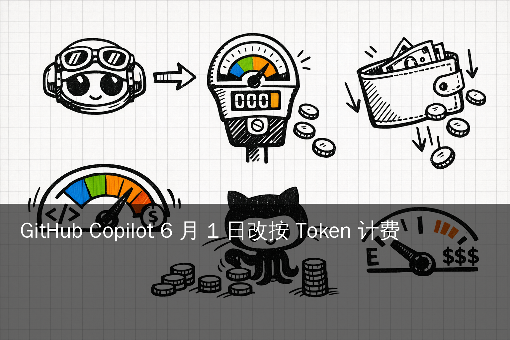
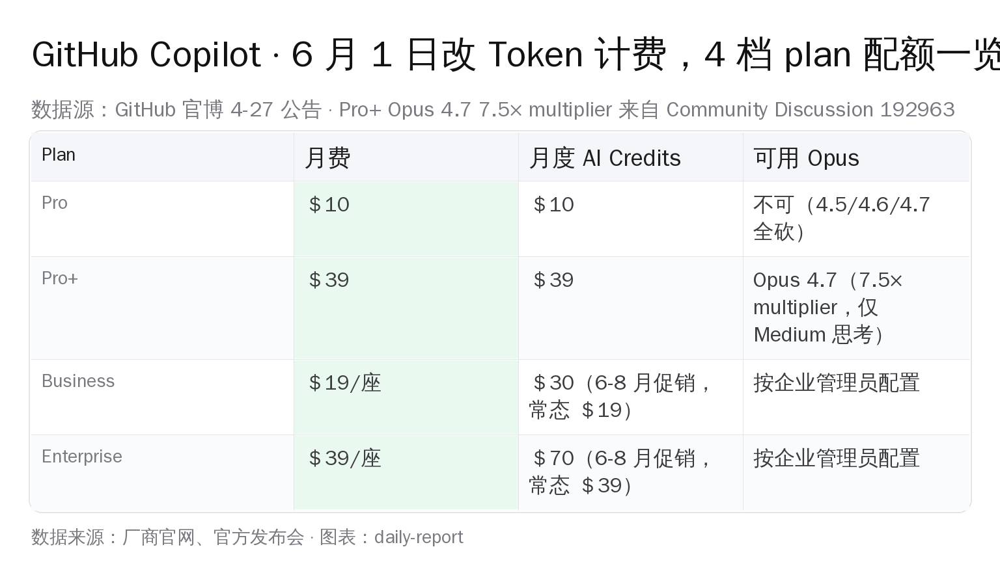

# 6 月 1 日，GitHub Copilot 改按 Token 计费——AI 编程订阅时代终结

> **6 月 1 日起，所有 Copilot plan 改按 token 计费**——这是 GitHub 4-27 官博的硬话。
>
> Pro $10 / Pro+ $39 / Business $19/座 / Enterprise $39/座，**月费数字一字未改**。
>
> 但 PRU（premium request units）整套废弃，换成 **monthly AI Credits**——USD 金额=月费金额。
>
> Hacker News item 47923357 上 **391 pts / 305 评论**仍在攀升，最热那一档评论里有一条把现状框得很清楚——评论者 my002：*"The era of subsidised inference is truly ending. The new model multipliers seem like a huge leap, though. From 1x to 6x for new-ish GPT and Sonnet models. 27x for Opus..."* —— 补贴时代真的在终结，新乘数从 1× 跳到 6×（GPT/Sonnet 系）、跳到 27×（Opus 系）。

---

公告 *GitHub Copilot is moving to usage-based billing* 把改动说全了。

Code completions / Next Edit suggestions 仍包含在 plan 里，不再扣 credit。其余所有模型调用按 input + output + cached token 各自的 published API rate 扣 credit。**fallback 到便宜模型的兜底机制取消**。

同步发布的 *Changes to GitHub Copilot Individual plans* 把刀子说得更直白：**Pro 移除 Opus 4.5 / 4.6 / 4.7 全系，Pro+ 只保留 Opus 4.7 且套 7.5× token multiplier**。Pro / Pro+ / Student plan 自 **2026-04-20** 起暂停新签约，已订阅用户 5-20 之前可申请退款。

**$10/月的 Copilot Pro，过去一整年实际让 Microsoft 亏麻了**——这是写过 Cursor / Claude Code / Codex 帐单的人都心知肚明的事。HN 47923357 评论者 hakunin 算了一笔实账：*"You were able to use over $500 worth of Opus on a $10/mo Github plan easily, no hacks... At 100 requests/mo, each easily reaching $5, that's easy $500 worth of tokens."* —— $10/月配额过去一整年能换出 $500 等价 Opus token。$10 月费 cover 不住高频用户的单月成本。

订阅时代的逻辑是"高频用户养低频用户"。agent 时代每个用户都变成高频，没人在补贴谁。**4-27 这条公告是整个"$10-$30 月费 AI Coding"商业模式的拐点**。

*图片来源：根据 GitHub 官博 4-27 公告 + Community Discussion 192963 整理 PIL 渲染*

---

## 一、6-1 当天实际生效的 5 件事

5 件硬改动，按官博 + Community Discussion 192963 + 配套博文整理。

**第一，订阅价不变，配额单位换了**。

Pro $10、Pro+ $39、Business $19/座、Enterprise $39/座——标价数字一字未改。

改的是配额单位：PRU 整套废掉，换成 **monthly AI Credits**，USD 金额=月费金额。

Pro 用户每月拿 $10 等价 AI Credits，Pro+ 是 $39，Business 是 $19/座，Enterprise 是 $39/座。Business / Enterprise 在 6-8 月有促销加码——Business 配 $30、Enterprise 配 $70。9 月归回 $19 / $39。

**第二，token 怎么扣 credit 跟 API 价对齐**。

GPT-5.4 的官博例子是 **$2.50 per million input tokens、$15 per million output tokens**，跟 OpenAI 公开 API 价基本一致。Anthropic Opus 4.7 是 *$5/M input, $25/M output*。

换算口径很简单：1 credit = 1 USD 等价。Cached token 也按 published rate 算，Anthropic 缓存命中 0.10× 折扣照搬。

**第三，fallback 机制取消**。

旧版 Pro 用完 PRU 会自动 fallback 到便宜模型（Sonnet 切 GPT-4o-mini）继续给免费 completion。**6 月 1 日起这条兜底没了**。

AI Credits 用光只剩三条路：等下月配额、开 spend cap 加钱、升级 plan。

> 官博原话："Fallback experiences will no longer be available."

**第四，code review 开始扣两份钱**。

6 月 1 日起，Copilot code review **同时消耗 GitHub Actions minutes 和 AI Credits**。之前只扣 PRU。

代码 review 的运行时小成本现在显式化。对企业用户来说是新增成本项。

**第五，Pro 模型阵容大砍**。

**Opus 4.5 / 4.6 从 Pro+ 移除并彻底从 Pro 移除**；Opus 4.7 只在 Pro+ 保留，且套 **7.5× token multiplier**。

7.5× 的实际效果：1 credit 只换到原来 1/7.5 的 token 量。Pro+ $39 配额跑 Opus 4.7 折算下来约 $5.2 等价 token。

Pro / Pro+ / Student plan 自 **2026-04-20** 起暂停新签约。已订阅可在 5-20 之前申请退款（Settings → Billing）。

---

## 二、Sonnet 9× / Opus 27×：社群在算什么帐

GitHub 官博只给了 GPT-5.4 一个 multiplier 例子。其余倍数 Hacker News + Wheresyoured.at 4-22 首发（4-24 更新） 已经传开。

**社群推算的 token multiplier**——除 Opus 4.7 的 7.5× 在 Community Discussion 192963 中由 GitHub 挂出，其余倍数为社群从 published API rate 反推，**官方未逐条披露**：

- Sonnet 系列：≈ 9×
- Opus 4.7：**7.5×**（Pro+ Medium 思考模式，已确认）
- Opus 4.5 / 4.6：N/A（直接砍掉）
- GPT-5.4：≈ 1× 至 1.5×
- Gemini 3 Flash Preview：低位

HN 评论区按这套 multiplier 套 agent 工作流，几条实账被赞最多——下面三条全部带评论者用户名，**精确到字字未抹**：

**实账 1 · fomoz**：*"I was using 100M+ tokens per day, $250 per day or so and only paying $160 per month to GitHub."* —— 一天 100M+ token、按 published rate 折算 $250/天等价 credit，但月费只交 $160。这是把"高频用户被补贴"算到读者眼前的最直接版本。

**实账 2 · hakunin**：*"At 100 requests/mo, each easily reaching $5, that's easy $500 worth of tokens."* —— 一个月 100 次 request、每次 $5 等价 token，整月就能撑出 $500 等价。新版本这种用法在 Pro $10/月里**几个小时之内就会见底**，不再是"少做几次 agent 任务"那种弹性。

**实账 3 · redsaber**：*"they're downsizing free github copilot pro for open source maintainers."* —— 过去给 verified open source maintainer 的免费 Pro 也在收紧。这条尚未在 GitHub 官博正面披露，目前是 HN 评论区的现身说法。

月费没涨，配额砍了 9 到 27 倍——这就是社群算下来的真实账。

---

## 三、社群定性"enshittification"：补贴—锁定—涨价

391 pts 帖子下评论区主基调用了一个不太友善的词——**enshittification**。这是科利·多克托罗（Cory Doctorow）2023 年发明的词，指平台先用补贴吸引用户、锁定后再压榨。

评论者 theanonymousone 把这件事说得最直白：*"Something is hilariously off here: Why should I pay $10 and be forced to use it by the end of the month, while I can pay $10 and have it last as long as I want?"* —— 同样 $10，token 计费要求月底前用光，订阅制可以慢慢用。

接力的论点分四条。

**第一，"plan 价格不变" 是话术**。配额砍 9-27 倍，等于隐形涨价 9-27 倍。

**第二，agent 工作流被精准砍**。Sonnet 9× / Opus 27× 两个倍数明显针对长会话 agent 任务——单 prompt completion 不会消耗那么多 token，长 agent 链才会。

这是 surgical strike：Microsoft 保自己不亏钱，把成本转嫁给最重度用户。

**第三，B2C / B2B 对比刺眼**。同样月费，**Business / Enterprise 在 6-8 月获 1.5-1.8× 促销加码**，可池化 credits、可设 spend cap。

个人 Pro / Pro+ 没任何对应优惠。Microsoft 把 Copilot 的方向调成 B2B 优先。

**第四，订阅制结构性问题被显性化**。Cursor / Claude Code / Codex 4 月份都做了不同程度的 plan 收紧。

整个"$10-$30 月费 AI Coding"商业模式正在塌陷。GitHub 只是第一家把刀切得这么狠的。

---

## 四、4 条迁移路径 + 国内开发者优先级

6 月 1 日之前，Copilot Pro 用户能选的就 4 条。

**路径 1：留下 + 开 spend cap**

$10 配额用完开 spend cap（比如 $20/月），实际月成本压在 $30 内。需信用卡绑定。

**路径 2：降到 OpenRouter 聚合网关**

OpenRouter 5.5% 手续费，任意模型 + 不限地区。$10/月预算能换到比 Pro 多得多的 token，尤其搭 Gemini 3 Flash Preview / DeepSeek V4 / Kimi K2.6 这些便宜模型。

Gemini / Anthropic 直连 API 在国内仍需虚拟信用卡 + 科学上网。

**路径 3：切国产 AI Coding 工具**

国内首选 4 个：豆包、通义千问代码助手（IDE 内嵌）、DeepSeek 代码模型 + Cline 配置、Kimi K2.6 + 自建 agent。

国内有微信支付、人民币结算、正式发票，配 4090 / 5090 本地推理也能跑。**国产 IDE 工具的 agent 能力跟 Copilot 已在 80% 同水位**，不再是 1-2 年前那种代差。

**路径 4：自建 + 本地推理**

DeepSeek V4 / Qwen3.6-Max 本地部署 + 自家 agent harness（参考 Dirac 的 Hash-Anchored Edits 思路），token 成本降到 0。

门槛是团队要有 GPU、要有人会维护。

---

## 五、企业 IT 决策者：6-1 前做这 5 件事

5 件事，按优先级排好。

1. **跑 30 天 token 实际消耗审计**。5 月初 GitHub 推 preview bill，用它算清 dev team 真实月成本。
2. **限 Opus / Sonnet 在 daily-driver 场景**。agent 长会话切 GPT-5.4 / Gemini 3 Flash Preview / Kimi K2.6 这类便宜模型，重要 PR review 才放开 Opus。
3. **开 spend cap + 池化 credits**。Enterprise 6-8 月有促销加码，这 3 个月正好用来摸清新成本曲线。
4. **培训 dev 用 prompt 压 token**。"不要整个文件甩给 agent，先用 grep 切上下文"——一条习惯训练砍 30-50% token。
5. **横向评估国产 IDE 工具进白名单**。很多企业的 GitHub Enterprise 在国内合规上本来就有摩擦，**6-1 是切豆包 / 通义代码助手 / 阿里云 CodeUp 的合适窗口**。

---

## 六、这不是 Copilot 一家的事

3 家头部产品 4 月份同步动手，方向高度一致。

订阅制 AI Coding 的盈利模式是"用低频用户的月费补贴高频用户的 token 成本"。agent 时代每个用户都是高频，这条逻辑彻底失效。

GitHub 4-27 公告等于公开承认这件事：**"$10/月 + 无限 prompt"时代结束**。

Cursor 4 月初按周/日 quota 限流。Anthropic Pro 4 月底反复调整 Sonnet usage limit。三家走的是同一条路——**显式化 token 成本，把 agent 工作流定价权拿回模型 provider 手里**。

6 月 1 日之后，"按月订阅 AI Coding" 会变成"按月订阅基础完成 + 按 token 付费 agent"。月费给你心理锚定，agent 部分按 API rate 走。

---

## 编辑说

两条曲线在 2026 年正式反转。

- **过去两年**：模型变强、补全变长、agent 走通，但 token 成本不被用户感知。
- **接下来一年**：所有 AI Coding 工具改 token 计费，成本显式化，开发者必须开始算帐。

这不是坏事。**Token 计费会迫使开发者更精地使用 AI Coding 工具**。不会再有"打开聊天框无脑甩 1000 行代码让模型读"那种奢侈，会回到"先 grep、先看 diff、再给最小上下文"的纪律。

也会逼 OSS 工具圈往 Dirac 那种 harness 优化方向卷——**便宜本身从此变成产品价值**。

下个月可以做的 3 件事：

1. **5-1 起每天看自己的 preview bill**，记录 30 天真实 token 消耗，5-20 之前决定续订还是退款。
2. **5 月内跑通一个国产 IDE 工具**（豆包 / 通义 / Cline + DeepSeek），用同样工作流做 1 周对照，量化能力差距。
3. **6-1 之前完成迁移决策**：留 Pro+ 加 spend cap、降到 OpenRouter、还是切国产——按 5 月的成本数据下结论，不靠感觉。

**第一家不跟 token 计费迁移的，会是这个生态的赢家**。

---

*快照时间：2026-04-28 04:00 UTC+8 · 数据源：GitHub 官博 4-27 公告 *GitHub Copilot is moving to usage-based billing* / 配套博文 *Changes to GitHub Copilot Individual plans* / GitHub Community Discussion 192963 / GitHub Docs 个人计费页 / Hacker News item 47923357 / Wheresyoured.at 4-22 首发（4-24 更新） exclusive 报道。所有未明确"GitHub 官博披露"的 multiplier 数字均为社群从 published API rate 反推，未经 GitHub 官方逐条公开确认。*
