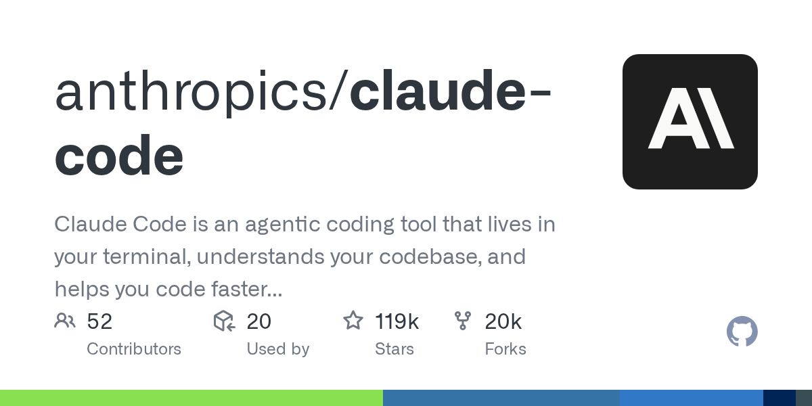

# Claude Code 近 3 个月 20 个最该上手的更新



*图片来源：anthropics/claude-code GitHub OG*

2026-02-01 到 2026-04-29，Claude Code 推了 60+ 项 changelog 条目、跨 30+ 个版本号。本文挑出 20 条对**当前在用**开发者最有手感的更新，每条给命令 / 配置 / 何时用 / 何时不要用。所有命令、版本号、价格来自官方 [Claude Code Changelog](https://code.claude.com/docs/en/changelog) 与 [What's new](https://code.claude.com/docs/en/whats-new)，真人原话与数字均挂原始来源。

文末附**降智风波**三连失误（2026-02-09 → 04-20）的来龙去脉与社区自救脚本——这是本期 Claude Code 最大的事，绕不开。

---

## 一、模型与思考层

### 1. Opus 4.7 GA + xhigh effort 等级（4-16）

`/model opus` 现指向 Claude Opus 4.7，价格仍是 $5/$25 per MTok。Anthropic 在 [whats-new-claude-4-7](https://platform.claude.com/docs/en/about-claude/models/whats-new-claude-4-7) 称生产任务解决率较 4.6 有明显提升。同步新增 `xhigh` 推理档，介于 `high` 与 `max` 之间，用 `/effort xhigh` 实时切。

`xhigh` 不是默认档位，社区对 4.7 评价分化。Reddit r/ClaudeAI 出现把 4.7 标作「regression」的吐槽帖；Simon Willison 多次在博客提到系统提示 token 占比上升、相对 4.6 整体成本上行（[claude-code tag 索引](https://simonwillison.net/tags/claude-code/)）。**用法建议**：日常任务保持 `/effort high`；架构改动 / 重构 / 多文件 diff 再切 `xhigh`。

迁移要点：4.7 换了新 tokenizer，token 计数与 4.6 不一致，长 prompt 估算需重新跑一遍。

### 2. Opus / Sonnet 1M context 窗口 GA（3-13）

Opus 4.6 与 Sonnet 4.6 的 1M token 窗口正式 GA，不再需要 `context-1m-2025-08-07` beta header，走标准定价。超过 200K 输入 token 自动转长上下文计费档。单会话可塞下 600 张图像或 PDF 页面，200K 时代上限是 100。

但 1M 不等于 1M 都好用。Marmelab 工程师 Caroline Schneider 在 [实测博客](https://marmelab.com/blog/2026/04/24/claude-code-tips-i-wish-id-had-from-day-one.html) 里写「用 Opus + 满 1M 上下文是浪费资源；400K 之后回报递减」。dev.to 社区压测同样指出，有效上下文过 50%（约 500K）之后衰减明显。**操作指引**：超 500K 时主动用 `/compact` 压缩 + skill 按需加载，别全文塞入。

### 3. Adaptive thinking 与 /effort 实时滑条（随 Opus 4.7 引入，4-16）

`thinking: { type: "adaptive" }` 替代旧的 `budget_tokens`，让模型自估当前 prompt 该想多深。设置优先级：CLI `/effort xhigh` > skill frontmatter `effort: xhigh` > settings.json `"effort": "high"` > 默认。

旧的 `"thinking": { "type": "enabled", "budget_tokens": 5000 }` 仍可用，但不再推荐。**避坑提示**：习惯了 `budget_tokens` 的人，迁到 `effort` 体系前先跑一组对比——`adaptive` 在简单任务上可能反而把 thinking 砍得过狠（详见文末降智风波附录）。

---

## 二、Skills 与插件生态

### 4. Skills 标准化 + agentskills.io 开放标准

单个 skill 启动时只占几十个 token——一份 YAML frontmatter + Markdown 文件，丢到 `~/.claude/skills/<name>/SKILL.md` 或 `.claude/skills/<name>/SKILL.md`，Claude Code 只扫 metadata。GitHub 官方 MCP server 单个就吃数万 token，差距是数量级。这就是 skill 跑赢 MCP 的关键。

Simon Willison 在 [Substack](https://simonw.substack.com/p/claude-skills-are-awesome-maybe-a) 写「Claude Skills are awesome, maybe a bigger deal than MCP」。Tyler Folkman 的 telemetry 笔记给出更具体的体感——日常会话里相当大比例其实在烧 token 干一件早就写进 skill 文件就能省下的活。把重复决策压进 skill 后，他自己测到 PR 合并量翻倍。社区里像 frontend-design 这种实用 skill 已积累数十万级安装。

**最小可用 skill**：

```markdown
---
name: my-skill
description: Use when the user asks XXX
---

# 任务流程
1. 先做 A
2. 再做 B
```

`/skills` 列表在 v2.1.121 加了搜索框。装第三方 skill 用 `claude plugin install`，或直接 git clone 到上述目录。

### 5. Plugin Marketplace + claude plugin prune（v2.1.121, 4-28）

官方 marketplace 上线时即首批数十个 Anthropic 自家 + 合作伙伴 plugin。第三方目录 [claudemarketplaces.com](https://claudemarketplaces.com/) 现已聚合数千个 skill、数百个 MCP server 与上千个 marketplace 入口。配套 v2.1.121 的 `claude plugin prune` 清理孤儿 plugin 缓存，长期重度用户磁盘能省几个 G。

plugin 质量分层严重。buildtolaunch 的 [11 测 4 留](https://buildtolaunch.substack.com/p/best-claude-code-plugins-tested-review) 实测里，Brand Voice / Marketing 两个能直接落地；Sales 那个生成的竞对情报「订阅数低报、tier 写错」，作者直接打 Skip。**用法建议**：装新 plugin 第一次用先盯一遍输出事实，别直接 ship。

### 6. MCP 升级三件套：alwaysLoad / 500K override / OAuth（3-26 ~ 4-28）

三处独立改动叠加，MCP server 终于摆脱「token 大户」标签：

- **`alwaysLoad: true`**（v2.1.121, 4-28）：跳过延迟工具加载，启动就拿全 schema。工具数量少的 MCP server 用这个能去掉首次调用的 ~500ms 延迟。
- **单工具结果上限放到 500K 字符**（v2.1.91, 4-02）：MCP 工具在响应里加 `_meta["anthropic/maxResultSizeChars"]: 500000` 即可绕开默认上限。日志类、数据库类工具受益最大。
- **MCP OAuth RFC 9728**（v2.1.85, 3-26）：标准 OAuth 2.0 替换旧的自定义 token，企业 MCP server 接 SSO 不必再写 hack。

`.mcp.json` 配置示例：

```json
{
  "mcpServers": {
    "github": {
      "command": "npx",
      "args": ["-y", "@modelcontextprotocol/server-github"],
      "alwaysLoad": true,
      "oauth": { "clientId": "..." }
    }
  }
}
```

### 7. Hook 升级：条件 if 字段 + PermissionDenied 事件（3-26 / 4-01）

Hook 终于有了过滤 DSL。`if` 字段按工具调用模式匹配，命中才触发，避免每次 Bash 都跑脚本。新增的 `PermissionDenied` 事件在 Auto Mode 拒绝某次工具调用时触发，方便审计。

```json
{
  "hooks": {
    "PreToolUse": [{
      "if": "Bash(git push *)",
      "hooks": [{ "type": "command", "command": "./check-protected-branch.sh" }]
    }],
    "PermissionDenied": [{
      "hooks": [{ "type": "command", "command": "logger 'auto-mode blocked: $TOOL_NAME'" }]
    }]
  }
}
```

**典型用法**：把高危命令（`rm -rf`、`git push --force`、`kubectl delete`）挂 `if` 字段做二次确认，比通用 PreToolUse 拦截精准得多，也更省脚本调用次数。

---

## 三、权限与沙盒安全

### 8. Auto Mode：AI 分类器接管权限对话框（3-23 → 4-16 GA）

后台跑一个 Sonnet 4.6 当权限分类器：安全动作直接放行，危险动作弹窗确认。时间线四步：3-23 research preview → 3-24 推 Team → 3-26 推 Enterprise / API → 4-16 对 Max 用户全量开放。开启方式：

```bash
export CLAUDE_CODE_AUTO_MODE=1
# 或 ~/.claude/settings.json
{ "autoApproveMode": true }
```

但这条路的天花板很明显。Anthropic 在 [auto-mode 博客](https://claude.com/blog/auto-mode) 里坦承双 stage 切换以放大 false negative（漏放真实越权动作）为代价换来 false positive（误拦截）大幅下降——分类器再准也是概率模型，不能完全替代规则与沙盒。社区随后跑的独立压测进一步把端到端漏放率推得更高，状态变更类动作还有相当比例根本没进检查范围。

Simon Willison 在 [3-24 评测](https://simonwillison.net/2026/Mar/24/auto-mode-for-claude-code/) 里写「I remain unconvinced by prompt injection protections that rely on AI, since they're non-deterministic by nature」，他更倾向走「确定性沙盒 + 文件 / 网络白名单」路线。**实操建议**：自己跑代码可以开 Auto Mode；接生产数据 / 跑 CI / 碰客户 secrets 时关掉，配上 §9 的沙盒升级三件套。

### 9. 沙盒升级三件套：域名阻止 + 子进程隔离 + 凭证清洗（4-09 / 4-17）

三处一起上：

- **`sandbox.network.deniedDomains`**（v2.1.113, 4-17）：在 settings.json 里列禁访域名（支持 glob），由系统级代理拦截，不依赖 Claude 自觉。
- **PID namespace 隔离**（Linux，v2.1.98, 4-09）：Bash 工具生成的子进程跑在独立 PID namespace 里，看不到也干扰不了宿主进程。
- **`CLAUDE_CODE_SUBPROCESS_ENV_SCRUB=1`**（v2.1.98）：开启后 `*TOKEN`、`*PASSWORD`、`*KEY` 这类敏感环境变量不传给子进程。

```json
{
  "sandbox": {
    "network": {
      "deniedDomains": ["internal-*.corp.local", "*.s3.amazonaws.com"]
    }
  },
  "env": { "CLAUDE_CODE_SUBPROCESS_ENV_SCRUB": "1" }
}
```

接管企业内网代码这套是底配。文档：[sandboxing](https://code.claude.com/docs/en/sandboxing)。

---

## 四、多设备与 agent 协作

### 10. Agent Teams：多 session 对等通信（2-05 research preview）

多个 Claude Code session 并排跑，一个当 team lead 协调，其他做 teammate。每个 session 有独立邮箱地址，可点对点通信，不必走 lead 中转。开启：

```bash
export CLAUDE_CODE_EXPERIMENTAL_AGENT_TEAMS=1
claude
# 在会话内
/create-team
/assign-task <teammate> "review src/auth/"
/team-status
```

适合并行调研、多假设调试、模块分工。**但 token 开销极大**，官方文档反复强调任务设计要慎重。配套的 `/team-onboarding`（v2.1.101, 4-10）会读项目的 CLAUDE.md 自动生成新成员入门指南。文档：[agent-teams](https://code.claude.com/docs/en/agent-teams)。

### 11. Remote Control：手机当遥控器（2-25）

终端 Claude Code 会话挂着，手机 / 网页 / 桌面 app 端远程发 prompt 或读输出。Simon Willison 同日 [实测](https://simonwillison.net/2026/Feb/25/claude-code-remote-control/) 写「a little bit janky right now」，列了一串具体 bug：`--dangerously-skip-permissions` 失效、API 500、单机只能开 1 个会话。

**当前定位**：长跑任务值班用——上班路上看一眼进度、晚上睡前确认昨夜测试通过没。要稳定双向编辑，还是用 §13 的 Channels。

### 12. Channels + Dispatch：把 Claude 推到 Telegram / Slack（3-17 / 3-20）

Channels 把 Claude Code 的输出推到 Telegram / Slack / Discord，Dispatch 走 REST 接口让外部触发后台 agent。aimaker substack 的 [Q1 综合评测](https://aimaker.substack.com/p/anthropic-claude-updates-q1-2026-guide) 写「The output finds you. You stop checking」。核心价值是不用再每隔几分钟切窗口看进度。

**配套用法**：和 §14 的 Routines 串起来，定时任务跑完直接推 Telegram，不用守在终端。Cowork Dispatch 在 v2.1.87（3-29）修了消息漏送 bug，现可投生产。

---

## 五、云端 agent

### 13. Ultraplan：把规划任务推到云端（约 4-08，research preview）

`/ultraplan <description>` 把规划任务派到云端 Opus 4.6 session，本地 CLI 同时还能干别的活。3 秒轮询，可在浏览器里 emoji 回应，3 个规划变体 A/B 分配。MindStudio 的 [对比测试](https://www.mindstudio.ai/blog/claude-code-ultra-plan-vs-local-plan-mode)：

| 任务规模 | Ultraplan | 本地 Plan Mode |
|---|---|---|
| 简单 bug fix | ~2 min | ~10-15 min |
| 单文件 feature | ~5 min | ~20-25 min |
| 多文件重构 | ~8-12 min | ~30-40 min |
| 架构级改动 | ~15-20 min | ~45-60 min |

限制：需要 Claude Code Web 账户 + GitHub 连接；Bedrock / Vertex AI / Foundry 用户不支持；仍是 research preview，行为可能调整。文档：[ultraplan](https://code.claude.com/docs/en/ultraplan)。

### 14. Routines：云端定时跑（4-14）

笔记本关了也能跑的 cron。配额：Pro 5 次/天，Max 15 次/天，Team / Enterprise 25 次/天。Linas Substack 实测「Four recovered hours per week, every week, without a single person doing the work」。The Register 同时警告「burns through tokens far more rapidly than judiciously applied AI assistance」——Routines 烧 token 的速度比手工调用快得多。

**典型场景**：每天 8 点扫昨日 PR 评审；每小时拉一次 staging 日志做异常分类；每周一查一次依赖更新建议。**避坑**：定时任务的 prompt 一定要带强约束（「只输出，不写文件」「token 超过 X 立刻停」），否则一夜烧掉一周配额是分分钟的事。

### 15. /ultrareview：云端多 agent 代码审查（4-16）

`/ultrareview` 把当前分支 diff 推到云端 sandbox，多 agent 互相验证——每条 finding 必须经独立 agent 复跑 pass 才返回。比本地 `claude review` 多一道事实校验闸。

价格：Pro / Max 用户 3 次免费，免费窗口到 2026-05-05；之后 $5-$20 / 次（按 diff 体量分档）。**何时值**：合并 main 前的最后一道 review、对外开源仓库的 release PR、安全敏感模块改动。**何时不值**：内部分支日常 push，本地 `claude review` 够用。

---

## 六、本地 CLI 体验

### 16. Git Worktree 原生 + EnterWorktree / ExitWorktree（2-19 起分两轮完善）

CLI 内置 worktree。Anthropic 工程负责人 Boris Cherny 在 Threads 写「Each agent gets its own worktree」——多个 subagent 并行改代码不会互相覆盖。但首版翻车不少：[Issue #29436](https://github.com/anthropics/claude-code/issues/29436) 报「worktree 合并回主分支后 cwd 卡死、shell 内 cd 也无效」，后续版本补上 `ExitWorktree` 才修干净。

```bash
# 在会话内
/worktree create feature-auth
# subagent 自动跑在该 worktree
/worktree exit  # 合并 / 丢弃后必须显式退出
```

**实战经验**：3 个以上并行 worktree 时认知负担会爆。Caroline Schneider 提醒「risk overwhelming context-switching」。建议 ≤ 2 个并行，再多就拆 session。

### 17. PowerShell 默认 + 终端 UX 五件套（3-26 → 4-28）

Windows 用户终于解放。v2.1.84（3-26）PowerShell tool 进 opt-in preview，v2.1.120（4-28）直接做成默认 shell——**Git for Windows 不再是必须项**。settings.json 里 `"shell": "powershell"` 显式覆盖即可。

配套终端体验改动 5 件（具体版本号以 [官方 changelog](https://code.claude.com/docs/en/changelog) 为准）：

| 改动 | 用法 |
|---|---|
| Transcript search | `Ctrl+O` 进历史模式后输关键词搜过往会话 |
| NO_FLICKER 渲染 | `export NO_FLICKER=1` 进 alt-screen 渲染，长会话不再闪 |
| `/tui` 全屏 | 大屏幕展开 |
| Vim visual modes | `v` / `V` / `Ctrl+V` 三档可视选择 |
| `/theme` 主题 | 自带配色 + `~/.claude/themes/` 自定义 |

### 18. /usage 合并 + /powerup 教学 + /resume 从 PR URL（Q2 期间陆续上线）

`/usage` 把旧的 `/cost` 与 `/stats` 合一，按「并行 session / subagent / cache miss / 长上下文」四块拆分占比，给最近 24h 用量分布 + 优化建议。配额吃紧时第一个该跑的命令。

`/powerup` 是内置交互式教程，Skills / Hooks / MCP / Subagents / Plan mode 每条都有逐步教学，比官方文档上手快。`/resume` 也加了从 PR URL 直接拉上下文的能力——`claude --resume https://github.com/owner/repo/pull/123` 直接拿到 PR diff + 之前的对话，code review 接力时省一大段重新铺垫。具体引入版本号见 [changelog](https://code.claude.com/docs/en/changelog)。

---

## 七、性能与缓存

### 19. 1 小时 prompt cache + Session Recap + /resume 提速 67%（4-14 ~ 4-22）

三处性能改动一起讲：

- **1 小时 prompt cache TTL**（v2.1.108, 4-14）：默认 5 分钟拉到 1 小时，跨午饭、跨会议都能命中。开启方式：`ENABLE_PROMPT_CACHING_1H=1` 环境变量或 API header，**走标准缓存定价不加价**。长会话的实际 token 账单能砍 30-50%。
- **Session Recap**（v2.1.108）：会话末自动生成 markdown 摘要，记录关键决策与输出。`/recap` 也可手动触发，分享给同事时省去整理。
- **`/resume` 提速 67%**（v2.1.116, 4-20）：>40MB 的大 session 恢复速度。[wotai.co 实测](https://wotai.co/blog/claude-code-2-1-116) 原话是「compounds every time you launch — if you run claude 50 times a day, you get that speedup 50 times a day」。配套 v2.1.113 改原生二进制生成，启动延迟也降了一档。`/branch` 不再拒绝 50MB+ 会话。

---

## 八、不能漏的迁移 deadline

### 20. 三条强制迁移线（4-30 / 4-20 / 6-15）

近 3 个月 Anthropic 同时退役了一批旧模型，**3 条线一定要在日历上标红**：

| 日期 | 退役 / 失效 | 替代 | 备注 |
|---|---|---|---|
| **2026-04-20** | Claude Haiku 3 已退役（v2.1.120 执行） | Haiku 4.5 | 还在用 `claude-3-haiku-20240307` 的代码已经 5xx |
| **2026-04-30** | 1M context beta header（`context-1m-2025-08-07`）失效 | Sonnet 4.6 / Opus 4.6+（无需 header） | Sonnet 4.5 / Sonnet 4 之后无法再走 1M |
| **2026-06-15** | Claude Opus 4 + Sonnet 4 退役 | Opus 4.7 / Sonnet 4.6 | tokenizer 变化，prompt token 估算需重测 |

模型弃用时间线官方页：[model-deprecations](https://platform.claude.com/docs/en/about-claude/model-deprecations)。CI 里 hardcode 模型名的，**赶紧改用别名**（`opus` / `sonnet` / `haiku`），别再写完整版本号。

---

## 附录：降智风波三连失误（2-09 → 4-20）

三处独立改动叠加，让 2 月底到 4 月中的 Claude Code 输出质量明显下滑——这是近 3 个月最大的事。Anthropic 在 [4-23 复盘](https://www.anthropic.com/engineering/april-23-postmortem) 公开承认了三处失误：


1. **3-04 默认 reasoning effort 从 high 改 medium**：本意降延迟，结果砍了高难任务成功率。**4-07 回滚**。
2. **3-26 thinking 缓存清理 bug**：上下文增长后旧 thinking 没正确失效，让模型基于过期推理产出。**4-10 修复**。
3. **4-16 系统提示 ≤25 词限制**：随 Opus 4.7 上线引入，instruction following 显著退化。**4-20 回滚**。

社区先于官方拍出证据。AMD AI 工程团队的 Stella Laurenzo 在 [Issue #42796](https://github.com/anthropics/claude-code/issues/42796) 拉了 6,852 个会话日志、234,760 次工具调用：中位思考长度从 2,200 字符降到 600 字符（**-73%**），读改比从 6.6 降到 2.0（**-70%**），同团队 API 调用次数从 1,498 涨到 119,341（**80x**），月账单从 $345 涨到 $42,121。原话「Claude has regressed to the point it cannot be trusted to perform complex engineering」。

Tyler Folkman 干脆把 $200/月 Max 替成 $45/月 OpenCode + CRISPY 多 agent 配置，[实测博客](https://tylerfolkman.substack.com/p/i-replaced-claude-code-with-a-45month) 给的判语很直接：「The quality drop wasn't subtle. Read:Edit ratio went from 6.6 to 2.0」。

**HN 用户 robeym 的社区自救脚本**（[来源](https://news.ycombinator.com/item?id=47660925)）至今仍可作为「保险开关」——在 Anthropic 修复前后切换对比：

```bash
# ~/.bashrc 或 ~/.zshrc
export CLAUDE_CODE_DISABLE_ADAPTIVE_THINKING=1
export CLAUDE_CODE_EFFORT_LEVEL=max
```

Simon Willison 4-22 的 [博客](https://simonwillison.net/2026/Apr/22/claude-code-confusion/) 写「My trust in Anthropic's transparency around pricing has been shaken」。这事不只是技术回滚，更是定价透明度的信任受损。**给当前使用者的实用结论**：日常把 `/usage` 加进收工前必跑的命令里；token / 重试次数 / 占比异常波动时立刻切换 `--effort max` 兜底；并在 GitHub issue 翻一遍当周是否有人报新的 regression。

---

## 收尾

近 3 个月 Claude Code 两条主线很清楚：**云端 agent 化**（Ultraplan / Routines / /ultrareview / Channels）让人不必再守在终端；**Skills + Plugins 标准化**把 prompt 复用从手工艺活变成可分发的工件。但同期 Auto Mode 漏放概率仍偏高、降智风波 80x 的 API 调用爆发、Plugin marketplace 良莠不齐——每用一个新功能前先翻一眼 issue tracker，比直接信 changelog 稳得多。

本文 20 条更新对应的官方 changelog 索引：[code.claude.com/docs/en/changelog](https://code.claude.com/docs/en/changelog)；模型弃用时间线：[model-deprecations](https://platform.claude.com/docs/en/about-claude/model-deprecations)。
