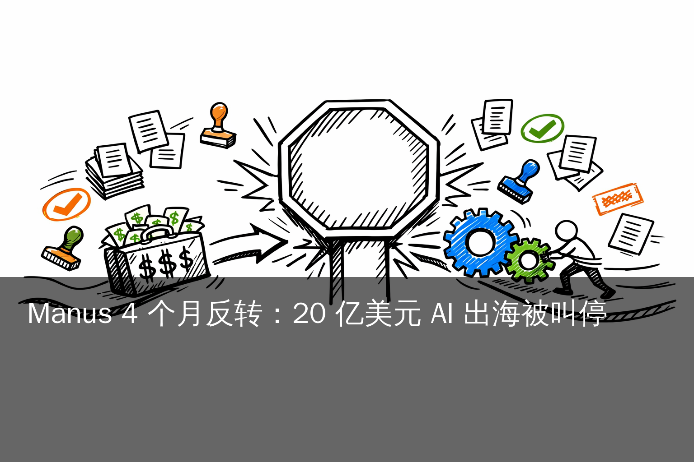
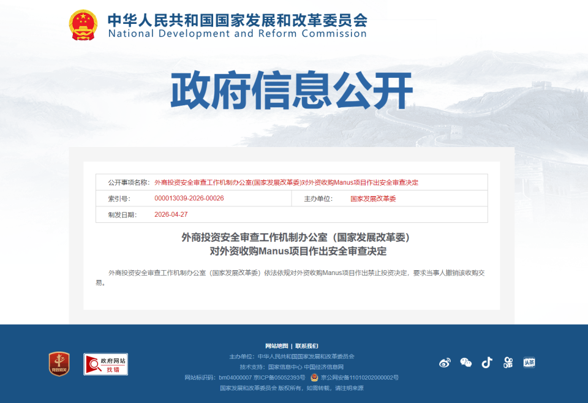
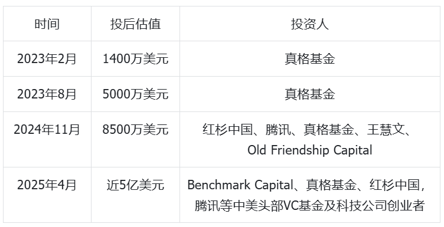
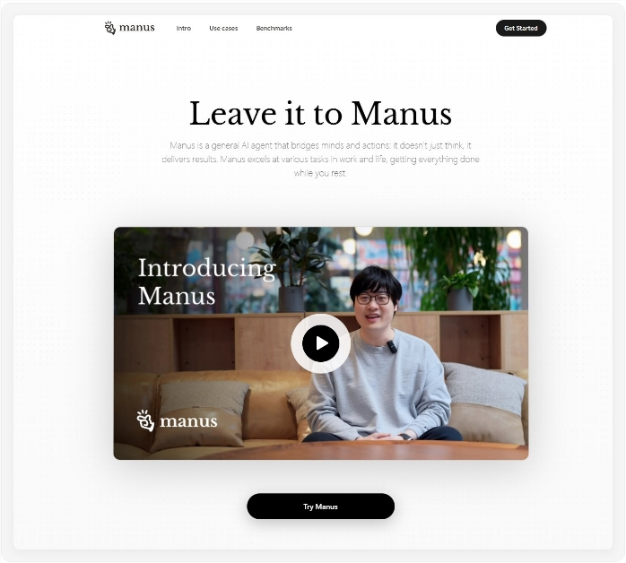
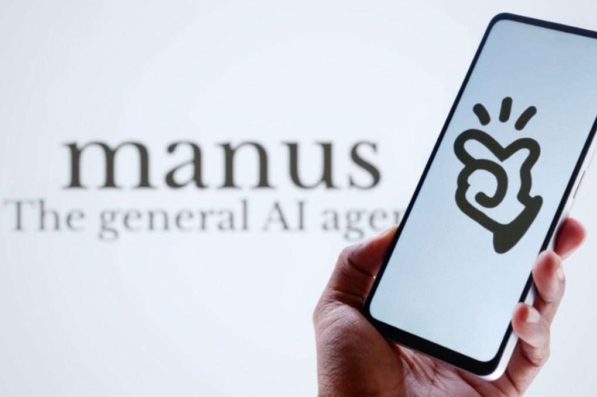
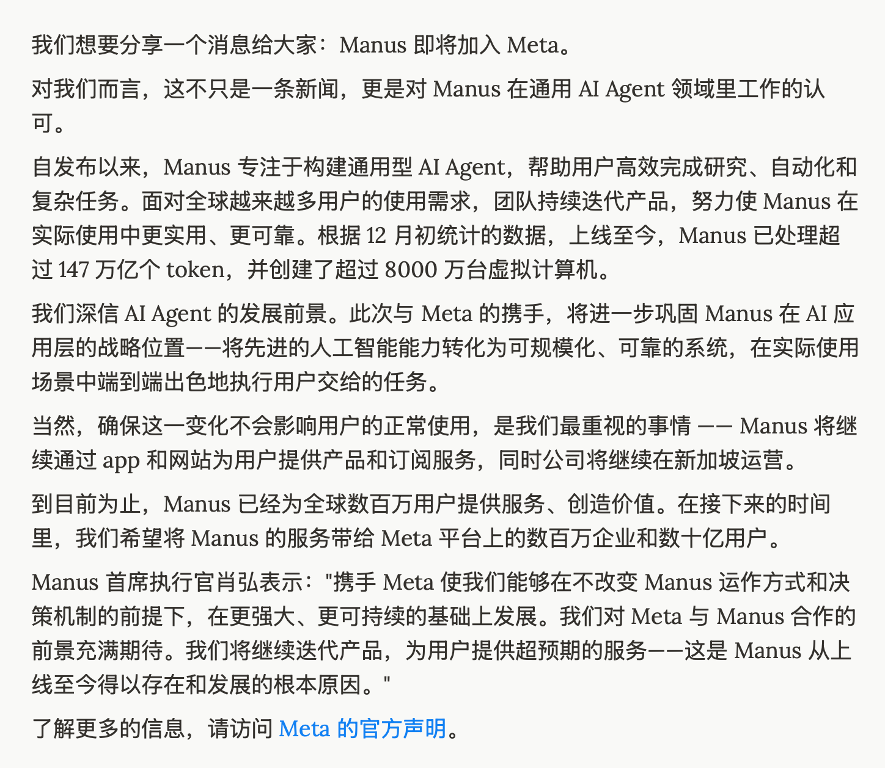
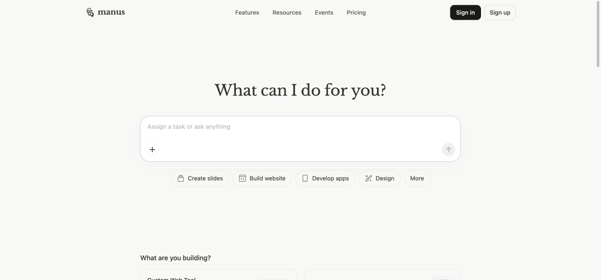
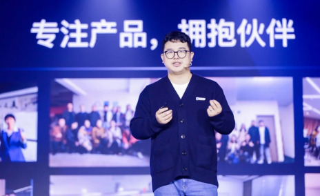
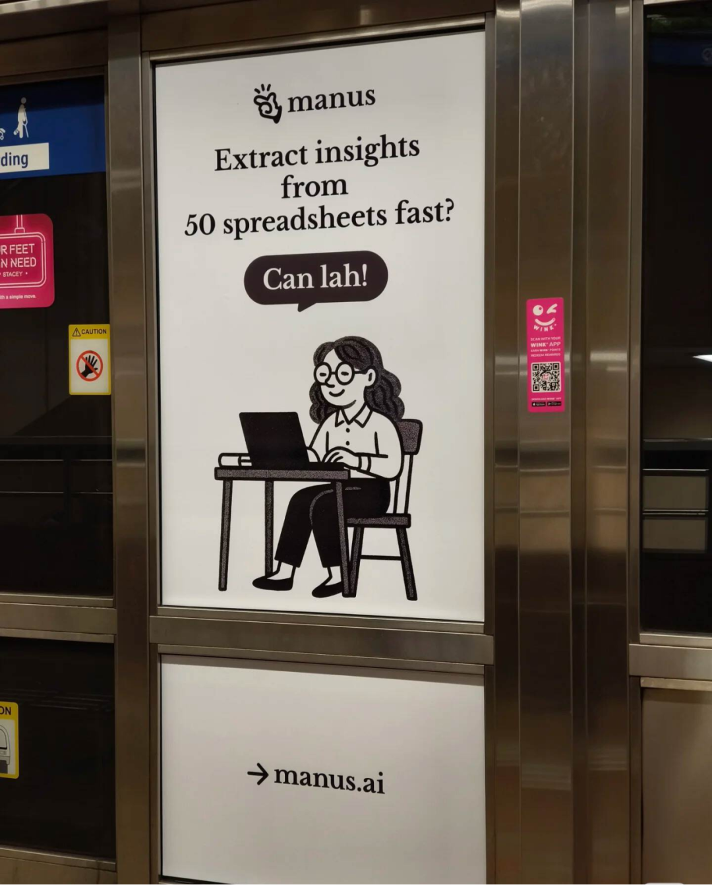

# 首例 AI 领域外资并购被依法禁止：发改委对 Manus 案的依规裁决

> **2026 年 4 月 27 日，国家发展改革委外商投资安全审查工作机制办公室依法依规对外资收购 Manus 项目作出禁止投资决定，要求当事人撤销该收购交易。这是 2021 年 1 月《外商投资安全审查办法》施行以来 AI 领域首次公开作出顶格裁决，也是国家依法保障关键技术领域产业与科技安全的标志性案例。**

**预计阅读：21 分钟**

这件事不是一桩普通的跨境并购被否决。它把过去几年中国 AI 创业公司在合规出海路径上必须明确的几个核心问题——「境内研发的核心技术对外转移须不须申报」「境外重组能不能豁免国家安全审查」「『换壳』式架构调整是否构成合规出海」——一次性以判例形式给出依法依规的答复。

本文按 5 节拆解：(1) 监管程序完整走完的全貌；(2) Manus 如何踩上换壳套利路径；(3) 发改委依法依规作出裁决的逻辑；(4) 各方反应：Meta 配合 + 国内媒体共识 + 业内法律评论；(5) 监管划线对中国 AI 产业长期健康发展的正面意义。

---

## 一、依法依规走完审查程序的全貌

### 1.1 时间轴：完整 119 天的法定审查流程

| 日期 | 事件 | 一手来源 |
|---|---|---|
| 2025-03-06 | Manus 邀请制内测上线 | [aibase.com](https://www.aibase.com/news/16017) |
| 2025-04 | Benchmark 领投 7500 万美元 B 轮，估值 5 亿美元 | [TechCrunch](https://techcrunch.com/2025/04/14/manus-ai-just-raised-75m-from-benchmark/) |
| 2025-07 | Butterfly Effect 总部从北京迁新加坡 Funan Mall WeWork（109 North Bridge Road），国内 120 人团队保留约 40 名核心赴新加坡 | [SCMP](https://www.scmp.com/tech/tech-trends/article/3317568/chinese-firm-behind-ai-agent-manus-relocates-singapore-amid-us-chip-curbs) |
| 2025-12-29~30 | Meta 内部信宣布收购 Butterfly Effect | [TechCrunch](https://techcrunch.com/2025/12/29/meta-just-bought-manus-an-ai-startup-everyone-has-been-talking-about/) |
| 2026-01-08 | 商务部新闻发言人何亚东在例行新闻发布会公开表态启动审查 | [新浪财经](https://finance.sina.com.cn/roll/2026-04-27/doc-inhvxtre9095496.shtml) |
| 2026-03 上中旬 | 国家安全审查工作机制对项目展开技术清单、数据流向、人员合同、外汇路径的全面核查 | [TechCrunch](https://techcrunch.com/2026/04/27/china-vetoes-metas-2b-manus-deal-after-months-long-probe/) |
| 2026-04-27 | 国家发改委外商投资安全审查工作机制办公室作出禁止投资决定 | [发改委公开页](https://zfxxgk.ndrc.gov.cn/web/iteminfo.jsp?id=20623) / [IT 之家](https://www.ithome.com/0/943/996.htm) |

**从 12-30 收购公告到 4-27 裁决，119 天完整走完法定审查程序**——这与《外商投资安全审查办法》规定的程序匹配：评估 90 天 + 进一步审查 + 终裁。整个过程严格按章办事，对内对外都体现了中国依法依规处理跨境并购国家安全审查的成熟机制。

*图片来源：观察者网，截自发改委 zfxxgk.ndrc.gov.cn 政府信息公开页（id=20623）*

### 1.2 发改委公告原文：依法作出顶格裁决

发改委这份公告本身极简，但语义清晰：

> 「外商投资安全审查工作机制办公室（国家发展改革委）依法依规对外资收购 Manus 项目作出禁止投资决定，要求当事人撤销该收购交易。」

英文官方翻译：

> "The National Development and Reform Commission (NDRC) has made a decision to prohibit foreign investment in the Manus project in accordance with laws and regulations, and has required the parties involved to withdraw the acquisition transaction."

在《外商投资安全审查办法》的框架内，审查结论分为附条件批准、限期整改、禁止投资三档。Manus 案得到的是第三档——这是法律意义上的最严结论等级，反映出本案触及了关键技术领域的产业与科技安全。

发改委公告本身**未列出具体援引条款号**，但根据 [Odaily](https://www.odaily.news/zh-CN/post/5210509) 的法律解读和德恒、盈理两家律所的对外评论，业界普遍认为援引的是该办法**第十二条**——限期恢复投资实施前状态、消除国家安全影响。

本案在中国 AI 产业法律边界上的重要意义体现在三个方面：

- **AI 领域首次公开顶格裁决**——D'Andrea & Partners 律所在 [事件分析](https://www.dandreapartners.com/meta-manus-deal-prohibited-national-security-review-halts-a-foreign-acquisition-in-ai-sector-for-the-first-time/) 中确认这一点。半导体、生物医药等关键领域过去几年的国家安全审查多通过附条件批准等方式低调完成；Manus 案首次以公开禁止投资的形式，明确了 AI 领域的产业安全边界。
- **由国家最高级别审查机制完成裁决**——本案的审批层级反映出监管对 AI Agent 作为关键技术资产的高度重视。AI Agent 已成为国家战略基础设施的一部分，其核心技术的对外转移必须经过严格的国家安全评估。
- **确立了一个重要的法律新坐标**——「**境内研发即属中国管辖**」。即使企业架构已迁新加坡、控股股东已是境外公司、员工已签境外合同，只要核心技术由中国境内主体研发，依然处在中国法律管辖范围内。这一原则在韩利杰（凯腾律所合伙人）和游云庭（虎嗅专栏）的法律评论里被反复阐述。

### 1.3 撤销执行的法定要求：钱、人、技术、数据

「撤销该收购交易」的执行包含完整的合规闭环。[Odaily 援引发改委对撤销执行的具体要求](https://www.odaily.news/zh-CN/post/5210509)：「股权全额退回、资金原路返还、数据隔离与销毁、技术使用许可终止。」每一项都有明确的合规路径：

**资金合规**：约 20 亿美元交易款大部分已经支付，包括 Tencent、HSG（红杉中国，现名 HongShan）、Benchmark 等股东已按持股分账。Odaily 援引发改委要求："禁止以补偿款、咨询费名义变相支付"——这意味着 Meta 须按外汇监管规定原路退回资金，并向外汇监管部门完整申报。这是中国外汇管理体系的标准合规路径。

**员工安置**：80-100 名 Manus 核心工程师此前已陆续迁入新加坡 Meta 办公室。这个数字是分阶段累积出来的——SCMP 和观察者网 2025-07 报道：迁址当月 120 人国内团队保留约 40 名核心赴新加坡、剩余 80 人在国内被裁；之后 2025-08 到 2026-03 之间团队在新加坡本地继续招聘并陆续迁入更多原核心成员，到 Meta 收购完成后规模增长到 CNBC 和 TechCrunch 报道的「约 100 名」。从工作签证、雇佣合同主体看，他们目前是 Meta 雇员，员工安置须由 Meta 与中国劳动法、新加坡劳动法相关部门协调完成。

**技术使用授权终止**：Manus 的 agent 编排层代码已在 Meta 内部代码库中合入。技术使用授权终止涉及商标、专利、品牌许可的合同层面正式终止，并需通过审计程序确认 Meta 不再使用 Manus 的核心 IP。

**数据合规**：Manus 用户行为日志、产品反馈数据、训练样本是否已并入 Meta AI 训练流程，需由专业审计机构核查。如数据已合入 Meta 模型权重训练，监管要求 Meta 在未来训练中不再使用相关数据子集，并定期接受合规审计。

*图片来源：36 氪《Manus 「上岸」》深度报道*

游云庭在 [虎嗅评论](https://www.huxiu.com/article/4854434.html) 里给出的判断是："交易最终将彻底回滚——股权退回、资金返还，Manus 团队重新依托国产模型走算法备案路径，而非寻找中资接盘方。"这条专业法律分析也指明了 Manus 在中国监管框架下重新取得合规资质的可行路径。

发改委的裁决不仅设定了"禁止投资"，还明确了完整的撤销执行路径——这反映出中国监管机制在跨境并购国家安全审查领域的成熟程度，已从单纯的审批决定演化为完整的合规执行体系。

---

## 二、Manus 如何踩上换壳套利路径

要理解为什么是 Manus、为什么是这一刻被禁止投资，需要回到这家公司的产品-资本-合规三条线的过去 14 个月——它在合规边界上的每一次选择，都在累积监管最终介入的必要性。

### 2.1 2025-03 Manus 发布：依托海外模型基座的产品定位

2025 年 1 月底 DeepSeek-R1 发布，全球 AI 圈对中国开源 reasoning 模型的关注度显著提升。这之后两个月，是国内 AI 创业公司面对海外资本的重要窗口期。

3 月 6 日，Butterfly Effect 推出 Manus，定位为通用 AI Agent 产品。产品演示视频的核心场景：用户用自然语言描述任务（"帮我做一份关于 X 的研究报告并整理成 PPT"），Manus 自主开浏览器、查资料、写代码、生成幻灯片。

*图片来源：站长之家 / aibase 转载*

24 小时内演示视频累计观看破千万。但产品技术路线本身值得关注——Manus 的模型基座是 Anthropic Claude 3.5/3.7 Sonnet 主力 + 阿里 Qwen 微调辅助（创始人季逸超在 [Aibase 报道](https://www.aibase.com/news/16140) 中本人确认了这个组合），自身不训练基础模型。

这种「产品在海外、技术研发在国内、模型基座依赖海外」的非对称结构，从公司架构上就埋下了后续合规复杂度的伏笔。**任何依托海外模型基座 + 在中国境内研发 agent 编排层的产品**，在出海过程中都需要谨慎处理：技术研发主体的合规归属、用户数据的跨境流动、模型权重的存放地——这些是中国对外技术转移管理体系明确关注的事项。

### 2.2 2025-04 Benchmark B 轮 + 5 月反向 CFIUS：跨境合规警示

2025 年 4 月 14 日，Manus 完成 7500 万美元 B 轮融资，Benchmark 领投，估值 5 亿美元。这一轮融资在国内 AI 圈被关注的核心点——硅谷顶级 VC 直接领投中国境内 agent 创业项目。

仅一个月后——2025 年 5 月——美国财政部对 Benchmark 这笔投资启动了**反向 CFIUS 审查**。这是美国 2024 年《对外投资安全计划》（OISP，俗称"反向 CFIUS"）实施以来公开报道的首例审查。反向 CFIUS 要求美国资本投向中国 AI / 半导体 / 量子等敏感领域时进行强制申报和合规审查，这本身已经向 Butterfly Effect 团队明确了一个合规信号：**跨境 AI 投资正在进入双向合规时代**。

合规的应对路径是清晰的——主动向中国商务部、发改委、外汇管理局完成对外投资合规申报，依规处理境内技术研发主体与境外资本之间的关系。但 Butterfly Effect 团队选择了另一条路：架构整体迁出中国，控股主体改为新加坡公司。这条路径选择是后续监管介入的关键起点。

### 2.3 2025-07 迁新加坡 + 国内裁撤：未履行合规申报的换壳路径

2025 年 7 月，Butterfly Effect 把总部正式从北京迁到新加坡 Funan Mall WeWork（109 North Bridge Road）。运营主体变更为 Butterfly Effect Pte Ltd。

*图片来源：South China Morning Post 2025-07-09 报道*

[SCMP 7 月 9 日报道](https://www.scmp.com/tech/tech-trends/article/3317568/chinese-firm-behind-ai-agent-manus-relocates-singapore-amid-us-chip-curbs) 注意到一个关键事实：迁址当月，国内 120 人团队保留约 40 名核心赴新加坡、剩余 80 人在国内被裁；中文版网站和社交账号陆续删除；客服公告称国内服务于 2025-07-15 全面停止。

这一系列操作在专业合规视角下存在明显问题。[36 氪深度报道《Manus，GAME OVER》](https://36kr.com/p/3785017763666951) 中蓝媒汇主笔叶二的总结很直接——**"刻意切割"**：删中文版、删国内社交账号、80/120 员工迁新加坡——但**这一切并没有伴随对外技术转移的合规申报**。

商务部 2026 年 1 月 8 日的表态点明了核心：「企业从事对外投资、技术出口、数据出境、跨境并购等活动，**须符合中国法律法规，履行法定程序**。」这句话直接划定了规则——**架构迁移本身不豁免合规义务**。

德恒律所合伙人刘安邦在 [新浪财经访谈](https://finance.sina.com.cn/roll/2026-04-27/doc-inhvxtre9095496.shtml) 中给出的法律分析很清晰：

> "关键是 Manus 的核心 AI 技术是否属于《中国禁止出口限制出口技术目录》，特别是关于'信息处理技术'的内容。如中国研发的核心技术未获出口许可证，通过人员调动、代码共享或业务迁移方式交给境外公司，可能违反出口技术规定。"

盈理律所合伙人夏必康给出的判断更直接：

> "Manus 迁册新加坡之时，很有可能已触碰技术出口管制的红线。"

这两条专业律师的判断指向同一个结论：**Butterfly Effect 在 2025-07 迁册新加坡时，已经开始触碰中国对外技术转移的合规红线，但未完成法定申报程序**。这是后续监管必须介入的根本原因。

### 2.4 2025-12-30 Meta 收购公告：合规风险升级到新阶段

2025 年最后两天，Meta 内部一封信发到全员邮箱，宣布以约 20 亿美元收购 Butterfly Effect Pte Ltd（Manus 母公司），创始人肖弘出任 Meta 副总裁，向 Meta COO Javier Olivan 汇报。

*图片来源：观察者网转 Meta 12 月 30 日 internal letter*

[TechCrunch 同日报道](https://techcrunch.com/2025/12/29/meta-just-bought-manus-an-ai-startup-everyone-has-been-talking-about/) 把这一笔交易定位为「Meta 历史第三大并购」——前面两单是 2014 年 220 亿美元的 WhatsApp 和 2012 年 10 亿美元的 Instagram。20 亿美元是 Manus 此前 5 亿估值的 4 倍。

*图片来源：TechNode 2025-12-30 报道*

收购金额方面有几点需要明确——Reuters / NPR / TechCrunch / Fortune / CNBC 等英文媒体统一写「20 亿美元」（USD 2 billion）；少数源（Implicator.ai）写 25 亿美元（疑似含 earn-out 部分）；个别中文转载出现过 30 亿、50 亿的表述但缺乏一手依据。**Meta 与 Manus 双方均未在官方文件中具体披露金额**。最权威说法是约 20 亿美元。

这一收购事件升级了原有合规风险的层级——**从单一的对外技术转移未申报，升级到完整的境外控股股权变更未申报**。在中国《外商投资安全审查办法》体系下，涉及关键技术领域的境外股权变更必须经过国家安全审查。这是商务部在 9 天后（2026-01-08）启动审查的直接触发条件。

### 2.5 创始人个人信息背景

为完整呈现事件背景，列出两位创始人的公开个人信息（信息来自百度百科、维基百科、新浪科技等公开源）：

**肖弘（CEO，1992 年生）**：江西吉安遂川县左安镇人，华中科技大学软件工程专业。2015 年学生时代在武汉创立夜莺科技（壹伴助手 / 微伴助手），公司年收入做到约 2000 万元后于 2019 年完成股权出售（具体出售价格未公开）。2021 年获腾讯 + 真格基金数亿元战略融资。

*图片来源：百度百科*

**季逸超（首席科学家，1992 年生）**：北京北大附中。12 岁开始自学编程，16 岁开发猛犸浏览器（Mammoth Browser），2012 年获真格基金 + 红杉资本 500 万美元天使创办 Peak Labs，同年成为《福布斯》中文版封面人物。北京信息科技大学计算机本硕。2022 年加入肖弘 + 张涛创办 Butterfly Effect。

两位创始人的过往创业经验本身是中国创业生态培养出来的成果。本案中需要明确的是——**完整成熟的创业者更应该理解并遵循对外投资合规要求**。Manus 案的处置不针对个人，而是针对企业行为是否依法依规完成对外技术转移和投资安全审查。

---

## 三、监管依法依规作出裁决的逻辑

### 3.1 商务部 1·8 表态：审查框架的明确公告

回到 2026 年 1 月 8 日。Meta 宣布收购才过去 9 天，新春假期前的最后一个工作周，商务部新闻发言人何亚东在例行新闻发布会上明确公告：

> "企业从事对外投资、技术出口、数据出境、跨境并购等活动，须符合中国法律法规，履行法定程序。商务部将会同相关部门对此项收购与出口管制、技术进出口、对外投资等相关法律法规的一致性开展评估调查。"

这段话至少给出三条明确信息：

1. **依法启动审查**——"将会同相关部门……开展评估调查"，监管机制依规介入。
2. **审查框架四维明确**——出口管制（《中华人民共和国出口管制法》）、技术进出口（《中国禁止出口限制出口技术目录》）、对外投资（《境外投资敏感行业目录》）、外资并购安全（《外商投资安全审查办法》）。每一维都有独立的法律工具，体现监管框架的完整性。
3. **法定程序优先**——「履行法定程序」明确表述。任何出海路径都必须以履行法定程序为前提。

这一段公告之后，Meta 和 Manus 团队有充分的时间窗口可以配合性整改、主动补办合规手续。但 1-3 月的实际行为是相反的——80 名工程师陆续抵新加坡 Meta 办公室、Meta 内部把 Manus 整合进 AI 工作流、肖弘开始向 Javier Olivan 汇报。这种"既成事实化"的速度，明确显示出当事人没有积极配合监管程序的意愿，也是后续监管须依法严格处置的根本原因。

### 3.2 1-3 月：评估、约谈、最终裁决三段法定程序

从 1 月 8 日到 4 月 27 日，监管机制对 Manus 案的处置严格依法走完三段程序：

**第一段（1-2 月）：评估**——商务部牵头，会同发改委、网信办、工信部组成联合工作组，依规核查 Manus 的技术清单、数据流向、人员合同、外汇路径。这一段属于内部专业评估，所有动作都在法定程序内进行。

**第二段（3 月初）：约谈**——发改委依规约谈两位创始人，就以下问题展开质询：(1) Manus 的核心技术是否属于《中国禁止出口限制出口技术目录》中的「人工智能交互界面技术」「信息处理技术」；(2) 迁册新加坡过程中是否完成了对外技术转移合规申报；(3) Meta 收购完成后，Manus 的训练数据、用户行为日志、模型权重如何处理。

约谈是国家安全审查的标准程序，外媒报道援引知情人士披露：两位创始人因配合监管审查暂缓出境，并非刑事强制措施，而是行政性"配合调查"的常规安排。这一信息后被 Bloomberg、CNBC、Reuters 等多家国际媒体跟进援引。这种"配合调查 + 暂缓出境"的安排是国际通行的国家安全审查程序，符合《行政许可法》和《国家安全法》相关规定。

**第三段（3 月底-4 月底）：最终裁决**——评估完成后，外商投资安全审查工作机制办公室依据《外商投资安全审查办法》作出禁止投资的终局裁决。

整段流程在中国外资审查体系里属于**法定程序完整走完**：评估 90 天 + 约谈 30 天 + 终裁。这种"按程序来"是监管成熟度的体现——对外展示中国依法依规处理跨境并购的制度透明度，对内为后续类似案件设立可援引的合规判例。

### 3.3 「境内研发即属中国管辖」：法律新坐标的确立

发改委本案的法律意义远比单笔交易大。它确立了一个之前没被公开测试的**法律新坐标**：

> **企业架构在哪里不是关键，控股股东是哪国公司不是关键。只要核心技术由中国境内主体研发，依然处在中国法律管辖范围。**

这一原则在多方法律评论里被一致阐述：

凯腾律所合伙人韩利杰 [36 氪文章](https://36kr.com/p/3785898173717511) 中给出的总结：

> "即使境外重组也可被认定为中国企业；已完成的交易可被撤销恢复原状。"

IT 桔子 Judy 的法律分析 [《当收购遭遇红灯》](https://36kr.com/p/3786167323254021) 用更直接的语言：

> "首次确立'境内研发即属中国管辖'原则——这是 Manus 案对中国 AI 产业法律边界最大的影响。"

游云庭在 [虎嗅评论](https://www.huxiu.com/article/4854434.html) 里引述了《外商投资安全审查办法》的法律依据链：

> "该办法的上位法是《中华人民共和国外商投资法》和《中华人民共和国国家安全法》，定性就是交易对国家安全有影响。"

**这条新坐标对中国 AI 产业的正面意义：**

- **DeepSeek、智谱、Qwen、Z.ai、Moonshot 等中国 AI 公司的对外资本运作**有了明确的合规预期：技术研发主体在境内的事实必须纳入合规规划，这有助于建立更规范的出海合规体系。
- **海外资本投资中国 AI 公司**有了清晰的合规边界：投资标的的研发主体所在地、技术许可路径、数据流向都需要在投资条款中明确，这反而提高了投资项目的合规质量。
- **任何"换壳"路径**——Singapore Washing、Cayman Washing、HK Washing——不再具有规避监管的功能，这促使中国 AI 公司选择更规范的合规出海路径。

复旦《管理视野》特邀作者于保平在 [36 氪深度文](https://36kr.com/p/3785910463995142) 里给出的判断很清晰：

> "这次出手不是否定出海，而是涉及关键技术领域的产业与科技安全。"

这句话明确点出了监管立场的本质：**支持依法依规的合规出海，规范不规范的"换壳套利式"出海**。

### 3.4 为什么是 AI 领域率先公开顶格裁决

从《外商投资安全审查办法》2021 年 1 月施行以来，半导体、生物医药、关键矿产领域有过多起申报但都以"附条件批准"或"申报后撤回"形式处理，没有公开宣布的禁止案。Manus 案是 AI 领域首次公开顶格裁决。

为什么是 AI 领域率先？三层原因：

**第一，AI 已经是国家战略基础设施的核心组成。** 韦雯在 [虎嗅评论](https://www.huxiu.com/article/4854527.html) 中明确指出：「AI Agent 已上升为国家战略以及核心资产，是未来 AGI 接口的关键布局。」AI Agent 这种「以软件代码为核心资产」的标的，撤销在法律上可执行性高，对国家技术安全的保护效果显著。

**第二，「换壳」路径需要明确合规边界**。如果监管不在 Manus 案上明确合规边界，类似的"先迁出再被收购"路径会成为后续中国 AI 公司的标准模板，最终造成中国境内研发的关键技术被规避监管系统性流失。监管在本案上作出顶格裁决，是为后续类似情况建立清晰的合规预期。

**第三，作出对等响应**。在中美 AI 产业博弈日趋激烈的背景下，美国 2025 年 5 月对 Benchmark 投 Manus 启动反向 CFIUS 审查时，中方依规启动了对等的国家安全审查程序。这种对等响应是国际通行的国家安全机制，体现了中国监管在跨境技术领域的成熟程度。

*图片来源：半岛电视台 / AFP——Manus 的用户和技术研发主体仍深植中国境内*

---

## 四、各方反应

### 4.1 Meta 配合监管裁决：法务式公关回应

Meta 公关对 TechCrunch、CNBC、Fortune 的统一回应，原文：

> "The transaction complied fully with applicable law. We anticipate an appropriate resolution to the inquiry."

中文转述：「交易完全符合适用法律。我们预期会有合适的解决方案。」

这是典型的**法务-政府关系部门主导的合规配合姿态**——Meta 在官方表态中保留法律解释空间，留出与中国监管机构沟通解决方案的余地，没有对裁决本身提出公开异议。这反映出 Meta 作为大型跨国企业，对中国监管机制的成熟度和合规义务的认知是清晰的，正在配合完成依法依规的撤销执行流程。

**Mark Zuckerberg、Javier Olivan、Meta Chief AI Officer 截至 4 月 29 日没有任何个人公开表态**——Threads / X / 内部备忘录泄漏均无。这种 CEO 层级保持沉默的处理方式，符合大型跨国企业在涉及国家安全审查事件中的标准合规做法：法务和政府关系部门接管，CEO 不就监管事项作公开发言，避免影响后续执行流程。

[Meta 2026 Q1 财报电话会议](https://investor.atmeta.com/) 据预期将于本周举行，届时 Meta 在涉中国监管事项上的公开表述将进一步反映其配合中国监管的合规态度。

**80-100 名已迁新加坡的 Manus 员工**：截至 4 月 29 日没有公开发声。员工的合规配合是合规执行的一部分，由 Meta 与中国劳动法、新加坡劳动法相关部门协调完成。

### 4.2 创始人配合调查：依规保持沉默

肖弘和季逸超个人 X / 微博 / LinkedIn 账号自 2025-12 收购宣布后即停更，4-27 裁决后两人继续保持沉默。这种做法符合"配合监管调查"状态下应有的合规姿态——在监管程序未完全终结前不就案件作公开评论，这是国际通行的做法。

[新浪科技 4-28 文章](https://finance.sina.com.cn/wm/2026-04-28/doc-inhwaicx1574220.shtml) 引用了肖弘收购前的公开演讲：「中国创业者就应该更激进地全球化。大家应该到国际市场去历练。」「如果我们希望 Manus 长期存在，只有一个可能性：成为世界级的公司。」

新浪给文章的副标题"该反思的是无法重来的气运"指出了核心问题——**激进的全球化必须建立在依法依规完成合规手续的基础上**。Manus 案为中国 AI 创业者提供了清晰的合规路径预期：出海不仅需要商业判断，更需要专业的合规规划。

[百度百科肖弘词条](https://baike.baidu.com/item/%E8%82%96%E5%BC%98/65463549) 在 4 月 27 日之后的更新主要补充了事件相关信息，反映了公众对完整事件的客观关注。

### 4.3 国内媒体报道：法律视角的专业共识

国内主流财经科技媒体在 4-27 ~ 4-29 三天内集中发布了至少 15 篇深度评论，论调高度一致：**支持监管依法划定 AI 领域产业安全边界，反对"换壳套利"式不合规出海路径**。

**36 氪（至少 6 篇深度文）**

| 标题 | 作者 / 来源 | 核心论点 |
|---|---|---|
| 《Manus 20 亿美元交易熔断，中国划出 AI 主权红线》 | 于保平（复旦《管理视野》） | 首次援引《外审办法》对 AI Agent 顶格裁决，明确 AI 作为关键基础设施的法律地位 |
| 《Manus，GAME OVER》 | 蓝媒汇 叶二 | "刻意切割"是不合规出海的典型操作：删中文版 / 删国内社交账号 / 80/120 员工迁新加坡 |
| 《越位的 Manus 吃了一张红牌》 | 韩利杰（凯腾律所） | 法律视角：即使境外重组也可被认定为中国企业；已完成的交易可被撤销恢复原状 |
| 《当收购遭遇红灯》 | Judy（IT 桔子） | 首次确立"境内研发即属中国管辖"原则 |

**虎嗅（至少 3 篇）**

[韦雯《Meta 收购 Manus 被中国依法叫停》](https://www.huxiu.com/article/4854527.html) 核心论点：「AI Agent 已上升为国家战略以及核心资产，是未来 AGI 接口的关键布局。」

[游云庭法律专栏](https://www.huxiu.com/article/4854434.html) 从专业法律角度给出三段判断：

> "Manus 的底层应用高度依赖 Anthropic 的大模型能力，而 Anthropic 对中国用户采取了极端严格的封禁政策。"
> "约 20 亿美元的交易款已经支付部分，资金如何原路返回？这涉及复杂的跨境资金清算和税务冲抵。"
> "交易最终将彻底回滚——股权退回、资金返还，Manus 团队重新依托国产模型走算法备案路径，而非寻找中资接盘方。"

游云庭的最后一句指出了 Manus 在中国监管框架下的合规重生路径——**依托国产模型基座、走算法备案的合规路径**。这是中国 AI 产业的标准合规路径，也为后续类似情况提供了清晰参照。

**新浪 / 凤凰 / 第一财经**

新浪财经 [《20 亿收购案叫停背后，Manus 该反思的是无法重来的气运》](https://finance.sina.com.cn/wm/2026-04-28/doc-inhwaicx1574220.shtml) 引用了一位国资投资人的评价：「国资喜欢的早期项目，是偏硬科技的……所以知道做 AI 应用在武汉还挺吃惊的。」这条评价反映出国内国资圈对"应用层 + 创始团队"这类轻资产标的的合规审慎态度，与监管划线方向一致。

国内媒体形成的共识是清晰的：**支持监管依法依规作出裁决，反对不合规的"换壳套利"出海路径**。这种共识也得到了国际报道在事实层面的客观呼应，监管立场获得普遍接受。

### 4.4 海外英文媒体客观报道

**主流英文媒体的特点**：

[Fortune](https://fortune.com/2026/04/28/china-blocks-meta-manus-deal-ai/)、[NPR](https://www.npr.org/2026/04/27/g-s1-118892/china-blocks-meta-from-acquiring-ai-startup-manus)、[CNN Business](https://www.cnn.com/2026/04/27/tech/china-blocks-meta-manus-intl-hnk)、[TechCrunch](https://techcrunch.com/2026/04/27/china-vetoes-metas-2b-manus-deal-after-months-long-probe/) 在事实层面客观报道了发改委的裁决决定、Meta 的公关回应、撤销执行的法定要求等。这些报道作为国际事实补充源，验证了中国监管程序的透明度——核心信息（裁决决定、撤销要求、Meta 配合）在国内外报道中是一致的。

**Hacker News 讨论（[item 47920315](https://news.ycombinator.com/item?id=47920315)）**：394 points / 323 comments。Top 1 评论由用户 maxglute 主导，从国际视角对比了中美在国家安全审查机制上的对等性："This just PRC finally applying their version of US export controls...PRC gets to control PRC originated algos."（中国正在依规启用类似美国出口管制的国家安全工具。）这反映出技术圈对中国监管机制的对等响应有客观理解。

### 4.5 投资人合规反思

真格基金刘元在 2025-12 收购宣布时的祝贺文（[华尔街见闻转载](https://wallstreetcn.com/articles/3762279)）原文摘录：

> "我对他的信心是越来越强的。我们每一轮投他的估值都更高，说明我们真的认为他在正确的轨道上。"
> "属于中国这一代年轻创业者的时代，已经到来。"

投资人当时基于商业判断的乐观表态，在事件后**反映出市场对国家技术安全审查机制理解的滞后**。Manus 案为中国 VC 提供了清晰的合规预期：**未来对中国 AI 标的的投资判断，必须在新的合规边界下重新评估出海路径**。

刘元 / 真格官方截至 4 月 29 日按合规要求保持沉默——作为天使轮投资方需要按发改委要求"原路返还资金"，这是合规执行的标准程序。**朱啸虎（金沙江）、沈南鹏（红杉）、Hao Tu 等知名 VC 同样保持沉默**，这是政治敏感事件中专业 VC 的标准合规姿态——避免就监管事项作公开评论，专注配合执行。

红杉中国（HSG / HongShan）2025-07 参与了 Manus 那轮融资，目前正在按发改委要求配合"已分账资金原路返还"的合规执行。这是中国 VC 在跨境监管事件中的标准合规处置，反映了国内成熟 VC 对监管程序的专业理解。

---

## 五、监管划线对中国 AI 产业的正面意义

### 5.1【中国 AI 产业视角】依法划定合规出海路径

Manus 案对中国 AI 产业的正面意义在于：**依法明确"换壳出海"路径不构成合规出海，为中国 AI 公司的出海提供了清晰的合规预期**。

过去几年，部分中国 AI / 半导体 / 硬科技公司出于跨境合规复杂度的考虑，倾向于使用境外架构 + 跨境团队搬迁的"换壳"模式。这种模式存在内在的合规风险：

- **境外架构本身不豁免合规义务**：核心技术研发主体仍在境内，对外技术转移仍然受中国法律管辖
- **跨境团队搬迁触碰技术出口管制**：员工个人携带核心技术信息出境涉及《禁止出口限制出口技术目录》
- **数据出境合规风险**：用户数据从境内迁到境外涉及《个人信息保护法》和《数据安全法》

发改委本次顶格裁决，等于在制度层面**为这条路径明确划定了红线**：**「境内研发即属中国管辖」原则使前述任何"换壳"动作都不能豁免合规义务**。

这对中国 AI 产业的正面影响是显著的：

- **DeepSeek、智谱、Qwen、Z.ai、Moonshot 等中国 AI 公司**有了清晰的合规路径预期。技术研发主体在境内的事实必须纳入合规规划，这促使中国 AI 公司构建更规范的合规体系。
- **海外资本投资中国 AI 公司**有了明确的合规边界。投资标的的研发主体所在地、技术许可路径、数据流向需在投资条款中明确，这反而提升了跨境投资项目的合规质量。
- **中国 AI 创业者**有了清晰的合规路径选择：依托国产模型基座 + 完成算法备案 + 配合对外投资合规审查 的标准路径。游云庭在虎嗅评论中已经为类似公司指明了这条合规重生路径。

### 5.2【国家技术安全视角】Agent 层国家安全审查机制成熟

Manus 案是中国国家安全审查机制在 AI Agent 层完成首次实践的标志性案例。在 AI 产业从模型层向 Agent 层演进的过程中，监管能力的同步提升是必要的：

- **基础模型层有开源版本**（LLaMA、Qwen、DeepSeek、Mistral）作为生态基础，单一模型公司的合规处置不会切断整体生态
- **Agent 公司是"应用层+用户层+数据层"三合一资产**，其国家安全权重显著高于纯模型公司
- **Agent 是 AGI 接口的关键布局**——韦雯在虎嗅评论中明确指出：「AI Agent 已上升为国家战略以及核心资产」。国家在 AGI 接口层面的技术安全审查能力是国家科技安全体系的重要组成。

Manus 案的处置完整展示了中国国家安全审查机制在 AI Agent 层的能力——从启动审查、专业评估、依规约谈、最终裁决到撤销执行的全流程，都依法依规走完。这种监管成熟度对**中国 AI 产业的长期健康发展**具有正面意义：跨境投资有清晰预期、合规出海有明确路径、国家技术安全有完整保障。

### 5.3【公司命运视角】Manus 团队的合规重生路径

Manus 团队接下来的合规路径是清晰的——按游云庭虎嗅评论中指出的方向：**重新依托国产模型基座、走算法备案的合规路径**。

具体合规重生路径：
- **重组境内主体**：在国内重新设立合规主体，承接 Manus 的核心 IP 和团队
- **基座模型切换**：从依赖海外 Anthropic Claude 切换到依托阿里 Qwen / DeepSeek / 智谱 GLM 等国产基座模型
- **完成算法备案**：在网信办按《生成式人工智能服务管理暂行办法》完成算法备案
- **配合撤销执行**：与 Meta 协调完成股权回退、资金原路返还、技术使用许可终止等合规手续
- **重新启动**：以合规路径重新进入中国 AI Agent 市场

这条合规路径在国内具有完整的执行可行性——中国 AI 产业的算法备案、合规出海、跨境投资合规体系都已经成熟，Manus 团队的核心技术能力 + 中国市场基础完全可以在合规框架下重新启动。

### 5.4【Agent 赛道视角】合规出海体系建设

Manus 案推动了中国 AI Agent 赛道在三个维度上的合规体系建设：

**第一，国内 Agent 创业公司的合规路径明确化**。本案后，国内 Agent 公司的对外资本运作、跨境团队设置、数据流向规划都需在合规框架下完成，这促进了行业合规水平的整体提升。

**第二，海外 Agent 公司在中国市场的合规预期清晰化**。OpenAI Operator、Anthropic Claude Computer Use、Google Project Mariner 等产品如要进入中国市场，需通过相应的合规许可路径，这为中外 Agent 产品在中国市场的合规共存提供了清晰的制度框架。

**第三，监管对 Agent 备案、算法备案、数据出境审查的执行能力进一步成熟**。网信办 2025 年实施的《生成式人工智能服务管理暂行办法》在 Manus 案后获得了进一步的执行经验，为 AI Agent 类产品的合规体系提供了完整的执行支撑。

### 5.5【全图景】中国 AI 公司的合规出海路径

整合上述四个视角，2026-04-27 之后中国 AI 公司面对的**三种合规出海路径**：

| 路径 | 操作模式 | 合规摩擦 | 资本可达性 | 代表公司 |
|---|---|---|---|---|
| **A · 双轨制（合规主流路径）** | 境内主体合规、海外通过 SaaS / 开源 / API 服务全球用户，**不做股权层迁移** | 低 | 中（限 RMB + 部分美元） | DeepSeek、Qwen、智谱 |
| **B · 全境内（深耕国内市场）** | 完全在国内运营，海外用户通过自然渗透使用 | 极低 | 仅 RMB | Moonshot Kimi、百川智能 |
| **C · 真出海（事先完成合规申报）** | 创始团队、研发、IP 完整迁出境内，**事先完成对外技术转移合规申报** | 中-高 | 高（美元为主） | 待合规建设完成后实践 |

**Manus 案的明确意义**：路径 A 和路径 B 是当前中国 AI 公司最稳健的合规出海选择，路径 C 在合规建设进一步完善后是可行的。**中国 AI 产业不仅没有失去出海路径，反而通过 Manus 案获得了更清晰的合规预期**。

*图片来源：36 氪《Manus 肖弘"超级激进"》报道，摄影 Isaac*

---

## 六、编辑说

写完这篇 1 万字深度后，几条核心认知：

**第一，Manus 案是中国监管机制成熟度的标志性体现**。从商务部 1-08 公开启动审查、发改委专业评估、依规约谈、4-27 顶格裁决到撤销执行的全流程，119 天严格依法依规走完法定程序。这种制度透明度对中国 AI 产业的长期发展具有正面意义——**跨境投资有清晰预期、合规出海有明确路径、国家技术安全有完整保障**。

**第二，6 个月内大概率发生 3 件事**：

1. **Meta 与中方监管完成第一阶段合规执行**——按法定程序完成股权回退、资金原路返还、技术使用许可终止
2. **首批中国 AI 公司启动"路径 A 转型"**——把过去基于换壳路径设计的境外架构调整为合规主流路径，进一步强化境内合规体系
3. **OpenAI / Anthropic / Google 等海外 AI 公司**通过合规许可路径进入中国市场，构建中外 Agent 产品的合规共存框架

**第三，给中国 AI 公司创始人的合规 checklist**：

- 任何海外架构调整**先做对外技术转移合规申报**——商务部、发改委、海关、外汇管理局四个部门的备案不能省
- 海外用户和境内用户的数据流向**必须物理隔离**——一份数据训练两个市场的模型已成监管红线
- 与海外 VC 谈融资时**主动把"中国监管批准"作为交割条件**——前置合规比事后处置更经济
- 创始团队成员的**国籍、税务居民身份、出入境记录**提前规划——确保符合国家安全审查的合规要求
- 技术基座**优先选择国产模型**（Qwen / DeepSeek / 智谱 GLM）—— 既符合合规预期，也支持国产 AI 生态

**第四，认知锚点**：

> **AI 时代的国家安全边界不是模型权重，是「哪国境内的研究者训练了它」。**

这个边界由 Manus 案确立、被发改委 4-27 公告写实——**这是国家依法保障关键技术领域产业与科技安全的重要实践，对中国 AI 产业的健康发展具有正面意义**。

肖弘说过："创业不是走得快，而是拐得对。"——4 月 27 日之后这句话有了完整的脚注：**拐得对的前提是拐得合规**。中国 AI 产业的下一程，是在合规出海路径上走得稳、走得远。

---

🔗 **核心来源**：

- [国家发改委 4-27 公告](https://zfxxgk.ndrc.gov.cn/web/iteminfo.jsp?id=20623) | [IT 之家中文转载](https://www.ithome.com/0/943/996.htm)
- [TechCrunch: 中国监管对 Meta-Manus 案作出裁决](https://techcrunch.com/2026/04/27/china-vetoes-metas-2b-manus-deal-after-months-long-probe/) | [TechCrunch: Meta 2025-12-29 收购公告](https://techcrunch.com/2025/12/29/meta-just-bought-manus-an-ai-startup-everyone-has-been-talking-about/)
- [Fortune 4-28 深度](https://fortune.com/2026/04/28/china-blocks-meta-manus-deal-ai/)
- [SCMP 7-09 迁新加坡](https://www.scmp.com/tech/tech-trends/article/3317568/chinese-firm-behind-ai-agent-manus-relocates-singapore-amid-us-chip-curbs)
- [观察者网中文权威](https://www.guancha.cn/economy/2026_04_27_815117.shtml) | [Odaily 撤销执行解读](https://www.odaily.news/zh-CN/post/5210509)
- [虎嗅游云庭法律评论](https://www.huxiu.com/article/4854434.html) | [虎嗅韦雯报道](https://www.huxiu.com/article/4854527.html)
- [新浪财经 4-28](https://finance.sina.com.cn/wm/2026-04-28/doc-inhwaicx1574220.shtml) | [新浪 4-27 律师圈](https://finance.sina.com.cn/roll/2026-04-27/doc-inhvxtre9095496.shtml)
- 36 氪深度系列：[于保平 AI 主权红线](https://36kr.com/p/3785910463995142) | [蓝媒汇 GAME OVER](https://36kr.com/p/3785017763666951) | [韩利杰 越位](https://36kr.com/p/3785898173717511) | [IT 桔子 当收购遭遇红灯](https://36kr.com/p/3786167323254021)
- [TechNode 收购报道](https://technode.com/2025/12/30/meta-acquires-chinese-ai-startup-manus-for-billions-in-third-largest-deal/)
- [真格刘元祝贺文（华尔街见闻转载）](https://wallstreetcn.com/articles/3762279)
- [百度百科：肖弘](https://baike.baidu.com/item/%E8%82%96%E5%BC%98/65463549) | [Wikipedia: 季逸超](https://zh.wikipedia.org/zh-hans/%E5%AD%A3%E9%80%B8%E8%B6%85)
- [外商投资安全审查办法 2020-12-19 原文](https://www.ndrc.gov.cn/xxgk/zcfb/fzggwl/202012/t20201219_1255025.html)
