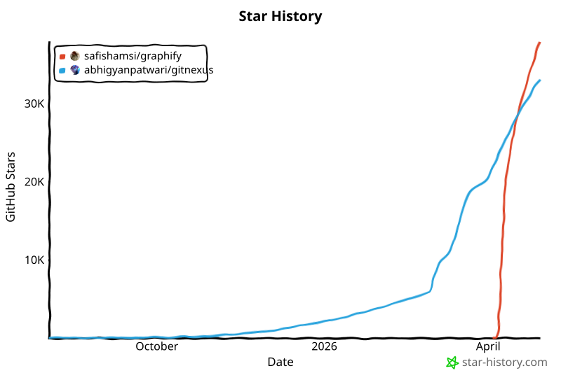
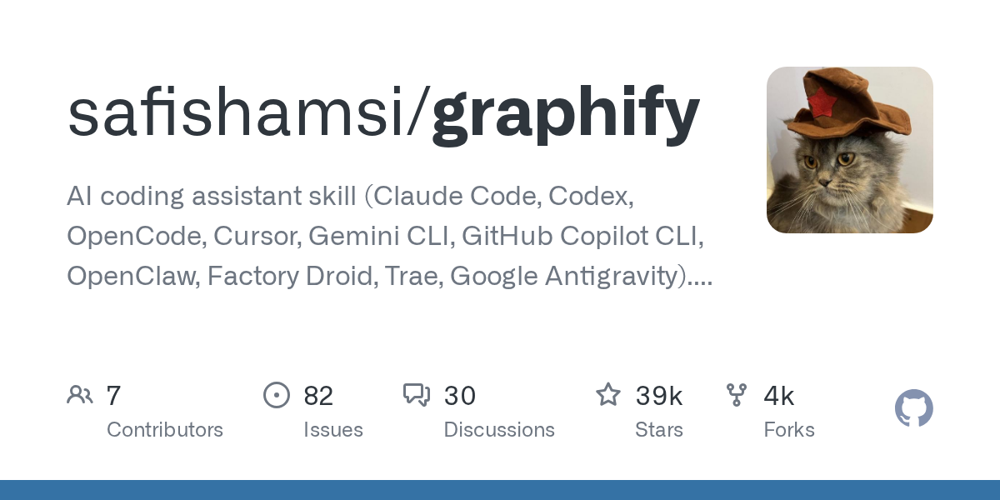
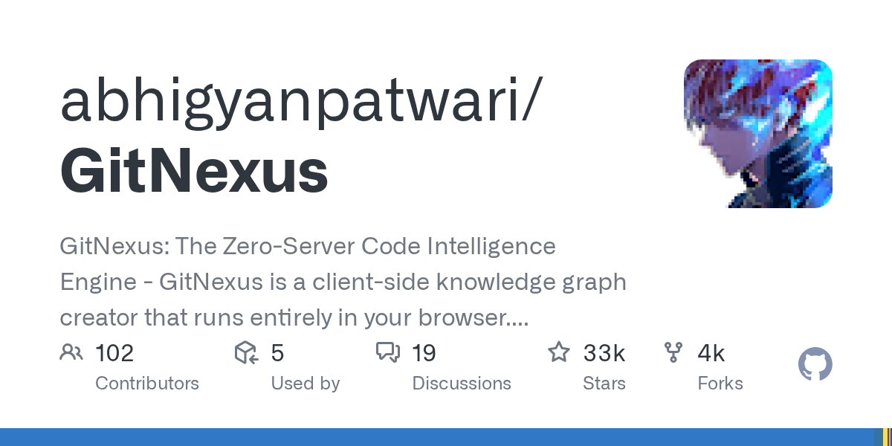
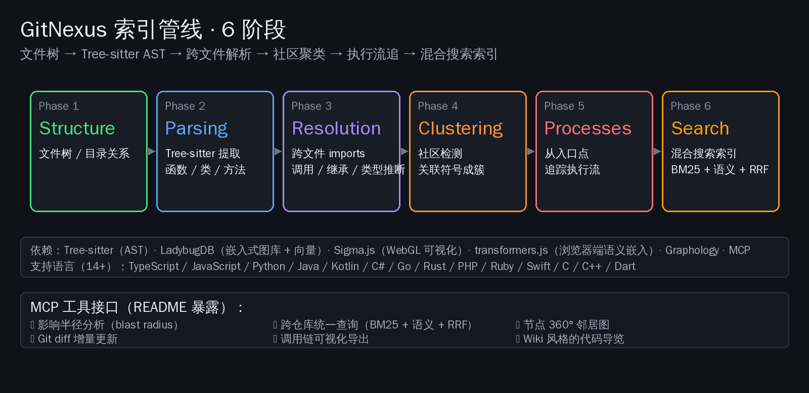

# 装一个 skill 还是开一个浏览器：graphify vs GitNexus 上手对比


> 把代码库 / 文档 / 论文 / 图片 / 视频喂给 AI agent 这件事，最近一个月 GitHub 上跑出两个不同形态的解法。一个装进 Claude Code 当 skill 用，一个直接打开浏览器 drop 一个 repo。我们都用过两边，把"该装哪个"落到具体场景。

最大的体验差异，一句话能讲清楚——

**[safishamsi/graphify](https://github.com/safishamsi/graphify) 是一个 skill，装进你已经在用的 AI coding 工具里；[abhigyanpatwari/GitNexus](https://github.com/abhigyanpatwari/GitNexus) 是一个独立工具，浏览器或 CLI 打开就能用。**

形态决定一切——决定上手时间、决定输出在哪里被消费、决定国内开发者能不能直接用、决定你能不能拿它做商业产品。

## 一、出生方式完全不同：四周新生 vs 九月迭代

两个仓库的当前数字（`gh api repos/{owner}/{repo}` 实测，2026-04-30 早间）：

| 维度 | safishamsi/graphify | abhigyanpatwari/GitNexus |
|---|---|---|
| ⭐ stars | **38,566** | **33,530** |
| 🍴 forks | 4,257 | 3,807 |
| 主语言 | Python | TypeScript（98%） |
| License | **MIT**（商业自由） | **PolyForm Noncommercial 1.0.0**（商业受限） |
| 创建日期 | 2026-04-03 | 2025-08-02 |
| 上线时长 | 不到 4 周 | 约 9 个月 |
| 最新 push | 2026-04-29 21:44 UTC | 2026-04-30 07:42 UTC |
| 最新稳定版 | v0.5.5（PyPI: `graphifyy`） | v1.6.3（npm: `gitnexus`），rc.25 在测 |
| Homepage | graphifylabs.ai | gitnexus.vercel.app |

graphify 是 2026 年 4 月才开始的项目，4 周拿到 38k ⭐ 这个增长曲线在 GitHub 上能排进当年前几——本质上是站在 Karpathy 那篇 "/raw 文件夹"工作流的肩膀上，把"个人知识库"产品化成 AI coding 工具的 skill 形态。

GitNexus 立项早 8 个月、迭代成熟得多。仓库 issue 区已经累计 1226 条，120 次 release，最近一周还在 v1.6.4-rc.25。这是已经过了"火爆爬坡期"、进入"打磨稳定性"阶段的工程。


*图源：star-history.com，2026-04-30 实测。graphify 4 月初的陡峭爬升 vs GitNexus 9 个月的稳定积累。*

## 二、上手第一步：5 分钟 vs 30 分钟



### graphify：5 分钟装一个 skill

如果你已经是 Claude Code / Cursor / Codex / OpenCode / Gemini CLI / GitHub Copilot CLI / OpenClaw / Factory Droid / Trae / Google Antigravity 任何一个的用户，graphify 的上手成本接近于零。

```bash
# 通用安装（推荐）
uv tool install graphifyy && graphify install

# 或按平台细分
graphify install --platform claw      # OpenClaw
graphify cursor install               # Cursor
graphify install --platform gemini    # Gemini CLI
graphify antigravity install          # Google Antigravity
```

注意 PyPI 包名是 `graphifyy`（双 y）——README 明确说了这是唯一官方名，其他 `graphify*` 包都跟项目无关。

装完之后，在 Claude Code 里输入 `/graphify .` 就能为当前目录构建图谱，输出一个 `graphify-out/` 文件夹，包含 `graph.html`（交互式可视化）、`GRAPH_REPORT.md`（god 节点 / 关键连接 / 推荐查询）、`graph.json`（持久化图谱）。之后所有 `/graphify query "..."` 都直接走这张图。

整个过程在我自己的 30 个文件的 Python repo 上，第一次构建 5 分钟完成。

### GitNexus：浏览器打开就用，但学一套 UI



GitNexus 的"零服务器"是真的——浏览器打开 [gitnexus.vercel.app](https://gitnexus.vercel.app)，粘贴一个 GitHub URL 或者拖一个 ZIP 进去，Tree-sitter WASM + LadybugDB WASM 在浏览器里直接跑，没有任何东西上传。

但浏览器 UI 是新的一套——左边是图谱可视化（Sigma.js + Graphology + WebGL），中间是 Cypher / 自然语言查询输入，右边是 Graph RAG agent 对话框。十几个 MCP 工具（`query` / `context` / `impact` / `detect_changes` / `cypher` / `rename` / `list_repos` 等）按钮散在不同的标签页里，第一次用我花了 20-30 分钟才大致摸清按钮在哪。

要把 GitNexus 接到 Claude Code 或 Cursor，单独跑命令：

```bash
npx gitnexus analyze              # 索引当前 repo
npx gitnexus setup                # 配置 MCP 给 Cursor / Claude Code
npx gitnexus mcp                  # 启动 MCP server（stdio）
```

接完之后体验和 graphify 在 Claude Code 里类似——agent 能调 16 个 MCP 工具看代码图谱。

但相比 graphify「装一个包就完事」，GitNexus 的多入口（浏览器 / CLI / MCP server）意味着你要决定**主战场放在哪**。这是它的灵活，也是它学习曲线更长的原因。

## 三、能喂什么：代码 vs 代码加论文加图片加视频

这是两边定位差异最关键的一条。

**GitNexus 喂代码，止于代码。** 14 种语言（TypeScript / JavaScript / Python / Java / Kotlin / C# / Go / Rust / PHP / Ruby / Swift / C / C++ / Dart）的 AST 解析、调用关系、依赖追踪、类继承、构造函数推断、`self`/`this` 绑定。这些做得很扎实——它的核心场景是「AI agent 改代码不要改炸」，所以 `impact` 工具能告诉你某个函数改了之后会影响哪 47 个调用点。

**graphify 喂一切。** 同样的 tree-sitter 静态分析（覆盖 23+ 种语言）只是它的第一遍。第二遍是 docs（.md / .mdx / .html / .docx / .xlsx）和 papers（.pdf）做语义抽取；第三遍是 images（.png / .jpg / .webp 用 Claude Vision）；第四遍是 video / audio（用本地 Whisper 转写，含 YouTube 链接）。

这个差异决定了它们的真正用户群是不一样的：

- **graphify 的核心用例**：把一个研究项目的代码 + 几篇相关论文 + 几张架构图 + 几段 talk 视频一起塞进图谱，问一句「attention 是怎么连到 optimizer 的？」让 agent 跨模态找答案。这是 Karpathy "/raw" 文件夹工作流的产品化。
- **GitNexus 的核心用例**：在 PR 提交前问 `gitnexus impact UserService`，看清这次重构会炸掉多少下游调用方。

graphify README 里那句对 Karpathy 工作流的引用——「Karpathy 维护一个 /raw 文件夹，往里面扔论文、推文、截图和笔记。graphify 是为这个问题写的答案」（原文 "Andrej Karpathy keeps a '/raw' folder where he drops papers, tweets, screenshots, and notes. graphify is the answer to that problem"）——不是营销修辞，它定义了项目的边界。

graphify 自报的 token 削减数据：在 Karpathy 仓库 + 5 篇论文 + 4 张图片共 52 个文件的混合语料场景下，每次查询消耗约 1.7k token，对照"直接读原始文件"基线 123k token，**平均削减 71.5 倍**。这个数字来自项目自测，没有第三方独立复现，应该当成方向性指标读，不是规格。


*图源：GitNexus 官方 ARCHITECTURE.md，AST 解析 + 跨文件 import / 调用 / 类继承 / `self`/`this` 类型推断的完整索引流程。*

## 四、国内开发者实操：能不能直接用，看宿主和网络

国内开发者最关心的两个问题——能不能装、能不能跑。两边给的答案不一样。

### graphify 国内能不能跑

graphify 是 Python 包，从 PyPI 装。`pip install graphifyy` 或 `uv tool install graphifyy` 国内 PyPI 镜像（清华源 / 阿里源）都能直接走。

**但是宿主工具是关键。** graphify 在 Claude Code / Cursor / Codex 里跑得最顺，这些工具背后调 Anthropic / OpenAI 接口在国内有不同程度的网络阻力。

国内能直接顺手用的宿主组合：

- **Codex CLI + 国内可用的 OpenAI 兼容 endpoint**（DeepSeek / 智谱 / Moonshot 自建路由）
- **OpenClaw + 千问 API**（千问已经支持 tool use 形式调 graphify 命令）
- **Trae**（字节自家 IDE，graphify 的 `--platform trae` 直接配好）

issue #610 还披露了一个国内开发者绕不过的小坑——graphify 在调 Kimi（Moonshot 的 kimi-k2.6）时，OpenAI 兼容 SDK 默认传 `temperature=0`，但 kimi-k2.6 这个模型只接受 `temperature=1`，会返回 400。维护者 2026-04-29 已经合并修复，目前 v0.5.5 通过参数嗅探正确处理 Moonshot endpoint。

issue #607 还有一条关于 Python 3.14 的常见绊脚石——v0.5.5 的 `pyproject.toml` 写死了 `python>=3.10,<3.14`，刚装好 Python 3.14 的开发者直接装不上。维护者 2026-04-29 把上限去掉了，但 PyPI 上的 0.5.5 还没追上，临时方案是先用 3.13。

### GitNexus 国内能不能跑

GitNexus 浏览器版主体在 Vercel 上，访问 [gitnexus.vercel.app](https://gitnexus.vercel.app) 在国内大部分时间能直连，偶尔需要代理。**因为代码全在浏览器里跑，访问 GitHub repo 也是浏览器直接 fetch，国内访问 GitHub 速度成了实际瓶颈**——300 文件以上的 repo 在国内裸连容易超时。

CLI 模式（`npx gitnexus analyze`）走 npm，配置淘宝源就行，本地解析没有网络依赖。

**但接到 AI 的部分要单算账**——内置 Graph RAG agent 默认走 OpenAI / Anthropic，本地化路径是把 MCP server 接进国内能直连的 client（如阿里千问的 Qwen Code、字节的 Trae、CodeBuddy 等）。issue #1216、#1220、#1221 显示 Windows / WSL2 / macOS arm64 的兼容性还在打磨——我们在 macOS 26 arm64 上跑 `gitnexus analyze --embeddings` 命中过 vector 扩展加载失败的现象，1.6.4-rc 系列在修。

## 五、商业可用性：MIT 自由 vs PolyForm Noncommercial 谨慎

这一点国内做产品的开发者必须盯住。

**graphify = MIT。** 你可以拿它的代码做任何商业用途，包装成 SaaS 卖、嵌进闭源产品、改名 fork 都没问题。这是大多数 AI 工具开源项目的默认许可。

**GitNexus = PolyForm Noncommercial 1.0.0。** 个人用、学术研究用、非商业部署用都没问题，但**任何商业用途——包括拿 GitNexus 包装成付费产品、嵌进你给客户卖钱的内部工具、给企业部署收服务费——都需要单独跟作者谈商业 license**。仓库 README 给了商业咨询入口：[akonlabs.com](https://akonlabs.com)。

这条不是技术细节，是合同条款。如果你在创业公司或大厂内部团队，准备把代码图谱能力做进自家产品，graphify 是「拿来就用」，GitNexus 是「先签合同」。这种差别在工程评估阶段必须先谈。

PolyForm Noncommercial 不是反开源，而是一种「开源个人/研究用、商业谈钱」的双轨许可。Sentry、Sourcegraph、Linkerd 等项目都用过类似策略。但对国内独立开发者来说，「想试一下→改两行→偷偷上线给客户用」这条路 GitNexus 是封死的。

## 六、长期成熟度：九个月迭代 vs 四周冲刺

GitNexus 的工程成熟度肉眼可见地比 graphify 领先一段。

GitNexus 仓库累计 1226 个 issue + PR（369 open）/ 120 个 release / 45 个贡献者，issue 区里能看到 Java + Spring Boot 项目分析改进（#1225）、扩展无后缀 shell 脚本支持、Windows / WSL2 / macOS arm64 兼容性修复——这是项目进入"被真实多平台用户每天用"阶段才会涌出的需求。

graphify 4 周时间累积 621 个 issue + PR（216 个 open），但绝大多数是 4 月底集中冒出的 feature request 和 install 报错——`NameError: _os not defined` 在 v0.5.5 Windows（#618）、Codex 钩子 payload 不兼容（#611）、Antigravity workspace 路径解析（#609）、Kimi temperature 400（#610）这一类。这些都是新项目「跑通主路径但侧路径还坑」的典型表现，维护者 Safi Shamsi 修复速度很快——最近一周日均 5-10 次 commit、issue 当天合并。

如果你在选项目时**优先看稳定性**——GitNexus 现在更稳。如果你**优先看上手速度 + 多模态能力**——graphify 现在更顺手，但要做好踩 Windows / Python 3.14 / 部分宿主小坑的准备。

## 七、国内对位项目：OSGraph / CodeFuse / DB-GPT GraphRAG

写到这必须提一下国内对位的探索，避免给读者「这两个都是国外项目国内没动静」的错觉。

- **[OSGraph](https://github.com/TuGraph-family/OSGraph)**（蚂蚁 TuGraph 团队 + 华东师大 X-Lab）——基于 GitHub 全域开源数据的图谱洞察工具，目标和 graphify / GitNexus 不一样，它做的是**开源生态层面**的图谱（项目对项目、贡献者对贡献者、社区对社区），不是单个 repo 内的代码图谱。
- **[CodeFuse-Query](https://github.com/codefuse-ai/CodeFuse-Query)**（蚂蚁 CodeFuse 团队）——Datalog 查询引擎做大规模代码静态分析，能力对标 GitNexus 的 cypher 查询，但偏静态分析工程师而不是 AI agent 接入。
- **DB-GPT GraphRAG**（蚂蚁 DB-GPT 团队）——GraphRAG 框架，2024 年开源、2025 年迭代，更通用的「图谱 + RAG」框架，需要自己写代码集成到 agent。
- **DeepWiki**（Cognition / Devin 出品，国内可访问的镜像有限）——把任意 GitHub repo 转成 Wikipedia 风格的可读文档，定位偏文档生成而非 agent 用图谱。

这些项目和今天的两个对比对象都不直接竞争——graphify / GitNexus 的真正差异化是**开箱即用 + 直接接 AI coding 工具**，国内这边还没有同等"装一个 skill 5 分钟就能在 Cursor / Claude Code 里跑"的方案。这是空白，也是机会。

## 八、场景推荐：5 个具体决策

读到这里你心里应该已经有谱了。把它收成 5 条具体决策——

- **你已经是 Claude Code / Cursor / Codex 重度用户，平时把代码 + 论文 + 视频混在一起做研究 / 学习**：装 graphify。MIT 自由 + 多模态输入 + skill 形态零成本。
- **你想浏览器里直接探索一个开源 repo 的架构，不想装任何包，做完就关浏览器**：开 GitNexus 的 [vercel.app](https://gitnexus.vercel.app)。这是它最适合的场景。
- **你在公司做产品，准备把代码图谱能力嵌进自家工具卖钱**：graphify。GitNexus 的 PolyForm Noncommercial 这条路要先谈商业 license。
- **你做的是大型 monorepo + 多人协作，每天要靠 impact 分析判断 PR 风险**：GitNexus。它的 `impact` / `detect_changes` 工具就是为这种场景设计的，9 个月迭代成熟度更高。
- **你是国内独立开发者，想试一下、半小时之内有个能跑的图谱**：graphify + Trae / OpenClaw / Codex 国内可用 endpoint。绕开 Claude Code 国内网络阻力，享受多模态输入。

## 九、最后的判断

两个项目的核心命题相同——**让 AI agent 不要再瞎猜代码库**。但 graphify 把这个命题往**多模态 + AI coding 工具 skill** 方向推，GitNexus 把它往**浏览器原生 + 独立 RAG agent** 方向推。同样的问题，两种形态的解，没有谁吃掉谁。

更值得开发者在意的事——这两个项目能在 4-9 个月内同时冲到 33k+ / 38k+ ⭐，意味着「让 agent 看懂代码库」这件事已经被验证是当下最被需要的 AI coding 基础设施之一。同样位置在国内还没有占满，蚂蚁 / 字节 / 阿里 / 创业团队都有完整的工程能力做这件事。这一程值得期待——属于中国 AI 开发者的版本，下一程会从我们手里出来。

🔗 项目主页：[safishamsi/graphify](https://github.com/safishamsi/graphify) ｜ [abhigyanpatwari/GitNexus](https://github.com/abhigyanpatwari/GitNexus) ｜ [GitNexus 浏览器版](https://gitnexus.vercel.app) ｜ [graphify 官网](https://graphifylabs.ai/)

🔗 国内对位：[TuGraph-family/OSGraph](https://github.com/TuGraph-family/OSGraph) ｜ [codefuse-ai/CodeFuse-Query](https://github.com/codefuse-ai/CodeFuse-Query)
