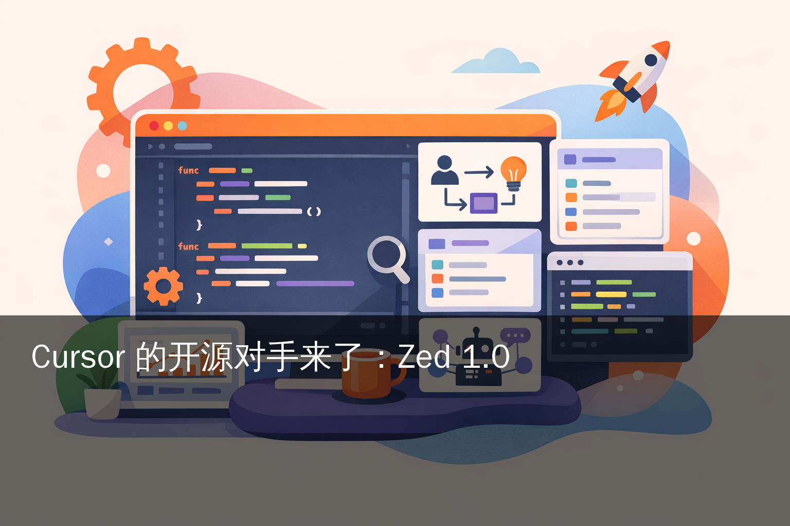
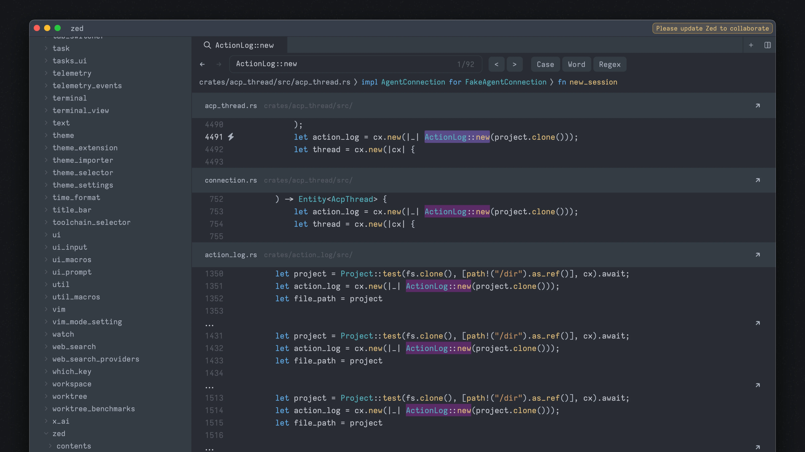
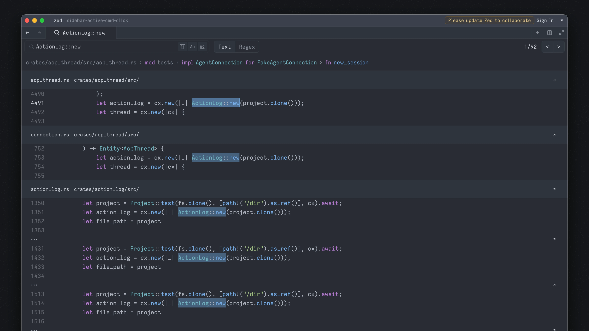

# Cursor 的开源对手来了：Zed 1.0

> 2026 年 4 月 29 日北京时间 22:31，Atom 创始人 Nathan Sobo 把他的下一个编辑器 [Zed](https://zed.dev/blog/zed-1-0) 拉到了 v1.0.0。从 2021-02-20 仓库第一次 commit 到这一刻，整整 5 年 2 个月。1000+ 版本、超 100 万行代码、Rust 写、自研 GPU 渲染框架。同一天 [HN 47949027](https://news.ycombinator.com/item?id=47949027) 截稿时 1156 pts、372 条评论（仍在攀升），斩获当日热门第一。

Zed 1.0 不是技术架构断点，是产品成熟度断点。Nathan Sobo 自己在公告里说："most developers can quickly feel at home in Zed"——不再像 0.x 时代那样还要劝你"再等等"。

比 1.0 版本号更值得看的，是它同步推出的几件事。

**Agent Client Protocol（ACP）**——Zed 自己创立、Apache 2 许可、已被 JetBrains 在 2025-10 接入的开放标准。它对编辑器和 coding agent 的关系，做了 LSP 当年对编辑器和语言服务做过的事。

**Zeta**——Zed 自己训的编辑预测模型。v1（2025-02）基座是阿里千问 [Qwen2.5-Coder-7B](https://huggingface.co/Qwen/Qwen2.5-Coder-7B)，v2（当前默认）切到字节跳动 [Seed-Coder-8B](https://huggingface.co/ByteDance-Seed/Seed-Coder-8B-Base)。**两代基座都来自中国开源模型**。

**Zed for Business**——商业版，集中计费、RBAC、团队管理、企业 SSO，把这套 5 年开源工程接进了企业付费市场。

**国内开发者今天能不能直接上手？** 能。下载直连的网络抖动可走代理 / ghproxy，输入法 / 中文渲染有三个社区本地化项目兜底，阿里千问 Qwen Code 已经官方接入 ACP 直接当 agent 用。具体配置见后文。

## 一、5 年 2 个月、超百万行代码：1.0 这个里程碑的实际重量

[Zed 1.0 公告](https://zed.dev/blog/zed-1-0) 自己点了几个数字：

- **shipped over a thousand versions**
- **exceeding a million lines of code**
- **most developers can quickly feel at home**

仓库元数据（`gh api repos/zed-industries/zed`）实测当前数字：

- ⭐ 80,265 stars
- 🍴 8,075 forks
- 主语言 Rust
- 仓库大小 441,838 KB
- 创建日 2021-02-20
- 首个 v1.0.0 release 发布于 2026-04-29 14:31:31 UTC（北京时间 22:31）

把这条时间线再拉远一点。Nathan Sobo 是 Atom 编辑器的原作者。GitHub 在 2022 年宣布关停 Atom（2022-12 正式 sunset）后，他和原班团队完成了从零重建的工作——选择不复用 Electron、不复用 web 技术，全部用 Rust 重写。Zed 仓库 2021-02 立项时 Atom 还在 GitHub 内部维护中，这条工程长跑的起点比关停公告还早一年。这次的 1.0，是这条长跑的终点线。

**5 年 2 个月**做一个商用编辑器走到 1.0，比早年 Atom 用 1 年（2014 → 2015）慢了不少，比 VSCode 从 2015-04 公开到 1.0 用 1 年也慢。但慢的代价是底盘扎实——这次 1.0 公告里没有"等下一版修一下吧" 这种声音。

⚠️ 顺带澄清一处常见误解：你可能见过文章说"Zed 是 Atom 团队 2017 年开始做的"。实际仓库的首次 commit 是 2021-02-20 23:05:36 UTC，作者 nathansobo，commit message `WIP`。2017 那个时间点，Atom 还在 GitHub 内部更新中。

## 二、技术栈：把编辑器当游戏写

Zed 把"编辑器写得像视频游戏" 当成自己的工程哲学。Nathan Sobo 在 [1.0 公告](https://zed.dev/blog/zed-1-0) 原话：

> "Instead of building Zed like a web page, we built it like a video game, organizing the entire application around feeding data to shaders running on the GPU."

具体落地是 **GPUI**——Zed 自研的 Rust UI 框架。不用 egui / iced 这类社区方案，因为他们要的是"sub-frame latency"——亚帧级响应延迟，必须直接驱动 GPU。

**License 拆成三段**（[daily.dev 分析](https://daily.dev/blog/zed-learn-everything-about-the-open-source-code-editor-built-in-rust)）：

| 模块 | License | 含义 |
|---|---|---|
| 编辑器主体 | GPL | 修改要开源、商用要署名 |
| Server（collab 后端） | AGPL | 网络服务也要开源 |
| GPUI / UI 框架 | Apache 2 + MIT 双重 | 别的项目可自由复用 |

⚠️ Zed README 没有明确的 license summary 段，GitHub API 报 `"NOASSERTION"`（多许可仓库的标准状态），上面三段式来源是第三方解读。如果你做企业合规审计，建议直接读对应子目录的 LICENSE 文件。

**120 FPS 渲染**是官方明确数字。[zed.dev/agentic](https://zed.dev/agentic) 原话：

> "Written in Rust, rendered at 120fps. When your agent edits 50 files, you see every change as it happens."

但 [HN 47949027](https://news.ycombinator.com/item?id=47949027) 上有反例。HN 用户 **nh2** 在 i7-7500U（一颗 2017 年的中端 mobile CPU）上实测 idle 状态：

- Zed：~800 syscalls/s + 50% 单核 CPU
- Sublime Text：0% CPU

也就是说，120 FPS 在新硬件上是真的，**老硬件上要付一些 CPU 代价**。这是把 GPUI 全 GPU 渲染策略推到极致的代价——idle 也在主动喂 frame。

Zed 官方在性能页给的对照数字（[国内博客园曦远 Code 转引并附独立解读，2026-04-05](https://www.cnblogs.com/deali/p/19822917)）：

- Zed 插入延迟（Insertion Latency）约 58 ms
- VSCode 插入延迟约 97 ms

体验上差异明显。但代价是插件生态远不及 VSCode——这是它当前最显眼的短板，1.0 也没有解决。

## 三、多平台：从 Mac 一路走到 Windows + WSL

| 平台 | 首发日期 | 状态 |
|---|---|---|
| macOS | 2021（仓库立项时期） | 5 年原生支持 |
| Linux | [2024-07](https://www.theregister.com/2024/07/15/zed_editor_arrives_on_linux/) | 官方稳定 |
| Windows | [2025-10](https://alternativeto.net/news/2025/10/zed-editor-launches-native-windows-version-with-wsl-integration-extensions-and-ai-features/) native | DirectX 11 + WSL 集成 + 扩展系统 |

Windows 这条 2025-10 才出官方 stable，比 Linux 还晚一年。原因是 Windows 不是 Unix-like 平台，DirectX 渲染管线和 macOS / Linux 的 OpenGL/Metal 路径完全不同。这一条上 Zed 团队等到 2025-10 才算补齐。

国内中文社区的反馈集中在两个时间点。

[V2EX 1138033 帖](https://www.v2ex.com/t/1138033)（2024 年）讨论的是早期 Windows 第三方 build——闪退、缺生态、上不去下不来。

[知乎 588951813](https://www.zhihu.com/question/588951813/answers/updated)（截至 2026-01）说"缺乏中文本地化"是当时最大短板。

**1.0 是否已修复中文本地化的核心痛点？** 截至本文截稿时间，未在官方 1.0 公告中找到 CJK 字体（思源黑体 / 苹方）渲染优化的明文，这条留给读者首次试用时验证。

社区已经有三个本地化项目兜底：

- [x6nux/zed-globalization](https://github.com/x6nux/zed-globalization)
- [Nriver/zed-translation](https://github.com/Nriver/zed-translation)
- [xxk8/zed-cn](https://github.com/xxk8/zed-cn)

输入法兼容性方面，Linux 下 Fcitx5 候选框定位错位是历史 issue（[fcitx5 #1067](https://github.com/fcitx/fcitx5/issues/1067)），需要配合 `gnome-keyring`。Mac 下原生输入法基本可用。

## 四、AI 集成：ACP 是这次 1.0 的真正核心

Zed 1.0 的 AI 集成层里，**Agent Client Protocol（ACP）才是这次 1.0 真正的核心结构**。其他能力（Zeta 编辑预测、多 agent 面板、MCP 支持）都是搭在 ACP 这块新地基上的。

ACP 是 Zed 自己创立、Apache 2 许可、放到 [github.com/agentclientprotocol/agent-client-protocol](https://github.com/agentclientprotocol/agent-client-protocol) 上的开放标准。它的设计思路在 [ACP 协议文档站](https://agentclientprotocol.com) 写得很直接——把 coding agent 和编辑器解耦，对应位置就是 2016 年 LSP 在编辑器和 language server 之间的位置。

LSP 在 2016 年由微软提出，让 VSCode 不用为每种语言写 plugin、让 NeoVim 不用单独搞 IDE 智能补全。**ACP 在 2025 年做了同样的事——让编辑器和 coding agent 解耦，agent 实现了 ACP 就能在任何 ACP 兼容编辑器里跑**。

到 2026-04-30 为止，已经实现 ACP 的 agent 包括：

- **Claude Agent**（Anthropic）
- **Codex**（OpenAI）
- **OpenCode**（[opencode.ai/docs/acp](https://opencode.ai/docs/acp/)）
- **Cursor**（2025-10 开始支持）
- **Gemini CLI**（Google）
- **GitHub Copilot CLI**
- **Kiro**（[kiro.dev/docs/cli/acp](https://kiro.dev/docs/cli/acp/)）
- **Qwen Code**（阿里巴巴官方接入，[Qwen Code 中文文档 · Zed 集成](https://qwenlm.github.io/qwen-code-docs/zh/users/integration-zed/)）

捷克起家的 JetBrains 在 [2025-10 官方博客](https://blog.jetbrains.com/ai/2025/10/jetbrains-zed-open-interoperability-for-ai-coding-agents-in-your-ide/) 宣布与 Zed 在 AI agent 互操作上合作。这意味着 ACP 不只是 Zed 内部协议，已经开始向其他 IDE 厂商扩展。

**阿里千问 Qwen Code 官方接入这件事，对国内开发者意义直接**——你在 Zed 里可以把千问当 coding agent 用，不用换编辑器、不用走海外 API。这条路径在国产 AI 生态主动适配开放标准的脉络里，是个值得标记的节点。

## 五、Zeta：编辑预测模型，两代基座都是中国开源

Zeta 是 Zed 自己训的编辑预测模型，做的是按键级粒度的 inline 建议——你按一下 `tab` 就能接受当前光标位置后面的下一段编辑。

它的工程内幕值得专门记一笔。

**Zeta v1**（[2025-02-13 发布](https://zed.dev/blog/edit-prediction)）：

- 基座：**阿里千问 Qwen2.5-Coder-7B**
- Fine-tune 数据：**约 500 条** hand-curated samples
- 公开权重 + 数据集

500 条 fine-tune 数据能跑出可用的 inline edit 预测，这件事本身就是"基座好的话工程量可以小"的实证。

**Zeta v2**（[2025 年中后期发布](https://zed.dev/blog/zeta2) + [开发记录](https://zed.dev/blog/how-we-developed-zeta2)，**当前默认模型**）：

- 基座：**字节跳动 Seed-Coder-8B**（v1 的 Qwen2.5-Coder-7B 被替换）
- 教师模型：Anthropic Sonnet 4.6（用知识蒸馏训学生）
- 数据：约 100,000 examples，生产数据规模约 250,000-300,000 requests / 周
- 接受率较 v1 提升约 30%；deltaChrF 指标 80.61 vs Qwen 7B 78.36
- 权重 + 数据集仍在 [huggingface.co/zed-industries/zeta](https://huggingface.co/zed-industries/zeta) 开源
- 性能 SLO：**p50 < 200 ms，p90 < 500 ms**
- 部署：美国 Baseten 推理 + 美国 Cloudflare Workers 边缘，GPU 在北美 + 欧洲

⚠️ 中国境内 RTT 没有官方披露。p90 < 500ms 的承诺是按北美 / 欧洲为基准。国内用户从上海到 Cloudflare 边缘节点的实际延迟，建议自己 ping 一下决定够不够用。

**这条 Zeta 基座路线值得国内开发者反复看几遍**——v1 基座是阿里千问，v2 基座切到字节跳动 Seed-Coder。海外编辑器在自己的核心 inline 模型上，**两代选的都是中国开源 LLM**。这件事比单一供应商更说明问题：国产开源模型的工程红利已经稳定到了"被海外旗舰应用首选 + 多家可替代"的层级，不是偶发事件。

## 六、DeltaDB：协作引擎跑在 CRDTs 上

[Zed 1.0 公告](https://zed.dev/blog/zed-1-0) 提到：

> "DeltaDB, a synchronization engine built on CRDTs that tracks every change with character-level granularity."

CRDT（Conflict-free Replicated Data Type）是分布式系统里"无冲突最终一致" 的工程套路。Tree-sitter / yjs / Automerge 都用过这条路。Zed 把它做成自己的 DeltaDB 引擎，**character-level granularity** 意味着每个字符级的修改都能精确同步——这是远超普通 git diff 的精度。

⚠️ 公告里没有明确说 DeltaDB 是 1.0 同步发布还是"即将到来"。从行文判断属同期推出的 collaboration 引擎。要看完整 demo 需要进 Zed for Business 申请 enterprise 通道。

实时多人编辑的产品形态，Zed 早期 0.x 已经支持，1.0 把它升级到了 character-level 粒度。延迟和体验上，你需要把它和 VSCode Live Share 实测对比才能下判断——本文截稿时这一对比未做完整。

Voice / Video chat 等通讯能力，1.0 公告未提，未确认。

## 七、价格：Personal $0、Pro $10/月

[zed.dev/pricing](https://zed.dev/pricing) 实测：

| Tier | 价格 | 内容 |
|---|---|---|
| Personal | **$0 / 月** | 2,000 次 accepted edit predictions、用自己 API key 不限量、可调外部 agent |
| Pro | **$10 / 月** | 不限量 edit predictions、$5 token 包含、超出按 API list price + 10% 计费 |
| Enterprise | Contact us | SSO、Usage analytics、Shared billing、Security & data privacy、Premium support |

学生计划[（zed.dev/blog/student-plan）](https://zed.dev/blog/student-plan)免费 12 个月 Pro，每月送 $10 AI token credits。

⚠️ 你可能在第三方搜索结果（saasworthy / threads.com）看到 "Zed Pro $20/月" 的过时数字，以官方 pricing 页 $10/月为准。

中国发票 / 人民币 / 增值税开票，**官方文档未提及**。截至 2026-04-30 国内付费需海外信用卡 + 美元结算。这是当前国内企业落地的实际门槛。

## 八、HN 1156 pts 的 6 条主线争议

[HN 47949027](https://news.ycombinator.com/item?id=47949027) 这条 1156 pts / 372 条评论的讨论，把 Zed 1.0 的真实社区位置切了 6 个面：

**主线 1 · 数据 / Telemetry 条款**。HN 用户 **jorgeleo** 反对 Zed 服务条款 §4.1 Customer Data 那句"royalty-free, worldwide... right to use, copy, store, disclose, transmit, transfer, display, modify, create derivative works"——授权范围被认为过宽；HN 用户 **gpm** 单独点出 §4.4 telemetry 定义模糊、可能涵盖 LLM 训练。**meantub / aljaz823** 反驳条款合理。这是 1.0 公告同步推出 Zed for Business 后绕不开的话题——商业化必然带来数据治理问题。

**主线 2 · 性能反例**。HN 用户 **nh2** 实测 i7-7500U 上 Zed idle 50% CPU + 800 syscalls/s，对比 Sublime 0% CPU。GPUI 全 GPU 渲染策略在老硬件上的代价是真的。

**主线 3 · 搜索 UI 形态**。HN 用户 **f311a** 不喜欢 Zed 的搜索打开新 tab 而不是 modal 浮层，原话说"Telescope style search in vim, helix or JetBrains tools is so much better"——对照对象是 vim、helix、JetBrains 三个体系。

**主线 4 · 默认主题对比度**。HN 用户 **alternatex** 指出 Zed 默认主题对比度低，对低视力 / 高亮度环境不友好。

**主线 5 · 迁移意愿**。HN 用户 **giancarlostoro** 表示已停掉 JetBrains 订阅；**joefitzgerald** 则说"过去一年根本没打开过 VSCode"——一个停的是 JetBrains 订阅、一个停的是 VSCode 入口。Zed 在重度 IDE 用户里的流量，从 0.x 时代就开始累积。

**主线 6 · 大文件性能**。V2EX 与 HN 都反馈打开大文本（百 MB 级 log）慢于 VSCode。这是 GPUI 的工程口味——优化"日常编辑流畅度" 而不是"打开任意大小文件" 的代价。

把这 6 条放在一起读，**Zed 1.0 不是给所有开发者的**——它有明确的设计边界。如果你常年在 VSCode 体系里用 GitLens / Prettier / ESLint / TypeScript 多工具链，迁过来短期会丢生态；如果你写 Rust / Go / Python / TypeScript 单一栈、追求亚帧级响应、需要多 agent 并行，1.0 是一个真值得测的产品。

## 九、国内开发者的实操路径

按使用场景拆开：

**场景 A · 试用**

- Mac：[zed.dev](https://zed.dev) 直接下载 dmg
- Linux：`curl -f https://zed.dev/install.sh | sh`
- Windows：从 [zed.dev/windows](https://zed.dev/windows) 下载 .exe

国内连 raw.githubusercontent / objects.githubusercontent 不稳定时，走 ghproxy 镜像或直接配 GitHub 代理。这是 GitHub 通病，不是 Zed 单独问题。

**场景 B · 把 VSCode 设置带过来**

Zed 内置 `vscode_settings` 导入命令——首次启动时会问你要不要从 VSCode 复制设置 / 主题 / keybinding。VSCode 重度用户的迁移成本相对可控。

**场景 C · 把 Cursor agent 接进来**

Cursor 已经实现 ACP，在 Zed 里可以把 Cursor agent 当 external agent 调用——这是把 Cursor 的代码补全 + Zed 的编辑器渲染拼在一起的玩法。

**场景 D · 把千问 Qwen Code 当 agent 用**

按 [Qwen Code 中文文档 · Zed 集成](https://qwenlm.github.io/qwen-code-docs/zh/users/integration-zed/) 配 ACP endpoint。这条路走通了你就能在 Zed 里调阿里千问的代码模型，不动海外 API、不走 Cloudflare 节点。

**场景 E · 中文本地化**

三个社区项目可选：

- [x6nux/zed-globalization](https://github.com/x6nux/zed-globalization)：菜单 / 设置面板汉化
- [Nriver/zed-translation](https://github.com/Nriver/zed-translation)：UI 翻译扩展
- [xxk8/zed-cn](https://github.com/xxk8/zed-cn)：中文环境补丁

社区维护质量参差，先试 x6nux 那个 star 数最高的。

## 十、ACP 是 LSP 的对应物

把 Zed 1.0 的产品逻辑往后再想一步——**ACP 这个开放协议，比 1.0 这个版本号本身更值得记住**。

LSP 在 2016 年的意义，回头看是给所有编辑器降了一个量级的功能开发成本。VSCode、NeoVim、Sublime、JetBrains 都不用再各自实现 TypeScript / Python / Rust 的智能补全，而是接同一组 language server。

ACP 在 2025 年开始走的是同一条路——让 coding agent 和编辑器解耦。Claude Agent / Codex / Cursor / Gemini CLI / 阿里千问 Qwen Code 都用同一个协议，**编辑器厂商不再需要为每种 agent 单独写适配**。这件事的工程意义和长期格局影响，可能比 Zed 1.0 这个产品本身更深远。

⚠️ 截稿时其中 Cursor / GitHub Copilot CLI 的 ACP 适配状态以 Zed 1.0 公告为准，独立 200 验证未跑全；Claude Agent / Codex / OpenCode / Kiro / Qwen Code 的接入文档已直接核过。

JetBrains 在 2025-10 公开宣布与 Zed 合作 AI agent 互操作、阿里千问 Qwen Code 官方支持 ACP（2026 年早期）这两件事是早期信号——开放协议的网络效应在转动。VSCode / Cursor 自家闭源 agent 体系在长期是顶不住的，要么主动加入，要么自己造一个对标协议，要么在 agent 互操作层付出整合成本。

国内 IDE 厂商（通义灵码 / DeepSeek IDE 适配 / RooCode / Cline）下一波的工作面，**很可能就是把自己的 coding agent 实现成 ACP 兼容**。这条路上，Zed 已经把基础设施搭好了。

## 十一、值得做的几件事

把 Zed 1.0 当工具试一试。Mac / Linux 直装，Windows 用 1.0 native 版，先把它当文本编辑器跑通。120 FPS 渲染 + Zeta 编辑预测的手感，需要亲手打几行代码才能感受。

把千问 Qwen Code 当 ACP agent 接进 Zed。这条路的价值不是省一两笔 API 钱，是把 Zed 的多 agent 形态用国产模型跑起来，验证 ACP 在中文环境的实际表现。

把 ACP 协议读一遍。[github.com/agentclientprotocol/agent-client-protocol](https://github.com/agentclientprotocol/agent-client-protocol) 的 spec 仓库不大，几个核心的消息类型和生命周期看完就能理解 LSP-like 的工程思路。

跟踪 ACP 生态扩张速度。如果 2026 年中之前 VSCode 也加入了 ACP，这个协议就是行业标配；如果没有，就是 Zed / JetBrains 阵营 vs VSCode / Cursor 阵营的两条路。

中国 AI 工程师这一波的生态位置正好是顺风的——千问、DeepSeek 的开源模型开始被海外编辑器主动选作基础设施，国产 IDE 也有了能跟全球开放协议对齐的接口。

5 年长跑落地的 Zed 1.0，是开发者工具生态又一块拼上来的拼图。下一块拼图，可能是国产 IDE 厂商对 ACP 的回应，也可能是更轻量的中文社区编辑器在同一条路上往前推一步。

工具生态在变好，写代码的人值得拥有更顺手的家伙事。
