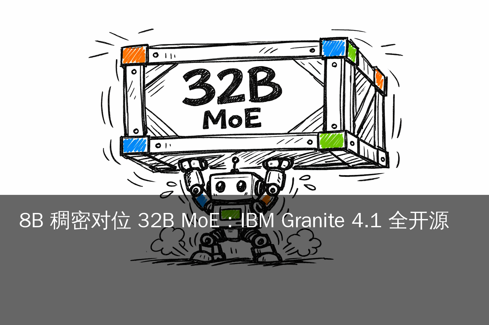
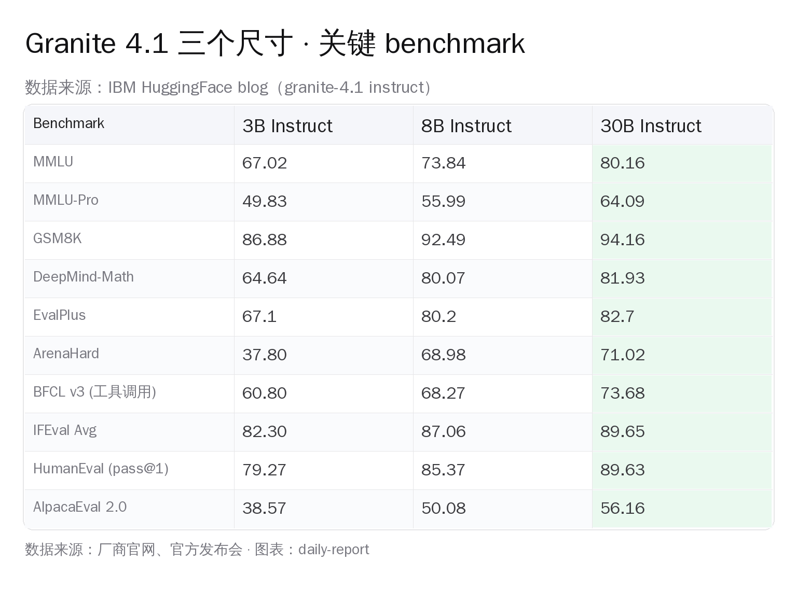
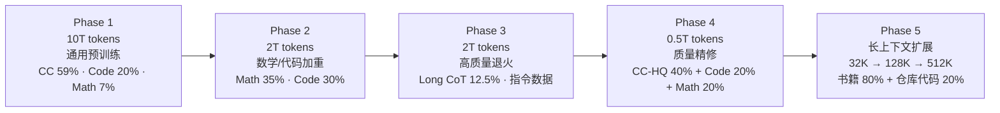
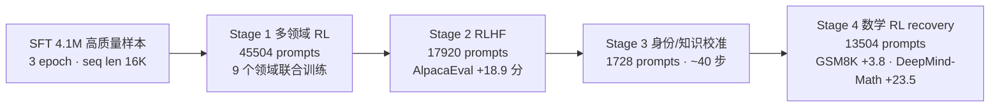
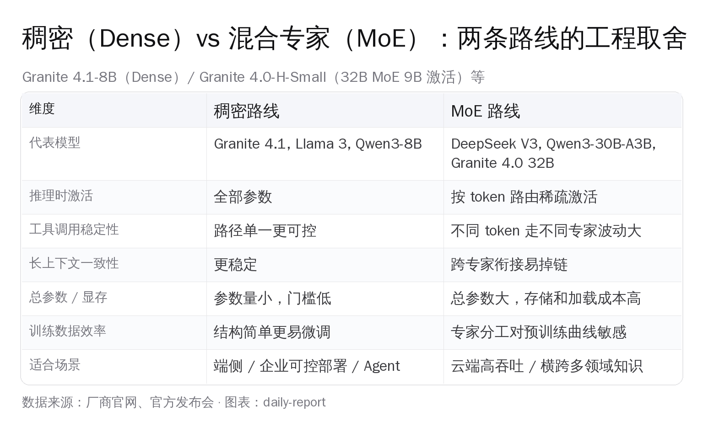
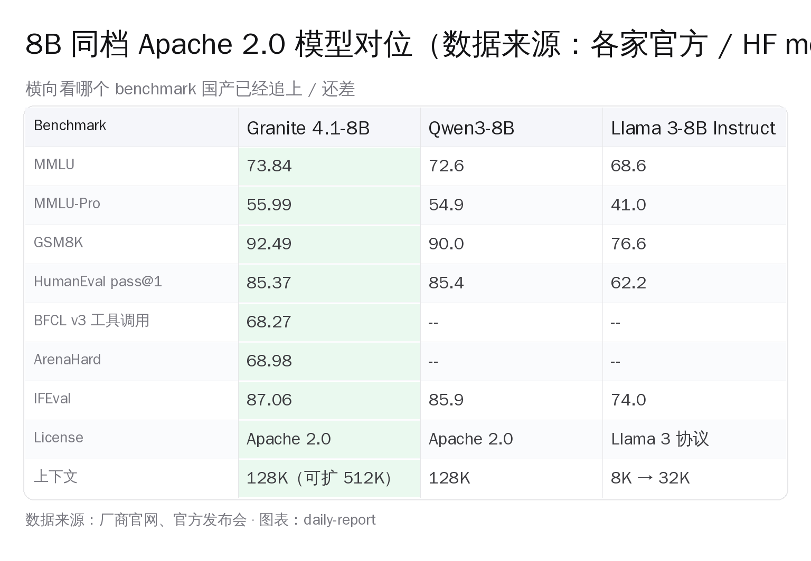

# IBM Granite 4.1：8B 反超 32B MoE



> 4 月 29 日，美国公司 IBM 在 [research.ibm.com](https://research.ibm.com/blog/granite-4-1-ai-foundation-models) 与 [HuggingFace](https://huggingface.co/blog/ibm-granite/granite-4-1) 同步上线 **Granite 4.1**：3B / 8B / 30B 三档稠密 decoder-only 模型，**全部 Apache 2.0**。8B 这一档在 ArenaHard、BFCL v3 工具调用、GSM8K、DeepMind-Math、EvalPlus 上整体追平甚至反超前代 **Granite 4.0-H-Small**（32B MoE / 9B 激活）。15 万亿 token、5 阶段预训练、LLM-as-Judge 6 维度过滤、4 阶段 RL，全部在 NVIDIA GB200 NVL72 集群完成。次日（4 月 30 日）登上 HN 头条 248 分、158 评论。

国内开发者最直接的几个结论先抛在前面：**Granite 4.1-8B 在 Ollama 上 5.3 GB 一行 `ollama run granite4.1:8b` 就能本地跑、在 4060 Ti 16 GB / Mac M3 / M4 上推理流畅、Apache 2.0 同款国产 8B 选项也很多（Qwen3-8B / Yi-Coder 9B / GLM-4-9B）**。它给中文 AI 开发者的真正价值不是"换底座"，而是把"稠密 vs MoE"这条路线的工程账本算给你看了。

## 一、事实层：三个尺寸 · benchmark · 训练流程

先把发布物清单摆清楚（来自 [HuggingFace 官方技术博客](https://huggingface.co/blog/ibm-granite/granite-4-1) 与 [ibm-granite/granite-4.1-8b](https://huggingface.co/ibm-granite/granite-4.1-8b) 模型卡）：

- **三个稠密尺寸**：`granite-4.1-3b` / `granite-4.1-8b` / `granite-4.1-30b`，每个尺寸都有 `base` 与 `instruct` 两个版本
- **License**：Apache 2.0（商用 + 研究都允许、可二次微调、无营收例外条款）
- **架构**：Dense decoder-only Transformer + GQA + RoPE + SwiGLU + RMSNorm + 共享 input/output embedding
- **上下文**：8B / 30B 出厂 128K，可扩到 512K；3B 出厂 128K
- **训练数据**：约 15 万亿 token，分 5 阶段
- **量化**：FP8 量化变体已发，磁盘 / 显存约减半（vLLM 推理优化）
- **配套**：[Granite Guardian 4.1-8B](https://huggingface.co/ibm-granite/granite-guardian-4.1-8b) 安全检查模型同步发布
- **基础设施**：CoreWeave 上的 NVIDIA GB200 NVL72 集群，单机 72 卡 NVLink、跨机 NDR 400 Gb/s InfiniBand



8B 这档的几个数字尤其值得盯一下：**ArenaHard 68.98**（前代 32B MoE 显著低于这个分数）、**BFCL v3 工具调用 68.27**（前代 64.7）、**GSM8K 92.49**、**DeepMind-Math 80.07**、**EvalPlus 80.2**、**MMLU-Pro 55.99**、**IFEval 87.06**、**HumanEval pass@1 85.37**。IBM 在官方博客里直接写：「the new Granite 4.1 8B instruct model **consistently matches or outperforms** the Granite 4.0 32B Mixture-of-Experts model」。这是一个**8B 稠密超越同家 32B 稀疏**的明确说法。

### 5 阶段预训练 + 4 阶段 RL pipeline

整套训练流程拆得很细，是这次发布里最值得国产基座团队对照的一处工程实践。先看 5 阶段预训练（约 15T token）：



再看 SFT 之后的 4 阶段 RL pipeline。算法是 **on-policy GRPO + DAPO loss**（[Yu et al. 2025](https://arxiv.org/abs/2503.14476)），每个阶段瞄准一项独立能力：



几个工程细节值得拎出来：

- **数据混合按阶段大幅切换**：Phase 1 通用语料 80%+，到 Phase 2 数学+代码占比直接拉到 65%，Phase 3 加入长链思维（Long CoT）12.5% 与多种指令数据，Phase 4 全部锁定在高质量精修。这种"分段调度"的策略让模型在通用能力打底完成后再针对硬技能深挖
- **长上下文是最后单独扩**：Phase 5 才把上下文从 32K 扩到 128K 再到 512K，数据用 80% 书籍 + 20% 代码仓库——书籍用来训练长程语义连贯、代码仓库用来训练跨文件引用
- **GB200 NVL72 集群**：单节点 4 张 GB200 + 16 节点协同，跨机走 NDR 400 Gb/s InfiniBand。SFT 阶段每 iteration 处理 256 样本 / 约 4.2M token，3 epoch 跑完约 25K 步

SFT 阶段的数据筛选用了 **LLM-as-Judge 6 维度评分**（指令遵循 / 正确性 / 完整性 / 简洁性 / 自然度 / 校准），叠加硬否决规则（幻觉 / 错误前提 / 计算错误 / RAG 无依据 / 工具调用不合法），再叠确定性规则（全局去重、数据泄漏检测、文本归一化、schema 校验）。从原始海量样本筛到 **410 万条**高质量样本入 SFT，整个过程**完全可审计**——每一条被丢掉的样本都能追溯触发了哪条规则。

RL 阶段的算法选型也有意思。`On-policy GRPO + DAPO loss` 这个组合，每个 prompt 采 16 个样本、训练 batch 1024、context 长度 8192，4 阶段总共消耗约 **78656 个独立 prompt**。比整个 SFT 数据量小一个数量级，但每条 prompt 都要采 16 次输出做相对比较——这是 GRPO 区别于传统 PPO 的核心。

这套数据工艺最值得国内基座团队对照学一下的不是"复刻参数"，而是**把每条样本怎么打分、怎么否决、怎么去重整体写成一份可审计的 pipeline**。国产开源模型今天普遍偏弱在这一层——很多团队预训练数据来源讲得清楚，但 SFT 阶段是怎么从原始指令池筛到最终训练集的，往往一笔带过。Granite 4.1 这次把 SFT 的 6 维度评分 + 5 条硬否决规则全摊开，等于是把"高质量数据怎么造"做成了一份开源工程蓝图。

## 二、稠密 vs 混合专家：Granite 4.1 把工程账本摊开了



过去一年，开源大模型的主流叙事是 **MoE 取代 Dense**：DeepSeek V3 / Qwen3-30B-A3B / Mistral Mixtral 系列各家都在堆专家、卷激活效率。MoE 的核心优势很清楚——**总参数量上去了，单 token 只激活一小部分专家**，云端高吞吐场景计算效率高。

但 MoE 也有它自己的代价。Granite 4.1 这次的有意思之处，正是 IBM 选了一条**反向**的工程路线——把 8B 稠密做到对位 32B MoE / 9B 激活的水平，并且把这条路线适合的场景说得很明确：

**稠密路线的三项天然优势**：

1. **推理时全参激活、路径单一**：稠密模型每个 token 都跑同一组权重，输出稳定性高、波动小。这对**工具调用**（function calling）这种需要严格 schema 一致性的任务尤其重要——BFCL v3 工具调用 68.27 这个分数，很大一部分要归功于稠密结构带来的可预测性。MoE 模型不同 token 走不同专家，长链工具调用容易在中段掉链
2. **长上下文一致性**：512K 上下文的扩展训练对 MoE 很考验路由稳定性——专家分布不均匀时，跨段衔接会出现"换专家就换语境"的现象。稠密模型没有这一层，长文档摘要、代码仓库通读、长对话历史等场景表现更稳
3. **微调与部署门槛低**：稠密结构对企业 RAG / 私域微调团队特别友好。一个不到 16 GB 显存的 8B 模型，单卡 4090 / RTX 5090 就能 LoRA 微调；MoE 模型即使激活参数只有 9B，存储和加载完整权重往往要 80 GB+ 显存才能跑起来

**MoE 路线的本职**则是另一回事——**总参数大、专家分工、按 token 路由**适合的是云端高吞吐场景。DeepSeek V3 这一档（671B 总参数 / 37B 激活）在 API 服务端面对海量并发请求时，平均每张卡能跑出来的 token/s 远高于同档稠密。Qwen3-30B-A3B 也是同样的逻辑——单机 8 卡服务大批量、批量越大 MoE 效率优势越明显。

国内对照很直接：**Qwen 系列今年同时发了稠密档（Qwen3-8B / Qwen3-27B Dense）和 MoE 档（Qwen3-30B-A3B）**，覆盖两类需求。这条思路和 IBM 这次本质上是同一个判断——稠密和 MoE 不是"谁取代谁"，是**两条并行赛道**。

Granite 4.1-8B 这次给国内开发者的真正信号是：**做 8B 稠密的天花板比想象中更高**。前代同家 32B MoE 多 4 倍激活参数、20 多 GB 额外显存，结果在 ArenaHard、BFCL v3、GSM8K 这些指标上反而被 8B Dense 反超——前提是数据筛选 + RL pipeline 做得足够细。这条路径值得国内基座团队认真对照。

### 一个反直觉的细节：Math RL recovery

Granite 4.1 训练流程里有一处特别值得抠的细节——RL pipeline 第 4 阶段叫 **Math RL recovery**。为什么是"recovery"（恢复）？

原因是 Stage 1（多领域 RL）跑完之后，IBM 团队发现模型在数学题上的表现**回退**了——这是多目标联合优化常见的副作用，模型为了在指令遵循、对话质量、事实校准这些维度上同步提分，会牺牲一部分硬数学能力。Stage 2 的 RLHF（AlpacaEval +18.9 分）和 Stage 3 的身份/知识校准更进一步加深了这个回退。

所以最后一道 RL 专门用 **13504 条数学题做单独 recovery**——结果 GSM8K 涨了 3.8 分、DeepMind-Math 涨了 23.5 分。这个细节说明几个工程事实：

- **多领域 RL 不是免费午餐**：联合优化总会有此消彼长，需要单独 recovery 阶段补回硬技能
- **数学是 RL pipeline 里第一类公民**：所有需要硬正确性的任务（数学 / 代码 / 工具调用），都得有专门 RL 阶段
- **顺序矩阵很重要**：先做通用 RL → 再做对话 RLHF → 最后做硬技能 recovery。如果反过来先把数学拉满再去做 RLHF，对话能力会拉数学下水

国产基座团队在 RL pipeline 设计上经常一锅炖——所有目标在同一阶段联合优化。Granite 4.1 这套**分阶段 + 后置 recovery** 的设计是更值得借鉴的工程范式。

## 三、IBM 的企业定位：和 OpenAI / Anthropic 不在一个战场

很多人第一反应会问——Granite 4.1 这一档，和 GPT-5 / Claude 4.7 / Gemini 3 怎么比？答案是：**根本不在同一个战场**。

OpenAI / Anthropic / Google 走的是"通用消费 + 高端推理"路线——大参数、闭源权重、按 API 调用收费、单次请求价格高、追求 SOTA benchmark。IBM Granite 系列从 4.0 开始就明确定位在**企业内部部署 + 可预测延迟 + 工具调用一致性 + 边缘设备**。这是和 [Mistral](https://mistral.ai/) / [Cohere](https://cohere.com/) 这类"企业开源"派更直接的竞争。

判断标准也不一样。IBM 卖给企业客户的不是"benchmark 第一"，而是几个企业 IT 部门更在意的属性：

- **可预测延迟**：稠密模型推理时延更稳定，便于 SRE 给后台 SLA 定线
- **本地部署能力**：3B / 8B 完全可以在客户内网跑，不出私有云
- **工具调用稳定性**：BFCL v3 这种工具调用 benchmark IBM 跑得很认真，本身就是企业自动化场景的关键能力
- **配套安全模型**：Granite Guardian 4.1-8B 同步发布，专门检查偏见 / 幻觉 / 越狱 / 攻击性内容，给合规部门一个交付物
- **完整许可证**：Apache 2.0 一行字解决律师团队所有疑问，比 Llama 协议、Modified MIT 干净得多

watsonx 平台这一侧 IBM 也已经把 Granite 4.1 接入生产 API。对国内读者来说，这一层意义不大——watsonx 国内不可用——但**模型权重 100% 开放**意味着可以本地用任何方式部署。

### 配套 Granite Guardian：企业部署的合规拼图

[Granite Guardian 4.1-8B](https://huggingface.co/ibm-granite/granite-guardian-4.1-8b) 是这次同步发布的安全审核模型。它不是一个聊天模型，而是一个专门用来**给主模型输出做风险判定**的二级模型。IBM 官方原话是检测以下风险：「socially biased content, hateful, abusive, or profane language, hallucinations, agentic risks, attempts by users to break through an LLM's safety controls」——社会偏见 / 仇恨/侮辱/脏话 / 幻觉 / 代理风险 / 越狱尝试。

这种"主模型 + 守护模型"的双模型架构，是企业部署里非常实用的一套设计：

- 主模型 Granite 4.1-8B 负责正常推理 / 工具调用 / 长上下文理解
- 守护模型 Guardian 4.1-8B 在每个回复发出前做一道审核，遇到违规直接拦截
- 两个 8B 模型同时跑，约 16 GB 显存，单张消费级显卡（RTX 5090 32 GB）就能装下完整方案

这对国内企业 RAG / 客服机器人 / 内部知识助手类场景特别有用——合规审查这件事过去往往要再叠一层规则引擎或外部 API，现在 8B 守护模型本地化跑就能解决大部分场景。**国内做合规向 AI 产品的同行可以重点关注这条路径**。

### IBM 的同行参照系：Mistral / Cohere / DeepSeek 企业线

把 Granite 系列摆在更大的图景里看，IBM 的"企业开源 + Apache 2.0 + 工具调用稳定"这条路其实有几个国际同行：

- **Mistral**：法国公司，前段时间发布了 Medium 3.5（128B Dense）+ Vibe Remote Agents，定位介于"消费 SOTA"和"企业可控"之间，许可是 Modified MIT（对大企业有营收例外），不如 Apache 2.0 干净
- **Cohere**：加拿大公司，长期专攻企业 RAG / 检索增强场景，模型开源策略更保守，主要走 API
- **DeepSeek**：国内代表，V3 / Coder 系列覆盖云端高吞吐场景，许可是 MIT，社区活跃度最高

Granite 4.1 这条路的差异化点是 **"小尺寸稠密 + 完整 Apache 2.0 + 配套守护模型 + 工具调用 benchmark 公开"**——这套组合拳在企业 IT 部门的采购清单上占据一个很特定的位置。它和 OpenAI / Anthropic 的"通用 SOTA"赛道根本不冲突，更不是要去抢消费市场。

## 四、国内能不能用 / 怎么用：实操路径全摊开

权重 Apache 2.0 + HuggingFace 公开 + Ollama 一键，国内开发者完全能跑。下面是几条实操路径，按门槛从低到高：

### 路径 1：Ollama 一键本地（最快、3 分钟）

```bash
# 8B 模型 5.3 GB，建议 16 GB 显存的卡
ollama run granite4.1:8b

# 30B 模型 17 GB，建议 24 GB 显存
ollama run granite4.1:30b

# 3B 模型 2.1 GB，CPU 也能跑
ollama run granite4.1:3b
```

国内访问 Ollama 拉模型权重通常没问题（Ollama 自家 CDN）。**显存估算参考**：

- 3B FP16：约 6 GB · FP8：约 3 GB → MacBook Air M3 都能跑
- 8B FP16：约 16 GB · FP8：约 8 GB → RTX 4060 Ti 16 GB / RTX 5090 / Mac M3 Pro 32 GB / M4 Pro 都流畅
- 30B FP16：约 60 GB · FP8：约 30 GB → 单卡 RTX 5090 32 GB 可吃下 FP8 版

### 路径 2：HuggingFace + Transformers（需要外网或镜像）

国内拉 HF 权重有几个稳定办法：

1. **HF Mirror（hf-mirror.com）**：设置 `export HF_ENDPOINT=https://hf-mirror.com` 环境变量后 `from_pretrained` 自动走镜像
2. **ModelScope（魔搭社区）**：搜 `ibm-granite/granite-4.1-8b`，魔搭一般会在原模型公开后几天内同步镜像
3. **直接代理**：clash / v2ray 走 HF 主站

代码完全是标准 Transformers 路径：

```python
import torch
from transformers import AutoModelForCausalLM, AutoTokenizer

model_path = "ibm-granite/granite-4.1-8b"
tokenizer = AutoTokenizer.from_pretrained(model_path)
model = AutoModelForCausalLM.from_pretrained(
    model_path,
    torch_dtype=torch.bfloat16,
    device_map="cuda",
)
chat = [{"role": "user", "content": "用 Python 实现快速排序"}]
prompt = tokenizer.apply_chat_template(chat, tokenize=False, add_generation_prompt=True)
inputs = tokenizer(prompt, return_tensors="pt").to("cuda")
output = model.generate(**inputs, max_new_tokens=512)
print(tokenizer.batch_decode(output)[0])
```

### 路径 3：vLLM 高吞吐推理（生产部署）

vLLM 团队对 FP8 量化有专门优化，Granite 4.1 的 FP8 变体本身就是针对 vLLM 优化的：

```bash
pip install vllm
python -m vllm.entrypoints.openai.api_server \
  --model ibm-granite/granite-4.1-8b \
  --quantization fp8 \
  --max-model-len 131072 \
  --dtype bfloat16
```

跑起来后就是一个 OpenAI 兼容的 API，前端任何 SDK（含 LangChain / OpenAI Python SDK）都能直接接。

### 国产 8B 同档对位

不能不讲国产同档。Granite 4.1-8B 拿出 Apache 2.0 标签后，国内开发者需要的同款替代选项其实**已经很丰满**：



逐项看下来：

- **Qwen3-8B（阿里 / Apache 2.0 / ModelScope 直下）**：MMLU 72.6、GSM8K 90.0、HumanEval 85.4，整体 benchmark 几乎贴脸 Granite 4.1-8B。中文能力上 Qwen 是国内首选，128K 上下文同档，工具调用通过 Qwen-Agent 框架。**国内开发者首选 Qwen3-8B 没毛病**
- **GLM-4-9B（智谱 / Apache 2.0 / ModelScope 同步）**：智谱去年开源、今年仍在更新的 9B 主力，[HuggingFace 模型卡](https://huggingface.co/zai-org/glm-4-9b) 维护活跃，多模态变体（GLM-4V）覆盖图文理解。中文 + 英文双语权重比较平衡
- **Yi-Coder 9B（零一万物 / Apache 2.0）**：HumanEval 85.4 直接对位 Granite 4.1-8B 的 85.37，128K 上下文，是专攻代码场景的国产 9B 选项
- **Llama 3-8B**：协议是 Llama 3 自有协议（不是 Apache 2.0，对大公司商用有营收门槛限制），benchmark 整体落后 Granite 4.1-8B 与 Qwen3-8B，今天选它的理由不多

**国内同行选型建议**：通用能力 + 中文优先选 Qwen3-8B；工具调用 / 函数调用稳定性优先（agent / RAG 场景）可以并测 Granite 4.1-8B 与 Qwen3-8B；纯代码补全选 Yi-Coder 9B；多模态需求走 GLM-4V-9B；本地试 Apache 2.0 国际同款看英文场景就上 Granite 4.1-8B。

## 五、HN 与开发者社区怎么看

[HN 47960507](https://news.ycombinator.com/item?id=47960507) 这条帖子在 4 月 30 日冲到头条，248 分、158 评论，社区分歧有点意思。

正面派的代表评论：

> 「I test drove it yesterday. It's pretty impressive at 8b. Runs on commodity hardware quickly.」 ——`2ndorderthought`

社区里几条共识——Apache 2.0 协议干净、5.3 GB 文件可以塞进任意消费级显卡、BFCL 工具调用 benchmark 跑得很认真，是企业内部 RAG 团队会愿意尝试的形态。

质疑派也有，主要是和 Qwen3 对比时的相对位置：

> 「Qwen3.6 35b a3b is still my local champion but I may use this for auto complete.」 ——`2ndorderthought`

> 「Because Qwen 3.6 pushes way above its weight. Granite 8B is impressive, but Qwen still wins on raw capability.」 ——`steveharing1`

> 「No comparison with competitor models strongly implies it does not compete well with other comparable models.」 ——`captainbland`

最后这条的意思是 IBM 官方公告里没把 Qwen / Llama / Mistral 放进同框对比表，只对比了自家 4.0 版本。这是个真实的讨论盲点——但同时也说明 IBM 的市场判断很清楚：他们不是冲 SOTA benchmark 去的，是冲企业可控部署 + 工具调用稳定性这一档。

## 六、对国内开发者的几条建议

写到这里几个判断我已经形成了：

1. **本地试一把 Granite 4.1-8B 是值得的**。FP8 8 GB 显存，4060 Ti / Mac M3 Pro 都能跑，10 分钟就能感受到稠密 8B 在 RAG / 工具调用 / 长上下文一致性上的真实表现
2. **生产环境选型仍然以 Qwen3-8B 为主**。中文能力 + 国内生态（魔搭 / DashScope / Aliyun PAI）一体化、社区资源多、Apache 2.0 同款协议
3. **稠密 vs MoE 不是路线之争**。Granite 4.1 的真正贡献是把"8B 稠密能干到什么程度"这条线推上去了——给国产基座团队的启发是：把数据筛选 + RL pipeline 做细，比单纯堆专家更值得投入
4. **企业 RAG / Agent 团队**可以并测 Granite 4.1-8B 和 Qwen3-8B 在工具调用、长文档摘要、Function Calling 上的差异——前者稠密结构对长链一致性可能更友好

我们这一代国内 AI 开发者很幸运的一点是：**主流开源 8B 选项基本都是 Apache 2.0**——Qwen3、Yi-Coder、GLM-4、Granite 4.1，权重可下载、可商用、可微调。前辈把基础设施趟出来了，今天本地跑一个 8B 就能把客户端 / 边缘设备 / 内网服务都接上去。这条路一直在变宽，我们只要继续把工程做细，就能站得更稳。

---

**链接合集**

- IBM Research 官博：https://research.ibm.com/blog/granite-4-1-ai-foundation-models
- HuggingFace 技术博客：https://huggingface.co/blog/ibm-granite/granite-4-1
- 8B 模型卡：https://huggingface.co/ibm-granite/granite-4.1-8b
- 30B 模型卡：https://huggingface.co/ibm-granite/granite-4.1-30b
- Granite Guardian 4.1-8B：https://huggingface.co/ibm-granite/granite-guardian-4.1-8b
- HN 讨论：https://news.ycombinator.com/item?id=47960507
- Ollama：https://ollama.com/library/granite4.1
- IBM Granite 文档：https://www.ibm.com/granite/docs/
