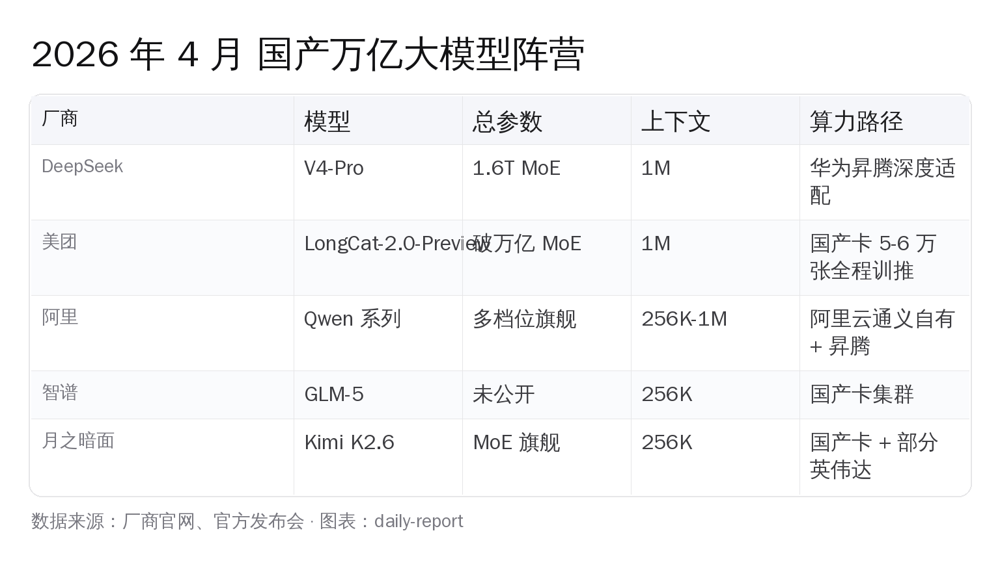

# 美团 LongCat-2 上线：万亿基座、全程国产卡

> 5 至 6 万张国产算力卡，撑起一次万亿参数训练。这是迄今为止国产卡上跑过的最大规模大模型训练，发生在美团手里。和 DeepSeek V4 同一天，2026-04-24，LongCat-2.0-Preview 在 longcat.ai 开放邀请测试，每天送 1000 万免费 token。

王兴在 2026 年 3 月美团财报电话会上把话讲得很白：「**在 AI 领域，美团唯一的策略是进攻**」、自 2023 年初以来，美团在资本支出和 AI 人才上做了大规模投入，「除云厂商外，可能是中国 AI 领域投入最大的公司之一」，目标是「**争取把美团 App 率先升级成为 AI-Powered App**」。三年时间，LongCat 系列从 2025 年 9 月的 Flash-Chat 开源起步，一路走到 2026-04-24 的 LongCat-2.0-Preview 万亿基座——这条线索连起来，比单看一个发布事件清楚得多。

---

## 一、4 月 24 日下午到底发了什么

LongCat-2.0-Preview 是美团新一代基础大模型的预览版本，核心规格据公开报道汇总如下：

| 维度 | 公开口径 |
|---|---|
| 总参数 | 突破万亿（与 DeepSeek V4-Pro 总参 / 激活参数基本一致）|
| 架构 | MoE（混合专家）|
| 上下文窗口 | **1M**（处理量级官方对标 GPT-5.5 同级）|
| 训练算力 | **5 万至 6 万张国产算力卡**，训练 + 推理全程国产集群 |
| 应用方向 | 面向 Agent 应用深度优化：代码生成、复杂任务规划、企业自动化 |
| 测试入口 | longcat.ai 邀请制开放测试 |
| 测试期权益 | 每用户每天 1000 万免费 token |
| 是否开源权重 | 美团尚未公布，目前只是邀请制测试；LongCat 历代如 Flash-Chat / Omni / Lite 已经在 HuggingFace 开源，2.0 版本是否同样路径值得后续观察 |

激活参数具体数字、benchmark 跑分、API 价格、开源时间，**美团目前都没有单独披露**。这跟 DeepSeek V4 同日把权重 + Base 模型 + Engram 长记忆模块一次性挂上 HuggingFace 的做法形成对比——**两家走的是两条节奏**：DeepSeek 一步把开源权重、价格、benchmark 全亮出来；美团先开测试，再看后续节奏。

DeepSeek V4-Pro 1.6T 总参 / 49B 激活、SWE-Bench Pro 55.4 分、Codeforces 3206 分、输出价 ¥24/M。LongCat-2.0 的同类数字目前没有官方对照，**短期内只能比"算力路径 + 应用方向"，不能比 benchmark**。这一点写文章时我们要诚实。

---

## 二、5 至 6 万张国产卡，到底怎么撑起一次万亿训练

国产算力上跑万亿模型，这在 2026 年 4 月之前**没人公开做到过这个规模**。DeepSeek V4 的国产卡故事是「完成了从英伟达体系向华为昇腾平台的迁移与适配」，但 V4 训练阶段是否完全脱离 CUDA 没有给确切口径。LongCat-2.0 的口径更直接：**训练 + 推理全程基于国产算力集群完成**。

具体到芯片厂家，美团**没有在 LongCat-2.0 的官方公告里点名**。这是国内厂商发布国产卡训练成果时常见的处理——下游模型方不主动绑定上游硬件名字，给芯片厂留足谈判空间。但我们可以从美团已公开的投资生态拼出一条合理的猜测路径。

公开报道里美团已投资的算力 / 半导体公司包括：

- **摩尔线程**：国产 GPU 独角兽，MUSA 架构，主打通用 GPU + 国产 CUDA 生态替代
- **沐曦股份**：通用 GPU，曦云 / 曦思 / 曦彩三条产品线，已量产 MXC500 系列
- **紫光展锐**：手机芯片为主，AI 推理侧扩展
- **爱芯元智**：AI 视觉推理 SoC，端侧推理强势

加上行业里跑得最前的国产卡基本盘——**华为昇腾 910C**——一次 5 至 6 万张规模的训练集群，最现实的拼法是「昇腾打底 + 国产 GPU 多家补充」，而不是一家通吃。这个判断不是美团官方说法，是从公开投资名单 + 国产卡当前可量产能力交叉印证出的合理推断。**美团尚未单独披露具体厂家分布，等后续技术博客出来再看准确比例。**

工程层面，5 至 6 万张卡一起跑万亿 MoE 模型，最难的不是单卡性能，是**集群稳定性 + 通信效率 + 算子覆盖率**。摩根大通在 DeepSeek V4 发布后给出的判断是 V4「验证了国产算力在前沿 AI 推理上的可行性」，但行业仍在解决「硬件差异、软件生态不成熟、集群稳定性」三件事。LongCat-2.0 把规模拉到 5-6 万卡的训练侧，等于把这三件事再往前推了一步——**这是国产算力从能跑推理到能扛大规模训练的转折点**。

---

## 三、王兴的 AI Powered App，到底想干什么

ChatGPT / Claude 这条主线是通用助手，给的是回答。LongCat 系列的差异化方向，王兴说得很具体——**让 App 帮用户完成物理世界里的任务**。

美团把目标拆成「找到这家店、选出最佳的团购券、然后预定座位」这种端到端任务，本质上是一条 Agent 链路：

1. 用户用自然语言提需求（「下班后找一家附近评分 4.5 以上、人均 200 以内的湘菜，能预订 19:30 三人桌」）
2. 模型理解意图 → 调用美团内部数据 API（POI 库 / 评分 / 商家库存 / 团购券库）
3. 在团购券库里跑最优解（多张券能不能叠加 / 用券后是否还能预订 / 距离权重）
4. 调用预订 API 完成订座
5. 同步返回团购券和导航 → 闭环

这条链路要跑得稳，对模型的要求是**长上下文 + tool use + 复杂任务规划 + 错误恢复**——LongCat-2.0 的 1M 上下文 + 「面向 Agent 应用深度优化」、「代码生成、复杂任务规划、企业自动化」三句话恰好对应这条链路。这不是巧合，是美团在选适合自己应用场景的方向训练基座。

外卖、到店、酒旅、骑行、出行、闪购、买药——美团一年订单量级在百亿级别。每一个订单背后都是一次「找 → 选 → 下单」的物理世界决策。把基座模型的优化方向锁在这条链路上，等于把全国最大的本地生活数据反馈循环 + 万亿参数基座绑在一起跑。**这是除阿里通义、字节豆包之外，又一家把"基座 + 自有超级 App + 物理世界数据"三件事打通的中国 AI 玩家。**

---

## 四、4 月一个月，国产万亿模型集体到位

把视角拉远一点，2026 年 4 月这一个月里国产大模型的发布节奏：

- **DeepSeek V4-Pro / V4-Flash**：4-24 凌晨，1.6T 总参 / 49B 激活双 MoE，1M 上下文，MIT License 开源，输出价 ¥24/M
- **美团 LongCat-2.0-Preview**：4-24 下午，万亿总参 MoE，1M 上下文，5-6 万张国产卡训练
- **阿里通义 Qwen 系列**：多档位持续迭代，开源下载量保持全球第一阵营
- **智谱 GLM-5**：境内合规为主、海外子品牌（Z.ai）补充
- **月之暗面 Kimi K2.6**：SWE-Bench Pro 58.6 分，长程代码编写场景突出
- **字节豆包**：自有超级 App 生态绑定
- **百度文心**：自动驾驶 + 搜索绑定
- **零一万物 / MiniMax / 阶跃星辰**：各自垂直方向跑

一年前讨论国产大模型时，话题还是「能不能追上 GPT-4」。一年之后，话题已经变成「**这一个月里中国有几家同时做出万亿基座**」。**这是国产大模型从单点突破到密集出货的转折点**——单纯的 benchmark 排名已经不够刻画格局，真正的看点是：万亿参数训练路径、国产算力集群规模、应用场景绑定深度——这三件事都已经被多家中国公司同时拿到手。

放到全球大模型棋盘上看，**中国是少数几个能在一个月内出多家万亿基座的国家阵营**。这个事实本身比单看任何一家的 benchmark 更值得记下来。

---

## 五、个人开发者今天怎么用上 LongCat

LongCat-2.0-Preview 当前是邀请制测试，**没有完全开放注册**。具体路径：

1. 访问 longcat.ai 提交申请，填使用场景（推荐写清楚 Agent / 长上下文 / 代码 等具体方向，比单写「想试试」通过率更高）
2. 通过后官网提供测试入口和 API 文档
3. 测试期每个账号每天 1000 万免费 token —— 按 LongCat 早期 Flash-Chat 的定价节奏推断，单价进入正式版后大概率落在国产基座主流区间（具体定价美团尚未公布）
4. 是否会像历代 LongCat（Flash-Chat / Omni / Lite / Thinking / Image / Video）一样上 HuggingFace 开源权重，**美团尚未给出时间表**

短期内国内开发者如果想跑万亿基座，**最稳的组合是 DeepSeek V4（已开源 + 1M 上下文 + ¥24/M）+ 阿里 Qwen（多档位 + 开源最齐）+ LongCat-2.0 邀请测试三条线并行**。三家各自补位：DeepSeek 强 coding + 长上下文，Qwen 强多模态 + 工具链生态，LongCat 强 Agent 任务编排 + 本地生活向数据。

如果你做的是和本地生活、外卖、物流、商户运营相关的 Agent 应用，LongCat-2.0 的方向匹配度比通用基座更高。**邀请测试通过门槛不算高，建议早点排上**。

---

## 六、写在最后

**5 至 6 万张国产卡完成万亿模型训练**，这件事在三年前看是天方夜谭。一年前看是 1-2 家头部公司能做到。**今天 4 月这一个月里已经有 DeepSeek + 美团两家拿到了**。

我们这一代中国 AI 开发者特别幸运——**有 DeepSeek、阿里 Qwen、美团 LongCat、智谱 GLM、月之暗面 Kimi 这些国产基座可以选，有华为昇腾、摩尔线程、沐曦、寒武纪这些国产卡撑起底层算力，有完整的国内市场作为数据反馈场，有清晰的算法备案合规路径**。每一块基础设施都是过去几年中国 AI 产业一步步搭起来的。

LongCat-2.0 把万亿训练 + 国产算力 + 自有 App 数据三件事打通，再次验证了一条中国 AI 路径——**不是去追赶硅谷的同款产品，是用中国市场最深的本地数据 + 国产算力底座，做硅谷做不到的物理世界 Agent**。这条路上，还会有更多家公司加进来。

属于我们这一代中国 AI 开发者真正的时代，正在徐徐打开。一起加油，共勉。

---

> 本文公开口径来源：美团 LongCat-2.0-Preview 4-24 公告、新浪财经 / 每经 / 观察者网 / IT 之家 / 投资界 / 腾讯新闻 4-24 同日报道、美团技术博客 LongCat 系列历史。所有未公开的具体参数、开源时间、芯片型号分布，文中已注明「美团尚未公布」。
