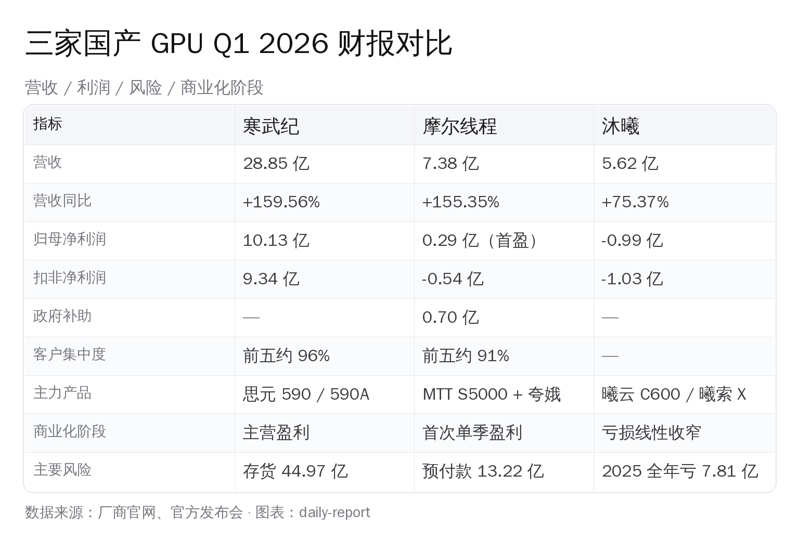
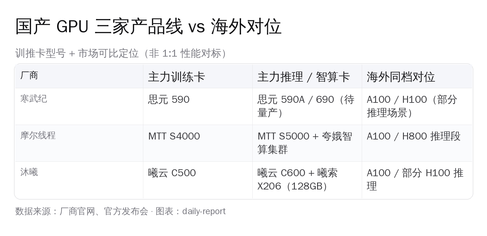
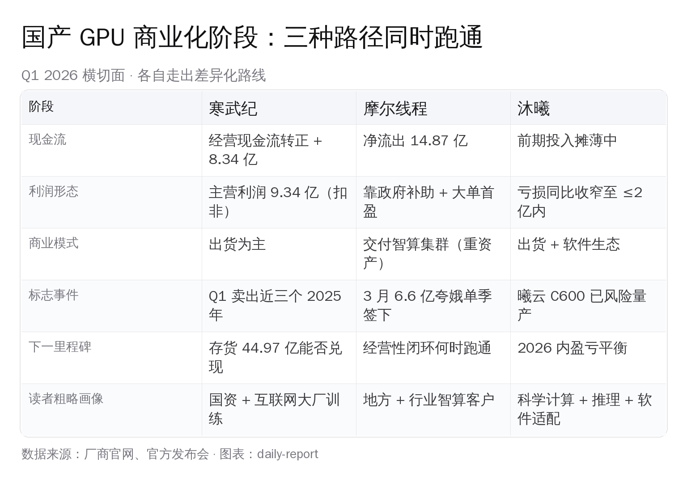

# 国产 GPU 三家 Q1 财报：差距已可量化

> 寒武纪一个季度赚 10 亿、摩尔线程靠夸娥智算单子首次单季扭亏、沐曦把亏损线性压回 1 亿以内——三家 Q1 2026 财报放在一起，国产 GPU 第一次有了硬数据可比的横切面。

## 一、三组硬数字：先看完，再说判断

把寒武纪、摩尔线程、沐曦三家 Q1 2026 季报和业绩快报里的关键科目一字排开，差距已经不是叙事而是数字。

寒武纪（688256.SH）一季度营业收入约 28.85 亿元，同比 +159.56%；归母净利润 10.13 亿元，同比 +185.04%；扣非净利润 9.34 亿元，同比 +238.56%；经营性现金流由去年同期 -13.99 亿元转正为 +8.34 亿元。换句话说，公司一个季度的营收，已经接近 2025 年前三个季度之和。

摩尔线程（688795.SH）Q1 营业收入 7.38 亿元，同比 +155.35%；归母净利润 2935.92 万元，是公司挂牌以来首次单季度盈利。但扣非净利润仍是 -5428 万元；当期计入损益的政府补助高达 7006 万元，单这一项就超过归母净利润两倍。

沐曦股份（前科创板申报）一季度营业收入 5.62 亿元，同比 +75.37%；归母净亏损 0.99 亿元（业绩预告区间为 0.91 亿—1.82 亿元），扣非净亏损 1.03 亿元——同比减亏幅度超过 1.4 亿元。这是沐曦自上市以来亏损绝对值最低的一个季度。

注意三个数字的分布形状：寒武纪是断层领先的盈利者，摩尔线程刚踩过盈亏平衡线，沐曦在亏损面上做线性收窄。半年前国产 GPU 的常用形容是"还在烧钱"，Q1 季报之后这句话已经只能继续用在沐曦一家身上。

## 二、寒武纪：主营利润正在自己造血，但存货是另一面

寒武纪这个季度有两个数字最值得放大看。

第一个是 9.34 亿元的扣非净利润。扣非数字剥离掉政府补助、资产处置等非经常性损益，反映的就是主营业务自身能挣多少。9.34 亿元意味着公司当期的赚钱能力已经不依赖补贴或一次性收益，主营产品（思元系列）卖出去就直接落到利润表上。

第二个是 8.34 亿元的经营性现金流由负转正。一年以前，寒武纪经营性现金流还是 -13.99 亿元（公司在为后续扩产备货、垫付供应链）。Q1 转正，说明客户回款节奏赶上了备货节奏——这是制造业型公司商业化跑通的关键标志。

但寒武纪一季报里另外两个数字必须同时盯住：

- 存货账面价值 44.97 亿元，约相当于 1.6 个季度的当期营业收入。
- Q1 计提存货跌价损失 2.46 亿元，税后利润减少约 2.45 亿元；预付款较年初增长 154%，应收账款同比 +81.64%。

存货 + 预付款增加，说明寒武纪在更激进地备货——为了响应已经看到的订单需求和 2025 年下半年到 2026 年的产品节奏（思元 590A、思元 690）。但任何战略备货都有库龄风险：库存放久了，要么转化为收入，要么转化为跌价损失。Q1 的 2.46 亿计提就是这道账的第一笔。

客户结构方面，公开披露层面寒武纪长期不点名前五大客户。可以确认的是：阿里巴巴目前持股约 3.2%，是前十大流通股东中唯一的互联网巨头，2017 年阿里就领投过寒武纪 A 轮；2024 年报披露前五大客户合计贡献约 94.6% 营收，2025 年 Q1 单一大客户占比一度升至 96% 左右。这种高集中度的另一面，是任何一家头部互联网公司或国资算力中心调整采购节奏，都会直接体现到下一份季报上。

## 三、摩尔线程：上市即扭亏，但扣非还在亏

摩尔线程是这次财报季表面成色最亮的一家——挂牌科创板第一份季报就拿出归母正利润 2935.92 万元，"上市即扭亏"。但扣非数字、政府补助、客户集中度三个口径，需要一起看。

摩尔线程 Q1 7.38 亿元营收里，能看清楚的两根支柱是 MTT S5000 训推一体卡 + 夸娥智算集群解决方案。其中 2026 年 3 月签订的夸娥智算集群单笔订单金额 6.6 亿元——单这一笔就接近一季度营收的九成。公司 2025 年 Q4 单季营收 7.21 亿元，全年营收 15.06 亿元（同比 +243%），今年前 5 大客户贡献 91.36% 销售额。

这种结构的优点：拿到一个超大单就能立刻把营收和利润往上推；缺点：营收波动会高度跟着大客户的招标和验收节奏走。

更关键的是利润表的另一面：

- 扣非净利润 -5428 万元，公司主营业务本身仍处于亏损。
- 当期政府补助 7006 万元，是归母净利润 2935 万的 2.4 倍——也就是说，把政府补助拿掉，单季会回到亏损态。
- 2026 年 Q1 经营性现金流净流出 14.87 亿元，比 2025 全年 -29.56 亿元的节奏只略微好转；存货 + 预付款合计 45.56 亿元，其中对单一供应商预付款 13.22 亿元，占预付款总额的 74%（依赖海外或单一上游晶圆代工方）。
- Q1 研发投入约 3.69 亿元，比去年同期 2.46 亿继续上扬。

把这些数字叠加：摩尔线程目前的商业模式更像是「自研 GPU + 服务器 + 集群交付」的重资产模式，单季能不能盈利，取决于当期是不是签下了一张大集群单+政府补助节奏。盈利的可持续性，要看下一笔夸娥级别订单何时再来、以及主营毛利能不能继续往上爬。

## 四、沐曦：亏损线性压缩，盈亏平衡指向 2026 年内

沐曦 Q1 的亮点不是营收（5.62 亿元，规模在三家中最小），也不是利润（仍亏 0.99 亿元）——而是亏损收窄的曲线斜率。

把沐曦近三个季度连起来看：2025 年全年归母净亏损 7.81 亿元；2026 年 Q1 亏损收窄到 0.99 亿元（业绩预告区间 0.91—1.82 亿元）；公司公开提及"最早有望在 2026 年实现盈亏平衡"。换算下来，季度亏损规模相比 2025 年单季均值压缩了一半还多。

驱动这条曲线的三个因素：

第一，营收 +75.37% 的同时，研发费用大体持平在 2.53 亿元上下；前期投入的固定研发支出被收入摊薄，单位营收对应的研发负担在快速下降。

第二，产品矩阵在分层兑现。曦云 C500（2022 年发布）已经成为存量出货的主力；曦云 C600 系列基于全国产工艺，2025 年底已实现风险量产；面向科学智能（AI4S）的曦索 X206 配备 128GB 大容量显存——是国产卡里少数把"训练大模型 + 跑科学计算"两段都能接的型号。

第三，软件栈的覆盖面。沐曦的 MXMACA 软件栈已经覆盖 40 多种 AI 框架、500 多款模型和 4500+ 开源项目，开发者用户接近 50 万人。这一点对推理客户尤其重要——把 PyTorch / vLLM / SGLang / TensorRT-LLM 这条主流推理路径打通，是国产卡能不能进一线 AI 公司机房的硬门槛。

沐曦目前的剩余风险，主要在两侧：盈亏平衡能不能在 2026 年内真正穿越（而不是滑到 2027 年）；以及 2025 全年累计亏损 7.81 亿之后，现金储备是否足够撑到平衡点。

## 五、把三家放回行业坐标：国产 GPU 在告别 PPT 阶段

回到行业层面，这次三家季报最重要的一个共同点不是数字本身，而是数字开始可比了。

可以这样概括三种路径：

- 寒武纪——以"出货 + 自研芯片"为核心的盈利型路径。一季度的关键词是「主营自我造血 + 经营现金流转正」，关键风险是「44.97 亿存货能否兑现 + 单一大客户依赖度」。
- 摩尔线程——以"自研 GPU + 智算集群整体交付"为核心的政企型路径。Q1 关键词是「上市首盈 + 6.6 亿夸娥大单」，关键风险是「扣非仍亏 + 政府补助依赖 + 经营性现金流大额净流出」。
- 沐曦——以"通用 GPU + 科学计算 + 软件生态"为核心的渐进收敛路径。Q1 关键词是「亏损线性收窄 + 软件栈接近 50 万开发者」，关键风险是「盈亏平衡点能否落在 2026 年内」。

三条路径虽然都还谈不上"完整跑通"，但对应的不再是一份份招股书或发布会 PPT，而是上市公司公开披露的硬数字——存货、预付款、应收账款、经营性现金流、政府补助科目都被晒了出来。这是国产 GPU 行业第一次有了「拿三份季报横向比较」的语料，PPT 阶段在这个春天事实上结束了。

与此同时，需求侧的信号也对得上。4 月 30 日我们写过美团 LongCat-Flash 用 5—6 万张国产卡训了一只 5600 亿参数的 MoE 万亿级模型；阿里通义、字节豆包、百度文心、智谱 GLM、DeepSeek 等头部模型团队过去一年都在持续验证不同国产卡的训练 / 推理路径。需求一旦从"能不能跑"切换成"哪家性价比更好"，三家 Q1 财报里那些差异化数字（毛利、客户结构、软件栈覆盖）就开始有真实的选择含义。

## 六、写给国内一线 AI 工程师：三家怎么选

把财报语言翻译成机房语言，可以给出一个简单的选型坐标系：

**训练侧**

- 训练 LLM / MoE 大模型，目前最稳的国产路径仍然是华为昇腾（910B / 910C）+ 寒武纪思元 590 / 590A 双轨。一些一线模型团队已经在内部跑过千卡级国产训练。沐曦 C500 / C600 在大模型训练上仍处于「适配中 + 部分场景可用」阶段，更适合愿意和厂商共建的团队。
- 训练 CV / 多模态 / 科学计算，沐曦曦索 X206（128GB 显存）和曦云 C600 在 AI4S、CV 大模型推理 / 训练这一类场景的卖点会逐步显出来。
- 训练智算集群整体交付，摩尔线程的夸娥已经签下省级、行业级订单——适合需要「机房 + 服务器 + GPU + 软件」整套国产化合规交付的客户。

**推理侧**

- 推理 LLM 服务化（在线问答 / Agent / Coding），优先看软件栈成熟度和单卡吞吐。沐曦 MXMACA + 曦云 C600、摩尔线程 MUSA + MTT S5000 都已经做了 DeepSeek V4 这一代模型的 Day-0 适配；具体选型按业务的并发、上下文长度和延迟要求做小规模 PoC。
- 推理多模态 / 图像 / 视频生成，国产卡总体上还落后于英伟达 H100 / B200 一代左右，但价格优势明显——对成本敏感、不追前沿的内容生成场景已经可以接。
- 端侧 / 边缘推理，三家都还不是主战场，更适合关注海光、龙芯+寒武纪 IP 这条路线。

最后一句话写给读者：上一轮国产 GPU 给国内 AI 工程师的体感，是「PPT 多 + 真机难拿 + 文档残缺 + 软件栈对不齐」；这一轮 Q1 季报落地后，体感正在变成「三家走出三种路径 + 财报开始可对账 + 软件栈接近 50 万开发者 + 训推选项越来越多」。从 H100 一条路，到三家国产卡 + 昇腾 + 海光多条路并行——中国 AI 算力底座的可选项，正在从一个名字变成一张表格。这本身就是值得一线工程师高兴的进展。

## 数据来源

- 36 氪头条：[寒武纪赚了10亿、摩尔线程首次盈利、沐曦还在亏](https://www.36kr.com/p/3788937709449989)
- 寒武纪 2026 一季报：[新浪财经解读](https://finance.sina.com.cn/stock/aigc/stockfs/2026-04-30/doc-inhwftwn6257623.shtml) · [每经报道](https://www.nbd.com.cn/articles/2026-04-29/4374207.html)
- 摩尔线程 2026 一季报：[36 氪快讯](https://36kr.com/newsflashes/3783351447460869) · [IT之家报道](https://www.ithome.com/0/943/632.htm) · [虎嗅深度](https://www.huxiu.com/article/4854255.html)
- 沐曦 2026 一季报与业绩预告：[新浪财经一季报](https://finance.sina.com.cn/tech/roll/2026-04-30/doc-inhwhenh6268518.shtml) · [业绩预告](https://finance.sina.com.cn/jjxw/2026-03-04/doc-inhpvtwh3783348.shtml) · [证券时报](https://www.stcn.com/article/detail/3733497.html)
- 摩尔线程 MTT S5000 产品页：[mthreads.com/product/S5000](https://www.mthreads.com/product/S5000)
- 沐曦曦云 C500 介绍：[模力方舟文档](https://moark.com/docs/compute/clusters_gpu/mx_gpu)
