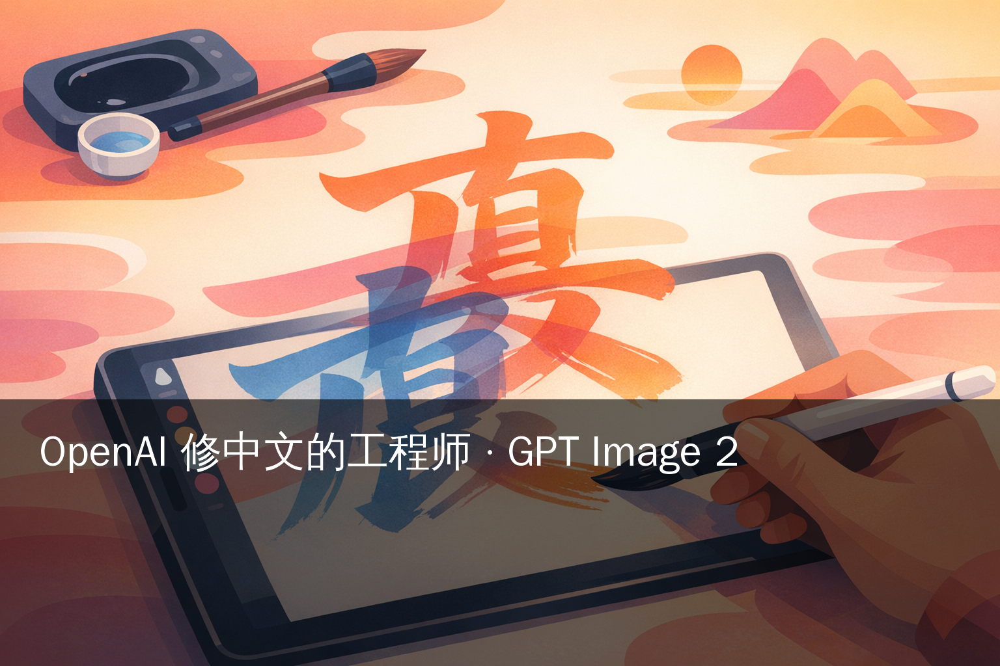
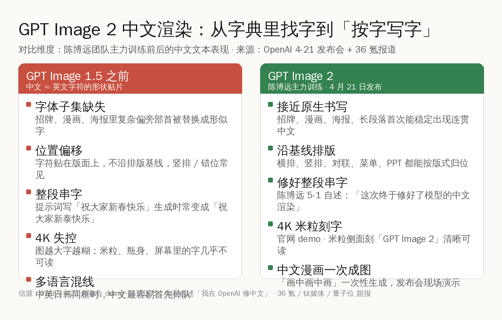
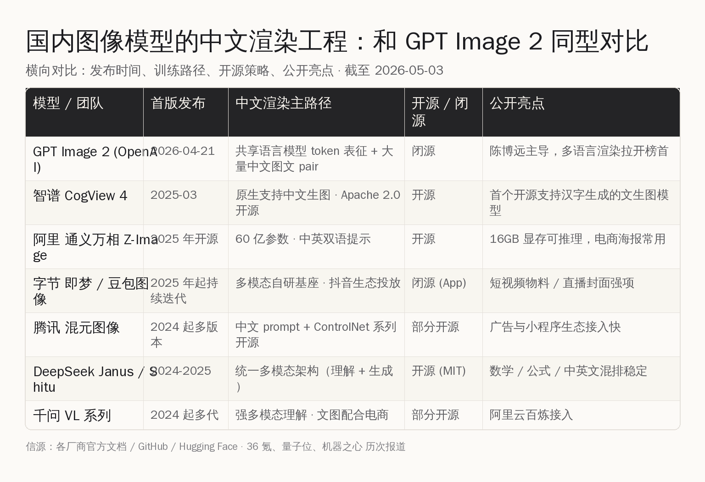
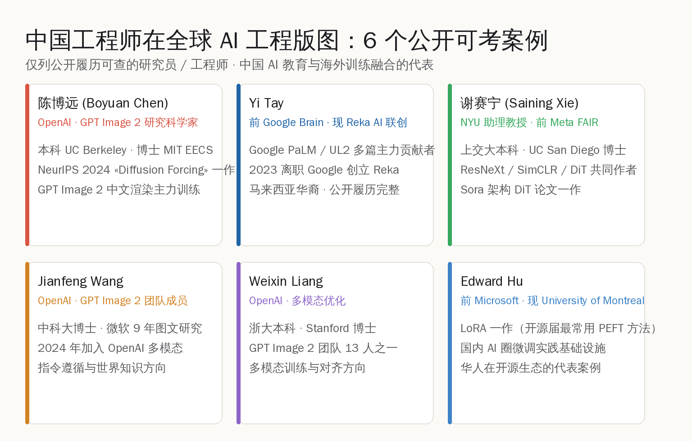

# 陈博远在 OpenAI 修中文：GPT Image 2 的 13 人核心团队

> 4 月 21 日 GPT Image 2 上线，多语言文本渲染拉到 +242 Elo 领先。主导这次中文工程的是 GPT Image 团队的 Research Lead 陈博远——本科 UC Berkeley、博士 MIT EECS、NeurIPS 2024 «Diffusion Forcing» 一作。这篇复盘他在 OpenAI 做了什么，以及国内同行的同型工程。

## 事件本身：4 月 21 日的一次「安静」上线 + 5 月 1 日的一篇知乎自述

4 月 21 日，OpenAI 没开发布会、没倒计时，把 gpt-image-2 模型放上线，配套博客《Introducing ChatGPT Images 2.0》同日推出。模型在 Image Arena 历史上拉开 +242 Elo 的最大领先；4 月 23 日量子位披露团队 13 人、华人占比近半；5 月 12 日 OpenAI 计划停掉 DALL-E 2 / DALL-E 3，把 gpt-image-2 作为生产替代。

5 月 1 日 18:00，陈博远在知乎发了一篇博客《我在 OpenAI 修中文》。开篇第一句是：

> "大家好，我是 GPT Image 团队的研究科学家陈博远。上周发布的 GPT 生图模型就是我主力训练的！"

接着他给出一句此前国内外都关心的工程结论：

> "这次终于修好了模型的中文渲染。"

5 月 2 日，36 氪转载并把这条线索做成头条，标题《那个在 OpenAI 修中文的人》。当天上午 13:10 左右，36 氪文章登上首页头条，钛媒体、新浪科技、ITBear 等同步跟报。

## 一、陈博远的位置：13 人核心团队、Research Lead

把时间线和履历摆出来，分量就清楚了。陈博远的公开信息以个人主页 boyuan.space、MIT CSAIL 主页、NeurIPS proceedings、知乎、X(@BoyuanChen0) 为主。下列**仅写公开可考的部分**，国内报道里的事实会在条目末尾分别标注信源。

- 本科 UC Berkeley，计算机科学与数学双学位，本科期间师从 Pieter Abbeel
- 博士 MIT EECS，导师 Russ Tedrake 与 Vincent Sitzmann，辅修哲学
- 实习经历包含 Google DeepMind（量子位披露：实习开发的指令微调技术被 Gemini 2.0 采用）
- 代表作《Diffusion Forcing: Next-token Prediction Meets Full-Sequence Diffusion》入选 NeurIPS 2024，第一作者，把自回归与全序列扩散统一在同一框架
- 量子位披露：2025 年 6 月加入 OpenAI，目前是 GPT Image 团队 Research Lead，同时是 Sora 视频团队成员
- 36 氪披露：知乎名"MIT 奶茶店长"，业余兴趣是珍珠奶茶制作

GPT Image 2 团队总负责人是 Gabriel Goh，从 DALL-E 时期就在 OpenAI；陈博远是研究层面的 lead，负责训练编排。13 人团队里其他几位华人成员同样履历公开，包括中科大 + 微软背景的 Jianfeng Wang、浙大 + Stanford 的 Weixin Liang、浙大 + Johns Hopkins 的 Yuguang Yang 等。

## 二、GPT Image 2 上线之前，中文渲染长期是图像模型的硬骨头

国内开发者和设计师都熟悉一件事：早期 DALL-E、Stable Diffusion、Midjourney 时代，"中文" 在生图模型里几乎不能用——出来的字像形似偏旁的拼贴，不沿排版基线，整段语义错位。原因技术上也并不神秘：

- **CJK 字符量级比拉丁字母大两个数量级**。GB18030 收录 7 万 + 字，常用字 3500，每一个字都是独立形状单位
- **字体子集稀疏**。训练语料里中文图文对的清晰度、版式、字体多样性都远低于英文
- **Tokenizer 误差**。早期模型沿用英文 tokenizer，对中文字符缺乏 byte-level 的稳定切分，模型"看到"的中文等价于一串视觉特征，不是一组语义单位
- **训练数据稀缺**。包含规整中文版式的高分辨率图文 pair（招牌、对联、菜单、PPT、海报）远少于英文同类素材

GPT Image 2 之前业界主流的"中文渲染"路线，要么靠 ControlNet + 中文字库后期合成，要么靠在 prompt 里逐字硬塞，结果都不稳定。这是行业共识，也是陈博远这次修中文之所以被国内媒体集体跟报的工程背景。

## 三、陈博远做了什么：仅按公开报道与他自己公开过的事实复盘

下面这些事项**全部出自公开来源**，不做扩写、不补脑内细节：

**(1) 主力训练 GPT Image 2 模型**——陈博远 5-1 知乎博客原文："上周发布的 GPT 生图模型就是我主力训练的"。量子位 4-23 报道：13 人团队中陈博远是 Research Lead，负责训练编排。

**(2) 主导中文渲染修复**——陈博远 5-1 知乎博客原文："这次终于修好了模型的中文渲染"，并明确表示中文用户可以直接向他反馈问题。这是国内媒体把他单独拎出来做头条的核心原因。

**(3) 亲手用模型做了官网博客的全部图片**——陈博远 5-1 自述："整个 Blog 都是用图片生成的，完全没有文本"。包括官网展示的 4K 米粒刻字、米粒侧面"GPT Image 2"清晰可读、中文 + 多语言漫画一次性生成、"画中画中画"嵌套构图、视觉数学证明、自动生成二维码等示例。

**(4) 4 月 21 日发布会与 Sam Altman 一起主持**——陈博远 5-1 自述："这次终于轮到我和奥特曼一起主持了发布会"。OpenAI 官方博客《Introducing ChatGPT Images 2.0》同日上线。

**(5) 起了内部代号"duct-tape"**——陈博远 5-1 自述：模型双盲测试期间，他给这一代模型起了代号"duct-tape"（布基胶带）。

**(6) X 上的米粒彩蛋帖**——发布后陈博远在 X (@BoyuanChen0) 发推说明：直播里那张米粒堆图里藏了一个写"GPT Image 2"的米粒，是他刻意留的彩蛋，也是他长时间打磨文本渲染的成果。

**(7) 拒绝披露架构细节**——量子位 4-23 报道：被问到模型走的是 diffusion 还是 autoregressive 路线时，陈博远拒绝明确回答，只说这是"通用模型 / 图像领域的 GPT"。

**(8) 致谢团队**——陈博远 5-1 自述："感谢团队的齐心协力……和市场部门、做艺术的同事一起准备发布会和这个网站。"

36 氪原文未披露的部分（具体训练数据规模、tokenizer 改动、loss 设计、字体子集规模、CJK 中文专用 head 是否独立等）**本文不做任何脑补**。

## 四、为什么"修中文"这件事在工程上不是小修小补

虽然 OpenAI 没披露架构细节，公开信息可以拼出一些工程层面的合理推断（仅做工程读者参考，**不算作 OpenAI 官方说法**）。

外部已被多份分析文章注意到的方向包括：

- **token 表征共享**。GPT Image 2 与 GPT 系语言模型共享底层 token 表征，这意味着模型"知道"每个汉字字符的语义，不只是把它当形状贴片
- **O 系推理机制**。生图前先做 composition 规划、字符数核对、prompt 约束验证（VentureBeat 与 Neurohive 报道）
- **多模态联合训练**。语言部分稳定下来后，文本-图像对齐被作为单独阶段精修
- **CJK 高质量图文对的扩量**。这是中文渲染稳定的下游条件，业界共识

这些都是图像模型工程社区过去 12 个月反复讨论过的方向。GPT Image 2 把这条路线第一次推进到"4K 米粒刻字 / 中文长段落首次稳定 / 多语言并排不掉队"的状态。

## 五、国内同型工程：CogView 4 / 通义万相 / 即梦 / 混元 / Janus-Pro

修中文不是 OpenAI 一家在做。国内一线团队在中文图像渲染这条赛道已经做了好几代，开源策略反而比 OpenAI 更激进。

把已经公开发布的几家代表摆在一起：

- **智谱 CogView 4**——2025 年 3 月开源，按 Apache 2.0 协议放出，是首个**开源**的、原生支持汉字生图的文生图模型。中文海报、广告物料、短视频封面是常见用法，DPG-Bench 综合得分跑到当时开源 SOTA。
- **阿里 通义万相 Z-Image**——60 亿参数，中英双语提示词支持，16GB 显存可推理，电商海报、商品图常见。万相系列从 2024 起持续迭代，中文支持是核心方向。
- **字节 即梦 / 豆包图像**——抖音生态投放体量决定其落地节奏，短视频物料、直播封面、广告创意是主战场。中文支持稳定，但模型权重以闭源 App 形式提供。
- **腾讯 混元图像**——多版本迭代，混元 ControlNet 系列开源放出，中文 prompt + ControlNet 是国内广告与小程序场景的常用组合。
- **DeepSeek Janus / Shitu 系列**——统一多模态架构，理解和生成同一基座；中文公式、数学排版、中英文混排稳定，开源协议 MIT，HuggingFace 与 GitHub 双源放出。
- **千问 VL 系列**——阿里多代多模态模型，VL 在中文场景的图文理解 + 生图配合是阿里云百炼上的常用工作流。

这些方案各有侧重。如果只看**中文渲染**这一项工程难度——CogView 4 是开源里最早把"原生支持汉字"作为发布卖点的；通义万相是显存 / 推理成本与电商场景结合最紧的；DeepSeek 是多模态统一架构里中文最稳的开源代表。GPT Image 2 这次更像是把同一条工程路径推到了一个新的清晰度上限。

国内 AI 圈过去半年公开的设计师、广告人、电商运营反馈里，"中文海报基本能用 CogView 4 / 通义万相一次出图"已经是日常工作流的一部分；这是中文渲染这条赛道的真实进展，不是从 0 起步。

## 六、中国 AI 工程师在全球版图：6 个公开可考案例

陈博远不是孤例。把公开履历可查的案例摆出来，会发现中国 AI 教育（北大 / 清华 / 中科大 / 浙大 / 上交大）+ 海外名校训练（MIT / Stanford / UC Berkeley / CMU）已经是全球 AI 工程版图里的一块完整拼图。

下列六位**仅取公开履历可查的研究员或工程师**，避免任何脑补：

- **陈博远（Boyuan Chen）**：OpenAI · GPT Image 2 Research Lead · MIT EECS 博士 · NeurIPS 2024 «Diffusion Forcing» 一作
- **Yi Tay**：前 Google Brain · 现 Reka AI 联合创始人 · Google PaLM / UL2 多篇主力贡献者 · 马来西亚华裔
- **谢赛宁（Saining Xie）**：NYU 助理教授 · 前 Meta FAIR · 上交大本科 · UC San Diego 博士 · ResNeXt / SimCLR / DiT 共同作者；Sora 架构 DiT 论文一作
- **Jianfeng Wang**：OpenAI · GPT Image 2 团队 · 中科大博士 · 微软 9 年图文研究背景
- **Weixin Liang**：OpenAI · GPT Image 2 团队 · 浙大本科 · Stanford 博士 · 多模态训练与对齐方向
- **Edward Hu**：前 Microsoft · 现 University of Montreal · LoRA 第一作者；LoRA 是国内 AI 圈微调实践的基础设施

这份名单还能往下拉很长，但核心结构就是：**中国本土培养的扎实数学 / 计算机基础 + 海外博士阶段的训练 = 在全球 AI 工程版图里能拿到核心位置**。陈博远 5 月 1 日的那篇博客，把这条路径用最具体的形式落到了纸面上。

## 七、对国内中文 AI 工程师的同行启示

这一段不是行动建议，是和国内同行通报情况后的一些感受。

**第一**，中文工程是中国 AI 工程师的天然护城河。语料里中文文本的自然语义、版式审美、字体偏好、排版习惯，每一项都需要长期浸润才有判断力。陈博远修中文之所以能修到米粒刻字这个清晰度，背后是他从小到大对中文的真实使用经验，加上 OpenAI 的算力规模 + 他自己在 NeurIPS 2024 拿到的训练编排手感。三件叠加才出得来这个效果。

**第二**，中国本土的开源中文图像模型（CogView 4、通义万相、Janus-Pro 这批）本身就有非常强的工程价值。开源协议下国内开发者可以二次训练、定向微调，做电商海报、医美设计、对联、菜单、PPT 这种专精场景反而比闭源模型更灵活。GPT Image 2 是高水位线，CogView 4 / 通义万相是工程师手里能改的实物。

**第三**，全球 AI 工程版图里"中国教育 + 海外训练"这条路径已经被走通过很多次。陈博远不是第一位，也不会是最后一位。同时，国内的智谱、DeepSeek、阶跃、月之暗面、千问、混元、即梦 这一批团队也在国内同时跑出工程实力，是另一条同样可见的路径。两条路径不冲突，反而互相补强。

## 八、写在最后

GPT Image 2 这次"中文修好了"的工程结论，最值得国内同行收下的不是 OpenAI 的胜负输赢——而是一份非常具体的工程坐标：

- **中文渲染**已经从"做不了 / 凑合用"进入"4K 米粒级稳定输出"的工程阶段
- **同型工程**国内 CogView 4 / 通义万相 / Janus-Pro / 混元 / 千问 VL 都在跑，开源策略更激进
- **核心人才**陈博远、谢赛宁、Yi Tay、Edward Hu 这一长串名字证明：中国 AI 教育 + 海外名校训练已经是一条成熟的工程师培养路径
- **机会窗口**中文工程是中国一线 AI 开发者的天然方向；中文图文 pair 数据、版式审美、字体子集这些事情，国内团队天然站位更优

陈博远在 5 月 1 日博客最后写："希望这次稳稳地接住了大家。"这句话其实可以换一种说法——**中国一线 AI 工程师在全球 AI 版图里的位置，已经稳稳地坐住了**。

我们这一代特别幸运的一点是，前辈们已经把"中国教育 + 全球工程"这条路线趟出来了；现在做中文 AI，无论留在国内做开源模型，还是去海外大厂带核心团队，都是真路、都是好时机。下一程值得期待，共勉。

## 附

- 36 氪原文《那个在 OpenAI 修中文的人》：https://36kr.com/p/3791622190854916
- 量子位 4-23 报道：https://www.qbitai.com/2026/04/405391.html
- OpenAI 官方博客《Introducing ChatGPT Images 2.0》：https://openai.com/index/introducing-chatgpt-images-2-0/
- 陈博远个人主页（公开履历 + 论文列表）：https://www.boyuan.space/
- NeurIPS 2024 «Diffusion Forcing» 论文页：https://neurips.cc/virtual/2024/poster/93029
- 智谱 CogView 4 项目页：https://github.com/zai-org/CogView4
