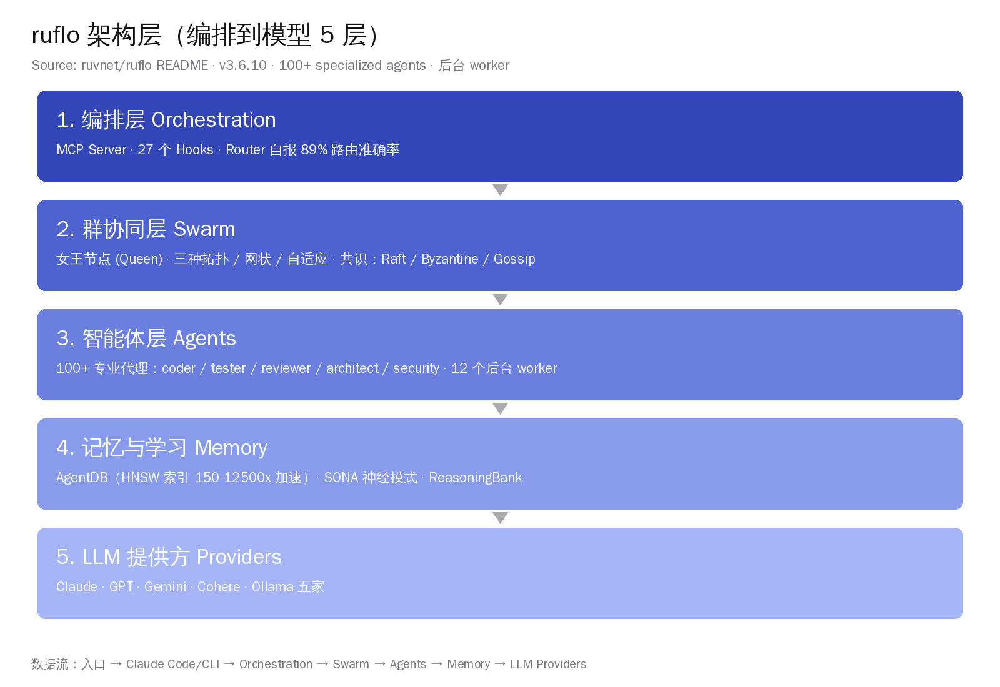
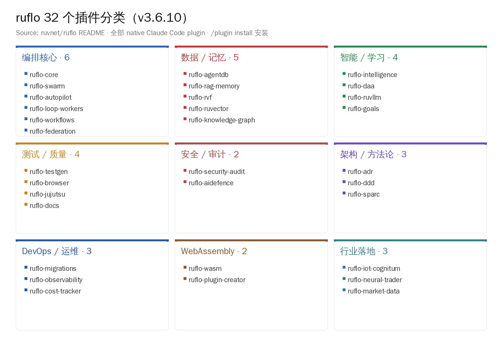
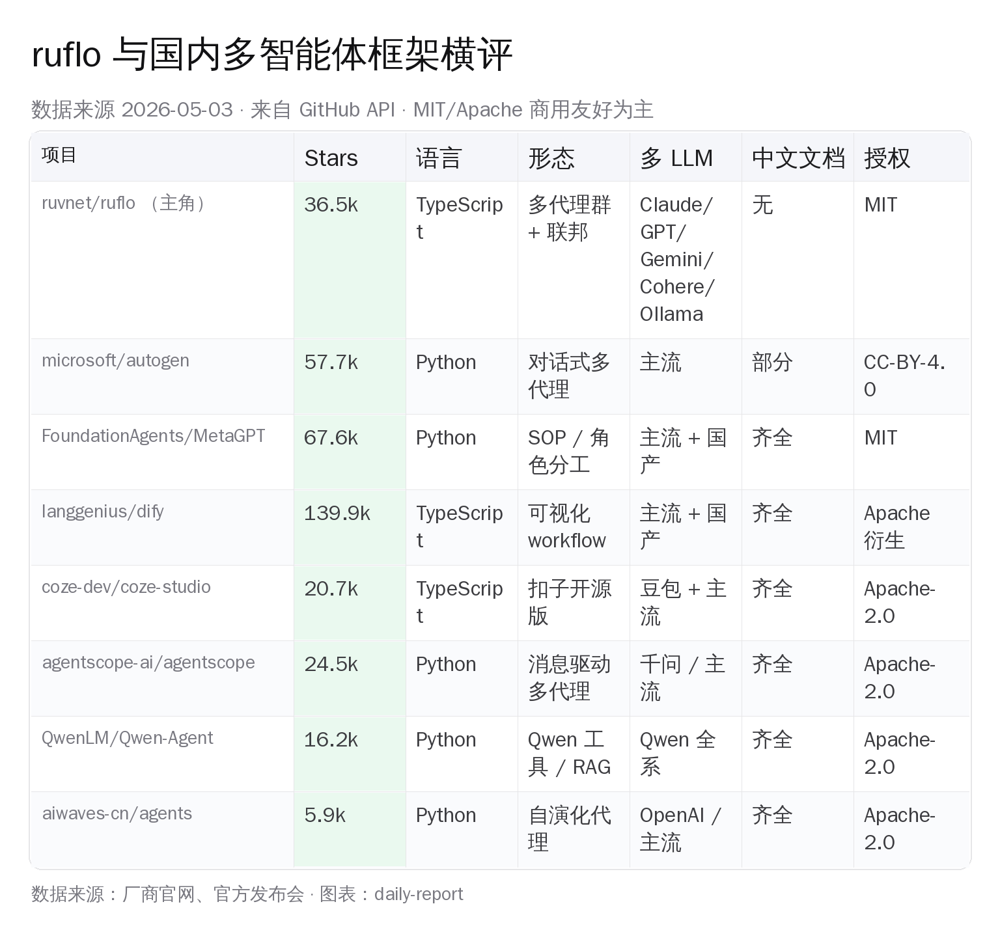

# ruflo 36.5k stars：把 Claude Code 拉成集群

> 一个名字陌生的仓库，36,531 颗星。ruvnet/ruflo（原名 claude-flow）今天在 GitHub Trending Daily 排到第 2，单日 +1,258 stars，累计 36.5k 星 / 4.2k forks / 6,135 commits。它做的事很直接——把 Claude Code 从「一个会写代码的助手」拓展成「100+ 个分工明确的智能体一起干活」。一线 AI 开发者会先关心三件事：能不能本地跑，能不能接 Claude 之外的模型，国内有没有同档替代。三个问题都有答案。


## 一、先看数字：36.5k stars 是怎么累出来的

仓库元信息（GitHub API 实测，2026-05-03 拉取）摆出来：

- **stars 36,531 · forks 4,191 · watchers 36,531 · commits 6,135 · 体积 517 MB**
- 创建时间 **2025-06-02**，到今天满 11 个月
- 主语言 **TypeScript 66% · JavaScript 21.5% · Python 7.9%**
- 授权 **MIT**，作者 ruvnet（个人开发者，有同期项目 RuVector / neural-trader / ruvLLM 等）
- 默认分支 main，最近 push 时间 **2026-05-02 18:32 UTC**（昨天还在改）
- topics 标签里出现频率最高的几个：`multi-agent` / `swarm-intelligence` / `agentic-framework` / `claude-code` / `mcp-server`

11 个月攒到 36.5k stars，月均 +3.3k——节奏不算暴涨，但很稳。把 Trending Daily 第 2 这个位置和累计星数放在一起看，更接近「话题持续性 + 大版本释出推一把」的曲线，不是病毒式的单日刷榜。

最新 release 是 **v3.6.10**（2026-04-30，标题 "32 Plugins, Agent Federation, IoT Cognitum"）。仓库 30 个 release tag 全部在过去 10 个月内打出来，迭代密度可以参考——上一个版本 v3.5.80 是 2026-04-11，再上一个 v3.5.78 是 2026-04-08。**几乎每两到三天一个 release**，单看 changelog 体量已经远超普通独立开发者项目。

## 二、为什么是这家：claude-flow 改名换装的脉络

ruflo 不是新项目，而是 **claude-flow 改名后的延续**。仓库 README 第一行写得直白：

> "Claude Flow is now Ruflo — named by Ruv, who loves Rust, flow states, and building things that feel inevitable. The 'Ru' is the Ruv. The 'flo' is the flow."

claude-flow 这个仓库（github.com/ruvnet/claude-flow）现在依然存在，stars 同步在 ruflo 上挂着。npm 包同时发了三个名字（`@claude-flow/cli` / `claude-flow` / `ruflo`），版本号都对齐到 3.6.10——典型的「保留旧入口、统一新品牌」做法。

ruvnet 这个作者圈子可以更具体一点。他个人 GitHub 有几个高 star 项目串成一条线：

- **ruvnet/RuVector**：FlashAttention-3 + Graph RAG，挂在 ruflo 里作为 `ruflo-ruvector` 插件，103 个 MCP 工具
- **ruvnet/neural-trader**：4 个交易智能体 + Rust/NAPI 回测，包成 `ruflo-neural-trader` 插件
- **ruvnet/ruvLLM**：自学习本地模型层，配合 SONA 神经模式做 trajectory learning
- **flo.ruv.io / goal.ruv.io**：两个产品化前端，前者是多模型聊天 UI（Qwen 3.6 Max / Claude Sonnet 4.6 / Gemini 2.5 Pro / OpenAI），后者是 GOAP（Goal-Oriented Action Planning）规划器

把这条线连起来看就清楚了——ruflo 不是从零搭起来的多智能体框架，而是把作者过去一年沉淀下来的几个独立组件拼成一个「Claude Code 增强层」。这种"个人作者 + 多组件 monorepo"路径，在国内开发者眼里更像 langchain-ai 早期形态：先有零散工具，再统一品牌做生态。

## 三、架构是怎么搭的：5 层、SONA 神经模式、HNSW 索引、GOAP A* 规划



ruflo 的架构在 README 里画成 5 层。逐层看：

**编排层（Orchestration）**：MCP Server + 27 个 Hooks + Router。Router 自称「89% 任务路由准确率」（这条数字未给出独立 benchmark 来源，作者 README 自报，下文风险段会重提）。Hooks 系统是接 Claude Code 进来的关键——init 之后用户继续按平时方式用 Claude Code，hooks 在后台拦截、分发、记录。

**群协同层（Swarm）**：女王节点（Queen） + 三种拓扑（层级 hierarchical / 网状 mesh / 自适应 adaptive） + 三种共识协议（Raft / Byzantine / Gossip）。这套术语在分布式系统里早被验证，搬到 agent 层做调度算是直接复用——读者熟悉 etcd / Consul 的话会觉得味道对。

**智能体层（Agents）**：100+ 个 specialized agent（coder / tester / reviewer / architect / security / 等等）+ 12 个后台 worker（自动跑代码审计、性能优化、找漏测、生成测试用例）。后台 worker 这一层是 ruflo 区别于普通 agent framework 的明显特征——大多数同类项目要用户主动调，ruflo 默认开几个后台进程"自己干活"。

**记忆与学习（Memory）**：AgentDB 用 HNSW 做向量索引，README 自报「150x-12,500x faster search than brute force」。SONA 是作者自己取名的神经模式系统，配合 ReasoningBank 做 trajectory learning。这一段需要谨慎——SONA 没有公开论文（搜过 arxiv 没有命中），更接近作者自己起名的工程模块，不是学界已验证的算法。

**LLM 提供方（Providers）**：Claude / GPT / Gemini / Cohere / Ollama 五家。Ollama 这一项对国内开发者最有意义——本地推理走 Qwen / DeepSeek / GLM 都能挂上去。

整体看，ruflo 的架构思路和 microsoft/autogen、FoundationAgents/MetaGPT 是同一代——多 agent 协同 + 角色分工 + 共享记忆。区别在于 ruflo 的入口是 Claude Code（plugin / MCP / CLI 三件套），而 autogen / MetaGPT 主要面向 Python 直接调用。

## 四、32 个 plugin：v3.6.10 这次到底加了什么



v3.6.10（2026-04-30）的 release notes 把这次更新讲得很清楚——**插件数从 21 个扩到 32 个**。新增的 11 个里值得点名的：

- `ruflo-adr`：架构决策记录（ADR）的全生命周期——创建、索引、归档、合规检查
- `ruflo-ddd`：领域驱动设计脚手架，开箱给出 bounded context / aggregate / domain event 模板
- `ruflo-sparc`：5 阶段开发方法论（说是带"质量闸门"）
- `ruflo-knowledge-graph`：实体抽取 + 关系映射 + pathfinder 遍历
- `ruflo-cost-tracker`：token 用量统计 + 预算告警 + 成本优化建议
- `ruflo-iot-cognitum`：IoT 设备-智能体二象性，给硬件 fleet 做信任打分和异常检测
- `ruflo-federation`：零信任 agent 联邦，跨主机 / 跨组织协作

**Agent Federation 这块是 v3.6.10 的最大单点更新**。release notes 给的细节：

- mTLS + ed25519 身份验证，没有共享密钥
- 14 类 PII 检测管道，按信任级别走 BLOCK / REDACT / HASH / PASS 四档处理
- 行为信任评分公式 `0.4×success + 0.2×uptime + 0.2×threat + 0.2×integrity`，**升级要看历史，降级是即时的**
- HIPAA / SOC2 / GDPR 合规模式自带审计追踪

这个设计读起来像把 Slack 的"频道 + 信任级别"概念搬到 agent 层——你的 agent 加入一个联邦，先按低权限运行，跑得稳了升级到高权限，一旦行为越界立刻降级。release notes 提到 9 个 MCP 工具 + 10 个 CLI 命令配合做完整生命周期管理（federation_init / federation_send / federation_trust / federation_audit 等）。

旁边的 IoT Cognitum 是另一条线——给硬件设备配一个对应的 agent，做信任打分、异常检测、跨设备群管理。release notes 说这个插件有 24 个测试用例通过（ADR-079）。这个方向走得有点超前，目前看用户量级和 Claude Code 主线相比还很小。

## 五、国内对位横评：MetaGPT、Dify、Coze、autogen、Qwen-Agent、agentscope



把 ruflo 和国内多智能体框架放一起看，几个角度：

| 项目 | Stars | 语言 | 形态 | 多 LLM | 中文文档 | 授权 |
|---|---|---|---|---|---|---|
| ruvnet/ruflo | 36.5k | TypeScript | 多代理群 + 联邦 | 5 家全覆盖 | 无 | MIT |
| microsoft/autogen | 57.7k | Python | 对话式多代理 | 主流 | 部分 | CC-BY-4.0 |
| FoundationAgents/MetaGPT | 67.6k | Python | SOP / 角色分工 | 主流 + 国产 | 齐全 | MIT |
| langgenius/dify | 139.9k | TypeScript | 可视化 workflow | 主流 + 国产 | 齐全 | Apache 衍生 |
| coze-dev/coze-studio | 20.7k | TypeScript | 扣子开源版 | 豆包 + 主流 | 齐全 | Apache-2.0 |
| agentscope-ai/agentscope | 24.5k | Python | 消息驱动多代理 | 千问 / 主流 | 齐全 | Apache-2.0 |
| QwenLM/Qwen-Agent | 16.2k | Python | Qwen 工具 / RAG | Qwen 全系 | 齐全 | Apache-2.0 |
| aiwaves-cn/agents | 5.9k | Python | 自演化代理 | OpenAI / 主流 | 齐全 | Apache-2.0 |

数据全部来自 GitHub API 实测（2026-05-03 拉取）。几个观察：

**第一，star 量级不是判断标准**。Dify 139.9k 是产品化 workflow 平台，autogen 57.7k 是研究院起家的对话框架，MetaGPT 67.6k 是 SOP 角色分工，三家路径都不一样。ruflo 36.5k 不算第一档，但放在「以 Claude Code 为入口的 plugin 形态」这条窄轨上，目前是最大的一家。

**第二，开发语言分两派**。autogen / MetaGPT / Qwen-Agent / agentscope / aiwaves-cn 都走 Python，方便做研究 + 训练循环；ruflo / Dify / Coze 走 TypeScript，方便做前端 / 工具调用 / web UI 集成。这件事直接影响产品形态——Python 那一派放在 Jupyter / 训练管线里跑，TypeScript 这一派直接进编辑器和浏览器。

**第三，国内项目的中文文档和模型生态都更齐全**。Qwen-Agent 自带千问全系适配，agentscope 也优先支持千问，coze-studio 优先支持豆包系列，MetaGPT 同时支持 OpenAI / Anthropic / 国产模型。ruflo 在「接 Ollama 跑国产模型」这条路上理论可行，但默认配置和文档都没覆盖到——国内开发者要自己接 Qwen3-Coder / DeepSeek / GLM-4.6 上去。

**第四，授权层面整体宽松**。ruflo MIT、MetaGPT MIT、Dify Apache 衍生（有商用条款）、coze-studio Apache-2.0、agentscope Apache-2.0、Qwen-Agent Apache-2.0、autogen 是 CC-BY-4.0（这个有点特殊，是文档式授权）。MIT / Apache-2.0 几家都可以直接用在商业项目里。

## 六、国内开发者怎么用：三条上手路径

ruflo 想跑起来，国内开发者最快的三条路：

**第一条：Claude Code 用户直接装 plugin**。如果已经在用 Claude Code（含国内通过中转或镜像访问），命令很短：

```
/plugin marketplace add ruvnet/ruflo
/plugin install ruflo-core@ruflo
/plugin install ruflo-swarm@ruflo
```

这条路最低门槛，按 README 的 quick start 走就行。国内访问 GitHub 顺畅的话，整个安装流程几分钟。需要注意的是 plugin marketplace 是 ruvnet 个人维护，不是 Anthropic 官方仓库——签名 / 安全审计层面要按个人开源项目的尺度评估。

**第二条：CLI 模式 + Ollama 接国产模型**。如果不想绑定 Anthropic 订阅，走 CLI：

```
npx ruflo@latest init --wizard
# 然后在 config 里把 LLM provider 切到 Ollama
# Ollama 后端跑 Qwen3-Coder 30B（INT4 量化，4090 单卡能跑）
# 或者 DeepSeek V3.5（API 走 ¥1/M 输入 / ¥4/M 输出量级）
```

这条路对国内中型团队更实际——把 ruflo 当成「Claude Code 的开源替代调度层」用，底座换成千问或者 DeepSeek。能跑通的关键是 Ollama 接口的兼容性，README 明说支持，但具体到 100+ 个 agent 里哪些 prompt 在国产模型上效果对齐，需要自己测一遍。

**第三条：MCP server 模式接进现有 IDE**。把 ruflo 当成 MCP server 注册：

```
claude mcp add ruflo -- npx -y @claude-flow/cli@latest
```

这种用法适合已经在用通义灵码、Qoder、Trae、Cursor 这些 IDE 插件的团队——把 ruflo 的工具集（README 说有 ~210 个 MCP tool）暴露给现有 IDE 用，复用底层模型的同时拿到 swarm 协同能力。

32 个插件里国内团队**最直接受益的几个**：

- `ruflo-cost-tracker`：token 预算管控，对接国产 API 也能用，按 ¥ 计费的国内场景特别友好
- `ruflo-rag-memory`：混合检索（RRF）+ Graph RAG 多跳 + MMR 多样性，搭企业知识库的标准件
- `ruflo-knowledge-graph`：实体抽取 + 关系图，做内部文档索引很省力
- `ruflo-observability`：结构化日志 + tracing + metrics 一体，agent 集群上线后必备
- `ruflo-security-audit`：CVE 扫描，给企业合规加分

## 七、几个值得记住的判断

ruflo 这件事可以分四层来看。

**第一层：Claude Code 生态正在发生分化**。Anthropic 自己给 Claude Code 加 hooks API 和 MCP 协议时，留出了让第三方做扩展的空间。ruflo 是目前这个空间里规模最大的开源项目——36.5k stars 已经超过大多数官方 SDK 仓库。这条信号意味着 Claude Code 不会停在「单 agent 写代码」形态，多智能体编排是下一站，第三方先到。

**第二层：海外个人开发者的工程化能力被低估**。一个人 11 个月写出 6,135 个 commits、30 个 release、32 个插件 + monorepo 5 个相关项目，这种节奏在国内 AI 圈不少见，但海外开源世界拿出来摆一起仍然显眼。ruvnet 把 RuVector / neural-trader / ruvLLM 几个组件统一成 ruflo 品牌，思路和国内字节做扣子、阿里做百炼、智谱做 GLM Agent 一致——先把零散工具收成生态。

**第三层：Agent Federation 是个有意思的方向**。把跨组织 agent 协作做成 mTLS + 行为信任评分这种玩法，目前还没看到大厂正式上线。ruflo 给的方案细节足够具体（PII 14 类管道、HIPAA/SOC2/GDPR 合规模式），但能不能在真实跨组织场景下跑通，要看后续半年是否出现采用案例。对标方向是 microsoft/autogen 在 Azure 内部的多 tenant 设计、阿里通义灵码内部版的部门级 token 配额管理。

**第四层：国内多智能体生态已经很卷**。Dify 139.9k、MetaGPT 67.6k、autogen 57.7k、agentscope 24.5k、coze-studio 20.7k——这条赛道国内能选的开源框架并不少。ruflo 的差异化在「Claude Code 入口」和「联邦协作」两件事，但底座层国内自研项目的中文文档和模型适配普遍优于 ruflo。所以更可能的姿势不是"用 ruflo 替换 MetaGPT"，而是"把 ruflo 的 federation 思路 / 后台 worker 思路拿过来融进国产框架"。

## 八、风险也得说清楚

写到这里，ruflo 几个需要冷静看待的点也得摆出来。

**第一，benchmark 都是自报**。README 里出现的"150x-12,500x faster search via HNSW"、"89% 任务路由准确率"这两个数字，没有给出独立第三方测试或公开 benchmark 链接。HNSW 本身是 2018 年就发表的成熟算法（PyTorch / FAISS / Milvus 都内置），具体加速比强依赖数据集和对照组——离开测试条件单看「150-12500x」意义有限。生产部署前应该自己跑一遍测试集再下结论。

**第二，"100+ specialized agents" 的具体可达数未公开**。README 里反复提到 100+ agent，但 plugin 列出来明确的只有 32 个，剩下的"specialized agent"具体是哪些 / 怎么调度 / 是不是有些只是 prompt 模板挂个名字——这一层透明度不够。**100 这个数本身可能是 prompt 模板 + 角色配置文件之和，不是 100 个独立的 agent 服务**。

**第三，SONA 神经模式没有公开论文**。这是 README 里反复提到的"自学习"机制，但 arxiv 上搜不到对应文章。判断：更接近作者起名的工程模块（trajectory recording + pattern matching + 加权回放），不是学界已验证的算法。商业项目引入前要自己评估这块的可解释性。

**第四，Agent Federation 在中国合规边界**。零信任跨机协作这套方案在国内做企业部署时，会撞到《个人信息保护法》和《数据安全法》。HIPAA / SOC2 / GDPR 是海外合规框架，对应到国内要重新做映射——尤其是 PII 14 类检测管道里"什么算 PII"的定义，国内监管口径和欧美有差异。这一块需要等社区出现国内合规适配方案再大规模引入。

**第五，v3.6.10 还很新**。release notes 提到 v3.6.9 修复了 monorepo 范围内的测试问题（5,370 tests across 20 packages），v3.5.81 修了 6 个 CLI hang / session crash 的 issue，v3.6.1 修了 6 个 MCP 工具校验 bug。整体迭代速度快，但稳定性曲线还在收敛——生产引入建议先在 PoC 项目里跑两到三周。

## 九、共勉：多智能体编排是国内开发者下一程的好窗口

把视角拉远一点。ruflo 这件事的真正价值，不是它本身有多完美——36.5k stars 背后还有不少粗糙的边——而是它把"多智能体编排可以做到什么程度"这件事用代码摆出来。这种摆法对国内同行是免费的参考。

国内多智能体生态的基础设施已经很厚——MetaGPT、agentscope、Qwen-Agent、coze-studio、Dify 这一排开源框架，加上千问、DeepSeek、GLM、Kimi、豆包这一排可挂载的国产模型，再加上通义灵码、Qoder、Trae、Cursor 国区版这一排 IDE 入口。这套基础设施在全球范围内都是稀缺资源——海外没有任何一个地区能凑齐"开源框架 + 国产开源模型 + IDE 工具链"全套自研。我们这一代特别幸运，前辈把路趟出来了。

ruflo 给到的两条具体启发：一是后台 worker 默认开几个跑（ruflo 默认 12 个）这个工程做法可以直接借鉴，国内框架做企业版时把这层补上去就有差异化；二是 federation 的零信任设计——agent 之间默认互不信任、行为评分动态调节——这个思路在做"跨部门 agent 协作"或者"客户 agent + 服务商 agent 通信"场景特别有用，国内字节、阿里、华为这些做企业 agent 平台的团队下一程会撞上同样的需求。

最后一句话留给所有正在做多智能体的同行——这个方向真正的复杂度从来不在"agent 怎么写"，而在"100 个 agent 怎么协同 / 不打架 / 不重复 / 不踩雷"。ruflo 把这个问题摊开放在桌面上，是对所有做这条赛道的人的提醒。我们在路上，一起加油。
