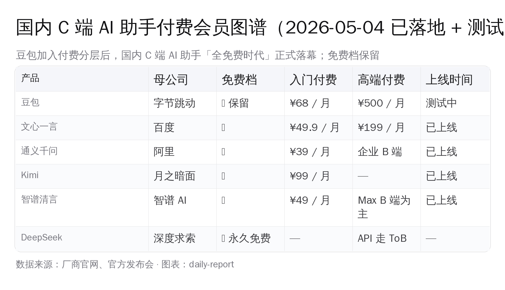

# 豆包披露付费订阅三档：68/200/500 月费，免费保留

> **2026 年 5 月 4 日 12:01，第一财经首发**——「豆包将在免费模式外新增付费订阅，官方回应」。豆包 App Store 页面披露三档付费订阅定价：标准版连续包月 **¥68**（连续包年 ¥688）、加强版 **¥200**（包年 ¥2048）、专业版 **¥500**（包年 ¥5088）。豆包官方对正观新闻回应：「**豆包始终提供免费服务**，在免费服务的基础上，豆包也在探索推出更多增值服务，相关方案细节还在测试阶段。」

> **重要事实订正**：豆包产品里目前**尚未出现付费选项**——这不是「豆包开始收费」，是付费增值订阅上线前的定价披露。免费档不会消失。

豆包从「全免费抢用户」走到「免费 + 增值订阅」的转折点摆在桌面上。三档定价的颗粒度比国内任何一家 C 端 AI 助手都细，500 元这一档在国内 AI 助手会员价格带里前所未见。

## 一、事件链与三档定价

### 时间线

- **2026-05-04 12:01**：第一财经首发，标题「豆包将在免费模式外新增付费订阅，官方回应」
- **2026-05-04 13:16**：正观新闻（郑州日报社旗下 V 认证媒体）引述发文，叠加界面新闻 + 第一财经双源
- **截至 14:30**：36 氪 / 量子位 / 虎嗅 AI 头部尚未跟进，财经线（第一财经 + 界面 + 正观）走在 AI 媒体线前面

### 三档定价完整对照

| 档位 | 月费 | 年费 | 月折后 | 年付折扣 |
|---|---|---|---|---|
| 标准版 | ¥68 / 月 | ¥688 / 年 | ≈ ¥57 / 月 | 约 16% |
| 加强版 | ¥200 / 月 | ¥2,048 / 年 | ≈ ¥171 / 月 | 约 15% |
| 专业版 | ¥500 / 月 | ¥5,088 / 年 | ≈ ¥424 / 月 | 约 15% |

三档年付折扣线性约 15%——不算激进，国内会员体系常见 8-12 折优惠区间，豆包给的是中庸档。

### 官方回应原文

豆包官方对正观新闻的回应有三个关键词——「**始终提供免费服务**」「**探索增值服务**」「**测试阶段**」。这三个词一起出现，是中国 C 端互联网产品在商业模式转弯时的标准话术：

- 「始终免费」 → 兜底用户基数，安抚老用户
- 「增值服务」 → 付费档定位是 add-on 不是 replacement
- 「测试阶段」 → 给定价 / 功能 / 上线时间留弹性窗口

这三个词放在一起，结论非常清楚：**免费档保留，付费档单走，价格还可能调，上线时间未定**。

## 二、把三档定价对位海外旗舰

豆包三档的设计在海外 C 端 AI 助手会员图谱里有清晰对位——

| 档位 | 豆包 | ChatGPT | Claude | Gemini |
|---|---|---|---|---|
| 入门付费 | ¥68 / 月（标准版） | $20 / 月（Plus，约 ¥144）| $20 / 月（Pro，约 ¥144）| $20 / 月（Pro）|
| 中段付费 | ¥200 / 月（加强版） | —— | —— | —— |
| 高端付费 | ¥500 / 月（专业版） | $200 / 月（Pro，约 ¥1,440）| $100/$200 / 月（Max）| —— |

把这张表读完会看到三个判断——

**第一，标准版 ¥68 是「ChatGPT Plus 的中国对位」**。¥68 / ¥144（按 ¥7.2/$）≈ 47%，国内 C 端 AI 助手会员历来对海外旗舰打 30%-50% 折扣（文心一言会员 ¥49.9、Kimi+ ¥99、智谱清言会员 ¥49 都在这条线上）。豆包 ¥68 / 月落在国内中档定价，比 Kimi+ 略低、比文心略高，符合"字节流量打法"的定价逻辑。

**第二，加强版 ¥200 在国内市场前所未见**。国内 C 端 AI 助手过去 18 个月只有「免费 + ¥50-100 月费」两档，¥200 这一档**在国内是开荒**。它对位的不是 ChatGPT Pro（$200），而是「比标准版多一档但还未到企业级」的中段——典型用例可能是：长上下文、更多 MCP 工具调用、Agent / Coding 能力下放。

**第三，专业版 ¥500 对位 Claude Max / ChatGPT Pro 的国内化**。¥500 / ¥1,440 ≈ 35%，跟标准版的折扣比例一致。这一档在豆包产品里大概率绑定**重度 Agent 调用、Coding Agent 能力、Trae 联动、火山引擎 API 配额**——相当于把字节自家 AI 编码协作工具栈打包卖给个人专业用户。

## 三、国内 C 端 AI 助手付费会员图谱

把豆包放回国内 C 端 AI 助手会员体系——

| 产品 | 母公司 | 免费档 | 入门付费 | 高端付费 | 上线时间 |
|---|---|---|---|---|---|
| **豆包** | 字节跳动 | ✅ 保留 | ¥68 / 月 | ¥500 / 月 | 测试中 |
| **文心一言** | 百度 | ✅ | 文心一言会员 ¥49.9 / 月 | 文心一言专业版 ¥199 / 月 | 已上线 |
| **通义千问** | 阿里 | ✅ | 通义 Pro ¥39 / 月 | 通义灵码企业版（B 端） | 已上线 |
| **Kimi** | 月之暗面 | ✅ | Kimi+ ¥99 / 月（包年 ¥588） | —— | 已上线 |
| **智谱清言** | 智谱 AI | ✅ | 智谱清言会员 ¥49 / 月 | 智谱清言 Max（B 端为主） | 已上线 |
| **DeepSeek** | 深度求索 | ✅（C 端 chat 永久免费） | —— | API 走 ToB 用量计费 | —— |

把这张表读完会看到——**国内 C 端 AI 助手「全免费时代」实际已结束 12+ 月**，文心 / 通义 / Kimi / 智谱都早已开通付费会员，只是豆包这一家此前坚持「全免费 + 火山引擎 API To B 商业化」的双轨。

豆包加入付费订阅意味着——**字节把 C 端 AI 助手的商业化补齐了**。但豆包没走文心 / Kimi 单档（一档付费会员）路线，而是切了三档——这是同行里第一个把 ¥200 / ¥500 高端档摆出来的。

DeepSeek 仍然是个特例。DeepSeek 的策略是「C 端永久免费 + ToB 用量计费」，靠 API token 出量赚钱，C 端不付费——这跟豆包从今天起的「免费 + 增值订阅」明显不同。**国内 C 端 AI 助手从此刻起分成两条路**——豆包/文心/通义/Kimi/智谱五家走「免费 + 会员」、DeepSeek 走「永久免费 + ToB 量价」。

## 四、字节豆包商业模式的转折点

豆包过去 18 个月的故事是「全免费抢用户」。把字节 C 端 AI 助手矩阵放在一起看——

- **豆包（C 端 chat / 移动端 / 桌面端）**：过去 18 个月全免费，靠流量补贴抢 DAU
- **Trae（AI Coding IDE）**：2026-02-24 转 token 计费，五档订阅 Free $0 / Lite $3 / Pro $10 / Pro+ $30 / Ultra $100，国内企业 ¥69 / 席位，对位 Cursor / Claude Code
- **扣子 Coze（Bot Agent 平台）**：To B SaaS，按 token / 调用计费
- **火山引擎豆包 API**：To B 用量计费，按 token 阶梯定价
- **Cici / Talkie（豆包国际版）**：在海外市场已有付费形态

豆包是字节 AI 矩阵里**最后一个补齐 C 端付费**的产品。这件事的信号意义不在「字节缺钱」——字节年度营收过万亿、AI 投入早已不靠 C 端会员回血——而在「**字节认为 C 端 AI 助手专业用户群足够大、值得做付费分层**」。

C 端 AI 助手专业用户的特征是：**调用频次高（每天 50+ 次）、上下文长（动辄 50K+ token）、跨工具链（chat + coding + agent + 文档）**。这一档用户在免费档里跟轻度用户混在一起，模型推理资源、长上下文能力、工具调用配额都被稀释。三档付费订阅本质上是**算力和能力的分层供给**——把重度专业用户单独切出来，给他们独占资源 + 高级能力。

把豆包放进国内大盘看，这个转折点的时间窗很清晰：

- **2024-12 ~ 2025-12**：免费抢用户期。豆包 DAU 从 0 起步，外界估算冲到接近 ChatGPT 美国 DAU 的水平
- **2026-01 ~ 2026-04**：模型能力补齐期。豆包 1.5 Pro / 1.6 系列陆续上线，长上下文 / Agent / 工具调用追平国产同行
- **2026-05 起**：商业化分层期。开始切付费订阅，分流专业用户

这条曲线跟 ChatGPT 2022-11 上线 → 2023-02 推 Plus → 2024-09 推 Pro 的节奏在结构上一致——只是字节走完整条路用了 17 个月，OpenAI 用了 22 个月，国内追赶的时间在缩短。

## 五、对国内一线 AI 用户的判断框架

豆包付费会员还没正式上线。对国内重度用户（每天用 AI 助手做 30+ 次专业任务的开发者 / 设计师 / 内容创作者），先把判断框架准备好——

**第一，看 ¥68 标准版到底解锁什么**。如果只是去广告 + 略长上下文，跟文心 / Kimi / 智谱同档差异不大，按品牌偏好选。如果绑定豆包 1.6 Pro 高级模型 + 优先排队 + 50K+ 上下文，跟 ChatGPT Plus 对位才有意义。

**第二，看 ¥200 加强版的功能边界**。这是国内此前没有的中段定价，差异化看三件事——MCP 工具调用是否开放、Agent 长任务是否支持、跨设备连续会话是否打通。这三件事任意一件做到位，¥200 / 月对每天 AI 调用 50+ 次的专业用户都是合理付费。

**第三，看 ¥500 专业版是不是国内版的 ChatGPT Pro**。专业版的关键不是单纯加配额，是看能不能把豆包 / Trae / 火山引擎 API 三套字节自家工具栈联动起来——豆包做 chat 入口、Trae 做 IDE、火山引擎做 API 调用配额，三件套一站式。如果做得到，¥500 / 月对企业内部专业开发者 / 创业团队都有真实价值。如果只是「更大配额」，¥500 在国内市场难站住。

**第四，留一个不付费的备选方案**。无论豆包付费档怎么定价，DeepSeek（C 端永久免费 + API ¥0.5/M 输入 + ¥24/M 输出）和 OpenRouter 中转（千问 3.6-Plus / DeepSeek V4-Pro 等都能挂上）始终是竞争对手。豆包付费订阅必须给出比这两条路更明显的体验差，才能让重度用户愿意按月付。

## 六、收官：免费时代结束了，但免费档没结束

豆包付费订阅披露这一刻，国内 C 端 AI 助手「全免费时代」**正式落幕**。但**免费档不会消失**——豆包官方话术里「始终提供免费服务」是兜底承诺，文心 / 通义 / Kimi / 智谱也都保留免费档。

真问题不是「要不要为豆包付费」，是国内 AI 助手集体走完**免费 → 增值会员 → 工具链分层**这条曲线后，重度用户面对的选择从「哪家免费」转成了「哪家付费的边际价值最高」。

这件事最有意思的不是 ¥68 / ¥200 / ¥500 三个数字本身，是**字节这种现金流足够厚的公司开始切 C 端付费分层**——意味着国内 AI 圈的玩家共识已经形成：**C 端 AI 助手必须有付费档，否则做不出可持续的能力分层**。

至于豆包付费档具体什么时间上线、三档功能边界落到什么颗粒度——按官方说法「测试阶段」，最快可能是未来几周，最迟也不会超过年中。这是国内 C 端 AI 助手商业化曲线的下一个观察点。

---

**信息源**

- 第一财经 5-4 12:01：[豆包将在免费模式外新增付费订阅，官方回应](https://www.yicai.com/)（标题已实证 / 原文跳转）
- 正观新闻 5-4 13:16：[豆包新增付费订阅，标准版每月 68 元、加强版 200 元、专业版 500 元，官方回应](https://www.zynews.cn/)（郑州日报社 V 认证）
- 信息来源溯及：界面新闻、第一财经
