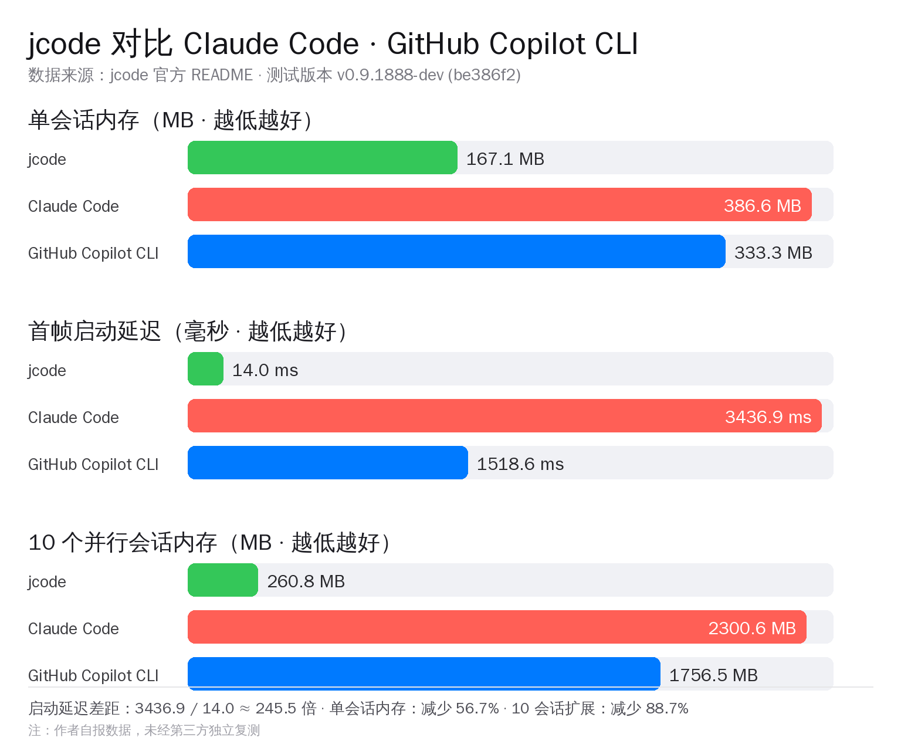
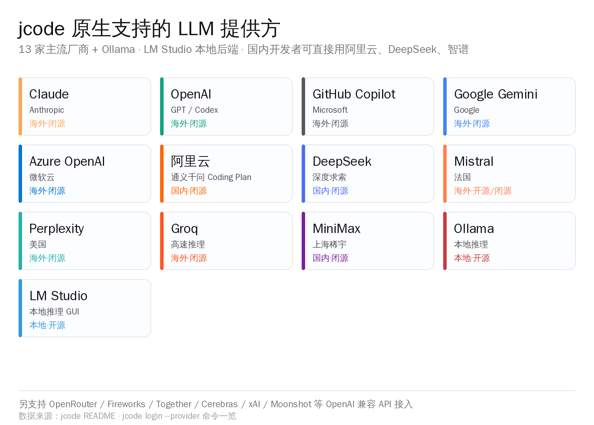
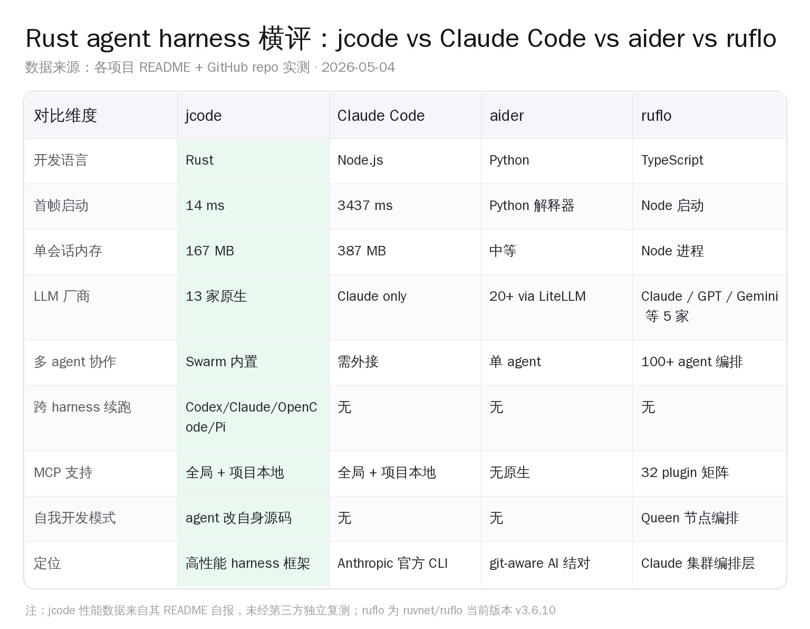

# jcode 启动比 Claude Code 快 245 倍：Rust harness 怎么做到的

> 3911 stars、4 个月、当日 +587、GitHub Trending Daily Top 8。jcode 不是又一个绑定单一模型的终端 CLI，也不是多 agent 集群编排层，它是一个 **harness（外壳）**——把 Claude / OpenAI / 阿里云 / DeepSeek / Ollama 等 13 家 LLM 用同一套 Rust 二进制串起来，给开发者一个比 Claude Code 启动快 245 倍、内存省 56.7% 的统一入口。作者 Jeremy Huang 一个人写，仓库 2026-01-05 才创建。

## 一、3911 stars 是怎么 4 个月攒起来的

仓库元信息（GitHub 实测，2026-05-03 20:00 UTC 拉取）——

- **stars**：3911
- **forks**：313
- **open issues**：70
- **language**：Rust
- **license**：MIT
- **创建时间**：2026-01-05，至今 119 天
- **最近 push**：2026-05-03 19:12 UTC（写到现在还在改）
- **仓库体积**：约 374 MB
- **当日 stars 增长**：+587（占累计的 17.5%），进 GitHub Trending Daily 综合榜 Top 8
- **作者**：Jeremy Huang（GitHub `1jehuang`），112 followers / 48 公开仓库 / 2021 年开账号 / 无公开雇主信息

节奏看下来很清楚。前两个月几乎是水下航行——单作者从零搭一个 Rust agent 框架，到 3 月才把基本骨架走通。真正起势的是 4 月底 v0.11.0 发布之后，那一版加了 Self-Dev Mode（自我开发模式）和跨 harness 续跑能力，6 天内连发 7 个 patch（v0.11.0 → v0.11.6 → v0.11.9）。这种 release 密度通常意味着某个核心功能终于打磨到能用，作者抓窗口期密集修边角。

最近 5 个 commit 也很说明问题——`Use local provider for remote overnight runs` / `Validate live tool call arguments` / `Fix remote session context working directory` / `polish antigravity direct provider` / `fix antigravity cloud code platform metadata`，全部在 5 月 3 日 18:46 到 19:12 这 26 分钟里推上去。一个人写、白天黑夜在改、夜里跑远端会话验证——这是典型的「开发者用自己写的工具开发自己」的循环节奏。

这种节奏在 GitHub 上不算少见，但 4 个月攒到 3911 stars + 单日 +587 + Trending Top 8 的组合不多。把它放在同期的另外两个相邻项目里看，定位就清楚了——

- **Hmbown/DeepSeek-TUI**：单模型绑定 DeepSeek V4，Rust 单 binary，当日 +389 stars 进 Trending
- **ruvnet/ruflo**（原名 claude-flow）：把 Claude Code 拓展成 100+ agent 集群编排平台，TypeScript，累计 36531 stars
- **1jehuang/jcode**：harness 框架本身，13 家 LLM 厂商通用入口，Rust，3911 stars

三个项目都和 Claude Code 同一生态位，但解决的是完全不同的问题——单模型专精、多 agent 集群、统一 harness。jcode 的差异化点是把 harness 这一层单独做透。

## 二、harness 是什么：先把名词的边界划清楚

「Coding Agent Harness」这个词，作者在 README 第一行写得很谨慎——"The next generation coding agent harness to raise the skill ceiling. Built for multi-session workflows, infinite customizability, and performance."

harness 在英文工程语境里原意是「外壳 / 套件 / 装具」。在 LLM agent 这个语境下，它指的是「把模型套住、让它能在一个工程化环境里跑起来的所有东西」——UI、tool 调用、memory、skill 注入、文件 IO、shell 执行、git 操作、MCP 通信、会话持久化。

模型本身只负责产 token；harness 决定模型能做什么、怎么和环境交互、上下文怎么管理、tool 调用怎么执行。Claude Code 是 Anthropic 自家做的 harness（绑 Claude）、Codex CLI 是 OpenAI 自家做的（绑 GPT）、Aider 是 Paul Gauthier 写的开源 harness（用 LiteLLM 接 20+ 家）、Cursor 也算 harness（IDE 形态）。

jcode 的定位是——**做一个不绑任何家的、性能优先的、Rust 实现的、跨厂商通用的 harness**。它不发模型，它专心做 harness。

这个定位之前有人尝试过（OpenCode 项目、aider 都算），但 jcode 在两件事上做得明显更彻底：

**一是性能**。把启动延迟和内存压到一个明显反差的档位（下一节展开），让 harness 这一层「几乎免费」，开发者不会因为 harness 本身的资源占用犹豫开几个会话。

**二是跨 harness 续跑**。这是最少见的功能——README 直白写：「Resume sessions from different harnesses. Claude code broke on you? Resume the session from jcode and continue where you left off.」如果这句话能稳定兑现，意味着开发者可以把 jcode 当作"备用 harness"——平时用 Claude Code、出问题时切到 jcode 接着干，不丢上下文。这对每天靠 Claude Code 吃饭的人是有意义的保险。

## 三、性能差距：把启动延迟从 3.4 秒压到 14 毫秒

jcode 最大的卖点是性能，但所有数据都来自作者 README 自报的对比，未经第三方独立复测——这一点先讲清楚。下面引用的数字按 README 原文转录。

**首帧启动延迟**——

- jcode：14.0 ms（基线）
- Claude Code：3436.9 ms（慢 245.5 倍）
- GitHub Copilot CLI：1518.6 ms（慢 108.5 倍）
- Cursor Agent：1949.7 ms（慢 139.3 倍）

**首次输入响应**——

- jcode：48.7 ms
- Claude Code：3512.8 ms（慢 72.2 倍）
- GitHub Copilot CLI：1583.4 ms（慢 32.5 倍）

**单会话内存占用**——

- jcode：167.1 MB（embedding 关闭时降到 27.8 MB）
- Claude Code：386.6 MB
- GitHub Copilot CLI：333.3 MB
- Cursor Agent：214.9 MB

**10 个并行会话扩展性**——

- jcode：260.8 MB（每多一个会话只加约 10.4 MB）
- Claude Code：2300.6 MB（每多一个会话约 +212.7 MB）
- GitHub Copilot CLI：1756.5 MB

启动延迟差距 245.5 倍这个数字看起来夸张，但拆开来看也合理——Claude Code 是 Node.js + Electron 思路下的 CLI，冷启动要装 V8、加载几十个 npm 模块、初始化 anthropic sdk + tokenizer + tool registry；jcode 是 Rust 编出来的单 binary，启动时只做必要的内存分配和 stdin/stdout 接管。Rust 静态链接 + 零成本抽象本身就是为这种场景设计的。

10 并行会话内存差距 8.8 倍是更值得注意的数据——这说明 jcode 把每个 session 的额外开销做到了非常薄。开发者真实工作流里同时开 3-5 个 session 是常态（一个 session 跑测试、一个看仓库、一个改代码），如果 harness 在这一层不省，10 个 session 直接吃掉 2.3 GB 内存，13 寸 16 GB 笔记本会很吃力。

需要泼一盆冷水——这些数字是**作者 README 自报、版本 v0.9.1888-dev (be386f2) 的内部测试**，没有第三方独立复测。Rust harness 比 Node harness 启动快、内存省，方向是对的，但具体倍数读者最好亲自跑一次再相信。jcode 的 install 脚本在 macOS / Linux 都是一行 curl 完事，自己测的成本不高。

## 四、13 家 LLM 厂商：国内开发者直接受益的一层

jcode 在 LLM 接入上做的覆盖度，比同类项目都广。

`jcode login --provider` 命令一览——

- **Claude**（Anthropic）
- **OpenAI**（GPT / ChatGPT / Codex 系列）
- **GitHub Copilot**（Microsoft）
- **Google Gemini**
- **Azure OpenAI**
- **阿里云 Coding Plan**（通义千问 Code 系列）
- **DeepSeek**（深度求索）
- **MiniMax**（上海稀宇 abab 系列）
- **Mistral**
- **Perplexity**
- **Groq**（高速推理）
- **Ollama**（本地后端）
- **LM Studio**（本地后端 + GUI）

另外通过 OpenAI 兼容 API 还能挂 OpenRouter / Fireworks / Together / Cerebras / xAI / Moonshot / Cortecs / Baseten / Nebius / Scaleway 等十几家——本质上凡是支持 OpenAI 协议的 endpoint 都能接。

这套覆盖对国内开发者最有意义的有三个点。

**第一，阿里云原生集成是稀有功能**。同类海外开源项目里把阿里云 Coding Plan 做成一等公民的几乎没有。这意味着国内开发者用通义千问 Coder 系列，不用自己写适配层、不用过 OpenRouter 的中转、不用配 OpenAI 兼容代理——直接 `jcode login --provider alibaba-coding-plan` 就跑起来。

**第二，DeepSeek 直连**。Hmbown/DeepSeek-TUI 走的是「绑定 DeepSeek 的专用 CLI」路线，jcode 走的是「DeepSeek 是支持的 13 家之一」路线。两条路线的目标场景不一样——DeepSeek-TUI 适合「就是要用 DeepSeek」的纯粹场景，jcode 适合「今天跑 DeepSeek、明天切到 Claude、下周接 Ollama」的多模型切换场景。

**第三，Ollama / LM Studio 本地后端**。本地推理在国内的实操优势比海外明显——网络稳定、无配额、无审计风险。配合 Ollama 跑 Qwen 3 Coder / DeepSeek Coder V2 / GLM 4.5 Air 这一档本地模型，jcode 可以变成完全离线的 coding agent。配置方式按 README 是标准的 `OLLAMA_BASE_URL=http://localhost:11434 jcode`——和原生 Ollama CLI 协议完全兼容。

vLLM 这一项 README 没单独点名，但通过 OpenAI 兼容协议接入是支持的——vLLM 默认开 OpenAI server，`jcode login --provider openai-compatible` + `OPENAI_BASE_URL=http://your-vllm-host:8000/v1` 就行。这个路径对国内自部署 70B 以上大模型的团队是直接可用的。

## 五、和 Claude Code / aider / ruflo 的横评

把 jcode 放进同代 agent 工具里看位置就清楚了——它和 Claude Code、aider、ruflo 不是同一个东西。

四个项目各自的定位——

**Claude Code**：Anthropic 官方写的 CLI、Node.js 实现、绑 Claude 模型、做工程化做得最稳、企业用户最多。它的弱点是性能（启动 3.4 秒、单会话 387 MB）和单模型锁定（只能用 Claude 系列）。

**aider**：Paul Gauthier 写的 Python 项目、绑 git workflow（每次改完自动 commit）、通过 LiteLLM 接 20+ 家厂商、特别擅长 repo-aware 上下文。它的弱点是 Python 解释器启动慢、不太适合远程跑长会话、UI 比较朴素。

**ruvnet/ruflo**：原名 claude-flow、TypeScript 实现、把 Claude Code 拓展成 100+ agent 的编排集群、32 个原生 plugin、Queen 节点 + Swarm 拓扑。它的弱点是复杂度——配置成本高，普通开发者用 Claude Code 直接干活就够，上 ruflo 是要把 agent 当 SaaS 跑的团队。

**jcode**：Rust 实现、harness 框架定位、13 家 LLM 厂商通用入口、性能优先、跨 harness 续跑、Self-Dev Mode 自我修改源码。它的弱点是项目年轻（4 个月）、单作者、生态尚未稳定（还在密集 patch 迭代）。

这四个工具不是替代关系，是分工关系。一个真实工作流可以这样拼——**日常用 Claude Code 干活**（Anthropic 官方支持、最稳）、**遇到大型 refactor 切到 jcode**（Rust 性能 + 跨厂商灵活）、**跑长任务的多 agent 协作上 ruflo**（Swarm + Queen）、**git diff 驱动的快速 PR 审查用 aider**（commit 自动化最丝滑）。

值得注意的一个细节是 jcode 的 mermaid 渲染——作者另写了一个独立项目 `1jehuang/mermaid-rs-renderer`，README 自报「比常用的 Mermaid.js 快 1800 倍、无浏览器依赖、无 TypeScript 依赖」。把架构图渲染成原生终端可看的形式（不开浏览器、不开 web view），这件事对纯键盘流的终端用户体验是质的差别。Claude Code 想看 mermaid 必须切去浏览器；jcode 直接在 TUI 侧边栏渲染。

另一个细节是 Handterm——作者写的自定义终端，`1jehuang/handterm`，自带 native scroll API，README 称「能渲染超过 1000 fps」。这是 Rust 在终端体验侧能拿出的差异化——大多数 Node-based CLI 在快速滚动长输出时会肉眼可见地卡顿，handterm 把这个体验做到了 60 fps 以上。

## 六、Self-Dev Mode：让 agent 改自身源码并热重载

jcode 最大胆的一个设计是 **Self-Dev Mode（自我开发模式）**。README 原文：「Tell your jcode agent to enter self dev mode, and it will start modifying its own source code.」

具体的工程链条是这样——

1. agent 收到「进入 self dev」指令
2. agent 在 jcode 自己的源码仓库里读代码、改代码、跑 cargo test
3. 测试过了之后，agent 调用 cargo build --release 编出新 binary
4. 新 binary 替换正在运行的旧 binary
5. agent 把当前所有 session 的状态序列化，跨 binary reload
6. 切换到新 binary 继续把活干完

这个能力的设计前提是——你信任 agent 在自己源码上的写权限、你愿意让一个跑着的 agent 把自己换掉、你的硬件能撑住 cargo build 的内存峰值。README 推荐用 frontier model（GPT 5.5 / Claude Opus 4 这一档）跑 self dev，因为这件事对推理深度和长上下文要求都不低。

这个功能在国内开发者圈不是必备的，更像是一种「agent 自我演进」的概念验证。把它放在 4 个月、3911 stars 的项目里看，可以理解为——作者在用自己的工具加速自己的工具开发，把 dogfooding 推到极致。这种节奏对项目本身的迭代速度有帮助，但对普通用户而言不是日常会用的功能。

值得提醒的是 self dev mode 的安全边界——它确实在做「让 LLM 改你机器上的代码并替换正在运行的二进制」这件事。哪怕作者自己跑得很顺，第三方用户开启时建议先用单独的 git checkout / 单独的用户隔离环境，不要在主仓库主分支上直接试。

## 七、国内开发者的实操路径：阿里云、DeepSeek、Ollama 三条线

讲完工具本身，回到真实问题——国内开发者要不要花 30 分钟试一下？三条主流接入路径都可行。

**线 1：阿里云通义千问 Coding Plan 直连**。`jcode login --provider alibaba-coding-plan`，OAuth 认证，账号绑定阿里云开发者中心。Coding Plan 是阿里云专门为 coding agent 场景出的 SKU，Qwen3-Coder-480B-A35B 系列模型为主力，1M 上下文档可用，价格按 token 计费、人民币结算、企业账号可开。这是国内开发者最稳定的路径，不需要科学上网、备案合规、发票走流程都通。

**线 2：DeepSeek 官方 API 直连**。`jcode login --provider deepseek`，API key 在 platform.deepseek.com 控制台拿。DeepSeek V4 系列的 cache 命中价显著低，单次完整会话花费在 ¥0.5 - 2 元区间。Hmbown/DeepSeek-TUI 是同基座的专精封装方式，jcode 在这条路上的优势是「未来切到 Claude / 通义 / 本地都不用换工具」。

**线 3：Ollama / LM Studio 本地推理**。完全离线、零网络依赖、零配额。Mac M4 以上配 64 GB 内存能跑 Qwen3-Coder-30B-A3B 或 DeepSeek Coder V2 Lite 这一档，速度大概 30-50 token/s，足够日常 refactor 使用。Linux 工作站接 RTX 4090 / 5090 / H100 这一档可以跑 70B+ 模型。配置方式标准——Ollama 起服务，`OLLAMA_BASE_URL=http://localhost:11434 jcode` 就行。

vLLM 自部署党的路径：`jcode login --provider openai-compatible` + 设置 `OPENAI_BASE_URL` 指向 vLLM server。vLLM 启动时记得开 `--api-key` 鉴权 + `--served-model-name` 给模型起个名字，jcode 这边在 `~/.config/jcode/config.toml` 把 model 字段对齐就跑通了。整个配置过程比 Claude Code 走 OpenAI 兼容路径要顺——jcode 的 provider 配置是开箱即用的，不用研究 LiteLLM 的 router 文件格式。

国内对应方案 vs jcode 的格局——通义灵码、千问 Code、Trae 都把「IDE / CLI 双形态 + 国产模型一等公民」走通了；jcode 走的是另一条路：「我不绑任何家、谁好用就用谁」。两条路解决的是不同问题，国内开发者完全可以两条都装、按场景切。

## 八、风险段：4 个月新项目、单作者、自报性能、Rust 学习曲线

把潜在风险列清楚，方便读者自己决定要不要试用——

**项目年龄 4 个月、单作者维护**。Jeremy Huang 一个人推到 3911 stars 已经是很不错的节奏，但意味着没有公司背书、没有团队 on-call、issue 响应速度看作者一个人的精力。70 个 open issues 的水位说明问题在累积。如果是关键工作流的核心工具，建议先在非关键场景试用 2-4 周再上正经活。

**性能数据未经第三方独立复测**。245.5 倍启动差距、56.7% 单会话内存节省、88.7% 10 会话扩展节省——这些数据全部来自 README，作者用的是版本 v0.9.1888-dev (be386f2) 内部测试。Rust 比 Node 启动快、内存省，方向是对的，量级上读者最好亲自跑一遍再做决策。install 脚本一行搞定，自测成本不高。

**Self-Dev Mode 的安全边界**。让 LLM 改自己源码并热重载二进制，听起来很酷，但生产环境慎用。建议用单独的 git checkout、单独的用户、单独的目录隔离试用，不要在主仓库主分支跑。

**Rust 工具链门槛**。jcode 用户不需要会 Rust，但如果遇到 panic、想从源码 build、想看 stack trace、想 patch 某个 bug——会 Rust 会显著加分。`cargo install jcode` 之前要装 rustup + cargo，这一步对纯 Node / Python 背景的开发者是新东西，不过 5 分钟能搞定。

**生态成熟度**。Claude Code 有 Anthropic 整个团队在维护、ruflo 有 ruvnet 一年多的积累、aider 有 4 年社区沉淀。jcode 4 个月、112 followers 的作者、单人维护——它是一个非常有想法的项目，但还在快速演进期。下一个 6 个月看作者能不能稳住代码质量、合并社区 PR、招到协作者，这是项目走向稳定的关键期。

## 九、收尾：harness 这一层值得单独投入

jcode 之所以有意义，不是因为某一项功能特别炫，而是因为它把 **harness 单独立出来当一个产品** 这件事做对了。

过去一年 LLM agent 工具的演化很有意思——大厂出官方 harness 绑自家模型（Claude Code / Codex CLI）、社区出多模型 harness 但跟不上性能（aider）、有人做 agent 编排集群（ruflo）。jcode 选了第四条路：**性能优先 + 跨厂商通用 + 单 binary 部署**。这条路之前一直缺一个能打的实现。

国内开发者现在有完整的工具链可选——通义灵码 / 千问 Code / Trae 走国产化整合路；jcode / aider / ruflo 走开源 harness 路；Claude Code / Cursor / Codex CLI 走大厂自家路。三条路都成立、都有人在用、都还在长大。

我们这一代 AI 开发者很幸运的一点是——这些工具都能装、都能切、不用赌一家。前辈用 Vim、Emacs、Sublime、VS Code 一路趟出来的"编辑器多元化"格局，正在 coding agent 这一层重演。jcode 是这个生态里值得点开看一眼的一员，启动它要 14 毫秒，不到 1 杯咖啡的功夫就能判断它是不是适合你。
