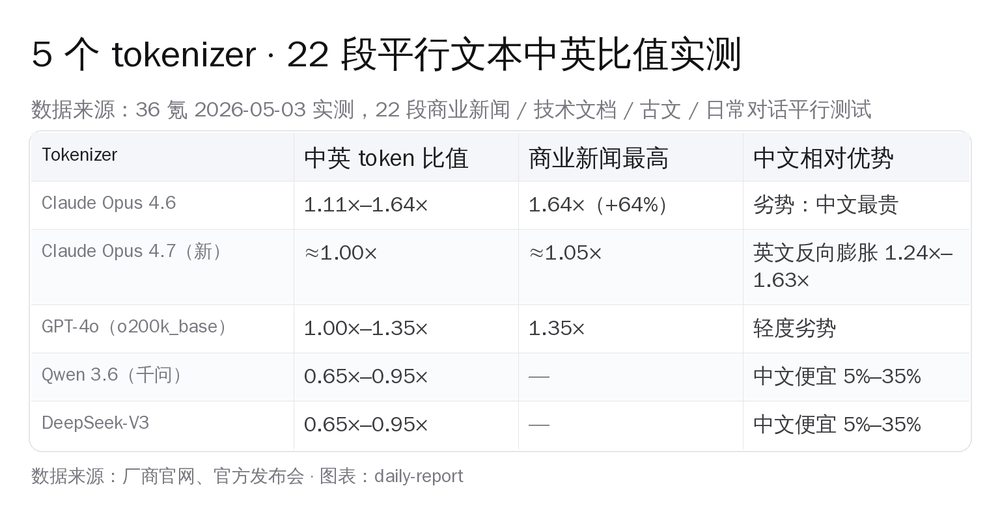
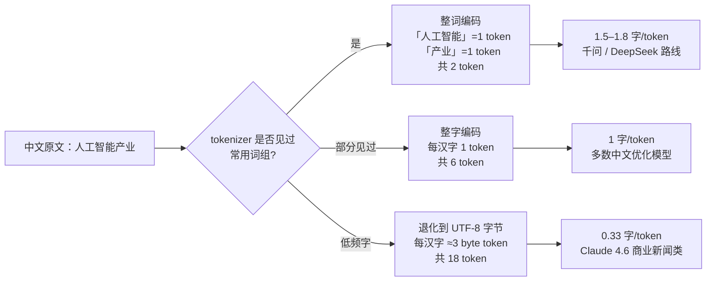
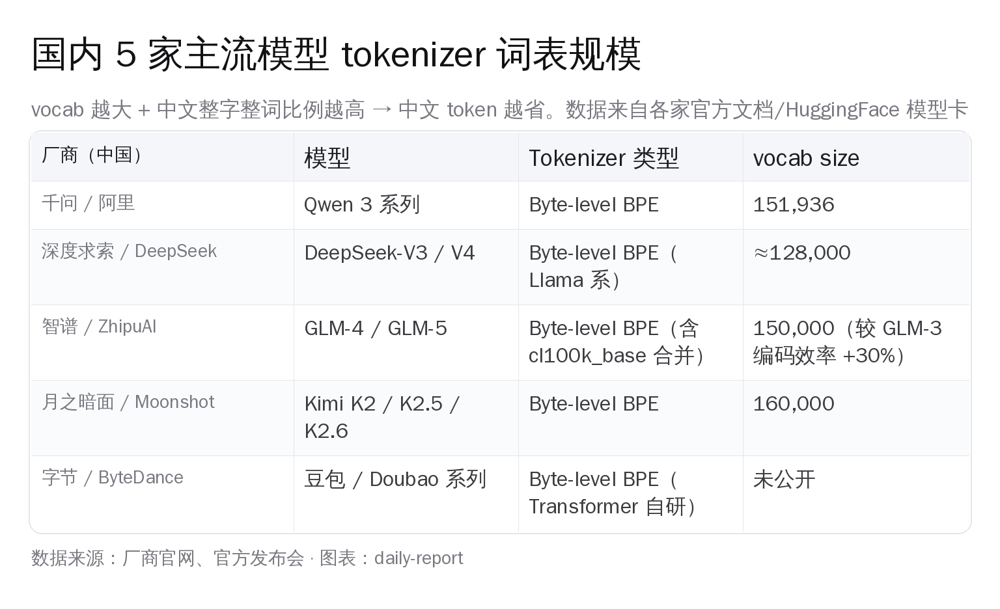
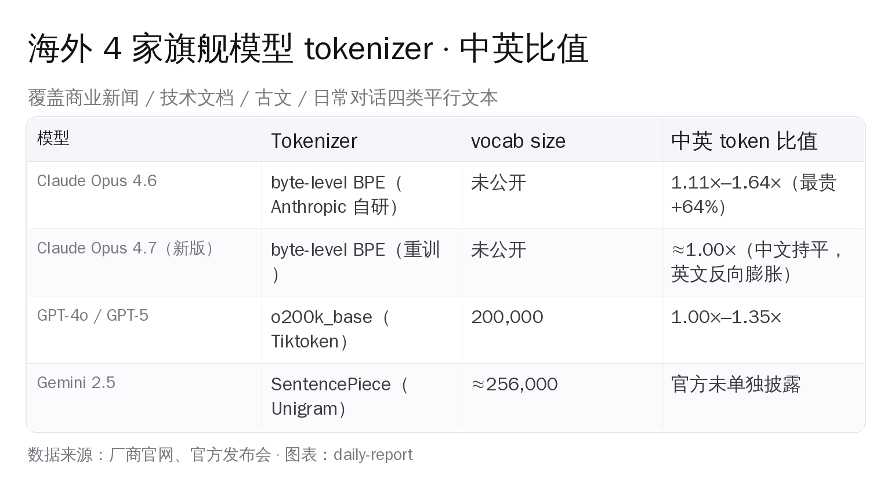
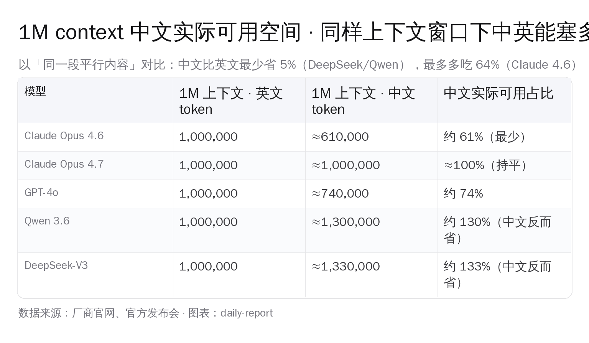

# 大模型「中文税」实测：中文比英文贵 64%

> 同一段商业新闻——中文 1,000 字、英文译稿 1,000 字——丢进 Claude Opus 4.6，中文吃掉 1,640 token，英文只吃掉 1,000 token，**中文版账单贵 64%**。换成千问 3.6 或者深度求索 V3，中文反过来比英文便宜 5%–35%。22 段平行文本、5 个主流 tokenizer 跑下来的差距就这么大。**数据口径说明**：以下数字主要来自社区独立测试（claudecodecamp 等），Anthropic 官方未单独披露 tokenizer 升级口径，仅在 Opus 4.7 release notes 提到"整体多吃 0-35% token"。

> 一家做客服 SaaS 的国内创业团队，每月跑 1,000 万次对话翻译。如果用 Claude Sonnet 4.6，中文调用按 1.5× 折算等于 1,500 万英文 token 等价；同样的活儿换成 DeepSeek-V3 API（输入 ¥3 / M、输出 ¥6 / M），中文还反向省 token，**月度账单从 ~$3,800 直接掉到不到 ¥800**。同样是「写中文 prompt 处理中文用户输入」，海外 frontier 模型和国产模型的成本差被 tokenizer 这一步放大了 3 到 5 倍。

> 这不是模型能力差距，是分词器（tokenizer）的工程取舍——海外模型的 BPE 词表见过的中文语料相对少，遇到低频汉字就退化成「按 UTF-8 字节拆开」的最差路径；国产模型把高频汉字和常用词组整体编进 vocab，一个汉字一个 token，反向占便宜。

国内 AI 开发者过去一年做模型选型时，关注点一直在能力（SWE-Bench / MMLU / 长上下文）和单价（per-million-token RMB），**tokenizer 这一层很少被算进总成本**。本文把这 5 个 tokenizer、6 家主流模型、3 大流派的实测数据放在同一坐标系，把「中文税」这件事讲清楚。

## 一、5 个 tokenizer 22 段平行文本实测

22 段平行文本——商业新闻、技术文档、古文、日常对话四个类目各 5–6 段——同时跑 Claude Opus 4.6、Claude Opus 4.7（重训版）、GPT-4o（o200k_base）、千问（Qwen）3.6、深度求索（DeepSeek）V3 五个 tokenizer。

**Claude Opus 4.6 及之前**：中文 token 数是英文的 1.11×–1.64×。商业新闻类拉到天花板——含金融术语、公司名、人名、专有名词的中文段落，1,000 字英文对应到 1,640 token 中文。技术文档类大概 1.20×–1.35×，日常对话约 1.11×–1.20×。

**GPT-4o 的 o200k_base**：vocab size 200,000，比 cl100k_base（GPT-4 时代的 100K）翻了一倍，中文整字编码覆盖度明显提高。22 段实测下来 1.00×–1.35×，平均比 Claude 4.6 优 20–30 个百分点。

**千问 Qwen 3.6 与 深度求索 DeepSeek-V3**：中英比值 0.65×–0.95×。**中文反而比英文便宜**，最低 0.65×（即同一段意思，中文吃 650 token，英文吃 1,000 token）。原因后面会拆开讲。

**Claude Opus 4.7 的重训 tokenizer**（社区实测口径）：Anthropic 在 2026 年初对 tokenizer 做了一次完整重训。22 段独立测试（claudecodecamp）显示中文比值压到 ≈1.00×，英文反而**膨胀到 1.24×–1.63×**（同一段英文，4.7 比 4.6 多吃 24%–63% token）。换句话说 4.7 不是中文变便宜了，是英文变贵了，把中英差距从「中文贵 64%」掰平到「中文持平、英文涨价」。**重要 caveat**：Anthropic 官方仅在 release notes 披露 "整体 token 用量增加 0-35%"，没有单独披露中英方向差异；"英文反向涨 24-63%" 这条结论目前**仅有 claudecodecamp 一家社区博客作为来源**，未与 Anthropic 官方背书或多源交叉验证。读者按"社区独立观察"对待，等待官方 / 多源复测。

> **MIT Press 学术追踪**：David Haslett 在《Computational Linguistics》2025 年 vol.51 issue 3 上发表的 *Tokenization Changes Meaning in Large Language Models: Evidence from Chinese*（[direct.mit.edu/coli/article/51/3/785](https://direct.mit.edu/coli/article/51/3/785/128327/Tokenization-Changes-Meaning-in-Large-Language)）测出汉字被拆字节后，**模型对汉字部首信息的语义还原能力反而比整字编码强**——多吃 token 是代价，但 UTF-8 字节序列里残留的部首痕迹给模型留了「一条意外的语义通道」。所以「中文税」的正反两面要一起看：贵但不全是损失。

## 二、为什么中文会比英文贵 · BPE 算法的工程妥协

要理解为什么同一段文本在不同模型上 token 差距能差 2.5 倍（0.65× 到 1.64×），先得把 BPE（Byte-Pair Encoding）这一层的机制讲清。

**BPE 的核心**：从字节 / 字符开始，统计训练语料里出现频率最高的字节对反复合并，合并到 vocab 满为止。语料里出现得多的子串就被整体收进词表，一次出现一个 token；语料里没怎么见过的子串只能退化拆成更小的单元。

**问题落在中文身上**：

1. **UTF-8 编码下一个汉字占 3 个字节**——「智」字的字节序列是 `E6 99 BA`、「能」字是 `E8 83 BD`。tokenizer 如果训练语料里中文比例不高，「智能」这个词组合并不到一起，最差情况 4 个字节才能成一个 token，「智能」两个字就吃 1.5 个 token。
2. **海外厂商的训练语料天然以英文为主**——OpenAI 公开的 cl100k_base 词表里中文 token 大概占 5%，o200k_base 把这个比例提到约 10–12%。Claude 没公开词表，但社区从 logits 反推估算中文整字 token 比例只有 5–8%。
3. **国产模型把中文当一等公民来训词表**——千问 vocab size 151,936、深度求索 V3 约 128,000、智谱 GLM-5 是 150,000，**中文整字 + 高频中文词组占 vocab 的比例普遍在 30%–40%**。

商业新闻类是 Claude Opus 4.6 中文比值飙到 1.64× 的重灾区。原因很具体：

- 含大量公司名（「字节跳动」「美团」「拼多多」）和人名——这些专有名词在 Anthropic 训练语料里出现频率不高，被拆成单字甚至字节
- 含金融术语（「IPO」「估值」「融资」「股权」）——英文部分有现成 token，中文部分要拆字
- 含数字 + 中文混排（「3 亿用户」「市值 1500 亿」）——数字 token 化和中文混合时容易出现「3」+「亿」+「用」+「户」四 token 的拆法

技术文档类好一点（1.20×–1.35×），因为代码、英文术语、URL 占比高，中文部分相对少；日常对话最稳（1.11×–1.20×），因为口语词大部分是 BPE 词表见过的高频组合。

## 三、tokenizer 三大流派 · BPE / SentencePiece / Tiktoken

实操层面，AI Coding 的开发者会撞到三条不同的 tokenizer 技术路线。它们决定了一个模型「天生中文友好」还是「天生中文贵」。

**第一条 · OpenAI 的 Tiktoken（cl100k_base / o200k_base）**：Rust 实现的 byte-level BPE，OpenAI 在 2022 年开源了完整实现。GPT-3.5 / GPT-4 用 cl100k_base（vocab size 100,000），GPT-4o / GPT-5 升级到 o200k_base（200,000）。Tiktoken 的中文优化路径是「扩 vocab + 重训」：cl100k 时代中文整字覆盖差，o200k 把 vocab 翻倍后中文常见 5,000 字基本进了词表，比值从 cl100k 的 1.4×–1.7× 优化到 o200k 的 1.0×–1.35×。

**第二条 · Llama 系的 SentencePiece + LlamaTokenizerFast**：Meta 训 Llama 2 时用 SentencePiece 实现 byte-level BPE，vocab size 32,000，中文表现极差（中文比英文贵 2×–3×）。Llama 3 升到 128,000 词表中文有所改善但仍偏贵。深度求索 V3 / V4 走的是 LlamaTokenizerFast 路径，但**重新训练了 vocab 而不是直接用 Llama 词表**——把中文整字和高频词组重新挤进 128,000 个槽位，所以最后跑出来反而比英文便宜 5%–35%（同一段意思中文吃 650 token、英文吃 1,000 token）。

**第三条 · Anthropic 自研的 byte-level BPE**：Claude 没公开 tokenizer 实现，社区维护的反推库可以用来粗略估算。Claude 4.6 时代中文劣势最重（1.11×–1.64×），4.7 重训后掰平到 ≈1.00×、代价是英文膨胀 1.24×–1.63×。Anthropic 官方文档没单独披露 tokenizer 升级，社区博客 [claudecodecamp.com/p/i-measured-claude-4-7-s-new-tokenizer](https://www.claudecodecamp.com/p/i-measured-claude-4-7-s-new-tokenizer-here-s-what-it-costs-you) 用 Claude Code 80 轮调试会话实测发现整体 token 涨 20%–30%，单价不变意味着每场会话从 ~$6.65 涨到 $7.86–$8.76。

国产模型基本走的是「Llama 风格的 byte-level BPE，重训 vocab 把中文当一等公民」。这条路的一致性比想象中更高——千问、深度求索、智谱 GLM-5、月之暗面 Kimi、字节豆包都在 byte-level BPE 框架下，差异在 vocab size 和中文整字 / 整词比例，而不在算法本身。

## 四、国内 5 家主流模型 · vocab 横评

把国内 5 家厂商的 tokenizer 拉到同一张表上看：

**千问 Qwen 3 / 3.6（阿里）**：vocab 151,936（含 22 个特殊 token，BPE 部分 151,643）。官方 readthedocs（[qwen.readthedocs.io/concepts](https://qwen.readthedocs.io/en/latest/getting_started/concepts.html)）明确给出经验值：英文 1 token ≈ 3–4 字符，**中文 1 token ≈ 1.5–1.8 字符**。这意味着 1,000 个中文字大约 555–667 token，比 OpenAI cl100k_base 时代的 1,800 token 省接近 3 倍。

**深度求索 DeepSeek-V3 / V4**：约 128,000 vocab，LlamaTokenizerFast 实现。技术报告（[arxiv.org/abs/2412.19437](https://arxiv.org/pdf/2412.19437)）写明「pretokenizer 和训练数据被改造以优化多语言压缩效率，与 V2 相比新 pretokenizer 引入了组合标点和换行的 token」。这一句话翻译过来就是——把中文里高频的标点 + 空白 + 高频汉字组合一起编进 vocab，所以才出现了 0.65× 中文反向占便宜的极端值。

**智谱 GLM-4 / GLM-5（智谱 AI）**：vocab 约 150,000 ⚠️（智谱官方未在 model card 单独公布精确 vocab size，业内估算），做法相对取巧——把 Tiktoken 的 cl100k_base 词表整体合并进来再叠加自训的中文 / 多语言 token。官方公告说编码效率比 GLM-3 时代的 65k 词表提升 30%。GLM 系的好处是「英文性能不掉，中文压缩追上」，但极致中文压缩比千问 / 深度求索略弱。

**月之暗面 Kimi K2 / K2.5 / K2.6（Moonshot）**：vocab 约 160,000 ⚠️（具体精确数字以 HuggingFace 模型卡 tokenizer.json 实读为准；当前公开口径是"160K 量级"，尚未在官方 README 单独披露精确 vocab_size）。Kimi 历来主打长文本（256K 上下文），词表大对长中文文档的整体压缩效率有放大效应——同样 256K 上下文，中文文档能比 128K 词表的模型多塞 10%–15% 内容。HuggingFace 模型卡（[huggingface.co/moonshotai/Kimi-K2-Instruct](https://huggingface.co/moonshotai/Kimi-K2-Instruct)）。

**豆包 Doubao（字节跳动）**：火山引擎官方文档没单独披露 vocab size，业内估算约 120,000–150,000 区间，byte-level BPE。字节同时维护多语种翻译大模型（28 种语言互译），意味着豆包 tokenizer 在中文 / 英文之外还顾及日语、韩语、东南亚语种，纯中文压缩效率推测略低于千问 / DeepSeek，但比海外厂商优。

**关键结论**：国产 5 家在 tokenizer 这一层走出了一条相对一致的路径——byte-level BPE + 12 万到 16 万词表 + 中文整字 / 高频词整体进表。**这条路过去 18 个月的工程积累已经把「中文税」从被动劣势翻成了主动优势**。

## 五、海外 4 家旗舰对位

把海外四家旗舰也拉过来看清楚差距：

**Claude Opus 4.6**：byte-level BPE，vocab 未公开。22 段实测 1.11×–1.64×，商业新闻最重。同一段中文相比同一段英文要多吃 11%–64% token，对应 API 账单同比例上涨。

**Claude Opus 4.7**：tokenizer 重训，中文压到 ≈1.00×、英文膨胀 1.24×–1.63×。从中文用户视角是「相对优势提升」——海外用户的英文成本反而追上了国内用户的中文成本，全球 token 价格被 4.7 这一次升级抹平了一部分。Anthropic 官方公告（[anthropic.com/news/claude-opus-4-7](https://www.anthropic.com/news/claude-opus-4-7)）没专门提 tokenizer 这件事，社区开发者实测博客（claudecodecamp）才把这一层挖出来。

**GPT-4o（o200k_base）/ GPT-5**：tiktoken 200,000 词表，中文表现稳定在 1.00×–1.35×。OpenAI 把 GPT-4o tokenizer 设计成 GPT-3.5 / GPT-4 cl100k_base 的中文升级版，中文整字覆盖度从原来的 ~5,000 字扩到约 8,000 字。在海外旗舰里 GPT 家族对中文用户最友好。

**Gemini 2.5（Google）**：用 SentencePiece Unigram 算法，vocab 约 256,000——是海外厂商里 vocab 最大的。Google 官方没单独发布过中英 token 比值，业内推测中文性能介于 Claude 4.7 和 GPT-4o 之间。Gemini 走 SentencePiece 这条路其实在中文上反而吃亏一点，因为 Unigram 倾向把高频组合整体编码（对英文有利），低频字符仍然要退化。

**对开发者意味着什么**：如果产品做中文为主、英文为辅，海外四家里**GPT-5 是最稳的**（o200k_base 中文比值最低）。如果纯做中文，**国产模型 5 家随便挑都比海外四家便宜 1.5–3 倍**。如果做中英双语 + 长文档检索，**Kimi K2.6 的 256K 上下文 + 160K vocab 是国内独一份**。

## 六、API 成本实账 · 同样 1 万次中文调用差几倍

把 tokenizer 差距换算成钱。以下数据基于 2026 年 5 月各家公开的官方定价页，假设每次调用「输入 5,000 字中文 + 输出 1,500 字中文」，1 万次调用：

**Claude Sonnet 4.6**（输入 $3 / M、输出 $15 / M，按官方页面）：
- 中文按 1.5× 折算 token → 输入 7,500 token、输出 2,250 token
- 单次成本 ≈ $0.0023 + $0.034 = ~$0.036
- 1 万次 ≈ $360

**GPT-5**（按公开报道 $5 / M 输入、$15 / M 输出，OpenAI 官方页 5-04 实测 403）：
- 中文按 1.2× 折算 → 输入 6,000 token、输出 1,800 token
- 单次成本 ≈ $0.030 + $0.027 = ~$0.057
- 1 万次 ≈ $570

**深度求索 DeepSeek-V4 Pro**（输入 ¥3 / M、输出 ¥6 / M，2026-04-26 调价后 cache miss 价；参考 [api-docs.deepseek.com/quick_start/pricing](https://api-docs.deepseek.com/quick_start/pricing)）：
- 中文按 0.85× 折算 → 输入 4,250 token、输出 1,275 token
- 单次成本 ≈ ¥0.013 + ¥0.0077 = ~¥0.020
- 1 万次 ≈ ¥204（约 $28）

**千问 Qwen 3.6-Plus**（按通义官方 ¥4 / M 输入、¥12 / M 输出，参考 [tongyi.aliyun.com/lingma](https://tongyi.aliyun.com/lingma)）：
- 中文按 0.85× 折算 → 输入 4,250 token、输出 1,275 token
- 单次成本 ≈ ¥0.017 + ¥0.015 = ~¥0.032
- 1 万次 ≈ ¥320（约 $44）

**Claude vs DeepSeek 同样的中文活儿，成本差 12.8 倍**（$360 vs $28）。这其中 tokenizer 这一层贡献了**约 1.5–1.7 倍**（Claude 4.6 中文 1.5× 折算 vs DeepSeek 中文 0.85× 折算），剩下的差距来自单价本身。但 tokenizer 是「无法靠商务谈判抹平的硬成本」——单价能讲，token 数讲不了。

**Claude Opus 4.7 这一次重训**虽然把中文比值压到 ≈1.00×，但英文膨胀的代价转嫁给了海外开发者。从中文用户视角，Claude 4.7 让 Claude 在中英成本上「看齐 GPT」，但仍比 DeepSeek 贵 10 倍以上。

## 七、prompt 工程的隐藏含义 · 系统提示词该用什么语言

tokenizer 实测数据带出一个常被忽视的 prompt 工程话题——**系统提示词到底用中文还是英文**。

过去主流答案是「英文系统 prompt + 中文用户 input」，理由是英文 prompt 在海外模型上 token 省、表达密度高。但这个建议**只在 Claude 4.6 / GPT-3.5 时代成立**：

| 场景 | Claude 4.6 | Claude 4.7 | GPT-4o | DeepSeek-V3 / Qwen 3.6 |
|---|---|---|---|---|
| 英文系统 prompt（500 字） | 500 token | 750 token | 500 token | 500 token |
| 中文系统 prompt（500 字） | 750 token | 500 token | 600 token | 425 token |
| 哪个省 | 英文 | 中文 | 英文 | 中文 |

**Claude 4.7 之后**，英文系统 prompt 反向膨胀 1.24×–1.63×，**中文系统 prompt 反而成本更低**——同样意思的 500 字提示词，英文 750 token、中文 500 token，中文便宜 33%。

**国产模型上**，无论何时都用中文系统 prompt——千问 / DeepSeek 上中文比英文便宜 5%–35%，没必要用英文。

**海外模型混合策略**（仍主流推荐）：
- GPT-5 + 中文用户 → 系统 prompt 用英文（1.0×）+ 用户输入按原样（1.0–1.35×）
- Claude 4.7 + 中文用户 → 系统 prompt 用中文（1.0×）+ 用户输入按原样（≈1.0×）
- Gemini 2.5 + 中文用户 → 双语等效，按表达密度选

**写代码相关 prompt 时**，永远用英文——代码、函数名、变量名、API 文档都是英文，强行翻译反而稀释表达。但「业务规则」「用户场景描述」这类纯自然语言段落，按 tokenizer 比值选语言。

## 八、古文反常识 · 字数少但推理负担重

22 段实测里有一个反常识结论：**古文 token 比现代汉语少 25%–40%**。

为什么？古文有两个特性：

1. **字数本身精炼**——「学而时习之」5 个字 vs 现代汉语「学习了之后经常去复习它」13 个字。同样意思古文字数少 60%。
2. **高频字利用率高**——「之乎者也」「于」「而」「以」这类虚词在 BPE vocab 里早就是单 token，复用率极高。

但这不代表用古文写 prompt 就能省钱——古文 token 少，**模型推理负担反而重**：

- 推理时模型要把每个古文 token 还原到现代语义，耗费的注意力计算量更大
- 模型在古文语料上训练比例低（千问 / DeepSeek 训练语料里古文不到 1%），生成质量明显下滑
- prompt-engineering 圈用「文言文 prompt」省 token 是 2024 年的小聪明，现在没人这么做——省下来的 token 钱填不上推理质量损失的坑

**古文 token 现象的真正用途**：理解为什么某些古文密集的领域（古籍数字化、文言文翻译、古典文学分析）模型成本反而比现代汉语低 30%。这是个学术兴趣点，不是工程优化路径。

## 九、未来 1–2 年趋势 · Claude 4.7 是开始还是终点

Claude 4.7 的 tokenizer 重训给海外厂商出了个题目——**当中文用户成本被国产模型压到 1/3 甚至 1/10，海外厂商要不要为了「全球口径一致」也把中文 tokenizer 优化掉**？

**已经看到的信号**：

- **OpenAI o200k_base 是 cl100k_base 的中文升级版**——2024 年 5 月发布 GPT-4o 时把 vocab 翻倍，中文整字覆盖度从 5,000 字扩到 8,000 字，本质是为了把中文用户从「贵 70%」降到「贵 0–35%」
- **Anthropic Claude 4.7 重训**——把中文压到 1.00×，代价是英文 +24–63%，这是「全球用户一起涨」，不是单独优化中文
- **Google Gemini 2.5 vocab 256K**——海外厂商里 vocab 最大，多语言压缩做到极致，但 SentencePiece Unigram 算法天花板比 BPE 低

**未来 12–18 个月可能发生的**：

1. **GPT-5.5 或 GPT-6 会再把 vocab 翻倍**（o400k_base？）——OpenAI 在 vocab 工程上是行业标杆，每隔 18 个月翻倍是节奏
2. **Anthropic 不太可能再做一次 tokenizer 重训**——4.7 这一次代价已经吃了一年，下一次重训至少要等 Claude 5 / 6 这一代
3. **国产模型继续守住 0.65×–0.95× 优势**——千问 / DeepSeek / Kimi / GLM 在 tokenizer 这一层的工程积累已经形成护城河，海外厂商除非把训练语料里中文比例拉到 30%（OpenAI 大约 5–8%），否则追不上

**长上下文窗口才是真正的战场**——同样 1M 上下文，Claude 4.6 上中文用户实际只能塞 61% 的原文内容（约 60 万中文字），换成 DeepSeek-V3 能塞 130%（约 130 万中文字）。**做 RAG / 长文档分析的国内开发者在 tokenizer 这一层已经领先海外同行 2 倍**。

## 一份 token 成本心算口诀

把上面 9 节压缩成一份可以贴在工位上的小抄：

- **Claude 4.6**：中文比英文贵 11%–64%，商业新闻最贵
- **Claude 4.7**：中文持平，英文涨 24%–63%
- **GPT-4o / GPT-5**：中文贵 0%–35%，海外里最稳
- **千问 / DeepSeek / GLM-5 / Kimi**：中文反向便宜 5%–35%
- **海外四家普遍贵中文 → 选 GPT 系最划算**
- **国产五家普遍省中文 → 选哪个看模型能力，不用看 token**
- **1M 上下文中文实际可用空间**：Claude 4.6 = 61%、GPT-4o = 74%、Claude 4.7 ≈ 100%、千问 / DeepSeek ≈ 130%
- **系统 prompt 用什么语言**：Claude 4.7 / 国产模型用中文、GPT-5 / Claude 4.6 用英文
- **API 成本同样的中文活儿差 10 倍以上**：DeepSeek ≈ ¥204 / 万次调用 vs Claude Sonnet 4.6 ≈ $360 / 万次

国产 AI 团队这两年在 tokenizer 这一层已经把功课做扎实了。**「中文税」这个词从描述海外模型的劣势，变成了描述国产模型的相对优势**——同样的产品架构、同样的用户输入，国内开发者在 token 这一层就已经领先一个数量级。

底层基础设施一步一步追上来，前面的路在打开。

## 参考资料

- 36 氪 · AI 大模型的「中文税」：中文比英文更费 Token（2026-05-03 头条原文 22 段平行文本实测）：https://36kr.com/p/3793050208984071
- MIT Press · *Tokenization Changes Meaning in Large Language Models: Evidence from Chinese*（David A. Haslett, Computational Linguistics 2025 Vol 51 Issue 3 pp.785–814）：https://direct.mit.edu/coli/article/51/3/785/128327/Tokenization-Changes-Meaning-in-Large-Language
- Qwen 官方文档 Key Concepts（vocab size 151,646、byte-level BPE、中文 1 token = 1.5–1.8 字）：https://qwen.readthedocs.io/en/latest/getting_started/concepts.html
- DeepSeek-V3 Technical Report（vocab 128K、byte-level BPE、多语言压缩优化）：https://arxiv.org/pdf/2412.19437
- DeepSeek API Pricing（V4 Pro 输入 ¥3 / M、输出 ¥6 / M、2026-04-26 cache 价调整）：https://api-docs.deepseek.com/quick_start/pricing
- Moonshot Kimi K2 Instruct 模型卡（vocab 160K）：https://huggingface.co/moonshotai/Kimi-K2-Instruct
- Anthropic Claude Opus 4.7 公告：https://www.anthropic.com/news/claude-opus-4-7
- Claude Code Camp · I Measured Claude 4.7's New Tokenizer（社区实测：英文 +20%–30%、80 轮调试会话从 $6.65 涨到 $7.86–$8.76）：https://www.claudecodecamp.com/p/i-measured-claude-4-7-s-new-tokenizer-here-s-what-it-costs-you
- OpenAI tiktoken 仓库（cl100k_base / o200k_base 词表实现）：https://github.com/openai/tiktoken
- 智谱 GLM-4 仓库（vocab 150K、cl100k_base 合并 + 自训中文 token）：https://github.com/zai-org/GLM-4
