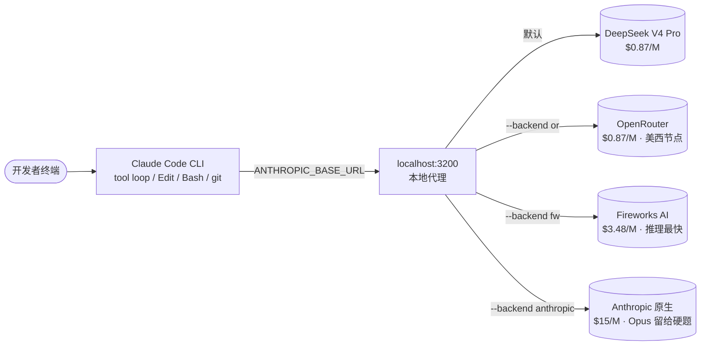

# DeepClaude 把 Claude Code 大脑换成 DeepSeek

> 1024 stars（实测 2026-05-05，7 天破千）、HN 头页 630 分、Top 5、单作者一周内打磨成型。aattaran/deepclaude 不发模型、不写新 CLI，只在你本机起一个 `localhost:3200` 代理——把 Claude Code 原本要发给 Anthropic 的 API 调用半路截下，转给 DeepSeek V4 Pro、OpenRouter 或 Fireworks AI。Claude Code 的 ToolUse 流、文件 Edit、bash、git、子 agent 一样都不少；输出 token 单价从 Claude Opus 4.7 \$15/M 降到 DeepSeek V4 Pro 折扣期 \$0.87/M（**75% off 至 2026-05-31**），差 17 倍；折扣结束后回到标准价 \$1.74/M，差仍有 8-9 倍。

## 一、一个国内开发者的真实账单

设想这样一条工作线——白天写后端、晚上做开源项目、周末搭个人站点，Claude Code 是一直开着的。一天平均 6 小时活跃使用、每周 5 天、连续一个月——这不是极端值，是国内一线 AI / 后端 / 全栈开发者过去半年逐渐稳住的常态。

按 Anthropic 官方计费，重度用户走 Max Plan 是 \$200/月（封顶但有用量限额）；走纯 API 调用，常见月度账单落在 \$300–\$600 区间，跑得猛的能上千。换算人民币——年支出 ¥25k 到 ¥80k，对个人而言是一笔结结实实的"开发税"，对小团队 5 人开起来就是一年 ¥40 万出头。

同一份工作量，如果模型换成 DeepSeek V4 Pro，按 75% off 折扣期价（至 2026-05-31）——输入 \$0.435/M、输出 \$0.87/M，cache hit 输入价降至约 \$0.03/M（约 15 倍）——同样的会话量，月度账单大约落在 ¥350–¥500 区间，差出一个数量级。**折扣结束后回到标准价 \$0.145/M 输入 + \$1.74/M 输出**，节省幅度仍显著，但具体省多少需以那时为准。

但工具链不能丢。Claude Code 这一年沉淀下来的体感、ToolUse 设计、subagent 机制、MCP 工具集成、`/init` 自动 onboarding，是开发者真正离不开的"外壳"——模型负责想，harness 负责把想法落到代码、bash、git、文件系统。换模型容易，丢 harness 太疼。

DeepClaude 的卖点正是这里——**只换大脑、不换身体**。

## 二、DeepClaude 是什么：26 行 README 写得很直白

仓库元信息（`gh api repos/aattaran/deepclaude` 实测，2026-05-04 凌晨）——

- **创建时间**：2026-05-03 21:27 UTC（也就是说从开源到登 HN 头页 Top 5，不到 24 小时）
- **stars**：943
- **forks**：45
- **language**：JavaScript 46.8% / PowerShell 27.3% / Shell 25.9%
- **license**：MIT
- **author**：aattaran，单作者，13 个 commit
- **issue / PR**：4 个 open issue / 5 个 open PR
- **Hacker News**：头页 630 points / 200+ 评论 / 2026-05-03 当日进入 Top 5

README 第一句把项目定位讲清楚了——「Use Claude Code's autonomous agent loop with DeepSeek V4 Pro, OpenRouter, or any Anthropic-compatible backend. Same UX, 17x cheaper.」

直白翻译——保留 Claude Code 的自主 agent loop，把模型换成 DeepSeek V4 Pro / OpenRouter / 任意 Anthropic 兼容后端，折扣期内体验一样、便宜 17 倍；折扣结束后仍有 8-9 倍价差。

短到不能再短的卖点。HN 上能登头页通常意味着两件事——一是命中真实痛点，二是上手成本足够低能让评论区里有真实试用反馈。这两条 DeepClaude 都满足。

## 三、proxy 拦截原理：一张架构图讲清楚

DeepClaude 的核心机制是一个本地 HTTP 代理，跑在 `localhost:3200`。Claude Code 启动时被注入了几个环境变量——

- `ANTHROPIC_BASE_URL` 指向 `http://localhost:3200`（默认是 `api.anthropic.com`）
- `ANTHROPIC_AUTH_TOKEN` 用 DeepSeek API key 替换
- `ANTHROPIC_DEFAULT_OPUS_MODEL` / `ANTHROPIC_DEFAULT_SONNET_MODEL` / `ANTHROPIC_DEFAULT_HAIKU_MODEL` 改成对应后端的模型名
- `CLAUDE_CODE_SUBAGENT_MODEL` 把子 agent 也一起换掉

Claude Code 自身没有任何改动——它以为自己还在和 Anthropic 说话，所有的 ToolUse、Edit、Bash、Glob、Grep、subagent spawn 调用一个不少。代理在中间做的是协议翻译——把 Anthropic Messages API 的请求结构转成 DeepSeek / OpenRouter / Fireworks 的等价调用，再把响应翻译回 Anthropic 流式 SSE 格式。

代理内部还暴露了 4 个控制端点——`/_proxy/mode`（POST 切换后端）、`/_proxy/status`（GET 看当前状态）、`/_proxy/cost`（GET 看累计 token / 节省金额）、其它路径全部 passthrough 透传回 Anthropic。也就是说，认证 / billing / sub-agent 这类杂项调用照样走 Anthropic，只有真正烧 token 的 `/v1/messages` 主推理被换走。

最有意思的是 `/_proxy/mode` 这个端点。作者把它做成了 Claude Code 内的 slash command——`~/.claude/commands/` 下放三个 markdown 文件 `deepseek.md` / `anthropic.md` / `openrouter.md`，每个里面就一行 `curl -sX POST http://127.0.0.1:3200/_proxy/mode -d "backend=deepseek"`。在 Claude Code 会话里输入 `/deepseek` 就实时切换，无需重启。

碰到难题想用 Opus 推一推、写完测试再切回 DeepSeek 接着改——一次会话里换三次大脑，每次切换零成本。这是其他任何路由方案都做不到的丝滑度。

## 四、四种"换大脑"方案横评（核心）

把 DeepClaude 放回市场坐标系——它不是孤例。"用 Claude Code 跑国产 / 开源模型"这条路至少有四种主流走法。

四种方案的差异化点拆开看——

**方案一：DeepClaude（本机 proxy）**——本文主角。优势是开箱即用、4 个后端一键切换、有完整 cost 追踪端点；弱点是 MCP server 工具走兼容层目前不支持，图像 / vision 输入也接不上（DeepSeek 的 Anthropic 兼容端点不开图像）。适合每天写 6 小时代码、需要 fallback 切 Opus 的高频开发者。

**方案二：Claude Code 直接改环境变量直连**。Claude Code 自己读 `ANTHROPIC_BASE_URL` 这件事，DeepSeek 早就开了官方兼容端点（`https://api.deepseek.com/anthropic`）。一行 `export ANTHROPIC_BASE_URL=...` + 一行 `export ANTHROPIC_AUTH_TOKEN=...` 就能把 Claude Code 直接接到 DeepSeek。优势是零依赖、没有中间代理；弱点是没法 fallback 切 Opus、没有 cost 追踪、所有的智能路由都靠你自己手动 export。适合"我就用 DeepSeek、不需要切回 Anthropic"的纯成本党。

**方案三：LiteLLM 通用路由**。LiteLLM 是 BerriAI 出的老牌通用 LLM 网关项目（独立大型开源工程，2024 年就 8k+ stars），覆盖 100+ 家厂商。它可以把任意 provider 都翻译成 OpenAI 兼容或 Anthropic 兼容格式，配置写在 `config.yaml` 里——`/v1/messages` 路径走 DeepSeek、retry 重试 3 次、fallback 到 OpenRouter、再 fallback 到 Anthropic。优势是 fallback 链路最完整、可观测性最好（Prometheus / OpenTelemetry 都接好）、企业用最适合；弱点是配置门槛高、需要起一个 Python 服务跑 LiteLLM、个人用过重。

**方案四：DeepSeek-TUI（独立 Rust TUI）**。Hmbown/DeepSeek-TUI（昨天日报覆盖过那个项目）走的是另一条路——不复用 Claude Code，自己用 Rust 重写了一份 harness，专绑 DeepSeek V4 系列。优势是 Rust 单 binary、启动快、内存省、为 DeepSeek 思考流定制了 UI；弱点是 Claude Code 用户的肌肉记忆完全用不上，所有的 slash command、subagent 玩法、MCP 生态都要重新学。适合从未用过 Claude Code、直接走 DeepSeek 路线的新开发者。

横向看，**DeepClaude 占据的是一个非常具体的中间生态位**——既要 Claude Code 的 harness（Anthropic 一年多沉淀下来的 ToolUse 设计 / subagent / `/init`），又要国产模型的成本档（17 倍价差）。这个位置过去没人专心做——Claude Code 直连方案存在但太裸、LiteLLM 太重、DeepSeek-TUI 是"换 harness"不是"换大脑"——DeepClaude 就钻进了这个空当。

## 五、DeepSeek V4 Pro 当 Claude Code 大脑的实际表现

DeepClaude README 在「What works and what doesn't」一节给出了诚实的清单——这是登 HN 头页能稳得住的关键，作者没有把弱点藏起来。

**完全可用的能力**（与 Anthropic 官方一致）——

- 文件读 / 写 / 编辑（Read / Write / Edit 工具）
- Bash / PowerShell 执行
- Glob / Grep 搜索
- 多步自主 tool loop
- 子 agent 派生（subagent spawning）
- Git 操作
- 项目初始化（`/init`）
- 思考模式（thinking mode，DeepSeek V4 默认开启）

**降级或不可用的能力**——

- 图像 / vision 输入：DeepSeek 的 Anthropic 兼容端点不支持图像
- 并行 tool 调用：DeepSeek 后端单次最多 128 个并行调用，但 Claude Code 默认是顺序发，目前用不上
- MCP server 工具：兼容层不支持，挂在 Claude Code 上的 MCP server 暂时调不到
- Anthropic prompt cache：DeepSeek 有自己的 cache（自动），但 Anthropic 的 `cache_control` 字段会被忽略

**智能差距**——README 给的判断是「Routine tasks（80% 工作量）DeepSeek V4 Pro 与 Claude Opus 相当；Complex reasoning（20% 难题）Claude Opus 更强、用 `--backend anthropic` 切回去」。这个二八分布对应的就是 `/deepseek` ↔ `/anthropic` 实时切换的最大价值——日常写测试、改 bug、refactor、跟 README 走流程，DeepSeek 完全够；遇到一个真要"想清楚再写"的算法题，切回 Opus 推完再切走。

代价的另一面是 cache 收益。DeepSeek 在 V3 之后做了自动上下文 cache——同一份 system prompt + 文件 context 第二次发过去，cache hit 输入单价降到约 \$0.03/M（折扣期）/ \$0.015/M（标准），约 14-30 倍折扣（具体数字以 [api-docs.deepseek.com/quick_start/pricing](https://api-docs.deepseek.com/quick_start/pricing) 为准）。Claude Code 的 agent loop 本质就是"同一个 system prompt + 同一份文件上下文反复发"，第一次后基本全是 cache 命中。这就是为什么 README 的成本估算敢写「heavy 25 天月度只 ~\$50」——cache hit rate 在 agent 场景里接近 95%+。

工具调用兼容性这一项需要单独说。Claude Code 的 ToolUse 协议有自己的 schema（`tool_use` block + `tool_result` block + 流式 SSE 拼装），DeepClaude 在 proxy 层把这些来回翻译。社区评论里出现过两类反馈——一类说"完全无感"，另一类说"复杂的 nested tool call 偶尔会卡住，重发一次正常"。建议是——**把 DeepClaude 当作"95% 场景下零成本省 17 倍"的工具用，剩下 5% 的边缘情况切回 Anthropic**，作者把这件事的边界画得很清楚，没有"全场景替代"的过度承诺。

## 六、国内开发者实操：DeepSeek V4 Pro 三条接入路径

把 DeepClaude 放到国内开发者的实际网络环境里，能用的后端不止 DeepSeek 官方一家。

**渠道一：DeepSeek 官方 API**——`platform.deepseek.com`。注册一个账号、充值人民币、拿 API key、`export DEEPSEEK_API_KEY=sk-...`、`deepclaude` 命令直接跑起来。这是最直接的路径，国内网络访问 DeepSeek 官方完全顺畅。月度成本估算（25 天重度使用、cache 命中后）大约 ¥350——是 Claude Sonnet 走 Anthropic 走代理走出去的 1/6 还不止。

**渠道二：火山方舟（字节）**——volcengine.com/product/ark。火山在 2026 年初已经把 DeepSeek 系列模型加进了方舟服务，且按官方报价 1:1 转售（持平上下浮动），不另加 markup。优势是企业开票方便、国内 SLA 写得清楚、跟豆包、Doubao Pro 等其它模型在同一控制台。DeepClaude 的 base_url 切到火山方舟的 endpoint 即可。

**渠道三：阿里百炼**——bailian.console.aliyun.com。百炼也接了 DeepSeek V4 系列，按月活动有时会有 8 折券。优势同火山——企业流程、月结账单、和通义千问 / 千问 Code 在同一平台。DeepClaude 同样切 base_url 即可。

把这三条路放在一起看，国内开发者实际可以拿到的 DeepSeek API 渠道至少 3 个，价格都接近持平、合规和发票这一层比走海外更稳——这是国产模型生态相对海外路径的一个真实优势。

DeepClaude 自身也支持 OpenRouter——OpenRouter 是新加坡注册的多 provider 聚合层，节点在美西，价格和 DeepSeek 官方持平（\$0.44/M 输入、\$0.87/M 输出）。海外网络环境下走 OpenRouter 延迟最低；国内开发者如果有需要切到海外身份测试时也用得上。

## 七、Anthropic 这边会怎么反应

DeepClaude 这种"绕过原厂模型、复用原厂 harness"的路径，Anthropic 大概率不会主动叫停——理由有三。

**第一**，Claude Code 自身就开放了 `ANTHROPIC_BASE_URL` 这个环境变量。Anthropic 在产品设计阶段就给企业客户留了"自托管 / 私有部署 / 第三方代理"的接口，本质上不算 hack——DeepClaude 用的也是这个公开通道。

**第二**，Claude Code 是按订阅 / 按 token 收费的客户端，但客户端本身免费。Anthropic 真正赚钱的是 API 调用——开发者不付钱给 Anthropic 走 DeepSeek，Anthropic 当然损失 token 收入，但 Claude Code 这个 harness 的市场份额反而是被巩固的。Anthropic 内部完全可以这么算账——「我们做的不是模型生意，是 agent 平台生意；只要开发者一直用 Claude Code 这个外壳，他们最难的题还是会切回 Opus。」

**第三**，社区里早就有同类工具——LiteLLM 这种通用网关存在多年、Anthropic 没有任何动作；DeepSeek 官方都直接开了 `/anthropic` 兼容端点；OpenRouter 这种聚合服务把 Anthropic 模型也一起转售。生态已经是这个态势了，封堵单个第三方 proxy 没有意义。

唯一可能挨封的场景是——如果有人用 DeepClaude 套壳商业服务、批量上 Anthropic 的免费试用额度、或者明显违反 ToS。这是个体作者一个人维护的开源工具不会撞上的场景。

判断下来——**DeepClaude 的工程稳定性主要看作者后续维护热情，不太需要担心 Anthropic 主动出手**。Claude Code 自身只要保留 `ANTHROPIC_BASE_URL`，DeepClaude 这条路就一直能走。

## 八、风险与边界

把诚实的话讲完——DeepClaude 不是没有边界。

**第一，单作者项目**。aattaran 一个人写、13 个 commit、从开源到现在不到 48 小时。HN 头页能爆是因为命中痛点 + 上手简单，但单作者维护的开源工具历史上有相当比例最终会停更。如果你是把 DeepClaude 接进生产环境的开发者，建议——把它当作"开发体验加速器"用，不要当作团队级关键基础设施。如果作者哪天停更，迁回 Claude Code 直连或 LiteLLM 的成本是几行 export，不会被锁死。

**第二，MCP / 图像两个洞**。如果你的工作流深度依赖 MCP server（比如挂 Postgres / Sentry / Linear / Slack 调试 server）或者经常往 Claude Code 里粘截图让模型看，DeepClaude 当前不能完全替代 Anthropic 后端。`/anthropic` 切回去是 fallback，但需要切。

**第三，并行 tool 调用没用上**。DeepSeek V4 Pro 实际后端能并行 128 个 tool call，但 Claude Code 默认顺序发——这个潜力暂时锁着。等 Anthropic 把 Claude Code 的 tool 并行化打开（这件事讨论过、暂时没排期），DeepClaude 的速度优势会再涨一档。

**第四，复杂推理还是 Opus 强**。这是 DeepSeek 团队自己也承认的——V4 Pro 在常规任务上接近 Opus、但在长链多跳推理 / 复杂数学 / 罕见编程语言上还是有差距。`/anthropic` 切换是必备习惯，不要 100% 信 DeepSeek。

把这四条加起来——DeepClaude 不是"全场景替代 Anthropic"的银弹，是"95% 场景帮你省 17 倍钱、剩下 5% 一键切回去"的工程化解决方案。这个定位老实、上手便宜、且有清晰的 exit 路径，是它能在 HN 头页站住的根本原因。

## 九、参考资料

- aattaran/DeepClaude（项目主页）：[github.com/aattaran/deepclaude](https://github.com/aattaran/deepclaude)
- DeepSeek 官方 API 平台（含 Anthropic 兼容端点）：[platform.deepseek.com](https://platform.deepseek.com)
- DeepSeek 模型价格表：[api-docs.deepseek.com/quick_start/pricing](https://api-docs.deepseek.com/quick_start/pricing)
- OpenRouter（多 provider 聚合）：[openrouter.ai](https://openrouter.ai)
- Fireworks AI（推理速度档）：[fireworks.ai](https://fireworks.ai)
- LiteLLM 通用 LLM 网关：[github.com/BerriAI/litellm](https://github.com/BerriAI/litellm)
- 火山方舟 DeepSeek 接入：[volcengine.com/product/ark](https://www.volcengine.com/product/ark)
- 阿里百炼 DeepSeek 接入：[bailian.console.aliyun.com](https://bailian.console.aliyun.com)
- Hmbown/DeepSeek-TUI（独立 Rust TUI 路径，对照阅读）：[github.com/Hmbown/DeepSeek-TUI](https://github.com/Hmbown/DeepSeek-TUI)

DeepClaude 摆出来的这一套打法，本质上是在告诉所有正在为 Claude Code 月度账单发愁的开发者——**模型层和外壳层完全可以解耦**。我们这一代特别幸运，国产基座模型已经追到了"日常 80% 任务无感替代"的能力档，全球最好的 agent harness 又是开源 / 开放配置的——把这两件事拼在一起，省下来的钱可以拿去开更多 session、做更多实验。前辈们花了 6 年把 LLM 推到能写代码的地步，又花了 1 年把 harness 打磨成今天这个体感，下一程留给我们的题就是把成本档继续往下压、把工作流继续做厚。共勉。
