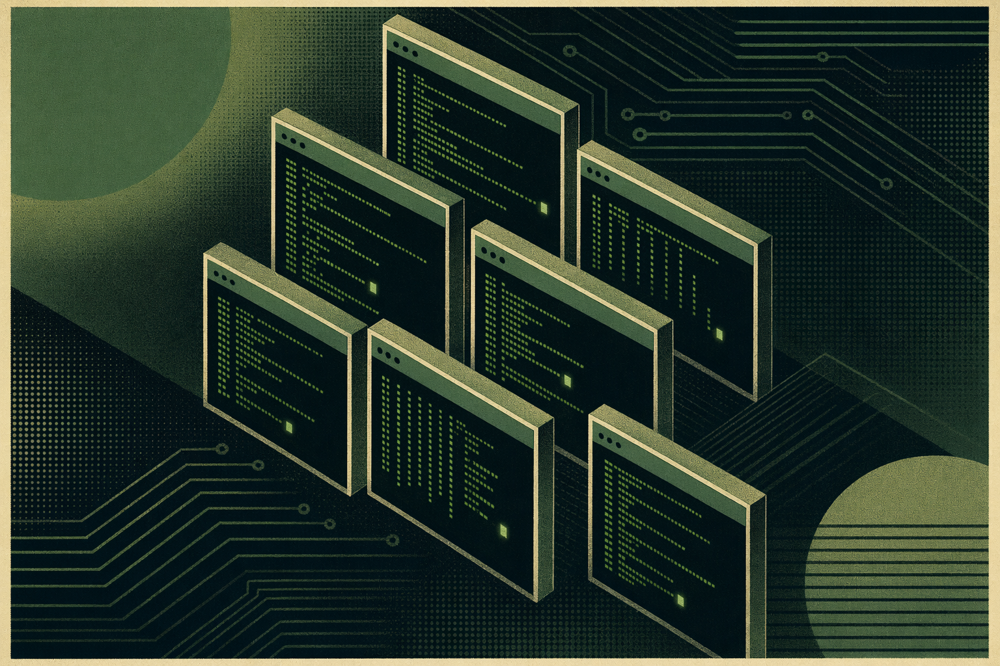
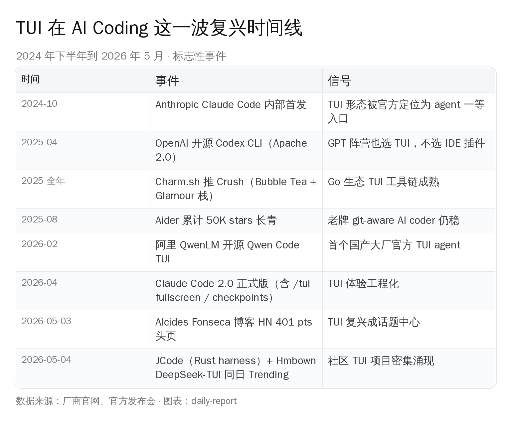
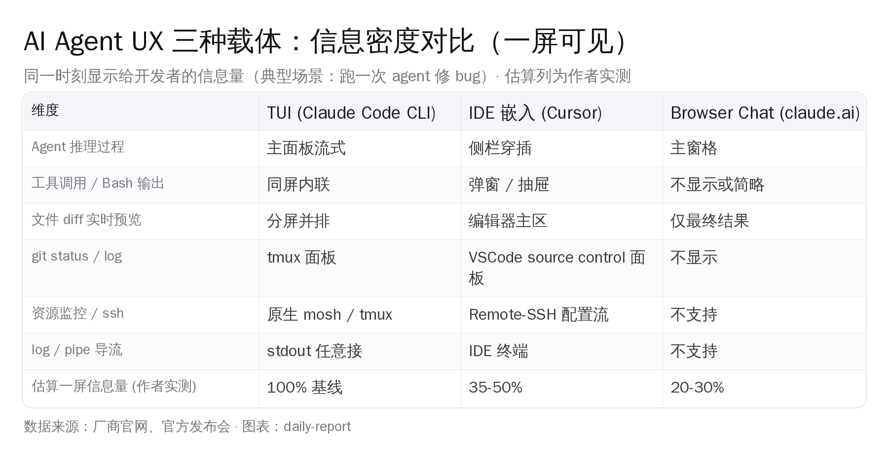
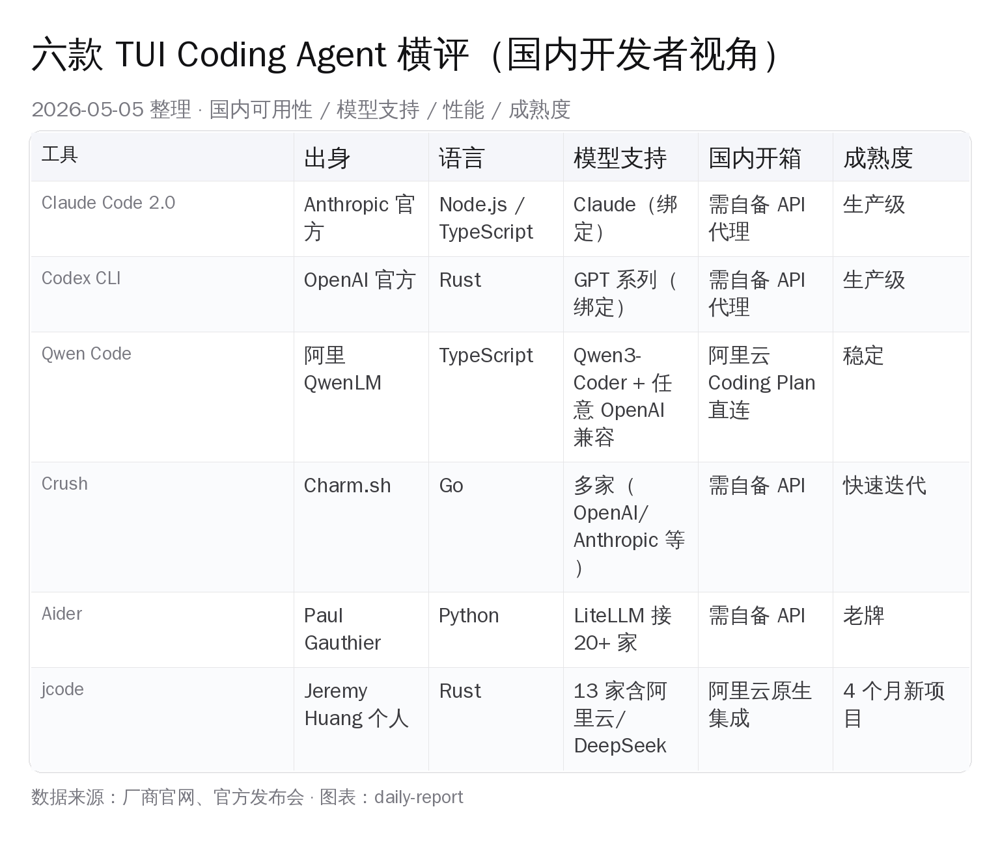
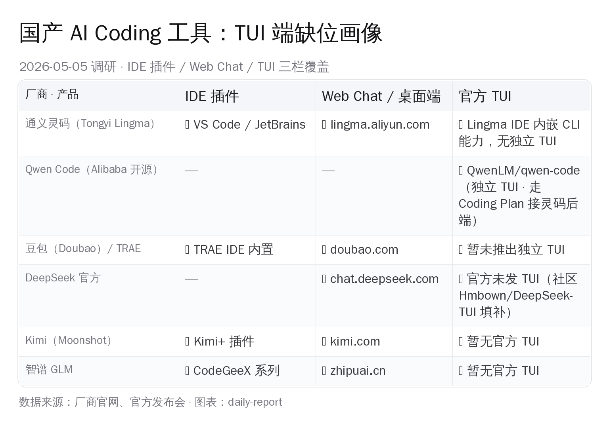

# 终端编辑器复兴：Claude Code 让 TUI 卷回来

> 葡萄牙里斯本大学计算机系研究员 Alcides Fonseca 2026-05-03 写的一篇博客「Why TUIs are back」当晚冲上 Hacker News 头页，401 分、406 条评论，连续两天挂在前十。文章核心观点很短：原生 GUI 框架在 Windows / macOS / Linux 三家集体失灵，开发者绕开混乱回到终端；而 Claude 和 Codex 在命令行做得太顺，"你专心做交互，把操作系统忘掉"——TUI 顺势成了 AI agent 时代的默认 UX 载体。第一条置顶评论直接拍板："真正原因就是 Claude Code，其他都是背景噪音。"国内开发者这半年聊 AI Coding 大多围绕 IDE 插件和 Web Chat，TUI 复兴这条线还没被系统拆开。本文把海外这场讨论拆开放进国内开发者视角：TUI 凭什么是 AI agent 的最优载体、六款 TUI agent 国内能用谁、国产厂商缺的是哪一块、未来三种 UX 形态怎么分。

## 一、HN 401 分的开场：原生 GUI 在三家系统都崩了，AI 把开发者拽回终端

Alcides Fonseca 博客原文不长，约 1500 词，结构干净。先讲「Native applications are losing」（原生应用正在败退），分别走完 Windows / Linux / macOS 三家——

- **Windows** 一路从 MFC（1992）→ OLE → COM → ActiveX → Winforms → WPF → Silverlight → WinUI → MAUI，每代都换框架，每代都没真正做成。文中引用前微软首席架构师 Jeffrey Snover 的一句话："MFC 把 Win32 用 C++ 包了一层。如果说 Win32 已经不优雅，MFC 就是 Win32 套了一身用别的礼服拼成的礼服。"
- **Linux** 的 UI 不一致是设计出来的——GTK 和 Qt 两边各自跑、各自演化，应用看起来勉强能放一起。但厂商面对 distro × DE × 硬件的组合爆炸，多数选择不做原生 Linux app，要么上 Electron，要么扔给开源社区。
- **macOS** 曾经是 Apple 的"一神教"，Human Interface Guidelines 是全世界 UI 课程的参考书。今天 Apple 自己把 Fitts 定律忽略掉、把每个菜单项加上图标、把窗口拖拽改得几乎不能用——"Apple 在拼命做最坏的版本"。

这三家走完，Fonseca 给出他的判断：**TUIs 在补 Apple 和 Microsoft 留下的空。** 原文："TUIs are filling the void left by Apple and Microsoft in the post-apocalyptic world where every application looks different. Which is good if you are doing art, but not if your goal is to get out of the way of letting the user do their job." 翻成中文是——在每个应用长得都不一样的"末日后世界"里，TUI 正在填补两家留下的真空。要是你做艺术作品（包括电脑游戏），界面长得不一样是好事；要是你要让用户专心干活，那不一样就是灾难。

至于为什么 AI 把这个趋势放大，Fonseca 写得很直白：

> "TUIs are fast, easy to automate (RIP Automator) and work reasonably well in different operating systems. You can even run them remotely without any headache-inducing X forwarding. Claude and Codex have been very successful on the command-line: you focus on the interaction and forget about the operating system around you. You can even drive code and apps on cloud machines, or remote into your GPU-powered machine from your iPad."

翻一下——TUI 跑得快、好脚本化、跨操作系统都能用，远程跑也不用折腾 X11 转发那些头疼事。Claude 和 Codex 在命令行做得很成功，开发者只看交互、把底下的操作系统忘掉。从 iPad 远程接进自家 GPU 机器、在云端机器上跑代码和应用，TUI 这条路全程顺手。

这段话被 HN 用户 rickcarlino 提交后 24 小时内涨到 401 分，最终 406 条评论，整个周末挂在前十名。HN 节奏熟悉的人都知道，401 分不是顶级爆款（顶级 800-1000 分），但 400 分以上 + 400 条评论 + 跨越两天不掉的组合，意味着这是开发者圈普遍认同、且有明确分歧值得吵的话题。

## 二、HN 顶赞拍板：「真正原因就是 Claude Code，其他都是背景噪音」

评论区第一条置顶，用户 qudat 直接给出最简单的判断——

> "The real reason TUIs are popular is claude code, everything else is background noise."

直白得不需要翻译。Claude Code 是真正把 TUI 重新拉回开发者主屏的那个东西，其他理由都是陪衬。

第二高赞 _jackdk_ 立刻反驳："新一波 TUI 项目的兴起其实早于 Claude Code 的爆发——Ratatui、Bubble Tea、Rich 这些库 2023-2024 年已经在用。Claude Code 是把火吹大，不是点火的人。"

第三高赞 saidnooneever 补充："Rust 社区从 Ratatui 出来之后特别喜欢做 TUI，现在写 TUI 比 ncurses 时代容易十倍。"另一条 lucumo 提到："新版 Windows Terminal 的 ANSI 全支持、字体渲染稳定，这一层基础设施过去三年改善很大，做跨平台 TUI 比做跨平台 GUI 容易得多。"

反对意见也强烈——

- danpalmer：「我希望 TUI 别回来。Web 界面随时可以打开、不用装奇怪字体、不用调终端配置。」
- orbital-decay：「TUI 自动化能力被夸大了。终端不能显示图片（除非用特定终端）、依赖一堆远古 cruft、可移植性也有限。」
- spankalee：「计算机界面应该越做越好，不是退回去。在终端里画 GUI-like 的东西，本质是绕弯。」

把正反两边合起来看，HN 给出的画像清晰——

1. **Claude Code 是放大器，不是发动机。** Ratatui / Bubble Tea / Charm 这些 TUI 框架基础设施从 2023 年起就在改善，Rust + Go 两边都跑出了能用的栈。Claude Code 是把这条路上的人变多了 10 倍。
2. **AI agent 跟 TUI 形态确实有亲缘关系。** 几乎没人在评论里反驳"agent 在终端里跑得很顺"这一点，反对派都在反驳"TUI 这种形态不应该被推广"。
3. **TUI 不是万能解药。** 图片显示、字体一致性、新手学习曲线都是真问题，下面会展开。

这条 TUI 复兴的判断在中文圈还没被系统讨论——大量中文 AI Coding 内容仍聚焦在 IDE 插件和 Web Chat 形态本身，关于"AI agent 为什么在终端里更顺手"这条更底层的形态判断，缺一份完整的本土视角拆解。

## 三、TUI 复兴时间线：从 2024 到 2026 这两年发生了什么

要看清楚 TUI 这一波怎么起来的，把过去 18 个月的标志性事件按时间排开就一目了然。

几个节点值得展开——

**2024-10 Claude Code 内部首发。** Anthropic 把它定位成 agent 的一等入口，不是 IDE 插件、不是网页版、不是桌面应用。这个选择当时被外界质疑过——为什么不做 Cursor 那种 IDE 形态？Anthropic 的回答（散见于团队访谈）很简单：agent 需要看 bash、看 git、看 process、看远程开发机的所有上下文，IDE 把视野锁在编辑器面板里，反而不顺手。

**2025-04 OpenAI 开源 Codex CLI（Apache 2.0）。** 这一步意味着 GPT 阵营也选 TUI，不选 IDE 插件优先。仓库到 2026-04 累计 75.6K stars、10.7K forks、709 个 release——是 Anthropic 之外最活跃的终端 coding agent。

**2025 全年 Charm.sh 持续推 Crush。** Charm 是 Bubble Tea / Glamour / Lipgloss 这套 Go TUI 全栈库的作者，他们做的 Crush 用同一套设计语言把 AI coding agent 包进 TUI，连 Mintlify 风格的文档站都搬到了 charmbracelet-crush.mintlify.app。Crush 走的是"TUI 美学优先"路线——配色、字体、动画都讲究，跟 Claude Code 走的"功能优先"形成对照。

**2026-02 阿里 QwenLM 开源 Qwen Code TUI。** 这是首个由国内大厂官方推出的 TUI agent。Qwen Code 是 Fork 自 Gemini CLI 的 TypeScript 项目，后端默认走 Qwen3-Coder 模型，也能接任意 OpenAI 兼容 endpoint。2026-04-15 阿里把 Qwen OAuth 免费档关掉，引导用户切到「阿里云 Coding Plan」付费方案——这一步把 Qwen Code 变成阿里云通义灵码大池子的"终端入口"。

**2026-04 Claude Code 2.0 正式版。** 关键升级有三件事：第一，引入 checkpoints（每次改动前自动保存代码状态、按两下 Esc 或 `/rewind` 命令秒级回滚）；第二，加了 `/tui fullscreen` 命令进无闪烁全屏；第三，原生 VS Code 扩展同步上线——Anthropic 自己也承认 IDE 是补，TUI 仍是主战场。

**2026-04-30 Moonshot 开源 Kimi Code CLI（MoonshotAI/kimi-cli）推到 1.41.0。** GitHub 8.4k 星、977 fork、94 个 release。这是国内第二家自家做完整 TUI 的头部厂商——Python 实现，后端走 Kimi K2.5（256K 上下文），支持 ACP 协议接 Zed / JetBrains，也能跟 VS Code 插件配合。阿里 Qwen Code 之后，"国产官方 TUI"这一格再添一家。

**2026-05-03 Alcides Fonseca 博客 HN 401 分头页。** TUI 复兴从「圈内人都懂」变成「话题中心」。

**2026-05-04 单日两个 Trending TUI 项目同框。** Hmbown/DeepSeek-TUI（Rust，绑 DeepSeek，5/3 当日 +389 stars，截至 5/5 累计 3947 stars）和 1jehuang/jcode（Rust，13 家 LLM 通用 harness，4 个月累计 3911 stars（实测 5/5）当日 +587）同一天进 GitHub Trending Daily 榜。这种密度在过去两年没出现过。

时间线拉开看，Fonseca 博客只是一个总结时刻——TUI 的实际复兴在更早的两年里就已经发生，现在被一篇火爆博客拍板下来。

## 四、AI 时代为什么开发者偏好 TUI：四条工程理由

跳出博客作者的"GUI 框架烂"视角，从 AI agent 工程角度看，TUI 在 2026 年是 agent UX 的最优载体。这个判断有四条具体理由。

**第一条：信息密度。** 跑一次 agent 修 bug 的过程里，开发者实际需要同屏看到的东西是——agent 的推理流（thinking + 工具调用决策）、bash 命令的实时输出、文件 diff 预览、git status 的实时变化、项目里相关测试的运行结果、有时候还要看 htop / docker stats 确认进程状态。这些东西在 TUI 里用 tmux / zellij 分窗格一屏全摆下，IDE 把它们塞进侧栏窄条折叠掉，浏览器 chat 干脆只看最终结果。一屏估算下来，TUI 信息密度大约是 IDE 的两到三倍、是 browser chat 的三到四倍。

**第二条：远程开发原生友好。** 国内开发者过去两年大量切到云开发机——阿里云 ECS、腾讯云 CVM、华为云 EulerOS、字节内部开发机、Mac 笔记本 ssh 进 GPU 机房 4090——这种工作流里，TUI 通过 ssh + tmux + mosh 全程零摩擦，断网重连不丢上下文。IDE 嵌入路线（VS Code Remote-SSH / JetBrains Gateway）需要专门配置、占用本地资源、网络抖一下连接就掉。Cursor / Trae 这种 IDE-first AI 工具，远程开发体验明显比 Claude Code 卡。

**第三条：脚本化与组合。** TUI 工具的输入输出全是文本流，可以无缝接到 shell pipeline 里。比如让 Claude Code 跑一段分析、把结果通过 stdout 喂给 Gemini CLI 做 review、再通过 jq 抽出 JSON 字段写到文件里——这种 agent-to-agent 的组合在 TUI 里是 30 行 bash 的事。换 IDE 形态做同样的事，要写 VS Code Extension API、要起 LSP server、要管浏览器消息通信，复杂度高一个数量级。

**第四条：可重定向。** 这一条是 stdin / stdout 哲学的延伸。开发者完全可以这样用——`claude -p "review this PR" < pr.diff > review.md` 一行搞定，结果直接写到文件、直接 commit、直接发 Slack。要在 IDE 或 browser chat 里完成同等操作，要么要装插件、要么要复制粘贴。

四条加起来回答了 qudat 那条 401 分置顶评论为什么站得住——Claude Code 拉火 TUI 不是因为 Anthropic 营销做得好，是因为 agent 这种工作形态本身和 TUI 的契合度比和 IDE / browser 高得多。

## 五、六款 TUI Coding Agent 横评：国内开发者视角

把当前主流的 TUI agent 摆开看，结合国内能不能直接用、模型支持、性能、成熟度四个维度做横评。

逐个展开——

**Claude Code 2.0**——Anthropic 官方旗舰，TypeScript / Node.js 实现，绑 Claude 模型。生产级稳定度、checkpoints + subagents + hooks + background tasks 全套工程化能力。对国内开发者最大的卡点是 API key——直连 Anthropic API 在国内需要自备代理或买中转。Cursor 那一档付费 Plan 接管了 API 转发问题，Claude Code 这一档需要开发者自己处理。但只要这一关过了，体验是目前所有 TUI agent 里最稳的。

**OpenAI Codex CLI**——OpenAI 官方，开源 Apache 2.0，2025-04 起开源、到 2026 累计 75.6K stars + 709 个 release，活跃度仅次于 Claude Code。绑 GPT 系列模型，能力曲线和 Claude Code 接近，2026-04 那次大更新被 Augment Code 评测为"几乎补齐了 Claude 那边领先的工作流自动化差距"。国内访问问题同 Claude Code，需要自备 API 代理。

**Qwen Code（阿里 QwenLM）**——首个国内大厂官方 TUI agent，Fork 自 Gemini CLI 的 TypeScript 项目。模型默认 Qwen3-Coder，也能接任意 OpenAI 兼容 endpoint。最大优势是国内开箱——`qwen` 命令配置阿里云 Coding Plan API key 就能跑，不需要任何代理。2026-04-15 起 Qwen OAuth 免费档关闭，引导用户去阿里云 Coding Plan 付费方案，定价比 Anthropic 那一档低不少。这是国内开发者的"开箱即用 TUI"答案。

**Crush（Charm.sh）**——Go 语言写的 TUI agent，背后是 Charm 那套被业内公认最有美学的 TUI 工具链（Bubble Tea / Glamour / Lipgloss）。功能上覆盖 OpenAI / Anthropic / 自定义 endpoint，还原生集成 LSP（看代码不是看文本，是看 AST）和 MCP（接 HTTP / stdio / SSE 任意外部工具）。位置介于"功能完备"和"美学优先"之间。国内访问需要自备 API。

**Aider**——老牌选手，2023 年就开源，Paul Gauthier 一个人主力维护，Python 实现，靠 LiteLLM 接 20+ 家厂商。最强在于「git-aware」——每次改动自动 commit、提交信息由 AI 写、可以让 AI 直接做 PR diff review。Python 解释器启动慢是它的弱点。但它在小型 PR + 单仓库快速迭代场景里仍然是好选择，社区四年积累的稳定度比 Claude Code 还高。

**jcode（1jehuang/jcode）**——本周新进入横评视野的 Rust harness。单作者 4 个月做到 3911 stars（实测 5/5）、当日 +587 进 Trending Top 8。卖点是性能（自报启动 14 ms vs Claude Code 3437 ms、单会话内存节省 56.7%）和模型覆盖度（13 家 LLM 含阿里云 / DeepSeek / Ollama）。生产关键场景慎用——4 个月项目 + 单作者维护，70 个 open issues 还在累积。但作为"备用 harness"和"想跑 Ollama 离线本地模型"的入口，值得装上。

把六款分一下定位——

- **生产稳定档**：Claude Code 2.0 / Codex CLI / Aider（社区四年）
- **国内开箱档**：Qwen Code（阿里云 Coding Plan 直连）
- **美学体验档**：Crush（Charm 风格，配色细腻）
- **新锐试验档**：jcode（性能 + 跨厂商，4 个月新项目）

国内开发者普遍可行的组合是——日常生产用 Claude Code（API 配代理）+ 国内云开发机用 Qwen Code（阿里云直连）+ 离线/本地模型用 jcode（跑 Ollama）。三个 TUI 一组，覆盖三种场景。

## 六、国产 AI Coding 工具：TUI 端缺位画像

横评里的 Qwen Code 之外，Moonshot 在 2026-04-30 把 Kimi Code CLI（MoonshotAI/kimi-cli）推到 1.41.0，目前 GitHub 8.4k 星，是国内第二家自家做完整 TUI 的厂商。把国内主流厂商在 IDE 插件、Web Chat、官方 TUI 三栏的覆盖摆开看，就能看清一个仍然明显但正在被两家头部厂商先后填上的格局。

逐家看——

- **通义灵码（Tongyi Lingma）**：阿里官方 IDE 插件 + Lingma IDE 桌面端 + Web 端齐全，独立 TUI 没出。但和 Qwen Code 共用同一套阿里云 Coding Plan 后端，所以"国产 TUI"这一格被 QwenLM 团队的 Qwen Code 间接补上。这是阿里云目前在国内厂商里覆盖最完整的一档。
- **豆包（Doubao）/ TRAE**：字节自家 IDE 形态走 TRAE 路线，2026-02 发布了豆包大模型 2.0 系列含编程优化的 Code 模型，深度集成 TRAE。但 TUI 端字节没出。考虑到豆包高峰期算力降级一事最近在国内被讨论，字节短期内大概率仍把资源压在 IDE 形态上。
- **DeepSeek**：官方走 Web Chat（chat.deepseek.com）+ API 双线，IDE 插件和 TUI 都没自家做。社区 Hmbown/DeepSeek-TUI（Rust 单 binary 绑 DeepSeek V4）这周在 Trending 上的火爆，本质是用户在替 DeepSeek 补它没做的那一块。
- **Kimi（Moonshot）**：Kimi+ 浏览器插件 + Web Chat 之外，官方 TUI 已经做出来了——MoonshotAI/kimi-cli（Kimi Code CLI），Python 写的终端 agent，2026-04-30 推 1.41.0，GitHub 8.4k 星。能读改文件、跑 shell、抓网页、规划多步任务，支持 ACP 协议接 Zed / JetBrains，也能跟 VS Code 插件配合。后端走 Kimi K2.5（256K 上下文 / 100 tok/s），API 定价 0.60/2.50 美金每 MTok（输入/输出），含 75% 缓存折扣，比 Claude Sonnet 4.6 便宜 5-6 倍。这是阿里 Qwen Code 之外，国内第二家自家做完整 TUI 的头部厂商。上面那张缺位画像里 Kimi 那一格其实在 4 月底已经被补齐。
- **智谱 GLM**：CodeGeeX 是它的 IDE 插件线，自家没出 TUI。

总体画像是——国产厂商把 IDE 插件做完了、把 Web Chat 做完了，官方 TUI 这一格此前长期缺位。阿里 Qwen Code 是 2026-02 第一个补上的，Moonshot Kimi Code CLI 是 2026-04-30 推到 1.41 之后第二个补上的，剩下字节、DeepSeek、智谱仍然没出官方 TUI。两家头部厂商陆续做完之后，这格"缺位"已经不像两个月前那么彻底，但也远没到饱和。

留下来的空白对国内生态意味着两件事——

**一是社区项目能填一阵。** Hmbown/DeepSeek-TUI、jcode（接 13 家含阿里云/DeepSeek）、还有 Qwen Code 的各种 fork，社区在用 Rust / TypeScript 自己造。短期内开发者可用，长期看缺一个由厂商撑起的稳定层。

**二是大厂如果想补 TUI 入口，2026 下半年到 2027 上半年是窗口。** 字节、智谱、DeepSeek 任何一家在这一年里推出官方 TUI（哪怕 Fork 一个 Codex CLI 改皮），都能拿到一波"国产 TUI"叙事红利。豆包大模型 2.0 系列已经把 Code 模型分出来，做 TUI 的工程门槛不高——开 OpenAI 兼容 API + Bubble Tea / Ratatui 做壳，2-3 人小团队 1-2 个月能出第一版。Moonshot 已经用 Kimi Code CLI 趟完这条路，剩下三家可参考的样板就在眼前。

## 七、TUI vs IDE vs Browser Chat：三种 Agent UX 形态的未来格局

很多人会问一个直觉问题——TUI 复兴是不是意味着 IDE 和 Browser Chat 要被淘汰？答案是否定的。三种形态在未来 3-5 年是分工，不是替代。

**TUI 的边界**——专业开发者、远程开发、agent-heavy 工作流（一天里 agent 跑超过 4 小时）的最优载体。但学习曲线挡住了很多人，HN 评论里 spankalee 的反问很合理："为什么我们要在终端里画 GUI 形态？"对 99% 不写代码的人，TUI 是反直觉的。

**IDE 的边界**——视觉化重的开发场景（前端 UI 调试、Jupyter 数据科学、游戏引擎、移动端实机调试）仍然是 IDE 主场。Cursor、Trae、JetBrains AI Assistant 这一档不会消失，会在"agent 是助手不是主角"的场景里继续长。

**Browser Chat 的边界**——一次性问答、知识查询、给非开发者用的 agent 入口（产品经理写 SQL、运营改文案、销售查竞品资料），browser chat 仍然是最低门槛的形态。claude.ai、chatgpt.com、deepseek 网页这一档，长期占着普通用户。

把 AI agent 工作流画成一条光谱——

- 一端：「人写一行代码、agent 帮一行」（Cursor / Trae 模型，IDE 主场）
- 中间：「人提需求、agent 自己跑 30 分钟出结果」（Claude Code / Codex CLI 模型，TUI 主场）
- 另一端：「人问一个问题、agent 给一个答案」（claude.ai / chatgpt 模型，browser 主场）

中间这一段——长任务 agent、远程开发、并行多 session——是过去两年增长最快的一段，也是 TUI 之所以复兴的根本动力。Fonseca 博客的判断本质上是这一段在 2024-2026 这两年从「小众」长成「主战场」之一。

## 八、风险和反对声音：不是所有人都欢迎 TUI 回来

下半场必须把反对方的观点也摆出来——

**学习曲线问题。** vim / tmux / zellij / fzf / ripgrep 这一套老 TUI 工具链对没接触过的开发者门槛不低。HN 评论 _jackdk_ 提到："vim 唯一难的部分是 Escape 键的位置——HHKB 把 Esc 放在 Tab 位置才让 vim 顺手，标准 Apple 键盘上 Esc 太远。"Claude Code / Codex CLI 这种新 TUI 学习曲线远低于 vim，但对刚从 Cursor 切过来的开发者，要重新建立 tmux 分屏、zellij 布局、shell pipeline 的肌肉记忆，仍然是一周左右的成本。

**字体和图片限制。** 终端不能直接显示图片（除非用 kitty / WezTerm / iTerm2 等支持 inline image protocol 的特定终端）、字体一致性靠开发者自己装 Nerd Font / 等宽中英文混排字体。HN 评论 spankalee 的"在终端里画 GUI 形态"质疑有道理——很多 TUI 工具其实在用 ANSI 转义码模拟 GUI 控件，不如直接用 GUI。

**可访问性。** 屏幕阅读器对 TUI 应用的支持远不如 Web 应用。视觉障碍开发者用 TUI 工具的体验比用 VS Code 差。HN 上一篇相关讨论「The text mode lie: why modern TUIs are a nightmare for accessibility」（48002938）也是同期热文。

**远程图形渲染。** 终端跑 matplotlib 看图、看 Jupyter 里的 Pandas DataFrame、看前端跑出来的 UI——这些都得靠"导出到文件 + 切到 GUI 看"的笨办法。这一类工作流 IDE 仍然有优势。

把这些限制都摆出来，结论不是"TUI 不该火"，而是"TUI 适合谁、不适合谁要分清楚"。

## 九、写给国内开发者：今天能动手的三件事

最后落到可执行——

**第一，装上 Claude Code 2.0 + Qwen Code 试两周。** Claude Code 海外能力上限最高，Qwen Code 国内开箱免代理。两个一起跑，一周内就能判断 TUI 形态适不适合自己的工作节奏。安装一行命令——Claude Code 走 `npm i -g @anthropic-ai/claude-code`，Qwen Code 走 `npm i -g @qwen-code/qwen-code`。

**第二，把 tmux / zellij 这一层装好。** TUI 形态的真正价值在多窗格分屏——一个窗格跑 agent、一个窗格看 git log、一个窗格跑测试、一个窗格 ssh 远程开发机。zellij 比 tmux 配置更友好，新手 30 分钟能上手。配上 fzf（模糊查找）、ripgrep（代码搜索）、bat（cat 增强）、bottom（htop 增强）这一套，整个开发环境一屏内信息密度比 IDE 高 2 倍。

**第三，关注国产 TUI 后续动向。** Moonshot 的 Kimi Code CLI 已经做出来了，下一步看字节、智谱、DeepSeek 谁先跟进——如果在 2026 下半年推出官方 TUI，都值得第一时间装上跑，不是因为它们一定比 Claude Code 强，而是因为国产 TUI 配上国产模型的组合，对国内开发者意味着完全可控的工具链（API key 不用代理、数据不出境、计费走人民币）。Kimi Code CLI 自身也值得放进试用清单，Kimi K2.5 后端 + ACP 协议接 IDE 是国内目前最完整的官方 TUI 方案之一。

终端编辑器复兴这件事，本质是 AI agent 工作形态把 1990 年代被 GUI 取代的那种"以文本流为中心"的工作方式，在新的语境下重新激活。Claude Code、Codex CLI、Qwen Code、Crush、Aider、jcode 这一波 TUI 工具不是在怀旧，是在补上 IDE 和 Browser Chat 之间那一段长任务 agent 最需要的形态。

> 海外开发者已经在这条路上跑了一年半，国内开发者现在装上工具开始跑还来得及。Alcides Fonseca 博客 HN 401 分热度过去之后，下一个可被预期的节点是——某家国内大厂在 2026 下半年推出官方 TUI agent。等到那一天再切换工具的人，会比现在就开始练 tmux + Claude Code 的同行慢半年。
