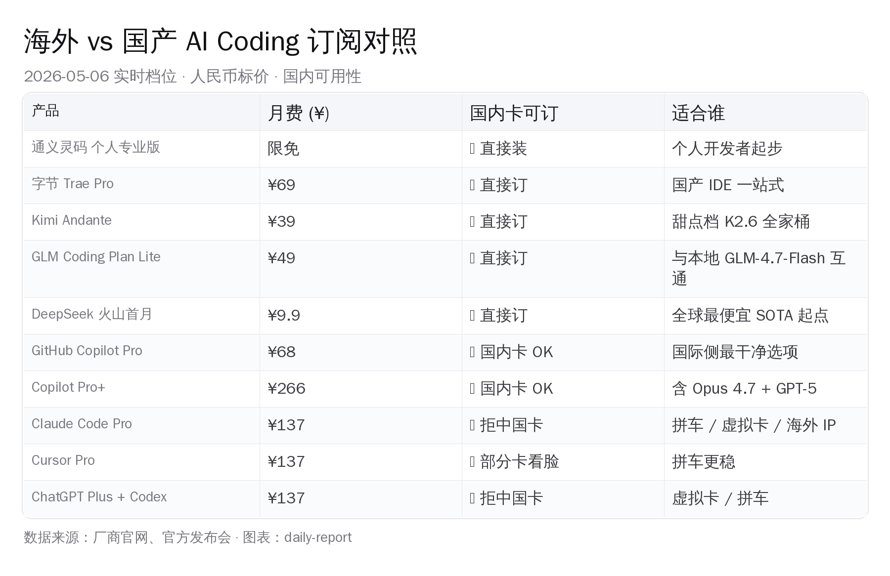

# 通义灵码、Kimi、Claude Code 拼车，还是 1 万本地：2026-05 国内 AI 编程账单怎么算

> **本文核心论断**：2026 年 5 月这个时点，国内开发者用 AI 写代码已经有三条平行可走的路——零成本起步（通义灵码限免 + Kimi 本地）、月付 ¥40-200 续命（Kimi Andante / GLM Lite / Copilot Pro）、1 万元本地自建（5060 Ti 16G / Mac mini M4 24G / 3080 20G 魔改）。"必须海外订阅才能写好代码"这条硬约束已经彻底拆掉，剩下的是怎么按场景选组合。本文把每条路的真实账单 + 真人体验摊开。

## 先把账单亮在桌面上

国内一名独立开发者从早上九点开机到晚上七点收工，AI 写代码这件事可以花 0 元，也可以花 1366 元。

0 元做法直接：通义灵码个人专业版限免、Kimi K2.6 开源模型放 LM Studio 跑本地补全、DeepSeek-V3.2-Lite 火山方舟首月 ¥9.9 处理长上下文检索。一整月真实掏钱可能就十几块 API 费。

1366 元做法是另一头：Cursor Ultra 月费 $200（折 ¥1366）当主 IDE、Claude Code Max 20x 拼车 ¥398 / 月做 agent 重活、Copilot Pro+ $39（折 ¥266）兜底 GitHub 提交、GLM Coding Plan Max ¥469 用 GLM-4.6 处理国产侧封闭项目。账面合计 ¥2499。

这两个极端中间，是 2026 年 5 月这一周国内开发者群里反复传阅的一张表。本周一（5/4）我们在《海外 5 家 vs 国产 5 家：AI Coding 选档与组合实操》里拆过订阅档，今天这篇把视角推进两步——加进 5 月新出的拼车与中转风险，以及 1 万元本地部署的三套替代方案。所有数字均为 2026-05-06 当日核对，人民币标价，每条带可验证来源。

## 二、国产订阅：从 0 元到 ¥469，每个档位都有人在用

> **国产订阅档位卷起来，¥0-79 区间已经能覆盖 90% 个人开发场景。**

先看国产侧。2026 上半年最大的变化不是出了多少新工具，而是定价从"按次数"全行业切到"按 Token"，免费午餐基本结束，但同时又冒出来几个真把价格压到地板的新玩家。

### 通义灵码（阿里）：限免的中流砥柱

阿里把灵码彻底升级到 Qoder IDE 形态后，定价反而更"传统国产"。个人基础版 ¥0、个人专业版限时免费（标价 ¥59 / 月）、企业标准版 ¥79 / 人 / 月（10 人起）、企业专属版 ¥159 / 人 / 月。模型层默认接 Qwen3-Coder + Qwen3-Max，原生 256K 上下文、可扩展到 1M。截至 5 月 6 日，个人专业版仍然是限免——这意味着如果你是个人开发者，今天直接装 Qoder IDE，零成本拿到 Qwen3-Coder 的全部能力。

但要注意，5 月初阿里把原来的 ¥40 Lite "Coding Plan" 直接下架了，最低档拔到 ¥200 / 月 Pro。也就是说，如果你想用通义灵码独立的"Coding Plan"配额包（IDE 内不限速 + 大量 agent 调用），起步价不再是 ¥40，是 ¥200。免费档够用就免费档，需要重活就直接奔 ¥200。

通义灵码的真实底气在于规模。VS Code + JetBrains 插件累计下载量 1500 万 +，官方称已生成超过 30 亿行代码。它不是某个明星产品的玩具，是大厂内部超大规模实战出来的工具。

### 字节 Trae：月活 160 万，国产 AI IDE 第一

字节 Trae 在 2026-02 把按次计费换成按 Token 五档：Free $0、Lite $3（约 ¥21）、Pro $10（约 ¥69）、Pro+ $30（约 ¥208）、Ultra $100（约 ¥692）。年付 9 折。模型默认接豆包 Doubao-Seed-2.0-Code，但 Pro 起可以全家桶切到 Kimi K2.6、GLM-5.1、DeepSeek-V3.2。

Trae 的位置很特别。2025 年 12 月官宣全球累计 600 万用户、月活 160 万，是目前国产 AI IDE 月活第一；字节内部 92% 工程师在用。2025-04 marscode.cn 域名直接跳转 Trae，原来的豆包 MarsCode 让位给 Trae 主品牌。3-31 字节又推了 SOLO 独立客户端，从 VS Code 插件路线走向自研 IDE 路线。

如果你之前在用豆包 MarsCode，今天该把入口换成 Trae 了。如果你想找一个国产 AI IDE 一站式覆盖编辑器、补全、agent、CLI，Trae Pro 月付 ¥69 是一个相当干净的起点。

### Kimi Code（月之暗面）：性价比黑马

月之暗面 4-20 把 Kimi K2.6 开源（1T MoE / 32B 激活 / INT4 量化 / 256K context），在 SWE-Bench Pro 这条更难的赛道上拿了 58.6 分。SWE-Bench Pro 是 2026 年新出的编程基准，难度高于 SWE-Bench Verified，全行业分数普遍下降，58.6 在开源 K2.6 这条线上是历史最高。Kimi K2.6 两天之内冲上 OpenRouter 趋势榜第一。

订阅档位（年付省两个月）：

- **Starter ¥29**：尝鲜档，K2.6 基础调用 + 较小 token 池
- **Andante ¥39**：甜点档，K2.6 全家桶 + Kimi Code IDE，个人开发者闭眼推
- **Moderato ¥79**：含 PPT / Agent 套件，跨办公 + 编程场景
- **Vivace ¥99**：中度密集使用，token 池更厚
- **Forte ¥199**：重度 agent + 长上下文重活

Andante 这一档 ¥39 / 月对应的是 Kimi K2.6 + Kimi Code IDE + 一定 token 池，是当前国产订阅里"价格 / 能力曲线"最甜的点。

如果你今年 5 月只想试一个国产付费订阅，Andante ¥39 是闭着眼推的那个。

### 智谱 GLM Coding Plan：4.7-Flash 的本地兜底逻辑

智谱 2026-02 把 GLM Coding Plan 涨了 30%（季付 9 折，年付 7 折）：

- **Lite ¥49 / 月**：从原 ¥40 涨上来，配额从 120 次 / 5h 砍到 80 次（个人轻度）
- **Pro ¥149 / 月**：400 次 / 5h，编程任务密集
- **Max ¥469 / 月**：1600 次 / 5h，agent 重活 + 多项目并行

涨价归涨价，GLM 真正值得讲的是另一条线：1 月开源的 GLM-4.7-Flash（30B 总 / 3B 激活）SWE-Bench Verified 拿到 59.2%，4-bit 量化只要 17GB 显存。这意味着付 ¥49 / 月用云端 GLM 服务、和买台 5060 Ti 16G 显卡本地跑 GLM-4.7-Flash，是同一家厂商提供的两条互通路径。后文 1 万本地章节会展开。

### 百度文心快码、腾讯 CodeBuddy：可选项

文心快码（Comate）个人专业版 ¥100 / 月，连续包月可降到 ¥59，年付 ¥669（折 4.4 折）。社区评价是"功能有亮点价格不美丽"——同档位 Kimi ¥39、GLM ¥49、阶跃 ¥25 都比它便宜。

腾讯 CodeBuddy 从 2025-09-15 结束完全免费，个人专业版 $9.95 / 月（折 ¥72），年付 $119.4（约 ¥864，相当于 5 折）。模型混合接 Hunyuan-Code + Claude Sonnet 4.6，2026-04 把 IDE / 插件 / CLI / WorkBuddy 凑齐做"AI 开发 + 协同办公"。如果你已经在用企业微信 + 腾讯文档，CodeBuddy 是顺路。

### 阶跃 Step Plan、DeepSeek API：低价试水的两个口子

阶跃星辰 2-2 开源 Step-3.5-Flash（196B MoE / 11B 激活），SWE-Bench Verified 74.4 / LiveCodeBench 86.4，海外 Plus 9.99 美元、国内 Flash Mini ¥25 起，全档统一高速、不分快慢车道。

DeepSeek 没有自家 IDE 订阅，但通过火山方舟的 Coding Plan 进了所有主流 AI IDE。首月 ¥9.9（DeepSeek-V3.2-Lite），按量 API 输入 ¥2 / 1M、输出 ¥3 / 1M，相比 V3 把输出价砍了 75%。如果你只是想拿"准 Claude 体验"做日常补全，¥9.9 这个起点几乎是 2026 上半年全球最低。

### 国产订阅一句话决策

| 你是谁 | 直接用 |
|---|---|
| 不想花钱 | 通义灵码个人专业版（限免）+ DeepSeek 火山首月 ¥9.9 |
| 一个月只能花 ¥39 | Kimi Andante ¥39，K2.6 全家桶 |
| 想要国产 IDE 一站式 | Trae Pro $10 / 月（约 ¥69） |
| 编程任务密集、要 agent 重活 | GLM Coding Plan Pro ¥149 或 Max ¥469 |
| 喜欢腾讯生态 | CodeBuddy 年付 5 折约 ¥864 / 年 |

## 三、国际订阅：好用、贵、不好买

> **好用归好用，国内卡只接 Copilot；其余产品都得过支付门槛。**

国际侧 2026 上半年的故事是定价反复横跳。先把海外与国产订阅放在同一张表里看：

### Claude Code：4 月差点把 Pro 档撤掉

Anthropic 在 4 月 21 日把 Claude Code 短暂从 $20 Pro 档移除，要求用户至少升 Max5x 才能继续用。社区压力下 24 小时回滚，目前 claude.com/pricing 的 Pro 列里 Claude Code 复选框已恢复——这是过去一个月最该被国内同行注意的"价格策略风险信号"。

Claude Code 当前定价：Pro $20 / 月（折 ¥137，年付 $200 折 $17 / 月、¥116 / 月）、Max5x $100 / 月（约 ¥683）、Max20x $200 / 月（约 ¥1366）。Pro 默认接 Sonnet 4.6 + Opus 4.6，Code 内可手动切到 Opus 4.7；Max 全档默认带 Opus 4.7。

关键点：Claude Code 不接受任何中国大陆发行的银行卡和支付宝，Apple ID 中国区不能购买，IP 必须海外。这是国内开发者要提前规划的支付门槛。

### Cursor、Copilot、Codex：直连可用，支付看脸

Cursor 当前档位：

- **Free $0**：基础补全 + 少量 premium 请求
- **Pro $20**：标配档，国内信用卡 / 银联历史能扣，当前主要靠拼车 + 部分卡看脸
- **Pro+ $60**：2026 新加中间档，3x Pro 用量，对标 Copilot Pro+
- **Ultra $200**：20x Pro 用量 + 优先体验新功能
- **Teams $40 / 座**：团队档

Cursor 国内可以直连，但单卡能不能扣下来基本看脸。

GitHub Copilot 是国际侧国内访问最干净的一档：

- **Free**：50 premium 请求 / 月
- **Pro $10（折 ¥68）/ 月**：国内唯一无障碍订阅的国际 AI 编程付费产品
- **Pro+ $39（折 ¥266）/ 月**：1500 premium 请求 / 月，可用 Claude Opus 4.7 / GPT-5 / Gemini 3.1 Pro 全部顶级模型
- **Business $19 / 座**、**Enterprise $39 / 座**

GitHub 国内访问稳定、Marketplace 接国内卡也稳定，Pro+ 是 ¥266 这个价位密集使用最实在的一档。

OpenAI 这边 4 月 9 日加了一档新中间价位：

- **ChatGPT Plus $20**：月 5 小时窗口
- **ChatGPT Pro $100（折 ¥683）**：5x Plus 用量，含 Codex CLI + Cloud（4-9 新加）
- **ChatGPT Pro $200**：20x Plus 用量

问题和 Claude 一样：中国大陆卡完全不收，必须虚拟卡或拼车。

### Windsurf、JetBrains AI、Tabnine、Continue、Aider

5 家剩余玩家的位置一句话各自说清：

- **Windsurf**：已被 Devin 母公司 Cognition 收购，定价 Free / Pro $20 / Max $200 / Teams $40。SWE-1.5 是默认快速 agent 模型
- **JetBrains AI**：改成 credit 制（补全完全免费、chat / 生成 / agent 才扣 credit）。Free 3 credit / 月、Pro 个人 $10（10 credit，折 ¥68 性价比黑马）、Pro 组织 $20 / 座、Ultimate $30（35 credit）、All Products Pack $979 / 年（约 ¥558 / 月，含 AI Pro）。已在用 IntelliJ / PyCharm 必装
- **Tabnine**：重押企业 + Agentic 路线，Code Assistant $39 / 座（约 ¥266）、Agentic Platform $59 / 座（约 ¥403），个人开发者性价比已被 Copilot 拉开
- **Continue.dev**：走"自带 key"路线，Starter 免费 + 按 $3 / 1M token 付费，Team $20 / 座 / 月。想接 DeepSeek / 智谱 / Kimi 自家 API，Continue 是 IDE 侧最干净的胶水
- **Aider**：永远免费，自己掏 API key。"Aider + DeepSeek-V3.2-Lite 缓存命中 ¥0.2 / 1M"是 2026-05 全球能拿到的最便宜 SOTA 编程组合

### 国际订阅一句话决策

| 你是谁 | 直接用 |
|---|---|
| 国内卡 + 不想折腾 | Copilot Pro $10 / 月（折 ¥68），覆盖 GPT-5 mini 无限 + 300 premium |
| 国内卡 + 重度密集 | Copilot Pro+ $39 / 月（折 ¥266），1500 premium 含 Opus 4.7 |
| 接受拼车 / 虚拟卡 | Claude Code Pro $20 拼或自购，年付 $17 / 月（¥116） |
| 写真实大项目、Cursor 重度 | Cursor Pro $20 单卡，或 Pro+ $60 |
| 重度 agent、不在乎钱 | Cursor Ultra $200 + Claude Code Max20x $200，账面 ¥2700 / 月 |

## 四、拼车与中转：省钱的非官方途径

> **省钱可行但不稳定，3 月封号潮验证：拼车适合学习场景，不适合生产。**

国内开发者用 Claude Code、Cursor Ultra、ChatGPT 这件事，常会用到两条非官方途径——拼车和中转。

### 拼车真实价位

主流车种 / 价位的现行行情：

- **Claude Code Max 20x**：6 人车均价 ¥358-398 / 月 / 人、4 人车 ¥400-500、3 人车 ¥500-600
- **Cursor Pro 3 人共享**：均价 ¥39-50 / 月 / 人（年付折算）
- **Cursor Ultra $200 闲鱼散单**：¥80-200，但绝大多数是黑卡，社区共识"周一刚下单周三就掉线"

拼车的真实风险不在贵，而在不稳定。V2EX 用户 jarryli 公开记录："4 个月内注册 5 个 Claude 账号全被封，最快不足 1 个月被禁。"3 月一波封号潮 90% 中转账号被波及，部分中转站直接停服关闭。

社区总结的"保活策略"是固定日本 / 新加坡 IP、避免 Web 版和 CLI 版同时使用、礼品卡比手机验证码安全、绝不绑主邮箱。即使全部做对，"4 个月封 5 次"仍然是常态——所以拼车主要适合个人学习场景，对生产线开发收益不抵风险。

### 中转 API：聚合站价格表

主流中转聚合站 aihubmix / CloseAI / api2d / poloapi 当前给到的价格：

- Claude Sonnet 4.6 输入 ¥0.45 / 1M、输出 ¥2.25 / 1M（官方价 30%）
- Claude Opus 4.6 输入 ¥2-6 / 1M、输出 ¥10-30 / 1M
- GPT-5.5 输入 ¥3-5 / 1M、输出 ¥18-25 / 1M（官方价 70-90%）

便宜归便宜，但 key 来源透明度差，部分批量黑号生命周期 < 1 个月，429 高发。社区帖反复出现的具体坑：max_tokens=8192 会预扣全额度、共享 key 高峰期 429 错误率飙到 60%、核心机密代码绝不要走第三方中转——key 池后端可被植入数据截留。

### OpenRouter、SiliconFlow、智谱：合规且能过备案的口子

OpenRouter 是直连官方聚合，pass-through 价格与官方同价，Claude Sonnet 4.6 $3 / $15 per 1M。问题在于国内无加速节点，P50 首 token 1500-3000ms；不支持人民币，必须 Visa / USDC 加梯子。

国产聚合 SiliconFlow（硅基流动）走的是"只托管开源 / 国产模型"路线，DeepSeek-V3.2 $1.74 / $3.48 per 1M、Kimi-K2.6 $0.95 / $4.0、GLM-5.1 $1.4 / $4.4、GLM-4.7 $0.42 / $2.2。缓存可降至 10-20%。

智谱开放平台（bigmodel.cn）GLM-4.6 ¥5 / 1M 统一计费，国内备案合规、发票齐全。

合规这条线值得单独说一句。《生成式人工智能服务管理暂行办法》对"提供者"有备案要求，但**个人开发者接入境外 API 用于自身工具开发**目前不在主要监管口径内。企业生产环境如果把客户数据、源代码传给非备案境外模型，技术上需要走出境合同备案。这是判断"个人省钱拼车 vs 企业必须用国产备案模型"的清晰分界线。

### 一句话总结

- 个人学习 / 个人项目：拼车 + 中转聚合性价比最高，但准备 Plan B
- 商业产品 / 涉客户数据：选 DeepSeek / 智谱 / 通义 / Kimi 国产备案模型，企业付款 + 发票 + 数据不出境
- 体验型试用：DeepSeek-V3.2-Lite 缓存命中 ¥0.2 / 1M 是 2026-05 全球最便宜可用编程模型，零门槛起步

## 五、1 万元能不能在家自己跑：硬件四档亮出

> **1 万元预算覆盖四档全新质保到二手矿改，每档都有真实手感数据。**

把订阅说完，回到本文的另一个核心：1 万元预算在家自己跑大模型，今天能跑出什么。

### 全新质保档：RTX 5060 Ti 16GB ¥3599

NVIDIA 的甜品新卡，京东自营 5 月 6 日最低 ¥3599（微星 5060 Ti 16G 万图师）。16GB GDDR7、448 GB/s 显存带宽、180W TDP、Blackwell 架构。CUDA、Flash Attention、vLLM 全栈兼容，质保 3 年。

这张卡的位置是"从全新零售里选最便宜能跑 14B Q4 / 30B-A3B MoE 的卡"。带宽 448 比 4060 Ti 16G 的 288 高 56%，跑模型快 30%-40%，价差只有几百块。结论：5060 Ti 把 4060 Ti 16G 的位置完全替换掉了。

整机配下来（CPU + 主板 + 32GB 内存 + 850W 电源 + SSD + 机箱）大约再加 ¥4000-4500，整套 ¥7600-8100。

### 矿改档：RTX 3080 20GB 魔改 ¥3000-3500

闲鱼 / 淘宝主流价位 ¥2900-3500，三风扇散热版本居多。20GB GDDR6X（焊点改双面 10 颗）、显存带宽实测 ≈ 760 GB/s（部分版本掉 5%-10%）、320W TDP（电源 ≥ 750W）。

这张卡的位置是"性价比之王 + 二手风险之王"。掘金博主实测 3080 20G 跑 Qwen3 14B Q4_K_M 拿到 56.64 tok/s，3090 是 67.62 tok/s，性能达到 3090 的 83%——而价格只要 3090 二手价的一半甚至三分之一。

代价是售后政策——小品牌出货为主，第一年免费、第二年起换件收费、第三年起加收人工费。100% 矿卡核心 + 三方魔改 PCB + 焊点显存。挑卡需要做的是：找有 90 天质保的店铺、看实拍跑分视频、问清 BIOS 是否魔改完成。

值得提一个反例：mornai 实测 3080 20G 跑 30B AWQ vLLM 大约只有 1 tok / s，写一行代码要等十几秒，没人会忍。20GB 这个容量不能直接等于"30B 流畅"——量化方式 + 推理框架的影响压倒显存数字。

### 二手旗舰档：RTX 3090 24GB ¥4500-7000

成色和品牌差异大。原厂 9 新带原票 ¥6500-7000、普通二手 ¥4500-5500、矿卡 ¥3500-4500。24GB GDDR6X、936 GB/s 显存带宽、350W TDP。

这张卡的位置是"最经典的 24GB 入场券"。跑 Qwen3 14B Q4 单卡 50-65 tok/s、Qwen3-Coder 30B-A3B Q4 25-35 tok/s、70B Q4 配 CPU offload 跌至 3-5 tok/s 但能跑通。社区认为这是 24GB 显存档位的"原厂质感"选项，比 3080 20G 魔改卡可靠性高一个台阶。

风险是矿卡概率约 40%。挑卡的硬动作：要原票、问序列号查保、要烤机视频、避开"显存 90+ 度"的卡。

### 静音常开档：Mac mini M4 24GB ¥6374（国补 -15%）

苹果中国官网 2026-05 涨价后入门 16G/512G ¥5999，24G/512G 标准价 ¥7499、京东国补 -15% 降到 ¥6374.2、北上广叠加教育优惠最低可以打到 ¥4500-4800 区间。统一内存带宽 120 GB/s、整机闲置 4-7W、满载 65W、Metal 生态原生。

这台机器的位置是"完全静音 + 可常开当家庭推理服务器"。Qwen3 14B Q4 跑出 12-18 tok/s 稳定不抖、Qwen3-Coder 30B-A3B（MoE）Q4 16GB 占用、44 tok/s（feasibility-study 仓库实测）。但 32B 密集模型在 24GB 上会触发 swap 雪崩——DeepSeek-R1-Distill-32B Q4 跑出 0.28 tok/s，是 SSD 在替显存干活，不是模型慢。

如果要无痛跑 32B+，往上一档是 Mac mini M4 Pro 24GB ¥10999（国补后 ¥9349，教育 + 国补地区可压到 ¥8174）。带宽 273 GB/s 是 M4 的 2.27 倍，14B Q4 跑到 30-40 tok/s。但 24GB 仍然装不下 32B Q4，要 48GB 整机 ¥12999 起步、破 1 万。

### 国产 GPU：体验向，不是主力

摩尔线程 MTT S80 16GB 京东 ¥1399-1499，16GB GDDR6 / 448 GB/s / 250W。MUSA SDK 不兼容 CUDA，PyTorch 需用 Torch-MUSA 分支，常见 HuggingFace 模型需自转格式。摩尔线程官方有跑通 DeepSeek-R1-Distill-Qwen-14B Q4_K_M 的指南，实测 8-12 tok/s。生态完成度按"能跑级别"打分。

华为昇腾 Atlas 300I Duo 96GB 京东自营限时 ¥13300，96GB LPDDR4X / 408 GB/s / 280 TOPS INT8 / 150W 被动散热。问题是个人 PC 改装难度极高——需自己焊涡轮风扇、改电源接口、Ubuntu 20.04 + 5.4 内核、CANN ToolKit 编译模型。1 万内基本吃不到，且自组难度直追矿机，不推荐普通开发者。

国产 GPU 是值得鼓励的方向，但 2026-05 这个时点，1 万预算的主流仍然在 5060 Ti / 3080 20G 魔改 / 3090 / Mac mini M4 这四档之间。

## 六、跑得动什么模型：2026-05 本地编程模型 SOTA

> **16GB 卡选 GLM-4.7-Flash、24GB 卡选 Devstral-Small-2-24B、32GB+ 才到 Qwen3.6-27B 甜点。**

硬件说完，模型这边的真实进展超出很多人的认知。

| 显存档 | 第一推荐 | SWE-bench | 速度（4090 / 3090） |
|---|---|---|---|
| **12-16GB** | **GLM-4.7-Flash Q3_K_M（14GB）** | 59.2% | 30-45 tok/s（5060 Ti） |
| **20-24GB** | **Devstral-Small-2-24B IQ4_XS（17GB，64K ctx）** | **68.0%** | 60-75 / 35-50 |
| **24GB Mac M4 统一内存** | **GLM-4.7-Flash Q4_K_M** | 59.2% | 22-80 |
| **32-48GB**（双 3090 / M4 Max 36 / 48）| **Qwen3.6-27B Q5_K_M** | **77.2%** | 18-45 |
| **64-96GB** | **Qwen3-Coder-Next 80B-A3B Q4** | 70.6% | 30-50 |

参考线：Claude Sonnet 4.6 SWE-bench 79.6%、Claude Opus 4.7 87.6%、GPT-5.5 88.7%。

### 16GB 卡的真王：GLM-4.7-Flash

智谱 1 月开源的 GLM-4.7-Flash（30B 总 / 3B 激活 MoE），SWE-Bench Verified 59.2%，Q4_K_M 占 17GB、Q3_K_M 占 14GB。RTX 5060 Ti 16GB 用 Q3_K_M 4K context 跑出 30-45 tok/s，Mac M-series 跑出 60-80+ tok/s。中文友好（智谱原生）、tool use ✅、agentic ✅、FIM ✅。

把"16GB 显存能跑、中文能写、agent 能用、速度不慢"四个条件全满足的模型，当前只有 GLM-4.7-Flash。这是 5060 Ti 16G 全新质保档的灵魂。

### 24GB 卡的真王：Devstral-Small-2-24B

Mistral / All Hands 2026-12 联合发的 24B dense 模型，SWE-Bench Verified 68.0%、SWE-Bench Multilingual 55.7%（开源 24B 第一，距 123B 旗舰只差 4.2 点）。Q4_K_M 占 16GB、IQ4_XS 4.04 bpw 在单卡 4090 24GB 上可以开 64K context。RTX 4090 Q4 跑出 55-75 tok/s、3090 35-50 tok/s、M4 24GB Q4 22-30 tok/s、5060 Ti 16GB Q4 4K context 也能跑出 25-35 tok/s。

中文一般，agentic ✅✅，FIM ✅。这是 3090 / 3080 20G / 4090 这一档最推的模型——在 24GB 显存上能拿到的最强 SWE-bench 分数。

### Qwen3.6-27B：32GB+ 才是甜点

Qwen3.6-27B（dense 27B，2026-04 发布，Apache 2.0）SWE-Bench 77.2%、Terminal-Bench 59.3%（追平 Claude 4.5 Opus），距离 Sonnet 4.6 只差 2.4 点。Q4_K_M 18-22GB（4K ctx）、16K ctx 25GB、32K ctx 30GB。

但要注意：5060 Ti 16GB 跑不下 27B、Mac mini M4 24GB 也跑不下完整 32K context、单卡 3090 24GB 是甜点起点、双 3090 / 4090 / M4 Max 36GB+ 才是流畅区间。

### Qwen3-Coder-Next 80B-A3B、Devstral-2-123B：1 万预算够不到

Qwen3-Coder-Next（80B 总 / 3B 激活 MoE）SWE-Bench 70.6%，Q4 总内存 ≈48-50GB；Devstral-2-123B SWE-Bench 72.2%，Q4 ≈70-80GB，要 2× A100 / 4× 4090 / Mac Studio 192GB 才跑得动。这两个是工作站级，不在 1 万预算覆盖范围。

### 几个常见误解修正

研究过程中发现外圈 SEO 站经常提到的几个 SKU，2026-05 在 HuggingFace 上没有官方权重：

- **"Qwen3-Coder-Plus / Flash"**——是 API 商品名，没有对应开源 repo
- **"DeepSeek-V3.2-Lite"**——DeepSeek 没出过 Lite 开源版
- **"Llama-4-Coder"**——Meta 没发过 Coder 专款，CodeLlama-70B 是 2024 老模型已停更
- **"OpenAI o-coder"**——闭源，开源版本只有 gpt-oss-20b / 120b
- **"Baichuan-Coder"**——百川 2026 没有新编程模型权重

如果你看到博客文章列上面这些 SKU，多半是机翻 SEO 站，可以直接关掉。

## 七、真人体验：1 万本地到底是什么手感

> **本地模型能替代云端的是补全 + 短重构，agent 多轮场景仍需云端。**

数据是数据，手感是手感。

### 5060 Ti 16GB：14B 是甜点，30B-A3B MoE 也能跑

独立开发者 njannasch 在博客里给了一组单卡 5060 Ti 16GB 的真实数据：跑 Qwen3.5-35B-A3B（MoE）100K context 拿到 44 tok/s，跑 Qwen3-Coder-30B Q3_K_XL 占 14-15GB 显存、15-18 tok/s。结论标题是"35B 赢了 9B"——MoE 架构在 16GB 卡上比小密集模型实际可用度更高。

知乎共识："5060 Ti 16G 调用 Q4 量化的 Qwen3.5-9B-UD-Q4_K_XL 模型在设置 200000 上下文长度时刚刚好。"5060 Ti 是 PCIe 3.0 ×8 走线，partial offload 大模型时带宽瓶颈会出现，但纯 14B Q4 跑得动 200K context 这件事，已经够大多数 personal coding 场景。

### 3080 20G 魔改：和 3090 差 17%、价格差一半

掘金博主"AI HPC Trivia"的实测：3080 20G 跑 Qwen3 14B Q4_K_M 拿 56.64 tok/s、3090 同测拿 67.62 tok/s（83% 性能）；首 token 延迟 3080 是 4.52 秒、3090 是 3.79 秒。两张卡跑 14B 体感几乎一样，3090 的优势只在长输出后段。

mornai 27 度室温烤机：3080 20G 核心 50 度出头、显存 74 度；普通 3080 10GB 同测显存能冲到 98 度。20G 焊点版本反而温度更友好——这有点反直觉，但社区数据稳定。

### 3090 24GB 的甜点和坑

3090 真正的强项是 24GB 容量。GitHub 仓库 club-3090（社区菜谱式 3090 LLM 配置库，2026-05-03 更新）SINGLE_CARD.md 里有一段重要警告：单卡 vLLM 跑多轮对话时，"会在 ~21-26K 累积 KV cache 时遇到硬件物理悬崖。表现为：~20 轮后性能下降、吞吐降到 0、引擎无响应然后 500、4-5 turn 后 OOM。"

换句话说，3090 24GB 跑 32B 单轮可以、跑 Cline / Cursor 多轮 agent 几乎一定崩。社区共识的解决方案是退回 llama.cpp 默认配置，放弃 vLLM 的吞吐量优势。

社区开发者 GreenGames 在 HN 上贴过单卡 3090 跑 Qwen3.5-27B 拿 207 tok/s 峰值的成绩，但评论区立刻被反驳："Q4 KV cache 在长对话里精度损失明显（AL 8.56→8.33），这是 token / sec 比赛，不是真实工作。"

### Mac mini M4 24GB：14B 舒服、32B 雪崩

scott-crenshaw 在 GitHub 上做了一份《local-llm-feasibility-study》：M4 Mac mini 24GB 跑 Qwen 2.5 14B Q4_K_M（Ollama）拿 10.8 tok/s、跑 DeepSeek-R1 32B 直接掉到 0.28 tok/s（swap 到 SSD 雪崩）。换 MLX 4-bit 后情况好转：Qwen 3 14B 11.5 tok/s、Qwen 3 30B-A3B（MoE）拿 44.8 tok/s，16.3GB + 2.74GB swap。

结论原话：内存是约束条件，不是计算能力。24GB 分层是"≤8GB 舒适、8-14GB 可行、14-16GB 边际、20+GB 不可能"。Mac mini 24GB 跑 30B-A3B MoE 几乎是它的能力天花板。

MacRumors 用户 VitoBotta 用 M4 Pro mini 64GB 跑 Qwen2.5 32B Coder 拿 11-12 tok/s，14B 是这个数字的两倍；评论区 JSRinUK 用 M4 Pro 24GB 跑 27B Gemma2 报告"虽能运行但很吃力，llava:34b 完全不可用"——这又一次验证 24GB 是 27B+ 模型的天花板。

### Cline / Continue 接本地模型：真实坑清单

HN 用户 nurettin 留了一句被高赞的吐槽："我昨天试 qwen code，10 分钟里它毁了一堆文件——除非你之前 commit 过。"本地 agent 没护栏的成本，比想象中高。

V2EX 用户 JoeJoeJoe 报告 Apple M4 Max 128GB 跑 gpt-oss:120b 接 OpenClaw："Qwen 3.5 模型在 OpenClaw 上出现自己找不到 skills 以及误以为自己没有本地文件读取权限的症状。" agentic 框架 + 本地模型的工具调用幻觉，是云端 Claude / GPT 仍然碾压的场景。

V2EX 用户 ShadowPower 早期帖子里对 DeepSeek 的吐槽放今天还成立："自己还会加超级多的解释和注释，甚至把输入复述一遍，浪费上下文长度。然后输出越长性能越差，甚至会崩溃成循环输出一个单词。" 这是几乎所有本地模型的通病。

社区共识的"坑"清单浓缩成几条：

- 单卡 vLLM 多轮 KV cache 21-26K 后必崩
- "256K 上下文"在 24GB 显卡上是空头支票，实际开 64K 已是上限
- Q4 KV 在长对话里精度肉眼可见下降
- 本地 agent 没护栏，未 commit 项目慎用
- Cline 遇到空文件会死循环 cat README.md
- Mac 24GB 跑 14B 模型一旦 swap 就是 0.2 tok/s 雪崩
- 3080 20G 矿改卡售后基本只保 1 年

### 哪种用法本地真能替代云端

- ✅ 代码补全 + 短 prompt 重构：5060 Ti 16GB / Mac mini M4 24GB 跑 GLM-4.7-Flash 或 Qwen3-Coder 14B Q4，延迟低于 Cursor 云端，离线可用
- ✅ 离线写模板、单元测试、docstring：3090 / 3080 20G 跑 Devstral-Small-2-24B 或 Qwen3-Coder 30B-A3B，质量对照云端有差距但够日常
- ✅ 隐私敏感 codebase 短查询：3090 24GB 单卡跑 32B Q4，完全离线
- ❌ 大型多轮 agent + 完整代码库重构：云端 Claude Sonnet 4.6 / Opus 4.7 仍碾压
- ❌ Mac mini 24GB 硬塞 32B 密集模型：直接 swap 雪崩
- ❌ 256K 上下文宣传：消费级硬件接不住

## 八、三套国内开发者真实组合方案

> **学生 ¥0-50、个人 ¥100-200 + 一次性 ¥6K-1W、团队 ¥1K-3K + 备案合规。**

把订阅 + 本地两边都说完，给到三套不同身份的真实组合。

### 在校学生 / 刚入行：月成本 ¥0-50

- 主力：通义灵码个人专业版（限免）+ Copilot Pro 学生认证（免费，但 4-20 后新注册暂停，已注册的继续）
- 补丁：Kimi Andante ¥39 / 月，享受 K2.6 256K 长上下文做大项目阅读
- 本地：暂不必上车，等工作两年攒 3000 元再考虑 5060 Ti

### 个人开发者 / 小工作室：月成本 ¥100-200 + 一次性 5K-1W 硬件

订阅侧（任选 2）：
- Kimi Andante ¥39（K2.6 写日常）
- GLM Coding Plan Lite ¥49（GLM-4.6 处理国产侧封闭项目）
- Copilot Pro ¥68（GitHub 重度用户）
- Cursor Pro $20 ≈ ¥137（如果要 Cursor 体验）

本地侧（任选 1）：
- 5060 Ti 16G 整机 ¥7600（全新质保 + 跑 GLM-4.7-Flash + 离线补全 + 偶尔 ComfyUI）
- Mac mini M4 24G 国补 ¥6374（静音常开 + 14B Q4 稳跑 + 当家庭推理服务器）
- 3080 20G 魔改 ¥3000-3500 + 整机 ¥4000 ≈ ¥7000-7500（性价比之王 + 接受矿改风险 + 跑 14B/30B-A3B）

总账面：硬件一次性 ¥6000-8000，订阅 ¥100-200 / 月。一年综合成本 ¥7200-10400，远低于 Cursor Ultra ¥1366 × 12 = ¥16392。

### 团队 / 商业产品：月成本 ¥1000-3000 / 人 + 合规边界

- 备案模型主力：通义灵码企业版 ¥79 / 人 + DeepSeek API 计费、智谱 GLM-4.6 ¥5 / 1M
- 国际侧补充：Copilot Business $19 / 座（约 ¥130）
- 数据出境：源代码 / 客户数据全部不走第三方中转，企业付款 + 发票 + 合规可追溯
- 本地：双卡 3090 / 单卡 RTX 6000 Ada / Mac Studio 当团队推理服务器，一次性 3-10 万

合规这条线对团队不是可选项。《数据出境安全评估办法》对商业生产环境有清晰约束——把客户数据传给非备案境外模型属于数据出境行为，企业要走出境合同备案或安全评估。Anthropic / OpenAI 没在网信办备案清单，DeepSeek / 智谱 / 通义 / Kimi / MiniMax / 阶跃在。

## 九、收尾：钱怎么花，活怎么干

把所有数字摊开看，2026 年 5 月这个时点对国内开发者最大的礼物是：所有合理的花钱方式都给出来了，不再有"必须借助海外网络才能写好代码"的硬约束。

通义灵码 ¥0、Kimi ¥39、Trae ¥69、CodeBuddy ¥72、GLM ¥49 几个国产订阅在编程能力上已经追到 SWE-Bench 60%-75% 区间——比 2024 年同期高一倍。Claude Code、Cursor、Copilot 这些国际工具也仍然有现实可行的国内通路。1 万预算自己跑 14B / 30B-A3B 的可能性从纸面变成真实手感——5060 Ti 16G 全新质保 ¥3599、Mac mini M4 24G 国补 ¥6374、3080 20G 魔改 ¥3000-3500 这三条路，已经把"本地大模型能不能用"这个问题彻底变成"用哪个本地模型"的选择题。

国内开发者第一次有了"零成本起步、¥40 到 ¥200 续命、1 万预算自建"三条平行可走的路。每一条都不需要靠运气。

开篇说的"三条平行可走的路"——零成本起步、¥40-200 续命、1 万本地自建——本文用 9 节 5000 字把每一条的具体配方都摊开了。剩下的不是"能不能用"的问题，是"你哪条路最匹配"的问题。学生看第一条，个人开发者看第二条 + 一次性硬件，团队看第三条 + 合规边界，每条都附了真实价位、真人手感、真实坑点。

本文所有数字均为 2026-05-06 当日核对的真实价格，每条带可验证来源。半年之后再写一遍，价格会再次变化——但是"国产订阅卷起来、开源模型追上来、国补撑住 Mac mini、矿改卡填了显存洼地"这条主线，2026 全年都不会变。今天能抓住哪条线，看每个人具体场景。

至少账单不再是黑箱。

## 数据来源

订阅价格：[通义灵码官方价格页](https://lingma.aliyun.com/pricing) · [Trae 计费文档](https://docs.trae.ai/ide/billing?_lang=zh) · [Kimi Code 文档](https://www.kimi.com/code/docs/) · [百度 Comate 价格页](https://comate.baidu.com/zh/pricing) · [腾讯 CodeBuddy 定价文档](https://www.codebuddy.ai/docs/zh/ide/Account/pricing) · [智谱 GLM Coding Plan](https://www.bigmodel.cn/glm-coding) · [DeepSeek API Pricing](https://api-docs.deepseek.com/quick_start/pricing) · [Claude.com Pricing](https://claude.com/pricing) · [Cursor Pricing](https://cursor.com/pricing) · [GitHub Copilot Plans](https://github.com/features/copilot/plans) · [OpenAI Codex Pricing](https://chatgpt.com/codex/pricing/) · [Windsurf Pricing](https://windsurf.com/pricing) · [JetBrains AI Plans](https://www.jetbrains.com/ai-ides/buy/)

价格事件与变化：[Pasquale Pillitteri - Claude Code 4/21 翻车](https://pasqualepillitteri.it/en/news/1211/claude-code-removed-pro-plan-anthropic-april-2026) · [TechCrunch - OpenAI ChatGPT Pro $100](https://techcrunch.com/2026/04/09/chatgpt-pro-plan-100-month-codex/) · [腾讯新闻 - 7 家 AI Coding Plan 横评 2026-04-22](https://news.qq.com/rain/a/20260422A0485K00) · [IT 之家 - Trae 改按 Token 计费](https://www.ithome.com/0/923/234.htm)

拼车与中转：[Easy Claude - Claude Code Max 拼车指南](https://easyclaude.com/post/claude-code-max-pinche) · [V2EX 1200112 - Claude Code 风控加大封号](https://www.v2ex.com/t/1200112) · [V2EX 1199289 - 一大波被封号](https://v2ex.com/t/1199289) · [V2EX 1196209 - 中转 API 有没有坑](https://www.v2ex.com/t/1196209) · [知乎 - Claude Code 国内使用指南 2026](https://zhuanlan.zhihu.com/p/2010435773195911381) · [SiliconFlow Pricing](https://www.siliconflow.com/pricing)

硬件行情：[ZOL - 微星 5060 Ti 京东直降](https://diy.zol.com.cn/1111/11110223.html) · [IT 之家 - 5060 Ti 完整规格](https://www.ithome.com/0/845/268.htm) · [mornai - 3080 20GB 魔改版评测](https://www.mornai.cn/news/gpu/rtx-3080-20gb/) · [掘金 - 魔改 3080 20G 推理实测](https://juejin.cn/post/7567310785069498404) · [知乎 - 2026 全价位显卡分析](https://zhuanlan.zhihu.com/p/2026866387717464889) · [新浪财经 - Mac mini M4 涨价](https://finance.sina.com.cn/roll/2026-05-03/doc-inhwqvrp0970331.shtml) · [快科技 - Mac mini 国补 + 教育](https://news.mydrivers.com/1/1033/1033197.htm)

本地模型 SOTA：[GLM-4.7-Flash HF](https://huggingface.co/zai-org/GLM-4.7-Flash) · [Devstral-Small-2-24B HF](https://huggingface.co/mistralai/Devstral-Small-2-24B-Instruct-2512) · [Qwen3.6-27B HF](https://huggingface.co/Qwen/Qwen3.6-27B) · [Qwen3-Coder-Next HF](https://huggingface.co/Qwen/Qwen3-Coder-Next) · [DeepSeek-V3.2 HF](https://huggingface.co/deepseek-ai/DeepSeek-V3.2) · [SWE-Bench Verified Leaderboard](https://llm-stats.com/benchmarks/swe-bench-verified) · [Hardware Corner - Devstral 2 实测](https://www.hardware-corner.net/devstral-2-hardware-requirements/)

真人体验：[njannasch - 5060 Ti 跑 Qwen3.5-35B](https://njannasch.dev/blog/running-qwen-3-5-35b-a3b-on-5060-ti/) · [HN - Cline + LM Studio + Qwen3-Coder 30B](https://news.ycombinator.com/item?id=45083582) · [HN - 207 tok/s on RTX 3090](https://news.ycombinator.com/item?id=47838788) · [GitHub - club-3090 单卡 vLLM 实测](https://github.com/noonghunna/club-3090) · [GitHub - local-llm-feasibility-study](https://github.com/scott-crenshaw/local-llm-feasibility-study) · [V2EX 1089179 - Qwen2.5 Coder 32B 本地能用](https://www.v2ex.com/t/1089179) · [V2EX 1197271 - gpt-oss:120b on M4 Max](https://www.v2ex.com/t/1197271)

合规法规：[网信办 - 生成式人工智能服务管理暂行办法](https://www.cac.gov.cn/2023-07/13/c_1690898327029107.htm)
