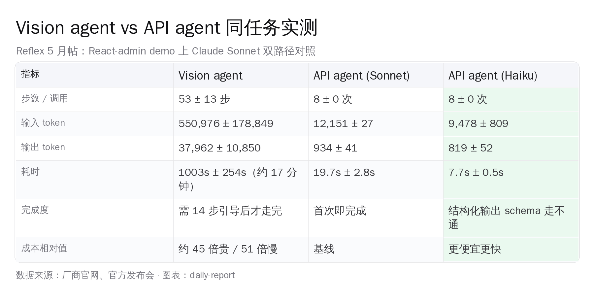
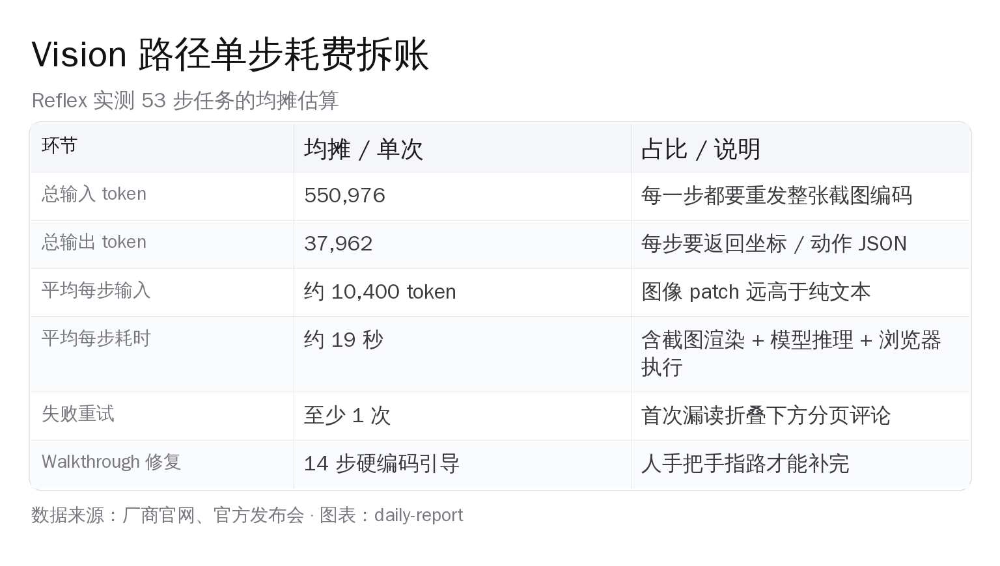
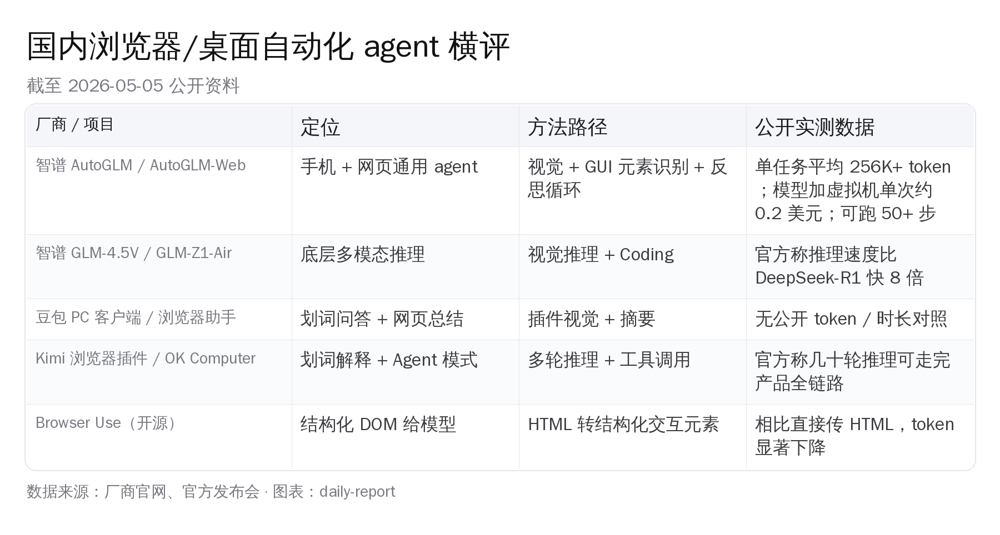
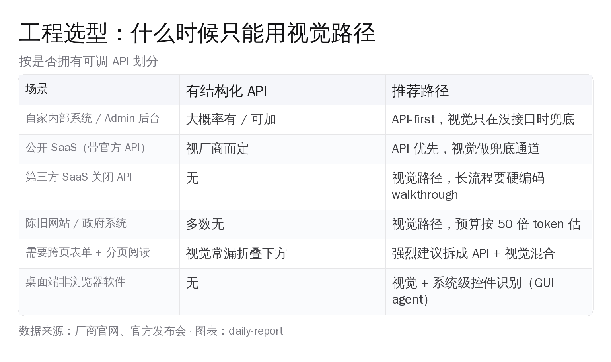

# 「浏览器自动化比 API 贵 45 倍 慢 51 倍」

## 一、53 步 vs 8 步：同一模型，两条路径，账单差出一个数量级

同一台 Claude Sonnet。同一个 React-admin 后台 demo。同一份任务清单。

视觉路径走完用了 53 步、55.1 万输入 token、约 17 分钟；结构化 API 路径走完用了 8 次调用、1.2 万输入 token、不到 20 秒。

按 token 折算成本，前者比后者贵约 45 倍；按耗时折算时延，前者比后者慢约 51 倍。

这是 Reflex 团队在 5 月发布的一篇技术博客里跑出来的实测数字，作者 Palash Awasthi。文章在 Hacker News 拿到 153 个赞、92 条评论。这个差距不是设计选择，是工程选型时绕不开的一道账。

## 二、实验设计：React-admin 后台 + 4 步交叉任务

Reflex 选的测试基线是 react-admin 官方的 Posters Galore 演示后台——一个标准的内部管理系统：900 个客户、600 个订单、324 条评论。三张表互相关联，前端用 React-admin 自动生成的过滤、分页、详情页面。

任务一共 4 步，互相依赖：

1. 在客户列表里筛出姓 Smith 的人，找出订单数最多的那一位
2. 进入这位客户的资料页，定位他最近一笔状态为 pending 的订单
3. 把所有 pending 的评论批量改成已通过
4. 把刚才那笔订单的状态改成 delivered

这套任务的特点是覆盖了内部工具最常见的四类操作：跨表筛选、分页翻页、跨实体查找、读写都做。

两条路径的工具选型：

- 视觉路径用 browser-use 0.12 版本，让 Claude Sonnet 看截图、输出鼠标坐标和键盘动作
- API 路径让 Claude Sonnet 直接走 React-admin 自动生成的 REST API，读 JSON、写 JSON

模型权重是同一份。Prompt 工程量也基本对等。Reflex 还顺手让 Claude Haiku 也跑了一次，结论是 Haiku 在视觉路径上完全跑不通——结构化输出的 schema 解析失败，但跑 API 路径只用 9,478 输入 token，比 Sonnet 还省。

## 三、视觉路径全流程拆账：每一步都得付一次截图渲染钱

视觉 agent 跑完一遍，平均 53 步。把账单一项一项摊开看：

- 总输入 55.1 万 token，标准差 17.9 万——稳定性也差，同一任务多跑几次差距能上 30%
- 总输出 3.8 万 token，每一步都要返回点击坐标、键盘按键或滚动距离
- 单步均摊：输入约 10,400 token、耗时约 19 秒
- 模型推理时间只占一小部分，大头是浏览器渲染、截图编码、再走一遍上下文

视觉 agent 的根本困境是状态表征的代价。每按一次按钮、滚动一次列表、提交一次表单，浏览器要重渲染、agent 要重新截图、再把整张图喂回模型。模型再贵也只是其中一环，截图编码本身就把 token 单价拉到一个量级以上。

更难受的是——这种重算没有任何复用。第 12 步的截图和第 11 步的截图 90% 内容是一样的，但模型每次都得重新看一遍。结构化 API 不存在这个开销，每次都是直接拿数据、直接判断。

## 四、API 路径对比：同样一份模型权重，几乎没花钱

走 API 这条线，Claude Sonnet 只调用了 8 次，平均输入 12,151 token、输出 934 token，耗时 19.7 秒。Haiku 跑同样的任务只用 7.7 秒。

8 次调用的分布大致是这样：

- 第 1 次：列出姓 Smith 的客户列表（带 order_count 字段）
- 第 2 次：拿到目标客户的全部订单，筛选 status=pending、按 created_at 倒序
- 第 3 次：拿到该订单的评论列表
- 第 4–6 次：批量更新 pending 评论的状态
- 第 7 次：更新订单状态为 delivered
- 第 8 次：确认改动落库

每一次都是直接读到结构化字段，不需要再做识别、不需要再分页。Claude 在 API 路径上的工作几乎只剩一件事：理解任务、规划接口序列、解析返回值。

成本差距倒推回单价是这样的：视觉路径单次任务成本估算约美元数十分级别，API 路径单次约几美分。乘上一个真实生产场景每天上万次调用，账单差距是数百倍。

## 五、失败模式深挖：折叠之下的三条评论

最耐人寻味的不是慢和贵，是视觉 agent 怎么失败的。

第一次跑完，agent 只把 4 条 pending 评论里的 1 条改成了已通过。原因是：剩下三条在视窗 fold 之下，agent 从来没有滚动过分页。它看到的截图里只有一条，它就以为只有一条。

这是视觉路径的结构性问题，不是单点 bug。模型只能看到当前可视区域，分页、折叠、虚拟滚动这些前端常见模式对视觉 agent 来说全是黑箱。要让它走完，必须给它一份硬编码的引导。

Reflex 团队的解法是手写了 14 步带编号的 walkthrough prompt：第 1 步去客户列表的搜索框输 Smith、第 2 步看 order_count 列、第 3 步点击该客户、第 4 步往下滚到分页区域、第 5 步翻页、第 6 步勾选所有 pending 评论……一直写到第 14 步。给完这份引导，视觉 agent 才能稳定走完，但单次耗时也涨到了 14–22 分钟。

也就是说：让视觉 agent 真正干活，不是「写一句任务描述就好」，而是要工程师先把任务拆成 14 步带编号的菜单，再让模型按菜单点。这跟「一句话搞定自动化」的预期落差很大。

API 路径完全没这个问题。分页是查询参数，过滤是 WHERE 条件，批量是 PATCH 请求体——这些前端 UI 用来组织信息密度的概念，在 API 层面只是一行代码。

## 六、国内对位：智谱 AutoGLM 走得最远，其他更偏插件

国内做浏览器/桌面自动化的玩家，主要在做这几件事。

**智谱 AutoGLM 系列**走得最远。基于自研 GLM-4.5V 视觉推理模型 + GLM-Z1-Air 底座，做了 AutoGLM-Web（网页 agent）、Open-AutoGLM（手机 agent 开源版）、AutoGLM 沉思（带规划的桌面端）三档产品。官方公开的数字：单任务平均消耗 256K+ token，可跑 50+ 步长流程；模型加虚拟机的单次成本约 0.2 美元。这个数字跟 Reflex 实测的视觉路径量级是吻合的——视觉路径就是会烧到几十万 token 这个区间。

**月之暗面 Kimi 的 OK Computer 模式**定位是 Agent 模式，官方说法是「多达几十轮的推理过程、几十次工具调用」，能从需求调研一路走到前端开发。没有公开的 token / 时长账单，但从「几十轮 + 几十次工具」的描述看，量级跟 Reflex 实测的视觉路径相近。

**豆包 PC 客户端、Kimi 浏览器插件**这一档主要做划词问答、网页总结、内容补充。本质是问答型工具，不是任务执行 agent，不直接跟这次实测对应。

**Browser Use 开源项目**是个有意思的中间方案——把网页 DOM 转成结构化的可交互元素清单再喂给模型，相比直接发整张 HTML 或截图，token 量明显下降。它的定位作者自己也说清楚了：是「模型能力还没强到能直接看截图」这个过渡期的工程优化，长期来看模型直接看截图更自然，但过渡期足够长，这种结构化加工就有价值。

横向看下来，国内还没有看到完全对位的中文实测——就是「同一个国产模型 + 同一个后台 demo + 视觉 vs API 双路径」这种 head-to-head 数字对照。AutoGLM 的官方数据倾向描述能跑多远，Kimi 偏强调推理深度，没人专门拆「这条路径跟另一条路径相比差多少」这本账。Reflex 这篇博客的价值就在这里：它把工程选型的决策依据具象成了一组可读的数字。

## 七、Browser Use 与 Computer Use：同一个故事的两个版本

Reflex 这次跑的是 browser-use 0.12，但同样的账在 Anthropic 官方的 Computer Use、OpenAI 的桌面操作 agent 上也成立。

CSDN 在 2024 年底有一篇 BrowserUse 评测，结论很直接：Anthropic Computer Use 走的是多模态截图识别 + 输出坐标这条线，BrowserUse 走的是 DOM 结构化抽取，后者在 token 消耗上明显占优。这个判断 Reflex 这次实测又给了一个新证据——结构化路径不仅省钱，还更稳定，因为它绕开了前端折叠、分页、虚拟滚动这些视觉 agent 的盲区。

但这不意味着视觉路径没有用。视觉路径能做的事情是 API 路径做不到的：

- 没有 API 的网站（很多政府系统、老旧 SaaS、内部工具）
- 第三方 SaaS 主动关闭 API（某些社交媒体平台、某些招聘网站）
- 桌面端非浏览器软件（视频剪辑、设计工具、行业 ERP）
- 任务本身就需要看像素（视觉 QA、UI 测试、内容审核）

视觉路径是兜底通道。它贵、慢、不稳定，但它能走最后一公里——那些没有任何结构化入口的系统，只能靠它。

## 八、工程结论：API-first 是默认值，视觉是兜底

把 Reflex 这篇博客和国内厂商的公开数据放一块看，工程选型的决策树就清晰了：

**自家内部系统**——大概率自己控制后端，加几个 API 端点的成本远低于跑视觉 agent 的 token 账单。React-admin 这种工具甚至能根据数据模型自动生成增删改查 API，几乎零成本就能做到 API-first。视觉路径只用来兜底极少数没法加接口的页面。

**有官方 API 的公开 SaaS**（GitHub、Slack、Notion、飞书、钉钉……）——直接走 API。token 便宜一个量级，速度快两个量级，稳定性也高。视觉只在 API 不开放某个具体功能时兜底。

**API 关闭或残缺的第三方 SaaS**——这是视觉 agent 的主战场。预算按视觉路径的量级估，写任务时尽量拆成短流程，长流程必须配 walkthrough prompt。

**陈旧网站 / 政府系统 / 老 ERP**——多数没接口，只能视觉。注意分页、折叠、虚拟滚动这些坑，做好失败重试和人工 walkthrough 兜底。

**桌面端非浏览器软件**——只能视觉 + 系统级 GUI 识别。AutoGLM 沉思、Anthropic Computer Use 在这里有发挥空间。

## 九、再往后：自动化分层正在变成标配

Reflex 这篇博客最有价值的一点，不是 45 倍这个数字，是它把 agent 工程从「让一个模型去看屏幕」这种笼统叙事，拆成了三层：

- 任务规划层：理解需求、拆解步骤、决定调用顺序——这一层模型在 API 和视觉路径上花的算力差不多
- 执行层：怎么把规划落到具体操作——API 几乎零成本，视觉要付截图渲染 + 上下文重发的代价
- 反馈层：怎么知道操作成功了——API 直接看返回值，视觉要再截一张图比对

把这三层拆开后，工程选型就不再是「用视觉还是用 API」这种二选一，而是「这个任务的哪一层走视觉、哪一层走 API」。AutoGLM 的反思循环、Kimi OK Computer 的多轮推理，本质上都是在尝试把视觉路径的反馈层做厚一点，让它至少接近 API 路径的可观测性。

国内开发者的工具链选择空间正在变大：智谱把 AutoGLM 系列拆成了 Web 版 / 手机版 / 桌面版三档，Kimi 把 OK Computer 推出了独立 agent 模式，Browser Use 这种开源中间层国内也有人在用。45 倍的差距是给所有人看的标尺——它告诉你哪些场景值得花视觉的钱，哪些场景花了就是浪费。

底层基础设施一步一步追上来，前面的路在打开。

## 参考资料

- Reflex 博客 5 月帖《Computer Use is 45x more expensive than structured APIs》by Palash Awasthi
- Hacker News 讨论帖：153 pts / 92 评论（2026-05-05）
- 智谱 AutoGLM 系列：AutoGLM、AutoGLM-Web、Open-AutoGLM、AutoGLM 沉思
- 月之暗面 Kimi OK Computer Agent 模式
- Browser Use 0.12 开源项目
