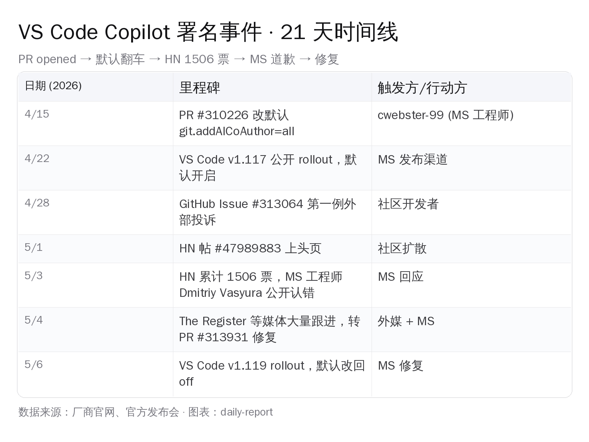
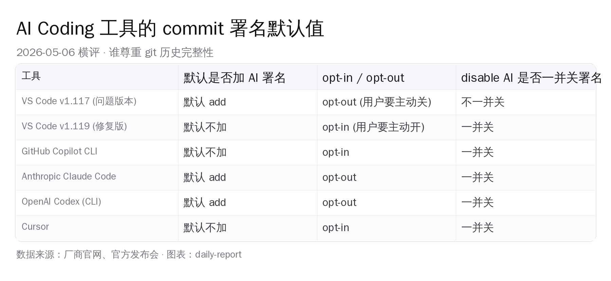
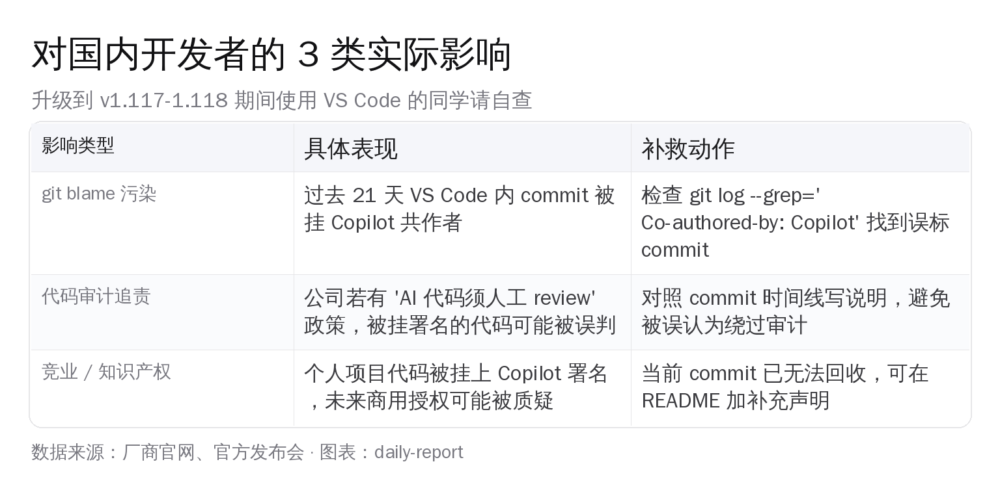

# VS Code 默认给 commit 挂 Copilot 署名 21 天，HN 1506 票后回退 | AI 日报 | 2026-05-06


**核心事件**：4 月 22 日，VS Code v1.117 把 `git.addAICoAuthor` 设置默认值从 `off` 改成 `all`。结果就是——只要你用 VS Code 提交代码，commit 就会被悄悄挂上 `Co-authored-by: Copilot <copilot@github.com>`，连完全关掉 Copilot 的人也跑不掉。Hacker News 上的吐槽帖累计 1506 票，今天（5 月 6 日）VS Code v1.119 公开 rollout，默认值改回 `off`，并修复 `disableAIFeatures=true` 时的覆盖逻辑。

这不是一个常规 bug。它把 git commit metadata 这种「开发者最敏感的基础设施」当成厂商可以随意改默认值的字段，21 天之后才被外部压力逼回去。值得国内还在大量用 VS Code + 各家 AI 助手的同学完整看一遍来龙去脉。

## 一、21 天时间线



时间节点压得很紧：

- **4/15** [PR #310226](https://github.com/microsoft/vscode/pull/310226) 由 MS 工程师 cwebster-99 提出，标题 *Enabling ai co author by default*，把 `git.addAICoAuthor` 默认值改成 `all`
- **4/22** v1.117 公开 rollout，默认行为变化没在 release notes 显眼位置标注
- **4/28** GitHub [Issue #313064](https://github.com/microsoft/vscode/issues/313064) *Keep getting "Co-authored-by: Copilot" in commit messages for no reason* 第一次外部投诉
- **5/1** Hacker News 帖 [VS Code inserting 'Co-Authored-by Copilot' into commits regardless of usage](https://news.ycombinator.com/item?id=47989883) 上头页
- **5/3** HN 累计 1506 票，VS Code 评审者 Dmitriy Vasyura [公开认错](https://github.com/microsoft/vscode/issues/314311)：*应该尊重 disableAIFeatures、不该把非 AI 改动标成 AI 协作*
- **5/4** 海外媒体跟进（[The Register](https://www.theregister.com/2026/05/04/microsoft_reverses_ai_credit_grab/) / [heise](https://www.heise.de/en/news/WTF-Microsoft-forces-Co-Authored-by-Copilot-in-commits-11279554.html) / [Slashdot](https://slashdot.org/story/26/05/05/0335220/vs-code-update-added-copilot-as-default-co-author-to-git-commits)），修复 PR #313931 合并
- **5/6** v1.119 公开 rollout，默认值改回 `off`，并保证 `disableAIFeatures=true` 时无视 `git.addAICoAuthor` 的值

PR 合入到外部投诉之间隔了 13 天，外部投诉到回退之间又走了 8 天——加起来正好 21 天的「默认开启」窗口期。这段时间里，所有用 VS Code 1.117/1.118 的开发者，commit 历史都可能被打了 Copilot 戳。

## 二、bug 究竟有多严重

不少同学第一反应是：「不就多一行 trailer 嘛？」。问题在于这一行的具体行为：

- **完全关掉 Copilot 也照贴**：`disableAIFeatures=true` 是企业 IT 关闭 AI 功能的开关，但 v1.117 的 `git.addAICoAuthor` 完全无视它
- **手改 commit message 后还会被悄悄追加**：用户在提交对话框里删掉 `Co-authored-by: Copilot` 行点确认，最终 commit 里照样出现这一行——意味着「我审核过的内容」与「最终入库内容」对不上
- **判定标准失效**：本意是「检测到 Copilot 实际参与才加 trailer」，实际逻辑判错——非 AI 的代码也被打成 AI 协作

第三条最致命。它意味着 git blame 上的「这段代码 Copilot 一起写的」可能完全是 false positive。任何依赖 commit metadata 做合规审计、责任归属、知识产权追责的链路，都被默认开启的这 21 天污染。

## 三、为什么这件事在 HN 1506 票

HN 上的吐槽不全是技术细节，更多是对「commit 是开发者主权」的捍卫。挑几个高赞评论概括（[原帖讨论](https://news.ycombinator.com/item?id=47989883)）：

- **dmitriv（MS approver）**：承认错误、致歉、承诺 v1.119 回退并修复检测逻辑
- **somebehemoth**：质疑流程——这种用户可见的默认值翻转怎么走完整 review 都没人拦
- **serial_dev**：归因到「功能速度优先于副作用考量」的系统性压力
- **p-e-w**：实现错得太离谱，逼得人怀疑动机；commit message 是关键基础设施，必须有保护
- **jamesbfb**：这次回退到底是真心认错，还是被舆论压力逼着 damage control？

技术圈对 git commit metadata 的态度高度一致：**它属于开发者，不属于厂商**。任何厂商想往里塞东西都必须 opt-in，不能 opt-out。这次 VS Code 走反方向，所以才被 1506 票按住打。

## 四、横向对比：AI 工具的 commit 署名默认值



把主流 AI 编辑工具的 commit 署名默认行为放在一起看，VS Code v1.117 是孤例：

| 工具 | 默认是否加 AI 署名 | opt-in / opt-out | disable AI 一并关署名 |
|---|---|---|---|
| **VS Code v1.117**（问题版本）| 默认 add | opt-out（用户要主动关）| 不一并关 |
| VS Code v1.119（修复版）| 默认不加 | opt-in（用户要主动开）| 一并关 |
| GitHub Copilot CLI | 默认不加 | opt-in | 一并关 |
| Anthropic Claude Code | 默认 add | opt-out | 一并关 |
| OpenAI Codex CLI | 默认 add | opt-out | 一并关 |
| Cursor | 默认不加 | opt-in | 一并关 |

Claude Code 和 Codex 也是默认 opt-out，但都尊重 `disableAIFeatures`——只要用户明确说「不要 AI」，署名就会跟着关。VS Code v1.117 的特殊在于：默认 add + 不尊重 disable + 检测逻辑还出错，三个问题叠在一起。

开源社区对 AI 署名的态度也分裂：[Linux 内核](https://docs.kernel.org/process/) 要求 AI 协助的代码必须有人类 sign-off；[Zig](https://github.com/ziglang/zig/blob/master/CONTRIBUTING.md) 直接禁止 AI 生成代码进入主仓。在这种背景下，默认往 commit 里塞 Copilot 显然踩到了多方红线。

## 五、对国内开发者的实际影响



国内 VS Code 装机量极大，而且大量同学是「装了 VS Code、但没买 Copilot」的状态。按 v1.117/1.118 的 bug 行为，**只要 VS Code 内 commit，就有概率被打 Copilot 共作者**，不需要装 Copilot 插件。

如果过去 21 天用 VS Code 提交过代码，建议跑一遍：

```bash
git log --grep='Co-authored-by: Copilot' --oneline
```

| 影响类型 | 具体表现 | 补救动作 |
|---|---|---|
| **git blame 污染** | 4/22-5/6 期间 VS Code 内 commit 被挂 Copilot 共作者 | grep 找出误标 commit，整理清单备查 |
| **代码审计追责** | 公司若有「AI 代码须人工 review」政策，被挂署名的代码可能被误判为绕过审计 | 对照时间线写说明，附上 v1.117 bug 公开记录链接 |
| **个人项目 IP** | commit 历史进了开源/商用项目，未来 IP 归属可能被质疑 | commit 已上链无法回收，可在 README 加补充声明引用本 bug |

需要强调：**升级到 v1.119 不会清理历史 commit**——已经被打上的 trailer 留在仓库里。`git rebase -i` 改 commit message 是补救手段，但会改 commit hash，需要 force-push，团队仓库慎用。

## 六、技术细节：bug 怎么发生的

PR #310226 的实现思路是：在每次 commit 时调用 VS Code 内置的 AI 改动检测函数，若返回 true 就追加 trailer。两个具体的实现失误：

- **检测函数只看「这次 commit 之前有没有出现过 inline completion 接受事件」**，而不是「这次 commit 涉及的代码是否真来自 inline completion」。结果只要打开过 Copilot 一次，后面所有 commit 都被算 AI 协作
- **没有 short-circuit 检查 `disableAIFeatures`**——逻辑路径直接走「调检测、加 trailer」，根本不读这个开关

修复 PR #313931 加了两条护栏：(1) `disableAIFeatures=true` 时直接 short-circuit return；(2) 检测函数改成「比对此次 commit diff 是否与最近 inline completion 接受的内容重叠」。第二条不是简单代码改动——它要求 AI 改动追溯做到 commit 粒度的精确归因，这是个工程上很硬的题目。

## 七、回到核心：commit 是开发者最后的主权

这件事最值得记住的不是「v1.117 有 bug」，而是 21 天才被纠正的过程本身。1506 张赞票不是为了某个具体 trailer，而是为了一个边界共识：**git commit metadata 是开发者签字、是责任归属、是 IP 归属——任何对它的默认行为修改都必须 opt-in，必须可关，必须尊重 disable 总开关**。

VS Code 这次踩到了所有红线，但好在被外部压力按回去了。Claude Code、Codex 这些默认 opt-out 加 AI 署名的工具也值得复查一遍：你的 `disableAIFeatures` 是不是真的能关掉所有 AI 痕迹？你的团队仓库里现在有多少行 `Co-authored-by:` 是你不知道的？

国内做 AI Coding 工具的团队也该把这条记下来：再急的迭代节奏，也别动 commit metadata 的默认值。这是开发者社区已经用 1506 票画好的红线。

---

**参考资料**

- [VS Code PR #310226 - Enabling ai co author by default](https://github.com/microsoft/vscode/pull/310226)
- [VS Code Issue #313064 - Keep getting "Co-authored-by: Copilot" for no reason](https://github.com/microsoft/vscode/issues/313064)
- [VS Code Issue #314311 - Update on Co-authored-by Copilot in commit messages](https://github.com/microsoft/vscode/issues/314311)
- [Hacker News #47989883 - VS Code inserting 'Co-Authored-by Copilot'](https://news.ycombinator.com/item?id=47989883)
- [The Register - Microsoft fixes VS Code after Copilot credited human code](https://www.theregister.com/2026/05/04/microsoft_reverses_ai_credit_grab/)
- [heise online - WTF: Microsoft forces "Co-Authored-by Copilot" in commits](https://www.heise.de/en/news/WTF-Microsoft-forces-Co-Authored-by-Copilot-in-commits-11279554.html)
