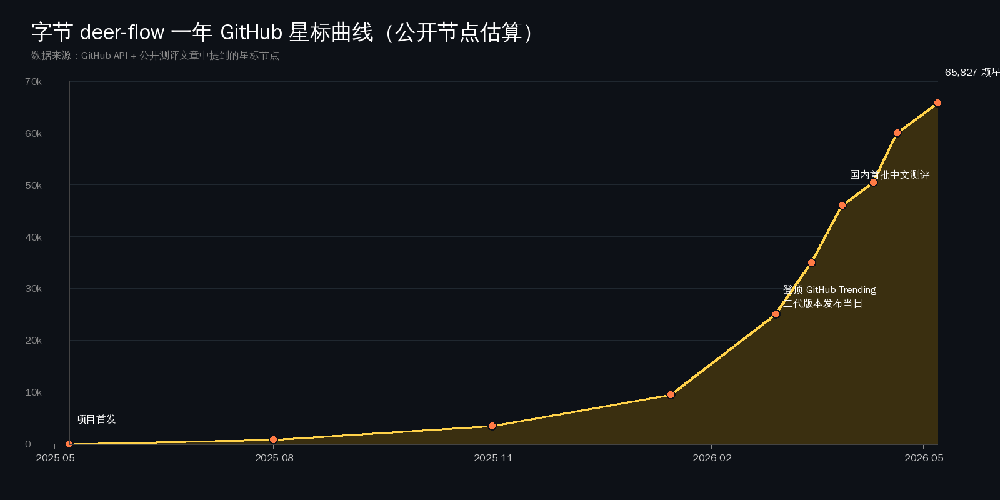
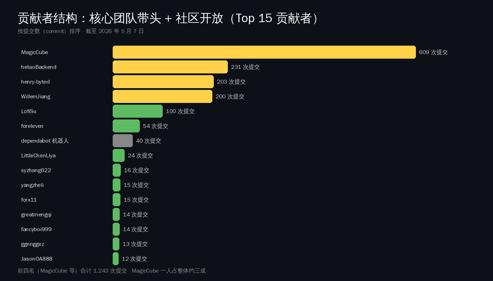
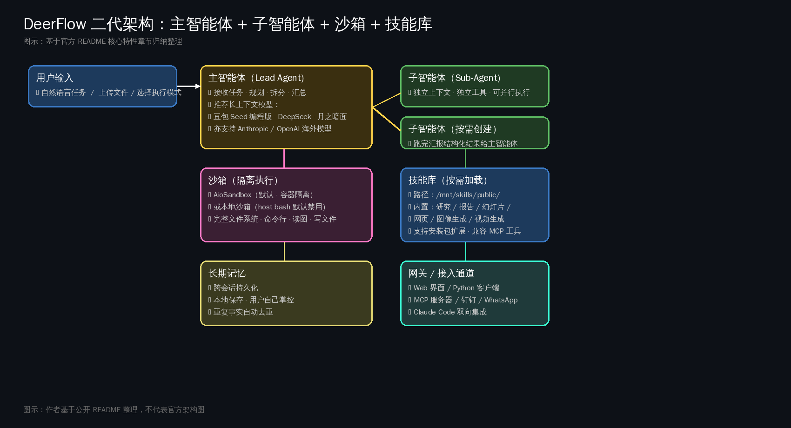
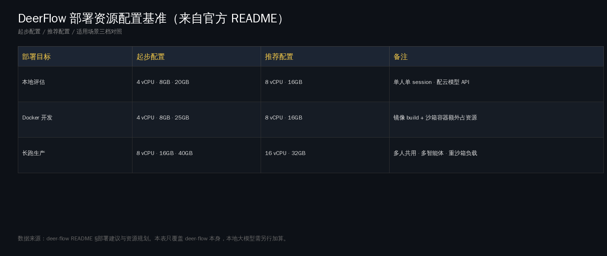
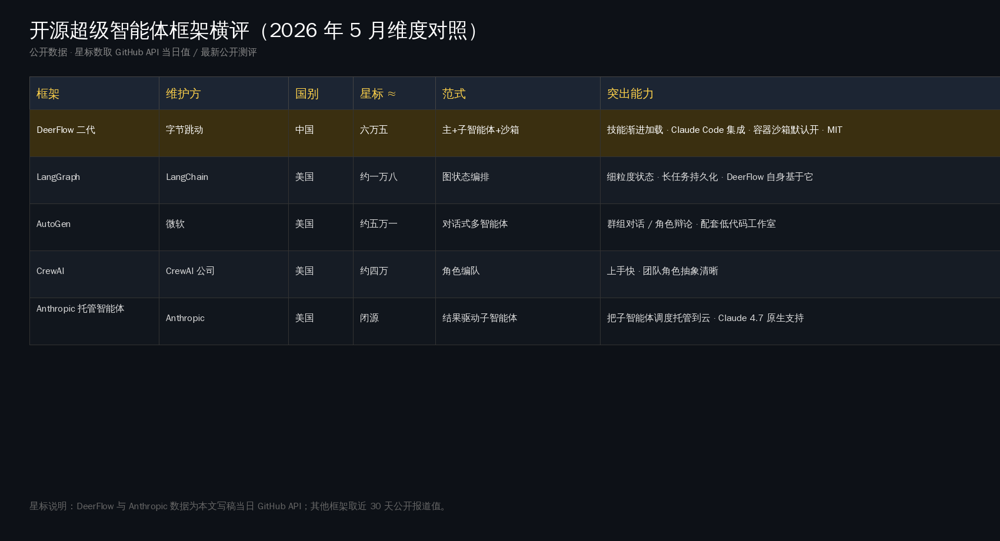
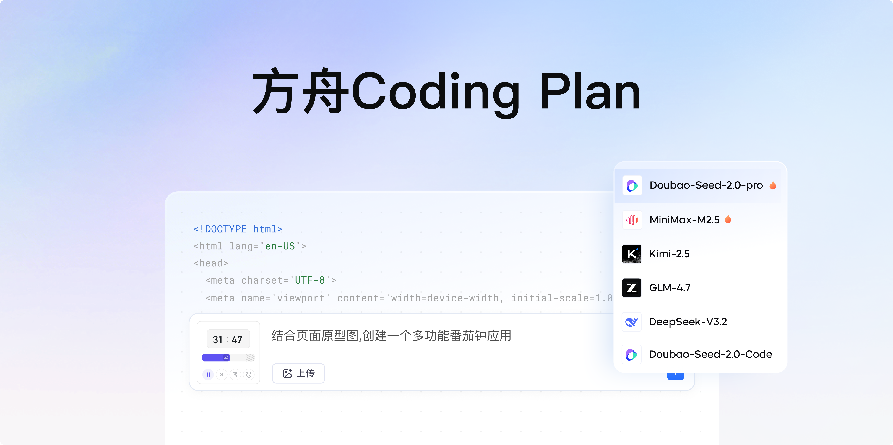

# 字节 deer-flow 满一周年：65,827 颗星撑起的国产 super agent 底座

如果你今天点开 `github.com/bytedance/deer-flow` 这个仓库，会看到 65,827 颗星、8,693 个 fork、712 个开放 issue、454 个未关 PR——一个非常活跃的工程项目。再看顶上那一行小字：「Created on 2025-05-07」。今天是 2026-05-07，**这个项目正好满一岁**。

一年里它从一个不到一千星的"deep research 框架"涨到 6.5 万星，定位也从 "deep research" 改成了 "super agent harness"——一个长期任务的 agent 执行底座。3 月初它的 v2.0 把 GitHub Trending 第一名占了 24 小时，同期 Hugging Face、heise、SitePoint 这些海外站点都跟进发了测评。

中文世界这一年，写这个项目的稿子加起来不到十篇。**这就是这篇要说的事**：deer-flow 不是字节"又一个开源演示项目"，是国内目前唯一一个把 sub-agent 编排、Docker 沙箱、Claude Code 风格的 skills、长期记忆这四件事在 MIT 协议下捆好的 super agent 底座；国内开发者把它当生产工具用还少，但海外社区已经开始把它和 Anthropic Managed Agents、Microsoft AutoGen 摆在同一张比较表里。这条路现在站住了。

接下来分四步把这件事讲清楚：先看一年涨了什么、它是什么、为什么海外开发者愿意试、国内此刻的位置。

---

## 一、一周年体检：65k 星、Trending 第一、彻底重写

先把客观数字摆全，省得后面绕。

`gh api repos/bytedance/deer-flow` 今天返回的几个核心字段：

- 创建时间：2025-05-07T02:50:19Z
- 默认分支：main，许可证：MIT
- Star：**65,827**
- Fork：**8,693**
- Watchers：65,827
- 主语言：Python（前端 TypeScript）
- 开放 issue：712（含 social spam，但绝大多数是 bug / feature 请求）
- 开放 PR：累计 454 条 open，issue 编号已到 #2768
- 主页：[https://deerflow.tech](https://deerflow.tech)，含可玩 demo
- 关键 topic 标签：`agentic-framework / multi-agent / langgraph / skill / superagent / deep-research`

曲线上有两个肉眼可见的拐点。一个是 2026-02-28——这天 v2.0 发布、GitHub Trending 第一，README 顶部那一行专门写了纪念：「On February 28th, 2026, DeerFlow claimed the #1 spot on GitHub Trending following the launch of version 2.」从 9.5k 跳到 25k 只用了三天。另一个是 3 月 28 日往后，国内自媒体（知乎、腾讯云开发者社区、博客园、CSDN AtomGit）开始扎堆出第一波中文解读，给曲线又加了一个台阶，再到 5 月 7 日今天落到 65,827。

v2.0 跟 v1 之间没共用代码——README 自己写得很重的话："**DeerFlow 2.0 is a ground-up rewrite. It shares no code with v1.**" v1 框架还留在 `main-1.x` 分支上接受贡献，但主开发线已经全部转到 v2。这意味着今天看 deer-flow 等于看 v2，过去半年的中文测评里仍按 "deep research 工具" 来介绍它的，描述基本都过期了。

贡献者结构这一年里出现了一个有意思的形状：

`MagicCube` 一个人 609 commits，几乎是第二名（hetaoBackend 231 commits）的三倍。`MagicCube` 是字节内部团队 ID（GitHub handle 公开），项目的核心架构由这一只手稳住；后面四位 hetaoBackend、henry-byted、WillemJiang、LofiSu 加起来再撑起项目主干（合计 1,243 commits）。**这不是字节常见那种"开源出来 PR 没人接"的项目**——`gh api` 拉最近 closed PR 排序按评论数，#1403「在 Gateway 层重写 LangGraph Platform API」一条 PR 22 条评论，#1056「LoopDetectionMiddleware：打断重复 tool call 死循环」9 条评论，#1851「unified persistence layer」3 条评论——这些 PR 多数是社区贡献者发起，字节核心团队 review 合入。

最近一周开放的 issue 也透出一个信号：中文 issue 比例肉眼可见地高。截至发稿前一天的 8 条最新 open issue 里，5 条正文是中文（"适配 deepseek v4""windows 运行路径解析问题""怎么接入 a2ui""前端添加用户级别的 api_key 配置""配置文件支持多环境隔离"）。**国内开发者已经在动手用了，只是没人写测评**——这个落差是这篇文章的起点。

---

## 二、它到底是什么：一个把"长任务 agent"做成可装的开发框架

"super agent harness" 是 README 第一句话用的定义，翻译成中文不等于"超级 AI"——harness 在工程语境里更接近"挽具/束具"的意思，指**把一堆 agent 能力捆在一起、套在 LLM 上的那套结构件**。它不替你写模型、不替你做训练，而是替你处理"模型如何长时间稳住跑一个任务"这件事。

按 README §核心特性 一节归纳，整个系统由六块组成：

四件最关键的事，分别讲清楚。

### 2.1 Skills：把"做什么 / 怎么做"写成 markdown，用时再加载

`Skills are what make DeerFlow do almost anything.` README 这句话抄一下就够。一个标准的 deer-flow skill 等于一份 markdown 文件，里面写一个工作流的最佳实践、调用什么工具、参考哪些资源。系统自带的 skill 包括 `research / report-generation / slide-creation / web-page / image-gen / video-gen` 等，路径在沙箱容器内的 `/mnt/skills/public/`。**对国内开发者来说，关键点是这套 skills 范式跟 Claude Code 那套 `.claude/skills/` 是同源的设计**——deer-flow 直接接受 `.skill` 安装包，frontmatter 里的 `version / author / compatibility` 字段都按 Claude Code skills 的标准约定来。

更重要的是 progressive load——只在任务需要某个 skill 时才把它的 markdown 灌进上下文，不会一上来把所有 skill 都塞进 prompt。这一条对国产模型尤其友好：千问、DeepSeek、Kimi 这些上下文窗口最大也就 128k–200k，把 skills 全量塞进去会很快撑爆。progressive load 让"能用的 skill 数量"和"模型上下文窗口"解耦。

skills 本身可写可换可叠加。一个团队可以把自己的代码评审 SOP、合规检查清单、报告写作风格都写成 skills 装进 deer-flow，让同一套 lead agent 在不同任务上调不同 skills。

### 2.2 Sub-Agents：主智能体按需 fork 子任务

复杂任务一遍跑不完。lead agent 收到一个长任务后会拆成若干子任务，每个子任务 spawn 一个 sub-agent——独立 context、独立工具集、独立终止条件。能并行的就并行跑，跑完把结构化结果交回 lead agent，lead agent 做最后汇总。

举个 README 自己给的例子：一个 research 任务可能 fan out 成十几个 sub-agent，每个研究一个角度，最后收成一份 report、一个网站、或者一份带生成图的幻灯片。「One harness, many hands.」——一个挽具，很多双手。

这个设计跟 Anthropic 4 月新推的 Managed Agents 思路是同一个时代的产物：把"长时任务"的核心抽象从"一个 LLM call"升级成"一个会自己 fan out 的 agent"。区别是 Anthropic 把 sub-agent 调度托管到云端付费跑，deer-flow 是让你在自己机器上 MIT 协议跑。

### 2.3 Sandbox：每个任务一个隔离环境，给 agent 一台真电脑

`DeerFlow doesn't just talk about doing things. It has its own computer.`——README 原话。

每个 agent 任务跑在自己的执行环境里，里面是完整的文件系统：skills、workspace、上传文件、输出。Agent 可以读写编辑文件、看图片，配置安全策略后能跑 shell 命令。

具体两种 provider：

- **AioSandboxProvider**（推荐）：shell 在 Docker 容器里跑，物理隔离
- **LocalSandboxProvider**：文件工具映射到 host 上的 per-thread 目录，host bash **默认禁用**——README 明确写了「host bash is not a secure isolation boundary」，必须显式打开才用，且仅限完全可信的本地工作流

两种模式都对应明确的资源配置基准。README 给了一张部署 sizing 表：

注意这张表只覆盖 deer-flow 本身。如果你顺便在同一台机器跑本地大模型（vLLM + 千问 / DeepSeek），那部分要单独算。

### 2.4 长期记忆：跨 session 不忘

「Most agents forget everything the moment a conversation ends. DeerFlow remembers.」README 这一段写得很重。跨 session、跨任务，deer-flow 维护一份关于"你"的持久记忆——写作风格、技术栈、常用工作流、个人偏好——存本地，不上云。最近的一个 commit 还专门加了"重复 fact 自动去重"，避免同一条偏好在记忆里堆积。

这一点跟个人 AI 助手赛道的逻辑接得很顺：本地长期记忆 + 沙箱执行 + 可扩展 skills，其实就是把 Claude Code 那套放大到"完整桌面 agent"的形态。

### 2.5 配套：Gateway / Channel / Python Client

剩下的拼图比较常规。Web UI（Next.js · 端口 3000）+ Gateway API（端口 8001）+ LangGraph Server（端口 2024）+ Nginx 反向代理（端口 2026 统一入口）。Channel 一侧已经接了钉钉（最近合入 PR #2628）、WhatsApp、Claude Code（通过 `claude-to-deerflow` skill 装进 Claude Code 内当 `/claude-to-deerflow` 命令用）。还有一个内嵌 Python Client（`DeerFlowClient`），允许把 deer-flow 当一个本地库直接 import 进自己的程序，不用拉起整套 HTTP 服务。

---

## 三、为什么海外开发者愿意试：模型可换 + 落地路径完整

光看架构图很容易感觉"市面 agent 框架不都长这样吗"。把 deer-flow 跟同期开源 super-agent 框架放在一张表上对比，差异点会清楚一些：

> 表里 LangGraph / AutoGen / CrewAI 的 star 数取近 30 天公开报道值（DataCamp / Turing.com / o-mega 等横评），数字会动；deer-flow 与 Anthropic Managed Agents 数据来自本文写稿当日 GitHub API 与本日报当日同期发布的另一篇专题（详见今日 `anthropic-managed-agents-outcomes-dreaming` 一文，主题为 Code w/ Claude 大会推出的 outcome-driven 子智能体托管服务）。

横向看下来，deer-flow 在四件事上拿到了 niche 优势：

**第一，模型层真的不绑死。** README 列了一份明确的兼容矩阵：OpenAI（GPT-4o / GPT-5 含 Responses API）、Anthropic Claude（含 Claude Code OAuth、Sonnet 4.6）、Google、xAI、OpenRouter、DeepSeek v3.2、Kimi 2.5、字节自家 Doubao-Seed-2.0-Code，本地侧支持 vLLM 0.19.0 跑千问 32B、Qwen reasoning models（带 `enable_thinking` 配置）、Codex CLI 直连。模型按 OpenAI-compatible API 接，新模型加一段 yaml 就行。这件事看起来朴素，但是是 super agent 框架要落地的硬门槛——CrewAI 早期对非 OpenAI 模型支持不太行、AutoGen 对国产模型集成松散，开发者真的会被卡住。

**第二，落地手册写得很完整。** README 单是 quick-start 一节就讲清楚了 Docker 推荐路径、本地开发路径、Sandbox 模式、MCP server 接入、IM 渠道接入、LangSmith / Langfuse 双追踪、部署 sizing 表、安全建议清单。`make setup` 是个交互式 wizard，两分钟生成 `config.yaml` 和 `.env`。`make doctor` 一键诊断环境。这种 "我要起跑前还差什么" 的可观测性，在开源 agent 框架里其实不常见。

> 图：deer-flow README 顶部嵌入的"字节跳动火山引擎方舟 Coding Plan"国内入口横幅（来源：项目 README）

**第三，对中国大陆地区的开发者是显式照顾的。** `Makefile` 支持 `UV_INDEX_URL=https://pypi.tuna.tsinghua.edu.cn/simple` 和 `NPM_REGISTRY=https://registry.npmmirror.com` 两个环境变量，clone 之后切清华源 / npmmirror 走得通。README 顶上的 "字节跳动火山引擎方舟 Coding Plan" 横幅按地区分国内 / 海外两个入口，国内入口直链 volcengine 火山方舟。**这个细节不是字节大多数开源项目会做的**，背后能看出团队明确想吃国内开发者市场。

**第四，Claude Code 集成走得最积极。** `npx skills add https://github.com/bytedance/deer-flow --skill claude-to-deerflow` 一行装进 Claude Code，之后在 Claude Code 里 `/claude-to-deerflow` 直接跟跑在 `localhost:2026` 的 deer-flow 实例对话，选 flash / standard / pro / ultra 四种执行模式。这件事的意义不在功能本身，在于**它把 Claude Code 的 skills 生态当成一等公民对接**——一个国产 agent 框架，主动跟一个海外 agent 工具做双向集成，而不是把自己关在自家圈子里。

海外社区的反馈也跟得上。SitePoint 4 月连发两篇深度文章把它跟 Claude Code、Ruflo 摆在一起做编排对比；Hugging Face 上 Kseniase 维护的 [10 Open-source Deep Research assistants](https://huggingface.co/posts/Kseniase/947704683052150) 把它列入头部清单；德国 [heise.de](https://www.heise.de/en/news/DeerFlow-Super-agent-framework-from-ByteDance-11248532.html) 4 月 11 日发了英文新闻稿；Medium 上多篇 v2 完整解读跟进。一个国产开源项目能在海外形成这种程度的"自来水测评"，过去几年里其实不多。

---

## 四、国内此刻的位置：开发者已上手，但中文测评极少

回到国内视角，这是这篇最想讲清楚的部分。

### 4.1 海外热 vs 国内冷的"信息温度差"

你在百度、知乎、CSDN、微信里搜"deer-flow"或"DeerFlow"，能找到的中文长测评数得过来：

- 知乎 3 月底《暴涨 47.3k Stars！字节开源 Harness 项目 DeerFlow 2.0》—— 文章把 v2.0 定位为"执行优先"的 agent 框架，强调它跟"只给建议的 AI 工具"的根本区别在"直接帮你把事情做完"
- [腾讯云开发者社区 4 月 10 日](https://cloud.tencent.com/developer/article/2652614) 转发同一作者文章，标题改成《斩获 50K Star！字节开源 DeerFlow 2.0，近期霸榜 GitHub 的超级 AI 员工！》
- 博客园 [@码上的生活](https://www.cnblogs.com/zyl007/p/19656975) 的《DeerFlow 2.0：字节跳动开源的超级智能体框架》详细拆了它的 LangGraph 1.0 重写
- CSDN AtomGit 的[《DeerFlow 2.0：字节跳动开源的超级 Agent 框架》](https://gitcode.csdn.net/69c4c18854b52172bc6492e8.html) 同期跟进
- 微信 53AI 的[《字节跳动开源 DeerFlow 2.0：下一代超级 Agent 引擎》](https://www.53ai.com/news/OpenSourceLLM/2026032379416.html) 走通用科技公众号路线

加起来不到十篇主要是 v2.0 上线那一周（3 月底 4 月初）写的，最近一个月内的新文章很少。**对照同期海外测评频次和深度，明显偏冷。**

但开发者侧已经动起来了。最近一周 8 条 open issue 里 5 条中文已经说明用户结构。再翻一下 issue tracker，能看到大量国内开发者关心的具体问题：vLLM 配置 + Qwen reasoning、DeepSeek v4 适配、Windows 路径、企业内多环境隔离、a2ui 接入。**项目正在被国内开发者当生产工具试，只是这群人没顺手写中文测评。**

这个落差可以叫"信息温度差"——一个项目在海外（含字节自家）的信号密度，跟它在中文世界被讨论的密度，存在系统性偏差。这不是 deer-flow 一家的现象。今天的另一个案例 `virattt/dexter` 也是同样的结构：海外 GitHub Trending、HN、Reddit 顶帖讨论了一周，中文写它的稿子可以一只手数完。

### 4.2 国内同档玩家盘点：deer-flow 的位置在哪

把视角拉到"国内开源 agent 框架"这一档，今天 deer-flow 不孤单——但它的定位最完整。同档玩家的真实情况：

| 国内开源 agent 框架 | 维护方 | 现状 / 定位 | 与 deer-flow 的差异 |
|---|---|---|---|
| **deer-flow** | 字节跳动 | super agent harness · 65.8k★ · MIT · 自带 sandbox + skills + 长记忆 | — |
| **MetaGPT** | 深度求索系核心成员维护 | 多 agent 软件公司模拟 · ≈45k★ | 偏"一群 agent 模拟一家软件公司"，开发框架属性弱于 deer-flow |
| **ChatDev** | 清华 OpenBMB | 多 agent 软件开发协作 · ≈30k★ | 教学 / 研究侧重，生产部署支持轻 |
| **AutoAgent** | 港大 / 腾讯 | 通用 agent 框架 | 体量小，社区活跃度不到 deer-flow 一档 |
| **Lobe Agent** | LobeHub | 个人 agent 应用 · 偏 chat 形态 | 用户向产品，不是 framework |
| **CamelAI** | 华人主导（部分美国华人团队） | 多 agent 通信框架 · ≈8k★ | 学术工具偏强，工程闭环弱 |

deer-flow 最完整的地方在于：**它是少数同时具备 sandbox + skills + sub-agents + long-term memory + 模型可插拔 + 多 IM 渠道的国产开源 agent 框架**，而且这套东西按 MIT 协议开放、有官方网站、有中文 README、有部署 sizing 表、有 Coding Plan 商业接入路径。从"国产开源底座"角度看，它现在是国内唯一一个把整条 super agent 链路打通到"开箱即用"程度的项目。

### 4.3 可以怎么用：三个真实场景的判断

这一段不写成行动清单——按读者的反馈，"国内开发者今天就该做这 X 件事"那种调子让人翻白眼。这里只摆三个典型场景下，deer-flow 是不是合适的工具，给一个判断。

**场景一：单人开发者要装一个本地长任务 agent，跑研究 / 调研 / 报告。** deer-flow 是合适的。它的 LocalSandboxProvider 对单机够用，模型层接 DeepSeek v3.2 / Kimi 2.5 / Doubao-Seed-2.0-Code 走火山方舟价格便宜。和直接用 Claude Code 比，deer-flow 的优势是 sub-agents 并行 + 长任务 + skills 可堆；劣势是要自己起服务、自己接模型 key，比 Claude Code 那种 "装个 CLI 就开干"更重。

**场景二：小团队要做 SaaS / 内部 agent 平台，把自己业务 SOP 沉淀为 skills。** deer-flow 是合适的。它的 Gateway API + skills install + Channel 接入这一套设计，正是给"中型团队搭自家 agent 平台"用的。MIT 协议没合规摩擦，国内火山方舟 / DeepSeek API 可以稳定供给。这个场景比单人场景更适合 deer-flow——它的设计取舍明显倾向"团队工具"。

**场景三：企业级生产线要选一个 agent 框架做底座。** deer-flow 是值得评估的候选，但不是唯一选择。它的强项是开箱即用 + sub-agent 并行 + 国产模型友好；它的弱项是整体复杂度比 LangGraph 直接用要高（毕竟在 LangGraph 之上又套了一层），生产部署的可观测性 / 监控指标体系还在补齐（最近 PR #1851 才合入 unified persistence layer）。如果团队已经深度用 LangGraph，可能直接用 LangGraph + 自定义 sub-agent 调度更轻；如果团队需要 Outcome-Driven 的托管 sub-agent 体验，又愿意付费、可以接受云上跑，那 Anthropic Managed Agents 也是同档对手。

---

## 五、回到开头：一年时间能跑出什么

文章开头说，deer-flow 不是字节"又一个开源演示项目"，是国内目前唯一一个把 sub-agent 编排、Docker 沙箱、Claude Code 风格的 skills、长期记忆这四件事在 MIT 协议下捆好的 super agent 底座。

走完这一圈，可以再加一句更具体的判断：**这一年它走的不是"中国版 Anthropic"路线，是"国产 Claude Code + LangGraph + sub-agent 编排"的合成路线**。它没去跟 Claude / GPT / DeepSeek 比模型能力，而是在模型之上做"长任务执行底座"这一层，把 Anthropic Skills、Claude Code、LangGraph、MCP、Docker sandbox 这些 2025–2026 年陆续成熟的开源 / 半开放范式集成到同一套挽具里。

对国内开发者社区，这件事提供了一个不太常见的样本——国产开源不是只有 DeepSeek / Kimi / 千问这种基座模型可以打到全球前列，**应用层的 agent 框架同样可以站住**。MagicCube 一个人 609 commits 把架构稳住，社区 PR 22 条评论合入 Gateway 重写，钉钉 / WhatsApp / Claude Code 三种 Channel 同时接入，65,827 颗星不全是流量泡沫，是两个量级的国内外开发者用脚投出来的。

一周年这个时间点，最值得记住的事情其实不复杂：**国产 agent 底座这件事可以成。** 不是某个 PPT 上的可能性，是 GitHub 上能 clone 下来跑起来的 6.5 万星仓库。后面还有 712 个 issue、454 个 PR 等着合，下一年它能不能涨到 10 万、能不能在国内开发者群里变成日用工具，就看接下来的工程节奏。

deer-flow 团队和社区贡献者们一起把这条路趟出来了，下一程值得期待。我们这一代国内 AI 开发者赶上的窗口期，比想象中宽。

---

**参考资料**

- 仓库主页：[github.com/bytedance/deer-flow](https://github.com/bytedance/deer-flow)（2026-05-07 实测 65,827 ★ / 8,693 fork / MIT，via `gh api repos/bytedance/deer-flow`）
- 官方网站 + 在线 demo：[deerflow.tech](https://deerflow.tech)
- 中文 README：[README_zh.md](https://github.com/bytedance/deer-flow/blob/main/README_zh.md)
- Trendshift 排名：[trendshift.io/repositories/14699](https://trendshift.io/repositories/14699)
- heise.de 4 月 11 日新闻：[DeerFlow: Super-agent framework from ByteDance](https://www.heise.de/en/news/DeerFlow-Super-agent-framework-from-ByteDance-11248532.html)
- Hugging Face 测评清单：[10 Open-source Deep Research assistants](https://huggingface.co/posts/Kseniase/947704683052150)
- 腾讯云开发者社区《斩获 50K Star！字节开源 DeerFlow 2.0》：[cloud.tencent.com](https://cloud.tencent.com/developer/article/2652614)
- 博客园《DeerFlow 2.0：字节跳动开源的超级智能体框架》：[cnblogs.com](https://www.cnblogs.com/zyl007/p/19656975)
- 53AI《字节跳动开源 DeerFlow 2.0》：[53ai.com](https://www.53ai.com/news/OpenSourceLLM/2026032379416.html)
- DeepWiki 项目知识库：[deepwiki.com/bytedance/deer-flow](https://deepwiki.com/bytedance/deer-flow/2-getting-started)
