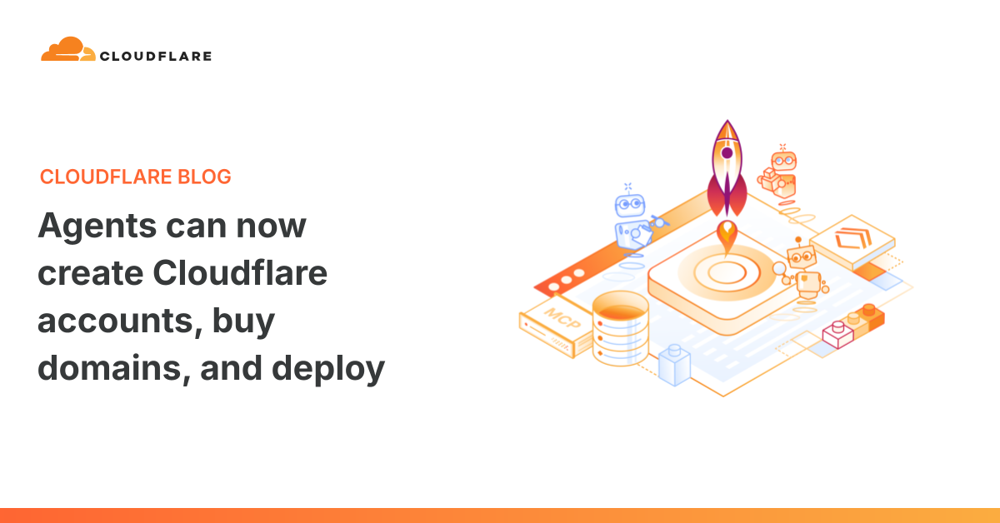
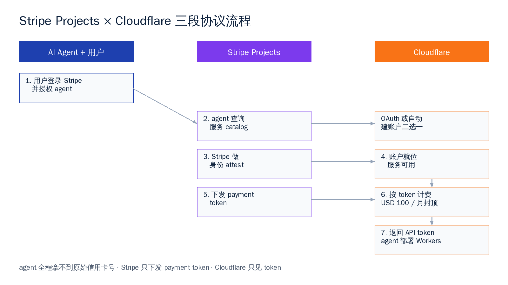
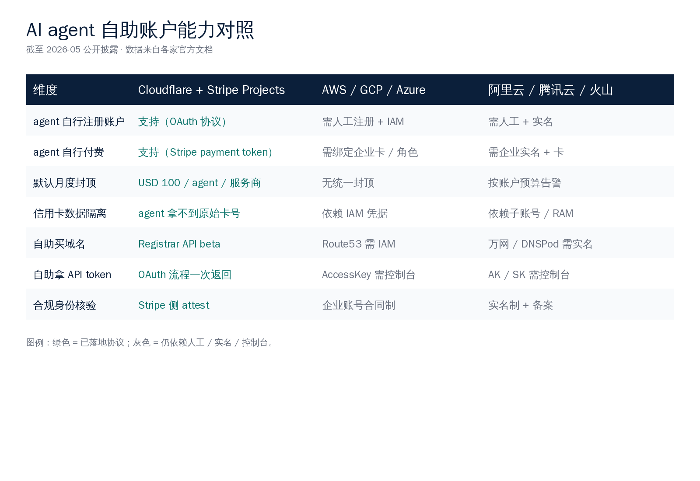

# Cloudflare 给 AI agent 开了一张信用卡

## 一句话事实

`2026-04-30`，Cloudflare 与 Stripe 联合宣布：AI agent 从今天起可以**自己注册 Cloudflare 账户、自己绑卡、自己买域名、自己拿 API token、自己把代码推到 Workers**。Stripe 给每个 agent 在每家服务商上设了一个**默认 100 美元每月**的封顶。整个流程不需要人坐在控制台前点鼠标，最多在最初授权一次。

这是迄今为止最完整的"agent 拿自己的钱、做自己的账"的工程实现。Hacker News 上 597 个赞，346 条评论，主话题不是"会不会被滥用"，而是"我下一步什么时候能在我的栈里这样跑"。这一现象本身就值得记录——一个新协议刚发布，开发者社区先讨论的是接入路径而不是潜在风险，说明工程界对这件事**早就在等了**。

> Coding agents are great at building software. But to deploy to production they need three things from the cloud they want to host their app — an account, a way to pay, and an API token.
>
> — Cloudflare 官博

把这句话翻成大白话：写代码的 agent 已经成熟了，卡在最后一公里——它没有云账户、没有付款方式、没有部署凭据。Cloudflare 这次干脆一次性把这三样全部协议化。这背后是一种工程哲学的切换：以往云厂把 agent 当作一个**调 API 的客户端**来设计；这次开始把它当作一个**有自治权的消费方**来设计。

---

## 一、发生了什么：三件具体的事

### 1.1 Stripe Projects：一个面向 agent 的服务总线

Stripe Projects 是这次发布的协议层。它不是钱包、不是网关、是一个让 agent **发现服务、获得身份、结算费用**的三段式协议。

| 协议段 | 干什么 | agent 看到什么 |
|---|---|---|
| Discovery | `stripe projects catalog` 列出可用云服务 | JSON 形式的服务清单 |
| Authorization | Stripe 替用户做 attest，云厂直接认 | 一个可被云厂识别的身份票据 |
| Payment | Stripe 下发 payment token 给云厂 | 不接触原始信用卡号 |

这套协议做对的一件关键事——**agent 全程拿不到信用卡号**。它握着的只是一个 Stripe 颁发的 payment token，云厂只见 token，token 可吊销、可限额、可审计。和 OAuth 把密码换成 access token 是同一个工程套路。

值得多说一句：discovery / authorization / payment 这三段拆得清晰，是这个协议能长期跑下去的关键。如果把三段揉在一起、让 agent 直接拿 API key 调 Stripe Charges API，看起来更简单，但每多一家云厂接入就要重新设计一套权限模型，三年内一定崩盘。Stripe 这次显然吸取了过去 webhook 协议碎片化的教训。

### 1.2 Cloudflare：第一家把协议接到底的云

Cloudflare 是 Stripe Projects 上的第一个深度集成方。一个 agent 拿到 Stripe 授权后，可以做的事按官博的原话：

> They can create a Cloudflare account, start a paid subscription, register a domain, and get back an API token to deploy code right away.
>
> — Cloudflare 官博

具体可消费的能力线包括 Workers、R2 对象存储、Durable Objects、KV、Cloudflare Registrar 域名注册（4 月 15 日刚开 API beta）、Email Service（4 月 16 日刚发公开 beta）。Agents Week 上发的产品几乎都被纳入这条 token 走的通道。

这是一种**协议优先**的工程节奏——Cloudflare 在 4 月 15 到 20 号那一周连发了 20 多个 agent 友好的产品，每一个都被设计成 token 可达。换言之，整个 Agents Week 不是 20 个独立公告的合集，而是为 4 月 30 号这条总线**铺路**的工程动作。把这件事的时间线拼起来：先用一周时间补齐 agent 需要的能力面（域名、邮件、记忆、搜索、代码评审、特性开关），再用一个协议层把这些能力**统一暴露给 agent**。

### 1.3 100 美元每月：一个看似平淡的关键数字

Stripe 给每个 agent 在**每家服务商**上的默认上限是 USD 100 / 月。这是协议层的硬阀门，不是云厂的可选项。它定义了三件事：

- **风险定价**：100 美元是行业心照不宣的"agent 单月跑飞了我也能接受"的损失上限。
- **协议默认**：用户什么都不调，就有这个保护值。
- **可调上界**：Cloudflare 侧的 Budget Alerts 允许用户自己上调或下调。

在 agent 跑飞、prompt 注入、循环调 API 这些已经发生过的事件里，这条默认上限就是最后的安全带。

---

## 二、为什么这一步很关键：从"调 API"到"主体化"

过去三年，agent 这个词的含义一直在膨胀，但工程实现层一直卡在同一件事上：**它没有自己的账户**。

不管是 LangChain、AutoGPT，还是后来的 Claude Code、Devin、Cursor agent 模式，部署到生产的最后一步永远是同一种**人肉桥**：开发者打开浏览器、登 Vercel/AWS/Cloudflare 控制台、复制 token、粘进 agent 的 env 文件、重启进程。这个动作平均 3 到 8 分钟，但它把 agent 从一个"自治进程"压缩成了"被人喂食的脚本"。

现在 Cloudflare 把这条桥拆了。变化的不是"快了几分钟"，而是：

1. **agent 第一次拥有可独立追责的身份**——Stripe 给它发的 payment token 是它自己的。
2. **agent 第一次能完成端到端商业事件**——从下单买域名到把站点跑起来，全链路无人在线。
3. **agent 第一次拥有可量化的预算约束**——100 美元这条线是它的"经济边界"。

这三个"第一次"加在一起，是 agent 从工具到数字化主体的工程拐点。

> 把 agent 从"工具"升格成"主体"，本质是给它配齐了**身份、钱包、合约边界**这三样东西。Cloudflare + Stripe Projects 是第一家把这三件事打包成协议的玩家。

举个对照：今天写一个会查机票、订酒店、安排日程的旅行 agent，它能问会议室空闲、能调日历 API、甚至能看懂酒店图片，但**真到下单付款这一步，它必须把任务塞回给人**——因为它没有付款工具、没有可独立追责的身份、没有失败时可以兜底的额度。Cloudflare 这次解决的就是这个"塞回给人"的硬伤。它现在能让一个部署 agent 在没有人在线的情况下完整跑完"建账户 → 买域名 → 部署服务 → 自己结账"的完整闭环。下一站很自然就是**让任意领域的 agent 都能跑完它们各自的闭环**——支付层一旦协议化，上层应用能跑通的边界会迅速向外推。

---

## 三、技术拆解：100 美元上限是怎么工作的

### 3.1 OAuth + Stripe attest：身份与授权的双层结构

OAuth 这层 Cloudflare 已经跑了多年，agent 走 OAuth 拿 API token 不是新动作。这次新的是 Stripe Projects 在 OAuth 之前**多加了一层 attest**：

- 用户登录 Stripe，确认这个 agent 可以代表它消费。
- Stripe 把"这个 agent 是张三授权的"这件事**签字**告诉 Cloudflare。
- Cloudflare 收到后，要么给 agent 走 OAuth，要么直接给它新建一个账户。

这层 attest 的工程价值在于：**Cloudflare 不需要自己重做 KYC**。用户的实名信息、付款能力、合规审计全在 Stripe 那一侧完成，Cloudflare 只信任 Stripe 的签字。这是和过往 cloud-to-cloud 集成最大的不同——历史上每家云厂都要自己做一遍 KYC、风控、付款方式校验，现在协议层给统一了。

从工程经济学角度看，这一步的隐含价值更大：Stripe 已经在全球 100 多个国家持牌、合规支出每年以亿美元计；任何后来者想从零做这套东西，光是合规和风控的固定成本就足以让大多数云厂望而却步。让 Stripe 当协议中介，是行业里**少有的"成本一次摊销、收益持续放大"**的工程选择。也正因为这层 attest 在 OAuth 之前，Cloudflare 不需要担心"agent 假扮某人来开账户"——身份这件事已经被前置 attest 锁死了。

### 3.2 Payment token 的几个工程性质

Stripe 下发给 Cloudflare 的不是信用卡号，是一个 token。这个 token 的几个性质决定了 agent 行为的边界：

- **限额内可重复使用**：100 美元/月范围内 agent 想花就花，不需要每次重新授权。
- **超限即拒**：超过限额时云厂返还 402，agent 必须回到用户那里申请上调。
- **可即时吊销**：用户在 Stripe 控制台一点，token 立即失效，存量服务进入只读或回收。
- **可审计**：每一笔扣款都打到 Stripe 的 ledger 上，agent 跑了什么花了多少看得清清楚楚。

这套设计本质上是把信用卡的"额度 + 临时授权"模式照搬到了 agent 经济上。它不需要发明新的密码学协议，复用 Stripe 已经合规了十几年的支付 ledger 就够。

工程上这种"复用比发明更聪明"的判断很值得记一笔。这两年区块链阵营一直在主张"agent 经济需要原生加密支付通道"，搞了不少基于稳定币的 agent 钱包方案。Cloudflare + Stripe 这一手等于直接告诉行业：**信用卡 ledger 已经合规了，你只需要在它前面加一层 token 授权就够了**。这一选择短期降低了开发者门槛，长期把"agent 支付"这件事的标准化讨论拉回到主流支付基础设施的轨道上。

### 3.3 域名 + Workers：为什么是这两个能力先开

Agents Week 期间 Cloudflare 同步发了 Registrar API beta。把 Registrar API 和 Stripe Projects 同期推出，是有工程意图的：

| 能力 | 没有 agent 自助账户时 | 现在 |
|---|---|---|
| 买域名 | 需要打开 Cloudflare 控制台 / Namecheap，人工填 WHOIS | agent 调 Registrar API，扣 token |
| 部署 Workers | 需要手动 wrangler login + 复制 API key | agent OAuth 一次拿 token，直接 wrangler deploy |
| 加一条 R2 桶 | 需要控制台点开 R2 → Create bucket | agent 调 R2 API，扣 token |

这三个动作合起来，正好是"一个 agent 把网站从代码到上线"的最小闭环。Cloudflare 选的不是冷僻能力，是**生成式 agent 当下最需要、人肉桥最重的那条路**。

把这条最小闭环抽象出来看，它对应的是**一个软件产品从 0 到 1 的工程瓶颈集合**：买域名是品牌、买服务器是运行时、拿 API key 是凭据。Cloudflare 用一周时间把这三件事都协议化，等于给"agent 创业"这件事配齐了基础设施。今后写一个会自己上线产品的 agent，不再需要套一层人工流程作为最后一公里——它自己能走完。

---

## 四、国内对照：阿里云、腾讯云、火山引擎离这一步还有多远

国内三大云目前都没有 agent 自助账户的对外协议。但这不等于零基础——**底层能力其实已经齐了**，只是上层协议没拼起来。把现状摆出来：

### 4.1 现有"代付"能力盘点

- **阿里云**：RAM 子账号 + AccessKey、企业账号代付、OpenAPI 全覆盖。技术上一个企业账号能创建无数子账号，子账号可以被 agent 使用，预算告警也有。
- **腾讯云**：CAM 子账号 + 企业代付、API 网关全覆盖、子账号可绑独立计费。结构和阿里云类似。
- **火山引擎**：IAM + 企业实名 + API 网关。子账号体系成熟度稍晚，但 OpenAPI 覆盖度年内已大幅补齐。

也就是说，国内三家都有"主账号 + 子账号 + 预算告警 + OpenAPI"这套基础设施。技术上让 agent 拿一个子账号去跑事情，今天就可以做。

### 4.2 协议化差距在哪里

差距不在技术，在三件事：

1. **没有统一的 agent 协议层**——每家云的子账号开通、预算限额、API 鉴权方式都不一样，agent 要为每家适配一遍。Stripe Projects 在海外起到的是"可移植性中介"的作用，国内没有这一层。
2. **实名制让"agent 自己开账户"难度高**——国内云账户绑定身份证 / 企业营业执照，agent 不可能自己完成。但**用户给 agent 一个已实名的子账号**这条路是通的。
3. **预算上限默认值缺位**——国内云的 Budget Alerts 通常默认关闭或阈值自定义，没有"协议默认 100 美元 / 月"这种保护值。

### 4.3 国内可能的路径

国内云厂走到这一步的最自然路径，不是照搬"agent 自己开户"，而是**"已实名用户的可编程子账号 + 默认预算锁"**：

- 主账号继续走实名制——这条线碰不得。
- 子账号开成"agent 专用"模式：默认 OAuth 鉴权、默认月度上限（比如 500 元）、默认只能调指定服务、默认日志全审计。
- 把这个模式做成**一次创建就用得上的标准产品**，而不是要 RAM 工程师手工配 20 项策略的高门槛能力。

支付宝、微信支付的限额代付、企业代缴模式已经跑了多年，复用一部分就能让"国内版 Stripe Projects"在合规框架内成立。这条路比海外更曲折，但也更结实——实名 + 限额 + 审计三条线天然合规。

更值得说的是，国内云厂在 OpenAPI 覆盖度这件事上其实并不输海外。阿里云的 SLB、ECS、对象存储、容器服务、域名服务全部 API 化已超过五年，腾讯云和火山引擎在过去 18 个月把 API 覆盖度补齐到了同一个量级。也就是说，"agent 调 API 自己干活"这件事在技术栈上没有任何卡点，剩下的只是把权限层做成 agent 友好的形态。这件事的工程量，相比从零做一个云平台，是相当轻量的。

某种程度上，国内反而站在一个更舒服的位置上——海外是先发了协议、再倒逼云厂适配；国内可以**协议和能力同步成型**，让 agent 一上来就拿到一个合规、可审计、有默认预算锁的环境。先发的优势是话语权和事实标准；后发的优势是少走错路。

---

## 五、合规与温和判断：默认上限和兜底机制比想象的更重要

agent 自助消费这件事，最容易出错的不是技术，是**期望值**。

把 100 美元这条默认线放回到上下文里看，它在做的事是：**给一个还在试错期的新工程范式打了一根保险丝**。100 美元跑飞了，普通用户和小团队都还能接受；如果默认是无上限，第一次大规模事故就会让整个 agent-pay 范式回到讨论桌上重新立规。

国内如果跟进这件事，几个温和的判断：

1. **默认预算锁不能缺**——海外是 100 美元，国内可以是 500 或 1000 元，但必须有协议默认值。
2. **token 可吊销 + 实时账单**——用户能在手机上一秒看到 agent 花了什么、一秒掐断它，是合规底线。
3. **AB 端责任清晰**——agent 跑出问题时，是用户授权出问题、是平台风控出问题、还是 agent 模型出问题，要在协议里写明。Stripe Projects 把这三方分得很清，国内做时这一段不能糊。
4. **不要等 agent 经济先长大再补防御**——海外这次是协议先行，国内的优势是可以**协议和 agent 经济同步成型**，这反而是后发的红利。

这件事不应该被框成"AI 又抢了一个新地盘"。它应该被框成：**支付能力、身份能力、云能力，第一次为 agent 这个新主体补齐了。**

再补一个温和的判断：**默认上限的设置艺术，比想象中更难**。100 美元这条线如果设得太高，第一次大规模 agent 跑飞事件会让全行业回到讨论桌；设得太低，agent 经济没有发展空间，协议变成形式主义。Cloudflare + Stripe 选 100 美元，一方面是因为这是大多数开发者愿意承担的"试错代价"，另一方面是因为 100 美元在云资源消费里足以跑一个真实的小型生产工作负载——它不是玩具，但也不是会出大事的金额。这条线如何随着行业成熟逐步上调，是未来 12 个月最值得跟的一条工程协议演化曲线。

---

## 六、向下两步可能的演化

短期（6-12 个月）：

- 第二家、第三家云厂跟进 Stripe Projects（候选：Vercel、Fly.io、Render、Upstash 这些 agent 友好的 PaaS）。这些公司的体量决定了它们承担不起从零自建支付协议的工程开销，复用 Stripe Projects 是最经济的选择。
- AWS / GCP / Azure 大概率不会直接接 Stripe，但会出自己的版本——可能叫 "Agent IAM" 或 "Programmatic Account"，三家会因为云市场份额的考虑选择**自有协议**。这一段的演化将决定 agent 经济到底是"协议互通"还是"巨头各自为政"。
- 国内某家（最有动机的是火山引擎和阿里云）先做出"agent 子账号 + 默认预算锁"的标准产品。火山在云市场后发，更有动机用一个新姿势抢身位；阿里云胜在规模和工程经验，先发完整产品的概率更高。

中期（12-24 个月）：

- agent 经济出现真实的服务消费数据：每月人均 agent 调用花了多少、买了多少域名、部署了多少 Workers。这一组数据会第一次让"agent 究竟有多大商业价值"这个问题变得可量化。
- 出现专门面向 agent 的"代理银行"——本质是 Stripe Projects 这一层独立成商业模式。第一家成功的 agent 代理银行可能不是 Stripe，而是某家更专注于 agent 风控、能在毫秒级判断"这一笔扣款是不是 agent 跑飞了"的新型支付公司。
- agent 开始持有自己的资产：域名、对象存储里的产物、付费订阅服务。这一步会触发新的法律讨论：agent 持有的资产到底归谁，agent 之间能否互相转让资产，agent 对外签的合同是否生效——这些问题在今天的法律框架下没有现成答案，但 agent 经济发展到一定规模后必然要回答。

这些都还远，但**起点已经在 2026-04-30 这一天打下了**。回顾过去十年云计算的发展节奏，从一个新协议出现到行业普遍标准化通常是 3 到 5 年。如果 agent 经济按这个节奏跑，2028 到 2030 年我们会看到一个相对成熟的 agent 自助消费生态——届时回头看 2026-04-30 这一天，性质类似于 2010 年 AWS 第一次把按秒计费做成标准。

---

## 写在最后：这一代赶上的工程拐点

回看互联网工程史，几次真正的范式跃迁都不在算法层，而在**主体能力层**：

- 1990 年代，浏览器让网页成了独立可访问的主体。
- 2010 年代，移动 App 让设备成了独立可消费的主体。
- 2020 年代初，云函数让代码片段成了独立可部署的主体。
- 2026 年这一周，agent 第一次成了独立可经营的主体。

国内 AI 工程社区赶上了这一步。底层能力齐、监管框架成熟、用户基数大、支付基础设施全球第一——这四样加起来，让我们具备做出"国内版 agent 自助协议"的全部条件。剩下的是把它装出来。

国内云厂在过去十年解决过比这难得多的问题：从无到有做出全球第三梯队规模的云服务、把对象存储和容器编排在国情下做出自己的版本、在严苛的合规框架内跑出一套支付清算体系。比起这些，"在子账号体系上加一层 agent 友好的 OAuth + 默认预算锁"是一个相对轻量的工程任务。重要的不是技术难度，而是**有没有云厂愿意第一个做、第一个把它推成行业事实标准**。

Cloudflare 在 2026-04-30 给 AI agent 开的那张信用卡，本质上是一道工程界限：**界限那头是人喂食的脚本，界限这头是会自己跑账的主体。**这条线从今天起被画下来了，剩下的是看谁把它修宽。

值得乐观的一点是：每一次"主体能力跃迁"在过去都伴随着一波长达数年的工程红利。浏览器主体化带来了 Web 生态、SaaS、数字广告；移动主体化带来了 App Store、移动支付、共享出行；云函数主体化带来了 serverless 工程范式和按调用计费的商业模式。这一次 agent 主体化打开的工程红利，最早会出现在三个方向：自助式产品孵化（agent 自己上线小工具自己赚钱）、横向 agent 协作（一个 agent 替另一个 agent 付服务费）、以及 agent 能力市场（专做某类垂直能力的 agent 把自己的接口卖出去）。每一条路上都还有大量工程问题没解决，每一条路也都对应着一个明确的商业机会。

中国 AI 工程社区在过去三年已经证明过一件事：从 LLM、agent 框架到 AI Coding 工具，国内迭代速度并不比海外慢。这一次 agent 自助消费协议的窗口期，国内有充分的时间和能力把它做出来，并把它做成符合国情、符合监管、符合用户习惯的中国版本。从这个意义上说，2026-04-30 这一天既是海外的起点，也是国内的发令枪。
