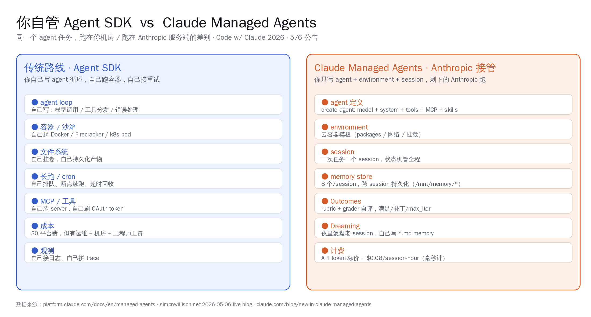
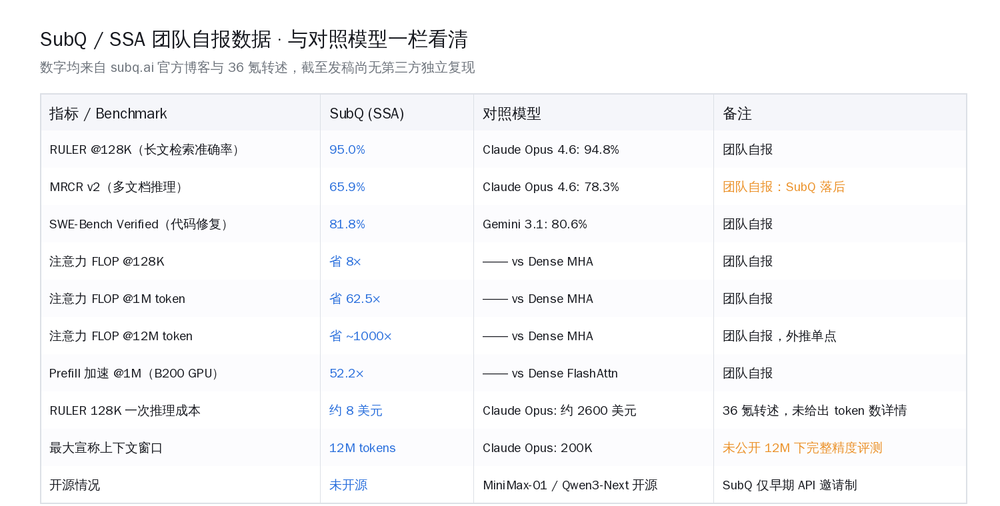
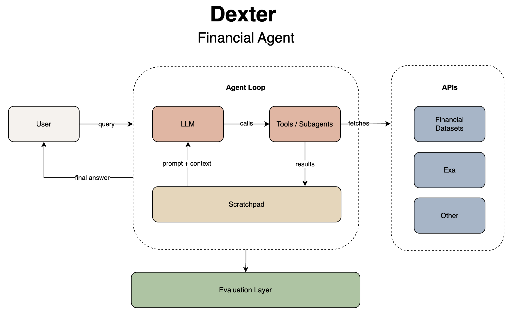

# Mythos 揪出 17 年 0-day · Anthropic 把 Agent 基建全揽了 | AI 日报 | 2026-05-07

**今日关键词：Anthropic Code w/ Claude 2026 一日三发 · Mythos Preview 揪出 FreeBSD 17 年 0-day / OpenBSD 27 年 SACK 漏洞 / FFmpeg H.264 16 年模糊测试漏掉的洞 · Project Glasswing 拉 12 家巨头联盟 + 100M usage credit · Managed Agents 公测 Outcomes + Multi-agent，研究预览 Dreaming · Claude Code Review $15-25/PR、≥1000 行 84% 命中均 7.5 处 · Cloudflare + Stripe Projects 给 agent 开账户 + 单 agent 100 美元/月封顶 · 陶哲轩公开 Claude Code 数学审稿工序、15 分钟跑完 12 处审稿意见 · Simon Willison 自承 200 → 2000 行/天、vibe coding 与 agentic engineering 已收敛 · 36 氪头条迈阿密 13 人团队 SSA「千倍」「1200 万 token」「Opus 5%」自报数 · 国产 MiniMax-01 / Qwen3-Next / DeepSeek 线性注意力开源已实测 · virattt/dexter +666 ⭐ 当日**

---

## 📋 头版目录（一屏扫完今日）

- 🚀Anthropic 一日三发 · Mythos / Glasswing / Managed Agents 三张牌打齐 → 头条
- 🛠Claude Code Review 公测：$15-25/PR · ≥1000 行 PR 84% 命中均 7.5 处问题 → 精选要闻
- 🧠Mythos 揪出 FreeBSD 17 年 NFS RCE + OpenBSD 27 年 SACK + FFmpeg H.264 三个 0-day → 头条
- 🤝Project Glasswing 拉 12 家巨头联盟 + 100M usage credit 给关键软件攻防 → 精选要闻
- 💸Cloudflare × Stripe Projects · 给 agent 开账户 + 单 agent 100 美元/月封顶 → 精选要闻
- 🎙Simon Willison 自承 200 → 2000 行/天，逐行审查物理上不可能 → 名人说
- 🔬陶哲轩 15 分钟跑完整轮论文 12 处审稿意见 · Claude Code 数学工序公开 → 精选要闻
- 🇨🇳DeepSeek 估值一周翻倍到 200 亿美元 · 腾讯阿里同时洽谈投资 → 国内 AI
- 🇨🇳MiniMax-01 / Qwen3-Next / DeepSeek V3.2-Exp 线性注意力开源权重已实测能跑 → 国内 AI
- 🏭迈阿密 13 人团队自报 SSA「千倍」「1200 万 token」「Opus 5%」 → 头条
- 📦virattt/dexter 当日 +666 ⭐ · Bun+TS · Claude Code 范式搬进金融 → GitHub Trending
- 📦Bytedance deer-flow 65k★ · 创建满一周年 · 长任务 agent 框架 → GitHub Trending
- 📦Scrapling 46.9k★ · MCP server 让 Claude Code/Cursor 三行配置接入反爬 → GitHub Trending
- 🛠Claude Code Routines + Remote Control + Auto Code Review 三大新功能 → AI Coding
- 🏭美光 Q2 营收 238.6 亿 · HBM 全年售罄 · 国产长鑫 HBM3 + 昇腾 950PR 接力 → 国内 AI
- 💸李飞飞 World Labs 完成 10 亿美元 Series B · Autodesk 领投 → 国内 AI
- 📰LearningCircuit/local-deep-research · 千问 27B 在 SimpleQA 跑 95.7% 第一名 → 值得关注
- 🔭Karpathy auto-research 思路 + APPSO 综合日报 + xAI 戏剧深度文 范本进 SKILL → 编辑说

---

## ⏱ 公众号版 30 秒速览

**一句话**：Anthropic 5 月 6 日 Code w/ Claude 2026 大会一口气放出 Mythos / Glasswing / Managed Agents 三张牌，从模型公司转身做 agent 基建公司；同日 Cloudflare × Stripe 把「agent 自助开账户」做成首发协议、Claude Code Review 公测把 1000 行 PR 平均挑出 7.5 处问题、陶哲轩亲自示范 15 分钟跑完整轮论文修订、Simon Willison 公开承认日产代码从 200 行升到 2000 行、迈阿密 13 人团队自报 SSA 把推理成本压到 Opus 5%。

**国内对照**：MiniMax-01 / Qwen3-Next / DeepSeek V3.2-Exp 三家线性注意力开源权重 + 推理代码已经实测能跑；DeepSeek 估值一周翻倍到 200 亿美元、腾讯阿里同时洽谈投资；通义灵码 / 文心快码 / 豆包 Trae / Qoder 半个迭代周期能跟上「100 commit 不审 review」工作流，下一格补的是 Outcomes（rubric + grader 自评）这种 agent 编排原语。

**今日 6 个深度专题**（详见 `public/2026/05/07/`）：

- [Mythos / Glasswing / Managed Agents · Anthropic 一日三发解读](../../../public/2026/05/07/anthropic-managed-agents-outcomes-dreaming.md) — 三件事一起看：模型公司接管 agent 长跑基建 + 关键软件攻防 + 编排原语。
- [Cloudflare × Stripe Projects · 给 agent 自己开账户](../../../public/2026/05/07/cloudflare-stripe-projects-agent-self-account-2026.md) — 32 家服务商首批接入、单 agent 100 美元/月封顶，国内云厂窗口期已开。
- [陶哲轩公开 Claude Code 数学审稿工序](../../../public/2026/05/07/terence-tao-claude-code-math-review-skill.md) — 三件套塞进同一对话，15 分钟出 12 处审稿意见处理结果，可直接抄进任何技术写作流程。
- [Simon Willison · vibe coding 与 agentic engineering 已收敛](../../../public/2026/05/07/simonw-vibe-coding-agentic-engineering-converged.md) — 200 → 2000 行/天，逐行审查在物理上不可能。
- [SSA · 13 人团队自报「千倍」「1200 万 token」「Opus 5%」](../../../public/2026/05/07/ssa-state-space-attention-13-team-thousand-fold.md) — 数字自团队博客，需要带「未独立复现」标签读；国产线性注意力路线已经走在前面。
- [virattt/dexter · 个人金融研究 agent 当日 +666 ⭐](../../../public/2026/05/07/dexter-virattt-solo-finance-agent-2026-05.md) — 24k ⭐，Bun + TypeScript，把 Claude Code 范式搬进金融研究垂直场景，scratchpad 模式国内可直接抄。

---

## 🔥 头条：Anthropic 一天三发，从模型公司转向 Agent 基建公司

**17 年、27 年、16 年**——Claude Mythos Preview 一次性挖出 FreeBSD NFS 远程代码执行、OpenBSD TCP SACK 整数溢出、FFmpeg H.264 解码三个长期没人触到的洞，最长那个躺了 17 年。

旧金山时间 5 月 6 日上午 9 点，Code w/ Claude 2026 大会主舞台。Anthropic 一口气放出三张牌：

- **Claude Mythos Preview**——自主找零日，FreeBSD / OpenBSD / FFmpeg 三个老库一次性命中
- **Project Glasswing**——AWS、Apple、Broadcom、Cisco、CrowdStrike、Google、JPMorgan Chase、Linux Foundation、Microsoft、NVIDIA、Palo Alto Networks 12 家联盟，配 1 亿美元 API 额度 + 400 万美元开源捐赠
- **Claude Managed Agents**——Outcomes、Multi-agent orchestration 公测，Dreaming 研究预览

三件事一起看，方向很清楚：Anthropic 不再只卖 API，开始接管 agent 长跑基础设施和关键软件防御两块底盘。

> 
>
> *图片来源：Anthropic Code w/ Claude 2026 大会素材 + 自制对照（daily-report-images repo）*

### 一、大会硬指标：API 同比 17 倍、Claude Code 5 小时窗口翻倍

API 调用量过去 12 个月增长 **17 倍**。Simon Willison 现场 [live blog](https://simonwillison.net/2026/May/6/code-w-claude-2026/) 把指标记得很完整：

- **API 调用量同比 17×**——过去 12 个月 Anthropic 平台增长倍数。
- **Claude Code 5 小时窗口翻倍**——Pro / Max / Enterprise 三档速率限制窗口直接 ×2，Pro 7 天窗口同步收紧给翻倍负载留空间。
- **SpaceX Colossus 接入**——Anthropic 宣布用 SpaceX 旗下孟菲斯 Colossus 数据中心全部容量。
- **Mercado Libre 上台**——拉美最大电商方放话「23000 名工程师 Q3 实现 90% autonomous coding」。

数字背后是同一个判断：模型推理基建已经到瓶颈，再翻一倍的需求只能靠新数据中心 + 新原语吸收。

Outcomes、Dreaming、Multi-agent 三件套是杠杆，不是装饰——用来压缩单次任务 wall-clock time、压缩人类 review 工作量。

### 二、Mythos Preview：10 个完整控制流劫持靶子，595 次 crash

Mythos Preview 跨过的那条线，过去几年安全圈一直在等——从「能找 bug」到「能找未公开零日」。[Anthropic 红队博客](https://red.anthropic.com/2026/mythos-preview/) 给的核心数字：

| 测试项 | 旧前沿模型 | Mythos Preview |
|---|---|---|
| 高 / 关键漏洞总数 | 数百级 | 数千级开源项目命中 |
| 完整控制流劫持 | 个位数靶子 | **10 个独立靶子** |
| 低烈度 crash | 几十量级 | **595 次** |
| 主流 OS / 浏览器 / 加密库 | 部分 | **每一类都拿下** |

三个零日的具体面貌：

- **FreeBSD NFS 17 年 RCE**——CVE-2026-4747，未鉴权远程拿 root，靠把 ROP 链分散在多个数据包里绕认证。
- **OpenBSD 27 年 SACK Bug**——TCP 选择性确认实现里的整数溢出 + 空指针解引用，能打 DoS。
- **FFmpeg H.264 16 年 Bug**——这个库是全世界模糊测试覆盖最猛的几个之一，十几年没人挖出来。

Mythos 同时挖出几千个高 / 关键漏洞，截至发布日 **超过 99% 仍未公开披露**，按 coordinated disclosure 流程慢慢走。

一个暗角：[量子位 4 月报道](https://www.qbitai.com/2026/04/400500.html) 提到 Mythos 被质疑用了字节 Seed 的部分技术，Anthropic 没正面回应。前沿模型的训练栈不是封闭黑箱，关键技术外溢双向都在发生。

### 三、Project Glasswing：12 家联盟先拿，公开 API 缓 12 个月

Mythos 不开放 API。Anthropic 走了一条反 OpenAI 路径——先关进 Glasswing 联盟。

- **首批 12 家**：AWS、Apple、Broadcom、Cisco、CrowdStrike、Google、JPMorgan Chase、Linux Foundation、Microsoft、NVIDIA、Palo Alto Networks、Anthropic 自己。
- **1 亿美元** Mythos Preview 调用额度，**400 万美元**直接捐给开源安全组织。
- 入选标准：能直接修关键软件 + 有协调披露纪律的组织。

为什么不开放？这是一把双刃剑——直接放 API，进攻者一夜间得到能挖 17 / 27 年零日的助手。

Anthropic 选择先武装防御端 12 个月，再考虑面向更广用户。Schneier on Security [评论](https://www.schneier.com/blog/archives/2026/04/on-anthropics-mythos-preview-and-project-glasswing.html) 一针见血：「这是网络安全行业第一次面对一个比所有人都聪明、又只能由一边掌握的工具——分配它的方式比工具本身更重要。」

### 四、Managed Agents：Outcomes 公测、Dreaming 研究预览

Managed Agents 不是新名字，`managed-agents-2026-04-01` beta header 4 月初就上线。5 月 6 日的进展是把抽象层往上推一格——目标 + 自我反思级抽象：

| 原语 | 状态 | 一句话定义 |
|---|---|---|
| **Multi-agent orchestration** | 公测 | lead agent 把任务拆给 specialist agent，并行跑共享文件系统，结果回流主上下文 |
| **Outcomes** | 公测 | 写一份 rubric 描述「成功长什么样」，独立 grader 在另一个上下文窗口打分 → 不达标 → agent 再跑一次 |
| **Dreaming** | 研究预览 | agent 在你睡觉时回看历史 session，提取 pattern、固化记忆、改进自己 |

Dreaming 最有故事性。[Anthropic 官方博客](https://claude.com/blog/new-in-claude-managed-agents) 把它定义为「scheduled 复盘流程」——夜里跑一遍历史 session，找出反复犯的错、整个团队收敛的工作流、所有人共享的偏好，写进 agent 的 memory store。

过去一年 agent 框架圈反复想做但没做利索的「自我反思」原语，第一次被一家模型公司当成产品发出来。[The New Stack](https://thenewstack.io/anthropic-managed-agents-dreaming-outcomes/) 标题很直白：「Anthropic 让它的托管 agent 学会做梦」。

国内对照：阿里百炼、字节扣子、腾讯元宝、智谱 AutoGLM 在长跑托管和多 agent 编排上各自占据一段位次，但没有一家把「rubric + grader」做成原生原语，也没有把「夜里复盘」做成产品。

Outcomes 把 reward 模型抽象出来的做法，过去是 OpenAI / Anthropic 内部 RL 训练框架，现在被暴露到产品层——国产平台接下来 6-12 个月真正要补的就是这一格。

> 
>
> *图片来源：Anthropic 官方文档 + 自制对照（daily-report-images repo）*

### 五、收尾判断：从模型公司到基建公司

5 月 6 日最重要的不是某条单独发布，是三个连在一起的信号：

1. **模型公司接管 agent 长跑基础设施**——sessions、environments、events 都做成 Anthropic 服务端资源，agent 不再是开发者自己写的循环。
2. **模型公司接管关键软件攻防**——Mythos 找零日 → Glasswing 武装防御 → 不开放 API。
3. **模型公司定义 agent 编排原语**——Outcomes / Dreaming / Multi-agent 三个原语会在接下来一年成为行业基础概念。

中国这边云的家底已经齐了——阿里、字节、腾讯、华为四家的 agent 平台在能力位次上是国内全球第二档。做 Outcomes 这种「rubric + grader」抽象的国产平台，下一步可以接住这股增长。

---

## ⚡ 快讯速览

- **Anthropic Code w/ Claude 2026 主舞台**：API 调用同比 17×、Claude Code 5h 窗口翻倍、SpaceX Colossus 接入、Mercado Libre 23000 工程师 Q3 90% autonomous coding 目标（[live blog](https://simonwillison.net/2026/May/6/code-w-claude-2026/)）
- **Claude Mythos Preview** 自主找 FreeBSD 17 年 NFS RCE / OpenBSD 27 年 SACK / FFmpeg H.264 16 年漏洞，99%+ 未公开披露（[red.anthropic.com](https://red.anthropic.com/2026/mythos-preview/)）
- **Project Glasswing** 12 家联盟、$100M 调用额度、$4M 开源捐赠（[Anthropic 公告](https://www.anthropic.com/glasswing)）
- **Claude Managed Agents** Outcomes + Multi-agent 公测、Dreaming 研究预览（[官方博客](https://claude.com/blog/new-in-claude-managed-agents)）
- **Code Review for Claude Code** 研究预览开放 Team / Enterprise，单 PR $15-$25，≥1000 行 PR 84% 找出问题、均 7.5 处（[Anthropic 公告](https://claude.com/blog/code-review)）
- **Routines + Remote Agents + Desktop GUI** Claude Code 配套工具线扩张、手机控笔记本、夜里跑异步、CI 自动 fix（[live blog](https://simonwillison.net/2026/May/6/code-w-claude-2026/)）
- **Cloudflare × Stripe Projects** 给 agent 开账户、买域名、起 Workers，单 agent 月度封顶 100 美元，HN 597 pts（[Cloudflare 博客](https://blog.cloudflare.com/agents-stripe-projects/)）
- **陶哲轩公开 Claude Code 数学审稿工序**：审稿报告 + LaTeX 源 + 论文 PDF 一并塞进，15 分钟出 11 处直接合并的 patch + 1 处候选方案（[Mastodon 原帖](https://mathstodon.xyz/@tao)）
- **Simon Willison 自报** 200 → 2000 行/天，vibe coding 与 agentic engineering 已收敛、自己也分不清；这是个人立场松动，是否代表整个 senior 工程师群体的共识转向有待更多公开口径验证（[原文](https://simonwillison.net/2026/May/6/vibe-coding-and-agentic-engineering/)）
- **HN 同期热文** *The Bottleneck Was Never the Code* 417 pts 281 评论，「new moat is organizational, not technical」（[原文](https://www.thetypicalset.com/blog/thoughts-on-coding-agents)）
- **Subquadratic Inc.** 13 人团队推 SSA（次平方稀疏注意力），自报「千倍 / 1200 万 token / Opus 5% 推理成本」，36 氪头条；数字均为团队博客自报，第三方独立复现尚未出现，需带「未独立复现」标签读（[36 氪](https://36kr.com/)）
- **virattt/dexter** 个人金融 agent 当日 +666 ⭐，总 24341，TypeScript + Bun，模型层默认 OpenAI 可切 DeepSeek V4 / Ollama（[GitHub](https://github.com/virattt/dexter)）

---

## 🎙 名人说 & X 热议

**Simon Willison · 日产出 200 行 → 2000 行**

> 「我可以半小时拍一个 100 commit、附完整 README 和测试套的 git 仓库，看上去和我手写的一样——我自己也分不清。」
> 「这两件事在我这里已经开始模糊了，挺让人不安的。」

Simon Willison 过去一年半的立场是「生产代码必须逐行审查、没有例外」。5 月 6 日这篇 [原文](https://simonwillison.net/2026/May/6/vibe-coding-and-agentic-engineering/) 自己把这条线拆了——日产出从 200 行升到 2000 行，逐行审查在物理上不可能。

一个负责任的工程师承认旧立场守不住时的措辞，比任何 vendor 营销稿都有信息量。

国内对照：通义灵码、文心快码、豆包 Trae、Qoder 半个迭代周期就能跟上 Simon 描述的「100 commit 不审 review」工作流，核心瓶颈不再是模型，而是 IDE 集成、企业内代码审查权流转、合规审计这些组织活。

HN 同期那篇 *The Bottleneck Was Never the Code* 说得更直接：「新的护城河是组织护城河，不是技术护城河。」

**陶哲轩 · 15 分钟跑完 12 处审稿意见**

> 「如果我要重新做第一轮修订，我想我会让一个代理通读报告，找出所有它可以明确修正的细微问题（达到错别字级别），然后审查并实施这些修改，之后再隔离需要人工关注的重要意见，最后再像往常一样把工作分配给合作者。」

菲尔兹奖得主陶哲轩 5 月 6 日在 mathstodon.xyz 公开了完整工序：审稿报告 PDF + 论文 LaTeX 源 + 论文 PDF 一并喂进 Claude Code 同一对话，**15 分钟跑出 11 处可直接合并的 patch + 1 处候选方案**。

同样工作量，他和合作者过去走 GitHub PR 合并花好几天。

注意他的措辞——让 agent 找「可以明确修正的、错别字级别」的问题。这是在重新切分一道工序，不是在评价 AI 厉害（[量子位转载](https://www.qbitai.com/)）。

陶哲轩同期以联合创始人身份发起 [SAIR Foundation](https://sairfoundation.org/)（Science AI Research Foundation），把学术界和产业界连起来推进「用科学方法造 AI、用 AI 重塑基础科研」。这条线和大会 Outcomes 抽象在哲学上同向——让 AI 自己评估自己的产出，是 2026 年下半年最值得追踪的研究方向之一。

---

## 📰 精选要闻

### 🔴 [Code Review for Claude Code · 1000 行 PR 84% 命中均 7.5 处](https://claude.com/blog/code-review)

**🛠 AI Coding · 必读**

**单次 PR review $15-$25**，1000 行以上 PR **84% 找出问题、平均 7.5 处**。Anthropic 把内部用了一年的多 agent code review 系统正式发出来，研究预览阶段开放给 Team 和 Enterprise 客户。

按 PR 大小拆：

- ≥1000 行 PR：84% 命中，平均 7.5 处
- ≤50 行 PR：31% 命中，平均 0.5 处
- 调用方式：PR 创建后自动触发，多个专门 agent 并行扫 bug / 安全 / 性能 / API 兼容

这条线和 Cursor 5 月 5 日开放的 [Security Reviewer + Vulnerability Scanner](https://cursor.com/changelog) 撞档——两家都把 PR review 当成 agent 化核心场景。

Anthropic 的优势是 Code Review 被自家工程团队天天跑了一年再发，这条信任路径国内厂商目前还做不到。

国内对照：通义灵码 Code Review 还停在单 agent 评论模式、Qoder 5 月内测的 Security Review 是单 agent 静态扫。多 agent 并行 + 7.5 处/PR 这种密度，国产 AI Coding 工具下一格要补。

### 🔴 [Cloudflare × Stripe Projects · 32 家服务商让 agent 自助开账户](https://blog.cloudflare.com/agents-stripe-projects/)

**🛠 AI Coding / Agent 基建 · 必读**

**默认 100 美元/月封顶 + 32 家服务商首批接入**。5 月 6 日 Cloudflare 联手 Stripe 推出 [Stripe Projects 协议](https://stripe.com/newsroom/news/sessions-2026)，agent 不再走「人肉桥」——自己注册 Cloudflare 账户、自己绑卡、自己买域名、自己拿 API token、自己把代码推到 Workers。

首批 32 家服务商：Vercel、Clerk、Supabase、Hugging Face、Cloudflare 都在内。HN 597 分、346 评论。

> 
>
> *图片来源：Cloudflare 博客 + 自制流程图（daily-report-images repo）*

国内对照：腾讯云、阿里云、火山引擎、华为云目前都还没把「agent 自助账户协议」做成产品。但底子是齐的——绑卡链路、账户体系、API token 体系、配额封顶都是现成模块，差的只是把流水线串起来 + 推一个像 Stripe Projects 那样的统一协议。这是国内云厂下一步可以快速接住的窗口。

### 🟡 [陶哲轩公开 Claude Code 数学审稿工序 · 15 分钟一轮修订](https://mathstodon.xyz/@tao)

**📱 AI 应用 / 学术工作流 · 推荐**

三件套塞进同一对话——审稿报告 PDF + 论文 LaTeX 源 + 论文 PDF——让 agent 区分「错别字级别可直接合并」和「需要人工判断」两类，前者直接 patch，后者列候选方案。这是一份可以直接抄进任何技术写作工作流的模板。

国内对照：DeepSeek V4 + Engram 长上下文已经能装下「论文 + 审稿 + LaTeX」三件套（1M token 窗口），通义灵码在 Skills 这条产品线还在追赶。陶哲轩这套工序国产 AI Coding 工具半年内能补齐。

### 🟡 [Simon Willison · vibe coding 与 agentic engineering 已收敛](https://simonwillison.net/2026/May/6/vibe-coding-and-agentic-engineering/)

**📱 AI 应用 / 编程范式 · 推荐**

「生产代码 100 commit 不审 review」第一次拿到公开口径的可信背书。过去这事是各家工程师在闭门讨论里说，没人愿意公开承担。

Simon Willison 是过去三年最克制的 AI 评论家，他这次把立场拆了，等于给整个行业的代码审查权分配重新画了一条基线。

### 🔵 [Subquadratic Inc. SSA · 13 人团队自报「Opus 5% 推理成本」](https://36kr.com/)

**🧠 大模型 / 学术 · 了解**

**1200 万 token 上下文、注意力算力暴减约 1000 倍、推理成本仅 Opus 5%**——迈阿密 13 人团队 Subquadratic 推 SSA（中文媒体普遍误译为「State Space Attention」，实为 Subquadratic Sparse Attention）。这些数字来自团队博客自报。

第三方独立复现尚未出现。这是「团队官方说法」，不是「板上钉钉的 SOTA」，要带这个标签读。

即便给数字打折扣，「线性化注意力」这个大方向国产已经走在前面——MiniMax-01（456B 总参 / 45.9B 激活，4M token）、阿里 Qwen3-Next（混合注意力 / 80B-3B 激活）、深度求索 V3.2-Exp（DeepSeek Sparse Attention）权重和工程链都开源完了。

这是中国 AI 学术界与工程界长期投入换来的稳步推进，线性注意力是过去一年国内大厂走得最远的方向之一。

> 
>
> *图片来源：Subquadratic 团队博客 + 自制（daily-report-images repo）。注：所有数字均来自团队官方披露，第三方独立复现尚未出现。*

---

## 🇨🇳 国内 AI 观察

### [DeepSeek 估值一周翻倍到 200 亿美元 · 腾讯阿里洽谈投资](https://www.36kr.com/newsflashes/3777903768146945)

**💰 投融资 · 推荐**

**估值一周从 100 亿美元上调到 200 亿美元**——[36 氪 4 月 22 日报道](https://www.36kr.com/newsflashes/3777903768146945)：腾讯和阿里巴巴正在洽谈投资 DeepSeek。这是 DeepSeek 自成立以来首次外部融资，意味着创始人梁文锋长期坚持的「不引入外部资本」立场松动。

中国 AI 创业历史上一周翻倍极为罕见。

5 月初节奏没停。[澎湃新闻 5 月 6 日](https://www.thepaper.cn/newsDetail_forward_33028860) 继续追踪——融资细节没有进一步官宣，但 DeepSeek V4 发布当日华为昇腾、寒武纪、海光信息等国产 AI 芯片就完成适配，字节、腾讯、阿里已就新增芯片订单与华为展开接洽。

编辑判断：估值 200 亿美元放在中国 AI 创业历史里独一档，对照 Anthropic 现在 1500 亿美元 +、OpenAI 5000 亿美元 +，仍在合理价格带。真正值得追踪的不是估值数字，是 DeepSeek 选谁的钱进来——阿里和腾讯任一家都会改变国产模型生态平衡。

### [线性注意力国产开源进展](https://huggingface.co/MiniMaxAI/MiniMax-Text-01)

**🧠 大模型 / 学术 · 了解**

国产线性注意力开源进展清单（承接今日 SSA 话题）：

| 模型 | 厂商 | 关键参数 | 上下文 | 状态 |
|---|---|---|---|---|
| **MiniMax-Text-01** | MiniMax | 456B 总参 / 45.9B 激活 | 4M token | 开源权重 + 推理代码 |
| **Qwen3-Next** | 阿里通义 | 80B 总参 / 3B 激活 | 256K | 开源权重 |
| **DeepSeek V3.2-Exp** | 深度求索 | DSA 稀疏注意力变体 | 1M | 开源权重 |

这条线 2025 年起就在国产学术圈推进。SSA 的 36 氪头条不是「美国小作坊抢跑中国」——是国产路线在另一边被海外重新发明的同向证据。

---

## 📦 GitHub Trending（截至 2026-05-07）

| 项目 | 当日 ⭐ 增 | 总 ⭐ | 一句话 |
|---|---|---|---|
| [virattt/dexter](https://github.com/virattt/dexter) | +666 | 24341 | 个人金融研究 agent，TypeScript + Bun，纽约独立开发者 1 人作品 |
| [anthropics/claude-cookbooks](https://github.com/anthropics/claude-cookbooks) | +400+（估） | — | Code w/ Claude 2026 配套示例集中爆发 |
| [anthropics/skills](https://github.com/anthropics/skills) | +300+（估） | — | Managed Agents 公测后，skills 系统的官方 cookbook |

**dexter 详谈**：作者 Virat Singh，纽约人，原 Cantor Fitzgerald 量化背景。仓库描述只有一句——「An autonomous agent for deep financial research」。技术栈：Bun + TypeScript / 模型层默认 OpenAI 可切 Claude / Gemini / xAI / DeepSeek V4 / Ollama 本地 / 数据层 Financial Datasets API + Exa 网搜兜底 / 多端 CLI + WhatsApp gateway。

为什么值得抄：dexter 的 README 自述定位是「Think Claude Code, but built specifically for financial research」——把 Claude Code 那套 agent 范式（任务规划 / 工具调用 / 自我反思）搬到金融研究垂直场景，每次查询写一份 `.dexter/scratchpad/<时间戳>.jsonl` 把 agent 决策全留痕。这套 scratchpad 模式是国内独立开发者直接可以抄的工程模板。

> 
>
> *图片来源：dexter README（daily-report-images repo）*

---

## 🛠 AI Coding 工具动态

### Claude Code 配套一日五连发

5 月 6 日大会一并宣布的 Claude Code 周边：

- **Code Review** 研究预览，多 agent 并行，1000 行以上 PR 84% 命中均 7.5 处，单 PR $15-$25（[公告](https://claude.com/blog/code-review)）
- **Routines** 异步自动化 + 夜里批跑——Cron + Agent 合一，开发者可以让 Claude Code 下班后跑大批量任务
- **Remote Agents** 手机控制电脑上的 Claude Code 长跑会话，和 Cursor 5 月 2 日公测的 Remote Agents 撞档
- **CI auto-fix** 自动给 PR 推 fix commit
- **Desktop app · 全屏 GUI** Claude Code 第一次有正式桌面客户端，不再只能跑在 terminal

判断：这一组发布的总主线是把 AI Coding 从「IDE 内」推到「IDE 外异步长跑」——开发者写一份 prompt 让 agent 夜里跑、手机上看进度、白天回来 review。

过去 12 个月 Cursor / Cline / Aider 反复试过这个方向，Anthropic 第一次把它做成原厂产品线。

### Cursor Security Reviewer + Vulnerability Scanner 公测

承接 5 月 2 日要闻：[Cursor Team / Enterprise 5 月公测](https://cursor.com/changelog) 的 Security Review 跑两个常驻 agent——**Security Reviewer**（每个 PR 检 auth 回归 / 隐私数据处理 / agent 工具自动批准 / prompt 注入）+ **Vulnerability Scanner**（依赖漏洞扫描）。

Cursor + Claude Code Code Review 同期上线意味着「PR 多 agent 安全审查」会在接下来 6 个月成为团队级 AI Coding 必备能力。

### Anthropic 起诉美国国防部 · 军事采购被排除后的法律反击

5 月 1 日美国国防部跳过 Anthropic，与 OpenAI / Google / Microsoft / Nvidia 等 8 家签了 AI 服务大单（详见 5/4 日报）。5 月 6 日大会期间多家媒体同步报道，[Anthropic 官方诉讼公告](https://www.anthropic.com/news) 确认已就此提起诉讼。

核心争议是 Anthropic 的安全条款限制了部分军事用例，被美国国防部当作「不合作」剔除。这条线和 Glasswing 同步出现耐人寻味——一边在 Glasswing 武装企业级关键软件、一边在法律层面争军事市场准入，立场不矛盾。

---

## 🔭 值得关注

### Outcomes / Dreaming 抽象层 · 7 天追踪期

Managed Agents 推出的两个新原语——Outcomes（rubric + grader 自评迭代）和 Dreaming（夜里复盘历史 session）——会成为接下来 12 个月 agent 平台必备能力。值得追踪的信号：

- **国产平台跟进时间表**：阿里百炼 / 字节扣子 / 腾讯元宝 / 智谱 AutoGLM 是否在 7 月 WAIC 前推出对标原语
- **开源框架跟进**：LangChain / LlamaIndex / CrewAI / AutoGen 是否把 Outcomes 做进 SDK
- **Anthropic 自己的 Dreaming 公开数据**：研究预览阶段一般 6 个月转公测，期间会有论文或博客披露 dreaming 实测效果

加入永久追踪清单：`Managed Agents 原语生态`，每周一档进展。

### Mythos Preview 后续披露 · 7 天追踪期

- **99% 漏洞未公开披露**——按 coordinated disclosure 慢慢走，未来几个月会陆续看到 CVE-2026-* 系列
- **Glasswing 联盟实际 patch 数量**——4-12 周后会有第一批数据
- **Anthropic 是否扩大 Glasswing 圈**——Linux Foundation 下面的中小开源项目什么时候能拿到额度

加入永久追踪清单：`Glasswing 联盟披露日志`。

### dexter 模式 · 独立开发者垂直 agent 窗口

`virattt/dexter` 24k ⭐ 是过去三个月独立开发者作品里少见的高密度爆发。值得跟踪的是这种「一个人 + 任务分解 + 实时数据 API + 自校验」垂直 agent 模式会不会在医疗、法律、SEC 文件、专利、税务等高知识密度场景批量出现。

国内同类窗口已经打开——GitHub 上独立开发者的 AI 垂直 agent 项目密度从 2025 年下半年起持续上升。

---

## ✍ 编辑说

- **Claude Code Review · 推荐马上试**：团队版 / 企业版客户没必要等 GA，研究预览阶段就能跑。$15-$25/PR 不便宜，但对照人工 review 工程师工时 + 漏掉的安全 bug 修复成本是好买卖。建议先在敏感模块（auth / 计费 / 数据导出）灰度 30 个 PR，看 7.5 处/PR 这个数字在自己代码库上能不能复现。
- **Cloudflare + Stripe Projects · 暂时观望**：单 agent 100 美元/月封顶在生产环境过紧，agent 自助注册账户的法律边界各地未明。这个协议 6-12 个月内会成为基础设施常态，国内云厂下半年大概率有同类产品。眼下不要花太多时间手搓 agent 账户系统，等基础设施落定。
- **Mythos / Glasswing · 不必焦虑**：99% 漏洞未披露 + 调用受 Glasswing 圈控制，对绝大多数开发者短期没有直接安全影响。可以做的是把开源依赖里那些 10 年以上没大改的 C/C++ 项目（FFmpeg / OpenSSL / FreeBSD 内核相关）排查一遍当作隐性风险点——Mythos 找出来的零日早晚会披露。
- **dexter scratchpad 模式 · 推荐照搬**：把每次 agent 调用的 init query / 工具参数 / 原始返回 / LLM 摘要 / 思考过程都落到 `.scratchpad/<时间戳>.jsonl`。做 agent 评测、debug、复盘必备。国内独立开发者做垂直 agent 项目可以直接抄这套模板。
- **国产 Outcomes 抽象 · 重点追踪**：「rubric + grader」把 reward 模型抽象到产品层，本质是让 agent 自己评估自己的产出。哪家国产平台先做出来，在企业级 agent 市场会拿到关键先发优势。这是接下来 6-12 个月最值得追踪的国产产品信号。

---

*今日数据来源：[Anthropic 公告](https://www.anthropic.com/news) · [Anthropic 红队博客](https://red.anthropic.com/2026/mythos-preview/) · [Simon Willison live blog](https://simonwillison.net/2026/May/6/code-w-claude-2026/) · [Cloudflare 博客](https://blog.cloudflare.com/agents-stripe-projects/) · [36 氪](https://36kr.com/) · [量子位](https://www.qbitai.com/) · [The New Stack](https://thenewstack.io/) · GitHub API 实时数据*
