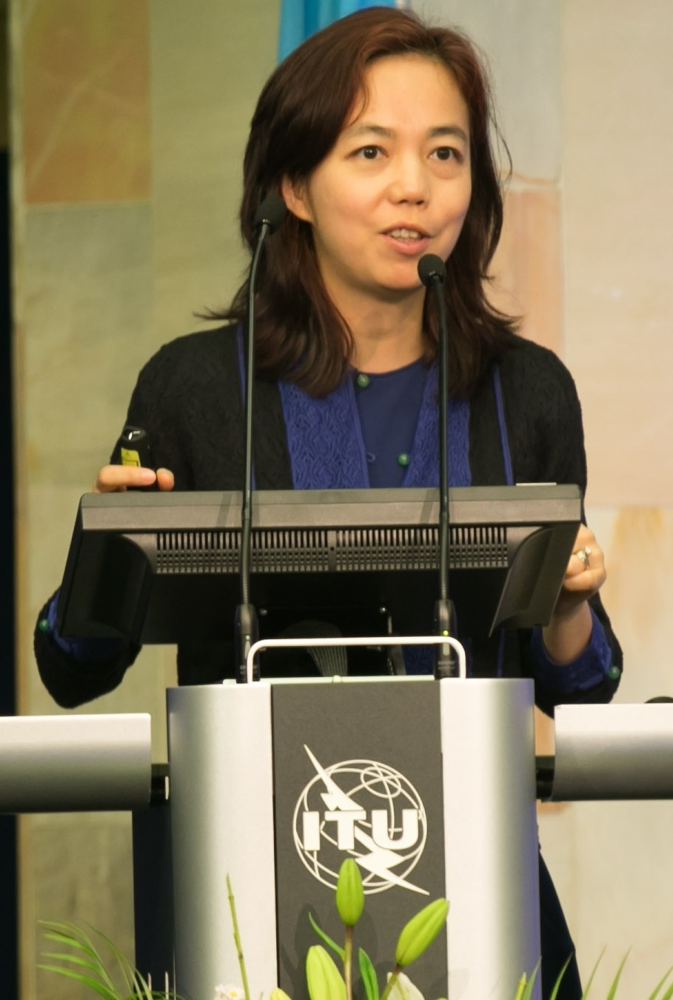
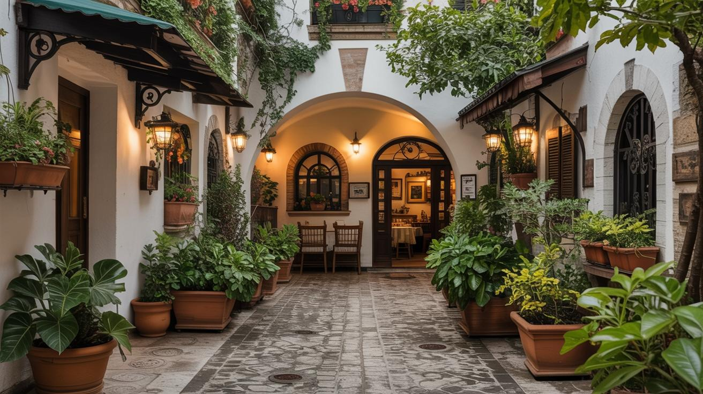
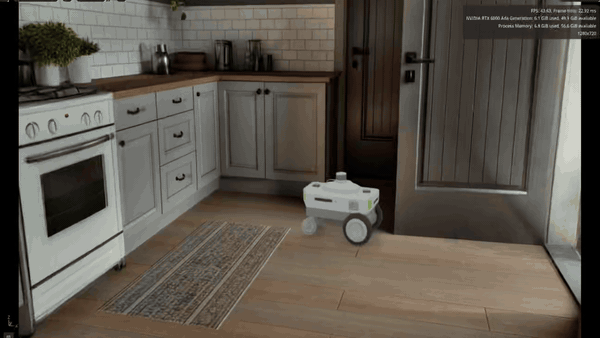
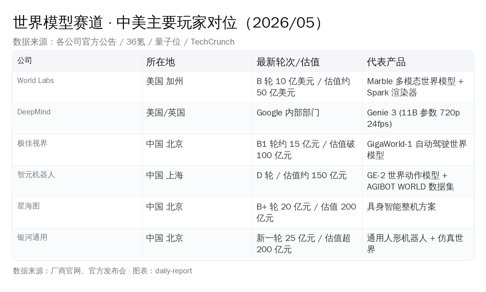

# 李飞飞拿到 10 亿美元，把 World Labs 估值推到 50 亿

2026 年 2 月 18 日，李飞飞旗下 World Labs 官宣 Series B 完成融资。媒体早期传闻是「最高 4-5 亿美元、估值约 50 亿」，公告真实数字翻了一倍：**10 亿美元、由 Autodesk 单笔投入 2 亿领投，NVIDIA、AMD、Emerson Collective、Fidelity、Sea 跟投**。同一份 Bloomberg / TechCrunch 报道里，公司没有正式确认估值，但此前一个月内多家媒体已披露目标估值约 50 亿美元——较 2024 年 7 月的 10 亿估值翻了 5 倍。

**这篇要说一件事**：李飞飞把"空间智能"（Spatial Intelligence）抬上和 LLM 平起平坐的位置，并用一笔 10 亿美元资金在硅谷立桩；几乎同一周，中国的极佳视界拿到约 15 亿元 B1 轮、星海图收 20 亿元 B+ 轮、智元放出 GE-2 世界动作模型。世界模型这条路，国内不是观望者，是同一时间在卡位。下面把数字、技术内涵、国内对位三件事讲透。

## 一、数字先讲清楚：10 亿不是 4 亿，估值不是 70 亿

国内最近一周关于 World Labs 的中文报道里，几个数字反复混用——有写 4 亿的，有写 5 亿的，有写 10 亿的，估值有写 50 亿、有写 70 亿、有写"独角兽（10 亿）"的。本文采用 Bloomberg、TechCrunch、CGTN、华尔街见闻多源核对后的最终口径，只引官方公告 + 一致来源覆盖的数字。

### 1.1 这一轮的官方数字

| 维度 | 数值 | 来源 |
|---|---|---|
| 融资金额 | **10 亿美元**（Series B） | World Labs 官博 / Bloomberg / TechCrunch 2026-02-18 |
| 领投方单笔 | Autodesk **2 亿美元** | TechCrunch / Autodesk 公告 |
| 跟投方 | NVIDIA / AMD / Emerson Collective / Fidelity / Sea | Bloomberg |
| 公开估值 | 公司未正式确认，**目标估值约 50 亿美元** | 1 月 36氪 / 量子位 / Bloomberg 报道 |
| 公司成立 | 2024 年 4 月 | World Labs 官网 |
| 累计融资（含本轮） | 约 12.3 亿美元 | 累计：种子 + A + B |

**注意**："目标估值约 50 亿美元" 是融资过程中市场预期，公司没有官宣最终 post-money 数字。本文采用「估值约 50 亿」表述，如后续公司披露不同口径，以官方为准。

### 1.2 全部融资史（2024-2026）

| 时间 | 轮次 | 金额 | 估值 | 领投 |
|---|---|---|---|---|
| 2024 年 4 月 | Seed + A | 约 2.3 亿美元 | 约 10 亿美元（独角兽） | a16z + Radical Ventures + NEA |
| 2026 年 2 月 | Series B | 10 亿美元 | 约 50 亿美元（目标） | Autodesk |

20 个月，估值从 10 亿到 50 亿，翻 5 倍。期间公司没有 GA 大模型 API、没有上市公司客户、没有营收披露——估值定价定的是"空间智能这条赛道几年后值多少钱"，不是"World Labs 今天能挣多少钱"。

### 1.3 跟投名单的看点

跟投名单里两个名字值得拎出来。

第一个是 **Autodesk**。它单笔 2 亿，量级仅次于 NVIDIA 在历史上对 Anthropic / OpenAI 的下注。Autodesk 是全球建筑、工程、制造、影视的 3D 设计软件龙头（AutoCAD / Maya / 3ds Max / Revit），它下注 World Labs 的逻辑很直接——3D 内容生产是它的主战场，Marble 把 3D 场景生成成本砍到接近零，要么是颠覆它的现有业务，要么变成它的下一代产品底座。Autodesk 选了后者。

第二个是 **Sea Group**。东南亚电商 + 游戏巨头（Shopee / Garena 母公司）。Sea 的出现说明世界模型已经被当作下一代游戏 / 虚拟空间的基础设施在投。这条线如果走通，对国产游戏出海是利好——国内米哈游、网易、字节都有相似的 3D 内容工业化需求。

## 二、空间智能 vs LLM 是分歧路线，不是产品 SKU 之争

要看懂为什么市场愿意给 World Labs 50 亿估值，要先看懂"空间智能"这条路在技术上和 LLM 是什么关系。

### 2.1 李飞飞的 Manifesto 抓的是什么

2025 年 11 月，李飞飞在自己的 Substack 发了《From Words to Worlds: Spatial Intelligence is AI's Next Frontier》。这篇文章定义了"空间智能"这个标签的内涵——它**不是** LLM 的延伸，**不是**多模态大模型给 LLM 加视觉，而是另一种范式：

- LLM 范式：以文本（words）为操作对象，预测下一个 token，世界被"压平"成符号序列
- 空间智能范式：以三维世界（worlds）为操作对象，模型必须理解、生成、预测、与几何上和物理上一致的环境交互

按李飞飞的提法，真正的空间智能 = 世界模型（World Model），需要三种核心能力：

1. **像讲故事的人那样创造**（Generation）——能从文本 / 图像 / 视频生成 3D 场景
2. **像急救人员那样导航**（Navigation）——能在生成的世界里持续移动并保持一致性
3. **像物理学家那样推理**（Reasoning）——理解物体永久性、重力、碰撞、光照

这套定义野心很大，把 LLM 的整个范式定位成"第一代 AI 的语言子集"，把 World Labs 自己摆在"第二代 AI 的世界子集"的卡位。

### 2.2 Marble 是这套理论的第一张产品答卷

2025 年 11 月，World Labs 发布 Marble——他们的第一个商业化世界模型产品。Marble 的技术规格如下：

| 维度 | Marble 能力 |
|---|---|
| 输入模态 | 文本 / 单图 / 多图 / 视频 / 3D 草图（通过 Chisel 工具） |
| 输出格式 | Gaussian splat（最高保真） / 三角网格 mesh / 物理碰撞 mesh / 视频 |
| 编辑能力 | AI 原生编辑（移除物体 / 改风格 / 改结构） + Chisel 混合 3D 编辑器 |
| 场景持续性 | 持久（persistent）、可重入、可扩展（"world expansion"） |
| 渲染器 | Spark：开源 THREE.js Gaussian splat 渲染器（MIT 许可） |
| 商业化 | 免费层 + 付费层（marble.worldlabs.ai） |

Marble 跟传统 3D 内容生成（比如 NeRF / 3D Gaussian Splatting 的早期工作）不同的地方有三个：

1. **输入端打通了文本** —— 你可以说"一个被藤蔓爬满的废弃修道院庭院"，模型直接生成；之前的 NeRF 类工作必须先有大量真实拍摄
2. **持久一致性** —— 你"走进"场景再"走回来"，看到的是同一个场景，不是每次重新采样
3. **可编辑性** —— Chisel 让用户先"搭骨架"再让 AI 填细节，把 3D 创作者从纯粹的 prompt 玩具拉回到工业流程

这三点合起来才叫"商业化产品"，不是 demo paper。

### 2.3 同代选手：Genie 3 / GigaWorld-1 / Veo

世界模型不是 World Labs 一家在做。横向对比一下：

| 玩家 | 模型 | 关键参数 | 可访问性 |
|---|---|---|---|
| World Labs（美国） | Marble | 多模态输入，gaussian splat / mesh 输出，可编辑 | 公开 SaaS（免费 + 付费） |
| DeepMind（美/英） | Genie 3 | 11B 参数，720p / 24fps 实时交互 | Google AI Ultra 用户，2026/01 起在美国开放 |
| 极佳视界（中国） | GigaWorld-1 | 多模态世界模型，自动驾驶仿真为主战场 | B 端授权 |
| Google | Veo 3 | 视频生成 + 物理一致性 | Google Cloud / 部分 API |

四家的路线分歧明显：

- World Labs 走 **创作者工具** 路线，Marble 直接面向设计师 / 影视 / 游戏开发者
- Genie 3 走 **agent 训练环境** 路线，DeepMind 的 SIMA agent 在 Genie 3 生成的世界里被训练去执行任务
- GigaWorld-1 走 **自动驾驶 / 物理 AI 工业** 路线，给车企、机器人公司输出仿真数据
- Veo 走 **视频内容 / 营销** 路线，重点在生成质量

四条路线表面在抢"世界模型"的标签，本质上是在世界模型这个新平台上抢不同的商业立足点。这跟 LLM 时代 OpenAI（API） / Anthropic（Coding） / Google（搜索）/ Meta（开源）四条路并行的格局非常像。

### 2.4 一个常被混淆的事

国内有些报道把"空间智能 = 具身智能"画等号，这不准确。两者的关系是——空间智能是"环境侧"，具身智能是"主体侧"，两者必须组合才能形成完整闭环：

| 维度 | 空间智能 / 世界模型 | 具身智能 / Embodied AI |
|---|---|---|
| 核心问题 | 世界长什么样？怎么演化？ | 一个 agent 在世界里怎么决策、怎么动？ |
| 代表公司 | World Labs / DeepMind / Veo | 智元 / 银河通用 / 星海图 / Tesla Optimus |
| 数据来源 | 视频 / 3D 资产 / 仿真 | 真实世界采集 + 仿真 rollout |
| 工业落地 | 影视 / 游戏 / 仿真 / AR | 工厂 / 仓储 / 家务 / 服务 |

**最后一个交叉点**：具身智能想训练机器人，需要大量"世界"做训练场，而真实世界采集太贵——所以世界模型是具身智能的训练数据来源。这一点是 NVIDIA 同时投 World Labs 和很多机器人公司的根本原因。NVIDIA Developer Blog 2025 年 12 月发的 Isaac Sim × Marble 整合教程把这个交叉点讲得很清楚——把 Marble 生成的 3D 场景直接导入 Isaac Sim，机器人 agent 可以直接在里面训练抓取、导航、操作任务。

## 三、国内同期阵容：不是观望者，是同时在卡位

讲完海外，回到中国。这条赛道上中国团队 2026 年的进展可能比海外更密集。下表把同期进入"独角兽 +"门槛的玩家集中起来。

### 3.1 极佳视界：国内首个世界模型百亿估值独角兽

极佳视界（GigaAI）由首席科学家朱政带队，团队学术成果 DriveDreamer 入选 ECCV 2024 最具影响力论文榜单。

- **2026 年 4 月**：完成 B1 轮约 15 亿元融资，由多个国家队基金 + 科技巨头 + 产业资本共投，估值突破 100 亿元（约 14 亿美元）
- 一个月内累计融资约 25 亿元
- 主战场：自动驾驶世界模型，给车企生成 corner case 仿真数据，闭环测试自动驾驶算法
- **GigaWorld-1** 在世界模型权威评测 WorldArena 上排名第一，超过来自多家国际科技巨头与学术机构的同类模型

朱政在公开访谈里给的判断很直接——"世界模型 + VLA + 强化学习"这套范式 2-3 年内会迎来物理世界的"通用大模型时刻"，对应到 LLM 这一拨的关键拐点。这跟李飞飞 manifesto 的判断在时间窗口上几乎重合。

### 3.2 星海图：从具身智能整机切到 200 亿估值

- **2026 年 4 月**：B+ 轮 20 亿元融资，估值 200 亿元
- 切入：具身智能整机方案（机器人本体 + VLA 大脑）
- 与 World Labs 不同，星海图把"世界"放在仿真侧，把"主体"做成自家硬件

星海图 200 亿估值在国内具身智能赛道里目前是头部门槛——按钛媒体报道，2026 年具身智能行业有"百亿估值才能上桌"的隐性门槛。

### 3.3 智元机器人：开源数据集 + 仿真平台

智元（AgiBot）2026 年的关键动作不在融资，在产品矩阵——

- **GO-2** 模型：大小脑结合架构
- **GE-2** 世界动作模型：把"世界模型"和"动作策略"合成一个模型
- **AGIBOT WORLD 2026** 数据集：开源大规模具身智能训练数据集
- **Genie Sim 3.0 / Genie Studio 2.0**：仿真平台
- **GO-3** 计划 2026 Q3 发布，数据规模较 GO-2 大十到百倍

智元的玩法是——用开源数据集 + 开源仿真平台拉拢全行业，自己卡基础设施位置。这跟 Meta 在 LLM 时代用 Llama 拉拢生态的逻辑同构。

### 3.4 银河通用：通用人形机器人

- **2026 年 4 月**：完成新一轮 25 亿元融资，估值超 200 亿元
- 路线：通用人形机器人 + 仿真世界训练
- 主战场：工厂 / 仓储等结构化场景的具身智能落地

### 3.5 节小结：同一时间窗，不同切入点

中国这一拨"世界模型 + 具身智能"的玩家，2026 年初到 4 月集中拿到大额融资，估值都在 100-200 亿元区间（约 14-28 亿美元）。这跟 World Labs 的 50 亿美元估值有 2-4 倍差距，但中国阵容的多样性更高——

- 软件侧（极佳视界）：聚焦自动驾驶世界模型
- 硬件 + 大脑（星海图、宇树）：整机方案
- 数据 + 平台（智元）：开源数据 + 仿真平台
- 应用场景（银河通用）：工厂、仓储

世界模型不是一个赛道，是一组并行的赛道。中国这边几条腿同时迈，海外这边 World Labs 单点突破——这种格局对国内开发者其实是利好：可选基础设施更多。

## 四、给国内做世界模型 / 具身智能团队的几点参考

涉及"建议"的部分必须诚实——海外公司拿融资本身不会直接影响国内开发者的工作选择。但 World Labs 这一轮里有几个信号值得国内同行留意：

### 4.1 商业化的优先级：先做工具，不要先做"通用世界 API"

World Labs 的 Marble 是面向 3D 创作者的产品，不是面向 AI agent 的开发者 API。这个选择的逻辑是——先把"用户能立刻用、付得起钱"的工具落地，再用工具反哺底层模型迭代。国内团队如果想避开"模型炫技但没收入"的陷阱，可以参考这条优先级：

| 阶段 | World Labs 的做法 | 启示 |
|---|---|---|
| 2024 | 论文 + demo 拿融资 | 学术信用是早期估值的硬通货 |
| 2025 Q4 | 发布面向创作者的 Marble | 先有产品，再有 API |
| 2026 Q1 | 融资 + 拓 B 端（Autodesk 投资 = 战略客户） | 大客户的资金 + 渠道一起拿 |
| 后续 | 把 Marble 抽象成 API，给 agent / 机器人公司用 | 平台化是终局，不是开局 |

国内极佳视界走的是相反路径——先 toB 给车企做仿真数据，再向上爬到通用世界模型。两条路都成立，关键是**别试图同时做两端**。

### 4.2 开源策略：把渲染器开源，把核心模型留住

World Labs 把 **Spark**（THREE.js Gaussian splat 渲染器）开源，把 **Marble** 模型本身留闭源。这套"开源外围 + 闭源核心"的策略是 OpenAI / Anthropic 没用、但 Meta / Google / Mistral 在用的做法。

国内团队做世界模型时可以参考的：

- 渲染器、数据格式、评测工具 → 开源（拉社区、当事实标准）
- 核心生成模型 → 闭源 / 商业授权（保现金流）
- 数据集 → 开源（智元 AGIBOT WORLD 已经在做）

### 4.3 数据构造的工具化

世界模型最缺的是高质量 3D / 视频数据。Marble 自己生成的数据反过来可以训练下一代模型——这是个正反馈闭环。国内团队建闭环时一个具体可参考点：把仿真数据和真实数据按 task 类型分桶，让两边互相补全，而不是简单拼一起跑。

### 4.4 不要在估值数字上焦虑

World Labs 50 亿美元估值看起来跟国内 100-200 亿元估值有差距，但这个差距大部分来自一二级市场的流动性差异和叙事溢价，不来自技术差距。极佳视界在 WorldArena 评测上的成绩、智元 AGIBOT WORLD 数据集的规模、星海图整机的工业化能力——这些都是实打实的硬资产。**估值数字会回归基本面，技术资产不会。**

## 五、回到核心：这是一条新主线，不是 LLM 的支线

文章开头说要讲一件事——李飞飞用 10 亿美元资金把"空间智能"立成 LLM 之外的第二条主线，几乎同一周国内极佳视界、星海图、智元同时出大动作。这不是巧合，是世界模型这个范式到了从论文走向工业化的临界点。

三个判断收尾：

1. **路线已经分化**：LLM / 多模态大模型解决"语言 + 像素"，世界模型解决"环境 + 物理"，具身智能解决"主体 + 动作"。三者不互相替代，会长期并行；想做下一代 AI 的团队需要在三者之中选位置，而不是把一种当万能
2. **中国位置已经卡到第一梯队**：极佳视界 / 智元 / 星海图 / 银河通用四家在 2026 上半年累计融资量级跟 World Labs 同个数量级，技术资产（评测 / 数据集 / 整机）也具备国际竞争力。这不是赶追赶超，是同步起步
3. **这一代开发者的窗口很完整**：从开源渲染器（Spark）、开源数据集（AGIBOT WORLD）、开源仿真平台（Genie Sim）、到商业化 SaaS（Marble），整条工具链已经搭好。国内 AI 开发者要做世界模型相关的应用层、agent、机器人控制，不需要从零造轮子——上游基础设施前所未有地齐全

李飞飞这一笔 10 亿美元，不只是 World Labs 的胜利，是整个"非 LLM 主线"被资本、产业、学术同时认领的标志。下一次大模型话题之外的爆点，大概率就在这条线上。中国团队这次没有错过起跑，剩下的是把工程能力、数据资产、商业化节奏一步一步走稳。这是这一代 AI 开发者的好时代。

---

**参考来源**

- [TechCrunch：World Labs lands $1B with $200M from Autodesk](https://techcrunch.com/2026/02/18/world-labs-lands-200m-from-autodesk-to-bring-world-models-into-3d-workflows/)
- [PYMNTS：World Labs Raises $1 Billion to Scale Spatial AI](https://www.pymnts.com/artificial-intelligence-2/2026/world-labs-raises-1-billion-to-scale-spatial-ai/)
- [CGTN：AI pioneer Fei-Fei Li's World Labs raises $1 billion in funding](https://news.cgtn.com/news/2026-02-19/AI-pioneer-Fei-Fei-Li-s-World-Labs-raises-1-billion-in-funding-1KT18D1b3bO/p.html)
- [Fei-Fei Li Substack：From Words to Worlds: Spatial Intelligence is AI's Next Frontier](https://drfeifei.substack.com/p/from-words-to-worlds-spatial-intelligence)
- [World Labs：Marble Multimodal World Model](https://www.worldlabs.ai/blog/marble-world-model)
- [极客公园：10 亿美元融资，李飞飞世界模型公司估值 50 亿美元](https://www.geekpark.net/news/360360)
- [量子位：星海图再获 20 亿 B+ 轮融资](https://www.qbitai.com/2026/04/394626.html)
- [雷峰网：极佳科技朱政 — 世界模型会进化成 VLA 的下一代](https://m.leiphone.com/category/robot/LTrKsdyivpPTTX3q.html)
- [钛媒体：2026，具身智能开始「清场」](https://www.tmtpost.com/7928180.html)
- [Google DeepMind：Genie 3 — A new frontier for world models](https://deepmind.google/blog/genie-3-a-new-frontier-for-world-models/)
