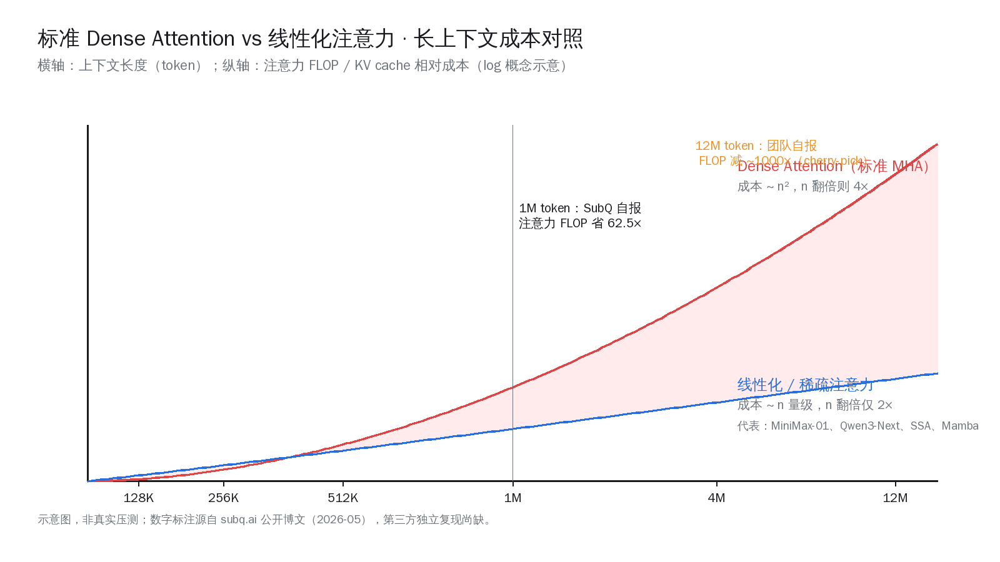
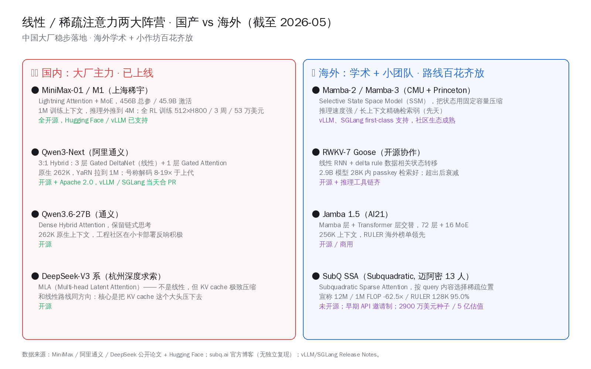
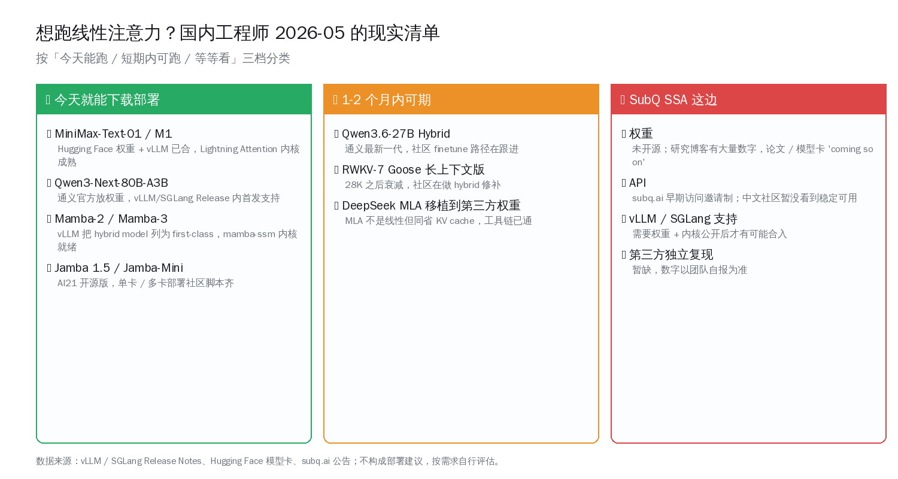

# 13 人小团队 SSA：1200 万上下文叫板 Opus

## 一、5 月 6 日的事：13 个人，把 Opus 摆上台面

5 月 6 日上午，36 氪头条挂出一则文章，标题里连甩三个数字——「1200 万 token 上下文、注意力算力暴减约 1000 倍、推理成本仅 Claude Opus 的 5%」。署名团队是迈阿密一家叫 Subquadratic 的初创公司，全公司只有 13 人，研究核心 11 位博士，履历里能拼出 Meta、谷歌、牛津、剑桥、Adobe。量子位很快转载，智源社区当天讨论上了热门，知乎话题区也起来了。

这种"几个人挑战大厂"的故事在国内 AI 圈一向有流量，但比标题更值得拆的是它背后的两个事实：

第一，这家公司核心产品叫 SubQ，技术底子是一个被称作 SSA 的新注意力机制。但中文报道里"SSA"被翻成 "State Space Attention"——这是个翻译问题。在团队自己的官方博客里，**SSA 的全称是 Subquadratic Sparse Attention（次平方稀疏注意力）**，不是 Mamba 那一支的 State Space Model。区别后面会展开。

第二，那些"千倍 / 1200 万 / 5% 成本"的数字，几乎全部来自团队博客与一份对外介绍，第三方独立复现尚没有出现。我们读它，要带着"团队官方说法"的标签，而不是"已经板上钉钉的 SOTA"。

但即便给所有数字都打上一个折扣，这件事仍然值得花一篇深度文来拆——因为它代表的方向，是过去一年国内 AI 大厂悄悄走得最远的一条路：**把 Transformer 注意力的二次代价干下来**。MiniMax-01、Qwen3-Next、DeepSeek 的 MLA，没有一个不在做这件事，只是国内做的人没把它做成头条标题。

我们这一代赶上的，其实是底层架构的一次百花齐放。13 人小团队能上头条是好事，国产大厂踏踏实实做线性注意力也是好事，两条线并不矛盾。

> **本文核心论点**：「千倍」「1200 万」「Opus 5%」是 cherry-pick 的单条 long-context 测试，不是普适加速；但它代表的"线性化 / 稀疏化注意力"大方向，国产已经稳步落地，中国团队正以大厂 + 小作坊双管齐下推动这条路。读者真正该关心的不是营销数字，而是：这一代注意力新架构，今天能不能用 / 多久能合进 vLLM SGLang / 国产同档对标谁。

---

## 二、SSA 到底是什么：把「全连接」换成「按内容选位置」

要看懂 SSA 省在哪里，先把标准 Transformer 的注意力痛点说清楚。

### 2.1 注意力的二次代价 = 长上下文的天花板

标准的多头注意力（MHA）干的事很简单：每个 query token 要去和**所有** key token 算一次内积、过 softmax、再加权求和。

- 序列长度 n，则计算量是 O(n²)；
- 推理时每步要保留前面所有 token 的 K/V 向量（叫 KV cache），显存占用也是 O(n)。

这两件事在 8K、32K 长度时都不痛，到了 128K、1M、12M，就是天花板。1M token 的 KV cache，单序列就能塞掉一张 80GB H100；12M 直接没法用现成卡跑。

工程社区对这件事的回应有两条主路：

1. **线性化 / 稀疏化注意力**：把 O(n²) 干到 O(n) 或更优。代表：Mamba、RWKV、Lightning Attention、Gated DeltaNet、SubQ 的 SSA。
2. **压缩 KV cache**：让 K/V 不再线性堆。代表：DeepSeek 的 MLA（Multi-head Latent Attention）、各种 KV 量化与共享。

SubQ 走的是第 1 条。

### 2.2 SSA 的核心：按 query 内容稀疏选位置

按团队博客的说法，SSA 的关键是**内容依赖的稀疏化（content-dependent sparsity）**：

- 给定一个 query，模型先用一个轻量路由判断"序列里哪些位置值得看"；
- 只对被选中的那些 key/value 算精确注意力；
- 其余位置直接跳过。

这听起来朴素，但和老式稀疏注意力（Longformer、BigBird 那种"固定滑窗 + 全局 token"）不同的关键在两个字——**精确**：

- 老式稀疏：固定 pattern，长上下文里召回率坍塌；
- SSA：query 自己决定看哪儿，号称"在任何位置精确取回信息"。

这个机制和 Mamba / RWKV 这一支 **state space model** 的差别也很关键。Mamba 是把整个上下文压成一个固定容量的隐藏状态向量传下去，像 RNN 一样；优点是推理超快，缺点是"针在草堆里"那种长上下文检索（passkey retrieval、Needle-in-a-Haystack）天生弱——RWKV-7 在 28K 之后召回率就明显衰减。

SSA 不压状态、保留 token-level 索引能力，但用稀疏 pattern 把"全连接"变成"按需连接"。把它放在二维谱上看：

| 维度 | 标准 MHA | Mamba / RWKV (SSM) | SSA / Sparse Attention |
|---|---|---|---|
| 计算复杂度 | O(n²) | O(n) | O(n) ~ O(n log n) |
| KV 状态 | 完整保留 | 固定容量隐藏状态 | 完整 K/V 但稀疏访问 |
| 长上下文检索 | 强（贵） | 弱（自然衰减） | 团队自报：强 |
| 工程成熟度（2026-05） | 全栈成熟 | vLLM/SGLang first-class | 闭源、内核未公开 |

### 2.3 那"千倍"到底是怎么算出来的

这是这次最容易被误读的数字。

团队博客里给的是**注意力 FLOP** 的相对削减，不是端到端模型推理时间，也不是训练成本：

- 128K token：FLOP 省 8×；
- 1M token：FLOP 省 62.5×；
- 12M token：FLOP 省 ~1000×（外推单点）。

为什么数字越往长越夸张？因为**对照组是二次复杂度**——dense attention 在 12M 比在 128K 贵了大约 (12M / 128K)² ≈ 8800 倍，而 SSA 自己只贵 (12M / 128K) × constant 倍。差值除一下就是几百到一千倍。

这种比较有几个限制：

1. **只算注意力层这一块的 FLOP**，没算 FFN、embedding、采样等。一个真实 LLM 推理里注意力 FLOP 在长上下文时确实是大头，但短上下文时只是其中一份；
2. **是 cherry-pick 的极端长度**。1M、12M 是注意力相对优势最大的区段，4K、8K 这种日常长度上 SSA 不会有 1000×；
3. **没有第三方独立复现**。RULER 128K 那个 95.0% 准确率、SubQ 8 美元 vs Opus 2600 美元的成本对比，全部来自团队自报。

把这几条都标清楚，那数字就回到了它该有的位置——一个值得关注的方向性指标，不是"一夜改写技术格局"那种程度的突破。

### 2.4 KV cache 在长上下文里到底有多贵

为了让"省"这件事更有体感，举一个算得动的例子。

一个标准 7B 模型，假设 32 头 KV、每个 head 128 维、FP16 精度——单个 token 的 KV 是 32 × 128 × 2 字节 × 2（K 和 V）= **16 KB**。这看着不大，但乘以序列长度：

- 128K token：单序列 KV cache **2 GB**；
- 1M token：**16 GB**——一张 80GB H100 同时只能装下 5 条这样的请求；
- 12M token：**192 GB**——**单条请求都装不进单卡**，必须上多卡张量并行或 KV offload；

上面这还只是中等模型。同样的算式套到 70B 级别，KV cache 在 1M 长度直接干到 100GB+。这是为什么海外和国内大厂都不约而同把"压 KV"列为长上下文的头号工程问题。

SSA 的稀疏选择不直接压 K/V 体积，但它让"每个 query 实际访问的 K/V 子集"变小，于是带宽压力下来了——长上下文推理在 GPU 上的瓶颈本来就是 HBM 带宽，不是算力本身。这是它"加速比能拉到几十倍"的物理基础。

### 2.5 国内同行该怎么看

业内人看 SSA 的反应大概率分两层：

- **方向上**：「我们也在做」——MiniMax-01 的 Lightning Attention、Qwen3-Next 的 Gated DeltaNet 都是同一个谱系，差别只在 sparse / linear 的具体形式；
- **披露上**：「他们敢把数字放出来」——海外学术圈和投资环境鼓励 over-claim，国内大厂往往等开源、等社区复现才发声。

后面我们会看到，国产线性注意力的真实落地度其实远比 SubQ 更扎实，只是不容易出爆款标题。

---

## 三、国产线性注意力：MiniMax、阿里、深度求索三家已经走在前面

很多 36 氪读者看完那篇报道下意识会问："这个方向国内有人做吗？"答案是：**不仅有，而且大模型主力都在做，权重都开源了**。

### 3.1 MiniMax-01 / M1：Lightning Attention 跑出 4M 推理上下文

上海稀宇科技（MiniMax）2025 年初发的 MiniMax-01 是国产线性注意力第一次"摆到台面上"的作品。架构是 Lightning Attention + MoE：

- 总参数 456B，激活 45.9B；
- 训练上下文 1M token，推理可外推到 4M；
- API 定价：输入 0.20 美元 / 百万 token、输出 1.10 美元，比同期 GPT-4o 便宜约 10×；
- 全套模型权重开源，Hugging Face 上下载量稳定。

更关键的是 2025 年中那篇 MiniMax-M1 论文。Lightning Attention + 自研 CISPO 算法（用于强化学习），让一个 hybrid 架构的推理模型在 **512 张 H800 上训练 3 周完成全 RL，租用费用约 53.47 万美元**。一年前，这种规模的 RL 训练在海外大厂手里要烧上千万美元。这是国产团队拿"线性注意力 + 工程精算"实打实砍下来的训练成本。

### 3.2 Qwen3-Next：3:1 hybrid 把推理速度做到 8-19×

阿里通义在 2026 年初放出的 Qwen3-Next 系列更直接对标 SubQ 想要的那个位置：

- 架构：3:1 hybrid——3 层 Gated DeltaNet（线性注意力）+ 1 层 Gated Attention（标准注意力）；
- 80B 总参 / 3B 激活的稀疏 MoE；
- 原生 262K 上下文，YaRN 拉到 1M token；
- 阿里官方数据：解码速度比上一代 Qwen3-Max 快 8-19×，推理成本约低 60%；
- Apache 2.0 开源，vLLM / SGLang 在 release 当天就合了 PR。

最近的 Qwen3.6-27B 又走得更远——dense hybrid attention，原生 262K，国内开发者社区在小卡部署上的实测反响很积极。NVIDIA 的开发者博客也专门撰文介绍 Qwen3-Next 在 H100/B200 平台上的并行加速策略。

### 3.3 DeepSeek MLA：不是线性，是把 KV cache 压到极致

杭州深度求索的 DeepSeek-V3 系列走了一条不太一样的路——MLA（Multi-head Latent Attention）。它不是把注意力线性化，而是把 K/V 投影到一个低秩潜在空间，让每个 token 只需要存一个小向量，KV cache 直接从 GB 级别压到几十 MB。

MLA 在严格意义上不属于"线性注意力"派，但它解决的是同一个核心痛点：**长上下文部署，大头开销在 KV cache，不在矩阵乘法**。SSA 用稀疏访问绕过 KV，MLA 用低秩压缩 KV，两条路殊途同归。DeepSeek 把 MLA 做开源做到所有人都能复用，是国产工程派最扎实的贡献之一。

### 3.4 国产线性注意力时间线（不完全清单）

| 时间 | 团队 | 工作 | 关键属性 |
|---|---|---|---|
| 2025-01 | MiniMax | MiniMax-01 / Lightning Attention | 1M 训练 / 4M 推理外推 / 全开源 |
| 2025-06 | MiniMax | MiniMax-M1 hybrid + CISPO RL | 53.47 万美元跑完全 RL 训练 |
| 2025 下半年 | 阿里通义 | Qwen3-Next | 3:1 Gated DeltaNet hybrid / Apache 2.0 |
| 2026-01 | 阿里通义 | Qwen3-Coder-Next | hybrid 注意力 + agentic coding 优化 |
| 2026-04 | 阿里通义 | Qwen3.6-27B | dense hybrid + 262K 原生 |
| 持续 | 深度求索 | DeepSeek-V3 / MLA | KV 压缩另一条主路 |

把这张表和 SubQ 摆在一起看：**国内大厂在线性注意力路线上已经把"开源 + 量产 + 工程链"做完了一轮**。SubQ 的优势是数字更激进、PR 更猛，国产的优势是踏踏实实有权重、有 vLLM/SGLang 内核、有真实推理成本数据。

---

## 四、海外同行：从 Mamba 到 Jamba，谁也没把这事做完

海外这条线热闹，但远没到"收敛"的程度。

### 4.1 Mamba 系：纯 SSM 的代表

Mamba-1（2023）、Mamba-2（2024 ICML）、Mamba-3（2026 在云端推理生态铺开）一脉相承——Selective State Space Model，把整段上下文压成固定容量的隐藏状态。优势：

- 推理速度极快，无 KV cache 增长；
- 训练上下文可以拉到 100 万级别；
- vLLM 已经把 hybrid model（Mamba + attention）列为 first-class citizen，mamba-ssm + causal-conv1d 内核齐备。

劣势：纯 SSM 在长上下文精确检索上天生弱。这也是为什么 Jamba、Nemotron-Hybrid、Granite 4.0、MiniMax 都不约而同选择了"几层 Mamba/线性 + 几层标准 attention"的 hybrid 架构。

### 4.2 RWKV-7 Goose：开源协作的 RNN 路线

RWKV 是社区驱动的另一条线性 RNN 路线，2025 年 RWKV-7 Goose 加入了 delta rule 的数据相关状态转移，能力提升明显。但 2.9B 模型在 28K passkey 检索上还能保持精度，超出后衰减——这和纯 SSM 的痛点是同一个：固定容量状态压不住超长序列的细节。

### 4.3 Jamba 1.5：商用 hybrid 的样板

AI21 的 Jamba 1.5 是 hybrid 架构在 2025 年最成熟的商用样本：

- 72 层，Mamba 层 + 标准 attention 层交替；
- 16 个 MoE 专家；
- 256K 原生上下文；
- 海外 RULER 长文榜单上位居前列。

Jamba 的意义在于证明了 "hybrid is the answer"——纯 Mamba 不行，纯 attention 太贵，混着用最好。这个共识也被国产 Qwen3-Next 的 3:1 比例、MiniMax-01 的 7:1 比例所验证。

### 4.4 SubQ SSA 在海外阵营的位置

把 SubQ 摆回海外这张图里看，它是"小作坊探索路径"那一档：

- 13 人，2900 万美元种子轮，估值 5 亿美元；
- 2024 年成立，前身公司叫 Aldea（做语音模型），后转向注意力研究；
- 没开源、没 paper、没第三方复现；
- 但敢把数字放出来吃媒体红利。

学术圈对这类"先发声明再补论文"的做派接受度比国内高。我们这一代国产开发者读这种新闻，最稳的姿势是——记下方向、看路演 demo、等开源再下结论。

---

## 五、SubQ 给的这些数字，到底信几分

把 SubQ 自报的所有数字摊开来一格一格看，会发现几件有意思的事。

### 5.1 SubQ 自承：MRCR v2 落后 Claude Opus 12 个百分点

这是这次报道里几乎被所有中文转载忽略的数字：

- RULER @ 128K：SubQ 95.0%，Opus 4.6 94.8%——SubQ 略胜 0.2%；
- **MRCR v2（多文档推理）：SubQ 65.9%，Opus 4.6 78.3%——SubQ 落后 12.4 个百分点**；
- SWE-Bench Verified：SubQ 81.8%，Gemini 3.1 80.6%——SubQ 略胜 1.2%。

也就是说，长文检索（RULER）和代码任务（SWE-Bench）上 SubQ 有竞争力，但**多文档推理这种真正考验全局理解力的任务，SubQ 仍然显著落后**于第一梯队闭源模型。这件事和它的稀疏注意力设计高度相关——稀疏化可以保留召回，但牺牲了部分跨文档信息融合的能力。

### 5.2 「8 美元 vs 2600 美元」需要更多上下文

36 氪报道里那句"SubQ 花 8 美元，Opus 花 2600 美元"，在 RULER 128K 这个 benchmark 上确实成立，但有几个 caveat：

- 没披露具体的 token 数（输入多长、输出多长）；
- 没披露具体的硬件（B200？H100？多少卡）；
- Opus 那边是按公开 API 标价计算（每百万输入 token 15 美元、输出 75 美元），不是 Anthropic 实际的边际成本；
- SubQ 自己未必经过商业部署的全栈成本（包括运维、scale 不上去时的算力浪费）。

更准确的读法是："**在 RULER 128K 这一个 benchmark、按当前公开 API 报价折算，SubQ 团队自报的推理花费比 Opus 便宜约 300×**"。这个数字仍然惊人，但和原标题"5%"是同一个意思的不同表述。

### 5.3 12M 上下文是宣传配置，不是验证配置

团队主页醒目位置是"12M-token positioning"，但**到目前为止官方公开的 benchmark 最长跑到 1M token**。12M 那个数字属于"模型支持窗口"，不是"实测精度"。

参考国内：MiniMax-01 训练 1M、推理外推 4M，但 4M 上的 needle-in-a-haystack 准确率官方也只放了选定段位的数据。任何线性 / 稀疏注意力架构在窗口拉到极限时都会出现召回率坍塌，SubQ 不会例外。

### 5.4 成本对比的另一条参照：MiniMax-01 vs SubQ

如果想做"性价比"对照，更同侪的比较其实是 SubQ vs MiniMax-01 / Qwen3-Next，而不是 SubQ vs 闭源 Opus：

- MiniMax-01 公开 API：输入 0.20 美元 / 输出 1.10 美元 / 百万 token；
- Qwen3-Next 自部署：开源权重，单卡 / 多卡推理脚本社区齐全；
- SubQ：邀请制 API，定价不公开。

国内开发者真正会跑的成本对比，大概率是 MiniMax / Qwen 长上下文 vs OpenAI/Claude 长上下文，而不是某个未开源模型上的单条数据。

---

## 六、工程社区现在能跑什么、什么时候能合上游

线性注意力 / 稀疏注意力这条路，过去一年最大的变化是**推理引擎层把它扶正了**。

### 6.1 vLLM：hybrid model 现在是 first-class

vLLM 在 2025 下半年完成了一次大重构，把 Mamba / linear attention / hybrid 模型从"V0 实验性 hack"提升为 V1 first-class citizen：

- mamba-ssm + causal-conv1d 内核稳定上游；
- 提出统一 KV 内存池，full attention / sliding window / Mamba state 共用；
- MiniMax-01、Qwen3-Next、Granite 4.0、Jamba 都已经在官方 release 里支持。

### 6.2 SGLang：跟进速度同样快

SGLang 也支持 Mamba 系列模型，启动命令和 vLLM 接近。issue 区有专门的统一内存池讨论，社区维护活跃。两家工具都把"长上下文 + hybrid"作为 2026 主线之一。

### 6.3 SubQ 的支持情况

实话实说，目前是空白：

- 权重未开源；
- 论文 / 模型卡 "coming soon"；
- 推理内核没有公开实现。

要让 vLLM / SGLang 支持 SubQ 的 SSA，最低门槛是模型权重 + sparse selection 内核公开。最快也要等团队走到下一个里程碑（一般是发 paper + 放小尺寸模型）。在那之前，国内开发者更现实的选择是部署 MiniMax-01 或 Qwen3-Next，把 SubQ 的论文当作下一步的方向参考。

### 6.4 如果你在做的是这几类工作

- **跑长上下文检索 / RAG 增强**：MiniMax-01、Qwen3-Next 都能跑得动，先实测；
- **想训练自己的小尺寸 hybrid**：Mamba-2、Jamba-Mini 的开源训练脚本是起点；
- **做推理 infra**：vLLM 1.x 的 hybrid 路径已经是稳定标准，关注 KV 内存池相关 PR；
- **跟踪 SSA 这条新路径**：等 SubQ 出 paper / 发权重，盯 Hugging Face Trending 与 NeurIPS 投稿。

---

## 七、往前看 6-12 个月：这条线大概率会怎么走

收尾这一节不做预言，只列三个高概率的方向。

### 7.1 国产线性注意力会从「研究」全面进「产品」

2025 年是国内"我们也能做线性注意力"的论证年（MiniMax-01、Qwen3-Next、DeepSeek-V3），2026 年很可能是"线性注意力默认开"的产品年——国产长上下文 API 大概率全面线性化或 hybrid 化，价格再往下压，1M token 输入逼近 0.1 美元这个区间不会太远。

### 7.2 「12M 上下文」会成为下一个标配口号

无论 SubQ 是不是真能在 12M 上跑通，这个数字一旦进了媒体头条，下一个季度国内大厂的发布会大概率会跟进——Qwen 也好、MiniMax 也好，都会把"我们的 hybrid 注意力支持 N 千万 token 上下文"作为下一档营销点。读者要警惕的不是"窗口大不大"，而是"在那个窗口下精度还剩多少"。

### 7.3 KV cache 这个工程问题会被多管齐下

线性化注意力（MiniMax / Qwen / SubQ）只是其中一条路。同时在并行推进的至少还有：

- **KV cache 低秩压缩**：DeepSeek MLA 路线的延伸，国内多家在跟；
- **KV cache 量化**：FP8、INT4 量化 KV，社区 PR 已合 vLLM 主线；
- **KV cache offload**：把冷段 KV 倒到 CPU 内存乃至 NVMe，延迟换显存；
- **prefix caching / radix tree**：SGLang 把 prompt 前缀复用做到了下一档，长 system prompt 场景立竿见影。

未来一年这几条会是合奏，不是单线赛跑。SSA 这种"按内容选位置"的稀疏注意力，会和"压低秩 KV""量化 KV""复用前缀"一起，把"长上下文等于贵"这个常识彻底改写。读者下次看到长上下文成本断崖式下降的新闻，多半是这几条线协同的结果，不是哪一家单点突破。

### 7.4 第三方 benchmark 会重新洗牌

RULER、MRCR、SWE-Bench、LongBench-v2 这些长上下文榜单，过去一年是 Claude / Gemini / Opus 这些闭源模型主导，2026 年开始会有越来越多国产 hybrid 模型与海外小作坊架构进来分庭抗礼。开源代码 + 公开复现脚本会变成新一代评测的硬门槛。SubQ 如果想真正在国内开发者圈站住脚，下一步绕不开"放权重 + 提供 vLLM 集成 + 接受第三方复现"这三件事。

---

## 八、把今天读到的东西收拢一下

回到开头那个论点：「千倍」「1200 万」「Opus 5%」是 cherry-pick 的单条 long-context 测试，不是普适加速。但它代表的"线性化 / 稀疏化注意力"大方向，国产已经稳步落地，中国团队正以大厂 + 小作坊双管齐下推动这条路。

读这条新闻的正确姿势，可以收成下面三条：

- **数字看清单位**：注意力层 FLOP 减少 1000× 不等于推理时间减少 1000×；RULER 128K 一个 benchmark 的成本对比不等于普适推理成本对比；窗口大小不等于实测精度。
- **方向看路线图**：线性 / 稀疏注意力是过去一年国内外公认的下一代 LLM 架构主线之一，国产大厂已经把"训练 + 开源 + 推理工程"这三段都跑通过一遍。
- **跟踪看落地**：判断一项新架构能不能用，看四个信号——权重是否开源、推理内核是否合上 vLLM/SGLang 上游、第三方独立复现是否出现、社区在 Hugging Face 的下载量与社区微调是否活跃。

13 人小团队 SubQ 上头条是一件好事——它把"线性注意力可以在数据上摆开和闭源大厂叫板"这件事推到大众视野；MiniMax、阿里、深度求索踏踏实实把权重 + 工程链开源出来，又是另一件好事——它让国内开发者今天就能跑得动同方向的模型。

我们这一代赶上的，不是"某个团队一举改写 Transformer"的剧情，而是底层架构同时有十几条路在被推进、每隔几个月就能在国内 Hugging Face、阿里云魔搭社区、Qwen Chat 上看到一次实测。这种密度的进展，是中国学术界与工程界长期投入换来的——不容易，也值得每一个写代码的人多注意它一点。

下一次再读到"团队 X 宣称 Y 倍加速"这种标题，记得做三件事：去翻官方 benchmark 表、对照同方向开源工作、在 vLLM / SGLang 的 release notes 里搜一下能不能跑。这是这一代国产 AI 工程师该有的阅读习惯。

---

**参考与延伸阅读**

- 36 氪报道：13 人小团队 SubQ / SSA 与「Opus 5%」原文（2026-05-06）
- 量子位转载与拆解（2026-05-06）
- subq.ai 官方博客：SSA 设计动机与公开 benchmark
- MiniMax-01 / M1 论文（arxiv 2501.08313 / 2506.13585）
- Qwen3-Next 官方博客 + NVIDIA 开发者博客技术拆解
- DeepSeek-V3 论文与 MLA 设计章节
- vLLM blog: "Hybrid Models as First-Class Citizens"
- AI21 Jamba 1.5 技术报告

（本文所有数字截止 2026-05-06 公开报道，权威性请以各团队官方论文、开源 release 与第三方独立复现为准。读者如有更新进展，欢迎在评论区指出。）
