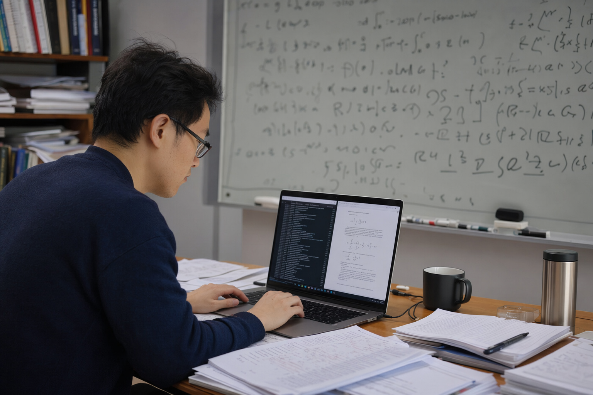
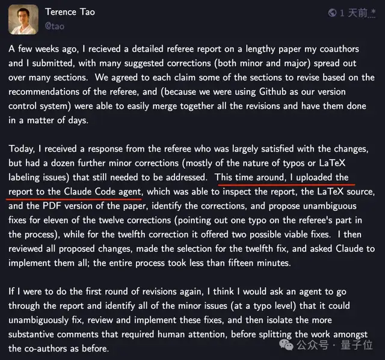
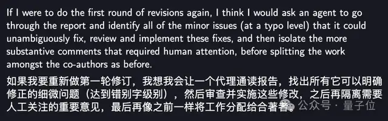
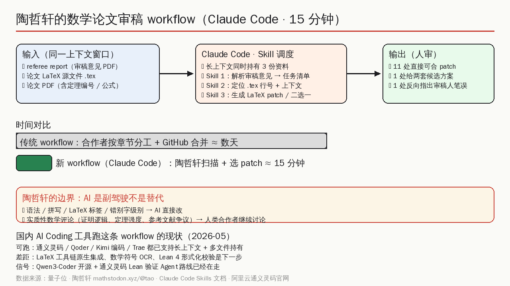
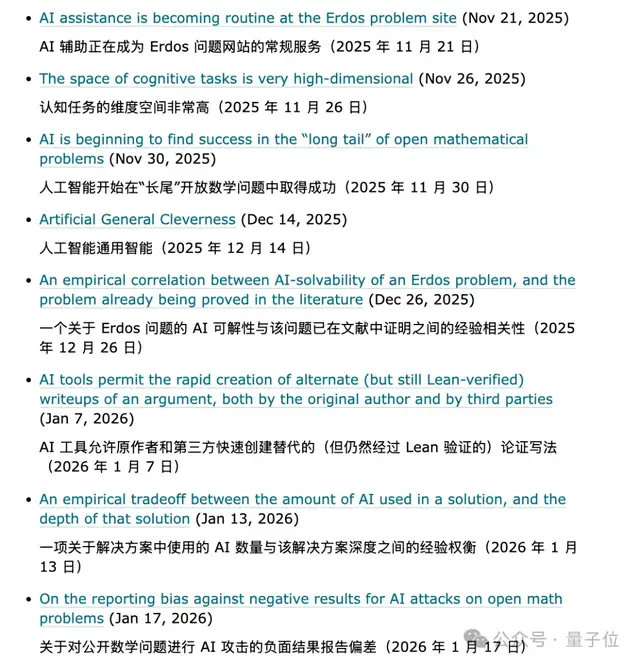
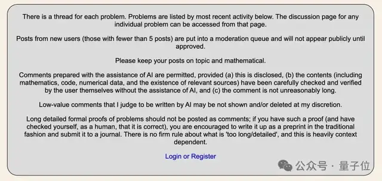
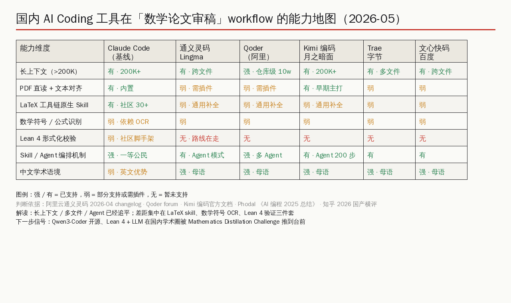

# 陶哲轩公开 Claude Code 审稿 workflow：15 分钟跑完一轮修订

> 「重来一次，第一轮修订我就会用 AI。」——陶哲轩在 mathstodon.xyz 上自述。这句话能引发量子位、36氪、知乎集体转发，不是因为陶哲轩"安利"了 Claude Code，而是因为他第一次把审稿这件事的工序拆给所有人看。

## 一、不是「AI 赢了数学家」，是审稿这道工序被拆成了三层

先把事件还原一遍。5 月 5 日前后，陶哲轩在 mathstodon 上分享了一段亲历——他刚收到一份合作论文的第二轮审稿意见，一份 referee report 里头列了十二个小毛病，多数是错别字、LaTeX 标签写错、引用格式不一致这种"不影响数学但必须改"的问题。他把审稿报告 PDF、论文 LaTeX 源文件、论文 PDF 一起塞进 Claude Code 的同一个对话窗口，让它通读一遍，然后给修改方案。

结果是 **十五分钟**：Claude Code 直接给出 11 处可合并的 LaTeX patch，第 12 处给两套候选方案让人挑，过程里还反向揪出审稿人自己写错的一个英文单词。同样的工作量，第一轮修订时陶哲轩和合作者按章节分工、走 GitHub PR 合并，花了几天。

陶哲轩自己的总结非常克制，全文没有一个夸大动词：

> 如果我要重新做第一轮修订，我想我会让一个代理通读报告，找出所有它可以明确修正的细微问题（达到错别字级别），然后审查并实施这些修改，之后再隔离需要人工关注的重要意见，最后再像一样将工作分配给合作者。
>
> ——陶哲轩，mathstodon.xyz/@tao（量子位翻译）

注意他用的词：**"agent goes through"、"unambiguously fix"、"isolate the more substantive comments"**。这不是在评价 AI 厉害，是在重新拆分一道工序——

1. **第一层（机器层）**：批量、确定性、错别字级——agent 全包；
2. **第二层（人审层）**：模糊的、需要选择的——人花 5 秒钟选 patch；
3. **第三层（合作者层）**：实质性数学评论——按老办法分工。

过去这三层全压在合作者身上，于是从开会、分工、各自动手到合并，要走 1-2 天。Claude Code 干的事情非常朴素：把第一层从合作者头上摘下来。

> **核心论点**：陶哲轩这次公开的不是"AI 取代数学家"的爽文，而是**一道工序的重新分层**——审稿这道老工序被切成"机器能干的部分"和"人必须干的部分"，然后第一部分被外包给 Claude Code。这套分层逻辑国内开发者完全可以复刻，差距不在思路，而在工具链：LaTeX、数学符号 OCR、Lean 4 形式化校验。

---

## 二、为什么是 Claude Code 而不是 ChatGPT 网页版

陶哲轩用 LLM 不是新鲜事。他从 2023 年起就在博客和 Mastodon 上公开过用 GPT-4、Claude 做数学的实验，也是 Lean 4 + LLM 形式化数学方向的资深玩家。他和 Damek Davis 联合组织的 Mathematics Distillation Challenge 在今年 3 月就把 Lean 4 推到了数学社区主舞台。

那他这次为什么挑 Claude Code，而不是 ChatGPT 网页 + 复制粘贴？理由藏在三个细节里：

**细节一：长上下文同时持有三份文档。** referee report、论文 .tex、论文 PDF 加起来轻松几十万 token，网页对话框来回 copy 早就丢了上下文，而 Claude Code 通过文件读取工具让模型直接持有这三份文档，在同一个上下文窗口里对齐。这是工序能跑通的最低门槛。

**细节二：Skill 这层薄抽象。** Claude Code 在 2025 年下半年引入的 Skills 机制，本质是一套可复用的 agent 行为脚本，比如 "compile-latex"（3-pass XeLaTeX + bibtex）、"split-pdf"、"diff-tex"。GitHub 上 [pedrohcgs/claude-code-my-workflow](https://github.com/pedrohcgs/claude-code-my-workflow) 这种学术 workflow 模板已经有 30 多个 skill、14 个专门 agent，针对的就是 LaTeX + R + Quarto 的研究员日常。陶哲轩没必要自己拼脚手架，直接在已有 skill 上跑就行。

**细节三：编辑 + 执行权限。** ChatGPT 网页只能输出建议，Claude Code 是直接对 .tex 文件下手。审稿这种事最怕的就是"你说改 X，我得自己回 IDE 找 X"——五个回合下来人就疲了。Claude Code 给的是"已经改好的 patch，你只要 review"。

下面这张图把这三件事捏在一张工序图里：

更深一层，Claude Code 在 Anthropic 官方文档里被定位为 "agentic coding tool"，"agentic" 这个词的本意是 LLM 不再是答题机器，而是会主动调用工具、读写文件、跑命令。审稿这件事天然就是一个 agentic 任务：要先读，再定位，再改，再回头校对，再决定哪些拿不准。把它放到聊天框里就是脏活累活，放到 agent 工具里就是工序。

---

## 三、陶哲轩没说的事：Erdős 问题站的 AI 政策

事件还有个被国内多数转载漏掉的角落，但很值得拎出来。

陶哲轩同时在维护一个开放数学社区——Erdős Problems 网站，专门收集和讨论 Erdős 留下的开放问题。他在 11 月到 1 月之间发过一系列 Mastodon 长帖，记录"AI 在 Erdős 问题站点上变得越来越常见"、"AI 在数学问题的长尾上开始有真实进展"。

更值得读的是这个社区给 AI 评论制定的规则——这是把"人类审核 AI 输出"写进了治理条款：

规则里几条很关键：

- 借助 AI 撰写的评论被允许，但必须 (a) 公开声明、(b) 内容（含数学、代码、数值数据、相关来源的存在性）由用户本人核查并验证、(c) 评论长度合理；
- 由站长判定为 AI 写就的"低价值评论"会被移除或不展示；
- 详细的形式化证明不应作为评论发出，需要写成 preprint 投到期刊；
- "评论太长" 没有硬性界限，case by case。

把"陶哲轩用 Claude Code 审稿"和"Erdős 问题站允许 AI 辅助评论但要求人类核查"放在一起看，事情就清楚了：**他不是在推一个工具，他是在示范一套新的学术礼仪**——AI 输出可以进入正式数学交流，前提是人类签字。这条规则写到学术工作流里，比"15 分钟"这个数字本身更重要。

---

## 四、这套 workflow 国产 AI Coding 工具能跑吗

把视线转回国内。2026 年的 AI Coding 工具市场已经从"群雄割据"走到"五强争霸"——通义灵码、Qoder、Kimi 编码、Trae、文心快码（Phodal 在 [《AI 编程 2025 总结》](https://www.phodal.com/blog/ai-coding-2025-summary/) 里把这一年的格局梳得很清楚）。这些工具能不能跑陶哲轩这套审稿 workflow？

先把答案放出来：**思路能跑通，工具链有差距**。下面这张能力地图把六个维度逐项对到表里：

逐项展开看：

- **长上下文**：Qoder 一次性可以解析 10 万文件、构建项目知识图谱（Repo Wiki），通义灵码有跨文件感知、持久记忆，Kimi 编码继承月之暗面长文一贯的强项，三家在数量级上和 Claude Code 平起平坐。这条不是瓶颈。
- **Skill / Agent 编排**：通义灵码有 Agent 模式，Qoder 主打多 Agent 并行 + 手机端远程调度，Kimi 编码已经能跑两百多步的复杂任务。Skill 这层薄抽象虽然各家叫法不同，但形态都在追上来。这条也不是瓶颈。
- **PDF + LaTeX 工具链**：差距开始出现。Claude Code 的学术社区已经有 30+ 个现成 skill，包括 3-pass XeLaTeX 编译、PDF 切片、tex diff、bibtex 校验，国内工具基本停在"通用代码补全 + 跨文件查找"，没有针对 .tex/.bib 的原生工程化封装。
- **数学符号 / 公式识别**：六家都弱。OCR 这块谁都得依赖外部库，没人当成核心能力交付。
- **Lean 4 形式化校验**：差距最大。Claude Code 这边已经有社区脚手架（Mistral 11 月开源的 Leanstral 120B 是第一个开源的 Lean 4 验证 Agent，Math Inc. 的 Gauss 已经形式化验证了 8 维和 24 维球填充问题），国内通义灵码官方路线图提到了证明助手方向，但实际产品还没落地。
- **中文学术语境**：这一栏国产工具反过来强。中文论文降重、知网查重、中文公式表达这些场景，国产工具在母语训练数据上有天然优势，Claude Code 在中文学术语境下需要额外的提示工程。

把这六条放一起读，结论就出来了：**通用能力（长上下文、Agent、多文件）已经追平甚至局部反超，差距集中在三件具体的事——LaTeX 原生 skill、数学符号 OCR、Lean 4 形式化**。这三件事都是工程问题，不是模型能力问题。Qwen3-Coder 已经开源、通义灵码已经免费不限量地接进来，社区只要愿意做这三件事，国产学术 workflow 不会比 Claude Code 慢太久。

社区现在已经在做的事情，零零散散能看到一些信号：

- GitHub 上多个 [latex-document-skill](https://github.com/ndpvt-web/latex-document-skill) 一类项目把 27 个 LaTeX 模板 + 27 个脚本 + 26 个参考指南打包成可被 AI Coding 工具直接调用的资产；
- 阿里云通义灵码 [2026 年 2 月 changelog](https://help.aliyun.com/zh/lingma/product-overview/changelogs-of-202602) 已经把"研究 Agent 模式"列入产品 roadmap；
- 知乎上每周都有针对 [2026 国产 AI 编程工具横评](https://zhuanlan.zhihu.com/p/1999804779141030200) 的对比文，国内开发者评测密度不输海外。

这些信号叠在一起就是一句话：**陶哲轩示范的工序，国产工具迁移成本最低的部分（长上下文 + Agent + 多文件持有）已经具备，最贵的部分（LaTeX 原生 skill + 数学符号 + Lean 校验）正在被社区一格一格补上。**

---

## 五、不是只有数学家用得上：审稿这件事可以泛化

把陶哲轩这条 workflow 稍微抽象一点点，它其实是一个非常通用的「人机协作分层」模板。换个领域看：

| 场景 | 第一层（机器层 · agent 全包） | 第二层（人审层） | 第三层（合作者层） |
|---|---|---|---|
| 数学论文审稿 | LaTeX 标签、错别字、引用格式 | 二选一的 patch | 实质性数学评论 |
| 法律合同初审 | 条款编号、引用法条、错别字、格式 | 措辞强度选择 | 关键风险条款 |
| 医学论文审稿 | 数据表格式、统计符号、图注 | 图表呈现方式 | 试验设计、统计结论 |
| 软件代码审查 | 风格、import 顺序、注释 typo | 命名 / 简短重构 | 架构与正确性 |
| 学术翻译初审 | 术语一致性、引用格式、英文拼写 | 句式重写 | 学术语境与论证 |

每一行的逻辑都一样——**把审查这道工序的"确定性部分"切给 agent，让人腾出时间做"有判断的部分"**。陶哲轩之所以让所有人觉得震动，不是因为他证明了 AI 能改 LaTeX，而是因为他把这个分层用最严肃的领域（顶级数学家审稿）演示了一遍。一旦最严苛的领域跑通，其他领域就只是工程问题。

---

## 六、回到桌前：我们这一代赶上的窗口

陶哲轩在 mathstodon 上还有句话很多人没注意到——他在另一条帖子里说自己 2023 年预测过"2026 年 AI 会成为数学领域可靠的合著者"，现在他觉得这条预测应验了，他本人对此很满意。他的论文里现在代码、图表、数值计算大幅增多，因为这些东西的边际成本被 AI 拉到了极低。

把视线缩回到屏幕前的我们：

- 你不一定写数学论文，但你大概率有一份周报、一份代码 PR、一份合同或者一份产品文档要被审；
- 你不一定用 Claude Code，但你大概率装着通义灵码、Kimi 编码、Trae 中的至少一个；
- 你不一定看得懂 LaTeX，但你一定能在自己每天的工序里找到那一层"确定性 + 错别字级别"的脏活。

陶哲轩示范的不是"以后审稿都让 AI 做"，而是"哪些工序你今天就可以让 AI 接管"。中国数学家也在 LLM 实验前线——Mathematics Distillation Challenge、Math Inc. 的形式化项目、知乎和 mathstodon 上活跃的国内研究者，都说明这一轮学术工作流更新里，中文社区不是观望者。国产 AI Coding 工具在通用能力上已经追平，下一个阶段补 LaTeX skill、补数学符号识别、补 Lean 4 校验，是再清晰不过的工程方向。

回到那张白板前的桌子。论文摊在键盘旁边，终端里跑着一个 agent，公式从手稿上爬到屏幕上——这是 2026 年的学术日常，也是开发者日常。那条把"机器能干的事"和"人必须干的事"分清楚的线，每个人都可以在自己的桌子上画一遍。

---

**参考来源**

- 量子位 2026-05-06 头条：[陶哲轩在线安利 Claude Code](https://www.qbitai.com/2026/05/413265.html)
- 陶哲轩 Mastodon 主页：[@tao@mathstodon.xyz](https://mathstodon.xyz/@tao)
- Erdős Problems 网站 AI 评论政策（站内规则页）
- Phodal：[AI 编程 2025 总结](https://www.phodal.com/blog/ai-coding-2025-summary/)
- 阿里云通义灵码：[2026 年 2 月产品更新](https://help.aliyun.com/zh/lingma/product-overview/changelogs-of-202602)
- 知乎：[2026 年 AI 编程工具全景测评](https://zhuanlan.zhihu.com/p/1999804779141030200)
- GitHub 学术 workflow 模板：[pedrohcgs/claude-code-my-workflow](https://github.com/pedrohcgs/claude-code-my-workflow)
