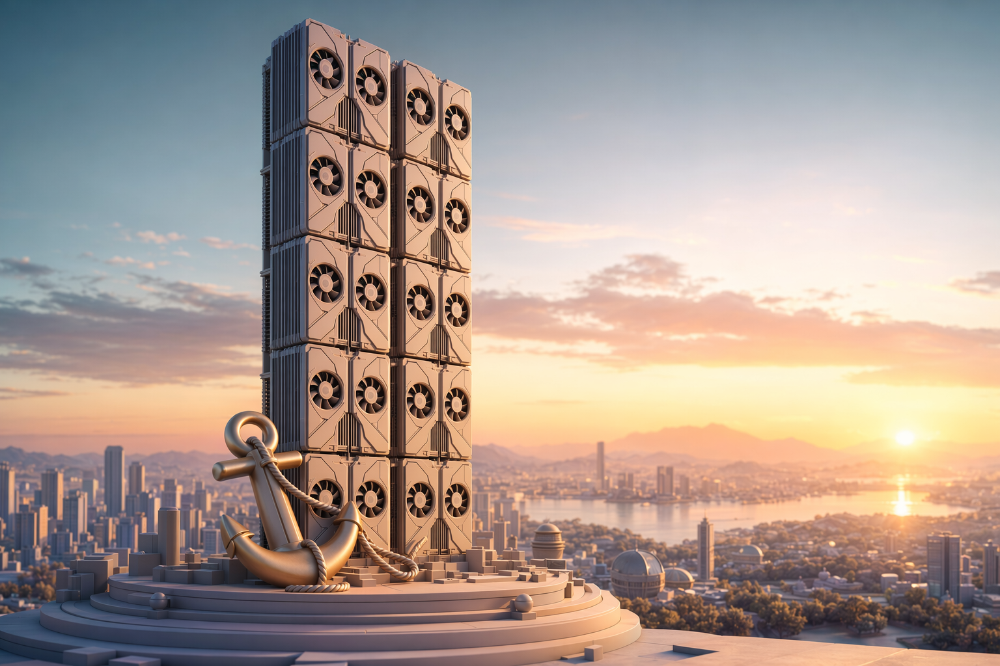
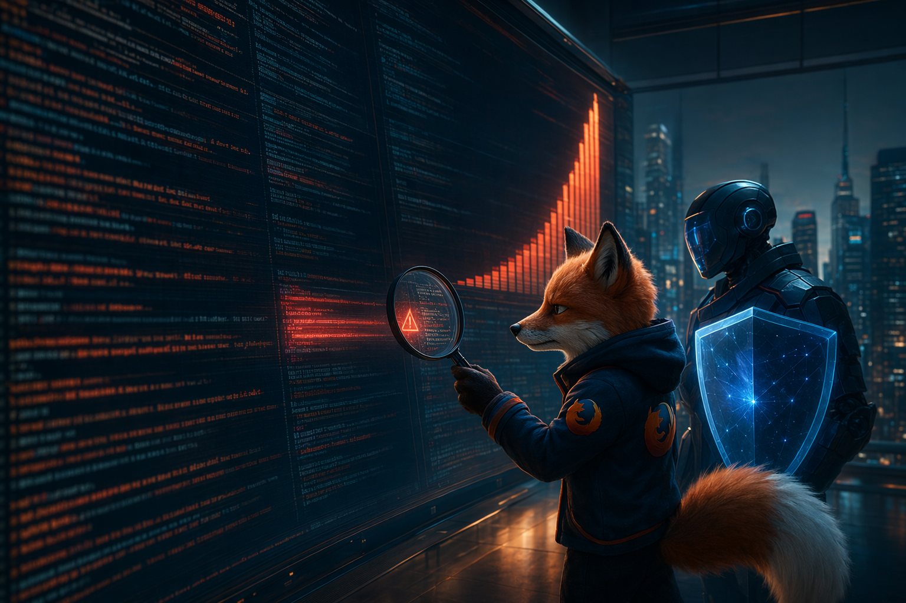
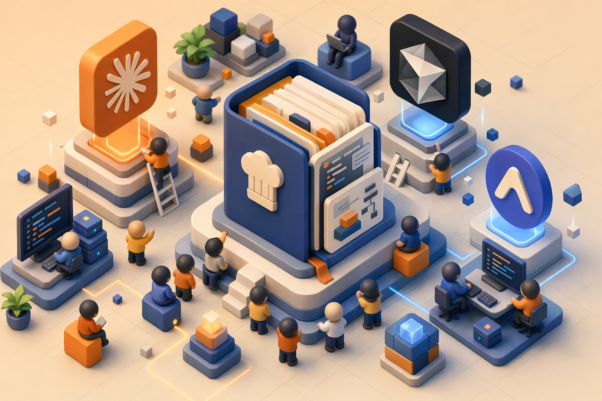

# DeepSeek 450 亿国资领投 · Kimi 翻倍 200 亿 | AI 日报 | 2026-05-08

**今日关键词：DeepSeek 首轮外部融资 450 亿美元（约 3000 亿元）由大基金三期领投、梁文锋直接持股升至 34% · Kimi C 轮 20 亿美元关账、估值半年翻倍到 200 亿美元、美团龙珠领投 · DeepMind AlphaEvolve 用 Gemini 双模型 + 进化算法在 Borg / TPU / 4×4 矩阵乘 / Erdős 数学问题上拿出真实数字 · Anthropic Claude Mythos Preview 单次评估给 Firefox 找出 271 个漏洞、Mozilla 4 月修了 423 个 · Meta FAIR + Stanford + Harvard 发布 ProgramBench 让 9 个前沿模型从零重写 ffmpeg / SQLite，全员 0% 通关 · Addy Osmani 开源 AI Coding 工程手册一周冲到 32k⭐ · Anthropic 拿下 xAI Colossus 1 全部算力、>22 万张 GPU**

---

## 📋 头版目录（一屏扫完今日）

- 💸DeepSeek 首轮外部融资 450 亿美元 · 国家大基金三期亲自领投国产大模型 → 头条
- 💸Kimi C 轮 20 亿美元关账 · 半年估值翻 4 倍到 200 亿美元 → 国内 AI
- 🔬DeepMind AlphaEvolve 跨域成果回顾 · 4×4 矩阵乘破 Strassen 56 年纪录 → 精选要闻
- 🛡Firefox 4 月修 423 个漏洞 · 271 个由 Claude Mythos 单次找出 · 含 20 年 XSLT 老 bug → 头条
- 🧠Meta SI Labs ProgramBench · 9 前沿模型从零重写 ffmpeg / SQLite 全员 0% 通关 → 精选要闻
- 🛠Addy Osmani agent-skills 一周 32k⭐ · Google Director 写的 AI Coding 工程手册 → AI Coding
- 🏭Anthropic 拿下 xAI Colossus 1 全部算力 · >300MW · >22 万张 GPU → 快讯
- 🚀Claude Opus 4.7 GA · 工程能力 + 长 horizon coding 提升 · Code Pro/Max 限速翻倍 → 快讯
- 💸Sierra（Bret Taylor）E 轮 9.5 亿美元 · 估值 158 亿 · ARR 1.5 亿 → 快讯
- 💸Parallel Web Systems（前 Twitter CEO）1 亿美元 · agent 用搜索 API → 快讯
- 🎙Simon Willison 评 Anthropic ↔ xAI Colossus 1 交易 · 安全形象与能源合规两难 → 名人说
- 🎙Karpathy 转推 Simon · prompt injection 之于 LLM 像 1980s 计算机病毒 → 名人说
- 📦Hmbown/DeepSeek-TUI · Rust · 18,701 stars · 终端跑 DeepSeek → GitHub Trending
- 📦anthropics/financial-services · Python · 11,617 stars · 金融行业 vertical agent → GitHub Trending
- 📦VectifyAI/PageIndex · 29,522 stars · 给 reasoning RAG 用的结构化文档索引器 → GitHub Trending
- 📦z-lab/dflash · 3,484 stars · 推理加速 block diffusion 投机解码 → GitHub Trending
- 🇺🇸美国 Center for AI Standards · Google / MS / xAI 签发布前预评测协议 · Anthropic 缺席 → 值得关注
- 🤖HuggingFace Trending · Zyphra ZAYA1-8B 19 分钟前更新 · 8B Mamba/Transformer 混合 → 值得关注
- 🔭ProgramBench 一题打穿 SWE-Bench 饱和 · 国产模型从 0 起步窗口期开 → 值得关注

---

## ⏱ 公众号版 30 秒速览

**一句话**：5 月 6-7 日是国产大模型估值天花板被改写的两天——DeepSeek 完成首轮外部融资、估值锁定 450 亿美元（约 3000 亿元人民币）由国家大基金三期亲自领投、梁文锋直接持股升至 34%；Kimi C 轮 20 亿美元关账、半年估值翻 4 倍到 200 亿美元、美团龙珠领投。同周海外侧 DeepMind 公开 AlphaEvolve 在 TPU 设计 / 矩阵乘 / 数学问题上的真实成果；Mozilla 4 月一次性修了 Firefox 423 个漏洞、其中 271 个由 Claude Mythos 单次评估发现；Meta SI Labs 发 ProgramBench 让 9 个前沿模型从零重写 ffmpeg、SQLite，**全员 0% 通关**；Addy Osmani 把 AI Coding 工程手册开源、一周冲到 32k⭐。

**国内对照**：DeepSeek + Kimi 同周完成两笔大额融资把国产 LLM 估值锚抬到 450 亿 / 200 亿美元两个新档位，国资 + 互联网龙头共同接盘，六小虎之上多了一道国家队产业资本接续机制；K2.6 已经排到开源编程模型第一。AI Coding 这边国内开发者读 addyosmani/agent-skills 这种工程手册可以直接抄思路到通义灵码、文心快码、豆包 Trae、Qoder，国内 AI Coding 工具在「skill 配方书」上跟进的窗口期不算长。

**今日 6 个深度专题**（详见 `public/2026/05/08/`）：

- [DeepSeek 450 亿国资定锚](../../public/2026/05/08/deepseek-450b-state-fund-leading.md) — 大基金三期首次投模型层、梁文锋 34% 直接持股、3000 亿估值锁定。
- [Kimi 200 亿翻倍 · 杨植麟回归](../../public/2026/05/08/kimi-20b-financing-yang-zhilin-return.md) — 美团龙珠领投、ARR 半年破 2 亿美元、Stripe 1 月环比 8280%。
- [AlphaEvolve · 自己进化代码的 agent](../../public/2026/05/08/alphaevolve-deepmind-gemini-coding-agent.md) — Borg 算力回收 0.7%、4×4 矩阵乘 48 次乘法破 Strassen 1969 纪录、FlashAttention kernel +32.5% 加速。
- [Firefox 423 漏洞 · Claude 当上 Mozilla 安全审计员](../../public/2026/05/08/firefox-claude-mythos-423-vulnerabilities.md) — 单次扫出 271 个漏洞、20 年 XSLT bug、15 年 `<legend>` bug 一并翻出来。
- [ProgramBench · 让 LLM 从零重写 ffmpeg](../../public/2026/05/08/programbench-meta-si-lab-rebuild.md) — 200 题、248k+ 测试函数、Claude Opus 4.7 最高 3.0% Almost、其余 8 个模型 0%。
- [Addy Osmani agent-skills 32k⭐](../../public/2026/05/08/addyosmani-agent-skills-32k-2026-05-08.md) — Google Director 把 AI Coding 工程化方法论手册化、3 天封神、fork/star 11.6%。

---

> *图片来源：Kimi C 轮关账 / 月之暗面 200 亿估值（daily-report-images repo）*

## 🔥 头条：DeepSeek 拿 450 亿、Kimi 翻倍 200 亿——国产 LLM 估值天花板一周被改写两次

**3000 亿元人民币、450 亿美元**——这是 DeepSeek 首轮外部融资关账估值，国家集成电路产业投资基金三期亲自领投，梁文锋以个人身份跟投。同一周 5 月 6 日，**Kimi 完成 20 亿美元 C 轮、估值站上 200 亿美元**，半年内翻 4 倍，美团龙珠领投。

国产大模型估值锚一周内被改写两次。一头是国资基金第一次正式投模型层（[36 氪头版](https://36kr.com/)、[观察者网财经头条](https://www.guancha.cn/)、[新浪财经港股头条](https://finance.sina.com.cn/)），另一头是互联网龙头收割六小虎赛道（[晚点 LatePost 5/6 独家](https://www.latepost.com/) → 新浪、网易、虎嗅 5/7 同日跟进）。

> *图片来源：daily-report-images（公开融资数据合成图）*

### 一、DeepSeek：大基金三期首次直投模型公司，梁文锋直接持股升到 34%

DeepSeek 这笔融资有几个独立硬新闻点——任何一个单独看都能上头版：

| 维度 | 数据 |
|---|---|
| 估值 | 约 450 亿美元（3067 亿元人民币）|
| 领投方 | 国家集成电路产业投资基金三期（大基金三期，2024-05-24 注册成立、注册资本 3440 亿元）|
| 跟投方 | 梁文锋个人；腾讯、其他国资基金、其他互联网巨头**洽谈中未敲定** |
| 是否首轮外部融资 | 是。此前全部由幻方量化母公司利润直接输血 |
| 梁文锋持股 | 直接持股 1% → 34%；总控制约 89.5%（2026-04-27 工商变更）|
| 注册资本 | 1000 万元 → 1500 万元 |

**这是大基金成立以来第一次公开投模型层公司**。过去三期总共 4500 亿+ 主要砸在芯片设计、晶圆制造、设备材料、封测；这次直接把 DeepSeek 列入「集成电路产业链」，相当于国家把它当成卡脖子环节里的一节。

公开口径里几个值得追踪的反差：

- **估值轨迹**：4 月 19 日媒体口径还是「≥100 亿美元」，5 月 6 日跳到 450 亿——半个月翻 4.5 倍。
- **梁文锋持股提升**：4 月 27 日工商变更，1% → 34% 直接持股、约 89.5% 总控制，这是为引入外部国资基金前先把控股权理顺。
- **腾讯阿里同时洽谈**：[36 氪头条](https://36kr.com/) 提到腾讯、阿里都在谈，但截至发稿都未敲定。

完整深度分析见今日专题：[等梁文锋点头：450 亿美元，国资定锚国产 AI](../../public/2026/05/08/deepseek-450b-state-fund-leading.md)。

### 二、Kimi：半年翻 4 倍、美团龙珠领投、杨植麟亲自现身总理座谈会

Kimi 这边数字稍小但成色不浅：

| 维度 | 数据 |
|---|---|
| 本轮金额 | 20 亿美元（约 140 亿元人民币）|
| 投后估值 | 200 亿美元（约 1400 亿元人民币）|
| 领投 | 美团龙珠 |
| 跟投 | 中国移动、CPE 源峰、多家老股东 |
| 上一轮估值 | 2025 年 11 月 B+ 轮关账约 50 亿美元（半年前）|
| 累计融资 | 约 376 亿元人民币 |
| ARR 2026-04 | 超 2 亿美元（3 月超 1 亿，2 月环比 +123.8%，1 月环比 +8280%）|
| K2.6 | 2026-04-21 开源、256K tokens、$0.60/M tokens |
| 仲裁状态 | HKIAC 仲裁庭已组庭，未和解未败诉、程序继续 |

值得多看两眼的是**杨植麟个人出场**：4 月 10 日（媒体口径，未见新华社通稿）他出现在总理座谈会，仲裁还在仲他没躲；K2.6 排到了开源编程模型 LiveCodeBench 第一。这两件事拼起来：六小虎赛道里他这一支没塌，反而把估值再翻一番。

详细融资节奏 + 商业化数据 + 仲裁口径见今日专题：[杨植麟回来了：月之暗面 200 亿估值再起](../../public/2026/05/08/kimi-20b-financing-yang-zhilin-return.md)。

### 三、两件事一起看：国家队产业资本接管 LLM 接续

把 DeepSeek + Kimi 同一周的两笔放一起看，方向比单笔清晰：

1. **国家级产业基金第一次公开投模型层**——大基金三期是这个信号，给国产大模型加了一道「卡脖子产业链」标签，未来政策、算力、芯片配套接续可能比想象的快。
2. **互联网龙头补位六小虎接续**——美团龙珠领投 Kimi 是互联网巨头第二轮接管姿态（百度系、字节系、阿里系上一轮已布完）；六小虎不再独立对抗，而是被收编进巨头阵营。
3. **估值锚被同时抬到两档**——450 亿 / 200 亿美元两个数字会成为后续创业公司估值参照系；过去对标的 OpenAI 5000 亿、Anthropic 600 亿这些海外数字，国内开始有自己的中位数和顶点。
4. **梁文锋个人持股翻 34 倍 + 杨植麟亲自现身总理座谈会**——两件事都说明一个共同点：这一波估值的关键变量不是模型 benchmark，是创始人个人和国家级资本的关系。

国内 AI Coding 一线开发者最直接受益的是 K2.6 在 LiveCodeBench 排第一这件事，意味着 Claude Code / Cursor 默认要外面绕的国产同级模型选项已经成型——本地 256K tokens、$0.60/M、开源 weights，三件事同时具备。

---

## ⚡ 快讯速览

- **Anthropic 拿下 xAI Colossus 1 全部算力**：>300MW、>22 万张 NVIDIA GPU，本月内全量上线；xAI 自己留更大的 Colossus 2。Anthropic 算力版图至此补齐 Amazon 5GW + Google/Broadcom 5GW + Microsoft/NVIDIA $300 亿 + Fluidstack $500 亿 + xAI Colossus 1 五条线。Simon Willison 同日评论指出 Colossus 因未经清洁空气法许可的燃气轮机被环保部门盯上，与 Anthropic 一直主打的「安全/责任 AI」形象有摩擦——后续披露走向待 Anthropic 与 xAI 各自补充正式声明。（[原文](https://simonwillison.net/2026/May/7/xai-anthropic/)）
- **Claude Opus 4.7 GA**：工程能力 + 长 horizon coding 任务提升、视觉模块支持更高分辨率读图。Anthropic Code w/ Claude 大会同期 5/6 发布，定位为「Mythos 漏洞挖掘版」之外的通用旗舰；后续 ProgramBench 跑分中是 9 模型唯一拿到非零分数（3.0% Almost）的一档，独立社区 benchmark 复现进度待观察。（[Lenny's Newsletter 综述](https://www.lennysnewsletter.com/p/code-with-claude-the-5-biggest-updates)）
- **Claude Code 限速翻倍**：Pro / Max / Team / Enterprise 五小时窗口额度直接 ×2、取消高峰时段降速。Pro $20、Max $100/$200 用户即时受益；Pro 7 天窗口同步收紧给翻倍负载留空间。是否进一步开放 Enterprise SLA 数字、限速策略与算力扩张同步节奏待 Anthropic 后续发布。
- **Sierra E 轮 9.5 亿美元**：Bret Taylor 创办的企业级 conversational AI agent 公司估值 158 亿、ARR 1.5 亿、近半数 Fortune 50 已采用。Tiger Global + Google GV 领投，Benchmark / Sequoia / Greenoaks 跟。对标国内火山引擎 / 智谱 ChatGLM agent 商用版的赛道；Sierra 与 Anthropic 是否会形成合作仍待观察。（[SiliconANGLE](https://siliconangle.com/2026/05/04/ai-agent-startup-sierra-valued-15b-new-950m-funding-round/)）
- **Parallel Web Systems 1 亿美元**：前 Twitter CEO Parag Agrawal 创办，给 AI agent 用的搜索 / research API，Sequoia 领投，累计 2.3 亿美元。和 Tavily / Exa / Brave Search API 同赛道；国内对应方的接入与价格策略待披露。
- **DeepMind AlphaEvolve 公开跨域成果**：5 月 7 日 HN 197 pts / 76 评论。Borg 数据中心算力回收 0.7%、TPU 设计电路被并入下一代 TPU、Gemini 训练 kernel +23% 加速、FlashAttention 最大 +32.5%；4×4 复数矩阵乘只需 48 次乘法（破 Strassen 1969 年 49 次纪录）；50 道开放数学问题中 75% 复现已知 SOTA、20% 改进。同日开源对照实现 OpenEvolve（codelion）已可跑。
- **HuggingFace 当日新登榜**：Zyphra/ZAYA1-8B（9B 参数 Mamba/Transformer hybrid，19 分钟前更新、Likes 194、本地 16GB 显存可跑）；TenStrip/LTX2.3-10Eros（图生视频 fine-tune，Downloads 28.2k）；google/gemma-4-31B-it-assistant（注：HF 元数据显示 0.5B 实际参数 vs 31B 命名，疑似教师-学生 distill，**未经官方确认**）。
- **美国 Center for AI Standards**：5/5 与 Google DeepMind / Microsoft / xAI 签订模型公开发布前预评测协议，**Anthropic 不在此列**——与上周 Pentagon 把 Anthropic 排除在 8 家合作中相呼应；与中国境内监管节奏对照值得追踪。（[CNBC](https://www.cnbc.com/2026/05/05/ai-oversight-trump-google-microsoft-xai.html)）
- **Meta SI Labs ProgramBench**：5/5 上线、HN 125 pts / 69 评论。200 道题（FFmpeg / SQLite / PHP / DuckDB / ripgrep / lazygit），中位 770 个测试 / 题，9 个前沿模型 % Resolved 全员 0.0%；Claude Opus 4.7 最高 3.0% Almost、API 调用 93 次 / 任务 / 单价 $3.81。SWE-Bench 已饱和后第一道有意义的下一代 long-horizon coding benchmark。

---

## 🎙 名人说 & X 热议

**Simon Willison · Anthropic 与 xAI Colossus 1 交易里的形象与合规两难**

> 「Anthropic 一直主打『安全 / 责任 AI』形象，与马斯克这种数据中心绑定形象上很不利。」
> 「Colossus 因未经清洁空气法许可的燃气轮机被环保部门盯上，这条线值得跟。」

[Simon Willison 5/7 博文](https://simonwillison.net/2026/May/7/xai-anthropic/) 把这件事的两难拆得清楚：Anthropic 现在算力缺口巨大，xAI 是少数能立刻提供 22 万张 GPU 量级的甲方；但 Anthropic 的对外人设基础又是「负责任 AI」，与马斯克 + 燃气轮机 + 环保诉讼组合明显有张力。

国内同行该关心的不只是「Anthropic 算力又翻了一倍」，而是这种**算力扩张先于合规节奏**的模式正在成为行业默认——国产 AI 数据中心也在面临能源指标、用水量、并网容量这些硬约束，未来 12 个月看哪一家先碰到自己的「Colossus 时刻」。

**Andrej Karpathy · prompt injection 之于 LLM 像 1980s 计算机病毒**

> 「Prompt injection 之于今天的 LLM agent，就像早期计算的电脑病毒，防御体系还在原始阶段——杀毒软件、内核 / 用户分层都还没建起来。」

Karpathy 5/7 在 X 上转推 Simon Willison 关于 LLM 安全的科普（综合见 [Simon Willison 5/7 博文](https://simonwillison.net/2026/May/7/xai-anthropic/)），这条很短但信息量足够。配合今天 6 篇深度文里的 addyosmani/agent-skills、Mythos 漏洞挖掘、Managed Agents 三件事一起看，Karpathy 这句话其实是在说：**所有上 agent skills / 自动 web 操作 / 让 LLM 自己写 PR 的开发者都要面对这个问题**——而且现在没有任何一家厂商有可上线的「杀毒软件级」防御方案。

接下来 12 个月哪一家先把 prompt injection 防御做成产品（不是论文），是值得追踪的方向。国内通义灵码、文心快码、豆包 Trae、Qoder 在这一格上目前都没有公开方案。

---

## 📰 精选要闻

### 🔴 [DeepMind AlphaEvolve · 跨域真实成果回顾](https://deepmind.google/blog/alphaevolve-impact/)

**🔬 研究 · 必读**

5 月 7 日 [HN 197 pts / 76 评论](https://news.ycombinator.com/item?id=48050278)。AlphaEvolve = Gemini Flash + Pro 双模型 + 进化算法 + 自动评测器，已经在多个真实场景拿出可量化的数字：

- **Borg 调度**：数据中心算力回收 **0.7%**（不是 0.07%——是已上线的真金白银）
- **TPU 设计**：电路被并入下一代 TPU，意味着 AlphaEvolve 设计的硬件在量产
- **Gemini 训练 kernel** +23% 加速、训练时间 -1%
- **FlashAttention** 最大 +32.5% 加速
- **4×4 复数矩阵乘**：只需 48 次标量乘法（破 Strassen 1969 年 49 次纪录）
- **50 道开放数学问题**：75% 复现已知 SOTA，20% 改进
- **11 维 kissing number**：找到 593 个外接球（超过既有最优）
- **Klarna**：Transformer 训练 ×2 加速
- **FM Logistic**：路径优化效率 +10.4%、年省 15000 公里
- **WPP**：广告投放 accuracy +10%

开源对照实现 [OpenEvolve（codelion）](https://github.com/codelion/openevolve) 同日热度上升、HN 顶贴评论里有早期 reproduction 报告。完整解读见今日专题：[会自己进化的代码 agent：DeepMind AlphaEvolve](../../public/2026/05/08/alphaevolve-deepmind-gemini-coding-agent.md)。

> *图片来源：DeepMind 官方博客 + daily-report-images（公开数据合成图）*

### 🔴 [Meta SI Labs ProgramBench · 9 模型从零重写 ffmpeg 全员 0% 通关](https://arxiv.org/abs/2605.03546)

**🧠 Benchmark · 必读**

[HN 125 pts / 69 评论](https://news.ycombinator.com/item?id=48045174)、Reddit r/MachineLearning 当日顶贴。Meta FAIR + Meta TBD Lab + Stanford + Harvard 联合发布。一道题的核心约束：

- **200 个真实开源程序**（FFmpeg、SQLite、PHP、DuckDB、ripgrep、lazygit 等）
- **中位 770 个测试 / 任务**，总共 248,853 个测试函数
- 代码量从 212 行到 270 万行
- 约束：no decompilation、no internet、no upstream source——只给二进制和文档，让 agent 从零重建一份等价代码库
- 评分：**% Resolved（100% 测试通过）+ % Almost（≥95% 测试通过）**

| 模型 | % Almost | API 调用 | 成本/任务 |
|---|---|---|---|
| **Claude Opus 4.7** | 3.0% | 93 | $3.81 |
| Claude Opus 4.6 | 2.5% | 260 | $11.38 |
| Claude Sonnet 4.6 | 1.6% | 475 | $27.09 |
| Claude Haiku 4.5 | 0.0% | 124 | $0.80 |
| Gemini 3.1 Pro | 0.0% | 94 | $1.51 |
| Gemini 3 Flash | 0.0% | 89 | $0.33 |
| GPT 5.4 | 0.0% | 16 | $0.33 |
| GPT 5.4 mini | 0.0% | 18 | $0.04 |
| GPT 5 mini | 0.0% | 15 | $0.03 |

% Resolved（100% 测试通过）：**全员 0.0%**。SWE-Bench 已经饱和（前沿模型 50-65 分），ProgramBench 是下一代 long-horizon coding benchmark 的第一锤——给国产模型 + 国产 AI Coding 工具留下了 0 起步的窗口期。

完整数据 + Meta SI Labs 出题政治意涵见今日专题：[让 LLM 从零重写 ffmpeg：Meta 新 benchmark 出炉](../../public/2026/05/08/programbench-meta-si-lab-rebuild.md)。

> *图片来源：Meta SI Labs ProgramBench 论文 + daily-report-images（leaderboard 合成图）*

### 🟡 [Firefox 一个月修 423 个漏洞 · 271 个由 Claude Mythos 单次找出](https://hacks.mozilla.org/2026/05/behind-the-scenes-hardening-firefox/)

**🛡 安全 · 推荐**

美国 Mozilla 4 月一次性修了 Firefox 423 个安全漏洞，是 2025 年月均（17-26）的 16-25 倍。其中 **271 个由 Anthropic 的 Claude Mythos Preview 单次评估发现**，41 个外部上报、111 个内部其他渠道。

特别值得注意的是 **20 年没人摸到的 XSLT 老 bug、15 年的 `<legend>` 元素 bug** 都被翻出来——靠传统 fuzzing 在 30M 行 C++ 代码库里找了几十年都没找到的，AI 单次评估全部命中。三个独立 CVE 直接署名 Mythos：CVE-2026-6784（154 bugs）、CVE-2026-6785（55）、CVE-2026-6786（107）。

这是 AI Coding 从「写功能代码」上升到「找漏洞 + 修漏洞」的一道硬指标。国内浏览器（QQ / 360 / 红芯 / 火狐中国版 / Chromium 衍生）+ 国内 AI 模型组合是直接可复制的范式。

完整对照（Simon Willison 转述 vs Mozilla 一手数据 / Anthropic 红队上下文）见今日专题：[Firefox 一个月修 423 个漏洞：Claude 当上了 Mozilla 的安全审计员](../../public/2026/05/08/firefox-claude-mythos-423-vulnerabilities.md)。

> *图片来源：Mozilla Hacks 博客 + Anthropic 红队博客 + daily-report-images*

### 🔵 [Sierra E 轮 9.5 亿美元 · 估值 158 亿 · ARR 1.5 亿](https://siliconangle.com/2026/05/04/ai-agent-startup-sierra-valued-15b-new-950m-funding-round/)

**💸 融资 · 了解**

Bret Taylor（前 Salesforce 联席 CEO、前 Twitter 主席、OpenAI 董事会主席）创办的企业级 conversational AI agent 公司。Tiger Global + Google GV 领投，Benchmark / Sequoia / Greenoaks 跟。近半数 Fortune 50 已采用。对标国内火山引擎 / 智谱 ChatGLM agent 商用版赛道——客户接入路径、定价模式、与 Anthropic / OpenAI 模型层关系是国内同行该看的几条线。

---

## 🇨🇳 国内 AI 观察

- **Kimi 完成 C 轮 20 亿美元 / 估值 200 亿美元 / 美团龙珠领投**：见今日头条 + 专题。半年估值翻 4 倍，互联网龙头第二轮接管六小虎赛道的最新一格。
- **DeepSeek 大基金三期 450 亿领投** + 梁文锋持股升至 34%：见今日头条 + 专题。国家级产业基金第一次直投模型层公司，国产 LLM 估值锚被国资正式锁定。
- **K2.6 排到开源编程模型 LiveCodeBench 第一**：4 月 21 日开源、256K tokens、$0.60/M tokens。国内 AI Coding 一线开发者直接可用的国产同级模型选项至此成型——本地权重、长上下文、低价格、开源协议同时具备。
- **5/7-5/8 国产其他厂商无明确独立新闻**：通义灵码 / 文心快码 / 豆包 Trae / 智谱 / MiniMax / 阶跃星辰 5/7-5/8 均无日期戳官宣，热度被 DeepSeek + Kimi 两条覆盖。下一个观察窗口看通义千问 Qwen3-Coder 是否随 Kimi 关账后在 5/12-5/15 跟进发布。

---

## 📦 GitHub Trending（截至 2026-05-08）

### 1. [Hmbown/DeepSeek-TUI](https://github.com/Hmbown/DeepSeek-TUI) — Rust · 18,701⭐（当日 +5,799）

终端跑 DeepSeek 的 coding agent，对标 Claude Code CLI 但绑 DeepSeek 模型栈。DeepSeek 450 亿融资当天热度顺带把生态项目顶上去——Rust 性能、本地终端、不订阅 SaaS、国内能用四件事同时满足。值得国内 AI Coding 同行抄走思路。

### 2. [anthropics/financial-services](https://github.com/anthropics/financial-services) — Python · 11,617⭐（当日 +1,343）

Anthropic 官方放出的金融行业 vertical agent 解决方案库。配合 5/5 Anthropic 与摩根大通 / Moody's 合作官宣（[Fortune 报道](https://fortune.com/2026/05/05/anthropic-wall-street-financial-services-agents-jamie-dimon/)）。这是 Anthropic 自己怎么定义 vertical agent 的一手范例——给国内做金融 / 法律 / 医疗 agent 的同行直接可参照。

### 3. [VectifyAI/PageIndex](https://github.com/VectifyAI/PageIndex) — Python · 29,522⭐（当日 +943）

给 reasoning RAG 用的文档索引器，长文 / PDF 场景结构化切分。RAG 之上叠 reasoning 是当下趋势，国内做企业 RAG 的同行直接能用。

### 4. [docusealco/docuseal](https://github.com/docusealco/docuseal) — Ruby · 15,607⭐（当日 +900）

开源版 DocuSign，本地部署电子合同签署。合规敏感的国内中小公司不愿把合同上传 SaaS，自建是刚需。Ruby 栈对国内开发者稍冷门但部署简单。

### 5. [z-lab/dflash](https://github.com/z-lab/dflash) — Python · 3,484⭐（当日 +671）

block diffusion 加速投机解码、给推理加速。搞本地推理 / vLLM 加速的工程师值得一看。

### 6. [LearningCircuit/local-deep-research](https://github.com/LearningCircuit/local-deep-research) — Python · 6,230⭐（当日 +559）

纯本地 deep research agent，多搜索引擎聚合，宣称 SimpleQA 95% 准确率。对标 OpenAI Deep Research 但本地跑、不上传 query，隐私党刚需。从昨天上榜到今天继续上升，跨 2 天追踪有效。

> *图片来源：addyosmani/agent-skills GitHub repo + daily-report-images*

---

## 🛠 AI Coding 工具动态

- **Addy Osmani agent-skills 一周冲到 32k⭐**（[blog](https://addyosmani.com/blog/agent-skills/)）：Google Director、前 Chrome 团队工程师 Addy Osmani 开源的 AI Coding 工程化方法论手册。3 天 32k⭐、fork/star 比例 11.6%（不是 awesome-list 那种纯星标，是真有人 fork 用）。HN 5/4 顶贴 375 pts / 211 comments。20 个 skill 按 6 个阶段分组、陈述式 vs 过程式、错误处理 / 测试 / 调试 / 重构 / 部署各占一节。Claude Code、Cursor、Gemini CLI 都能直接吃 markdown 形式的 SKILL。完整解读见今日专题。
- **Anthropic Code w/ Claude 大会同期发布**：Claude Opus 4.7 GA、Code 限速翻倍、xAI Colossus 1 全量算力（见快讯）。Claude Code 同步推 Routines / Remote Agents / Desktop GUI 配套工具线（昨天日报已展开）。
- **Cursor 1.0 release notes** 内置 background agent（昨天日报已写、今天不重复）。

---

## 🔭 值得关注

- **ProgramBench 给 SWE-Bench 接班窗口期开**：9 模型全员 0% 通关、Claude Opus 4.7 唯一 3.0% Almost。SWE-Bench 已经饱和（前沿模型 50-65 分）后，ProgramBench 是下一代 long-horizon coding benchmark 的第一锤；意味着前沿差距重新拉开，给国产模型 + 国产 AI Coding 工具留下 0 起步的窗口期。下一个观察窗口看 6-9 月哪家国产模型能在 ProgramBench 上拿到第一个非零分数。
- **HuggingFace Trending Top 3 新登榜**：[Zyphra/ZAYA1-8B](https://huggingface.co/Zyphra/ZAYA1-8B)（9B Mamba/Transformer hybrid）、[TenStrip/LTX2.3-10Eros](https://huggingface.co/TenStrip)（图生视频 fine-tune Downloads 28.2k）、[google/gemma-4-31B-it-assistant](https://huggingface.co/google)（HF 元数据显示 0.5B 实际参数命名 31B，**未经 Google 官方确认是教师-学生 distill 还是元数据错误**，下次官方说明再追）。
- **美国 Center for AI Standards 与 Google / MS / xAI 签发布前预评测协议**（[CNBC](https://www.cnbc.com/2026/05/05/ai-oversight-trump-google-microsoft-xai.html)）：Anthropic 缺席。Pentagon 上周也把 Anthropic 排除在 8 家合作之外。美国本土监管节奏 vs Anthropic「负责任 AI」对外人设的张力是接下来追踪线。

---

## ✍ 编辑说

1. **今天最值得读的两篇是 DeepSeek 国资专题 + AlphaEvolve**——前者把估值锚和国资入场两件事拆得清，后者第一次给「AI 自己进化代码」这件事配上了真实的 Borg / TPU / 矩阵乘数字。**推荐**通读。
2. **Mythos / Firefox / ProgramBench 三件事是同一条线的三段**——AI 从写代码 → 修漏洞 → 重写整个代码库。三篇连读能拼出这条线，比单看一篇有意义。**推荐**做技术储备。
3. **Addy Osmani agent-skills 是工程师必抄的工程化模板**——20 个 skill 按 6 阶段分组，国内 AI Coding 工具接下来 3 个月会有几家把它本地化。**推荐**fork 一份做自己的 skill 配方书。
4. **Sierra / Parallel 两笔融资当下不影响国内开发者日常**——但接入路径、定价模式、与 Anthropic 模型层关系值得关注。**观望**——等下半年商业化路径更清楚再判断。
5. **Karpathy / Simon 两条 prompt injection 评论是接下来 12 个月技术风向**——所有上 agent skills 的开发者都要面对，但目前没有任何一家厂商有可上线方案。**推荐**做技术债登记。
