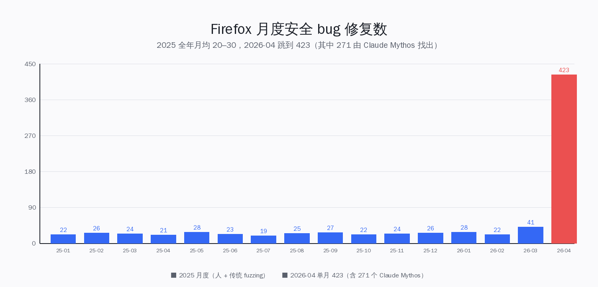
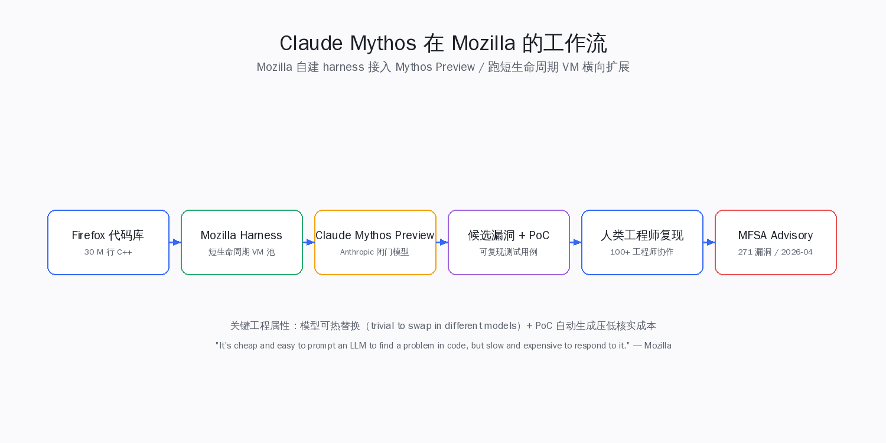
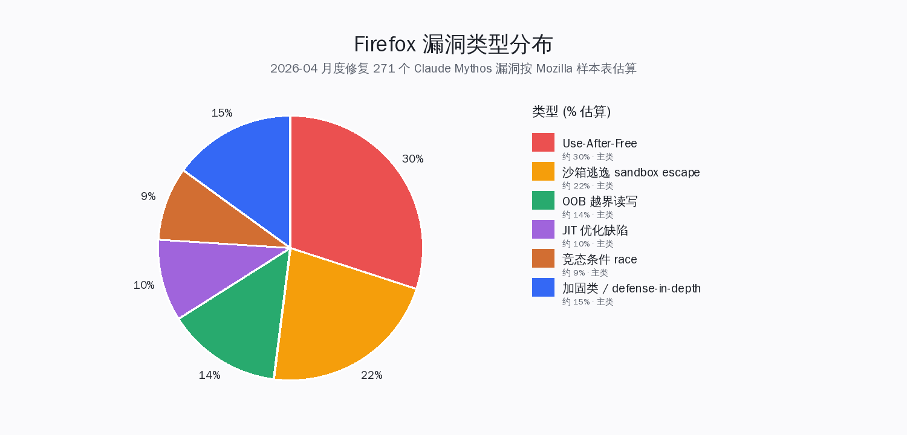
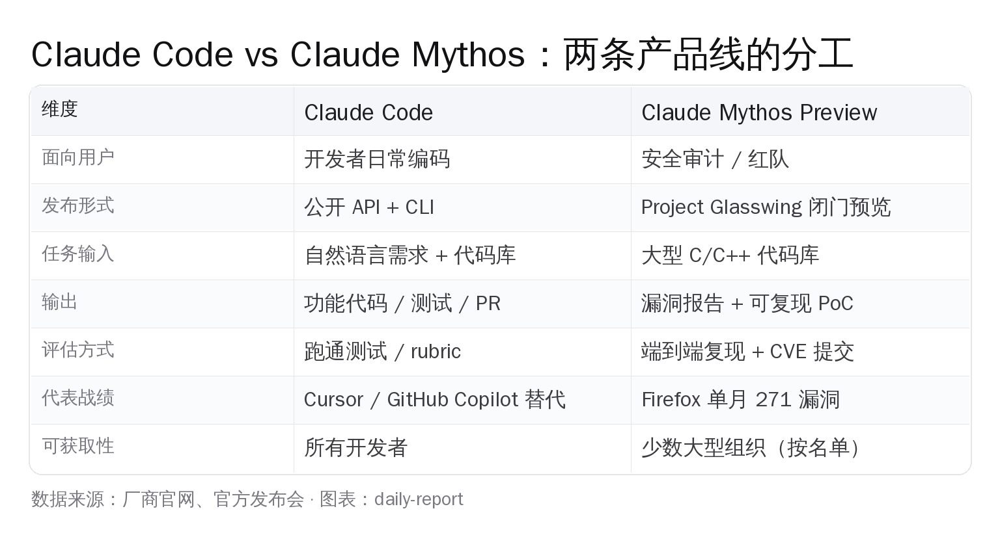
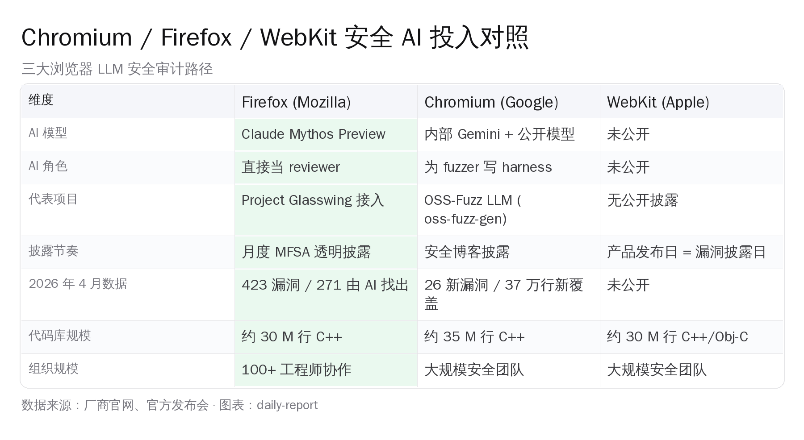

# Firefox 一个月修 423 个漏洞：Claude 当上了 Mozilla 的安全审计员


5 月 7 日，美国 Mozilla 在 Mozilla Hacks 博客上把一张图甩了出来：2025 年全年，Firefox 每个月修 20 到 30 个安全漏洞；2026 年 4 月，单月修了 **423 个**。这中间隔了一个新的工程参与者——Anthropic 的 Claude Mythos Preview。这不是又一篇"AI 改变安全"的概念稿，而是一个 30 M 行 C++ 代码库、超过 100 个工程师、3 个月工程化跑下来的一手数字。AI Coding 的下一阶段已经不是"帮你写函数"，是"翻出 20 年前没人看见的 use-after-free"。

## 一、Simon Willison 5 月 7 日扔出的数字

Simon Willison 在自己博客上转发了 Mozilla Hacks 那篇《Behind the Scenes: Hardening Firefox with Claude Mythos Preview》。他抓住的核心数字只有一组：

- **基线**：Firefox 2025 年 1—12 月，每月修安全 bug 区间 20—30，月均 17—26
- **峰值**：2026 年 4 月，单月修 **423 个**
- **来源拆解**（Mozilla 原文）：271 个由 Claude Mythos Preview 在 Firefox 150 评估中发现，41 个外部研究者上报，**111 个内部发现**（其中包括 Mythos 在非 150 版本修的、其他模型发现的、传统 fuzzing 发现的三类）



Simon 给这件事定了个标题——"Suddenly, the bugs are very good"，这是 Mozilla 工程师在原文里的一节副标题。意思直白：以前 AI 找出来的"漏洞"大多是噪音，从这一代开始不是了。

## 二、Mythos 是什么：从工作流到产品的拆解

需要先把"Claude Mythos"这个名词拆清楚——它不是 Claude 4.7 那种公开模型，也不是某个 IDE 插件。

Anthropic 在 4 月初推出 **Claude Mythos Preview**，本质是一个**专门做漏洞挖掘的封闭预览模型**，通过一个叫 **Project Glasswing** 的门槛极高的访问计划释出，对象是少数大型科技、网络安全、金融机构。Anthropic 拒绝公开发布，理由写得很硬：这个模型可以反过来被用来挖 0day。

Mozilla 拿到访问权限有两段：

1. **2 月**：Anthropic 内部红队先用 **Claude Opus 4.6** 对 Firefox 跑了一轮，把发现的问题打包给 Mozilla。Mozilla 在 Firefox 148 修了其中 22 个安全敏感 bug，对应官方 advisory 里点名 Claude 的三个 CVE：CVE-2026-6746、CVE-2026-6757、CVE-2026-6758
2. **3—4 月**：Mozilla 拿到 Mythos Preview 的完整访问权限后，自己**在已有 fuzzing 基础设施之上搭了一套 harness**，跑出 271 个漏洞，4 月 21 日随 Firefox 150 一次性发布



Mozilla 工程师在原文里强调这套 harness 的几个工程属性：

- 给模型"正确的接口和指令"，模型可以**自己造可复现的测试用例**
- 跑在大量短生命周期 VM 上，吃水平扩展
- 模型可以热替换——"trivial to swap in different models"，意味着这套基础设施不是只为 Mythos 写的，未来换一个更强的模型直接接上

这一点非常关键：**Mythos 的价值不只是"模型很强"，而是 Mozilla 把它工程化成了一条流水线**。这条流水线的产出能力——而不是模型单点能力——才是 423 这个数字的解释。

## 三、20-30 → 423 的工程飞跃：到底改变了什么

把 Firefox 月修漏洞从 20-30 拉到 423，需要三件事同时成立。任何一件不到位，这条流水线就跑不出来。

**第一，模型有效**。Anthropic 红队 2 月先跑了一轮，把发现交给 Mozilla，22 个真问题进了 Firefox 148 advisory——这是 Mozilla 决定把基础设施投入下去的前置信号。如果第一轮全是噪音、误报率高，后面 100+ 工程师的投入根本不会发生。一个常被低估的事实：**Mythos 之前的 LLM 跑安全审计早就有人试过**，2024 年到 2025 年间 Anthropic、OpenAI、Google 各自的旗舰模型都被研究者拿去对开源代码库做过类似实验，普遍结论是"召回还行，精度太差，工程师审完一圈下来时间还不如自己 review 来得快"。Mythos 这一代变化的关键，是**让真阳性比例从无法量产的水位提到了可量产的水位**。

**第二，差速器变了**。Mozilla 工程师在原文里写了一句对从业者最扎心的话：

> "It's cheap and easy to prompt an LLM to find a 'problem' in code, but slow and expensive to respond to it."

让 LLM 报"问题"很便宜，但人工去**核实、复现、修、回归测试**很贵。换句话说，找漏洞的成本曲线被 AI 拉平了，但**修漏洞的成本曲线没拉平**。所以 Mythos 不只是模型，是模型 + 一个能够自己写出**可复现 PoC** 的能力——把核实成本也压下去了一截。这一点和上一代 LLM 安全工具最大的不同在这里：上一代输出"我觉得这里有 UAF"，工程师还要花半小时构造触发条件；这一代输出"这里是 UAF，触发它的最小测试用例如下"，工程师只要 5 分钟跑一下就能进入修复环节。**核实成本从半小时压到 5 分钟，意味着同样工时下的吞吐能多扫一个数量级的代码**。

**第三，组织能扛**。"Over 100 people contributed code to this effort"——超过 100 人参与，覆盖 patch 编写、code review、流水线扩容、漏洞分类、测试、发版管理。这是非常重的工程开销，能扛下来的只有 Mozilla、Google、Apple 这一档的浏览器组织。换个角度看：如果一个 50 人的小团队拿到 271 个漏洞报告，光分类和复现就够吃半年；Mozilla 能在 4 月一次性发出去，**靠的是流水线 + 团队规模 + 早就建好的 advisory 生产能力**这三件预先沉淀。

```
基线（2025 月均）：
  人类 + 传统 fuzzing → 20-30 bugs/月

新流水线（2026 年 4 月）：
  Mythos Preview + 自建 harness + 100+ 工程师协作
  → 423 bugs/月（其中 271 来自 Mythos）

差速器：
  发现成本 ↓↓↓
  修复成本 ↓（PoC 自动生成）
  组织协调成本 ↑↑（100 人级别工程动员）
```

**判断**：这不是"AI 替代了安全工程师"，是"AI 把安全工程师的瓶颈从'看哪里'换成了'修多快'"。

## 四、这 271 个漏洞到底长什么样

Mozilla 在博客里给了一张样本表，泄露了漏洞分类的轮廓。注意，**只有 3 个 Mythos 漏洞拿到了独立 CVE**（CVE-2026-6746/6757/6758），剩下 268 个被 Mozilla 合并打包到几个累计 CVE（按月发的 MFSA 公告里编号）中。

为什么大量漏洞拿不到独立 CVE？**SecurityWeek** 解释得很到位——大量是 defense-in-depth、加固、不可达代码路径的潜在问题，单独看不够 CVE 门槛，但合在一起就是一次系统性硬化。



从 Mozilla 给的样本看，**类型分布**集中在浏览器最危险的几类：

- **Use-After-Free（UAF）**：bug 2021894 / 2024653 / 2022733 / 2027298 / 2029813
- **沙箱逃逸（sandbox escape）**：bug 2021894 / 2022034 / 2022733 / 2023817 / 2029813
- **OOB（越界读写）**：bug 2023958
- **JIT 优化缺陷**：bug 2024918
- **竞态条件（race condition）**：bug 2021894 / 2022733

更值得注意的是**两个老古董**——Mozilla 自己点名出来：

- 一个 **20 年前的 XSLT bug**：Firefox 的 XSLT 处理代码大体在 Gecko 1.x 时代写就，2005 年前后定型，过去 20 年里被每一轮 fuzzing 反复扫过，都没翻出这个角落
- 一个 **15 年前的 `<legend>` 元素 bug**：HTML form 表单的 `<legend>` 元素在浏览器引擎里是个边缘元素，相关代码路径很少被主流 fuzzer 覆盖到

这俩漏洞躺在 Firefox 代码库里十几年，每一年都有人类 reviewer 走过、每一轮 fuzzing 跑过，都没出来。**Mythos 一次评估就翻了出来**。Google OSS-Fuzz 的 LLM-augmented 工作流报出过类似情况——CVE-2024-9143（OpenSSL OOB read），OpenSSL 这套代码库是过去十几年里全球被 fuzz 最狠的代码库之一，"几十万小时算力跑过"的级别，仍然没扫出来。两个独立项目得出同一个结论：**LLM 不是单点比传统 fuzzer 更强，是覆盖了"人类和传统 fuzzer 都会跳过的代码路径"**。

为什么传统 fuzzer 会跳过？因为 fuzzer 依赖 corpus（输入样本），corpus 没覆盖的代码路径再怎么跑也跑不进去；人类 reviewer 依赖经验，经验没指过的角落自然不会去翻。LLM 的不同在于：**它对代码的"覆盖意图"不是来自 corpus 也不是来自经验**，是来自对代码语义的全局理解。它会"读到"`<legend>` 这种边缘元素，意识到"这里有 form / focus / accessibility 三套路径交叉，值得重点看一下"——而这种判断在过去只能靠人类专家在某次 code review 里偶然产生。

## 五、Claude 在安全审计上的边界

吹完产能再泼冷水。Mozilla Distinguished Engineer Bobby Holley 在 mozilla.org 隐私安全博客里有一段话经常被忽略：

> "We haven't seen any bugs that couldn't have been found by an elite human researcher."

翻译：**没有任何一个漏洞是人类顶级研究员理论上找不到的**。

这句话有两层含义：

**第一，模型没有"发明"新漏洞类**。271 个全在已知漏洞 taxonomy 内（UAF、OOB、沙箱逃逸、JIT、竞态…）。Mozilla 没有发现"AI 发现了人类无法理解的漏洞"——而这正好是 Mozilla 想要的，因为代码可被人类理性 review 这件事本身是浏览器安全的护城河，AI 不能把这条护城河填掉。

**第二，模型的边界是"规模 + 覆盖"，不是"超越人类"**。它能在十几年没人摸的代码角落里翻东西，是因为它**不嫌烦、不收疲劳税**，不是因为它比 Project Zero 的人更聪明。这意味着——



**人在 loop 仍然必要**：

| 环节 | AI 能做 | 仍需人 |
|---|---|---|
| 找可疑代码路径 | 强 | 抽查方向 |
| 生成 PoC | 中-强 | 复现验证 |
| 判定可利用性 | 弱 | 必须人判 |
| 写补丁 | 中 | review + 回归 |
| 决定 advisory 措辞 | 不能做 | 必须人 |

Mozilla 的工程师在原文写了一句很冷静的话：**"Every bug requires care and attention to properly fix."** 就算 271 个 bug 都是模型找的，每个补丁仍然是工程师手写、人 review、跑回归。

还有一条隐性边界值得说出来：**模型本身的可靠性是不可审计的**。Mozilla 这次能够信任 Mythos 的输出，前提是 Mozilla 工程师**自己复现了每一个**。一旦组织尺度大到"无法逐个复现"，AI 报出来的漏洞和 AI 写的补丁就会变成新的不透明黑盒。这件事在浏览器这种代码库还能扛——人多、流程严；放到内部代码库 50 人小团队就扛不住。**这是规模化复制 Mozilla 范式时绕不过的一个坑**。

## 六、Chromium / WebKit 在做什么

业内必须问的一个对照问题：Google 和 Apple 没在做同样的事吗？

**Google 那边**节奏不同。Google 的路径不是"接外面的封闭模型"，而是把 LLM 整合进自家 **OSS-Fuzz** 流水线（2023 年 8 月开始用 LLM 自动生成 fuzz target，2024 年 11 月开源 oss-fuzz-gen，提了 26 个新漏洞，覆盖 272 个 C/C++ 项目，新增 37 万行代码覆盖）。Google 的论调更克制——"AI 帮 fuzzer 写 harness"，而 Mozilla 的论调激进——"AI 直接当 reviewer"。**两条路线对应了两种 AI 角色定位**。



**Apple WebKit** 这边目前没有公开的 LLM 安全审计披露。Apple 的安全节奏一向是"产品发布日 = 漏洞披露日"，工程过程不对外。

为什么 Mozilla 会成为第一个吃螃蟹的？三个结构性原因：

1. **Anthropic 主动给 Project Glasswing 名单**，Mozilla 是少数被点名的大型组织
2. **Firefox 是开源代码库**，Mozilla 没有"内部代码隐私"顾虑，可以让模型大规模扫
3. **Mozilla 团队规模相对小**（对比 Google 安全团队），AI 杠杆收益更高

Mozilla 自己的判断（来自 mozilla.org 博客）：

> "Defenders finally have a chance to win, decisively."

意思是攻防长期是攻击方占优（攻击方只需找一个口子，防守方要堵所有口子），AI 把"机器可发现"和"人类可发现"漏洞之间的差距压平了，**这块差距正好是攻击方过去的优势区**。

## 七、国产浏览器和国产 AI 安全工具

国内这边节奏要诚实地说——**没有同样规模的公开案例**。

国产浏览器（夸克、UC、QQ 浏览器、360 极速浏览器、华为浏览器等）的安全审计流程不公开披露。开源的国产 Chromium 衍生项目里，安全 commit message 量级也没出现 4 月份这种突变。

国产 AI 模型在安全这件事上的进度：

- **DeepSeek**、**Qwen** 都开源，研究者社区有零星的"用 DeepSeek-V3 跑 CTF"、"用 Qwen3 找 buffer overflow 玩具样本"的复现
- 学术圈有论文（清华、浙大、中科院信工所）讨论 LLM 辅助二进制审计、模糊测试 harness 自动生成
- **工程化产品**意义上，国内还没有看到类似 Project Glasswing 这种"封闭高阶模型 + 大型组织闭门部署"的公开范例

这不是"国产落后"——是**这套范式高度依赖三件事**：

1. 一个明显比公开模型强的"高阶模型"
2. 一个大型且开源的目标代码库（Firefox / OpenSSL 这一档）
3. 一个能扛 100+ 人级别工程动员的组织

国内三件事拼齐的窗口正在打开。Qwen3、DeepSeek-V4 这一档模型在代码理解上已经接近 Claude 主线；OpenHarmony、龙蜥、欧拉这种开源大型代码库存在，最近一年的 commit 量级和模块复杂度都到了"值得 AI 全量审一遍"的体量；阿里云、字节、华为内部的安全团队规模够。**模式可复制，时间窗在今年**。

具体可以看到的两个抓手：

**第一**，**OpenHarmony 内核安全审计**。OpenHarmony 已经覆盖到亿台量级设备，内核是 C/C++ 大代码库，公开可审计。如果有团队愿意做"国产 Mythos"的早期投入，OpenHarmony 是天然的练兵场。

**第二**，**国产浏览器（夸克 / 360 / 华为 / 小米）的安全审计开放化**。现在国产浏览器的安全披露节奏远不如 Firefox 透明，**这本身是一种结构性损失**——既不能让外部研究者更高效地帮忙找漏洞，也不利于建立"国产浏览器安全水位"的公共认知。如果谁愿意走 Mozilla 这条公开披露路线，把"我们一个月修了多少漏洞、多少 AI 找出来的"做成对外可见的指标，长期收益是可观的。

## 八、对 AI Coding 行业的几条硬启示

把镜头从浏览器拉回 AI Coding 行业本身，Mythos 这件事至少抛出五条结论：

**1. AI Coding 的天花板已经从"功能代码"走到了"安全代码"**。一年前我们讨论 Cursor 能不能写好一个 React 组件；现在讨论的是 Claude 能不能在 30 M 行 C++ 里翻 20 年的 UAF。**复杂度量级**完全不同。

**2. "找问题"和"修问题"的成本不对称将长期存在**。这是 Mozilla 工程师那句"cheap to find, expensive to fix"的本质。任何想做 AI 安全审计产品的团队，必须把**核实链路**当一等公民设计——光报漏洞没人看，能复现 + 能给 PoC + 能给修复建议才有商业化空间。

**3. Harness 是壁垒，不是模型**。Mozilla 这次的真正资产不是"我用了 Mythos"，是"我有一套 harness 能让任何强一点的模型接上就跑"。模型会换，harness 会沉淀。

**4. CVE 编号制度被冲击**。271 个漏洞合并到 3 个 CVE，这件事说明传统漏洞披露体系在面对 AI 规模产出时已经变形。下一步 MITRE / CNA 怎么处理？这是一个开放问题。

**5. "防守方决定性获胜"是一个值得追的命题**。如果 Mozilla 的预言成立——AI 把发现成本压平、攻防天平向防守倾斜——那今天投入到 AI 安全审计基础设施上的工程师，是接下来 5 年最稀缺的人才。这条赛道上**国内同行起步并不晚**，需要的是把"模型 + harness + 大代码库"三件事拼起来跑一次的勇气。

**还需要补充一条审慎**：Mozilla 这件事之所以成立，前提是 Anthropic 把模型握得很紧——Project Glasswing 拒绝公开发布、严控访问名单。**因为这个模型反过来也是攻击工具**。同一个能扫 271 个漏洞的模型，攻击者拿去也能扫 271 个 0day。如果未来这一档模型逐步开源、或者被某个不那么自律的厂商释放出来，**攻防天平不一定倒向防守**。"AI 让防守方赢"这个命题成立的前提是**防守方先用上、并且攻击方拿不到**。今天 Mozilla 是赢的；明年攻击方拿到等价模型时，是另一个故事。

**对国内做 AI 安全的同行来说，这件事的现实意义是双面的**：一面是工程范式可学——harness 怎么搭、人在 loop 怎么布、复现成本怎么压；另一面是**赛跑窗口很短**——拿到高阶模型并把它产品化的窗口期，决定了未来三五年是占优还是被动挨打。

---

**编辑说**：Mozilla 这次披露最反常的一点是**主动晒数字**——浏览器厂商极少公开"我们这个月修了几百个漏洞"，因为听起来像"我们之前漏洞很多"。Mozilla 这次愿意晒，说明他们认定**长期叙事赢过短期面子**：让所有人看到 AI 把漏洞挖掘工业化是怎么发生的，比掩盖更值得。这件事的下一个观察点，是 Google Project Zero 和 Apple Security Research 是否会跟进披露自己的 AI 流水线。

**主要参考源**：
- Mozilla Hacks: Behind the Scenes Hardening Firefox with Claude Mythos Preview
- Mozilla Blog (隐私安全): The zero-days are numbered
- Simon Willison's Weblog (5 月 7 日转述与点评)
- SecurityWeek / Help Net Security / Schneier on Security 行业跟进报道
- Google Security Blog: Leveling Up Fuzzing (OSS-Fuzz LLM 对照参照)
