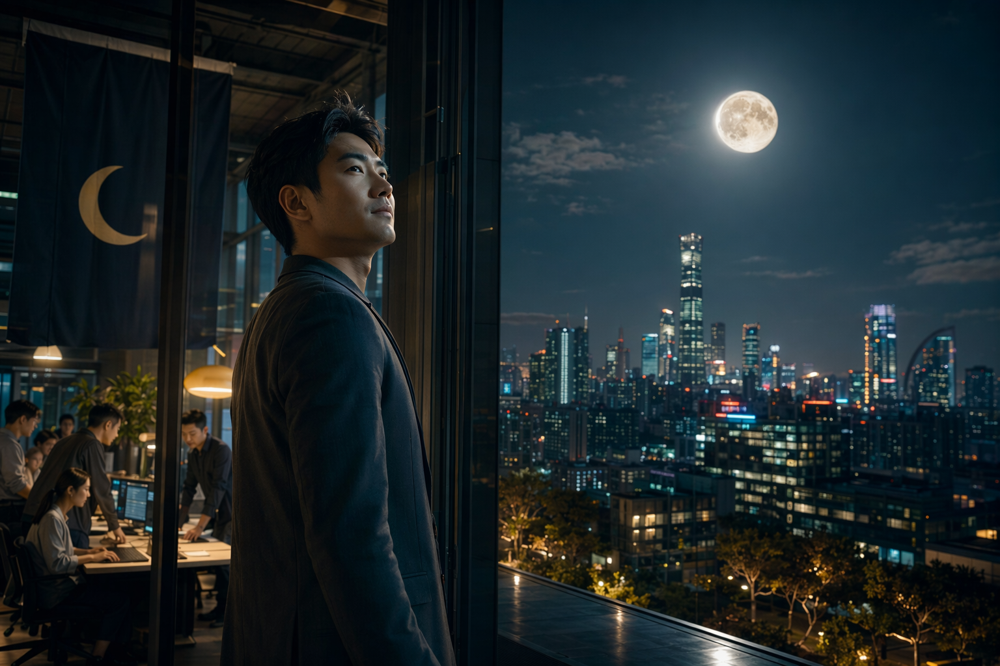
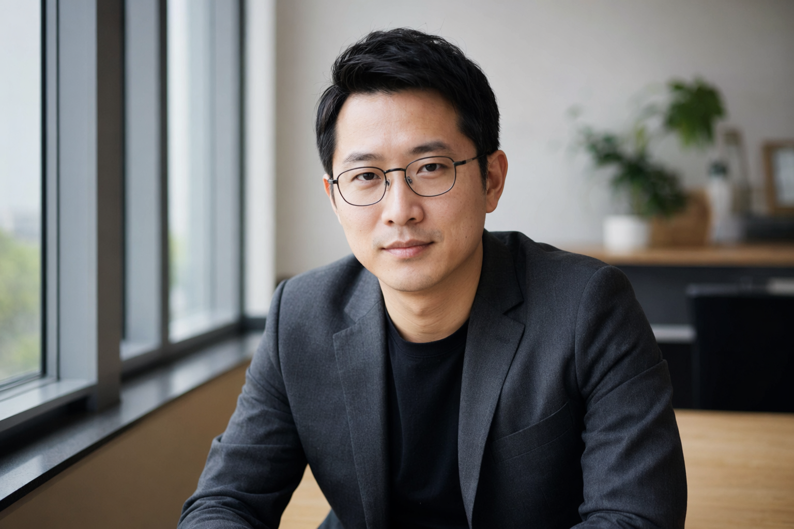
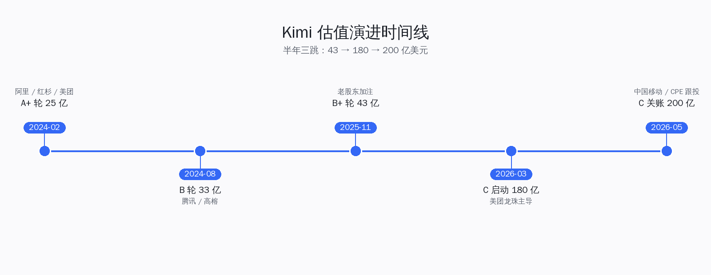
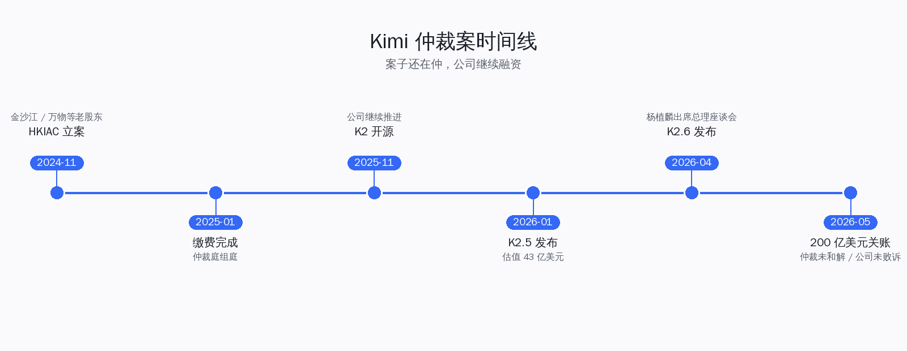
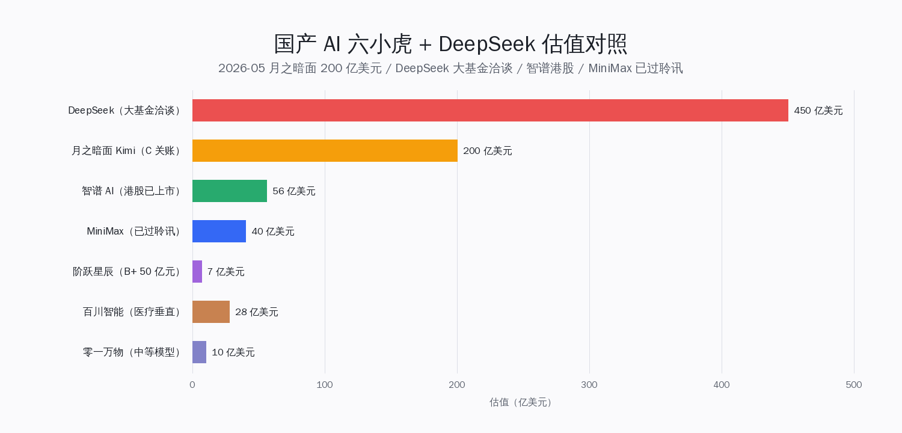
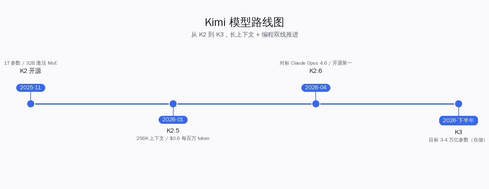

# 杨植麟回来了：月之暗面 200 亿估值再起

5 月 6 日下午，晚点先放出消息，新浪科技、网易随后跟上：月之暗面新一轮融资 20 亿美元（约 140 亿元人民币）已经走完关键流程，投后估值站上 200 亿美元（约 1400 亿元人民币），美团龙珠领投，中国移动、CPE 源峰跟投，多家老股东加注。把这个数字放到 Kimi 自己的时间线上，去年 11 月这家公司还在 43 亿美元这一档，3 月中旬过到 180 亿美元，5 月再加 20 亿一把推到 200 亿——半年估值翻 4 倍多。仲裁还没和解，朱啸虎那一战没翻篇，但杨植麟没躲，他在 4 月 10 日已经坐进了总理主持的企业家座谈会，是当天唯一一位大模型创业者代表。这篇文章把这一轮融资的数字、人、产品、六小虎座次拆清楚。

## 一、5 月 6 日下午的消息：晚点先放，新浪跟上

时间线先理一遍。**5 月 6 日 14 点前后**，晚点 LatePost 独家发出"月之暗面将完成 20 亿美元新融资，估值破 200 亿美元"。当天下午到傍晚，新浪科技、网易科技、第一财经、虎嗅按顺序跟进，**5 月 7 日**早上各家把"美团龙珠领投"做成新一轮的关键词。虎嗅同日发了三条聚焦稿，一条做融资本身，一条做"杨植麟手里还有 100 亿现金"的旧内部信回锚，一条做 K2.6 + 商业化数据。

这一轮关键事实，新浪、网易、晚点三家口径一致，可以当硬数据用：

| 项目 | 数字 | 来源 |
|---|---|---|
| 本轮融资 | 20 亿美元（约 140 亿元人民币） | 晚点 / 新浪 / 网易 |
| 投后估值 | 200 亿美元（约 1400 亿元人民币） | 晚点 / 新浪 / 网易 |
| 领投方 | 美团龙珠 | 新浪 / 网易 |
| 跟投方 | 中国移动、CPE 源峰、多家老股东 | 新浪 / 网易 |
| 累计融资 | 超 376 亿元人民币（约 52 亿美元） | 虎嗅 |
| 4 月 ARR | 超 2 亿美元 | 虎嗅 |
| 3 月 ARR | 突破 1 亿美元 | 虎嗅 |

这里要先解一个数字歧义：媒体标题里"20 亿"和"140 亿"指的是同一笔钱，前者是美元、后者是按 7 比 1 折算的人民币口径。本文如无特别说明，金额一律用美元，需要换算时显式标注 RMB。

> **判断**：在国产 AI 一线公司里，半年内 43 → 180 → 200 亿美元这种估值斜率，过去只有 OpenAI 和 Anthropic 走过；月之暗面这一轮把自己拉到了智谱、MiniMax、阶跃星辰之上的单独一档。

## 二、20 亿美元融资细节：领投人换了，跟投方变重了

这一轮和此前几轮最大的不一样，是领投人不再是清一色的纯财务 VC，而是**美团龙珠**——美团的产业资本平台。再往下看跟投：

- **美团龙珠**（领投）：美团旗下产业资本，过去重押过元气森林、喜茶，进 AI 赛道是奔着接入美团自己的本地生活场景去的
- **中国移动**：据晚点 / 新浪报道，这是国家队，三大运营商里第一家以股权方式而不是只签算力合同进 Kimi 的
- **CPE 源峰**：人民币 + 美元双币基金，2024 年起多次加注国产 LLM
- **多家老股东加注**：阿里、腾讯、红杉中国、高榕、博裕、美团此前也都在册

这一轮把月之暗面的资方结构从"互联网大厂 + 美元 VC"改成了"互联网大厂 + 国家队 + 产业资本"。配合 4 月 10 日杨植麟现身总理座谈会，这一笔 20 亿美元已经不是单纯的 C 轮接续，更像是国产六小虎里第一家拿到产业 + 政策双背书的公司。

> **判断**：领投方从纯 VC 切到产业资本，意味着月之暗面这一轮的估值不是按"下一轮还能卖给谁"算的，是按"美团本地生活 + 移动云 + Kimi App 用户"三方场景协同算的——产业资本愿意给溢价，是因为它要自己用。

## 三、估值演进时间线：从 43 亿到 200 亿，半年三跳

把月之暗面 6 个月内的估值跳跃单独拎出来看，会更清楚这一轮的位置。

| 时间 | 轮次 | 单轮规模 | 投后估值 | 关键投资人 |
|---|---|---|---|---|
| 2024 年 2 月 | A+ | 超 10 亿美元 | 25 亿美元 | 阿里、红杉、小红书、美团 |
| 2024 年 8 月 | B | 3 亿美元 | 33 亿美元 | 腾讯、高榕 |
| 2025 年 11 月 | B+ | 5 亿美元 | 43 亿美元 | 阿里、腾讯老股东 |
| 2026 年 3 月 | C 启动 | 计划 10 亿 | 谈到 180 亿美元 | 美团龙珠主导 |
| 2026 年 5 月 | C 关账 | 实际 20 亿 | **200 亿美元** | **美团龙珠领投，中国移动、CPE 源峰跟投** |

这里有个数据要显式合并：

- 网易、晚点写"上一轮 43 亿美元（去年 11 月）翻 4 倍多"
- 新浪科技写"3 月中旬 180 亿美元，3 个月翻倍到 200 亿"

两个数字都对，差别在选哪一轮做基准——**43 亿是真实的上一轮关账估值（B+ 轮，2025 年 11 月），180 亿是 3 月这一轮 C 启动时和投资人谈的中间数，最终 5 月以 200 亿关账**。把"半年 43 → 200"和"3 个月 180 → 200"放在一起看，斜率更靠前者。

> **判断**：43 → 200 的斜率有两个推力，一是 K2.6 在 4 月 21 日上线后冲到开源编程榜第一，二是 ARR 从 1 亿美元涨到 2 亿美元只用了一个月——技术 + 商业化双拉，估值才咬得住。

## 四、月之暗面这一年：仲裁、K2、K2.6、Kimi App、出海

把镜头拉远一点看月之暗面 2025 年 11 月到 2026 年 5 月这半年发生的事，会更清楚为什么这一轮 200 亿美元站得住。

**仲裁案**这条线，至今没和解。事件起点是 2024 年 11 月——循环智能时期的金沙江、万物、靖亚、华山、博裕几家老投资人在香港国际仲裁中心 HKIAC 提起仲裁，认为杨植麟、张宇韬另起月之暗面前没拿齐豁免书。2025 年 1 月底和 2 月下旬，双方先后完成 HKIAC 缴费，仲裁庭已组庭。**2026 年 5 月这一刻，案子还在仲裁程序里走，并未和解，也并未败诉**——这是为什么这一轮融资能继续走的前提，否则美团龙珠不可能领投。

**模型这条线**走得很快：

- **2025 年 11 月**：Kimi K2 开源，1T 总参数 32B 激活的 MoE，国产开源里第一次站到 GPT-4o 同档
- **2026 年 1 月 27 日**：K2.5 发布，把上下文从 128K 推到 256K，价格压到每百万 tokens 0.6 美元
- **2026 年 4 月 21 日**：K2.6 正式开源，benchmark 在编程评测上对标 Claude Opus 4.6，内部数据"可连续编码 13 小时，Agent 自主运行 5 天"（虎嗅披露，月之暗面官方未单独确认），全球开源模型排名第一
- **K3**：内部已经在做，目标是参数规模追平美国头部模型（3-4 万亿参数级别）

**商业化这条线**是这一轮估值真正的支点。1 月底 K2.5 发布后 20 天，Kimi 收入就超过了 2025 年全年；个人订阅 1 月环比涨 8280%，2 月再涨 123.8%；3 月 ARR 破 1 亿美元、4 月破 2 亿美元，进了 Stripe 全球榜前十。CES 上黄仁勋演示 GPU 性能基准时，把 DeepSeek 和 Kimi 一起拉上了对照表。

> **判断**：仲裁案没结束、但也没拖死公司；模型节奏咬住了一年三代；商业化用一个季度从年化 0 跑到年化 24 亿美元。这三条线同时成立，是 200 亿美元估值能拿到产业资本背书的底层。

## 五、200 亿美元在国产 AI 赛道里站哪个位

把六小虎 + DeepSeek + 字节、阿里这一档放一起对照，月之暗面这一轮的位置就出来了。

| 公司 | 最新估值 | 备注 |
|---|---|---|
| 字节豆包 | 公司内部，未单独估值 | 字节整体 3000 亿美元 |
| 阿里通义 | 公司内部，未单独估值 | 阿里集团 |
| 智谱 AI | 约 400 亿元人民币（约 56 亿美元） | 已通过港交所聆讯，冲"大模型第一股" |
| MiniMax | 约 40 亿美元 | 2025 年 7 月 C 轮，已通过港交所聆讯 |
| **月之暗面** | **200 亿美元** | **本轮，美团龙珠领投** |
| DeepSeek | 一级市场未公开，2026 年 5 月最新轮 4500 亿元（约 630 亿美元） | 中央汇金 + 国新国资领投 |
| 阶跃星辰 | 一级市场，2026 Q1 B+ 轮 50 亿元 | 单笔大模型融资创纪录 |
| 百川智能 | 战略转向医疗垂直 | 不再追基础模型 |
| 零一万物 | 战略转向中等模型 | 不再追基础模型 |

把月之暗面的 200 亿美元放进这张表，能看出三件事：一是它已经把智谱、MiniMax 甩开了一档（200 亿美元 vs. 56 亿、40 亿），二是它和 DeepSeek 之间还有 3 倍多的距离，三是六小虎从 6 家变成"3 家追基础模型 + 2 家做垂直 + 1 家做中等模型"，月之暗面坐稳了基础模型第一梯队的另一席。

> **判断**：六小虎的故事不是过去式，而是分流式。智谱和 MiniMax 上市冲第一股，月之暗面在一级市场拿产业资本溢价，DeepSeek 拿国家队，三条路同时走得通——这对国产 AI 整体估值锚是好消息。

## 六、产品矩阵：Kimi App、K2.6、Kimi Code 各自跑哪一段

月之暗面这一轮 200 亿美元值不值，最后要落到产品矩阵能不能撑得起 ARR。把目前在跑的几个口径拆开看：

**Kimi App（C 端）**：去年砍了大笔投流之后，今年靠 K2.5 / K2.6 在长上下文 + 中文写作上的口碑反弹，Stripe 个人订阅 1 月环比涨 8280%、2 月再涨 123.8% 主要来自这里。海外订阅在意大利、巴西、墨西哥跑得比国内快，订单暴涨 8280% 的口径里，海外占大头。

**Kimi K2.6 API（B 端）**：4 月 21 日开源 + 商用 API 双发，价格按每百万 tokens 0.6 美元起，对应同档 Claude Opus 4.6 的价格大概是 1/8 到 1/10。内部数据可连续编码 13 小时、Agent 可自主运行 5 天、原生 Agent Swarm 编排最多 300 个子智能体（虎嗅披露，月之暗面官方未单独确认）。

**Kimi Code / Kimi Coder**：这条线上 4 天前我们已经写过 K2.6 编程版细节，这里只补一句——K2.6 编程版在 SWE-bench、Aider、HumanEval 三张榜上都是开源第一，Aider 上和 Claude Sonnet 4.5 差距收到 3 个百分点以内，是 ARR 涨得最快的那部分。

**K3（在做）**：参数目标 3-4 万亿，对标 GPT-5.5 和 Claude Opus 4.7，预计今年下半年。

> **判断**：Kimi 这一轮 ARR 从 1 亿到 2 亿美元只用一个月，是 C 端订阅 + B 端 API 同时拉起来的——单独靠任何一条都不可能这么快。这种结构比"主要靠 API"的 DeepSeek、"主要靠 To B"的智谱都更接近 OpenAI 早期的 ARR 曲线形状。

## 七、海外资本怎么看月之暗面

这一轮 20 亿美元里，海外资本的占比比上一轮明显增加。从公开报道能拼出来的几个口径：

- **CPE 源峰**：人民币 + 美元双币，里面美元部分主要来自中东主权基金、新加坡 GIC 这一档
- **老股东加注**：红杉中国（已独立成 HongShan）、高榕这两家本来就有美元基金参与
- **被动 LP**：晚点报道提到，几家中东主权基金通过 SPV 架构进入

海外这边的逻辑很直接——OpenAI 估值已经 5000 亿美元，Anthropic 1700 亿美元，国产对标公司里月之暗面是少数几家在编程基准、长上下文、商业化 ARR 三项上都摸到第一梯队的。200 亿美元相对 OpenAI 是 1/25，相对 Anthropic 是 1/8.5，海外资本愿意在这个折扣上下注国产替代。

> **判断**：海外资本进 Kimi 这一轮，不是抄底中国资产，而是在押"国产模型 + 中文场景 + 出海订阅"这三件事会同时成立——Kimi 4 月在意大利、巴西、墨西哥的订单数据是真实的支点。

## 八、对国产 AI 一线格局的影响

把这一轮 20 亿美元放回 2026 年 5 月这个时间点上，它带出三个新坐标：

**第一，国产基础模型公司的估值上限被重新定义。**之前国产六小虎里最高估值是 MiniMax 的 40 亿美元，月之暗面这一跳直接把上限拉到 200 亿——这意味着智谱、MiniMax 后续融资 / 上市定价时有了一个新的对照锚。智谱已经过聆讯、估值约 56 亿美元；MiniMax 估值 40 亿美元；上市估值大概率会向月之暗面这一轮的产业资本估值靠拢。

**第二，产业资本（CVC）开始正式接管国产 LLM 的下一轮接续。**美团龙珠领投、中国移动跟投、字节阿里腾讯都已经在册——纯财务 VC 在国产基础模型上的话语权正在让位于"自己要用"的产业资本。这一点比单纯估值数字更重要，它决定了未来三年这些公司会优先服务谁。

**第三，杨植麟个人在国产 AI 创业者里的位置被重新确认。**4 月 10 日总理座谈会、5 月 6 日 200 亿美元关账、K2.6 开源第一——这三件事几乎是连着发生的。在仲裁案没和解的状态下，他依然能拿到产业 + 政策双背书，这本身就是一种企业家级别的韧劲。国产 AI 一线创业者经过 2024-2025 那一波估值回调和叙事退潮之后，能再起一轮，对行业整体是好事。

国产 AI 这一年走得不容易，杨植麟回来这一轮拉得很硬。

---

## 数据来源

- 晚点 LatePost：[月之暗面将完成 20 亿美元新融资，估值破 200 亿美元](https://m.163.com/dy/article/KS8RC3EL0531M1CO.html)（2026-05-06）
- 新浪科技：[估值超 200 亿美元，美团龙珠领投月之暗面 20 亿美元新融资](https://finance.sina.com.cn/tech/roll/2026-05-07/doc-inhwzrtp8524089.shtml)（2026-05-07）
- 新浪财经：[月之暗面，估值突破 1400 亿？](https://finance.sina.com.cn/wm/2026-05-06/doc-inhwyqfz3231215.shtml)（2026-05-06）
- 网易科技：[月之暗面完成 20 亿美元融资，估值突破 200 亿美元](https://www.163.com/tech/article/KSB6VSAQ00098IEO.html)（2026-05-07）
- 虎嗅：[杨植麟现身后 Kimi 又融资 140 亿](https://www.huxiu.com/article/4856158.html)（2026-05-07）
- 虎嗅：[大模型初创公司融资热潮持续，Kimi 半年估值翻 4 倍达 200 亿美元](https://www.huxiu.com/article/4856343.html)
- 财联社：[Kimi 仲裁案最新进展](https://www.cls.cn/detail/1881873)
- 21 经济网：[月之暗面创始人被前投资人仲裁](https://www.21jingji.com/article/20241111/herald/976e76053e24cb1ddde32fba7fdb6e59.html)
- 量子位：[阶跃星辰跻身 AI 新六小虎](https://www.qbitai.com/2026/02/382747.html)

⚠️ 不确定项：
- 累计融资 376 亿元人民币的口径取自虎嗅，含 2024 年 A 轮以来全部轮次；不同媒体在汇率折算与轮次划分上略有差异
- 中国移动以股权方式入股 Kimi 的最终签约金额、CPE 源峰背后的 LP 结构，截至发稿日尚未由月之暗面或运营商官方确认
- K3 的具体参数、上下文长度、发布时间均为业内传言口径，月之暗面官方未公开 roadmap
- 4 月 10 日杨植麟出席的"总理主持企业家座谈会"，为媒体口径，未见官方新华社通稿
