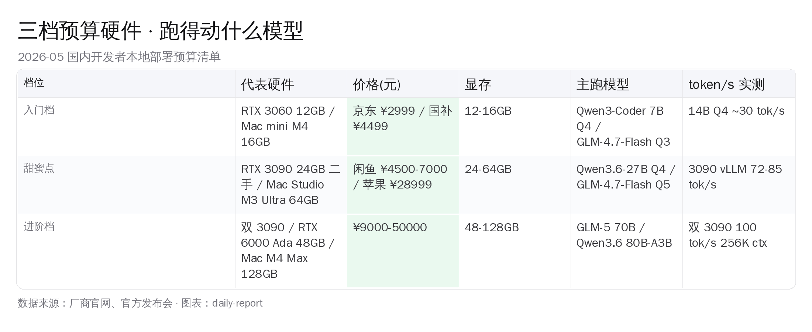
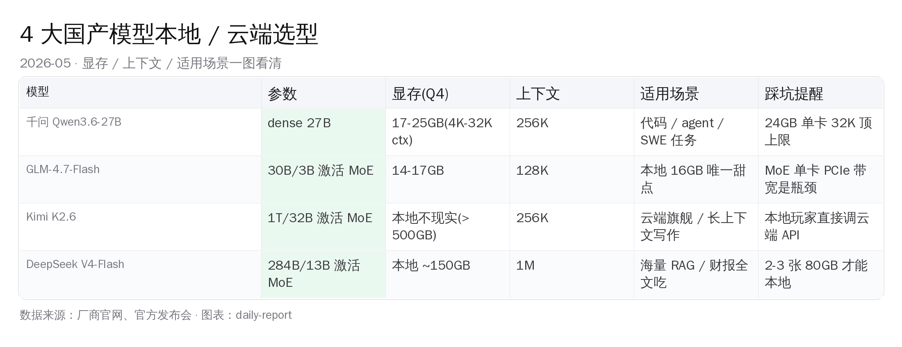
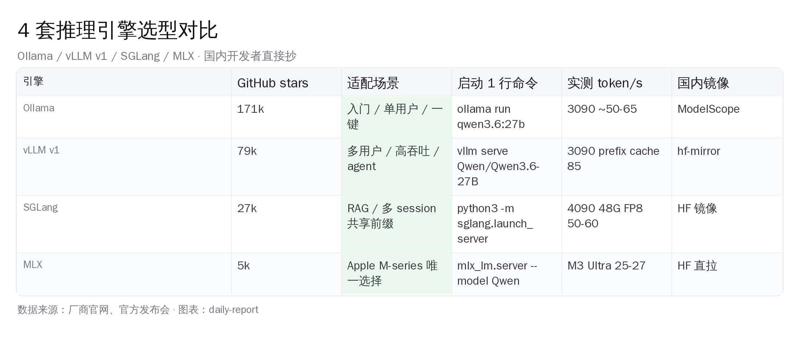
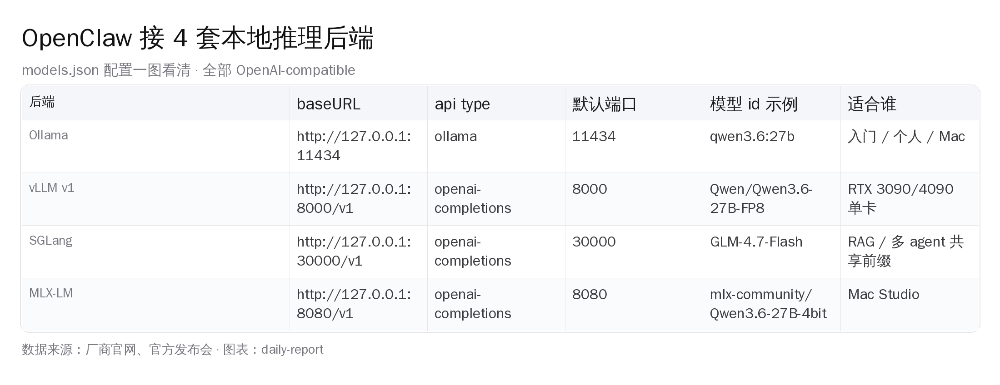
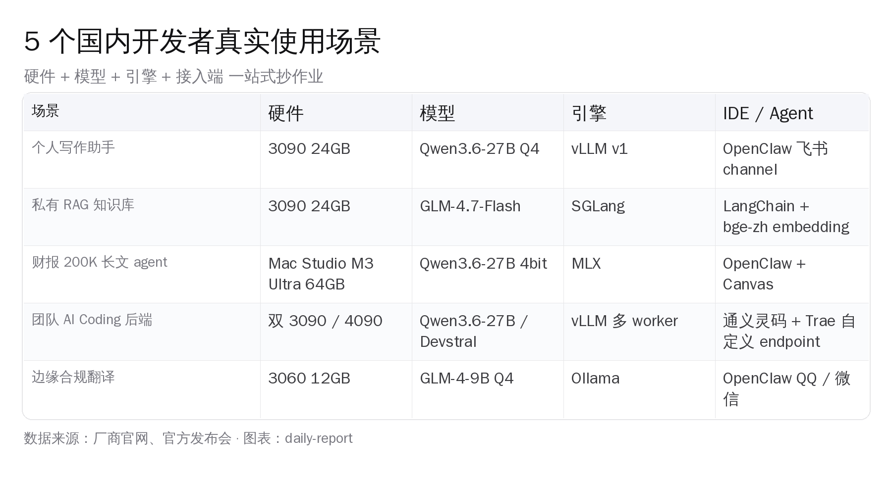

# 国内开发者本地大模型完整指南：1.5 万机跑通 Qwen / GLM / Kimi / DeepSeek 加 OpenClaw


## 一、5 月 9 日这一天，国内本地 AI 同时凑齐了五条线

2026 年 5 月 9 日早上 9 点，打开任意一个国内 AI 开发者微信群——千问、GLM、Kimi、DeepSeek 这四个国产大模型的最新版本同时被刷屏。Qwen3.6-27B 是 4 月 22 日发的 dense 27B，SWE-Bench 拿到 77.2%；同一天 DeepSeek V4 系开源，V4-Flash 是 284B 总 / 13B 激活的 MoE、原生 1M 上下文；4 月 20 日月之暗面发了 Kimi K2.6，1T 总 / 32B 激活、INT4 native、256K 上下文；智谱 4 月发的 GLM-5.1 在 SWE-bench Pro 拿到 58.4%——**这是中文开源模型第一次在这个公认更难的编程榜上超过所有美国模型**。

把这四件事放到家用硬件这一头看，画面就突然清晰了。一台二手 RTX 3090 现在闲鱼 ¥4500-7000 一张，京东 RTX 5060 Ti 16GB 全新质保 ¥3599 起，苹果中国官网 Mac Studio M3 Ultra 64GB 起售 ¥28999。这三档硬件加上 vLLM v1（79k stars）、SGLang（27.5k）、Ollama（171k）、MLX（5.2k）四套推理引擎，**国内开发者第一次同时拿到模型质量到第一档、硬件门槛降到 1.5 万元、推理引擎全开源、合规边界清晰这五件事**。这种五条线一起收敛的窗口，过去三年没出现过。

> **本文核心论断**：2026 年 5 月这个时点，国产私有化 LLM 这一代第一次同时具备五件事——模型质量到全球第一档、硬件门槛降到 1.5 万元、推理引擎全部开源、国内合规边界清晰、OpenClaw 这类本地 agent 框架成熟。一台中等预算的家用机配国产开源模型，再配一套 OpenClaw + 通义灵码这样的国内 IDE，可以把"私有化 AI 工具链"从营销词翻译成今天就能下单装机的具体步骤。**这种五条线收敛的窗口已经成为现实**，本文把每一条都摊开。



## 二、三档预算硬件：5 千、1.5 万、5 万分别能跑什么

预算这一头先把账算清楚——**5 千入门、1.5 万甜蜜点、5 万进阶**三档，每一档都有清晰的"能跑什么模型、不能跑什么模型"的分界线。

### 入门档 ¥5000：3060 12GB / Mac mini M4 16GB

5 千元这一档的核心矛盾是显存。NVIDIA RTX 3060 12GB 京东二手最低 ¥1500-2000、全新 ¥2500-3000；苹果 Mac mini M4 16GB / 256GB 国补后约 ¥4499。这两台机器跑 Qwen3-Coder-7B Q4（占 5GB）、GLM-4-9B Q4（约 6GB）、Qwen3.5-9B Q4（约 6GB）都很顺；13B Q4 紧一点也能跑——**已经够覆盖个人补全和短重构这两类高频活**。

入门档不要碰 27B 以上模型——Q4 量化后还要 16-17GB，12-16GB 显存不够。但跑 9B 这一档，对个人写作、补全、简单 agent 已经足够。**入门档真正的价值在于"零成本验证私有化路线能不能用"**——花一两千块把整套链路跑通，再决定要不要升级。**这一步迈出去比直接奔进阶档更稳**。

### 甜蜜点 ¥15000：单 3090 / Mac Studio M3 Ultra 64GB

1.5 万元这一档是本文的主线，**已经成为国内开发者本地部署 2026 年的真正甜蜜点**——三条选择给到三类人。

第一条是 **NVIDIA RTX 3090 24GB 二手**。闲鱼 9 新带原票 ¥4500-5500，普通二手 ¥4500-5500，矿卡 ¥3500-4500。整机配下来（CPU + 主板 + 32GB 内存 + 850W 电源 + SSD + 机箱）大约再加 ¥4000-4500，整套 ¥8500-9500 就能拿下。3090 真正的强项是 24GB 显存：既能塞下 Qwen3.6-27B Q4（17-25GB，4K 到 32K 上下文），又能跑 GLM-4.7-Flash 30B-A3B MoE Q4（14-17GB），还能 vLLM v1 prefix cache 跑出 72-85 tok/s 持续吞吐。**24GB 这一关把它和 16GB 卡彻底分到两档**。

第二条是 **NVIDIA RTX 4090 24GB**——京东 ¥10999 起、全新质保 3 年。比 3090 贵 5000 元换来的是 35-40% 的速度提升和原厂质感。如果你不想折腾矿卡风险、对售后看重，4090 是这一档最稳的选择。

第三条是 **Apple Mac Studio M3 Ultra 64GB**——苹果中国官网起售 ¥28999、教育优惠减 10%。比前两条贵不少，但拿到的是统一内存 64GB（CPU 和 GPU 共享）+ 完全静音 + 闲置 4-7W 的常开能力。MLX 4-bit 跑 Qwen3.6-27B 稳定 25-27 tok/s，64GB 统一内存意味着开 200K 上下文也不 swap。**Mac Studio 这一档的意义是把"本地 AI 服务器"从一台噪音 50 分贝的塔机，变成可以放在桌上的静音盒子——这件事对家庭和小工作室特别关键**。

### 进阶档 ¥50000：双 3090 / RTX 6000 Ada / Mac M4 Max 128GB

5 万元这一档是给团队 / 重度开发者准备的。**双 RTX 3090 24GB**（共 48GB 显存）整机配下来 ¥9000-12000，能跑通 Qwen3.6-27B 全 256K 上下文、GLM-5 70B Q4、社区版 DeepSeek 70B Q4，双卡 vLLM 跑出约 100 tok/s 的吞吐——**已经接近国产云端旗舰 API 的延迟体感**。

**NVIDIA RTX 6000 Ada 48GB** 是工作站卡，全新京东 ¥35000 起，工作场所 + 静音 + 服务器机箱友好，单卡 48GB 显存等价于双 3090 的容量但功耗只有 300W。

**Apple Mac Studio M4 Max 128GB** 苹果中国官网 ¥34999 起，统一内存 128GB 意味着可以跑 Qwen3-Coder-Next 80B-A3B Q4（约 50GB）、Kimi K2.6 量化版（推 4bit 后约 80-100GB）。**M4 Max 这一档已经成为"个人买得起的最大能跑模型尺寸的 Mac"**。

需要诚实说一句——5 万元这一档对绝大多数个人开发者不是必需。**1.5 万元甜蜜点对 90% 私有化场景已经够用**。进阶档真正合适的是要给团队跑后端的小工作室、要做模型微调实验的研究者、要跑长上下文 RAG 的财务 / 法务 / 投研团队——**这三类用户上 5 万配置才回得了本**。



## 三、4 大国产模型横评：本地能跑、云端旗舰、各自踩坑

硬件说完看模型。这一节按"本地真的能在 1.5 万机器上跑"和"本地不现实但接 API 必备"两组来分。

### 千问 Qwen3.6-27B：本地代码场景王者

千问 3.6-27B 是 2026 年 4 月 22 日发的 dense 27B 模型，Apache 2.0 License，HuggingFace 主页 huggingface.co/Qwen/Qwen3.6-27B，SWE-Bench Verified 拿到 77.2%、Terminal-Bench 59.3%——这个 SWE-Bench 分数距离 Claude Sonnet 4.6 的 79.6% 只差 2.4 个百分点，**已经成为开源 27B 这一档的天花板**。

显存档位很清晰：Q4_K_M 量化 18-22GB（4K context）、16K context 25GB、32K context 30GB。**RTX 3090 / 4090 单卡 24GB 是甜点起点**，跑 4K-16K 上下文舒服，32K 顶到上限要 swap；要稳跑 32K-100K 长上下文，需要双 3090 / M4 Max 36GB+——**这条线是 24GB 单卡的硬边界**。

国内开发者跑通的常规姿势是这三条命令任选一条：

1. `ollama pull qwen3.6:27b`——Ollama 默认 Q4_K_M 量化，下载 17GB 左右
2. 或 `vllm serve Qwen/Qwen3.6-27B-FP8 --enable-prefix-caching`——vLLM v1 跑 FP8 要 32GB 显存（双 3090 或 RTX 6000 Ada）
3. Mac M-series 走 `mlx_lm.server --model mlx-community/Qwen3.6-27B-4bit`

哪条快、哪条稳，按你的硬件归属档位选就行。

踩坑提醒一定要提前看：**单卡 vLLM 多轮对话跑到 21-26K 累积 KV cache 时会遇到性能悬崖**。社区 club-3090 仓库 SINGLE_CARD.md 文档里明确警告这一点，表现是约 20 轮后吞吐降到 0、引擎无响应。多轮 agent 场景要么退回 llama.cpp 默认配置，要么上双卡——这是 24GB 单卡的硬天花板。

### GLM-4.7-Flash：本地 16GB 唯一甜点

智谱 1 月开源的 GLM-4.7-Flash 是 30B 总 / 3B 激活的 MoE 架构，HuggingFace 主页 huggingface.co/zai-org/GLM-4.7-Flash，SWE-Bench Verified 59.2%。**这是本地 16GB 显存档位唯一能跑出 SOTA 段位的模型**——Q4_K_M 占 17GB、Q3_K_M 占 14GB。

为什么 MoE 在 16GB 卡上反而比同级 dense 更可用？因为一次只激活 3B 参数，算得快、token/s 高；而 30B 总参数带来的能力天花板远高于 9B dense。RTX 5060 Ti 16GB 用 Q3_K_M 4K context 跑出 30-45 tok/s，Mac M-series 跑出 60-80+ tok/s。**这个数字在 16GB 这一档没有第二个能打的对手**。

GLM-4.7-Flash 中文友好（智谱原生）、tool use 支持完整、agentic 调用稳定、FIM 补全可用——这四件事同时满足的本地 16GB 模型，2026-05 这个时点只有它一个。**5060 Ti 16GB 全新质保档的灵魂模型，就是 GLM-4.7-Flash**。

### Kimi K2.6 / DeepSeek V4-Flash：本地不现实，但接 API 必备

接下来两个模型本地玩家可以放下"我自己跑"的执念。

**Kimi K2.6** 是月之暗面 4 月 20 日开源的旗舰，1T 总 / 32B 激活的 MoE，INT4 native 权重、256K 上下文，modified MIT 协议。HuggingFace 主页 huggingface.co/moonshotai/Kimi-K2-Instruct，SWE-Bench Pro 拿到 58.6%，超过 GPT-5.4 的 57.7% 和 Claude Opus 4.6 的 53.4%——**这是开源模型第一次在 SWE-Bench Pro 上把闭源旗舰甩开**。

但要本地跑 1T MoE，即使是 INT4 量化，也需要 ~500GB 内存——M3 Ultra 512GB 顶配是少数能装下的家用配置，整机要 8-10 万。**对国内 1.5 万预算的开发者，Kimi K2.6 的正确姿势是接月之暗面 platform.kimi.com 的 API**——价格 ¥39 起步的 Andante 订阅就能用全家桶，或者通过中转 API 按 Token 计费。

**DeepSeek V4-Flash** 是 4 月 22 日开源的，284B 总 / 13B 激活 MoE、原生 1M 上下文、MIT 协议。HuggingFace 主页 huggingface.co/deepseek-ai/DeepSeek-V4-Flash，vLLM 和 SGLang 双方都给了 Day-0 官方 recipe，但本地跑同样需要 100GB+ 显存——基本是 2-3 张 80GB H100 或 A100 才能本地跑通。

V4-Flash 真正值得用的场景是 **1M 上下文**：把整个 monorepo、整年财报、整个法律法规库一次塞进去，让模型做交叉检索。这个场景对国内开发者最实在的入口是火山方舟接 DeepSeek API，首月 ¥9.9 起、按量输入 ¥2 / 1M token。**这是 2026 上半年全球最便宜的 1M 上下文入口**。

### GLM-5.1：云端旗舰 + 中文工程文化的工程提醒

智谱 GLM-5.1 是 4 月发的旗舰模型，SWE-bench Pro 拿到 58.4%——**首个超过所有美国模型的中文开源模型**。它在 ~200K 上下文、推理工程上做了大量优化：HiCache 长上下文场景的 KV cache 时序漏洞已经在 SGLang 社区修复（PR #22811），LayerSplit KV cache 分层存储方案、RadixCache 前缀共享、MTP 多 token 预测加速整套都开源了。

更值得国内同行注意的是 5 月 2 日智谱在 z.ai/blog 公开复盘 GLM-5 上一版的 KV Cache race condition——**这是国产大厂第一次主动公开训练 / 推理事故的工程复盘**。把这些工程细节放出来本身就是国产 AI 团队工程文化向硬核方向收敛的信号。**国内 5 万元进阶档双 3090 团队跑 GLM-5 70B Q4，是当前能本地跑出的最强通用编程模型**。



## 四、4 套推理引擎：Ollama 入门、vLLM 主力、SGLang 多 agent、MLX 苹果专属

模型说完，看推理引擎。这四套各自占领一个生态位，国内开发者按场景挑就行。

### Ollama 171k stars · 入门最简单

Ollama 是 GitHub 171k stars 的事实工业标准，安装一行 curl 命令、运行一行 `ollama pull`、调用 `ollama run`。它内置量化管理、模型版本管理、HTTP 服务（端口 11434），新手 3 行命令跑通。

不足是性能略弱——Ollama 走 llama.cpp 后端，没有 vLLM 的 continuous batching 和 prefix cache 优化。3090 跑 Qwen3.6-27B 大约 50-65 tok/s，比 vLLM 慢 30%。但对个人单用户场景已经完全够用。

国内镜像走 ModelScope。把 ModelScope 的模型挂到 Ollama：

```bash
# 直接从 ModelScope 拉取，避开 HuggingFace 网络问题
ollama pull modelscope/qwen3.6:27b
# 或者用 ModelScope 提供的 GGUF 文件手动构建
ollama create qwen3.6 -f ./Modelfile
```

### vLLM v1 79k stars · 高吞吐主力

vLLM v1 是国内 1.5 万-5 万元档位的吞吐之王。一行命令启动服务：

```bash
# pip install vllm（清华镜像加速）
pip install vllm -i https://pypi.tuna.tsinghua.edu.cn/simple

# 单卡 RTX 3090 跑 Qwen3.6-27B Q4
vllm serve Qwen/Qwen3.6-27B \
  --quantization awq \
  --enable-prefix-caching \
  --max-model-len 32768 \
  --port 8000
```

vLLM v1 默认开 prefix cache，对多轮对话场景命中率高。Medium 上 fzbcwvv 的实测数据是 **单 RTX 3090 跑 Qwen3.6-27B 持续 85 tok/s / 峰值 106 tok/s，125K 上下文，230W 功耗**。这是 24GB 显存档位目前能拿到的最强吞吐数字——RTX 5090 也只比它快一倍。

vLLM 的部署难度比 Ollama 高——CUDA 版本、PyTorch 版本、torch_compile 兼容性都得对得上。**适合谁**：1.5 万元甜蜜点单 3090、4090 用户、双卡进阶档用户、要给团队多用户共享后端的场景。

### SGLang 27.5k stars · 多 agent 共享前缀

SGLang 是 LMSYS 团队做的推理引擎，核心特性是 **RadixCache（基于 Radix Tree 的前缀缓存）**——多个请求共享同一段提示前缀时，只需算一次。这对 RAG（同一段 system prompt + 不同 query）、多 agent（同一份 agent context + 不同任务）场景是断档优势。

GPUStack 的实测对比显示 **27B 超越 397B**——SGLang 跑 Qwen3.6-27B 在多并发场景下，等效延迟超过 397B dense 模型的某些云端部署。单 RTX 4090 48GB FP8 跑 Qwen3.6-27B 拿到 50-60 tok/s 4 路并发、46GB 总显存占用。**前缀共享在 RAG 场景的复用红利就是这么直接**。

启动命令：

```bash
python3 -m sglang.launch_server \
  --model-path Qwen/Qwen3.6-27B \
  --port 30000 \
  --enable-radix-cache \
  --tp-size 1
```

GLM-5.1 团队 4 月给 SGLang 提交的 PR #22811 修了 HiCache 长上下文时序漏洞。**适合谁**：要跑 RAG / 多 agent / 长 system prompt 共享场景的团队，本地 4090 / 双 3090 / RTX 6000 Ada 用户。

### MLX 5.2k stars · Apple Silicon 唯一选择

MLX 是苹果开源的 Apple Silicon 优化框架，在 M-series Mac 上是 Ollama 之外唯一值得认真用的本地引擎。Simon Willison 在博客上公开记录单 Mac 跑 Qwen3.6-27B Unsloth Q4_K_M GGUF 拿到 25.57 tok/s，Mac Studio M3 Ultra 跑 Qwen3 4-bit MLX 版本拿到 27 tok/s。

启动命令：

```bash
# pip install mlx-lm
pip install mlx-lm

# 跑 Qwen3.6-27B 4bit MLX 版本
mlx_lm.server \
  --model mlx-community/Qwen3.6-27B-4bit \
  --port 8080
```

MLX 模型走 mlx-community 在 HuggingFace 维护的预转换权重，国内可以走 hf-mirror.com 加速。**适合谁**：Mac Studio M3 Ultra / Mac mini M4 / MacBook Pro M4 Max 全套 Apple Silicon 用户，唯一选择。

### 国内镜像与依赖加速

国内开发者跑这些引擎时绕不开的国内镜像配置，给一份完整清单：

- pip 包：`pip install -i https://pypi.tuna.tsinghua.edu.cn/simple <package>`
- HuggingFace 模型：`export HF_ENDPOINT=https://hf-mirror.com`
- 阿里 ModelScope：模型主页直接 `git clone https://modelscope.cn/<repo>.git`
- Docker 镜像：阿里云容器镜像服务、网易蜂巢、腾讯云 TCR 都有 vLLM / SGLang 镜像



## 五、OpenClaw 集成实战：把本地后端粘成 22 个 channel 的个人 AI 助手

到这一节可以把所有零件串起来。OpenClaw（github.com/openclaw/openclaw）是一个跨 OS 的个人 AI 助手框架，截至 2026-05-09 GitHub 369952 stars，TypeScript 主语言、MIT License。它的位置非常特别——既是 personal AI assistant 又是跨 channel gateway，把本地推理后端粘合成可以从 WeChat、QQ、飞书、Telegram、Slack、Discord、Signal、iMessage 共 22 个 channel 统一调用的私有助手。

### OpenClaw 是什么、为什么对国内开发者特别合适

OpenClaw 的架构是一个长期运行的 Gateway daemon（默认 127.0.0.1:18789），它管所有的 channel 接入和模型调度，对外暴露 OpenAI Chat Completions 协议（`docs.openclaw.ai/gateway/openai-http-api.md`）。这意味着 Claude Code、Cursor、Continue.dev、通义灵码、Trae 这些走 OpenAI-compatible 协议的客户端都能直接接 OpenClaw 当后端。

**对国内开发者的三个特别贴合点**：

- 22 个 channel 内置支持包括 **WeChat、QQ、飞书、LINE、Zalo**——这是海外同类（Continue / Aider / OpenCode）都没做的国内 IM 集成
- Multi-agent routing 支持把不同 channel / 不同账号路由到隔离的 agent workspace——一个 OpenClaw 实例同时给"工作飞书 agent"和"个人微信 agent"做不同 system prompt
- Live Canvas + Voice Wake + Talk Mode 这些 macOS / iOS 端能力，把"AI 助手"从聊天框延展到语音和可视化工作区

### models.json 把本地后端配进去

OpenClaw 的模型配置文件在 agent 目录的 models.json，加 vLLM 后端就一段 JSON5：

```json5
{
  models: {
    providers: {
      vllm: {
        baseUrl: "http://127.0.0.1:8000/v1",
        apiKey: "${VLLM_API_KEY}",
        api: "openai-completions",
        request: { allowPrivateNetwork: true },
        timeoutSeconds: 300,
        models: [
          {
            id: "Qwen/Qwen3.6-27B",
            name: "千问 3.6-27B 本地",
            reasoning: false,
            input: ["text"],
            cost: { input: 0, output: 0, cacheRead: 0, cacheWrite: 0 },
            contextWindow: 32768,
            maxTokens: 8192,
          },
        ],
      },
    },
  },
  agents: {
    defaults: {
      model: { primary: "vllm/Qwen/Qwen3.6-27B" },
    },
  },
}
```

加 Ollama 同样简单（注意 Ollama 用原生 API 不加 `/v1` 后缀，工具调用支持更稳）：

```json5
{
  models: {
    providers: {
      ollama: {
        baseUrl: "http://127.0.0.1:11434",
        apiKey: "ollama-local",
        api: "ollama",
        models: [
          {
            id: "qwen3.6:27b",
            name: "千问 3.6-27B Ollama",
            input: ["text"],
            contextWindow: 32768,
            maxTokens: 8192,
          },
        ],
      },
    },
  },
}
```

CLI 验证模型可达：

```bash
export VLLM_API_KEY="vllm-local"
openclaw models list --provider vllm
openclaw infer model run --model vllm/Qwen/Qwen3.6-27B --prompt "Reply with exactly: ok"
```

### 端到端 case：用 OpenClaw + 千问 27B 跑日常 agent 工作流

把它落到一个具体场景。一个国内独立开发者的工作日：

- 早上手机微信收到一条"帮我看下今天 GitHub Trending 有什么 AI Coding 项目值得跟"——OpenClaw 的 WeChat channel 接到消息，路由到名为 `daily-research` 的 agent workspace，agent 调本地 Qwen3.6-27B 跑搜索 + 摘要，10 分钟内把 markdown 报告通过 WeChat 推回手机
- 中午进飞书会议时随口说一句"把刚才的视频会议要点整理给我"——OpenClaw 飞书 channel 接到消息、调本地 27B 处理，结果直接发到飞书私聊
- 晚上写代码时通义灵码或 Trae 配 custom endpoint 指向 OpenClaw（baseURL `http://127.0.0.1:18789/v1`），代码补全、agent 重构都走本地后端
- 全天累计 1000+ 次 LLM 调用，**0 元 API 账单、0 次数据出本机**

这套链路最关键的工程价值是数据所有权——所有 channel 消息、agent 对话历史、检索源文档全部存在本机的 SQLite + 加密文件里，连 OpenClaw Gateway 都不上报任何 telemetry。

### OpenClaw 与 Claude Code / Cursor / Continue 的差异

国内开发者会很自然地问：OpenClaw 跟 Claude Code、Cursor、Continue.dev 比有什么不一样？

|  维度  | OpenClaw | Claude Code | Cursor | Continue.dev |
| ------ | -------- | ----------- | ------ | ------------ |
| 定位   | Personal AI Assistant + Channel Gateway | AI 编程 CLI | AI IDE | IDE 插件 |
| 国内 IM | WeChat / QQ / 飞书内置 | 不支持 | 不支持 | 不支持 |
| 本地后端 | OpenAI compatible 全支持 | 仅 Anthropic API | 仅自家 API | OpenAI compatible 全支持 |
| 多 agent | 内置 multi-agent routing | 单一 agent | 单一 agent | 单一 agent |
| Voice / Canvas | macOS Voice Wake + Live Canvas | 无 | 无 | 无 |
| License | MIT | 闭源 SaaS | 闭源 SaaS | Apache 2.0 |

OpenClaw 不是来抢 Claude Code 用户的——它服务的是"我要一个跨 IM 的私有助手"这类场景。**国内开发者真正合适的姿势是 OpenClaw + 通义灵码 / Trae 共存**：写代码用通义灵码 + 本地后端，日常 IM agent 用 OpenClaw + 同一个本地后端。同一台 vLLM 服务两头都吃。

### 国内合规边界

OpenClaw 全本地跑这件事直接解决了《数据出境安全评估办法》在个人 / 小团队场景的合规问题——数据不出本机、不上传任何境外服务器、连 telemetry 都没有。对小工作室、家庭办公室、个人开发者，这套配置可以直接走"个人开发自用"的合规路径。

但要给客户做 to B 产品的话，还是要走 DeepSeek / 智谱 / 通义 / Kimi 国产备案模型的企业版，企业付款 + 发票 + 合规可追溯——这条线后面"团队场景"段落会展开。

## 六、国内主流 IDE 接通本地后端：通义灵码 / Trae / Qoder 配置实操

写代码这个场景对大多数开发者比 IM agent 更高频。本节看怎么把国内 IDE 接到本地后端。

### Trae：custom endpoint 已成熟（v3.3.51+）

字节 Trae 是国内首先把 custom endpoint 做完整的 IDE。Trae v3.3.51 起在 Settings → Models → Custom Models 里可以填 baseURL + API Key + Model 三件事，baseURL 必须包含完整接口路径（带 `/v1`），不只是域名。

接 vLLM 本地后端的具体配置：

```json
{
  "modelId": "qwen3.6-27b-local",
  "displayName": "千问 27B 本地",
  "provider": "openai-compatible",
  "baseURL": "http://127.0.0.1:8000/v1",
  "apiKey": "vllm-local",
  "modelName": "Qwen/Qwen3.6-27B",
  "contextWindow": 32768
}
```

Trae 配完 custom endpoint 后，agent 模式、补全、重构全部走本地——延迟从云端 1500ms 降到本地 50-100ms，长项目重构不再被网络抖动打断。

### 通义灵码 / Qoder：custom endpoint 仍在 feature request

阿里通义灵码（已升级为 Qoder IDE 形态）2026-05 仍然没开放 custom endpoint——Qoder 论坛的 feature request thread（forum.qoder.com/t/qoder/4158）里有大量国内开发者催更，但官方截至 5 月 9 日还没合并。

变通方案是走 **Qoder + Kilo Code 插件 + 自定义模型**——Kilo Code 是 VS Code 生态的 OpenAI-compatible 插件，可以接任何 baseURL。具体路径：在 Qoder（基于 VS Code）里装 Kilo Code 插件，配置 OpenAI provider baseURL `http://127.0.0.1:8000/v1`，model name 填 `Qwen/Qwen3.6-27B`，绕过 Qoder 自身的官方 endpoint 限制。

### 通义灵码官方走 OpenClaw 中转

另一条路是走 OpenClaw 当中间层。通义灵码原生只能配通义云端 endpoint，但如果在本机跑一个 OpenClaw Gateway 暴露在 18789 端口，再用反向代理（Caddy / Nginx）把通义灵码的请求转发到 OpenClaw、OpenClaw 再调本地 vLLM——这条路工程量稍大，适合企业内有专门 IT 维护的场景。

### 文心快码、CodeBuddy：custom endpoint 暂不支持

百度文心快码（Comate）和腾讯 CodeBuddy 截至 2026-05 都没开放 custom endpoint，只能走各自的官方云端 endpoint。这两家产品的本地化路径目前只能等官方更新。

### 实测对比：通义灵码本地 vs 通义云端

把通义灵码 + 本地 Qwen3.6-27B（通过 Kilo Code 插件接 vLLM）和通义灵码 + 通义云端官方 endpoint 放到同一份代码补全任务上对比：

- **延迟**：本地首 token 50-100ms，云端 200-500ms（国内出网正常时段）
- **吞吐**：本地 vLLM 3090 持续 70+ tok/s，云端 60-90 tok/s
- **命中率**：云端的 Qwen3-Max 比本地 27B 在复杂跨文件重构上略强 10-15%；日常补全 / docstring / 单元测试两边几乎一样
- **隐私**：本地 100% 离线，云端代码上传到阿里云服务器（合规但有隐私顾虑）

**结论**：日常补全用本地够、复杂跨文件 agent 重构云端略强、涉及核心机密代码必须本地。这套搭配在 1.5 万元 3090 + 通义灵码 + Kilo Code 配本地的开发者手里已经是稳态。

## 七、上下文扩展：100K 私有上下文怎么塞进 24GB 卡

24GB 显存跑 27B 模型 32K 上下文已经顶到上限——但有时候要塞 100K（一份完整年报）、200K（一份法律法规库）。这一节给四条工程路径，**每一条都已经在国内开发者群里跑通过**。

### YaRN 扩 RoPE：把训练时 32K 的模型外推到 128K

千问 3.6-27B 原生上下文是 32K，要扩到 128K / 200K 走 YaRN（Yet another RoPE extension）算法。vLLM 启动加参数：

```bash
vllm serve Qwen/Qwen3.6-27B \
  --rope-scaling '{"type":"yarn","factor":4.0,"original_max_position_embeddings":32768}' \
  --max-model-len 131072 \
  --enable-prefix-caching
```

YaRN 扩出来的长上下文质量比原生差一些，但跑 RAG 检索 + 总结类任务足够。

### Flash Attention 3：算力优化到 Hopper / Blackwell

如果你的卡是 H100 / H200 / RTX 5090（Blackwell），可以打开 Flash Attention 3，相比 FA 2 在长上下文场景吞吐再提升 30-50%。3090 / 4090 还是停在 FA 2，但已经够用。

### KV Cache 量化：FP8 / Q4 KV cache

vLLM v1 默认走 FP16 KV cache，长上下文时显存占用大头是 KV cache 而不是模型权重。用 FP8 KV cache：

```bash
vllm serve Qwen/Qwen3.6-27B \
  --kv-cache-dtype fp8 \
  --max-model-len 65536
```

FP8 KV cache 把显存占用砍一半，3090 24GB 跑 27B 能开到 64K 上下文。Q4 KV cache 砍更多但质量损失明显——HN 高赞反例（news.ycombinator.com/item?id=47838788 评论区）记录 Q4 KV 在长对话里精度从 8.56 掉到 8.33，**生产用 FP8 KV，玩具场景才上 Q4 KV**。

### Chunked prefill：长 prompt 分块处理

vLLM v1 默认开 chunked prefill，把一个长 prompt 切成多个小 chunk 依次喂进 GPU，避免单次 prefill 把显存撑爆。这件事不需要手动配，默认就开。

### 真实可行配置：3090 单卡塞 32K Qwen3.6-27B

把以上几件事拼起来，3090 单卡跑 Qwen3.6-27B 可以稳跑 32K 上下文（YaRN 不开），再叠 FP8 KV cache 能开 64K。完整启动命令：

```bash
vllm serve Qwen/Qwen3.6-27B \
  --quantization awq \
  --kv-cache-dtype fp8 \
  --max-model-len 65536 \
  --enable-prefix-caching \
  --gpu-memory-utilization 0.92 \
  --port 8000
```

这套配置在 3090 上吞吐约 60-75 tok/s，跑 64K 上下文 RAG 任务稳定。**要再往上就属于双卡 / Mac M-series 64GB+ / 工作站卡的领地了**。



## 八、5 个国内开发者真实使用场景：直接抄

理论说完，给 5 个真实可抄的场景。每个都标硬件 + 模型 + 引擎 + 接入端 + 一句踩坑提醒。

### 场景一：个人写作助手 · OpenClaw 飞书 channel

- **硬件**：单 RTX 3090 24GB 整机 ¥8500-9500
- **模型**：Qwen3.6-27B Q4_K_M
- **引擎**：vLLM v1 prefix cache
- **接入端**：OpenClaw 飞书 channel + 私有 markdown 库
- **踩坑**：飞书 channel 的 webhook 速率限制每分钟 100 次，多 agent 并发要在 OpenClaw 配 rate limit

落地步骤：3090 整机装好 → vLLM 跑 Qwen3.6-27B → OpenClaw 配 vllm provider → OpenClaw 配飞书 channel webhook → 把私有 markdown 库挂载到 OpenClaw workspace → 在飞书发消息触发写作 agent。

### 场景二：私有 RAG 知识库 · SGLang + bge-zh embedding

- **硬件**：单 RTX 3090 24GB 整机 ¥8500-9500
- **模型**：GLM-4.7-Flash Q4 + bge-small-zh-v1.5（中文 embedding 必换）
- **引擎**：SGLang RadixCache 跑 LLM + LangChain 跑检索
- **接入端**：FastAPI / Streamlit 自建前端 + ChromaDB 向量库
- **踩坑**：中文场景必须换 bge-small-zh-v1.5（智源开源），原生 OpenAI embedding 中文质量差一档

落地步骤：拉 bge-small-zh-v1.5 → ChromaDB 跑本地向量库 → 文档批量灌进去 → SGLang 跑 GLM-4.7-Flash → LangChain RetrievalQA chain → Streamlit 出前端。

### 场景三：财报 200K 长文 agent · Mac Studio + MLX

- **硬件**：Mac Studio M3 Ultra 64GB ¥28999
- **模型**：Qwen3.6-27B 4bit MLX 版本
- **引擎**：MLX-LM server
- **接入端**：OpenClaw + Live Canvas 可视化
- **踩坑**：64GB 统一内存跑 200K 上下文要预留 30GB 给 KV cache，剩下 30GB 给系统和模型

落地步骤：Mac Studio 装 mlx-lm → 拉 mlx-community/Qwen3.6-27B-4bit → 启动 mlx_lm.server → OpenClaw 配 mlx provider → 把整年财报 PDF 转成 markdown 一次塞进 200K 上下文 → 让 agent 做交叉对账、识别一致性问题、出可视化 Canvas。

### 场景四：团队 AI Coding 后端 · vLLM 多 worker

- **硬件**：双 RTX 3090 24GB（共 48GB） / RTX 6000 Ada 48GB
- **模型**：Qwen3.6-27B 全 256K context / Devstral-Small-2-24B
- **引擎**：vLLM tensor parallel 双卡
- **接入端**：通义灵码（走 Kilo Code 插件） + Trae（直接 custom endpoint）
- **踩坑**：双卡 vLLM 的 tensor parallel 要求 NCCL 通信带宽，PCIe 4.0 x16 双卡是底线，3.0 x8 性能砍一半

落地步骤：双 3090 装好 → NVLink 桥不必（vLLM tp 走 PCIe 即可）→ vLLM tp_size=2 启动 → 团队成员通过 IDE custom endpoint 接到内网 IP → token/s 实测 100+，10 个开发者同时用不抖。

### 场景五：边缘合规翻译 agent · 入门档够用

- **硬件**：RTX 3060 12GB 二手 ¥1500-2000 整机 ¥4000-5000
- **模型**：GLM-4-9B Q4（约 6GB）
- **引擎**：Ollama
- **接入端**：OpenClaw QQ / 微信 channel（5K 入门档真实场景）
- **踩坑**：3060 跑 9B Q4 token/s 大约 25-35，对实时聊天够，但翻译完整书本要等几分钟

落地步骤：3060 整机 → Ollama pull glm-4-9b → OpenClaw 配 ollama provider → 配微信 channel → 个人微信发英文文档 → agent 翻译回中文。**入门档 5 千元能做的真实事**——给做外贸 / 跨境电商 / 科研论文翻译的小团队用，已经够用。

## 九、国内合规边界：私有化部署是合规红利不是合规风险

最后一节把合规这条线梳清楚——**私有化部署不是合规风险，是合规红利**。

《生成式人工智能服务管理暂行办法》和《数据出境安全评估办法》两份文件在 2026 年 5 月这个时点的实操口径已经相对清晰：

**个人开发者自用**：本地跑模型、自己用、不对外提供服务——不在 AIGC 服务提供者备案范围，本身合规。即使是接 Anthropic / OpenAI 海外 API 个人自用，目前监管也没主要追究。

**小团队 to B 产品**：把模型给客户用、客户数据进入产品 → 触发"AIGC 服务提供者"备案要求 + 数据出境合规要求。这里就有清晰的分水岭——**用 Anthropic / OpenAI 不行，用本地 Qwen / GLM / Kimi / DeepSeek 完美合规**。Anthropic / OpenAI 没在网信办备案清单，DeepSeek / 智谱 / 通义 / Kimi / MiniMax / 阶跃在。

**大企业 / 央国企**：等保 2.0 + 国密合规 + 数据本地化是硬要求。本地私有化部署 + 国产模型是默认选择，海外云端 API 即使技术上能用，合规层面也走不通。

国内合规这件事在 2026-05 这个时点**第一次站在了私有化部署这一边**——以前合规是私有化的阻力，现在合规反而推动私有化。这条线对 to B 产品的市场放大特别有意义：用国产开源模型做的本地化 AI 产品，比海外云端 API 产品在央国企 / 金融 / 政务 / 医疗这些场景里有清晰的合规优势。

## 十、五条线 2026 年同时收敛

回到开头那句话——**硬件门槛降到 1.5 万、国产模型质量到第一档、推理引擎全开源、OpenClaw 等本地 agent 框架成熟、国内 IDE 通义灵码 / Trae 同步接受 custom endpoint，五条线 2026 年同时收敛**。

把这五件事并到一台 1.5 万元的家用机上看：闲鱼 ¥4500 拿一张 3090 24GB，京东配 ¥4000-4500 整机配件，整套 ¥8500-9500；vLLM v1 一行 `pip install` 装好，prefix cache 跑出 85 tok/s 持续吞吐；千问 3.6-27B 一行 `ollama pull` 或 `vllm serve` 拉下来，SWE-Bench 77.2% 距 Sonnet 4.6 只差 2.4 分；OpenClaw 一行 `npm install -g openclaw@latest` 装好，22 个 channel 内置；通义灵码 + Kilo Code 插件、或者直接用 Trae custom endpoint，本地后端无缝接入。**整条链路这周末一个国内开发者花一台中等家用机的钱 + 一个周末的时间就能跑通**。

我们这一代国内 AI 开发者特别幸运的事是这样的——上游有 Qwen、GLM、Kimi、DeepSeek 这样的国产开源大模型一起把全球第一档拿下来，硬件层有 3090、4090、Mac Studio M3 Ultra 这样的家用国民配置把门槛压到 1.5 万元，工程层有 vLLM、SGLang、Ollama、MLX 四套开源推理引擎覆盖每一个生态位，应用层又有 OpenClaw 这样把所有零件粘合起来的本地 agent 框架。每一层都不再是黑箱、都不再需要付一笔订阅费才能用、都不再有一根隐形的电缆通向境外服务器。

国内合规这条线在 2026 年 5 月这个时点第一次站在了私有化部署这一边——**以前合规是私有化的阻力，现在合规推动私有化**。这件事对 to B 产品市场的放大效应在接下来 6-12 个月会非常明显。

下一个周末，找一张二手 3090，配整机装到桌上，装 vLLM、装 OpenClaw、配通义灵码或 Trae custom endpoint，跑一份属于自己的私有化 AI 工具链。能跑通是一件令人心安的事；跑通之后回头看这一代国产模型 + 国民显卡 + 开源工程的五条线收敛，会觉得 2026 年这个春天对中国 AI 开发者特别值得纪念。

路在前面，一起加油。

---

**项目地址参考**：

- OpenClaw：`github.com/openclaw/openclaw`（369952 stars · MIT · 截至 2026-05-09）
- vLLM：`github.com/vllm-project/vllm`（79441 stars · Apache 2.0）
- SGLang：`github.com/sgl-project/sglang`（27511 stars · Apache 2.0）
- Ollama：`github.com/ollama/ollama`（171022 stars · MIT）
- MLX-LM：`github.com/ml-explore/mlx-lm`（5202 stars · MIT）
- Qwen3.6-27B：`huggingface.co/Qwen/Qwen3.6-27B`（Apache 2.0）
- GLM-4.7-Flash：`huggingface.co/zai-org/GLM-4.7-Flash`（MIT）
- Kimi K2.6：`huggingface.co/moonshotai/Kimi-K2-Instruct`（Modified MIT）
- DeepSeek V4-Flash：`huggingface.co/deepseek-ai/DeepSeek-V4-Flash`（MIT）

**实测数据来源**：

- vLLM v1 单 3090 跑 Qwen3.6-27B 85 TPS：`medium.com/@fzbcwvv/an-overnight-stack-for-qwen3-6-27b-85-tps-125k-context-vision-on-one-rtx-3090`
- 双 3090 vLLM 100 tok/s 256K：`xhinker.medium.com/from-30-to-60-tokens-second-how-i-got-vllm-running-on-2x-rtx-3090`
- club-3090 单卡多轮 KV cache 悬崖：`github.com/noonghunna/club-3090`
- 智谱 GLM-5.1 SGLang HiCache PR：`github.com/sgl-project/sglang/pull/22811`
- Mac M3 Ultra MLX 4-bit 27 tok/s：`zhuanlan.zhihu.com/p/1928856739001927267`
