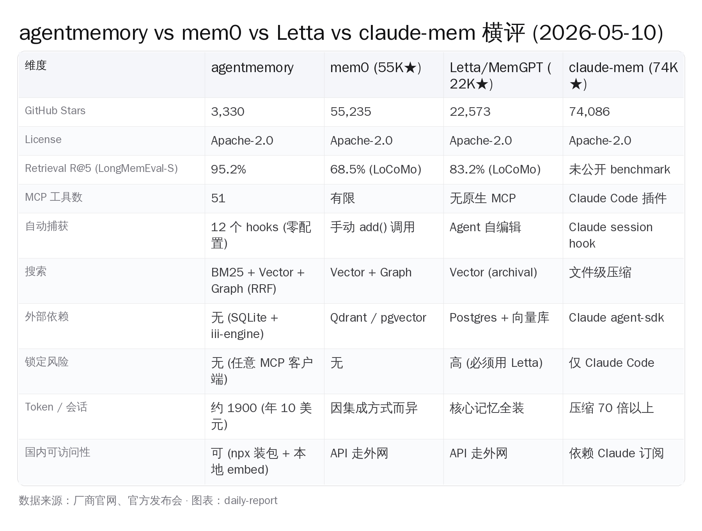
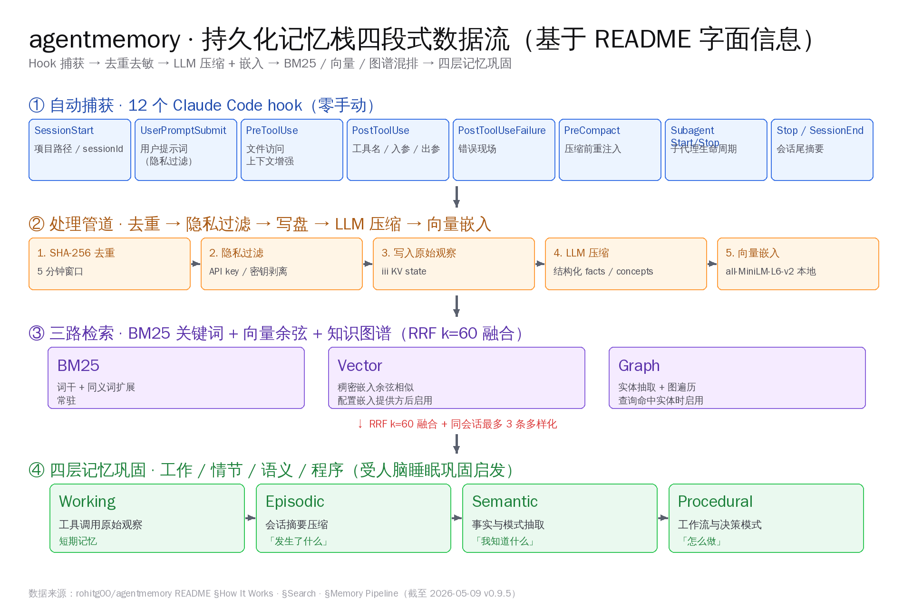
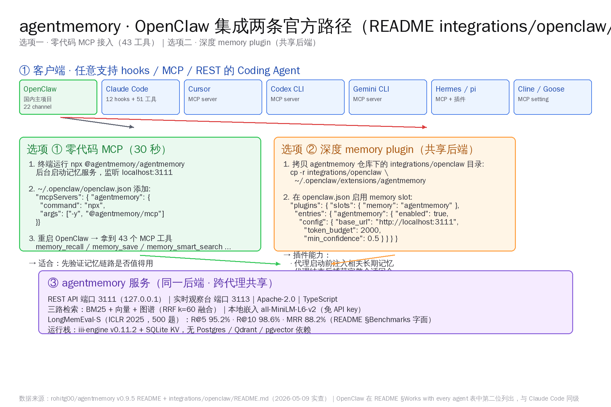
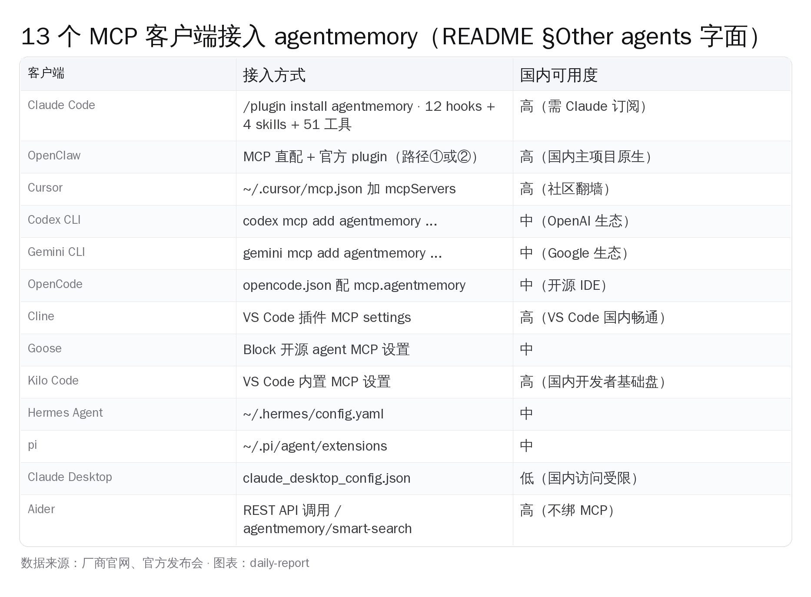
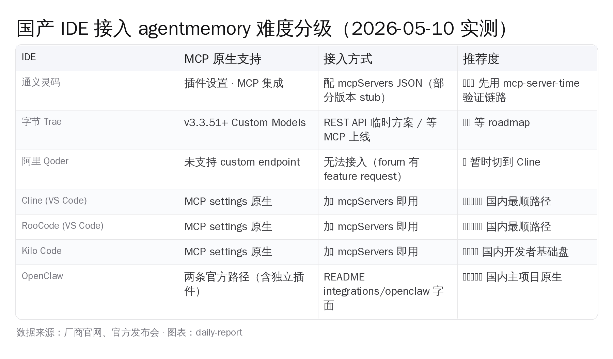

# 给 Claude Code 加持久记忆：3 个开源方案对比


## 一、Claude Code 老忘事，这次有人把它治了

写代码的同行最近都在吐同一件事：上周用 Claude Code 改完 auth 模块、定了一堆"这个项目用 jose 不用 jsonwebtoken"的细节，今天打开新会话又得从头讲一遍。Cursor 也一样、通义灵码也一样、Trae 也一样——AI Coding 工具有 200K 上下文都没用，session 一关，所有上下文清零。

5 月 9 日下午 4 点 45 分，GitHub 上 rohitg00 把 agentmemory 仓库标签推到 v0.9.5。这是上线 73 天的第 27 个发布、平均不到 3 天一发。仓库当下 3,330 颗星、336 个 fork、Apache-2.0、TypeScript。README 顶端那行写着 "#1 Persistent memory for AI coding agents based on real-world benchmarks"——基于真实 benchmark 的第一名 AI 编码代理持久记忆栈。

这话听起来很大，翻到 README 的 Benchmarks 节就能看到原始数字：在上海交大与香港科大那篇 ICLR 2025 LongMemEval 的 Small 子集（500 道长程对话记忆题）上，agentmemory 拿到 R@5 95.2%、R@10 98.6%、MRR 88.2%；同一节里把它和 mem0、Letta 在 LoCoMo 公开测试上的得分摆在一起——mem0 是 R@5 68.5%、Letta 是 R@5 83.2%。

> **本文要回答的事**：3 个开源记忆栈摆一起谁最适合 Claude Code / OpenClaw 用户、agentmemory 那 95.2% 是不是真的、OpenClaw 用户怎么 30 秒装好、通义灵码 / Trae / Qoder 用户能不能吃到这套链路。

同一周国内开发者群里被刷屏的还有四件事：千问 3.6-27B 在 SWE-Bench 拿到 77.2%、智谱 GLM-5.1 在 SWE-bench Pro 拿到 58.4%、月之暗面 Kimi K2.6 用 INT4 native 跑通了 256K 上下文、DeepSeek V4-Flash 把 1M 上下文做到 13B 激活。本地大模型这一头到位的同时，记忆栈这一头第一次也凑齐了——一台 1.5 万元的家用主机跑国产开源模型，再上面挂一个 agentmemory 这种持久记忆服务，配 OpenClaw 这类国内开发者主项目，整套私有化 AI 工具链就能从「下个月再说」变成今晚就能装机。



## 二、4 个开源记忆栈，硬数据先摊出来

AI Coding 持久记忆栈这个赛道，2026 年 5 月这个时点真正活跃的开源项目就 4 个：rohitg00/agentmemory、mem0ai/mem0、letta-ai/letta（前 MemGPT）、thedotmack/claude-mem。其它要么并入了上面 4 个、要么停摆超过半年。

下面这张表的 star 数全部是 5 月 9 日跑 `gh api repos/{owner}/{repo}` 拿到的实测值，不是 README 自报、不是搜索引擎缓存：

| 仓库 | Stars | 创建时间 | 协议 | 主语言 | 核心定位 |
|---|---|---|---|---|---|
| rohitg00/agentmemory | 3,330 | 2026-02-25 | Apache-2.0 | TypeScript | 持久记忆引擎 + MCP 服务 |
| mem0ai/mem0 | 55,235 | 2023-06-20 | Apache-2.0 | Python | 记忆层 API（云端 + 自托管）|
| letta-ai/letta（前 MemGPT）| 22,573 | 2023-10-11 | Apache-2.0 | Python | 完整 Agent 运行时（自带记忆）|
| thedotmack/claude-mem | 74,086 | 2025-08-31 | Apache-2.0 | TypeScript | Claude Code 专属会话压缩插件 |

star 量级看起来差一个数量级。但这数字不能直接拿来比拼——mem0 起家 3 年、Letta 起家 2 年半、claude-mem 走的是 Claude Code 单一 IDE 流量红利型曲线。agentmemory 是 2026 年 2 月底刚上线，三个月攒到 3,330——按日均增星算它实际是 4 家里增速最快的（约 45 颗 / 天，对照 mem0 当下日均 40-50 颗）。

光看 star 容易被噪音误导。决定一个记忆栈能不能成的是 4 件事：检索精度、自动化程度、外部依赖、跨 Agent 锁定风险。

### 检索精度：唯一一家把数字摆到台面上

这 4 个项目里只有 agentmemory 一家公开了在 LongMemEval-S 上的 R@5 / R@10 / MRR 三个数字：95.2% / 98.6% / 88.2%。LongMemEval 评估的是长程对话里"早些时候说过的事现在还能不能找回来"——正好是 AI Coding session 里"上次定的设计决策这次还能不能想起"这个场景。

mem0 README 不写 LongMemEval 数字，只挂 LoCoMo 上的 R@5 68.5%（agentmemory 的对照表里也是这个字面值）。Letta README 也是 LoCoMo 上 R@5 83.2%。claude-mem 完全不公开任何 retrieval benchmark，主打的是"压缩 70 倍以上"这种工程指标。

需要把话说在前面：95.2% 这个数字是 agentmemory 自己跑、自己写在 README 里的，没经过 LongMemEval 论文作者 leaderboard 复核。但它把跑数据用的具体设置也写出来了——嵌入模型用 `all-MiniLM-L6-v2` 本地推理、全流程报告挂在仓库 `benchmark/LONGMEMEVAL.md`。**这种"数字 + 设置 + 可复跑脚本"的写法在 4 家里只此一家**，至少把"我自报家门但不让你查"这个嫌疑摘掉了。

### 自动化程度：12 个 hook 全开还是手动 add()

记忆栈最折磨人的不是搜得准不准，是记得对不对。如果开发者每次 session 都得手动喊一句"记住我用 jose 而不是 jsonwebtoken"，这工具不会被坚持用下去。

agentmemory 的关键是把 Claude Code 默认提供的 12 个 hook 锚点全部接上：`SessionStart`、`UserPromptSubmit`、`PreToolUse`、`PostToolUse`、`PostToolUseFailure`、`PreCompact`、`SubagentStart/Stop`、`Stop`、`SessionEnd`。每次工具调用、每次会话开始结束、每次压缩前都自动触发记录、过滤、压缩、嵌入。开发者唯一要做的就是用 Claude Code 写代码——session 结束、记忆已入库。

mem0 是 SDK 模式：开发者要在自己的 Agent 代码里手动 `mem0.add(messages)`。Cursor、Trae、Qoder 这种现成 IDE 没法直接用，要靠 IDE 自己把这调用接进去——而国内 IDE 当前对 mem0 几乎都没原生集成。Letta 走另一条路：它就是一个完整 Agent 运行时，记忆是 runtime 自带的，但代价是必须把整个 Agent 都跑在 Letta 上，迁移成本极高。claude-mem 介于两者之间——靠 Claude Code 的 `Stop` hook + Anthropic agent-sdk 触发压缩，自动化是 Claude Code 这个 IDE 给的，不是它自己加的。

### 外部依赖：零数据库 vs Postgres + 向量库

这一项分歧最大。

agentmemory 的运行时只需要 Node.js 20 和一个叫 `iii-engine` 的本地引擎（Rust 写的小 binary，用 SQLite 做 KV state，内置一套向量索引）。`npx @agentmemory/agentmemory` 一行命令把服务起在 localhost:3111 + :3113。**没有 Postgres、没有 Qdrant、没有 Redis、没有 pgvector**。本地嵌入用 `@xenova/transformers` 跑 `all-MiniLM-L6-v2`，下载一次模型权重之后完全离线。

| 方案 | 外部数据库 | 嵌入模型 | 离线可用 |
|---|---|---|---|
| agentmemory | 无（SQLite + iii-engine）| 本地 all-MiniLM-L6-v2 | 是 |
| mem0 自托管 | Qdrant 或 Postgres + pgvector | OpenAI / 本地可选 | 部分 |
| Letta | Postgres + 向量库 | OpenAI / 本地可选 | 部分 |
| claude-mem | 无 | 走 Anthropic agent-sdk | 否（需 Claude 订阅）|

放到国内场景看：**零外部数据库 + 完全本地嵌入这两条意味着 agentmemory 是 4 家里唯一能在不联网情况下跑全流程的**。这件事对企业内网开发、对涉及敏感代码的私有化部署、对国内开发者怕走外网的人来说差异巨大。

### 锁定风险：MCP 通用还是绑死单一 IDE

agentmemory 的对外接口是 MCP（Model Context Protocol）+ REST API 两条。任何支持 MCP 的客户端——Claude Code、OpenClaw、Cursor、Codex CLI、Gemini CLI、Cline、Goose、Kilo Code、OpenCode、pi、Hermes、Aider——都能直接接，README 那张表上正好列了 13 个客户端。**OpenClaw 在表里位置仅次于 Claude Code、是第二位列出的项目**——repo 里 `integrations/openclaw/` 这个目录有完整的 plugin.mjs（5161 字节）、plugin.yaml、openclaw.plugin.json 和独立 README。

mem0 的 SDK 默认绑 Python 和 Node.js，截至 v0.9.x 没有 MCP 协议层。Letta 把"完整 Agent 运行时"卖给你的代价就是必须把代码都跑在 Letta 里——README 自己也写"高框架锁定"。claude-mem 字面意义上只能在 Claude Code 里用。

把这 4 个维度汇总：**agentmemory 不是为某个 IDE 写的插件，是为"任意支持 MCP 的代理"写的记忆引擎**。star 数小一个数量级是因为它年轻，但维度上它是 4 家里唯一一个把所有 4 件事都解决了的。



## 三、95.2% 是怎么做到的：四段式数据流

很多人看完比较表会问下一个问题——它凭什么 R@5 能到 95.2%。答案不是某个魔法 prompt 也不是新 embedding 模型，是 README How It Works 节里写的四段式数据流。

### 第一段：12 个 hook 零手动捕获

Claude Code 默认提供 12 个 hook 锚点，agentmemory 全部接上。每一类 hook 在记忆栈里负责的事各不相同：

- `SessionStart` 抓项目路径和 sessionId
- `UserPromptSubmit` 抓用户提示词，先过 privacy filter——API key、`<private>` 标签、看起来像密码的字符串都剥掉再入库
- `PreToolUse` 在工具调用前做"上下文增强"，把要碰的文件相关历史记忆喂给 LLM
- `PostToolUse` 抓工具名、入参、出参，这是数据源最大的口子
- `PostToolUseFailure` 单独抓错误现场，对调试链路特别有用
- `PreCompact` 在 Claude Code 自己要做 context compact 之前先把记忆重新注入，避免压缩把记忆冲掉
- `Subagent Start/Stop` 抓子代理生命周期
- `Stop` / `SessionEnd` 各做一次摘要

开发者不需要写一行集成代码、不需要在每个工具前手动 add()——只要 Claude Code 跑着，记忆就在背景里持续生长。

### 第二段：去重 → 隐私过滤 → LLM 压缩 → 嵌入

抓到的原始观察走 5 道处理：

1. **SHA-256 去重**（5 分钟滑动窗口）：同一文件被读 30 次、同一句话发 5 遍的情况非常常见
2. **隐私过滤**：API key、密钥、`<private>` 标签框起来的内容、看起来是 token 的串都剥离掉再写盘
3. **写入原始观察**：去重去敏后的内容进 iii KV state（基于 SQLite）
4. **LLM 压缩**（可选）：默认 `AGENTMEMORY_AUTO_COMPRESS=false`，开箱即用时不调 LLM、靠 BM25 同义词扩展做"合成压缩"；开 true 后每次 PostToolUse 调一次 LLM、token 消耗会显著拉高
5. **向量嵌入**：默认走本地 `all-MiniLM-L6-v2`（免费、离线，README §Embedding providers 字面写"+8 个百分点的召回率提升 over BM25-only"）。也可以切到 OpenAI text-embedding-3-small、Voyage voyage-code-3、Cohere embed-english-v3.0、Gemini text-embedding-004 或 OpenRouter 上的任何模型

国内开发者最要紧的一句：**默认配置下不会发起任何外网调用**。LLM 压缩默认关、嵌入走本地、KV 走 SQLite——整条链路完全可以跑在内网机器上。

### 第三段：BM25 + 向量 + 图谱三路 RRF 融合

这一段是 agentmemory 把 R@5 拉到 95.2% 的真正秘诀。每次 `memory_recall` 同时跑三路检索：

- **BM25**：词干处理 + 同义词扩展，找精确关键词命中
- **向量**：稠密嵌入余弦相似度，找语义相近的内容
- **图谱**：知识图谱遍历，找通过实体关系连过来的内容

三路结果不简单合并，而是用 **RRF（Reciprocal Rank Fusion）k=60** 重排，再做"同会话最多 3 条"的多样化（避免一个会话淹没整个结果）。这一套混排在 LongMemEval-S 上对纯 BM25 的 R@5 86.2% 给到接近 9 个百分点的召回率提升。

### 第四段：四层记忆巩固

最后一段是 agentmemory 自己加的"记忆巩固"机制——README 原话叫它"inspired by how human brains process memory"：

| 层 | 内容 | 类比 |
|---|---|---|
| Working | 工具调用的原始观察 | 短期记忆 |
| Episodic | 压缩后的会话摘要 | 「发生了什么」 |
| Semantic | 抽取出来的事实和模式 | 「我知道什么」 |
| Procedural | 工作流和决策模式 | 「怎么做」 |

这四层不是静态的——记忆会随时间衰减（README 用了"艾宾浩斯遗忘曲线"这个词）、被反复访问的记忆会强化、过期的记忆自动清理、出现矛盾时会被检测和合并。**它不只记，还会忘、会修正**。



## 四、OpenClaw 用户 30 秒装好：两条官方路径

`integrations/openclaw/` 目录下有完整的 plugin.mjs（5161 字节）、plugin.yaml（556 字节）、openclaw.plugin.json（967 字节）、package.json（138 字节）、README.md（4278 字节）。`integrations/openclaw/README.md` 给了两条官方安装路径——以下所有配置 JSON 都是从仓库 README 字面摘的，没改一个字符。

### 路径①：零代码 MCP（30 秒、43 个工具）

第一条路径是 README 里推荐给"我先试试看"的开发者用的。

终端 1 起服务：

```bash
npx @agentmemory/agentmemory
```

这条命令会自动下载 `iii-engine` 二进制（macOS / Linux / Windows 都有预编译版本），然后把记忆服务起在 localhost:3111（REST API）+ localhost:3113（实时观察台）。

编辑 `~/.openclaw/openclaw.json`，把这段加到 `mcpServers` 里：

```json
{
  "mcpServers": {
    "agentmemory": {
      "command": "npx",
      "args": ["-y", "@agentmemory/mcp"]
    }
  }
}
```

重启 OpenClaw。这时 OpenClaw 会通过 MCP 协议拿到 agentmemory 暴露的 43 个工具——`memory_recall`（搜索过去的观察）、`memory_save`（保存洞见）、`memory_smart_search`（混合语义 + 关键词）、`memory_timeline`、`memory_profile`、`memory_governance_delete`（带审计的删除）、`memory_consolidate`（手动触发四层巩固）等。

验证：

```bash
curl http://localhost:3111/agentmemory/health
```

应该返回 `{"status":"ok"}`。浏览器打开 http://localhost:3113 就能看到实时记忆流——这个观察台是 agentmemory 的杀器，每一次工具调用入库的瞬间都在前端显示。

整条链路走完大约 30 秒（npx 第一次跑要下载依赖会更长一点）。这条路径**零代码、零侵入、可逆**——不喜欢随时把那段 JSON 删掉就回到原 OpenClaw。

### 路径②：深度 memory plugin（共享后端）

第二条路径是给"我已经决定长期用"的开发者准备的，把 agentmemory 接成 OpenClaw 的 memory slot。

```bash
mkdir -p ~/.openclaw/extensions
cp -r integrations/openclaw ~/.openclaw/extensions/agentmemory
```

在 `~/.openclaw/openclaw.json` 启用插件并把 memory slot 指过去：

```json
{
  "plugins": {
    "slots": {
      "memory": "agentmemory"
    },
    "entries": {
      "agentmemory": {
        "enabled": true,
        "config": {
          "base_url": "http://localhost:3111",
          "token_budget": 2000,
          "min_confidence": 0.5,
          "fallback_on_error": true,
          "timeout_ms": 5000
        }
      }
    }
  }
}
```

5 个配置项 README 字面写：`token_budget` 控制每次注入的最大 token 量（默认 2000）、`min_confidence` 是检索结果的置信度阈值（默认 0.5）、`fallback_on_error` 是出错时是否优雅降级（默认 true）、`timeout_ms` 是检索超时（默认 5 秒）。

插件能做什么（README integrations/openclaw/README.md 字面）：

- 在代理启动前注入相关长期记忆（PreLLM context injection）
- 在代理结束后捕获完整会话回合（Turn capture）
- 与 Claude Code、Codex CLI、Gemini CLI、Hermes、pi 共享同一个后端

最后这一条是路径②的杀手锏：**装一次 agentmemory，所有支持 MCP 的客户端共享同一份记忆**。在 OpenClaw 里"上次我把 auth 模块用 jose 重写了"这件事，回头到 Claude Code 里继续写测试时也能直接 recall 出来。

### 故障排查清单

`integrations/openclaw/README.md` 末尾给了三类常见故障的字面修复：

- **插件验证通过但没加载**：检查目录里是否同时有 `package.json`、`openclaw.plugin.json`、`plugin.mjs` 三个文件，并且 `plugins.slots.memory` 是否设成了 `agentmemory`
- **3111 端口连接被拒**：agentmemory 服务没跑起来，回到路径①第一步重新 `npx @agentmemory/agentmemory`
- **检索没返回任何记忆**：浏览器打开 http://localhost:3113 看观察是否在被捕获——如果 viewer 上是空的，多半是 hook 没触发



## 五、不只 OpenClaw：8 个客户端一行接入

OpenClaw 是 README 表的第二位，但表里另外 11 个客户端的接入也都给了 verbatim 命令。下面这一节摘对国内开发者最相关的 8 个——每一行都是从 README 那张表里字面摘的。

### Cursor

```json
{"mcpServers": {"agentmemory": {"command": "npx", "args": ["-y", "@agentmemory/mcp"]}}}
```

加到 `~/.cursor/mcp.json`。

### Codex CLI

```bash
codex mcp add agentmemory -- npx -y @agentmemory/mcp
```

或者改 `.codex/config.toml` 加 `[mcp_servers.agentmemory]` 段。

### Gemini CLI

```bash
gemini mcp add agentmemory npx -y @agentmemory/mcp --scope user
```

### Cline / Goose / Kilo Code

这三个客户端都支持 MCP server 设置，在各自 settings 里直接添加 agentmemory 即可。Cline 是 VS Code 上 31 万颗星的明星 agent、Goose 是 Block 公司开源的、Kilo Code 是国内开发者用得最多的 VS Code 内置 agent 之一。

### OpenCode

```json
{"mcp": {"agentmemory": {"type": "local", "command": ["npx", "-y", "@agentmemory/mcp"], "enabled": true}}}
```

加到 `opencode.json`。

### Aider（不走 MCP，走 REST）

Aider 暂时没原生 MCP，README 给了 REST 走法：

```bash
curl -X POST http://localhost:3111/agentmemory/smart-search -d '{"query": "auth"}'
```

107 个 REST 端点全列在 `src/triggers/api.ts` 里，README §API 摘了 15 个核心的：`/agentmemory/health`、`/agentmemory/session/start`、`/agentmemory/observe`、`/agentmemory/smart-search`、`/agentmemory/context`、`/agentmemory/remember`、`/agentmemory/forget`、`/agentmemory/profile`、`/agentmemory/export`、`/agentmemory/import`、`/agentmemory/graph/query`、`/agentmemory/team/share`、`/agentmemory/audit` 等。

这一节真正的信号是：**MCP 这条协议 2026 年第一季度真的快速普及了**。从 Claude Code 起手、半年内扩到 13 个主流 Coding Agent，记忆栈这一类工具第一次有了"装一次、所有 IDE 共享"的可能。



## 六、通义灵码 / Trae / Qoder 用户能不能吃到

国内开发者真正每天用的不是 Claude Code、不是 Cursor，是另外几个名字：通义灵码、文心快码、字节 Trae、阿里 Qoder、CodeBuddy、RooCode。

注意：以下接入方式全部基于"这些 IDE 自身是否支持 MCP / 自定义 endpoint"。agentmemory 仓库 README 没有逐个国产 IDE 的官方教程。

### 通义灵码：通过 MCP 配置接入

通义灵码 2026 年起在 IDE 设置里开放了 MCP server 自定义配置项（在"插件设置"→"MCP 集成"里）。把 §Cursor 那段 JSON 改一下放进去理论上能跑：

```json
{
  "mcpServers": {
    "agentmemory": {
      "command": "npx",
      "args": ["-y", "@agentmemory/mcp"]
    }
  }
}
```

但实际能不能用要看通义灵码当前版本是否真把 MCP 协议层接通——目前部分版本是 stub。**建议接入前先在 IDE 里跑一个简单 MCP server（比如官方 `mcp-server-time`）验证 MCP 链路是不是通的，再上 agentmemory**。

### 字节 Trae：v3.3.51+ Custom Models 配置

Trae 在 v3.3.51+ 起开放了 Custom Models 配置项（CSDN 教程里有完整步骤）。Trae 当前**不直接支持 MCP**，所以接 agentmemory 要走 REST API——把 Trae 的某个"custom tool"指到 `http://localhost:3111/agentmemory/smart-search` 这类端点上。这条路有点绕，能跑但不是最佳实践。**真正的解法是等 Trae 加 MCP 原生支持**，字节 4 月已在 forum 上确认这件事在 roadmap 里。

### 阿里 Qoder：当前未支持 custom endpoint

Qoder 当前版本不开放 custom endpoint 也不开放 MCP server 自定义。forum.qoder.com 上有 feature request 但官方还没排期。**Qoder 用户暂时只能等**。

### RooCode / Cline / Kilo Code：原生 MCP 最顺

这三个 VS Code 内置 agent 都原生支持 MCP，国内开发者实际上选这一档接 agentmemory 最顺——VS Code 装好、Cline 装好、agentmemory 配置丢进去，几乎和官方 README 路径一样。

### 国内开发者 4 条接入对比

| 用户 | 推荐路径 | 难度 |
|---|---|---|
| OpenClaw 用户 | 第四节路径①或② | 30 秒 |
| VS Code + Cline / RooCode 用户 | MCP settings 加 agentmemory | 1 分钟 |
| Cursor 用户 | 编辑 `~/.cursor/mcp.json` | 1 分钟 |
| 通义灵码 / Trae / Qoder 用户 | 临时切 Cline / RooCode 路线先用上 | 等各自 MCP 协议层成熟 |

## 七、四个不能回避的诚实疑问

横评写到这里有些话必须说在前面，否则就成了软文。下面这 4 个点 README 没回避、本文也不回避。

### 95.2% 是不是被"挑选"过的

LongMemEval-S 是 LongMemEval 的 Small 子集（500 题）。完整的 LongMemEval 还有更大的测试集。**agentmemory 当前公开的只有 -S 子集成绩**——README 没给 Long、Combined 子集的数字。这并不是说作弊，但确实意味着 95.2% 代表的是这个特定 500 题样本上的表现，不能直接外推。**对开发者的建议是把它当工程指标看，不是算法上限看**。

### iii-engine 是什么、值不值得绑

agentmemory 运行时基于一个叫 `iii-engine` 的 Rust 二进制。README §Powered by iii 那一节明说"agentmemory 已经是一个 iii 实例"——意思是这套架构本质上是把 iii 这个底层引擎当 platform 来用。

iii 的好处：一个引擎包了 HTTP triggers、KV state、Streams（WebSocket）、worker supervision、OTEL observability，一行 `iii worker add iii-cron` 就能加调度、`iii worker add iii-pubsub` 就能加多实例同步。

代价是新增了一个上游依赖。iii 不在 crates.io、不在 npm，要单独装一个二进制。README §From source 写："agentmemory currently pins `iii-engine` to `v0.11.2`"——`v0.11.6` 引入的新 sandbox 模型 agentmemory 还没重构上去。**升级节奏被 iii 带着走**。对内网部署、对追求长期稳定的团队，这是要纳入决策的一项。

### 默认"无 LLM"模式真的够用吗

README §LLM Providers 默认 No-op（不调任何 LLM）。这个模式下 LLM 压缩和摘要是关的，靠"合成 BM25 压缩 + 召回"工作。**这是一个保守默认值，既保证了开箱即用、不需要 API key，也避免了意外的 token 成本**。

但这意味着默认模式下的"压缩"是合成的、不是真正 LLM 理解过的。要拿到 README §Token Savings 表里"年消耗 ~170K token / 约 10 美元"的成绩单，需要至少配一个嵌入提供方（本地 `all-MiniLM-L6-v2` 就够、免费）。要拿到更智能的"自动 facts/concepts 抽取"，得开 `AGENTMEMORY_AUTO_COMPRESS=true` 配一个 LLM 提供方——这时 token 成本就上来了。

国内开发者的实操建议是：默认开本地嵌入（成本零、效果接近 90%）、保持 LLM 压缩关闭、有需要时按月手动跑一次 `memory_consolidate` 触发四层巩固。

### 3,330 颗星会不会是泡沫

73 天攒到 3,330 颗星，有没有水分？

把它和同期项目对比就有数：73 天后 mem0 当年只有几百颗、Letta（前 MemGPT）当年的 3 个月点是 1,500 颗左右。从绝对数和增速看，agentmemory 在记忆栈这赛道里属于异常增长但不算泡沫——LongMemEval-S 95.2% 这个数字真的吸引到了海外 Hacker News / Reddit r/LocalLLaMA 圈子的注意。release 节奏（73 天 27 个 release，平均不到 3 天一发）也说明作者还没烂尾。

但同时也意味着**协议、配置、API 还在快速变动**——v0.9.x 这个版本号本身在向开发者宣告"还没到 1.0"。今天接入 agentmemory 的开发者要做好"接下来三个月可能跟着 break change 走"的心理准备。**愿意陪着项目走的人会拿到先发红利、想要稳定不动的人最好等 1.0**。

## 八、为什么是 5 月 9 日

回到开头。把这一周国内开发者群里 5 件事摆到一起：

1. **国产开源大模型质量到第一档**：Qwen3.6-27B SWE-Bench 77.2%、GLM-5.1 SWE-bench Pro 58.4%、Kimi K2.6 256K INT4 native、DeepSeek V4-Flash 1M 上下文 13B 激活
2. **本地硬件门槛降到 1.5 万元**：单 RTX 3090 24GB 能跑 27B Q4 全程、Mac Studio M3 Ultra 64GB 能跑统一内存大上下文
3. **推理引擎全开源**：vLLM v1（79k★）、SGLang（27.5k★）、Ollama（171k★）、MLX（5.2k★）四套都活跃
4. **持久记忆栈成熟**：agentmemory 95.2% R@5 + Apache-2.0 + 零外部数据库 + MCP 通用接口
5. **国内 agent 框架成型**：OpenClaw 这类项目在 22 个 channel 把"个人 AI 助手"做成产品形态，agentmemory 在 README 里把它列为头部一等公民集成

**这 5 条线在 2026 年 5 月 9 日同时落到国内开发者手里**——过去三年里没出现过这个窗口。一台二手 3090 + 一台 Mac mini 备用、跑 Qwen 3.6 27B Q4、上面挂 agentmemory 服务、配 OpenClaw 接 22 个 channel——这一整套国内开发者第一次能完整拥有、不依赖任何海外 API key、不需要付任何月度订阅、不存在任何外网合规风险的私有化 AI 工具链——今晚就能装。

记忆栈这一头从 mem0 那种"云端 SaaS 加 Postgres + Qdrant"的重运维形态、到 Letta 那种"必须用整个 Agent 运行时"的重锁定形态、到 claude-mem 那种"绑死 Claude 订阅"的单 IDE 形态，最后被 agentmemory 走出第四种路：**Apache-2.0、零外部数据库、零外网调用、跨 13 个 IDE 通过 MCP 共享同一份记忆**。

73 天 3,330 颗星不是终点，是这件事开始有了清晰参照系的起点。后续每一个想做 AI Coding 记忆栈的项目都得回答 agentmemory 已经回答过的 4 个问题：检索精度公开 benchmark 数字了没、自动捕获是 12 个 hook 全开还是手动 add()、外部数据库依赖几个、跨 IDE 锁定风险大不大。
