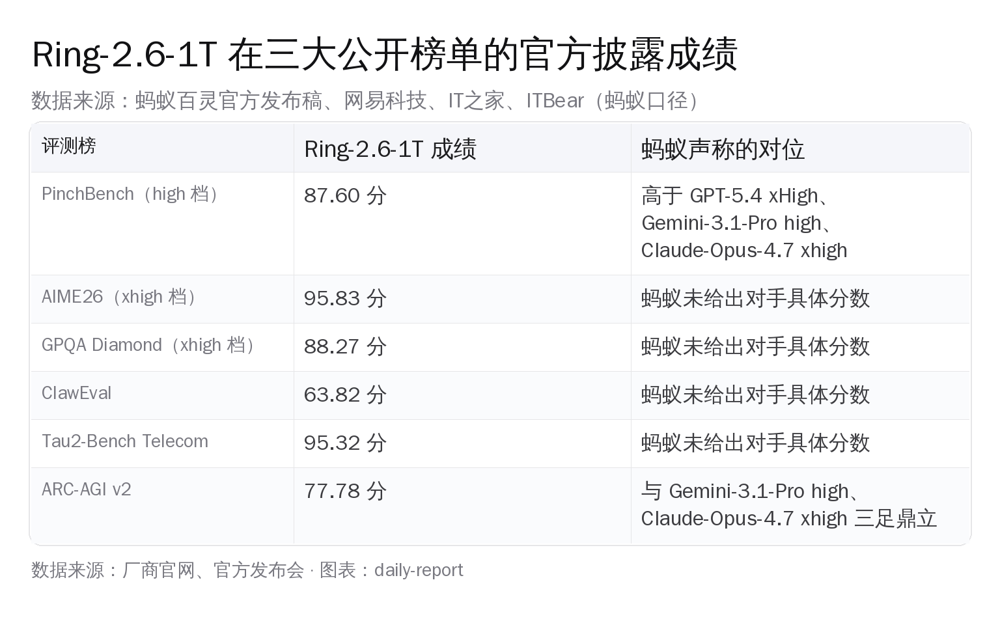
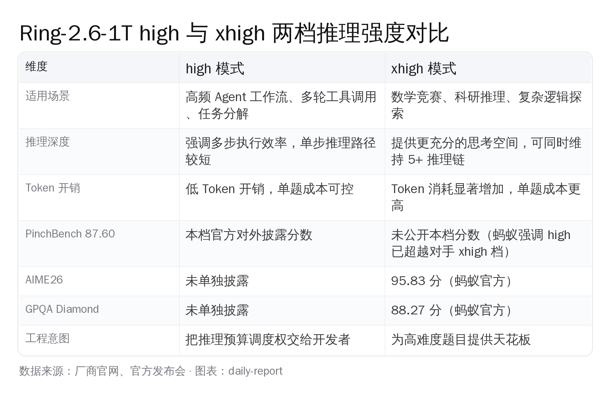
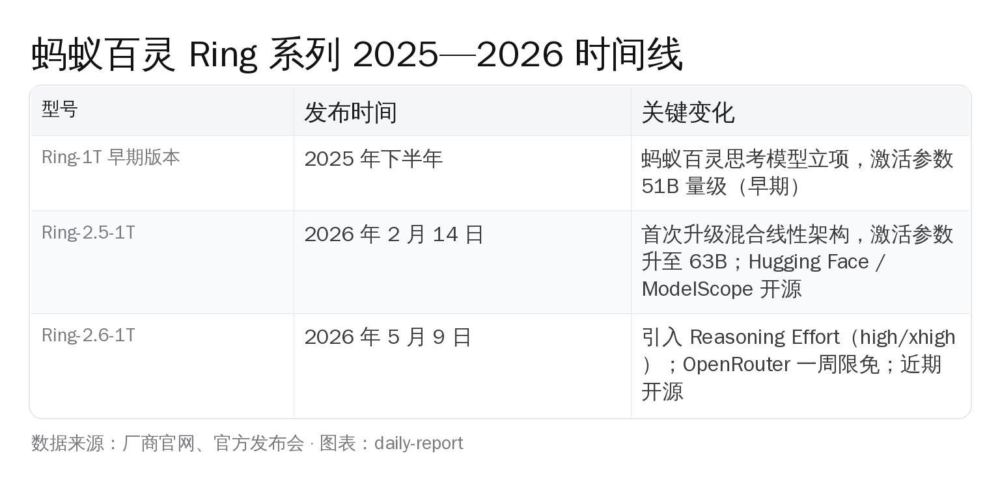

# 蚂蚁开源万亿模型 Ring-2.6 对标 Claude/Qwen3


5 月 9 日下午，蚂蚁百灵把 Ring-2.6-1T 推上了 OpenRouter。1T 总参数、63B 激活、262K 上下文，PinchBench high 档 87.60，蚂蚁声称这一档位高于 GPT-5.4 xHigh、Gemini-3.1-Pro high、Claude-Opus-4.7 xhigh。一周限免，跑完即开源。

跟 DeepSeek V4、Qwen3.6 Plus 同台对标的国产万亿模型多一个，本身已经不再是大新闻。真正值得国内 Agent 开发者花十分钟看完的，是 Ring-2.6-1T 在 API 上多了一个参数：`reasoning.effort`，取值 `high` 或 `xhigh`。模型该想多久——你写代码时自己选，不是模型在后台替你拍板。

## 关键参数一览

| 项目 | Ring-2.6-1T |
|---|---|
| 总参数 / 激活参数 | 1T / 63B |
| 上下文窗口 | 262,144 token |
| 推理档位 | `high`（高频 Agent）/ `xhigh`（数学科研） |
| PinchBench high 档 | 87.60（蚂蚁官方公布，待第三方复跑；对手对位分未单独披露） |
| AIME26 xhigh 档 | 95.83（蚂蚁官方公布，待第三方复跑） |
| GPQA Diamond | 88.27（蚂蚁官方公布，待第三方复跑） |
| 上线渠道 | OpenRouter `inclusionai/ring-2.6-1t` + `:free` 限免 1 周 |
| 开源时间 | 蚂蚁官方称"近期" |
| 上一代 | Ring-2.5-1T（2026/02/14，已开源） |

## 一、API 多一个参数，是这次发布的真正分量

OpenAI o 系列、Claude 4.7 扩展思考、Gemini-3.1-Pro deep thinking——这一代闭源思考模型都把推理 token 做成黑盒：模型自己决定要琢磨多久，开发者只能事后看账单。这件事让 Agent 业务一直有个隐痛：同一条 query，可能这次 800 token 出结果，下次 8000 token，单题成本最高能差一个量级。

Ring-2.6-1T 把这件事翻到了 API 层：

```python
extra_body={"reasoning": {"effort": "high"}}    # 低 Token、多步执行，给 Agent 工作流
extra_body={"reasoning": {"effort": "xhigh"}}   # 长推理链，给数学 / 科研 / 跨仓库重构
```

落到工程上有三件事变了：

- **成本可预估**：客服 Agent 跑 1 万次的预算，不会被偶发的"扩展思考"撑爆
- **场景可分流**：CRUD Agent 走 high、解题 / 重构走 xhigh，开发者一行参数搞定
- **预算可调度**：同一条流水线，规划阶段 high、复核阶段 xhigh，过去要切两个模型才能做的事，现在一个模型搞定

把"推理预算"从黑盒做成显式参数，是国产模型在产品形态上跟海外闭源主流的一次错位：海外卷模型 IQ，蚂蚁这次卷开发者控制权。



## 二、`high` 跟 `xhigh` 各管什么场景

媒体 5/9 给出的官方界定（逐字引用，免脑补）：

**网易科技 5/9**：
> "high 模式主要面向高频 Agent 工作流，强调低 Token 开销与多步执行效率；xhigh 模式面向数学、科研与复杂逻辑分析等高难任务，提供更充分的推理空间。"

**Chinaz 5/9**：
> "high 模式针对高频 Agent 协作优化，具备低 Token 开销与快速多步执行特性；xhigh 模式则面向数学竞赛、复杂逻辑探索等极端任务，提供更充分的思考空间。"

ITBear 5/9 测评稿额外提到 high 档"工具调用效率提升 30% 以上"、xhigh"可同时维持 5+ 推理链"——这两个数字仅在 ITBear 出现，蚂蚁官方稿没有，引用时记得注明来源。



具体到国内 Agent 业务栈：

| 业务场景 | 适合档位 | 理由 |
|---|---|---|
| 客服分流 / FAQ | `high` | 答案空间小、追求响应速度 |
| Code Agent 单文件改动 | `high` | 步骤多但每步推理浅 |
| Code Agent 跨仓库重构 | `xhigh` | 需要长推理链构造方案 |
| 数学竞赛 / 科研问答 | `xhigh` | 单题推理深度优先于步数 |
| RAG 知识库摘要 | `high` | 任务结构固定，档位上调收益递减 |
| Agentic 数据分析 | 混合 | 拆任务用 high，数值结论用 xhigh 复核 |

过去想做"按业务步骤分档"，开发者只能切模型——Haiku 跑前置规划、Opus 跑深推理。Ring-2.6-1T 用一个模型加两档把这层切换成本收掉了。

## 三、底座没变，是产品形态的迭代

要理解 Ring-2.6-1T 的来路，得回到 2026 年 2 月 14 日。



那天蚂蚁发布 Ring-2.5-1T。量子位定位它是"全球首个基于混合线性架构的万亿参数思考模型"，激活参数从 51B 提到 63B，32K 长文本生成场景里访存规模降低 10 倍、生成吞吐提升 3 倍（据量子位 2026/02 引述蚂蚁官方披露）。

3 个月后的 Ring-2.6-1T，激活参数维持 63B，模型骨架未推倒重来。本次迭代的核心增量是 Reasoning Effort 机制 + Agent 工作流针对性优化。

这条节奏隐含的信号是：蚂蚁认为底座（混合线性架构 + 1T 总参数 + 63B 激活参数）在 2 月份已经收敛，3 个月后选择不再继续卷参数，而是把推理预算调度暴露给开发者。从"模型能力提升"转向"工程语义优化"，是一次明确的姿态切换。

### 顺便说一句"混合线性架构"

文章里反复出现的"混合线性架构"，对国内开发者并不算热门词。它的核心思想是把 Transformer 的全注意力（O(n²)）和线性注意力（O(n)）混搭——一部分层走全注意力保证表达力，一部分层走线性注意力把长序列推理成本压下来。Mamba、RWKV、Linear Attention 都属于这条技术路径的不同变体。

蚂蚁在 Ring-2.5-1T 上披露的成果是 32K 以上长文本生成中"访存规模降低 10 倍以上、生成吞吐提升 3 倍以上"（量子位 2026/02/14）。Ring 系列能在万亿参数规模下保持可接受的推理成本，靠的就是这层架构层面的压缩，而不是纯 Transformer 万亿。

## 四、PinchBench 87.60 这个分要冷静看

蚂蚁这次反复强调的"PinchBench 87.60 分超 GPT-5.4 xHigh / Gemini-3.1-Pro high / Claude-Opus-4.7 xhigh"，是发布稿的引爆点。但读者要把这个分跟 MMLU、HumanEval 那种学术评测分开看。

**PinchBench 是 kilo.ai 团队发布的开源评测**，专门评 OpenClaw 范式下大模型作为 coding agent 的真实任务表现：

- 发布方：kilo.ai（旧称 Kilo Code，OpenClaw 生态主要 IDE 之一）
- 任务设计：开会安排、写代码、邮件分流、研究主题、文件管理等真实任务，不是合成 benchmark
- 评分方式：自动检查 + LLM judge
- 公开数据：截至 2026/04/13 公开快照覆盖 68 个模型 / 860 次运行

需要冷静的两个细节：

**第一个细节，对位的对手分到底高不高**。PinchBench 公开榜单当前榜首是 Trinity-Large-Thinking（91.9%），第二 Qwen3.6 Plus（84.0%），第三 MiniMax M2.7（82.8%）。GPT-5.4 公开 best 86.0% / 平均 75.6%，Claude-Opus-4.7 best 91.6% / 平均 73.7%。蚂蚁宣传的"超 Claude-Opus-4.7 xhigh"对应的是 xhigh 档单次运行而不是平均成绩，且对手具体对位分蚂蚁官方稿和多家二手报道里都没单独披露。87.60 这个数字应当理解为"蚂蚁声称的、单次跑测的、high 档分数"，而不是 PinchBench 排行榜的稳定排名。

**第二个细节，第三方还没复跑**。这是蚂蚁自家选定的评测、自家披露的成绩。第三方 PinchBench 公开榜单截至本文发稿尚未独立收录 Ring-2.6-1T（官方榜每周三更新）。等下一次更新后，开发者社区会得到独立验证。

不是说蚂蚁在编——是说所有"自家公布、自家选档对位"的数字，都该等几天看第三方复跑。这是国内 AI 行业过去两年累积的常识。

## 五、OpenRouter 限免一周怎么用

5/9 当天 Ring-2.6-1T 已在 OpenRouter 上线两个版本：

- `inclusionai/ring-2.6-1t` —— 标准版
- `inclusionai/ring-2.6-1t:free` —— 免费版（限时一周）

OpenAI SDK 兼容接入：

```python
from openai import OpenAI

client = OpenAI(
    base_url="https://openrouter.ai/api/v1",
    api_key="<OPENROUTER_KEY>",
)

# high 档 —— 适合 Agent 工具调用
resp = client.chat.completions.create(
    model="inclusionai/ring-2.6-1t:free",
    messages=[{"role": "user", "content": "帮我把这个 React 组件改成函数式"}],
    extra_body={"reasoning": {"effort": "high"}},
)

# xhigh 档 —— 适合数学 / 科研推理
resp = client.chat.completions.create(
    model="inclusionai/ring-2.6-1t:free",
    messages=[{"role": "user", "content": "求证 ..."}],
    extra_body={"reasoning": {"effort": "xhigh"}},
)
```

`reasoning.effort` 的取值（`high` / `xhigh`）已在 OpenRouter 模型页公开。262,144 token 的上下文窗口同档位看比 Claude Sonnet 4.7 的 200K 略高，对长 prompt agent 来说够用。

主流 Agent 框架接入路径：

| 框架 | 接入方式 | 备注 |
|---|---|---|
| Claude Code | OpenAI 兼容 endpoint 配置 `ANTHROPIC_BASE_URL` 或 LiteLLM 转换 | 暂未原生支持，需用 router |
| 千问 Code | OpenRouter 已合作 | 直接选 inclusionai 提供商 |
| Cline / Continue.dev | OpenAI compatible provider 配置 | 选 OpenRouter，模型填 inclusionai/ring-2.6-1t:free |
| LangChain / LlamaIndex | OpenAI client base_url override | 通过 OpenRouter 中转 |
| 蚂蚁百宝箱 | 国内官方入口（蚂蚁自家 Agent 平台） | 不依赖 OpenRouter |

一周限免是国内开发者把 Reasoning Effort 跑过自己业务真实 prompt 的最佳窗口。建议在 Agent harness 里灌一组真实业务 prompt 跑两档对比——看的不是某个 benchmark 漂亮，是自己业务里"档位降一级、Token 省多少、答案掉多少"的真实曲线。

## 六、放进国产万亿阵营对比

5 月这个时点，国产推理模型早已不只 Ring-2.6-1T 一家。横向对比：

| 国产模型 | 参数规模 | 推理控制 | 开源情况（截至 5/9）|
|---|---|---|---|
| 蚂蚁 Ring-2.6-1T | 1T / 63B 激活 | high / xhigh 两档显式选择 | OpenRouter 限免 1 周 / 近期开源 |
| 蚂蚁 Ring-2.5-1T | 1T / 63B 激活 | 单档（无显式效力切换） | Hugging Face / ModelScope 已开源 |
| DeepSeek V4 系列 | DeepSeek 体系内主力 | 内部自适应推理（参考 V3 路径）| 历来开源 |
| 阿里 Qwen3.6 Plus | 千问 3.6 系列旗舰 | 深度思考开关（QwQ / Q-thinking 路线）| 部分开源 |
| 智谱 GLM-5 系列 | GLM 体系最新一代 | 思维链可控，但未做档位化 | GLM 历来开源友好 |
| 文心 5.1（百度） | 文心一言下一代 | 内部决定 | 闭源 |

Ring-2.6-1T 在这个阵营里的差异点很明确：把推理强度做成显式开关。其它家要么内部决定（黑盒），要么是开关式的"开/关"（深度思考 on/off），都不像 Ring 这样直接给两档不同目标语义（高频 Agent vs 高难推理）。

这反映出蚂蚁内部对自己目标客群的清晰判断——蚂蚁百宝箱（蚂蚁自家 Agent 平台）和支付宝小程序生态里，高频 Agent 占大头。high 档是默认主战场，xhigh 档是给深度推理场景留的天花板。把这两档分开做成参数，是产品语言上更精确的表达。

## 七、Agent 开发者怎么用：几条带数字的选档判断

**何时选 high**：

- 单次 query 预期推理路径深度 ≤ 5 步
- 需要在 1 秒内给出首 token
- 业务每天 10 万次以上调用，需要严控 Token 成本
- 工具链已经成熟（grep / read / 数据库查询都很短平快）

**何时选 xhigh**：

- 单题需要多分支探索（数学证明、代码重构方案设计）
- 业务对正确率比对延迟敏感
- 单次 query Token 预算允许放宽 3—5 倍
- 需要"思考链可解释"（xhigh 输出的中间推理更详细）

**单题成本估算的简单方法**：

1. 取 20 条真实业务 prompt
2. 在 OpenRouter 限免期间跑 high / xhigh 各一遍，记录 completion_tokens
3. 算两档 Token 比值 R = tokens(xhigh) / tokens(high)
4. 真实业务里 R 多在 2.5—4 之间；如果你的场景 R > 5，几乎就该用 high
5. 把单次 Token 比值乘以预估 QPS 得到月度 Token 差额，再乘上正式版定价（限免后官方公布）就是切换档位的月度成本差

**与 Claude Code / 千问 Code 的接入路径**：限免期里最快的方式是 LiteLLM proxy + OpenRouter——把 Claude Code 的 `ANTHROPIC_BASE_URL` 指向本地 proxy，由 proxy 把 Anthropic 风格的请求翻译成 OpenAI 兼容请求转发到 OpenRouter。这条链路目前是国内 Code Agent 接 OpenRouter 模型的事实标准。

## 八、把"推理预算"做成显式参数，是新工程范式的一步

Ring-2.6-1T 不是又一个万亿模型在卷另一些万亿模型，是一次把"推理预算"从黑盒翻成开关的工程动作。

国内大模型这两年都在卷参数、卷推理 IQ、卷开源态度。Ring-2.6-1T 多卷了一项——把成本调度的话语权交给开发者。这件事看起来微小，但放在 Agent 工作流时代很关键：当 Agent 一天要调一千次模型时，"我什么时候该让模型多想一会"是开发者最贴身的问题，不是模型厂商替你拍板的问题。

国产万亿走到 Ring-2.6-1T 这一代，参数规模与海外顶级闭源模型已经在同一量级，开源策略友好，OpenRouter 接入流畅，工程语义还做了 reasoning effort 这种细粒度暴露。**国产万亿 + 工程语义化推理调度 + 用户可控成本**，是国内 AI 基础设施在 2026 年正在形成的新范式。

下周看第三方 PinchBench 复跑结果，下个月看 Ring-2.6-1T 正式开源后的社区微调。一周限免是免费试一手 reasoning effort 的窗口期，把它放进开发计划。剩下的，让真实业务跑出来的数字说话。

---

**参考来源**：

- 网易科技 5/9：[蚂蚁正式发布万亿级旗舰思考模型 Ring-2.6-1T](https://www.163.com/tech/article/KSFUONAH00098IEO.html)
- Chinaz 5/9：[Ring-2.6-1T 引入 high/xhigh 两档推理强度](https://www.chinaz.com/ainews/27805.shtml)
- ITBear 5/9：[蚂蚁百灵 Ring-2.6-1T 发布](https://www.itbear.com.cn/html/2026-05/1331460.html)
- ITBear 测评稿 5/9：[Ring-2.6-1T 测评数据](https://www.itbear.com.cn/html/2026-05/1331469.html)
- OpenRouter 官方：[inclusionai/ring-2.6-1t](https://openrouter.ai/inclusionai/ring-2.6-1t)
- 量子位 2026/02：[Ring-2.5-1T 全球首个混合线性架构万亿思考模型](https://www.qbitai.com/2026/02/379431.html)
- PinchBench 公开榜单：[pinchbench.com](https://pinchbench.com/)（kilo.ai 维护）
