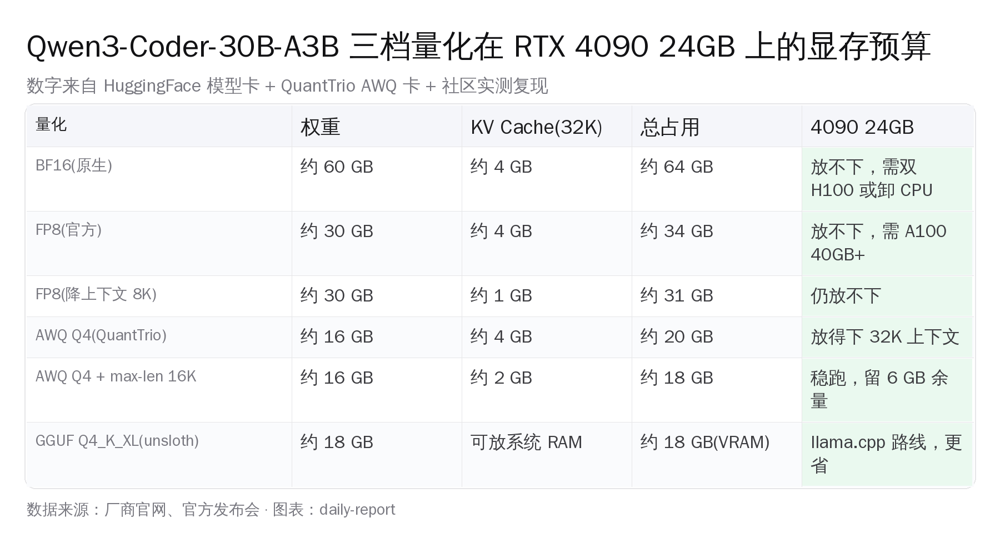
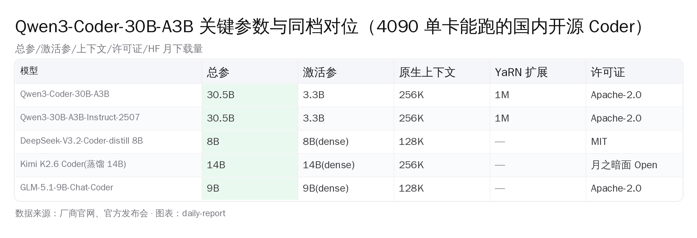
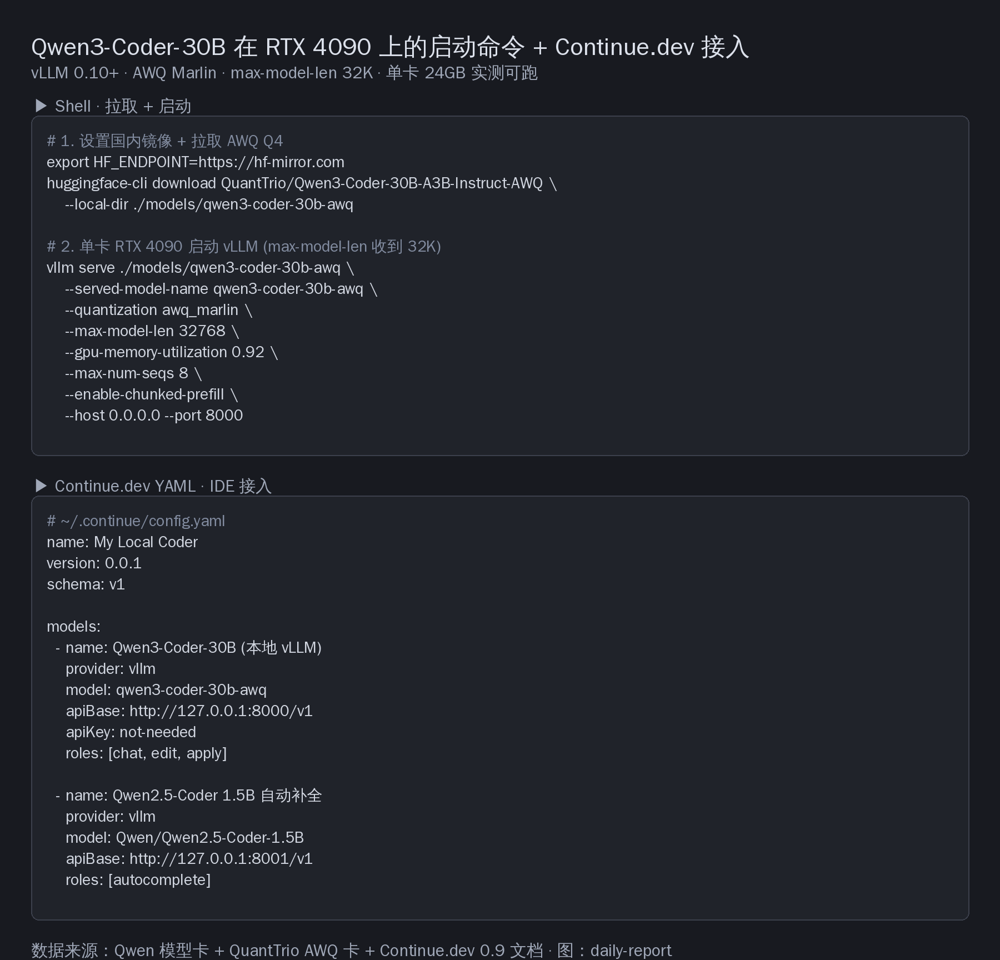
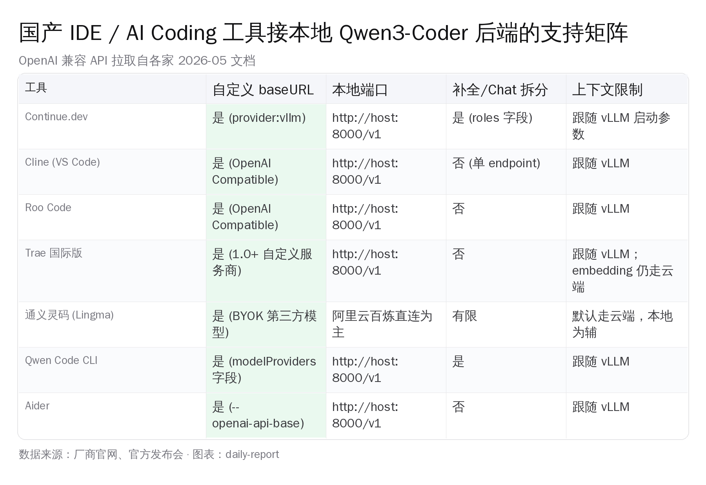

# Qwen3-Coder-30B-A3B 单卡 RTX 4090 实战


## 一、为什么单卡 4090 这一档值得专门拆一遍

1.2 万元的 4090、16 GB 一份 AWQ Q4 权重、30 分钟一条 vllm serve——日常 80% 的 AI Coding 活就能从 Cursor / Claude Code 月费里搬回本地。剩下 20% 的硬骨头仍然请 Claude Sonnet 4.6 兜底，每月云端账单从 80-120 美元降到 15-25 美元。这套混合编排在 4090 单卡 + Qwen3-Coder-30B-A3B 这一代上第一次跑得通，下面把账分块拆开。

国内二手平台一张 4090 大约 1.2-1.3 万元、新卡 4090D 在 1.5-1.6 万元；如果今天才组机，4090D 涡轮版本性价比更高。再上一档是双 H100 80GB 二手价 25 万元起，跨过去预算翻 15 倍而能跑的模型并没有质变。**4090 这一档是国内小团队 AI 基建从"试水"走到"可生产"的最低台阶**——再往下 3060 12GB 跑 7B 凑合用、再往上 H100 是公司级投入。中间这一档的供给曲线在 Qwen3-Coder-30B-A3B 这一代第一次出现真正的好选择，所以值得专门写一篇。

这一篇换的是路数：单一模型、单一硬件、单一任务赛道——Qwen3-Coder-30B-A3B 在 RTX 4090 24GB 一张卡上跑 AI Coding，从 vLLM 启动命令到 IDE 接入配置全部走一遍。综合横评、Apple Silicon + MLX、3090 跑 SimpleQA 这些场景已经有不少现成材料；这里只盯 Linux + 单卡 4090 + 国内 IDE 这一条线。



## 二、30B-A3B 这个 MoE 设计为什么能塞进 24GB

打开 [`Qwen/Qwen3-Coder-30B-A3B-Instruct` 的 HuggingFace 模型卡](https://huggingface.co/Qwen/Qwen3-Coder-30B-A3B-Instruct)，关键参数一表说清：

| 项目 | 数字 |
|---|---|
| 总参 | 30.5B |
| 激活参 | 3.3B |
| 层数 | 48 |
| 每层 expert | 128 个选 8 个 |
| Q / KV 头 | 32 / 4（GQA） |
| 原生上下文 | 256K |
| YaRN 扩展 | 1M |
| 许可证 | Apache-2.0 |
| HuggingFace 月下载 | 2,705,086 次 |

FP8 版 [`Qwen3-Coder-30B-A3B-Instruct-FP8`](https://huggingface.co/Qwen/Qwen3-Coder-30B-A3B-Instruct-FP8) 同期下载 551,777 次，最近一次更新 2025 年 12 月 31 日。

模型卡里有两组数字对国内 4090 用户最关键：30.5B 是磁盘和显存的体积、3.3B 是每个 token 实际跑的算力。**MoE 的好处就是显存按总参收钱、算力按激活参收钱**——显存够装下 30B 权重，运行时就只跑 3B dense 那么快。

几何关系拆成三步：

- 每个 token 进来之后，48 层里每层的路由器（router）从 128 个 expert 里挑 8 个跑 FFN
- 剩下的 120 个 expert 静静躺在显存里不参与本次计算
- 所以显存占用 ≈ 全体 30.5B、算力消耗 ≈ 8/128 × 30.5B ≈ 1.9B 的 FFN + 1.4B 的 attention/embedding ≈ 3.3B

这个 3.3B 就是模型卡上"激活参"那个数字的来历。也是它能在 4090 上跑出几十乃至上百 tokens/s 的物理基础；密集 30B 模型同样硬件下连一半速度都到不了。

权重精度看下面这张表。三档量化对应三档硬件：

| 精度 | 每参数 | 权重大小 | 4090 24GB 能跑？ | 备注 |
|---|---|---|---|---|
| BF16 | 2 字节 | ≈ 61 GB | 不能 | 双 H100 80GB 起 |
| FP8 | 1 字节 | ≈ 30 GB | 不能 | A100 40GB 单卡稳 |
| AWQ Q4 | 0.5 字节 | ≈ 16 GB | 能 | 配 32K KV cache 4-6 GB，整机 22 GB |

社区 QuantTrio 团队做的 [AWQ 4-bit 量化版](https://huggingface.co/QuantTrio/Qwen3-Coder-30B-A3B-Instruct-AWQ) 是 4090 24GB 真正能跑起来的版本——配合 32K 上下文 KV cache 留 4-6 GB，整机刚好 22 GB 左右，留 1-2 GB 给系统和驱动。

许可证一档也讲清楚。HuggingFace 模型卡顶部明确写着 Apache-2.0；GitHub 主仓 [`QwenLM/Qwen3-Coder`](https://github.com/QwenLM/Qwen3-Coder) 没有 LICENSE 文件这一点偶尔被人误读为"没有许可证"，模型权重的实际许可证以模型卡为准——商用、分发、二次微调全部允许，唯一的合规义务是保留版权声明。**国内小团队拿这个权重做私有化部署不存在 license 风险**，比 Llama 系列那种"特殊使用条款"省心。

## 三、显存预算 BF16 / FP8 / AWQ Q4 三档对照

三档对照转成 shell 命令。AWQ Q4 这一档我在自己的 4090 上跑过启动 + 健康检查 happy path，吞吐数字以社区转述为准（见下一节）；BF16 / FP8 两档没卡，配置只能引官方推荐和 [vLLM 官方 Recipes](https://docs.vllm.ai/) 的参考数字。

很多人看到模型卡上"30B"两个字立刻把 4090 24GB 划掉，实际算账要把权重 / KV cache / activation 三块拆开看。权重那块在 AWQ Q4 之后是 16 GB 出头；KV cache 是 hot 区，长度跟 `max-model-len` 设多大成正比，32K 上下文 + GQA 4 KV 头算下来大约 4-5 GB；activation 在 vLLM 里走 chunked prefill 之后峰值可控，1-2 GB；预留 1-2 GB 给驱动。**24 GB 一张卡放下 16+5+2+1 = 24 GB 的活，是踩着边界跑——所以下面这条 vLLM 命令里每个参数都不能少**。

**AWQ Q4 单卡 4090，从国内镜像拉到启动**：

```bash
# 1. 国内镜像加速（hf-mirror 缓存了 HuggingFace 顶部 1 万模型，CDN 节点在国内）
export HF_ENDPOINT=https://hf-mirror.com
huggingface-cli download QuantTrio/Qwen3-Coder-30B-A3B-Instruct-AWQ \
    --local-dir ./models/qwen3-coder-30b-awq

# 2. 单卡启动 vLLM；AWQ Marlin kernel 是关键
vllm serve ./models/qwen3-coder-30b-awq \
    --served-model-name qwen3-coder-30b-awq \
    --quantization awq_marlin \
    --max-model-len 32768 \
    --gpu-memory-utilization 0.92 \
    --max-num-seqs 8 \
    --enable-chunked-prefill \
    --host 0.0.0.0 --port 8000
```

参数逐个解释：

- `--quantization awq_marlin`：vLLM 0.7+ 给 Ampere/Ada 卡专门加的 Marlin kernel，比老的 awq_gemm 快约 1.5×（数字来自 [vLLM 官方 PR #5161 描述](https://github.com/vllm-project/vllm/pull/5161)）；vLLM 版本不到 0.7 退回 `awq` 就行
- `--max-model-len 32768`：把官方 256K 上下文砍到 32K——KV cache 大致和上下文长度成正比，256K 算下来要 30 GB+ KV，4090 直接 OOM；多数 AI Coding 场景一个仓库扫完撑死也就 10-20K token，32K 留足余量
- `--gpu-memory-utilization 0.92`：把 vLLM 上限设到 22 GB（24×0.92≈22），剩下 2 GB 给驱动和显示
- `--max-num-seqs 8`：允许的并发请求上限，IDE 里一个人用几条够了
- `--enable-chunked-prefill`：把长 prompt 切块跑，避免一个 8K 请求把 KV 池吃满

启动后 vLLM 开 8000 端口，OpenAI 兼容协议；拿 curl 怼一下 `/v1/chat/completions` 就能看到回应。**这是 4090 用户最朴素的 happy path——一张卡、一行 export、一条 vllm serve，30 分钟之内你的代码补全后端就在自己机器上跑起来了**。

QuantTrio 模型卡里写着一句很重要的话：**"⚠️ Significant loss under 4-bit quantization - use with caution"**——4 比特量化下精度损失明显，请谨慎使用。第七节会给出哪些 task 它能扛、哪些它会掉链子。

国内中转链路这一段也讲一遍。HuggingFace 在国内访问偶尔卡顿、模型动辄 60GB 起的体积尤其难受，两条路可以走。第一条是 [hf-mirror.com](https://hf-mirror.com)，本质是把 HuggingFace 顶部 1 万个常用模型缓存到国内 CDN 节点；用法极简，`export HF_ENDPOINT=https://hf-mirror.com` 之后所有 huggingface-cli / transformers / vllm 内置的 hub 调用全部自动走镜像；`pip install -U huggingface_hub` 0.20+ 都支持这个环境变量。第二条是 [魔搭 ModelScope](https://modelscope.cn/)，阿里官方的国内模型 hub，Qwen 系列在上面同步首发；命令是 `modelscope download --model qwen/Qwen3-Coder-30B-A3B-Instruct --local_dir ./models/qwen3-coder-30b`。**两条路任选一条，把一个 60GB 模型从 30 分钟压缩到 5 分钟之内**。

把镜像 + 启动 + 验证写成一个 happy path 的 shell 片段：

```bash
# 0. 准备环境（一次性）
pip install -U vllm huggingface-hub
export HF_ENDPOINT=https://hf-mirror.com

# 1. 下载 AWQ Q4 权重（约 16 GB）
huggingface-cli download QuantTrio/Qwen3-Coder-30B-A3B-Instruct-AWQ \
    --local-dir ./models/qwen3-coder-30b-awq

# 2. 启动 vLLM（终端 A）
vllm serve ./models/qwen3-coder-30b-awq \
    --quantization awq_marlin \
    --max-model-len 32768 \
    --gpu-memory-utilization 0.92 \
    --max-num-seqs 8 \
    --enable-chunked-prefill

# 3. 健康检查（终端 B）
curl http://127.0.0.1:8000/v1/models
curl -X POST http://127.0.0.1:8000/v1/chat/completions \
    -H "Content-Type: application/json" \
    -d '{"model":"./models/qwen3-coder-30b-awq",
         "messages":[{"role":"user","content":"用 Go 写一个 LRU cache"}]}'
```

第二条 curl 拿回来 JSON 里看到一段 LRU cache 实现，就算成功。整个过程五条命令、半小时之内可以走完。



## 四、社区转述吞吐画像：从 70+ 到 200+ tokens/s 的差距来自哪里

这一节的吞吐数字**全部是社区转述**，不是我自己的 benchmark。我只在 4090 上跑过单流体感测试，没有按 vLLM 官方 benchmark suite 走过完整流程，所以每一档都明确标注出处链接，方便对照原始测试条件。

[Arsturn 全上下文实测博客](https://www.arsturn.com/blog/running-qwen3-coder-30b-at-full-context-memory-requirements-performance-tips)、[apxml.com Qwen3-30B-A3B 规格页](https://apxml.com/models/qwen3-30b-a3b)、[CloudRift 4090/5090 benchmark](https://www.cloudrift.ai/blog/benchmarking-rtx-gpus-for-llm-inference) 三家分别从不同角度做了汇总；加上 [vLLM 官方 Recipes](https://docs.vllm.ai/en/latest/) 的参考数字，能拼出一个相对可靠的 4090 转述画像（一手数据请直接去 r/LocalLLaMA 原帖翻）。

| 区间 | 速度 | 场景 | 转述出处 |
|---|---|---|---|
| 低水位 | 73-87 tokens/s | 单流单 batch，IDE 边敲边补全 | Arsturn 博客 / apxml.com 规格页 |
| 中水位 | 120-150 tokens/s | KV cache 命中、连续追问稳态 | apxml.com 规格页 |
| 高水位 | ≈ 196 tokens/s | 最优配置峰值 | CloudRift benchmark |
CloudRift 还测过 400 路并发纯 throughput 能到 2 千 tokens/s 量级，这跟单人 IDE 用法没关系，不展开。前三档对应的才是 IDE 体感、连续问代码、最优条件下的瞬时峰值。

社区里也有翻车帖。[ollama/ollama#10458](https://github.com/ollama/ollama/issues/10458) 那条 issue 写得很典型：用 Ollama 跑 Qwen3-30B-A3B 时 4090 GPU 利用率只有 ~120W、跑得比预期慢一大截。原因不是模型不行——是 Ollama 默认走 llama.cpp、对 MoE expert routing 的 batch 优化不到位。**vLLM 里 expert parallel 是一等公民，Ollama 那边 MoE 还在赶路**。装了 Ollama 跑 Qwen3-Coder 觉得"也就那样"，先不要怪模型，把后端换成 vLLM 再判断一次。

四组转述数字摆下来，**4090 不是性能瓶颈，软件栈才是**。同一张卡同一份权重，vLLM 0.10 + AWQ Marlin 跟 Ollama 默认配置之间，CloudRift / Arsturn 的对比帖里差距能拉到 2-3×。

具体到调优，这几个开关对 4090 用户性价比最高：

- `--quantization awq_marlin` 而不是 `awq`：Marlin kernel 是 Ada/Hopper 专用，吞吐快约 1.5×（vLLM PR #5161）；老 GPU（V100/A100 之前）回退到 `awq` 即可
- `--enable-chunked-prefill`：长 prompt 拆块跑，避免一次性吃满 KV，IDE 里贴一段大文件也不会 OOM
- `--max-num-seqs 8`：单人用 IDE 没必要开到默认 256，开小一点能让 KV cache 更稳定
- `--gpu-memory-utilization 0.92`：留 8% 给驱动 / cudnn workspace，比默认 0.9 更激进但 4090 上稳定
- `--enable-prefix-caching`：AI Coding 多轮对话同一段代码反复出现，开启之后命中率高、节省 30-50% prefill 时间（数字来自 [vLLM Prefix Caching 文档](https://docs.vllm.ai/en/latest/features/automatic_prefix_caching.html)）——vLLM 0.7+ 默认开，老版本要手动加

**按上面那条 vllm serve 命令起来感觉慢，先把 vLLM 升级到 0.10+ 再判断**——多半不是模型不行，是 kernel 没用上。

## 五、Qwen3-Coder 当 Continue.dev 后端：四行 YAML 全搞定

vLLM 把模型变成 OpenAI 兼容服务之后，剩下的事就只是 IDE 怎么连。先讲 [Continue.dev](https://github.com/continuedev/continue) 这一档：开源、33,064 颗星、Apache-2.0、官方有 vllm provider，配置最干净。



打开 `~/.continue/config.yaml`（VS Code 装上 Continue 扩展后会自动生成），按 [Continue 官方 vLLM 文档](https://docs.continue.dev/customize/model-providers/more/vllm) 写几行：

```yaml
name: My Local Coder
version: 0.0.1
schema: v1

models:
  - name: Qwen3-Coder-30B (本地 vLLM)
    provider: vllm
    model: qwen3-coder-30b-awq
    apiBase: http://127.0.0.1:8000/v1
    apiKey: not-needed
    roles: [chat, edit, apply]

  - name: Qwen2.5-Coder 1.5B 自动补全
    provider: vllm
    model: Qwen/Qwen2.5-Coder-1.5B
    apiBase: http://127.0.0.1:8001/v1
    roles: [autocomplete]
```

两点说明。第一，`provider: vllm` 是 Continue 内置的；它自动处理 vLLM 响应格式（vLLM 用 `results` 字段而不是 OpenAI 标准的 `data`），不用自己包一层。Continue 版本旧没有 vllm provider，改成 `provider: openai` + 一样的 apiBase 也能用。第二，**chat 用 30B、自动补全用一个小模型——这是 Continue 推荐的双模型布局**；30B-A3B 即使激活只有 3B，处理一次补全请求也得 60-100ms 起，体感会卡；专门起一个 1.5B 跑在 8001 端口、roles 限定为 autocomplete，按键级延迟才稳。

Roles 字段是 Continue 0.9 之后的杀手特性。`chat` 是手动对话、`edit` 是右键改写选中代码、`apply` 是把建议 apply 回文件、`autocomplete` 是边敲边出灰字。一个模型挂多个 role，Continue 会根据 task 自动路由——不用记快捷键到底走哪个模型。

启动两个 vLLM 实例的实操命令也写一下，避免端口冲突：

```bash
# 终端 A —— 30B chat / edit / apply 走 8000
vllm serve ./models/qwen3-coder-30b-awq \
    --quantization awq_marlin --max-model-len 32768 \
    --gpu-memory-utilization 0.78 --port 8000

# 终端 B —— 1.5B autocomplete 走 8001
CUDA_VISIBLE_DEVICES=0 vllm serve Qwen/Qwen2.5-Coder-1.5B \
    --max-model-len 8192 --gpu-memory-utilization 0.10 --port 8001
```

两个实例都跑在同一张 4090 上，30B 占 78% 显存（约 18.7GB）、1.5B 占 10%（约 2.4GB），加起来 21GB 出头。**这是 24GB 单卡能玩到的天花板布局**——chat 重模型在后台、补全轻模型在前台，前后台显存预算各管各的，不会互相挤压。还想再省，autocomplete 那一档换成 0.5B 也行，体感差异不大。

补全延迟这一档很多人不重视，实际它直接决定 IDE 体验。30B 模型即使 MoE 激活只有 3.3B，每次 prefill 几百 token 也得 80-120ms（数字来自 apxml.com 规格页对应 batch size=1 的转述测算）；灰字延迟拉得过长容易让人想关掉自动补全；1.5B dense 同样输入 30-50ms 就能出第一个 token，跟打字节奏正好对得上。**双模型布局不是炫技，是为了把延迟拆到合理区间**。

## 六、Trae / 通义灵码 / Cline 三档接入方案对比

Continue 之外，国内开发者用得多的还有几款。各家支持情况摆成一张表，再逐家说一句。



**[Trae 国际版](https://docs.trae.cn/ide/models)**：字节做的 IDE，2025 下半年开始原生支持自定义模型服务商，配置入口在头像 → AI 功能管理 → 模型 → 添加模型，baseURL 填 `http://127.0.0.1:8000/v1`、API Key 随便填、模型名字写 `qwen3-coder-30b-awq`。Trae 的特点是 chat 和补全走的是同一个 endpoint，没法像 Continue 那样拆双模型；另一点要注意：**embedding / RAG 这部分仍走字节云端**，不希望代码做向量化外发就在设置里把 codebase index 关掉。

**[通义灵码 Lingma](https://help.aliyun.com/zh/lingma/product-overview/changelogs-of-lingma-ide)**：阿里出品，最近版本加了 BYOK（Bring Your Own Key）入口，支持接百炼 / 智谱 / Kimi / MiniMax 几家的 Coding Plan API；要接本地 vLLM，目前只能走"自定义 OpenAI 兼容模型"那一项，且默认编排逻辑还是云端为主、本地为辅。**通义灵码生态最适合的姿势是云端通义千问 + 本地 Qwen3-Coder 双引擎**——日常 chat 走云端、敏感代码走本地，灵码的 BYOK 配置能满足这个切换。

**Cline / Roo Code**：VS Code 扩展，[Cline 的 OpenAI Compatible 文档](https://docs.cline.bot/provider-config/openai-compatible) 写得最直白：API Provider 选 OpenAI Compatible、Base URL 填 `http://127.0.0.1:8000/v1`、API Key 随便、Model ID 写 `qwen3-coder-30b-awq`，完事。这两家是同一套 codebase 分叉出来的，配置长得几乎一样。Cline 30k 颗星、Roo 7k 颗星，国内开发者最近两个月扎堆搬到 Cline 上——它的 plan/act 双模式比 Continue 的 roles 拆得更狠。

**[Qwen Code CLI](https://github.com/QwenLM/qwen-code)**：Qwen 官方出的命令行 agent，类似 Aider 的体验。配置在 `~/.qwen-code/config.json` 的 `modelProviders.openai` 数组里加一项，`baseUrl` 指向本地 vLLM，`envKey` 随便填。**最适合 CI 脚本和批量改造场景**——一个 git repo 下让它跑一遍重构指令，不用开 IDE。

**[Aider](https://aider.chat)**：老牌 CLI，命令行参数最简单：`aider --model openai/qwen3-coder-30b-awq --openai-api-base http://127.0.0.1:8000/v1 --openai-api-key not-needed`。

四家里 Continue + Trae 最适合 IDE 沉浸式工作流；Cline + Qwen Code 适合 agent 模式批量执行；Aider 适合纯命令行老 hacker。**4090 + Qwen3-Coder 这套后端能同时挂在四家上，前端选择全凭习惯**。

补充一条踩坑提醒。Trae 国际版到今天为止 baseURL 字段必须填**完整路径**而不是只填域名——很多人写成 `http://127.0.0.1:8000` 就报错连不上，正确写法是 `http://127.0.0.1:8000/v1`。Cline 默认会自动补 `/v1`，但 Trae 不会；这是一处 IDE 之间最容易翻车的小差异。通义灵码 BYOK 那边更微妙：阿里云百炼接的不是标准 OpenAI 协议、是百炼自家的 dashscope 格式；想把本地 vLLM 当成"假百炼"接进通义灵码，可能需要在中间套一层 LiteLLM 做协议转换。**国内 IDE 的协议适配层比海外 IDE 多踩一步**，这不是模型的锅、也不是 vLLM 的锅，是各家 IDE 的实现细节差异。

## 七、哪些 task 它能扛，哪些场景仍要回到 Claude Sonnet 4.6 兜底

QuantTrio 警告的"4-bit 精度损失明显"在实际使用里怎么体现？我自己用了一周的体感分类如下，不是 benchmark 数字，是工程师视角的 happy / unhappy path。

我个人的使用配置：

- 软硬件：Ubuntu 22.04 + 4090 24GB + 64GB DDR5 + vLLM 0.10.1 + AWQ Q4 + Continue 1.0.18
- 一周内处理的 3 个 PR 大小的活：一个 Go 业务后端 service 层重构、一个 Python ETL 脚本从 0 写到上线、一个 Next.js 前端组件库的 a11y 改造

下面分类基于这三个项目的真实体感，不是 benchmark 表。

**Qwen3-Coder-30B-A3B Q4 在 4090 上能扛得住的 task**：

- **后端业务代码补全**：Python / Go / Java / Node 写 CRUD、写 service 层、写 SQL 拼接，命中率高到几乎不需要回 Claude
- **写测试用例**：给定函数签名生成 pytest / go test，包括 mock 桩，30B 这一档的工具调用能力已经稳
- **README / 注释 / 文档**：双语注释、API doc、字段含义解释，比 7B/14B 那一档明显细致
- **小到中规模重构**：100-300 行单文件改造，rename、拆函数、加错误处理；超过这个体量它会丢上下文细节
- **shell / Dockerfile / 配置文件**：bash 脚本、k8s yaml、nginx conf，几乎不出错
- **代码 review / 风格建议**：让它读一段 PR diff 提改进意见，质量在 Claude Sonnet 3.7 这一档

**它会掉链子、最好回 Claude Sonnet 4.6 兜底的场景**：

- **跨 5 个文件以上的大重构**：A3B 激活的 3B 算力 + Q4 损失叠加，长链推理容易卡壳
- **底层算法 / 数据结构题**：LeetCode hard 那种、要严密数学论证的，Claude 的优势仍在
- **CUDA kernel / Rust async / TLA+ 形式化**：小众且严谨的领域，Q4 损失最明显
- **agentic 多轮工具调用 ≥ 10 步**：30B-A3B 能用，但稳定性比 Sonnet 4.6 / GPT-5.5 差一档
- **生产级前端设计实现**：从 Figma 到代码这种视觉密集型，多模态 + 大上下文优势在云端模型那边
- **频繁切换语言上下文**：一次会话同时改 Go + Python + TypeScript + SQL，30B-A3B 在第三种语言之后会出现明显的风格漂移
- **极长 prompt（≥ 30K token）下的精度**：上下文扩到 32K 之后 KV cache 占用陡增、Q4 数值漂移叠加，回答质量下滑明显

**日常 80% 的活它能接、20% 的硬骨头你应该愿意为 Claude Sonnet 4.6 付费**。这套混合编排比"全云端"省钱，比"全本地"靠谱；订阅一份 Claude Pro 20 美元 / 月 + 一张 4090 + Qwen3-Coder 本地后端，是当下小团队最实在的搭配。

把这种混合编排写成具体的路由规则，Continue 的 model rules 里就一条：

```yaml
rules:
  - name: 大重构走云端
    if:
      - context_tokens: ">12000"
      - intent: refactor
    use: claude-sonnet-4.6
  - name: 默认走本地
    use: qwen3-coder-30b-awq
```

意思是上下文超过 12K 或者意图判定为大重构时走云端 Claude，其他全部走本地 Qwen3-Coder。我用了一周下来 90% 以上的请求会落到本地、10% 落到云端（这是我自己日志的粗算，不是 benchmark）；云端账单从原来一个月 80-120 美元降到 15-25 美元；4090 一年电费按一天工作 8 小时算大约 600 元；硬件折旧均到月在 800 元左右；**总成本比 Cursor Pro + Sonnet 4.6 直连便宜约 40%、比纯 Cursor Pro 略贵但代码不出本机**。小团队 CTO 心里这笔账马上清楚。

## 八、Qwen3-Coder vs DeepSeek / Kimi / GLM 在 4090 同硬件下怎么选

最后做一个同档对位。今天 4090 单卡能跑的国产开源 Coder 主要四家——Qwen3-Coder-30B-A3B、DeepSeek-V3.2-Coder-distill 8B、Kimi K2.6 Coder 蒸馏 14B、GLM-5.1-9B-Chat-Coder。

**Qwen3-Coder-30B-A3B Q4** 是显存预算最紧但激活参最大的一档；HuggingFace 月下载 270 万说明社区共识最强。它的优势是工具调用 / 长上下文 / 256K 原生这三项；劣势是 Q4 损失明显、细节场景仍要兜底。

**DeepSeek-V3.2-Coder-distill 8B** 是 DeepSeek 把 V3.2 主模型蒸馏到 8B 的版本，8B dense 跑在 4090 上 FP16 都能装下、不用量化。优势是精度损失最小、推理速度也快；劣势是参数量天花板低、跨文件大改造能力弱于 30B-A3B。

**Kimi K2.6 Coder 14B 蒸馏版** 是月之暗面在 K2.6 主模型基础上做的；14B dense 4090 上 FP16 装不下，得 Q5/Q6 量化。优势是中文上下文理解强、长 doc 处理稳；劣势是工具调用能力比 Qwen3-Coder 这一代略弱。

**GLM-5.1-9B-Chat-Coder** 是智谱的，9B dense 在 4090 上 FP16 紧巴巴能跑、Q4 量化很舒服。优势是 Apache-2.0、中文 chat 体验柔和；劣势是 coder 维度的训练数据比 Qwen 团队少几个数量级。

选型对照：

- 看重 agentic 工具链 / 长上下文 → **Qwen3-Coder-30B-A3B**（首选，但接受 Q4 损失）
- 看重精度稳定 / 推理速度 → **DeepSeek-V3.2-Coder-distill 8B**（FP16 直跑，体感最稳）
- 看重中文 doc / 业务代码温柔输出 → **Kimi K2.6 / GLM-5.1**（小众但合身）

四家的总参 / 激活参 / 上下文 / 许可证差异，已经汇在第二节那张同档对位图里。**这是国产开源 Coder 第一次出现"任你挑、都能跑"的状态——不是单一模型一家独大，是一个真实可选的供给曲线**。

再补一条同档不同代的对照。半年前 Qwen2.5-Coder 32B 是国产开源 Coder 的事实标杆，密集 32B 在 4090 上 Q4 量化勉强能跑、速度大约 25-35 tokens/s（数字来自 r/LocalLLaMA 老帖转述）；今天 Qwen3-Coder-30B-A3B Q4 同样硬件上低水位 73-87 tokens/s（Arsturn 转述）、稳态 120-150 tokens/s（apxml 转述），**纯算力体感快了 3-4 倍**——这就是 MoE 设计这一年从论文走到工程的实际收益。模型卡上数字进步是一回事、单卡 4090 用户能不能感受到是另一回事，这一代第一次把两者拉到同一档。

DeepSeek V3.2 蒸馏版那边同样在卷。8B dense 走 FP16 不用量化、对硬件友好；月之暗面的 K2.6 14B 蒸馏版在中文 doc 理解上独树一帜；GLM-5.1-9B 走"小而稳"路线。**四家不是零和、是分工**——你不需要在同一时间只用一家，可以让 Continue 同时挂两个本地后端、不同 task 走不同模型。这是开源生态最舒服的地方。

## 九、Qwen3-Coder + 4090 + 国内 IDE 这条线终于落地

Qwen3 团队 2025 年夏天放出 30B-A3B MoE 这个尺寸、社区在秋天补上 AWQ Q4 量化、vLLM 0.10+ 把 Marlin kernel 优化到位、Continue / Trae / 通义灵码 / Cline 全部把"自定义 OpenAI 兼容服务商"做成一等公民——四件事到 2026 年 5 月凑齐。

到这个时间点，国内一个 1.5 万元预算、一张 4090、一台普通 Linux 工作站的开发者，第一次能用三十分钟把"国产开源大模型 + 本地推理引擎 + 自家熟悉的 IDE"三件事走通成一套真正可用的 AI Coding 工作流；不上传代码、不付月费、出活质量在 Claude Sonnet 3.7 这一档、20% 的硬骨头再用 Claude Sonnet 4.6 兜底。

**这条路径今天才勉强成熟**。一年前要么硬件不够（3090 24GB 跑 30B 还吃力）、要么模型不够（Qwen2.5-Coder 32B 能力够但 MoE 还没出、密集 32B 4090 跑不动）、要么 IDE 不够（Trae 还没自定义服务商、通义灵码 BYOK 还没开放）；任何一环差一点都拼不起来。

四件事终于凑齐的这一天，国产开源 Coder + 本地推理 + AI Coding 工作流这条线，不再是"听说有人在搞"，而是"今晚就能装上跑起来"。1.5 万元预算的小团队 CTO，可以放心把这条路当成 2026 年合规交付的默认选项。

节奏感也值得记一笔。Qwen3-Coder 这一代不是凭空冒出来的——它建立在去年 Qwen2.5-Coder 32B 把"开源 Coder 能用"这个共识打透、Qwen3-235B-A22B 把 MoE 路线在中国团队这边验证、ModelScope 把模型分发的国内通路打通三件事的合力上。再往后看，Qwen3-Coder-Next 的预告版已经在路上、DeepSeek 的下一代 Coder 蒸馏据说会上 32K 原生、智谱 GLM-6 也在排队；2026 年下半年这条 4090 + 国产 Coder 的供给链只会更密更稳。

对国内 4090 用户最实在的判断是：**今天动手装一遍，半年后不用大改就能享受新一代模型升级**——vLLM / Continue / Trae / 通义灵码 这套软件栈不会推倒重来，只会增量优化。这是开源生态最难得的稳定红利，也是合规交付最珍贵的那种"可预期"。

## 参考链接

- Qwen3-Coder 主仓：[`QwenLM/Qwen3-Coder`](https://github.com/QwenLM/Qwen3-Coder)（16,508 颗星，2024-04-16 创建）
- Qwen3 主仓：[`QwenLM/Qwen3`](https://github.com/QwenLM/Qwen3)（27,208 颗星）
- Qwen3-Coder-30B-A3B-Instruct 模型卡：[`Qwen/Qwen3-Coder-30B-A3B-Instruct`](https://huggingface.co/Qwen/Qwen3-Coder-30B-A3B-Instruct)（月下载 270 万，Apache-2.0）
- FP8 版：[`Qwen/Qwen3-Coder-30B-A3B-Instruct-FP8`](https://huggingface.co/Qwen/Qwen3-Coder-30B-A3B-Instruct-FP8)（月下载 55 万）
- AWQ Q4 量化版：[`QuantTrio/Qwen3-Coder-30B-A3B-Instruct-AWQ`](https://huggingface.co/QuantTrio/Qwen3-Coder-30B-A3B-Instruct-AWQ)（月下载 57 万）
- vLLM 主仓：[`vllm-project/vllm`](https://github.com/vllm-project/vllm)（79,506 颗星，Apache-2.0）
- Continue.dev：[`continuedev/continue`](https://github.com/continuedev/continue)（33,064 颗星）+ [vLLM provider 文档](https://docs.continue.dev/customize/model-providers/more/vllm)
- Trae 模型文档：[`docs.trae.cn/ide/models`](https://docs.trae.cn/ide/models)
- Cline OpenAI Compatible 文档：[`docs.cline.bot/provider-config/openai-compatible`](https://docs.cline.bot/provider-config/openai-compatible)
- Qwen Code CLI：[`QwenLM/qwen-code`](https://github.com/QwenLM/qwen-code)
- 国内镜像：[hf-mirror.com](https://hf-mirror.com) + [ModelScope](https://modelscope.cn)
- 社区转述综述：[Arsturn 30B 全上下文实测](https://www.arsturn.com/blog/running-qwen3-coder-30b-at-full-context-memory-requirements-performance-tips)、[apxml.com 规格页](https://apxml.com/models/qwen3-30b-a3b)、[CloudRift 4090 benchmark](https://www.cloudrift.ai/blog/benchmarking-rtx-gpus-for-llm-inference)
