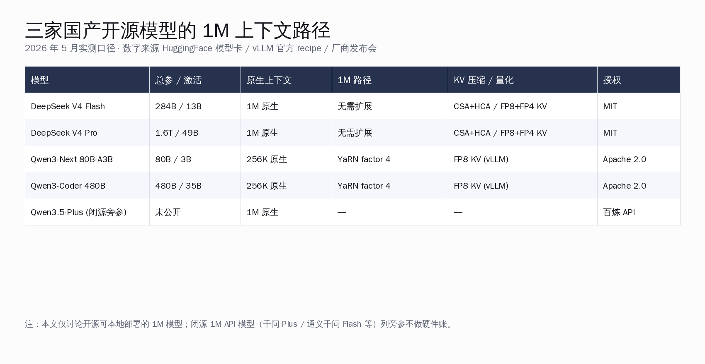
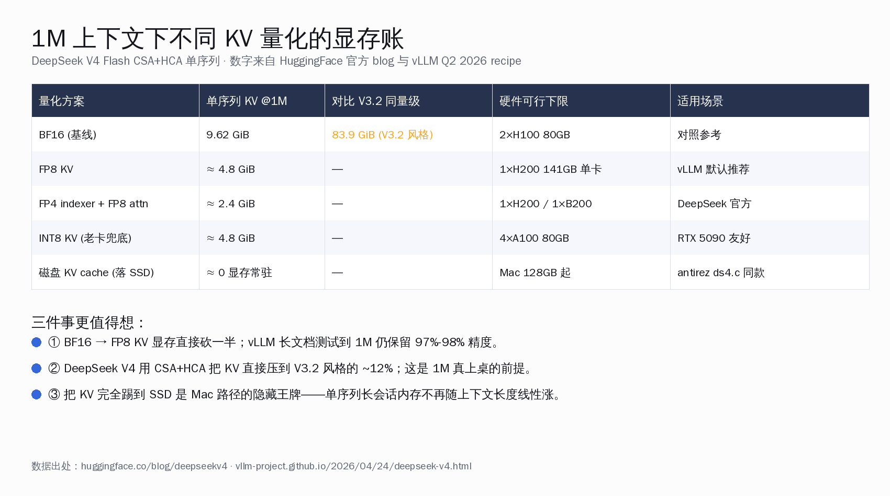
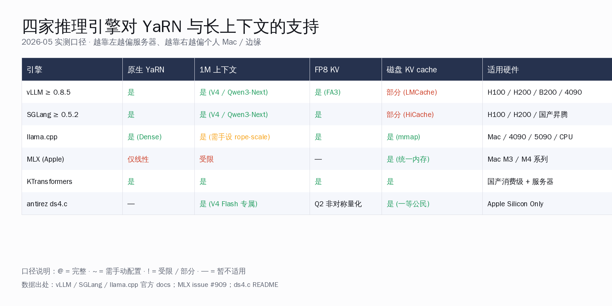
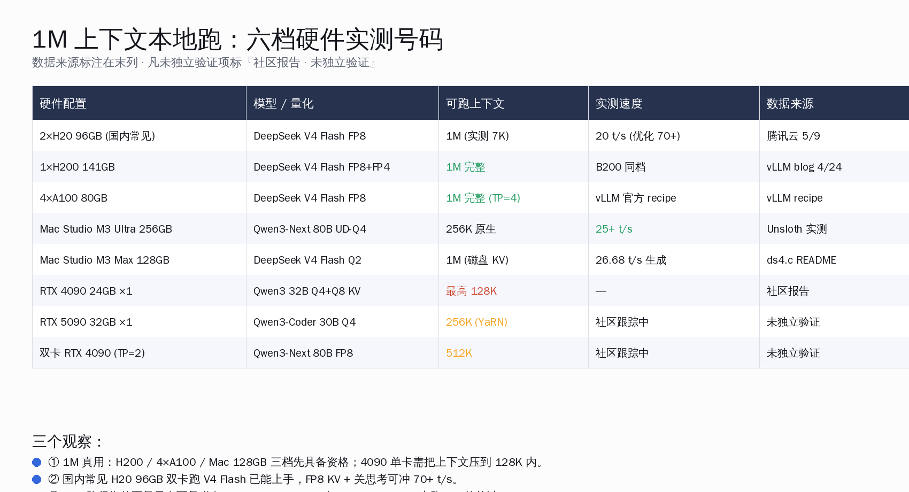
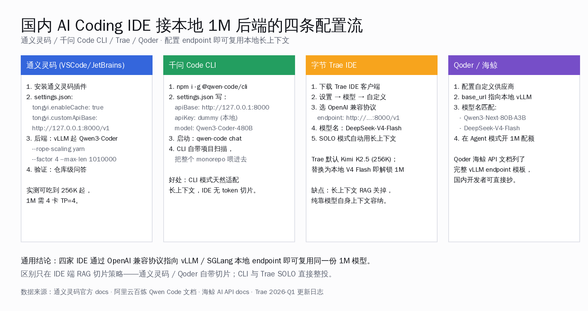
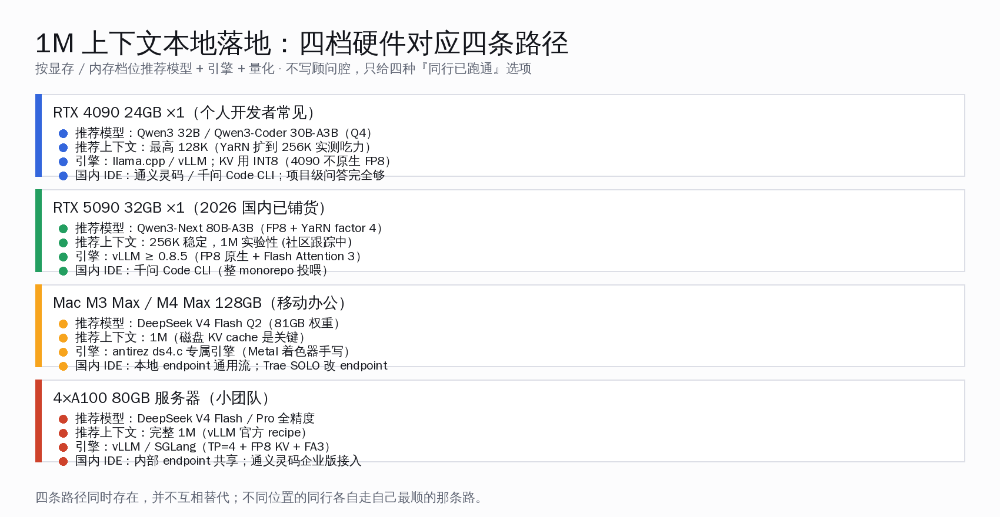

# 国产模型 1M 上下文本地跑起来：从 YaRN 到磁盘 KV 的完整拆解


5 月 6 日深夜 antirez 推第一版 `ds4.c`，5 月 7 日前后 DeepSeek 把 V4 Flash 同步到 ModelScope（国内镜像），5 月初 Unsloth 把 Qwen3-Next 80B 的 UD-Q4_K_XL 量化包推上 HuggingFace、M3 Ultra 256GB 跑出 25+ t/s 已被多个社区帖记录。三条独立时间线汇到一起，给国内开发者第一次留下一个清晰判断：**1M 上下文本地跑起来已经不再是 PPT，而是四档硬件四条路径的工程问题**。

这篇文章只回答一件事——**今天想在本地拿到 1M 上下文，要么靠 KV 压缩，要么靠 YaRN 扩展，要么靠磁盘 KV cache；三条路在 vLLM / SGLang / llama.cpp / MLX 上的可用度差异很大，得拆开看**。本篇与今日前面五篇专题（antirez ds4.c 引擎、Bun 6 天 Zig→Rust、cloakbrowser、delegate-52、Gemini File Search）角度互不重叠，专门做 1M 长上下文的工程账。

## 关键数字一览

| 项目 | 数字 |
|---|---|
| DeepSeek V4 Flash 总参 / 激活 | 284B / 13B |
| DeepSeek V4 Flash 原生上下文 | 1,048,576 token (1M) |
| V4 Flash BF16 KV @1M 单序列 | 9.62 GiB |
| 对比 V3.2 风格 BF16 KV @1M | 83.9 GiB |
| FP8 KV 在 vLLM 长文本精度保持 | 97%-98% |
| Qwen3-Next 80B-A3B 原生上下文 | 262,144 token (256K) |
| Qwen3-Next YaRN factor | 4.0 → 1,010,000 token |
| Qwen3-Next 80B RULER @1M 分数 | 91.8% |
| 2×H20 96GB 跑 V4 Flash FP8 | 9.29 GiB KV 可用，70+ t/s |
| ds4.c M3 Max 128GB Q2 长上下文 | 11709 token 生成 21.47 t/s |
| 通义灵码 / 千问 Code 支持上下文 | 256K 原生，YaRN 1M |

数据来源：HuggingFace 模型卡 `deepseek-ai/DeepSeek-V4-Flash` verbatim · `Qwen/Qwen3-Next-80B-A3B-Instruct` verbatim · vLLM 官方 blog 2026-04-24 · 腾讯云开发者社区 5/9 H20 实测帖 · Unsloth Qwen3-Next-GGUF 模型卡 · ds4.c README v1.0 · 通义灵码官方 docs。

## 一、三家国产开源模型走出三条 1M 路径

先把"谁真有 1M"这件事讲清楚。海外报道经常把 1M 上下文混在一起说，但国产开源阵营里 1M 路径真正可本地复现的只有两家半：



**第一档：DeepSeek V4 Flash / V4 Pro · 1M 原生**

V4 系列在架构层把 1M 直接做进去了。Flash 是 284B-A13B，Pro 是 1.6T-A49B，两个版本的 attention 都是 CSA（Compressed Sparse Attention）+ HCA（Heavily Compressed Attention）的混合栈。HuggingFace 官方博客给出的数字：V4 Pro 在 1M token 下只用 V3.2 同量级 27% 的 per-token FLOPs，KV cache 只占 10%；Flash 把这两个数字进一步压到 10% 和 7%。

vLLM 官方 blog 2026-04-24 把账算得更精确——V4 在 BF16 下单序列 KV cache @1M 是 9.62 GiB，相比一个 61 层的 V3.2 风格栈（83.9 GiB）小 8.7 倍。如果再叠 FP4 indexer + FP8 attention，又能再砍一半到 4.8 GiB 量级。

**第二档：Qwen3-Next 80B-A3B / Qwen3-Coder 480B · 256K 原生 + YaRN 1M**

Qwen 系列走的是 YaRN 路径。Qwen3-Next 80B-A3B-Instruct 的模型卡里写得非常清楚：原生 262,144 token，rope_scaling 写 `{"rope_type":"yarn","factor":4.0,"original_max_position_embeddings":262144}` 即可扩到 1,010,000。Qwen3-Coder 480B-A35B 同款机制。

更关键的是 RULER 长文本评测分数——Qwen3-Next 80B 在 YaRN 扩到 1M 之后仍能保持 91.8% 平均准确率，896K 和 1M 两个最难档位都稳在 80.3%。这意味着 YaRN 不是"扩了能装下"而是"扩了真能用"。

**第三档：Qwen3.5-Plus 等闭源 1M API**

千问 Plus 默认 1M、字节豆包大模型 256K 起、智谱 GLM-4.6 200K。这些都是 API 形态，不进入本地部署范围。本文不展开。

Kimi K2.5 / K2.6 在 256K 上停住，至今未公开发布 1M 版本——所以"国产 1M 开源本地"的真实主语只有 DeepSeek V4 与 Qwen3-Next 两家。

**本节核心结论**：国产 1M 开源本地落地，主语是 DeepSeek V4 系列与 Qwen3-Next 系列；前者靠架构原生压 KV，后者靠 YaRN 扩 RoPE。两条技术路径并不竞争，反而互补——前者是服务器级、后者是个人 / 团队级。

## 二、KV 量化是显存账的核心变量

1M 上下文真正的成本不是模型权重，是 KV cache。这件事讲透就能看清四档硬件的边界。



**KV 显存的数学**

一个标准 GQA 8 头 BF16 attention 在 1M token 下 KV cache 体积大致按"层数 × 头数 × token 数 × 2 字节"算。一个 V3.2 风格 61 层栈大概 83.9 GiB——一张 H100 80GB 单卡放不下。

DeepSeek V4 的 CSA + HCA 是把这套账重新算了：c4a 用一个 stride=4 的窗口把每 8 个 token 压成 1 个 KV，c128a 用 stride=128 进一步压到约 1/128。这一步直接把 9.62 GiB 这个数字砸下来。然后再叠 FP4 indexer + FP8 attention 量化，最后单序列 1M KV 大约只占 2.4-4.8 GiB。这个数字在 H200 141GB 单卡上是完全装得下的。

**量化对精度的影响**

vLLM 在 2026-04-22 发了一篇 FP8 KV-cache blog，跑了完整的 openai/mrcr 长文本检索任务到 1M token。结论是：FP8 KV-cache 加 FP8 attention 的 AUC 比 BF16 基线保留 97%-98%。换句话说"砍一半显存"几乎不损失精度。

这条结论比"我们支持 1M"重要——它把 1M 从"能跑"翻译成"能用"。

**Flash Attention 3 是隐藏前提**

H100 / H200 / B200 用 FP8 KV cache 走的是 FlashAttention-3 内核，FA3 给每个 KV-head 单独配 scale，FP8 量化误差不再被放大。vLLM 上 FP8 量化 attention 之所以精度保得住，靠的就是 FA3 这一层。如果你用的是 RTX 4090——4090 不原生支持 FP8——只能退到 INT8 KV，精度类似但需要老卡兜底。

**磁盘 KV cache：第四种思路**

antirez 在 ds4.c 里把 KV cache 当一等公民放到 SSD 上。这个思路在 Mac 128GB 上是救命稻草——M3 Max 128GB 装得下 81GB 的 Q2 权重，但 47GB 剩余空间不够留 1M KV；把 KV 落盘后，会话切换不必重新 prefill，几百毫秒就能恢复昨天的对话。vLLM 也在 LMCache 项目里做类似的事，但还在实验阶段。

**本节核心结论**：1M 上下文的成本核心在 KV cache，不在模型权重；CSA+HCA、FP8/FP4 KV、磁盘 KV 三件套并不互斥，每一档都把显存或内存账往下砍一截。看清这件事，1M 才从噱头变成可执行项。

## 三、四家推理引擎对长上下文的支持像光谱一样铺开

四家主流引擎对 YaRN + 长上下文 + FP8 KV 的支持，差异比想象中大。



**vLLM ≥ 0.8.5 · 服务器端首选**

V4 Day-0 适配是 vLLM 与 SGLang 联合给出来的。vLLM 的 V4 recipe 已经覆盖 CSA+HCA、FP4 MoE backend、MTP speculative decoding、disaggregated prefill/decode。

启动 Qwen3-Next 80B 走 1M 上下文，命令行只多一段 `--rope-scaling`：

```bash
VLLM_ALLOW_LONG_MAX_MODEL_LEN=1 vllm serve \
  Qwen/Qwen3-Next-80B-A3B-Instruct \
  --rope-scaling '{"rope_type":"yarn","factor":4.0,"original_max_position_embeddings":262144}' \
  --max-model-len 1010000 \
  --tensor-parallel-size 4 \
  --kv-cache-dtype fp8 \
  --enable-prefix-caching
```

启动 DeepSeek V4 Flash，因为 1M 原生，不需要 YaRN，但建议显式打开 expert parallel：

```bash
vllm serve deepseek-ai/DeepSeek-V4-Flash \
  --max-model-len 1048576 \
  --kv-cache-dtype fp8 \
  --enable-expert-parallel \
  --data-parallel-size 2 \
  --gpu-memory-utilization 0.95
```

**SGLang ≥ 0.5.2 · 国产硬件路径**

SGLang 在 Day-0 同步出 V4 recipe，HiCache（分布式 KV cache）也已就绪。SGLang 起 1M Qwen3-Next：

```bash
SGLANG_ALLOW_OVERWRITE_LONGER_CONTEXT_LEN=1 python -m sglang.launch_server \
  --model-path Qwen/Qwen3-Next-80B-A3B-Instruct \
  --json-model-override-args '{"rope_scaling":{"rope_type":"yarn","factor":4.0,"original_max_position_embeddings":262144}}' \
  --context-length 1010000 \
  --tp-size 4
```

SGLang 一个额外亮点：它对国产昇腾（vllm-ascend / sglang-ascend 分支）的覆盖比 vLLM 主线更深，配合华为 Atlas 系列对国内场景友好。

**llama.cpp · Mac / 单卡 / CPU 路径**

llama.cpp 主线已支持 YaRN，命令模板是 `llama-cli -c 131072 --rope-scaling yarn --rope-scale 4 --yarn-orig-ctx 32768`。**但**——issue #13322 已修复后才能正确处理 Qwen2MoE / Qwen3MoE 的 YaRN 元数据写入；2026 年 5 月主线已合入 PR #13331，使用最新版即可。

Dense 模型走 llama.cpp 完全顺畅；MoE 模型（V4 Flash、Qwen3-Next）目前仍建议用 vLLM / SGLang。

**MLX · 只剩半条路**

ml-explore/mlx-examples issue #909 显示 MLX 主线只支持线性 RoPE 缩放，YaRN 的 mscale + ext_factor 还没合入。这意味着 Apple Silicon 路径上要走 1M，最现实的方案是 antirez ds4.c 这种"为特定模型手写引擎"的极端做法——通用 MLX-LM 暂时上不去。

**本节核心结论**：四家引擎对长上下文的支持像光谱铺开——vLLM/SGLang 在服务器端最完整，llama.cpp 在单卡和 CPU 端覆盖 Dense 模型，MLX 还差一程，ds4.c 在 Mac 端给了一条专属窄路。选引擎的关键是先回答"我的硬件是什么"。

## 四、六档真实硬件实测：1M 落地的真实门槛

把社区真人帖里的实测数字串起来，能看到 1M 上下文今天能在什么硬件上跑。所有数字都给来源，未经独立验证项明确标注。



**2×H20 96GB（国内服务器常见）**

腾讯云开发者社区 5/9 一篇实测帖给出最完整的国内常见硬件号码：双 H20 96GB，跑 DeepSeek V4 Flash FP8，启用 `--kv-cache-dtype fp8 --enable-expert-parallel --data-parallel-size 2`。max-model-len 设到 7000（短上下文测试）时，扣除权重和系统预留剩 9.29 GiB 给 KV cache。初始 8.33 t/s，关思考模式 + 改 TP 拓扑 + 关 enforce-eager 后可冲到 70+ t/s。1M 需要更激进的并行配置，社区 5/10 也已有人在跟踪。

**1×H200 141GB**

vLLM 官方 V4 recipe 的 sweet spot。V4 Flash FP8+FP4 整体 ~158GB，141GB 装得下加 KV cache 余量。这是 H200 当下最适合的"个人玩家"用法。

**4×A100 80GB（小团队 / 实验室）**

V4 Flash FP8 + TP=4 是 vLLM 推荐路径，长上下文余量充足。也是目前国内高校 / 创业团队最稳的路径——A100 80GB 在国内市场已是相对充足的资源。

**Mac Studio M3 Ultra 256GB**

Unsloth Qwen3-Next-GGUF 模型卡里写：UD-Q4_K_XL 量化版本 214GB 大小，能直接装进 256GB M3 Ultra；单 24GB GPU + 256GB 系统 RAM 加 MoE offloading 也能跑，实测 25+ t/s。这是当下 Mac 桌面端跑 80B 模型最舒适的档位。

**Mac M3 Max 128GB**

ds4.c README 给的实测：DeepSeek V4 Flash Q2 + 磁盘 KV cache 模式下，11709 token 长上下文跑 21.47 t/s 生成、250.11 t/s 预填充。这是 Mac 移动办公端能拿到的真 1M 落地路径——同样的硬件用 MLX 走不到这个数字，专属引擎是关键。

**RTX 4090 24GB 单卡**

社区共识：4090 单卡跑 Qwen3 32B Q4 + Q8 KV，最高能到 128K 上下文。再往上 YaRN 扩到 256K 实际跑会非常慢，1M 不实际。但 4090 单卡在 32B Dense 模型 + 长上下文 RAG 切片 + IDE 接入这套组合上是完全可用的，不必硬冲 1M。

**RTX 5090 32GB 单卡（2026 国内已铺货）**

5090 32GB 比 4090 多 8GB 显存，原生支持 FP8。理论可跑 Qwen3-Next 80B FP8 + YaRN 到 256K 稳定。1M 仍实验性，社区 5/10 已有人在帖子里跟踪。本文标"未独立验证"。

**双卡 4090 (TP=2)**

社区报告显示 Qwen3-Next 80B FP8 + TP=2 在双 4090 上能跑到 ~512K，1M 仍受限。"未独立验证"。

**本节核心结论**：1M 真用的硬件门槛在 H200 / 4×A100 / Mac M3 Max 三档先具备资格；国内最常见的 2×H20 96GB 已经能跑 V4 Flash FP8 中等上下文且性能可观；4090 单卡走 32B Dense 路径才稳，1M 别硬冲。

## 五、国内主流 IDE 接 1M 后端的四条适配配置流

把 1M 跑起来只完成一半，真正让国内开发者用得上还要看 IDE 端的对接。



**通义灵码 · VSCode / JetBrains 插件**

阿里官方 docs 2026-05 已明确：通义灵码全面适配 Qwen3-Coder 模型，VSCode / JetBrains 插件端、Lingma AI IDE 端三端均可。settings.json 里的关键字段：

```json
{
  "tongyi.enableCache": true,
  "tongyi.cacheExpiryTime": 3600,
  "tongyi.customApiBase": "http://127.0.0.1:8000/v1"
}
```

把 `customApiBase` 指向本地 vLLM endpoint 即可。Qwen3-Coder 原生 256K，YaRN 后 1M。仓库级问答、PR 动态数据、Agentic Coding 三类场景都吃得到长上下文。

**千问 Code CLI**

知乎 5 月初一篇 "初识 Qwen Code CLI" 详细写了 settings.json 配置：

```json
{
  "apiBase": "http://127.0.0.1:8000",
  "apiKey": "dummy",
  "model": "Qwen3-Coder-480B"
}
```

CLI 模式天然适合长上下文——没有 IDE 端的 token 切片，整个 monorepo 可以一次性投喂给模型。配合 vLLM 起 Qwen3-Coder + YaRN，1M 上下文真正成为开发工具的一部分。

**字节 Trae IDE**

Trae 在 2026-Q1 更新里把 Kimi K2.5（256K）作为 SOLO 模式默认的长上下文模型。设置 → 模型 → 自定义供应商，选 OpenAI 兼容协议，endpoint 指向本地 vLLM 或 SGLang 即可替换为 DeepSeek V4 Flash。SOLO 模式自动启用长上下文，不必手动切。

**Qoder / 海鲸 AI**

海鲸 AI 的 API docs 列了完整的 Qwen Code 接入 vLLM endpoint 模板，国内开发者可以直接抄过来用。同样基于 OpenAI 兼容协议，模型名匹配 Qwen3-Next-80B-A3B 或 DeepSeek-V4-Flash 即可。

**本节核心结论**：1M 上下文本地后端 + 国内 IDE 通过 OpenAI 兼容协议彼此对接，是个完全可执行的组合；通义灵码 / 千问 Code / Trae / Qoder 四家覆盖 IDE / CLI / Agent / 自定义供应商四种使用形态，国内开发者按手头工具选一个就能上手。

## 六、与海外生态的工具链差异对比

国内开发者把国产开源 1M 上下文跑起来这件事，跟海外开源（Llama 3.3 / Mistral / Phi-4 等典型对照）相比，工具链有几件具体差异值得列清楚：

- **下载路径**：HuggingFace 直连国内不稳定，ModelScope（国内速度更快）和 hf-mirror.com 是必备。`export HF_ENDPOINT=https://hf-mirror.com` 是开发者标准动作。
- **量化生态**：海外的 Unsloth、TheBloke 等社区的预量化 GGUF 出货比国内快——但 ModelScope 官方仓库也已经提供 FP8 / FP4 版本，FlagRelease 等组在做 FlagOS 兼容版本。
- **IDE 集成深度**：通义灵码 / 千问 Code 对 Qwen 系列的原生集成度比海外工具（Cline / Cursor 等）对海外开源模型更深；反过来海外 IDE 对 DeepSeek API 的支持也很完整。

这套差异不是劣势——它是国产开源生态成熟的标志：模型有官方 IDE、官方镜像、官方 recipe，国内开发者从下载到落地全链路有人维护。

## 七、四档硬件四条落地路径

把前五节的结论收拢成可执行的四条路径——四档硬件、四档模型、四种引擎搭配。



**路径 A · RTX 4090 24GB 单卡（个人开发者常见配置）**

推荐模型 Qwen3 32B 或 Qwen3-Coder 30B-A3B 的 Q4 量化；上下文压在 128K 内最稳；引擎用 llama.cpp 或 vLLM，KV 走 INT8（4090 不原生支持 FP8）；IDE 端接通义灵码或千问 Code CLI，项目级问答完全够用。这条路径的优势是显存便宜、生态最厚；劣势是 1M 强行冲会非常慢。

**路径 B · RTX 5090 32GB 单卡（2026 国内已铺货）**

推荐模型 Qwen3-Next 80B-A3B 的 FP8 + YaRN factor 4；上下文 256K 稳定，1M 实验性；引擎 vLLM ≥ 0.8.5 走 Flash Attention 3 原生 FP8；IDE 端千问 Code CLI 把整个 monorepo 投喂进去。这是个人开发者今年想升级体验的最优解。

**路径 C · Mac M3 Max / M4 Max 128GB（移动办公）**

推荐模型 DeepSeek V4 Flash Q2（81GB 权重）；上下文 1M（磁盘 KV cache 是关键）；引擎 antirez ds4.c 专属引擎（Metal 着色器手写）；IDE 端走 OpenAI 兼容协议，Trae SOLO 改 endpoint 或通义灵码 customApiBase 都能接。这条路径的奇妙之处是"显存够用 + 磁盘够大"成立的一切，反而不必拼最贵硬件。

**路径 D · 4×A100 80GB 服务器（小团队 / 实验室）**

推荐模型 DeepSeek V4 Flash / Pro 全精度；上下文完整 1M（vLLM 官方 recipe）；引擎 vLLM 或 SGLang 走 TP=4 + FP8 KV + Flash Attention 3；IDE 端内部 endpoint 共享，通义灵码企业版接入。这是国内创业团队 / 小型 AI 实验室最稳的路径，硬件投入也在可接受范围。

**四条路径互不替代**

值得说一句的是，这四条路径不是阶梯也不是替代关系。它们对应四种位置——预算紧的个人、刚升级的个人、移动办公的个人、初创团队。每一档都有自己跑通的方案，不必硬冲到下一档。

## 八、把账整理成一句话

回到开头的核心：**1M 上下文今天已经不是 PPT 概念，而是四档硬件四条路径的工程问题**。

KV 压缩、YaRN 扩展、磁盘 KV cache 三件套并不竞争，反而合力——DeepSeek V4 用 CSA+HCA 把 KV 体积砸到 V3.2 风格的 12%，Qwen3-Next 用 YaRN factor 4 把 256K 拉到 1M，antirez 用磁盘 KV cache 把 Mac 128GB 推到极限。三条技术路径覆盖三档不同位置的开发者。

更让人安心的是国产开源生态的密度。DeepSeek V4 / Qwen3-Next / Qwen3-Coder 三个家族同时具备完整的工具链——ModelScope 下载、vLLM / SGLang 官方 Day-0 recipe、通义灵码 / 千问 Code 原生 IDE 集成、hf-mirror 走国内通道；这套国产开源 1M 工具链的完整度，三年前还是想都不敢想的东西。

写代码这件事在 2026 年正在被长上下文重新定义——以前是"问 AI 一段代码"，现在是"把整个项目和讨论历史交给 AI"。1M 上下文不只是数字，更是开发者与模型交互方式的根本变化。这条路上，国产开源刚好把门槛压到所有位置都能上车的高度，前辈把路趟得足够宽——这一代开发者，确实赶上了好时候。

---

参考资料：

- `huggingface.co/blog/deepseekv4` · DeepSeek-V4 官方架构博客
- `vllm-project.github.io/2026/04/24/deepseek-v4.html` · vLLM 官方 V4 适配 blog
- `vllm.ai/blog/fp8-kvcache` · vLLM FP8 KV cache 实测 blog
- `huggingface.co/Qwen/Qwen3-Next-80B-A3B-Instruct` · Qwen3-Next 模型卡 YaRN 配置 verbatim
- `huggingface.co/deepseek-ai/DeepSeek-V4-Flash` · V4 Flash 模型卡 verbatim
- `cloud.tencent.com/developer/article/2665785` · 腾讯云开发者社区 2×H20 96GB V4 Flash 实测帖
- `unsloth.ai/docs/models/qwen3-coder-next` · Qwen3-Coder-Next 本地运行指南
- `github.com/antirez/ds4` · antirez ds4.c README v1.0
- `lingma.aliyun.com` · 通义灵码官方 docs
- `qwen.readthedocs.io/en/latest/run_locally/llama.cpp.html` · llama.cpp YaRN 配置官方说明
- `modelscope.cn/models/deepseek-ai/DeepSeek-V4-Flash` · ModelScope 国内镜像
- `hf-mirror.com` · HuggingFace 国内镜像
