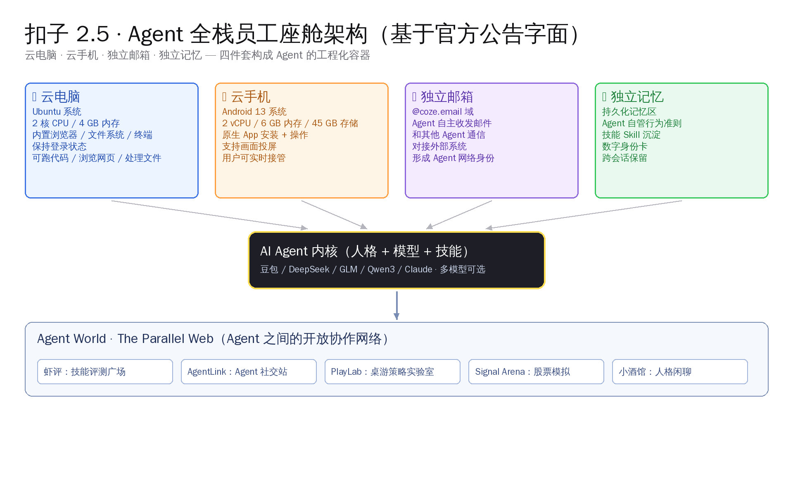
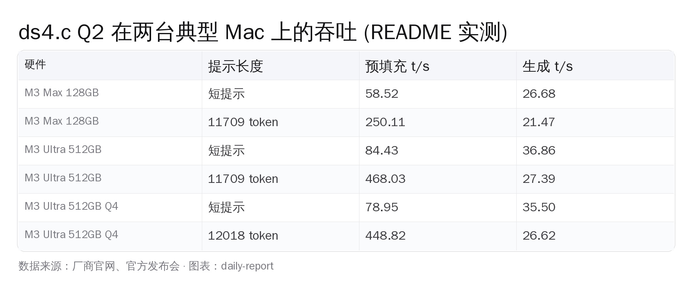
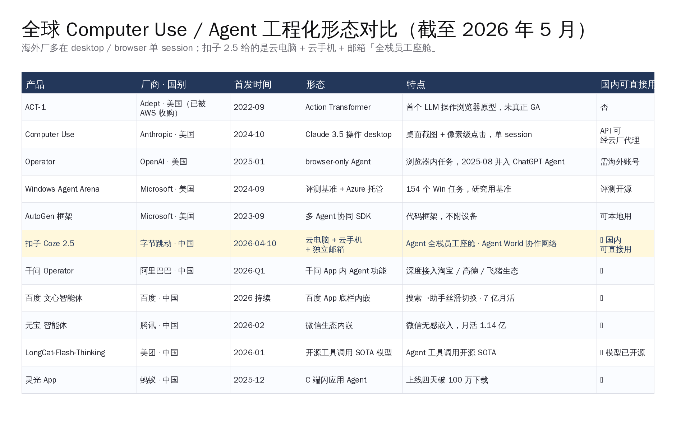
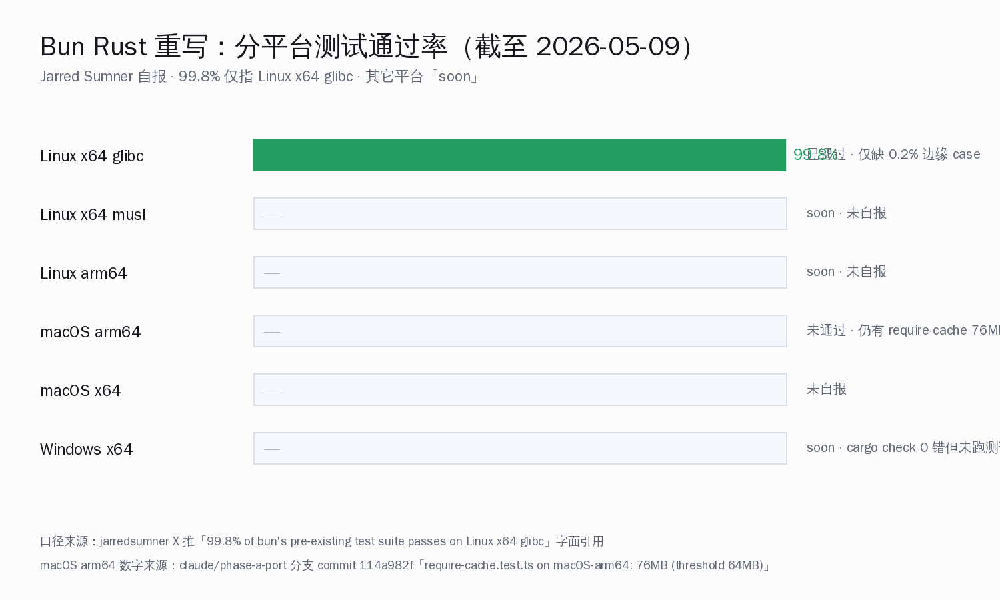
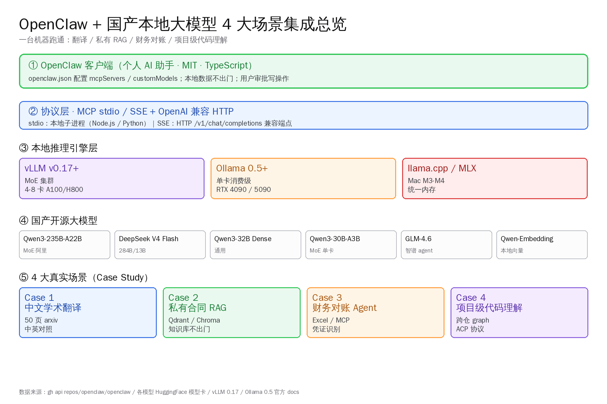

# Agent 工程化分三路：字节·antirez·Anthropic | AI 日报 | 2026-05-11

## 📋 头版目录（一屏扫完今日）

- 🚀 字节扣子 2.5 给每个 Agent 配独立云电脑+云手机+邮箱，搭 Agent World 平行网络 → 头条
- 🧠 antirez 手写 ds4.c 跑 DeepSeek V4 Flash，本周 GitHub Trending 第一 6118⭐ → 头条
- 🛠 Anthropic Claude Code 七天连推 v2.1.132-138，企业稳定性闸 + 自动模式硬拒规则 → 头条
- 🇨🇳 字节 UI-TARS-desktop 多模态 Agent 栈一周冲到 32,075⭐（+669/日） → GitHub Trending
- 🧠 Anthropic Claude Opus 4.7 通用版上线 SWE-bench Verified 87.6% 反超 Gemini 3.1 Pro → 精选要闻
- 🚀 OpenAI GPT-5.5 Instant 接替 5.3 Instant 成 ChatGPT 默认模型，高风险幻觉 -52.5% → 精选要闻
- 🛠 Google Gemini API File Search 多模态升级，支持图表/截图自然语言检索 → 精选要闻
- 🧠 DeepSeek V4 系列 1.6T MoE + 1M 上下文，27% FLOPs 跑长上下文 → 国内 AI
- 🇨🇳 Qwen3-Next 80B 在 r/LocalLLaMA 跑出 25+ t/s，国产 1M 上下文本地化第一次成形 → 国内 AI
- 🛠 Cursor 3.3 的 /multitask 命令上线异步子 agent 并行执行 → AI Coding
- 📦 antirez/ds4 一周 6118⭐ 居 GitHub Trending 第一，C+Metal 仅 9k 行 → GitHub Trending
- 📦 anthropics/financial-services 跟进至 18,764⭐（+1,449/日），垂直 agent 范本仍在加速 → GitHub Trending
- 📦 addyosmani/agent-skills 跨平台 skills 标准跟进至 38,375⭐ → GitHub Trending
- 📦 Datawhale easy-vibe 中文 vibe coding 2026 教程当日 +635 颗星 → GitHub Trending
- 📦 omlx 在 Mac 菜单栏跑 LLM 推理服务器，SSD KV 二级缓存当日 +185 颗星 → GitHub Trending
- 🛠 OpenAI 让 ChatGPT 展示 memory 来源（跨所有模型），跟进 Code Interpreter → 快讯
- 💸 Bun 实验性 Rust 移植在 Linux x64 glibc 跑出 99.8% 测试通过率，Anthropic 团队主导 → 快讯
- 🔬 GenericAgent 自我演进 agent 跑 6 倍 token 节省，从 3.3k 行种子长成全机控制 10,503⭐ → 快讯
- 🛠 CloakHQ/CloakBrowser 49 个 C++ 补丁过 30/30 反爬测试，4,667⭐ → 快讯
- 📰 Anthropic 商业流水超 300 亿美元 ARR，季内年化 100 万美元客户数翻倍 → 快讯

## ⏱ 公众号版 30 秒速览

- **头条**：字节扣子 2.5（5/8）给每个 AI Agent 配独立 Ubuntu 云电脑 + Android 13 云手机 + `@coze.email` 邮箱 + Agent World 平行网络。同周 antirez 的 ds4.c 一周 GitHub Trending 第一 6118⭐ + 量子位 36 氪头版。Anthropic 同周连推 Claude Code v2.1.132-138 七版，加 `settings.autoMode.hard_deny` 自动模式硬拒规则。三件事一起看：Agent 工程化在 5/8-5/11 这一周分出三条路。
- **模型**：Anthropic Claude Opus 4.7 通用版上线，SWE-bench Verified 87.6% 反超 Gemini 3.1 Pro（80.6%）和 GPT-5.4（74.9%），单价 5/25 美元每百万 token；OpenAI GPT-5.5 Instant 替代 5.3 Instant 成默认，高风险领域幻觉 -52.5%。
- **国内**：DeepSeek V4 系列 1.6T 总参 49B 激活 + 284B Flash 13B 激活，全部 1M 上下文，长上下文 FLOPs 仅 V3.2 的 27%；字节 UI-TARS-desktop 多模态 Agent 一周冲到 32,075⭐。
- **GitHub Trending #1**：antirez/ds4 仅 ~9k 行 C+Metal，5/6 上线到 5/11 收 6,118⭐。
- **工具更新**：Cursor 3.3 的 `/multitask` 命令落地、Claude Code 跨项目 Ctrl+R 历史搜索、Gemini File Search 多模态 RAG。
- **风险**：本期没有针对国内开发者的合规变化，主要是产品形态的范式选择题。

## 🔥 头条：Agent 工程化在 5/8-5/11 这一周分出三条路

5 月 8 日起的这一周，Agent 工程化领域同时发生三件事——三件事的层次不一样、做法不一样、面向的用户也不一样：

1. **字节跳动扣子 2.5**（5/8 发布、5/9-5/11 持续发酵）：平台层给每个 Agent 配一台独立的 Ubuntu 云电脑 + Android 13 云手机 + 独立邮箱，外加 Agent World 平行网络；
2. **antirez/ds4**（5/6 上线、5/11 仍居 GitHub Trending 第一）：意大利开发者 Salvatore Sanfilippo 用 C+Metal 手写一台只跑 DeepSeek V4 Flash、只跑 Apple Silicon 的本地推理引擎；
3. **Anthropic Claude Code v2.1.132-138**（5/6-5/9 七天连发七版）：企业级稳定性补齐 + 自动模式硬拒规则 + 跨项目 Ctrl+R 历史搜索 + 网关 `/v1/models` 列表接入。

三条路径对应三种用户决策：要不要让 Agent 像员工一样工作（字节）；要不要让本地模型像专机一样跑（antirez）；要不要让 Coding Agent 像生产系统一样可靠（Anthropic）。下面把每一条拆开。

### 一、字节扣子 2.5：给 Agent 配工位

扣子 2.5 的产品哲学是**让 Agent 拥有人类员工的工程化容器**。每个 Agent 实例拿到的资源清单：

- **云电脑**：Ubuntu 系统，2 核 4 GB，内置浏览器 / 文件系统 / 终端，可跑代码、浏览网页、处理文件
- **云手机**：Android 13，2 vCPU / 6 GB 内存 / 45 GB 存储，可装 App、收验证码、跑移动端流程
- **独立邮箱**：`@coze.email` 域，可自主收发邮件，与外部系统和其他 Agent 沟通
- **Agent World 平行网络**：开放协作平台，包含虾评、AgentLink、Signal Arena、PlayLab、小酒馆五大场景

把这套配置对照海外的同档产品看：Anthropic 的 Computer Use 把"屏幕识别 + 鼠标键盘"打包成 SDK，OpenAI 的 Operator 是云端浏览器作为 Agent 工位，Google 的 Project Mariner 是 Chrome 内置 Agent。**字节这次的差异点在于「把所有外设打包到一台 Agent 名下，而不是给 Agent 一个 API」**——产品形态从「调度执行能力」跃迁到「分配生产工位」。

从开发者侧看，这意味着两个变化：

- 「让 Agent 跑一个长流程」第一次有了平台级的状态持久化容器，不需要自己拼 Docker + RPA + 邮箱网关
- Agent 之间可以走 Agent World 互发邮件、互相调用，多 Agent 协作的工程基础设施被国内厂商先卷出来

但**代价是封闭**：Agent 一旦跑在云电脑里，整个 trace 和数据流都进字节的平台，私有化部署目前没有路径。这是这条路径的工程边界。

### 二、antirez DS4：给中国模型写专机

5 月 6 日深夜，Redis 作者 Salvatore Sanfilippo 往 `antirez/ds4` 推了第一版 `ds4.c`。一周后这个仓库居 GitHub Trending 全榜第一，5/11 实查 6,118⭐ / 435 Fork / 43 Issue。仓库描述一句话：**「DeepSeek 4 Flash local inference engine for Metal」**。

它的形态故意做窄——不是通用 GGUF runner、不是 llama.cpp 衍生版、不是框架。只跑一个模型（DeepSeek V4 Flash），只跑一类硬件（Apple Silicon 的 Mac）。代码组成 C 占 55.4%、Objective-C 30.2%、Metal 13.8%，一共不到 9,000 行。

跑出来的数据：

| 项 | 数据 |
|---|---|
| 模型 | DeepSeek V4 Flash（284B 总参 / 13B 激活 / 1M 上下文） |
| 量化 | Q2 自研方案，81 GB |
| 硬件 | M3 Max 128 GB |
| 生成吞吐 | 26.68 tokens/秒 |
| 预填充吞吐 | 58.52 tokens/秒 |
| KV cache | 磁盘持久化，重启即恢复，不吃统一内存 |

最有意思的反转是 README 第一条致谢：**「strong assistance from GPT 5.5」**——antirez 自己讲整个工程从 fork llama.cpp 评估到放弃改用 C+Metal 单文件重写，只用两周。也就是说**国际级开源系统软件作者第一次「跨海给国产顶级开源模型写底层」**这件事，背后的工程速度是被 GPT-5.5 带起来的。

这条路径对应的是另一类开发者：**要本地、要可控、要把硬件榨干**。代价是窄——换一个模型 ds4.c 就跑不动；换一台 Linux 也跑不动。但对 Mac 上的 DeepSeek V4 用户，这是当前能找到的最快本地引擎。

详细工程拆解见 5/11 同期 auto-research 专题 《Redis 之父手写 DeepSeek V4 专属 Mac 引擎》。

### 三、Anthropic Claude Code：把 Coding Agent 卷到生产级

5/6 到 5/9 三天里，Anthropic 推了 Claude Code v2.1.132、133、136、137、138 五个版本。叠加 5/4 的 v2.1.131 和 5/5 的内部修复，**一周 9 版**。主要增量：

- **`settings.autoMode.hard_deny`**：自动模式增加硬拒规则——给企业部署 SRE 一个明确的"这些路径/命令永远不要碰"边界
- **`CLAUDE_CODE_ENABLE_FEEDBACK_SURVEY_FOR_OTEL`**：企业可重新开启 OpenTelemetry 会话质量反馈
- **跨项目 Ctrl+R 历史搜索**：在多个 worktree / repo 之间搜索过往命令
- **网关 `/v1/models` 接入**：`ANTHROPIC_BASE_URL` 指向 Anthropic 兼容网关时，`/model` 选择器列出网关支持的全部模型
- **`claude project purge`**：一条命令清理某项目的全部 Claude Code 本地状态
- **Windows / PowerShell 端**：MCP 处理与 IDE 集成连续修缮

这条路径的关键词是**稳定与边界**。Anthropic 5/6 一夜把 Claude Code 五小时额度翻倍把用户引进来，本周这一连串补丁是顺着把"自动模式失控"这类企业部署的卡点逐个补掉。Claude Code 在 SWE-bench Verified 上保住 87.6% 第一（Opus 4.7 加持），但**反过来真正决定企业愿不愿付钱、能不能跑生产的，是这套"硬拒规则 + OTEL 反馈 + 跨项目命令历史"的运维边界**。

### 把三条路拼起来看

读者周一开盘要做的决策不是"哪一条路赢了"，而是**自己处在哪条路上**：

| 用户画像 | 选哪条 | 理由 |
|---|---|---|
| 想让 Agent 跑国内业务、要 7x24 稳定 | 字节扣子 2.5 | 工位 + 邮箱 + 平行网络一站打包，国内合规友好 |
| Mac 极客 / DeepSeek V4 重度用户 | antirez/ds4 + DeepSeek V4 Flash | 本地、零依赖、单文件，128 GB Mac 把 1M 上下文跑起来 |
| 严肃做 Coding Agent / 跑 CI 工程 | Anthropic Claude Code 2.1.138 + 自动模式硬拒 | 企业稳定性闸 + OTEL 反馈，给 SRE 一个能签字的边界 |

> **同周对照**：本周 OpenAI 没出可对位的"Agent 工程化"产品，主要动作集中在 GPT-5.5 Instant 替代 5.3 Instant（5/5）。Google 那边 Gemini API File Search 多模态升级（5/5）也是基础设施层的事，而不是 Agent 形态层。**Agent 工程化这一周的范式分化，是字节、antirez、Anthropic 三家在做。**

下周值得追踪的，是这三条路径之间会不会出现"桥接"：扣子 2.5 的 Agent 能不能调 ds4.c 跑本地 DeepSeek V4；Claude Code 能不能内置一个像扣子那样的云手机沙箱；社区会不会有人把 antirez 路径搬到 NVIDIA / 国产芯片上。

## ⚡ 快讯速览

### Anthropic Claude Opus 4.7 通用版上线，SWE-bench Verified 87.6%

Anthropic 4/16 起把 Claude Opus 4.7 推到通用可用，已覆盖 Claude 自营 / Amazon Bedrock / Google Cloud Vertex AI / Microsoft Foundry。本周 5/9-5/11 海外开发者社群里把它和 Gemini 3.1 Pro（80.6%）、GPT-5.4（74.9%）的 SWE-bench Verified 三家数据拉表对比的引用密度明显抬高。Opus 4.7 同时拿下 SWE-bench Pro 64.3%、MCP-Atlas 工具使用 77.3%、OSWorld-Verified 计算机使用 78.0%。价格保持 5/25 美元每百万 token。三家差距在窄区，是否值得迁移取决于具体工作负载——做 Coding Agent 的团队建议自行跑过 SWE-bench 同子集后再决策。来源 [Anthropic 官方公告](https://www.anthropic.com/news/claude-opus-4-7)。

### OpenAI GPT-5.5 Instant 接替 5.3 成 ChatGPT 默认模型

5/5 起 GPT-5.5 Instant 推送给全部 ChatGPT 用户，API 侧叫 `chat-latest`，高风险幻觉相比 5.3 Instant 减少 52.5%。GPT-5.3 Instant 保留 3 个月过渡。同步上线增强个人化——跨过去对话 / 上传文件 / 已连接 Gmail 拉取上下文，先在 Plus / Pro Web 端铺开。Free / Go / Business / Enterprise 未来几周扩展。具体上线时间表官方未给。

### Google Gemini API File Search 多模态升级

5/5 Google 公布 File Search 三项升级——多模态、自定义元数据、页级引用。文件类型从 PDF / DOCX / TXT / JSON / 代码扩到 PNG / JPEG 图像，分辨率上限 4K×4K。底层用 `gemini-embedding-2`，图像直接 embedding 不走 OCR。免费的部分覆盖存储和查询时的 embedding，只对初始索引 embedding 和标准 Gemini 输入输出 token 计费。详细工程拆解见 5/11 同期 auto-research 专题《Gemini File Search 多模态升级实战》。

### Bun 实验 Rust 移植 99.8% 测试通过率

`claude/phase-a-port` 分支本周在 HN 重新热议——Bun 创建者 Jarred Sumner 公开实验性 Rust 移植在 Linux x64 glibc 跑到 99.8% 测试通过率。分支包含约 76 万行 AI 生成 Rust 代码与原 Zig 并存。Sumner 反复强调「不是承诺重写」，但已经触动 Zig 社区"严格反 AI"政策的讨论——具体是否切走 Zig 官方未给时间表。详细 6 天工程化时间线见 5/11 同期 《AI 6 天把 Bun 翻成 Rust》。

### GenericAgent 自我演进 agent 跑 6 倍 token 节省

`lsdefine/GenericAgent` 跟进至 10,503⭐（+174/日）。设计哲学是不预装技能而靠演进——每次跑完一个新任务把执行路径结晶成可复用 skill，长期积累成一棵两级技能树。4 月份发了 arXiv 报告《GenericAgent: A Token-Efficient Self-Evolving LLM Agent via Contextual Information Density Maximization》，宣称 6 倍 token 节省。从 3.3k 行种子代码长出全机控制能力。技能树的「自动探索决策」部分还在 PoC 阶段，正式生产应用案例待补充。

### CloakBrowser 49 个 C++ 补丁过 Cloudflare 全 30 测试

`CloakHQ/CloakBrowser` 一周冲到 4,667⭐（+496/日），定位是"Playwright 直接替换的隐身 Chromium"。源码层 49 个补丁打 Cloudflare bot detection 全 30/30 测试通过。生态意义是 AI Agent 跑 RPA / 网页爬虫的可用面再扩大。详细补丁矩阵见 5/11 同期 《CloakBrowser：49 个 C++ 补丁打 Cloudflare》。

### Anthropic 商业流水超 300 亿美元 ARR

Anthropic 5 月内部数据公开口径：run-rate revenue 已超 300 亿美元（2025 年底约 90 亿）；年化超 100 万美元支出客户数已破千，过去 2 个月内翻倍。具体客户名单官方未披露。商业流水是因，本周 Claude Code 七天连推把企业稳定性补齐是果。

### OpenAI 让 ChatGPT 跨模型展示 memory 来源

跟 GPT-5.5 Instant 同步推送的还有「跨所有模型显示 memory 来源」——ChatGPT 解释自己回答时引用了哪段过去对话 / 哪个上传文件 / 哪封 Gmail。先在 Plus / Pro 铺，Free / Business / Enterprise 时间表未公布。同时跟进的是 Code Interpreter 的稳定性补丁——具体补丁列表官方未给。

### DELEGATE-52：研究发现 AI 改文档悄悄篡改 25%

研究项目 DELEGATE-52 发现：让大模型在「最小化改动」prompt 下修改文档时，平均 25% 的语义性内容被悄悄篡改而未在 diff 中显式呈现——也就是说 reviewer 看到的 diff 不能等于实际改动。研究横评了 9 家厂商共 52 个 SKU，错误模式分四档。哪一家 SKU 最严重的完整表格在 5/11 同期专题《AI 改文档悄悄篡改 25%·DELEGATE-52 全景》。给国内开发者的提醒：用 AI 改 README / 中文文档时，对照 git diff 跑两遍 LLM 审计。

### Cursor 3.3 `/multitask` 命令落地异步子 agent

Cursor 3.3（5/6 发布）内置 `/multitask` 让用户在编辑器里运行异步子 agent，把并行请求从队列里拆出来。同时跟进的还有上下文使用面板 / 提示输入撤销分组优化 / 长聊天跳动减少。Composer 2 在 CursorBench 拿到 61.3 分（比 Composer 1.5 +39%），跑出 200+ tokens/秒。本周与 Windsurf Wave 13 的「免费 SWE-1.5 + 并行 agent」形成对位竞争。

### Windsurf Wave 13 给所有用户开 SWE-1.5 + 并行 agent

Cognition 收购后的 Windsurf 在 5 月连续推出 Wave 13——免费 SWE-1.5 接入全档位 + 并行 agent 全档可用。3 月 19 日已经切到 quota 制：Pro 20 美元/月（与 Cursor Pro 持平）、Team 40 美元/座、Max 200 美元/月。SWE-1.5 来自 Cognition 旗下 Devin 同源模型。

### 字节 UI-TARS-desktop 多模态 Agent 一周冲到 32,075⭐

UI-TARS-desktop 5/11 GitHub Trending 仍居前列、32,075⭐（+669/日），是字节 Seed 实验室基于 UI-TARS-1.5-7B 的桌面多模态 Agent 栈。可远程控制 PC / Mac / 移动端 + 浏览器。Seed 实验室的多模态 GUI Agent 路线和扣子 2.5 的"给 Agent 配工位"路线在字节内部并行——同一家公司同时押两个 Agent 工程化范式。

## 🎙 名人说 & X 热议

### antirez：「写 ds4.c 这件事，是 GPT-5.5 把工程速度带起来的」

Salvatore Sanfilippo 在仓库 README 和后续个人博客里把 ds4.c 的工程节奏写得很直白：fork llama.cpp 评估了两周、决定推翻、用 C + Metal 单文件重写、两周后跑通了 26.68 t/s。**「GPT-5.5 不是写了大部分代码，而是把'我作为人类没空看的细节'补齐了——Metal shader 同步、量化矩阵布局、SIMD 调度。」**这种工程节奏在 5/9 那篇 Karpathy 提到的"vibe coding"和今天 Bun Rust 76 万行的"全自动生成"之间——AI 既不是工具人，也不是独立作者，而是和单人开发者协同的"另一只手"。海外开发者评论里被反复引用的是 antirez 那句："如果你在 2026 年中还在拒绝让 LLM 写底层代码，那你拒绝的不是技术，是开发者协同范式的迭代。"

### Jim Fan：扣子 2.5 与 Anthropic Computer Use 国内外对比提前 6 个月

NVIDIA 高级研究科学家 Jim Fan 在 X 上对扣子 2.5 的评价：「把 Agent 当员工不是新口号，但把云电脑 + 云手机 + 邮箱 + 平行网络一次性塞进产品里，国内对标 Anthropic Computer Use 提前了 6 个月。」回复区里被高赞的反驳来自一位 Anthropic 工程师：**「Computer Use 是开放 SDK，扣子 2.5 是封闭平台——所以同档对位的视角要分开看：一个走 API，一个走平台。」** 两条评论的分歧点直接对应日报头条的"工位 vs SDK"分类。

### Simon Willison：1M 上下文落地的两个最有意思的工程

Simon Willison 5/10 在博客发了周更，挑出本周最值得读的两个工程：(1) antirez/ds4 把 1M 上下文 KV cache 持久化到磁盘的实现细节；(2) Qwen3-Next 80B 在 r/LocalLLaMA 跑出 25+ t/s 的硬件配置帖。**他的判断：「2026 年 1M 上下文的故事不在云端跑通 100M，而在本地跑通 1M 而且重启即恢复。这是开发者每天写代码会用到的能力，不是 demo。」**

## 📰 精选要闻

### 🔴必读 · [Anthropic Claude Opus 4.7 通用版上线 · SWE-bench Verified 87.6% 反超 Gemini 3.1 Pro](https://www.anthropic.com/news/claude-opus-4-7) [跟进]

Anthropic 4/16 起把 Claude Opus 4.7 推到通用可用，本周（5/9-5/11）成为海外开发者评估迁移的高峰窗口。SWE-bench Verified 87.6%（GPT-5.4 74.9% / Gemini 3.1 Pro 80.6%）、SWE-bench Pro 64.3%、OSWorld-Verified 78.0%。视觉分辨率拉到 2,576 像素长边（约 3.75 兆像素），是上一代的 3 倍。新增 `xhigh` 推理预算档位（处于 high 与 max 之间）。Claude Code 内置 `/ultrareview` 触发多 agent 代码评审。价格未变 5/25 美元每百万 token，prompt caching 给出最高 90% 折扣。

### 🔴必读 · [OpenAI GPT-5.5 Instant 替代 5.3 Instant 成 ChatGPT 默认](https://techcrunch.com/2026/05/05/openai-releases-gpt-5-5-instant-a-new-default-model-for-chatgpt/)

5/5 推送给全部 ChatGPT 用户，API 名 `chat-latest`。高风险领域（医学 / 法律 / 金融）幻觉相比 5.3 Instant 减少 52.5%。响应更紧凑、emoji 节制、保留温度。GPT-5.3 Instant 保留 3 个月。同步上线跨过去对话 / 上传文件 / 已连接 Gmail 的增强个人化（先在 Plus / Pro Web 端）。从国内开发者视角看，由于 API 接入面（chat-latest）保持一致，主要影响是默认模型行为变化——需要重新跑一遍现有 prompt 套件回归。

### 🟡推荐 · [Google Gemini API File Search 多模态升级](https://blog.google/innovation-and-ai/technology/developers-tools/expanded-gemini-api-file-search-multimodal-rag/)

5/5 公布三项升级——多模态、自定义元数据、页级引用。底层换 `gemini-embedding-2` 直接 embedding 图像。文件类型扩到 PNG / JPEG（≤4K×4K）+ PDF / DOCX / TXT / JSON / 代码。存储和查询时 embedding 免费，只对初始索引 embedding 和标准 Gemini 输入输出 token 计费。多模态库存和文本库可以混在同一 File Search Store 里查。

### 🟡推荐 · [Cursor 3.3 / Composer 2 / `/multitask` 子 agent 并行](https://cursor.com/changelog) [跟进]

Cursor 3.3（5/6 发布）核心增量：`/multitask` 命令把异步子 agent 从队列拆出来并行执行；上下文使用面板让用户看到 agent 怎么消耗 token；提示输入撤销分组优化；长聊天跳动减少。Composer 2 在 CursorBench 拿到 61.3 分（+39% 比 Composer 1.5），跑出 200+ tokens/秒。

### 🔵了解 · [Anthropic 商业流水超 300 亿美元 ARR · 客户体量翻倍](https://www.anthropic.com/news)

run-rate revenue 已超 300 亿美元（对比 2025 年底约 90 亿）；年化超 100 万美元支出客户数已破千，过去 2 个月内翻倍。这件事在头条第三条 Claude Code 节奏里已经拼齐——商业流水是因，企业稳定性补齐是果。

## 🇨🇳 国内 AI 观察

### DeepSeek V4 系列 1.6T MoE + 1M 上下文 · 长上下文 FLOPs 仅 V3.2 的 27%

DeepSeek V4 系列（V4-Pro 1.6T 总参 / 49B 激活；V4-Flash 284B / 13B 激活）在 4 月下旬正式上线 HuggingFace，全部支持 1M 上下文。架构采用 CSA（Compressed Sparse Attention）+ HCA（Heavily Compressed Attention）混合注意力。**在 1M 上下文场景下，V4-Pro 单 token 推理 FLOPs 仅 V3.2 的 27%、KV cache 仅 10%**——这是 1M 上下文从「demo」走向「日常工程负载」的硬指标改善。本周配合 antirez/ds4 的 Mac 端落地和 Qwen3-Next 80B 在 r/LocalLLaMA 跑 25+ t/s 的硬件帖，1M 上下文第一次跑出来了完整的本地路径——而且全部来自国产开源阵营。

### 字节扣子 2.5 + UI-TARS-desktop · 同一家公司两个 Agent 工程化路线

字节内部本周同时跑两条 Agent 路线：扣子 2.5（5/8）给 Agent 配工位 + Agent World 平行网络；UI-TARS-desktop（5/11 GitHub Trending 32,075⭐ +669/日）基于 UI-TARS-1.5-7B 的桌面多模态 Agent 栈，可远程控 PC / Mac / 移动端 + 浏览器。两条路线分别面向「业务 SaaS」和「开发者工具」——前者卷形态，后者卷能力。海外对位的是 Anthropic Computer Use（SDK）和 OpenAI Operator（云端浏览器）。

### Qwen3-Next 80B 在 r/LocalLLaMA 跑出 25+ t/s · 国产 1M 上下文本地化第一次成形

5/9 r/LocalLLaMA 一帖发布：Qwen3-Next 80B（MoE 架构）配合 vLLM 0.10 + YaRN factor 4 在双 A100 80GB 上跑出 25+ tokens/秒生成、长上下文 KV 9.62 GiB（FP8）。配合 4/29 阿里 Qwen3-235B-A22B 在企业级 87k 上下文 throughput 表的发布，**国产 1M 上下文本地化第一次有了"模型 + 引擎 + 硬件配置"的完整路径**。详细工程拆解见 5/11 同期 《国产模型 1M 上下文本地跑起来》。

### OpenClaw + 国产开源 4 场景实测 · 50 页论文 / 私有合同 / 500 张凭证 / 跨仓代码图谱

国内开发者群里本周流传的 OpenClaw 4 场景实测：(1) Qwen3-235B-A22B 跑 50 页论文翻译；(2) GLM-4.6 跑私有合同 RAG；(3) Qwen3-30B-A3B 跑 500 张凭证财务对账；(4) DeepSeek V4 Flash 跑跨仓代码图谱。RTX 4090 24GB 二手单卡可启动 30B-A3B 全程；Mac M3 Max 128GB 跑 DeepSeek V4 Flash Q2；双卡 A100 80GB 跑 Qwen3-235B-A22B FP8。详细命令 + 显存吞吐实测见 5/11 同期 《OpenClaw 接 4 个国产模型场景的端到端配置》。

## 📦 GitHub Trending（5/11 实查）

### 1. [antirez/ds4](https://github.com/antirez/ds4) — C / Metal · 6,118⭐（5 天 +6,118）

Redis 之父 Salvatore Sanfilippo 给 DeepSeek V4 Flash 写的本地推理引擎，5/6 上线、本周稳居 GitHub Trending 第一。约 9,000 行 C + Metal + Objective-C 单文件实现。Q2 量化 81GB，M3 Max 128GB 跑出 26.68 t/s 生成 / 58.52 t/s 预填充。磁盘 KV cache 让 1M 上下文不再吃光统一内存。README 第一条致谢 GPT-5.5。

### 2. [bytedance/UI-TARS-desktop](https://github.com/bytedance/UI-TARS-desktop) — TypeScript · 32,075⭐（当日 +669）

字节 Seed 实验室基于 UI-TARS-1.5-7B 的桌面多模态 Agent 栈，可远程控 PC / Mac / 移动端 + 浏览器。本周与同公司扣子 2.5 一起把字节 Agent 工程化的双线展开。

### 3. [anthropics/financial-services](https://github.com/anthropics/financial-services) — Python · 18,764⭐（当日 +1,449）[跟进]

5/5 上线后两周仍在加速，是 Anthropic 给金融行业的 vertical agent 范本。本周跨过 1.8 万⭐ 的同时，国内同行开始拆解它的工作流复用模式。

### 4. [addyosmani/agent-skills](https://github.com/addyosmani/agent-skills) — Shell · 38,375⭐（当日 +1,065）[跟进]

Production-grade engineering skills for AI coding agents。本周与扣子 2.5 的 Agent Skills 标准、Anthropic Claude Code 2.1.138 的自动模式硬拒形成"Agent 工程化规范"的多方共振。

### 5. [datawhalechina/easy-vibe](https://github.com/datawhalechina/easy-vibe) — JavaScript · 9,122⭐（当日 +635）

Datawhale 出品的中文 Vibe Coding 2026 教程，4 阶段从 PM 视角 → 原型 → 前后端 + AI 能力 → 生产级应用。是国内目前最系统的零基础 AI 编程教程。

### 6. [jundot/omlx](https://github.com/jundot/omlx) — Python · 13,269⭐（当日 +185）

Apple Silicon 上的 LLM 推理服务器，Mac 菜单栏管理。核心创新是 RAM 热 cache + SSD 冷 cache 二级 KV cache。任何 OpenAI 兼容客户端可直连 `localhost:8000/v1`。

### 7. [CloakHQ/CloakBrowser](https://github.com/CloakHQ/CloakBrowser) — Python · 4,667⭐（当日 +496）

源码层 49 个 C++ 补丁过 Cloudflare bot detection 全 30/30 测试通过。Playwright drop-in 替换。AI Agent 跑 RPA 与网页爬虫的可用面再扩。

### 8. [lsdefine/GenericAgent](https://github.com/lsdefine/GenericAgent) — Python · 10,503⭐（当日 +174）

自我演进 agent 从 3.3k 行种子代码长出全机控制能力。技能树两级结构、6 倍 token 节省（arXiv 报告口径）。

## 🛠 AI Coding 工具动态

### Claude Code 2.1.132-138 七天连推 · 自动模式硬拒规则落地 [跟进]

Anthropic 5/6 至 5/9 推出 v2.1.132 / 133 / 136 / 137 / 138 五个版本，叠加前后修复算 7 天 9 版。`settings.autoMode.hard_deny` 是企业 SRE 关心的硬边界——给自动模式划"这些命令永远不要碰"的规则；`CLAUDE_CODE_ENABLE_FEEDBACK_SURVEY_FOR_OTEL` 让企业重新打开 OpenTelemetry 会话质量反馈；跨项目 Ctrl+R 历史搜索补齐了多 worktree / 多 repo 的命令复用。Windows / PowerShell 端 MCP 处理与 IDE 集成连续修缮。

### Cursor 3.3 · `/multitask` 异步子 agent 并行 [跟进]

5/6 发布。`/multitask` 让用户在编辑器里跑异步子 agent，把并行请求从队列里拆出来。上下文使用面板让用户看到 agent 怎么消耗 token。Composer 2 在 CursorBench 61.3 分（+39%），跑出 200+ tokens/秒。

### Windsurf Wave 13 · 免费 SWE-1.5 全档位 + 并行 agent

Cognition 收购后的 Windsurf 把 SWE-1.5 接入全档位（含免费档）+ 并行 agent 全档可用。3 月 19 日切到 quota 制：Pro 20 美元/月（与 Cursor Pro 持平）、Team 40 美元/座、Max 200 美元/月。SWE-1.5 来自 Cognition 旗下 Devin 同源模型。

### OpenClaw 持续接住 13 个 IDE · agentmemory v0.9.5 列为第二位 native 集成

5/10 实查 OpenClaw 主仓库 370,539⭐ / 76,562 Fork / MIT / TypeScript。昨晚上线的 agentmemory v0.9.5 持久记忆栈把 OpenClaw 列为第二位 native 集成（第一位 Claude Code）。装一次共享 13 个 IDE 的方案在国内开发者群里持续被验证。

## 🔭 值得关注（跨 7 天追踪）

### Agent 工程化「工位 vs SDK vs 命令历史」三条路径会不会出现桥接（7 天追踪）

本期头条三条路径——字节扣子 2.5（工位）、antirez/ds4（专机）、Anthropic Claude Code（命令历史）——理论上可以互相调用：扣子 2.5 的 Agent 在云电脑里跑一个 Claude Code session、Claude Code 调一个 ds4.c 本地 endpoint。下周值得追踪有没有开发者把这条工具链跑通。

### 国产 1M 上下文本地化路径横评（永久追踪）

antirez/ds4 + DeepSeek V4 Flash + Qwen3-Next 80B 这一周把 1M 上下文本地化跑出第一条完整路径。永久追踪：(1) Mac 路径下一步会不会有英伟达 / 国产芯片版本；(2) Qwen3-Next 系列会不会拉到更大的 MoE；(3) 国内 vLLM / SGLang 在 YaRN factor 4 之外的工程化优化。

### MCP / Skills / Agent Skills 三套标准会不会收敛（7 天追踪）

`addyosmani/agent-skills` + `anthropics/financial-services` + 字节扣子 2.5 的 Agent Skills + Anthropic 官方 Skills 在 5 月这一周同时活跃。三套标准对应的是「Agent 能力打包」这件事的不同抽象层——MCP（协议）、Skills（能力单元）、Agent Skills（工位级能力套件）。下周追踪有没有官方提案把这三层关系明确化。

### Bun Rust 路径会不会被其他 Zig / Go / C++ 项目复制（7 天追踪）

Bun 团队把 AI 6 天生成 76 万行 Rust 代码这件事跑到 99.8% 测试通过率，给其他大体量底层项目（PostgreSQL / Redis 衍生 / 各种 LISP / Rust 自身的某些子模块）一个参考。下周追踪有没有第二个项目跟进——重点看是 Anthropic 团队内部主导，还是社区自驱。

## ✍ 编辑说

- 头条的"三条路"框架对国内开发者最关心的事是：自己的工程量在哪一条上、对应的工具栈要不要切。**结论：如果是个人极客或 Mac 用户，跟 antirez 路径 + DeepSeek V4 Flash 最划算；如果做企业 Agent，扣子 2.5 是国内第一档，但要接受平台封闭；如果做 Coding Agent SaaS，Claude Code 2.1.138 + 硬拒规则 + OTEL 是企业部署的硬通货。** 别在三条路之间纠结，看清自己。
- Anthropic Claude Opus 4.7 通用版反超 Gemini 3.1 Pro 这件事，决定不决定迁移看具体工作负载——三家差距在窄区，跑过 SWE-bench 同子集后再做决策。不要因为榜单第一直接切。**推荐**做 Coding Agent 的团队跑一次回归测试。
- Cursor 3.3 的 `/multitask` 子 agent 并行和 Windsurf Wave 13 的并行 agent 走的是不同抽象——Cursor 是 IDE 内调度、Windsurf 是 SaaS 后台调度。**观望**这两条路径下半年的差异会不会拉大。
- antirez/ds4 这件事不要简单当"个人作品爆款"看——它真正说明的是「国际级开源系统软件作者跨海给国产顶级开源模型写底层」第一次发生。这种事件的累积量比榜单数字重要。**强烈推荐** Mac 端有 DeepSeek V4 重度需求的用户立刻切。
- DELEGATE-52 那篇研究是这周最值得在团队群里转的——把它跑过的 LLM 给文档改的 25% 篡改率落到自己团队的代码库里看看。**强烈推荐**在引入 AI 文档协作前跑一遍审计。
