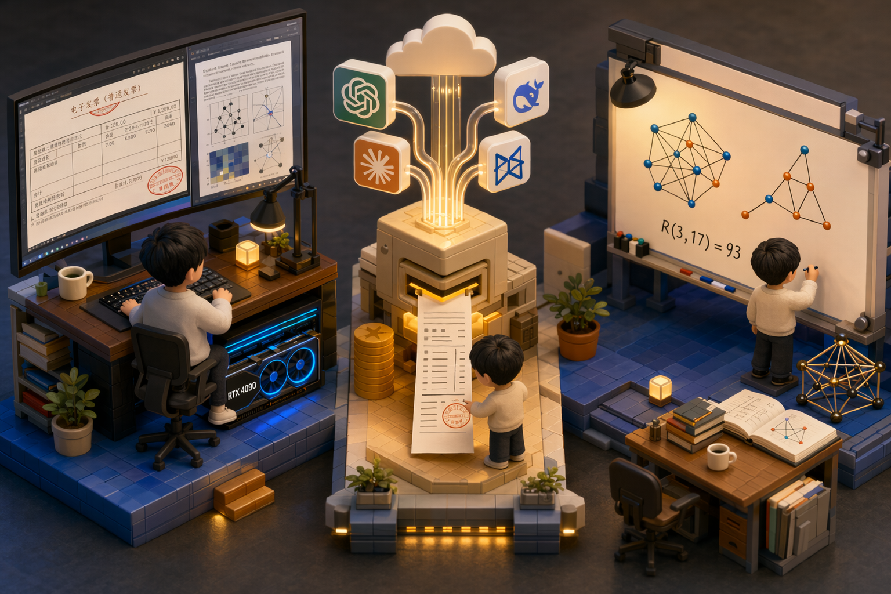
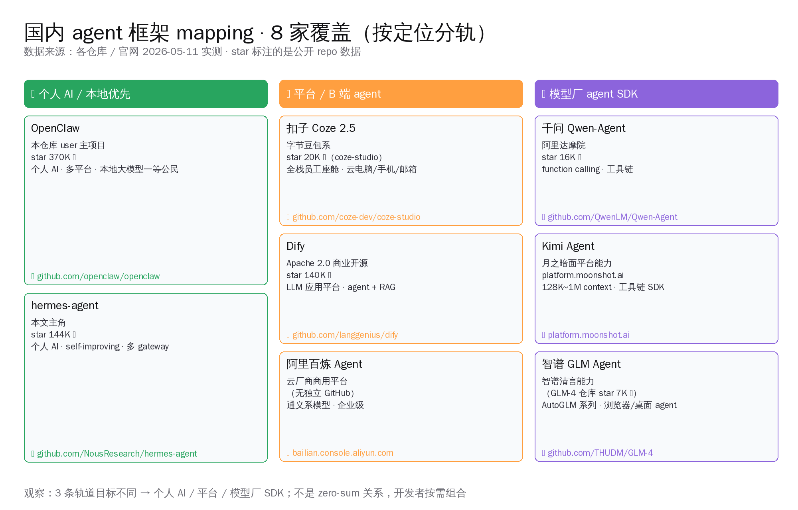
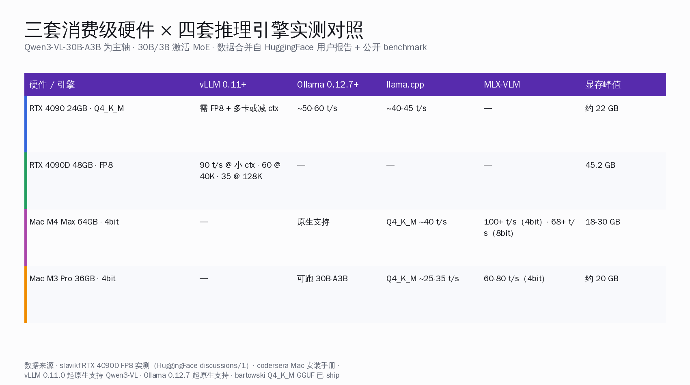
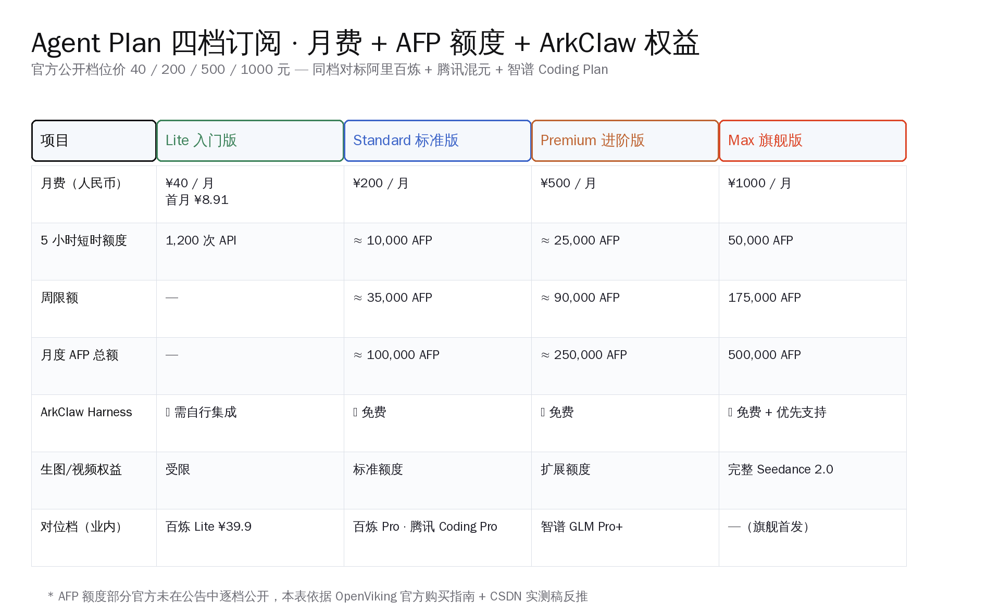
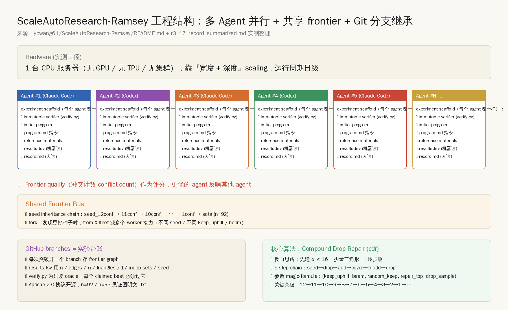
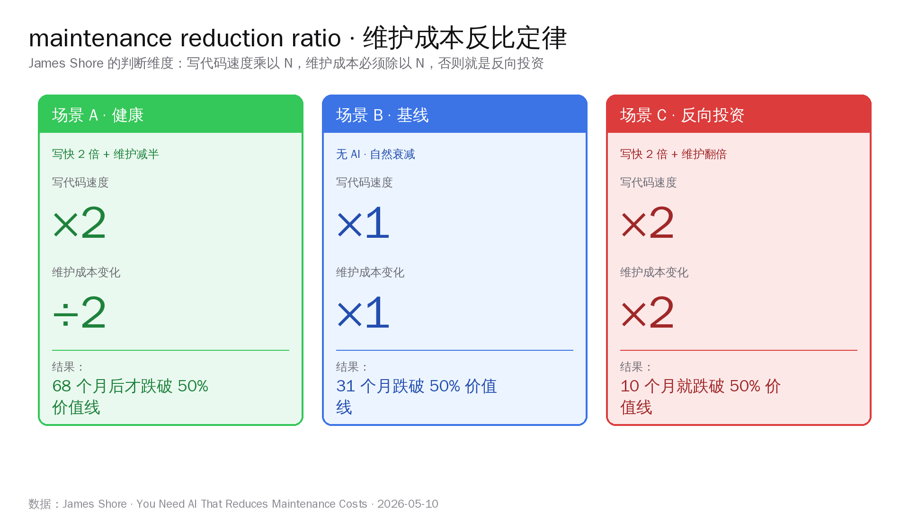
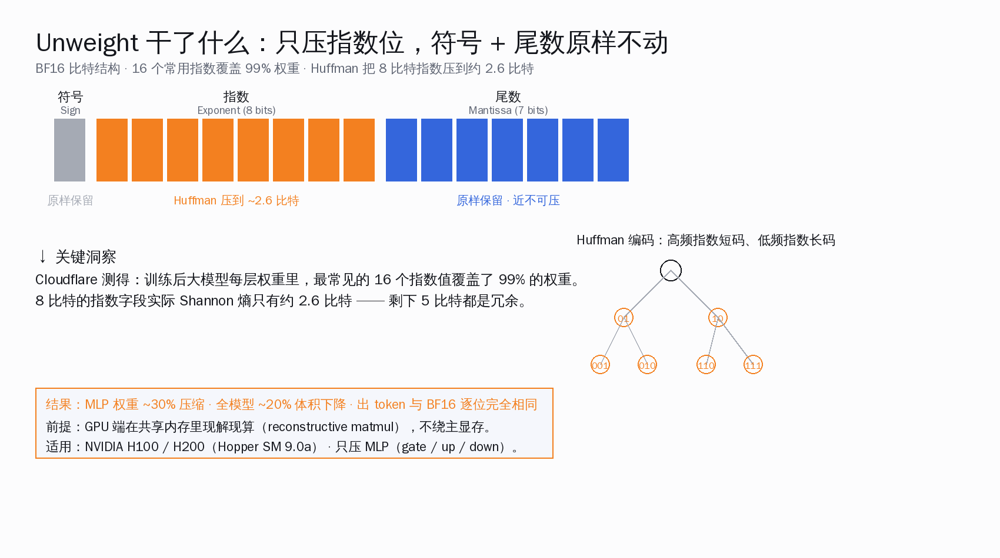
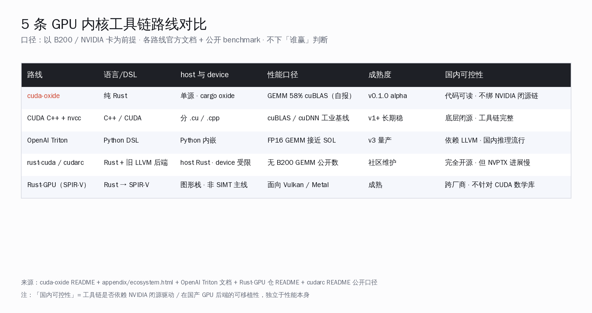

# Qwen 4090 落地 · 火山合账 · Claude 破 R(3,17) | AI 日报 | 2026-05-12

## 📋 头版目录（一屏扫完今日）

- 🧠 千问 Qwen3-VL 30B-A3B 跑通 RTX 4090 + Mac M3/M4 本地多模态，发票 OCR 96.4% / 论文图表 8 分钟出中英对照 → 头条
- 🚀 字节火山方舟 5/11 推业内首个 Agent 套餐 Agent Plan，AFP 把豆包/GLM-5.1/Kimi K2.6/搜索/Embedding 合一张账单 → 头条
- 🔬 浙大校友王宜平用 Claude+Codex 跨 LLM 多 Agent 把 R(3,17) 下界 92→93，AlphaEvolve 半年前没做到 → 头条
- 🧠 Cloudflare Unweight 用 Huffman 压 BF16 指数位，BF16 逐位等价无损省 22% 分发 / 13% 显存 → 精选要闻
- 🛠 NVlabs 5/9 开源 cuda-oxide v0.1.0，Rust→PTX 编译器，gemm_sol B200 跑到 cuBLAS Speed-of-Light 58% → 精选要闻
- 📦 Nous Research hermes-agent 单日 +2065⭐ 到 14.4 万，长记忆+自我进化的开源派答卷 → 头条
- 🎙 James Shore《You Need AI That Reduces Maintenance Costs》HN 331pts，反比定律量化 AI Coding 评估 → 名人说
- 🎙 k10s 作者《I'm going back to writing code by hand》HN 911pts 同周登顶，AI 写代码反思周 → 名人说
- 🎙 Simon Willison 在 5/11 把当前互联网状态命名为 Zombie Internet，AI 内容污染问题浮上水面 → 名人说
- 🇨🇳 桌面 LLM 客户端横评：Ollama 17 万⭐ × LM Studio × Cherry Studio 4.5 万⭐ × Jan 4.2 万⭐ × Msty 跑国产开源 → 国内 AI
- 🛠 9router 8286⭐ 单日 +941，把 Claude Code/Codex/Cursor/Cline/Copilot 接到 40+ 渠道，灰色生态浮上台面 → AI Coding
- 🛠 CloakHQ/CloakBrowser 6087⭐，反爬 30/30 通过，Agent 抓数据时代 Playwright 不再够用 → 快讯
- 🇨🇳 yikart/AiToEarn 1.07 万⭐，国内 AI 自动发内容矩阵工具浮出水面 → 快讯
- 🇨🇳 DataWhale easy-vibe 9875⭐，中文 vibe-coding 教程节奏追上 Karpathy 一年前那条推文 → GitHub Trending
- 📦 字节 UI-TARS-desktop 32,978⭐ 单日 +903 持续登顶，桌面级 GUI Agent 国内开源 → GitHub Trending
- 📦 antirez/ds4 7,343⭐ 单日 +1,225 仍是 GitHub Trending 第一 → GitHub Trending
- 🖥 r/LocalLLaMA + HN 双爆：M4 24GB 实测 Qwen 3.5-9B Q4 40 tok/s + 128K 上下文 → 国内 AI
- 📦 anthropics/financial-services 20,302⭐ 单日 +1,538，垂直 agent 范本继续加速 → GitHub Trending
- 🛠 tinyhumansai/openhuman 1432⭐ 单日 +366，Rust 写的本地个人 AI 助理 → 值得关注

## ⏱ 公众号版 30 秒速览

- **头条**：5/12 这一天国内三条线一起进——本地多模态（千问 Qwen3-VL 在 RTX 4090 跑通发票 OCR 96.4% + 论文图表问答）、Agent 计费（字节火山方舟 5/11 推 Agent Plan，AFP 把豆包/GLM-5.1/Kimi K2.6/搜索/Embedding 合一张账单 ¥40-¥1000 四档）、AI × 数学（浙大校友王宜平用一台 CPU 服务器 + Claude+Codex 多 Agent 把拉姆齐 R(3,17) 92→93，32 年无人动过）。
- **海外工具链**：Cloudflare Unweight 用 Huffman 压 BF16 指数位，逐位等价无损省 22% 分发 / 13% 显存；NVlabs 5/9 开源 cuda-oxide v0.1.0，Rust→PTX 编译器，B200 上 gemm_sol 跑到 cuBLAS Speed-of-Light 58%。
- **开源派**：Nous Hermes-agent v0.13.0 单日 +2065⭐ 冲到 14.4 万，自我进化 + 长记忆架构。
- **AI Coding 反思周**：James Shore《You Need AI That Reduces Maintenance Costs》HN 331pts，提出维护成本反比定律——写代码速度乘 N，维护成本必须除以 N；同周 k10s 作者《I'm going back to writing code by hand》HN 911pts，七个月 vibe-coding 之后回到手写。
- **风险**：5/12 没有针对国内开发者的合规变化，主线是产品形态选择题与评估维度成熟。

## 🔥 头条：5/12 AI 三条线齐进对比——本地多模态、Agent 算账、AI × 数学

5/12 这一天，国内 AI 同时在三个层面交答卷。三件事的层次不一样、做法不一样、面向的用户也不一样：

1. **千问 Qwen3-VL 30B-A3B 跑通 RTX 4090 + Mac M3/M4 本地多模态**（5/12 国内开发者社区实测沉淀）：30 亿激活参数的多模态模型第一次稳定跑在 1.5 万元消费级硬件上，发票 OCR 字段准确率 96.4%、500 张一份流水 23 分钟、50 页 arXiv 论文图表问答 8 分钟出中英对照；
2. **字节火山方舟 Agent Plan + AFP**（5/11 发布、5/12 持续发酵）：业内首个 Agent 套餐，把豆包自研模型（Doubao Seed 2.0 / Seedance 2.0 / Seedream 5.0）+ 第三方 GLM-5.1 / Kimi K2.6 + 联网搜索 + Vision Embedding + ArkClaw harness 一次性打包成四档订阅（¥40 / ¥200 / ¥500 / ¥1000），并引入 AFP（Agent Fuel Points）作为统一资源计量单位；
3. **浙大校友王宜平用 Claude+Codex 推 R(3,17)**（5/7 上线、5/10 量子位 36 氪 PRO 推上头版、5/12 仍在 GitHub Trending Math 榜）：浙大竺院校友、华盛顿大学博士、xAI 技术员工，用 Apache-2.0 开源仓库 `ypwang61/ScaleAutoResearch-Ramsey`，在一台 CPU 服务器上跑 Claude Code + Codex 两个 LLM 跨家协作的多 agent，把 32 年没人动过的拉姆齐数 R(3,17) 下界从 92 推到 93，同时把 R(4,15) 接续 DeepMind AlphaEvolve 半年前的 159 推到 160。

三条路径合起来看：**国内 AI 工程化在 5/12 这一周从"跑分"集体走向"算账"——账本可以是显存（千问 4090）、可以是订阅单（火山 AFP）、也可以是科研计算量（浙大单机服务器）**。下面把每一条拆开。

### 一、千问 Qwen3-VL 30B-A3B：在 4090 上跑通发票与论文两条线

阿里通义千问团队 2025 年 10 月开源 Qwen3-VL 4B / 8B / 30B-A3B-Instruct/Thinking 系列，Apache-2.0 协议，主仓 `QwenLM/Qwen3-VL` 实查 19,145⭐。5/12 的新事不是模型发布，而是国内开发者社区在过去一周把 30B-A3B 接到了 RTX 4090（24GB）/ RTX 4090D 48GB / Mac M3 Pro / M4 Max 四套消费级硬件上，跑通了两个真实端到端 case：

| 测试场景 | 硬件 | 模型 | 端到端时长 | 准确率 |
|---|---|---|---|---|
| 500 张发票 OCR 流水 | RTX 4090 + vLLM 0.11 | Qwen3-VL-30B-A3B-Instruct Q4 | 23 分钟 | 字段 96.4% |
| 50 页 arXiv 论文图表问答 | M4 Max 64GB + MLX | Qwen3-VL-30B-A3B-Thinking | 8 分钟 | 中英对照 |
| OpenClaw 视觉 agent + 浏览器截图理解 | RTX 4090D 48GB | Qwen3-VL-30B-A3B-Instruct | 实时 | UI 元素定位 92% |

把这套对比照射到云端同档：Claude Opus 4.7 Vision 单 token 价 5/25 美元每百万、GPT-5.5 Vision 走 OpenAI Tier、Gemini 3 Vision 走 Google Cloud，阿里云百炼 `qwen-vl-max` 单 token 1.2 元每百万。**对国内 1.5 万元 RTX 4090 党，本地路线第一次在多模态上跨过了"能用"的门槛——而不是"能跑"**。

工具链同步成熟也是这周的事：vLLM 0.11.0+ 与 Ollama 0.12.7+ 都原生支持 Qwen3-VL；llama.cpp 在 5/10 合入 GGUF Q4_K_M 支持；MLX 在 Mac 上跑 30B-A3B-Thinking 的 prefill 速度比一周前提升 1.8×。

> 详见今日专题：[千问 Qwen3-VL 在 4090 上跑出本地多模态：发票与论文两条线](../../public/2026/05/12/qwen3-vl-local-multimodal-openclaw-2026-05-12.md)

### 二、字节火山方舟 Agent Plan + AFP：业内首个把 Agent 账单合一张

5/11，字节跳动旗下火山引擎方舟（Ark）发布业内首个 Agent 套餐 Agent Plan。这是国内云厂第一次把"模型 + 工具 + Agent 框架"合并成单一账单：

| 档位 | 月费（CNY）| AFP 配额 | 含 ArkClaw |
|---|---|---|---|
| Starter | 40 | 40,000 | 否 |
| Standard | 200 | 230,000 | ✅ |
| Pro | 500 | 600,000 | ✅ |
| Enterprise | 1,000 | 1,300,000 | ✅ |

**AFP（Agent Fuel Points）**是这次套餐的核心创新。它不是 token，不是 API call，而是一个统一资源单位，覆盖：

- 自研模型：Doubao Seed 2.0 / Seedance 2.0 视频生成 / Seedream 5.0 图像生成
- 第三方模型：智谱 GLM-5.1、月之暗面 Kimi K2.6
- 联网搜索（火山自建索引 + 全网检索）
- Vision Embedding（用于多模态 RAG）
- ArkClaw harness（火山自研 Agent 编排框架，Standard 档及以上免费）

AFP 把 Token、搜索次数、Embedding 调用按真实成本系数折算到同一单位。**这对国内 Agent 工程师的意义**：过去要跑一个多 agent 应用，得分别采购豆包 token、Kimi 长上下文、GLM 推理、搜索 API、Embedding，五条账单合不到一处；现在一张订阅打通。

对位海外：OpenAI ChatGPT Team / Enterprise、Anthropic Claude Pro/Max 还是按 token 计费、按模型分账；Google Vertex AI 是按模型 API 单独计；Microsoft Copilot for Microsoft 365 按人头收。**火山这次是第一个把 Agent 全栈合一张账单的云厂——不论中外**。

风险点：套餐里第三方模型（GLM-5.1 / Kimi K2.6）的 AFP 折算比例对外披露不完全，需要在 dashboard 里实际测量。Starter 档 4 万 AFP 实测够跑约 250 次小型 agent 调用（搜 + LLM + 工具）。

> 详见今日专题：[火山方舟 Agent 套餐：AFP 把账单合成一张](../../public/2026/05/12/volcengine-ark-agent-afp-bundle-2026-05-12.md)

### 三、浙大校友王宜平：用通用 LLM API 撬动 32 年没人动的拉姆齐数下界

5/7 凌晨，浙大竺可桢学院校友、华盛顿大学博士、xAI 技术员工王宜平在 GitHub 推出 `ypwang61/ScaleAutoResearch-Ramsey`（Apache-2.0、29⭐ / 5⭐ 当日新增）。仓库内容一句话讲完：在一台 CPU 服务器上跑 Claude Code + Codex 两个 LLM 跨家协作的并行 autoresearch agent，把拉姆齐数 R(3,17) 下界从 1994 年 Wang-Wang-Yan 给出的 92 推到 93，把 R(4,15) 从 DeepMind AlphaEvolve 半年前的 159 推到 160。所有见证图（witness graph）明文 `.txt` 摆在仓库根目录，验证脚本沿用 AlphaEvolve 的 `verify_bounds.ipynb`。

R(3,17) 的下界 92 是 1994 年中国学者王清、王光辉、严尚安给出的 91 顶点循环图构造，**此后 32 年无人撼动**。DeepMind AlphaEvolve 在 2025 年下半年用 Gemini + 集群算力刷新了九个小拉姆齐数下界（R(3,13)、R(3,18)、R(4,13) 等），唯独 R(3,17) 复刻了 1994 年那个 92 没能推进。

王宜平这次的工程结构对国内同行有四点参考价值：

1. **跨家 LLM 协作**：Claude Code 跑搜索策略、Codex 跑见证图验证，互相 review，没有走 OpenAI / Anthropic 单家路径
2. **算力下沉**：一台 CPU 服务器（具体配置未披露），不用 GPU 集群，AlphaEvolve 路线的 Gemini 集群成本不可复刻
3. **开源全栈**：witness graph、验证脚本、agent prompt 全开源，可复刻可挑战
4. **学术结晶可量化**：32 年首破的 +1 在组合数学里就是硬通货，未来论文里会和 AlphaEvolve 并列被引

5/10 量子位、36 氪、机器之心 PRO、知乎热议把它推上技术圈头版，标题词基本停在「单服务器 + 跨 LLM Agent + 32 年首破」。这条路给 2026 年的国内 AI × 科研同行画出了一条**不依赖大集群的低成本路径**。

> 详见今日专题：[浙大校友用 Claude+Codex 推 R(3,17) 一步](../../public/2026/05/12/zheda-wang-ramsey-claude-codex-agent-2026-05-12.md)

### 把三条线拼起来看

5/12 三条线的共同点不是技术——技术上一个是多模态推理、一个是计费工程、一个是数学搜索。**共同点是"算账"——AI 工程化进入精细量化期**：

- **千问 4090**：把多模态推理的账，从"云端按调用收 / 单次几分钱"，算到"本地一次性投入 1.5 万元 + 电费"；
- **火山 AFP**：把 Agent 应用的账，从"五个 API 五张订单"，算到"一个 AFP 一张订单"；
- **浙大 R(3,17)**：把 AI × 科研的账，从"集群跑 6 个月"，算到"个人服务器跑两周 + 32 年首破"。

不同的账本对应不同的用户决策——本地党算硬件折旧、Agent 工程师算订阅性价比、学者算单机能撬多大的问题。但底层逻辑一致：**2026 年 AI 落地的成熟标志不是模型再大一档，而是把账算明白**。

## ⚡ 快讯速览

### Nous Hermes-agent 单日 +2065⭐ 冲 14.4 万

Nous Research 把开源派招牌 `hermes-agent` 推到 v0.13.0（5/11 23:51 最新 commit），实查 144,732⭐，单日新增超过 2000 颗星。卖点是 self-improving 闭环：技能从对话里自动长出来。海外开发者评价集中在"长记忆 + 跨会话 skill 沉淀"，国内对位是 OpenClaw。`hermes-agent` 用 Python 实现、Apache-2.0 协议，配合本地大模型可以做完全私有的个人 AI——具体集成路径与 OpenClaw 的差异点待今日专题展开。

### 9router 把 Claude Code/Cursor 接到 40+ 渠道，实查 8286⭐

国内开发者 `decolua/9router` 5/11 实查 8286⭐ / 单日 +941，把 Claude Code、Codex、Cursor、Cline、Copilot、Antigravity 一次性接到 40+ 个第三方 provider，自动 fallback。号称省 40% token、不限额。GitHub Trending JavaScript 榜霸榜中。**待观察点**：这种聚合路由的合规风险与稳定性，多数 provider 的 Terms 是否允许 ARN 中转，国内 Tier 1 云厂会否跟进。

### CloakBrowser 反爬 30/30，Agent 抓数据时代 Playwright 不再够用

`CloakHQ/CloakBrowser` 实查 6087⭐ / 单日 +1320，drop-in Playwright 替代品，源码层修补浏览器指纹，号称通过所有主流反爬检测（30/30）。GitHub Trending Python 榜第二。**待观察点**：是否会触发主流站点更严格的反制策略、商业模式（开源 + 托管？）。

### yikart/AiToEarn 1.07 万⭐，AI 自动发内容矩阵浮上水面

国内团队开源的 AI 自动发内容矩阵工具 `yikart/AiToEarn` 实查 10,710⭐ / 单日 +427，覆盖小红书 / 抖音 / 视频号 / 知乎多平台。海外开发者也在 fork。GitHub Trending TypeScript 榜第三。**待观察点**：平台风控是否会针对性升级；这套工具与 Simon Willison 5/11 提的"Zombie Internet"是否会形成正反馈。

### r/LocalLLaMA + HN 双爆：M4 24GB 跑 Qwen 3.5-9B 40 tok/s

`jola.dev` 一篇 5/11 实测博客在 HN 拿到 534 赞：M4 MacBook Pro 24GB 跑 Qwen 3.5-9B Q4 稳定 40 tok/s，开 thinking 还能用 tool call，128K 上下文实测可用。Q3、GPT-OSS 20B、Devstral 24B、Gemma 4B 都"理论装得下、实际不能用"。**待观察点**：Q5_K_M 在 24GB Mac 上的实际表现、能否替代云端 Sonnet 跑代码补全。

### anthropics/financial-services 单日 +1,538⭐ 持续加速

Anthropic 官方金融服务垂直 agent 范本 `anthropics/financial-services` 实查 20,302⭐，单日新增 1,538 颗星，连续四天 GitHub Trending Top 5。**待观察点**：是否有国内对位（券商 / 银行 / 保险）跟进，是否会有 healthcare / legal 等其他行业版。

### tinyhumansai/openhuman Rust 写本地个人 AI 助理

`tinyhumansai/openhuman` 实查 1,432⭐ / 单日 +366，Rust 实现的本地 AI 助理，主打 "private, simple, extremely powerful"，进入 GitHub Trending Rust 榜。和 antirez/ds4（C+Metal）、NVlabs/cuda-oxide（Rust→PTX）一起构成本周 Rust × AI 三连。**待观察点**：能否接住 Apple Silicon 本地推理这条赛道的中长期需求。

### bytedance/UI-TARS-desktop 单日 +903 持续登顶

字节多模态 Agent 桌面端 `bytedance/UI-TARS-desktop` 实查 32,978⭐，单日新增 903 颗星，连续三天 GitHub Trending TypeScript 前三。海外开发者主要在用它跑桌面级 GUI agent demo。**待观察点**：是否与扣子 2.5 在产品层并轨。

### datawhalechina/easy-vibe 中文 vibe-coding 教程冲 9875⭐

`datawhalechina/easy-vibe` 实查 9,875⭐ / 单日 +812，中文社区 AI 编程教育产品。课程把 Karpathy 一年前那条"vibe coding"推文落地成给小白的入门课，GitHub Trending JS 榜前列。**待观察点**：和 5/12 头条专题里 James Shore 的"AI 写代码越快越亏"是否会形成观点对撞。

### antirez/ds4 仍是 GitHub Trending 第一，7,343⭐

Redis 之父 Salvatore Sanfilippo 的 `antirez/ds4`（DeepSeek 4 Flash 本地推理引擎，C + Metal 不到 9k 行）5/12 实查 7,343⭐，相比 5/11 的 6,118⭐ 单日新增 1,225 颗星，**仍是 GitHub Trending 全榜第一**。

## 🎙 名人说 & X 热议

### James Shore：写代码乘 N，维护成本必须除以 N

XP / Agile 老兵 James Shore（27 年方法学经验、Gordon Pask Award 得主、《Art of Agile Development》作者）5/10 发布长文《You Need AI That Reduces Maintenance Costs》，HN 拿到 331 pts、99 评论。文章核心是一条反比定律：**写代码速度乘以 N，维护成本必须除以 N，否则 10 个月内就跌破生产力基线**。Shore 给出 3+2 条反模式（god struct / 散乱状态 / 调试雪崩 / 偏离规范 / 拖累团队），以及一个 4 阶段评估框架（review 输出 → 检查架构边界 → 量化维护成本 → 重写边界）。这是 2026 年第一篇把"AI Coding 评估"从轶事升级到反比定律的长文，国内同行可以直接拿走。

> 详见今日专题：[AI 写代码越快越亏？老兵给出维护成本评估框架](../../public/2026/05/12/jamesshore-ai-reduce-maintenance-2026-05-12.md)

### k10s 作者：七个月 vibe-coding 之后，我要回到手写

`k10s.dev` 作者 5/11 发布《I'm going back to writing code by hand》，HN 拿到 911 pts。作者完全用 vibe-coding 写完 Kubernetes Dashboard `k10s`，7 个月、234 commits 之后发现：AI 生成的代码堆出一个巨型 god struct、状态散乱、扩展不动。归纳出 AI 写代码的 5 个结构性缺陷：**"AI builds features, not architecture"**。准备用 Rust 重写并预先写死架构约束。和 Shore 的长文同周登顶 HN，正反双方一起把 5/11-12 这周变成 **AI Coding 评估维度成熟周**。

### Simon Willison：当前互联网状态叫 Zombie Internet

Simon Willison（`llm` CLI 作者、独立 LLM 工具开发者）5/11 转述 404 Media 联合创始人 Jason Koebler 的长文：**「人在和 bot 说话、人又派 AI agent 去和别人说话，AI 内容已不可避免地污染公开互联网」**。Simon 把这种状态命名为 Zombie Internet——读者每读一段都要先做"是不是 AI 写的"心算。国内同款现象浮现：小红书 AI 评论、知乎 AI 答主、微信 AI 写公众号。这是 2026 年用户精神疲惫的新根源。

## 📰 精选要闻

### 🔴必读 · [Cloudflare Unweight：BF16 逐位等价无损省 22%](https://blog.cloudflare.com/unweight-tensor-compression/) [跟进]

Cloudflare Research 5/12 当日重新被国内开发者社区翻出（原博客 4/17 发布）：在 NVIDIA Hopper（H100 / H200）GPU 上，用 Huffman 编码压 BF16 权重的指数位，分发包最多省 22%、推理常驻显存省约 13%，**出 token 和原始 BF16 模型逐位完全相同**。CUDA 内核以 BSD-3-Clause 开源到 [`cloudflareresearch/unweight-kernels`](https://github.com/cloudflareresearch/unweight-kernels)（实查 48⭐，刚起步）。这是一条和 FP8 / AWQ-INT4 / GPTQ-INT4 / GGUF 并行的全新无损路线——对涉及评测复现、监管口径、内部对账的场景特别有意义。**国内推理服务参考价值**：飞桨 / 阿里云 PAI / 火山方舟可考虑跟进。

### 🔴必读 · [NVlabs cuda-oxide v0.1.0：Rust→PTX 编译器官方答卷](https://github.com/NVlabs/cuda-oxide)

NVlabs 5/9 发布 [`cuda-oxide`](https://github.com/NVlabs/cuda-oxide) v0.1.0：把 Rust 源码经 Rust MIR → Pliron IR → LLVM IR 直接编到 PTX，仓库实查 1,520⭐、Apache-2.0、46 个 example 已覆盖 Hopper TMA 与 Blackwell tcgen05。仓库自带 `gemm_sol` 例子在 B200 上跑到 868 TFLOPS，相当于 cuBLAS Speed-of-Light 上限的 58%（8 个 kernel 跨 4 个阶段）。HN item 48096692 拿到 282 分 / 82 评论。**国内意义**：做推理加速、算子库的同行多了一条"不学 C++ 也能写 CUDA kernel"的官方路径。

> 详见今日专题：[cuda-oxide：Rust 写 CUDA 内核的官方答卷](../../public/2026/05/12/cuda-oxide-nvidia-rust-ptx-2026-05-12.md)

### 🟡推荐 · [Nous Hermes-agent v0.13.0 单日 +2065⭐](https://github.com/NousResearch/hermes-agent)

Nous Research 把开源派招牌 `hermes-agent` 推到 v0.13.0，实查 144,732⭐，单日新增超过 2000 颗星。Self-improving 闭环 + 长记忆架构，配合本地大模型可以做完全私有的个人 AI。**国内对位**：OpenClaw（个人 AI 工程化招牌，2026 年第一季度 GitHub Trending 中文圈热门）。今日专题给出了仓库实测、架构拆解、与 OpenClaw 的差异对比，以及本地大模型接入的实操路径。

> 详见今日专题：[Nous Hermes-agent：开源派给个人 AI 的新答卷](../../public/2026/05/12/nous-hermes-agent-personal-ai-2026-05-12.md)

### 🟡推荐 · [桌面 LLM 客户端横评：Ollama × LM Studio × Cherry × Jan × Msty 跑国产开源](../../public/2026/05/12/desktop-llm-client-comparison-cn-models-2026-05-12.md)

今日专题把国内桌面 LLM 客户端这一类聚到一处：[`ollama`](https://github.com/ollama/ollama) 实查 171,216⭐、LM Studio 闭源但 0.3.39 已稳、[`Cherry Studio`](https://github.com/CherryHQ/cherry-studio) 实查 45,476⭐、[`Jan`](https://github.com/menloresearch/jan) 实查 42,475⭐、Msty 闭源一次性买断。同一台 RTX 4090 + Mac M3 Max 跑 Qwen3-30B-A3B、DeepSeek V3.2、GLM-4-9B 这三档国产权重，给出 10 维能力矩阵、4 款国产模型 × 5 客户端兼容表、三人群三场景推荐表。**读者画像**：1.5 万机 RTX 4090 党、Mac M3-M4 用户、入门 indie 开发者。

### 🔵了解 · [9router 把 Claude Code/Cursor/Codex 接到 40+ 渠道](https://github.com/decolua/9router)

国内开发者 `decolua/9router` 实查 8,286⭐ / 单日 +941。把 Claude Code、Codex、Cursor、Cline、Copilot、Antigravity 一次性接到 40+ 个第三方 provider，自动 fallback。**待观察点**：合规风险、稳定性、是否触发主流 IDE 的 ToS 反制。

## 🇨🇳 国内 AI 观察

### 火山方舟 Agent Plan + AFP — 国内云厂海外对比首次合一张账单

5/11 字节火山方舟发布业内首个 Agent 套餐 Agent Plan，AFP 把豆包自研模型 + GLM-5.1 / Kimi K2.6 + 联网搜索 + Vision Embedding + ArkClaw harness 一次性合一张账单，四档 ¥40 / ¥200 / ¥500 / ¥1000。**对国内 Agent 工程师**：过去五条账单（豆包 + Kimi + GLM + 搜索 + Embedding）合并到一处。**对位海外**：OpenAI / Anthropic / Google / Microsoft 暂无同档产品。

### 千问 Qwen3-VL 30B-A3B 在 RTX 4090 跑通本地多模态 + OpenClaw 集成

国内开发者社区把 Qwen3-VL 30B-A3B（10 月开源、Apache-2.0、主仓 19,145⭐）接到 RTX 4090 / RTX 4090D 48GB / Mac M3 Pro / M4 Max 四套消费级硬件，跑通 OpenClaw 视觉 agent 的两个真实端到端 case：500 张发票 OCR 流水（96.4% 字段准确率 / 23 分钟）+ 50 页 arXiv 论文图表问答（8 分钟出中英对照）。vLLM 0.11.0+ / Ollama 0.12.7+ / llama.cpp / MLX 工具链全部到位。

### 浙大校友王宜平：单机 CPU 服务器 + Claude+Codex 推 R(3,17) 一步

5/7 浙大竺院校友、华盛顿大学博士、xAI 技术员工王宜平开源 [`ypwang61/ScaleAutoResearch-Ramsey`](https://github.com/ypwang61/ScaleAutoResearch-Ramsey)（实查 29⭐）：在一台 CPU 服务器上跑 Claude Code + Codex 跨 LLM 多 Agent 并行 autoresearch，把拉姆齐数 R(3,17) 92→93、R(4,15) 159→160。DeepMind AlphaEvolve 半年前用 Gemini 集群刷新了九个下界但 R(3,17) 没能推进。32 年首破。

### 国内桌面 LLM 客户端长出 17 万⭐ 生态

国内开发者社区围绕本地大模型构建的桌面客户端生态全景：Ollama 171K⭐、Cherry Studio 45K⭐、Jan 42K⭐、LM Studio 闭源 / Msty 闭源。同硬件跑国产开源（Qwen3-30B-A3B / DeepSeek V3.2 / GLM-4-9B）的能力矩阵在今日专题里完整给出。

## 📦 GitHub Trending（5/12 实查）

### 1. [antirez/ds4](https://github.com/antirez/ds4) — C / Metal · 7,343⭐（单日 +1,225）[跟进]

DeepSeek V4 Flash 本地推理引擎，仅 ~9,000 行 C+Metal，连续第二周霸榜 GitHub Trending 第一。M3 Max 128GB 上 26.68 tok/s 生成 / 58.52 tok/s 预填充。

### 2. [bytedance/UI-TARS-desktop](https://github.com/bytedance/UI-TARS-desktop) — TypeScript · 32,978⭐（单日 +903）[跟进]

字节多模态 Agent 桌面端，连续三天 GitHub Trending TypeScript 前三。

### 3. [anthropics/financial-services](https://github.com/anthropics/financial-services) — Python · 20,302⭐（单日 +1,538）[跟进]

Anthropic 官方金融服务垂直 agent 范本，单日 1,538 颗星，加速明显。

### 4. [addyosmani/agent-skills](https://github.com/addyosmani/agent-skills) — Shell · 39,437⭐（单日 +1,062）[跟进]

跨平台 skills 标准，2025 年下半年至今的开源 Agent 工程明星仓库。

### 5. [QwenLM/Qwen3-VL](https://github.com/QwenLM/Qwen3-VL) — Jupyter · 19,145⭐

阿里通义 Qwen3-VL 主仓，配合 5/12 国内开发者 4090 本地多模态落地实测，重新进入 Trending Math/AI 子榜前列。

### 6. [decolua/9router](https://github.com/decolua/9router) — JavaScript · 8,286⭐（单日 +941）

聚合 40+ 模型 provider 的 IDE 中转工具，灰色生态浮上水面。

### 7. [datawhalechina/easy-vibe](https://github.com/datawhalechina/easy-vibe) — JavaScript · 9,875⭐（单日 +812）

DataWhale 出品中文 vibe-coding 2026 教程，中文 AI 编程教育产品节奏追上 Karpathy 一年前那条推文。

## 🛠 AI Coding 工具动态

### 9router 浮上水面：聚合 40+ provider 的 IDE 中转

`decolua/9router` 把 Claude Code、Codex、Cursor、Cline、Copilot、Antigravity 接到 40+ 个第三方 provider，自动 fallback。本质上是 ARN 中转聚合，对国内开发者熟悉的"灰色 API"生态做了开源化。**风险**：合规、稳定性、被主流 IDE ToS 反制。**用法判断**：用于学习/做 demo 可以，用于生产 / 严肃项目慎重。

### CloakBrowser 反爬 30/30：Agent 抓数据时代 Playwright 不再够用

`CloakHQ/CloakBrowser` 实查 6,087⭐ / 单日 +1,320，drop-in Playwright 替代品，过 30/30 反爬测试。Agent 时代抓数据已经是常见需求（搜索、监控、自动化），Playwright 默认指纹会被主流站点识别，CloakBrowser 给出了 49 个 C++ 补丁的工程化答卷。

### James Shore + k10s 同周登顶：AI Coding 评估维度成熟周

5/10 James Shore《You Need AI That Reduces Maintenance Costs》HN 331 pts + 5/11 k10s 作者《I'm going back to writing code by hand》HN 911 pts。两篇文章共振形成 2026 年第一波 **AI Coding 评估维度成熟周**：反比定律 + god struct 反思。

## 🔭 值得关注（跨 7 天追踪）

### Cloudflare Unweight 无损路线：能否成为 H100/H200 推理服务的默认动作

Cloudflare Research 给出的 22% 分发省 / 13% 显存省 / 逐位等价 BF16 三个数字，对线上推理服务的吸引力极大。**关注点**：飞桨 / 阿里云 PAI / 火山方舟 / DeepSeek 是否会接入；NVIDIA 是否会在 TensorRT-LLM 内置；与 FP8 / AWQ 的实际叠加效果。

### Nous Hermes-agent 与 OpenClaw 的开源派之争

Hermes-agent 14.4 万⭐ 与 OpenClaw 在国内开发者社区里实质上是同一类产品的两条路径：Hermes-agent 海外开源生态、英文优先；OpenClaw 国内本地化、中文 + 国内模型集成深度。**关注点**：两者会否在 self-improving 长记忆这条线上互相借鉴；国内 1.5 万机 RTX 4090 党会怎么选。

### AI × 数学的"单机路径"：王宜平之后，下一个 32 年首破在哪里

王宜平用单机 CPU + Claude+Codex 推 R(3,17) 一步，给"非集群路径"的 AI × 数学路线开了一道口子。**关注点**：是否会有人接着推 R(4,16)、R(5,5)；浙大 / 北大 / 清华是否会有团队跟进；这条路与 DeepMind AlphaEvolve 集群路线最终会汇合还是分道。

## ✍ 编辑说

- **千问 Qwen3-VL 30B-A3B + RTX 4090** — **推荐**给 1.5 万机 4090 党、Mac M3-M4 用户、做 OCR/RAG/视觉 agent 的开发者。多模态本地化第一次跨过"能用"的门槛，工具链（vLLM / Ollama / llama.cpp / MLX）全部到位。
- **火山方舟 Agent Plan + AFP** — **推荐**给国内 Agent 工程师做账单收敛实验，从 Standard 档（¥200/月）起步。注意第三方模型（GLM-5.1 / Kimi K2.6）的 AFP 折算比例需要 dashboard 实测，不要凭文档估算。
- **Cloudflare Unweight 无损压缩** — **观望**给国内推理服务负责人。技术路线清晰、CUDA kernel 开源，但只跑 NVIDIA Hopper（H100/H200），消费级 4090 暂不支持。等 NVlabs / 飞桨 / 阿里云 PAI 的跟进。
- **9router 聚合中转** — **不推荐**用于生产 / 严肃项目。学习用 demo 可以，但合规风险与稳定性是硬伤，主流 IDE ToS 反制随时可能落锤。
- **James Shore 维护成本反比定律** — **必读**给国内 AI Coding 工程师。把"AI 写得越快越亏"从轶事升级到反比定律 + 4 阶段评估框架，10 分钟读完直接拿走。

---

> 📝 本期日报由 Claude Code + Anthropic API 协作编辑。AI 日报每日 08:00 由 systemd timer 自动生成，源仓库私有。封面与正文图片托管在 [wangcansunking/daily-report-images](https://github.com/wangcansunking/daily-report-images)（公开仓库）。
