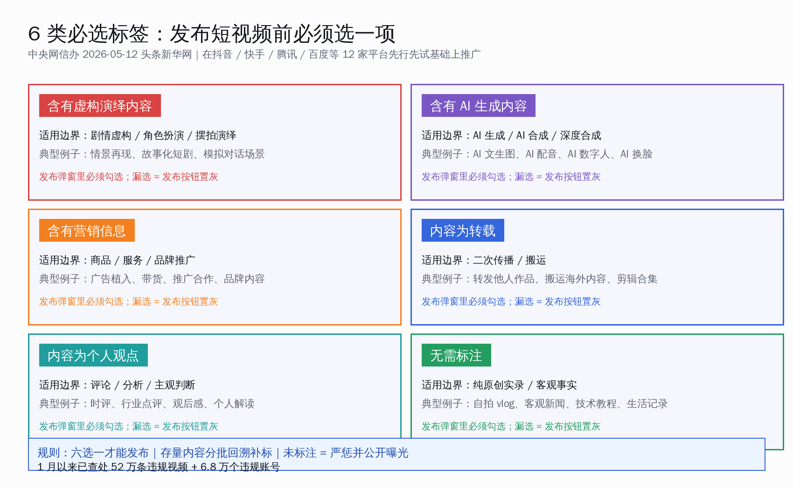
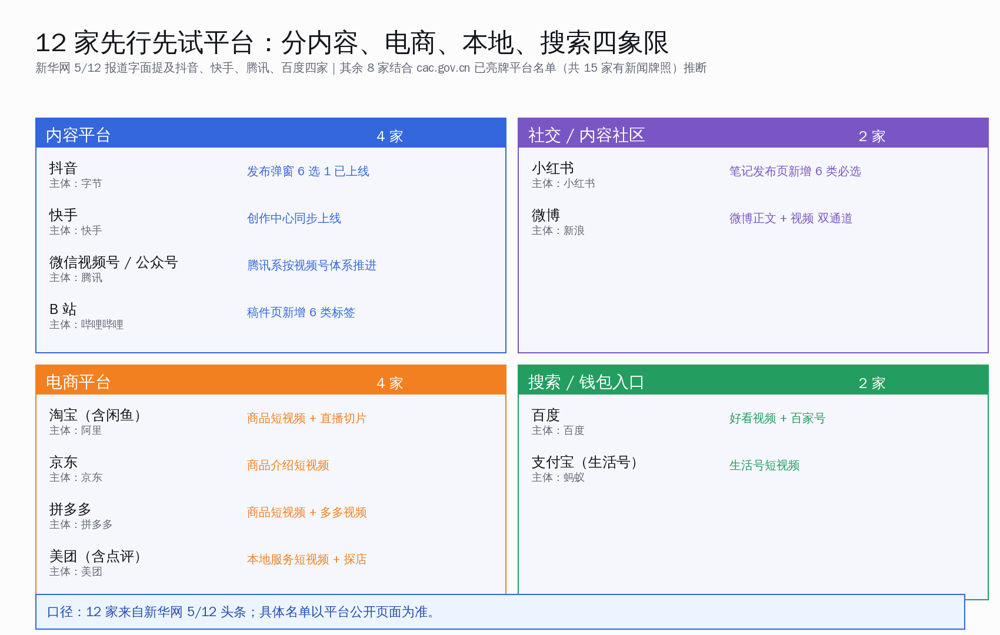
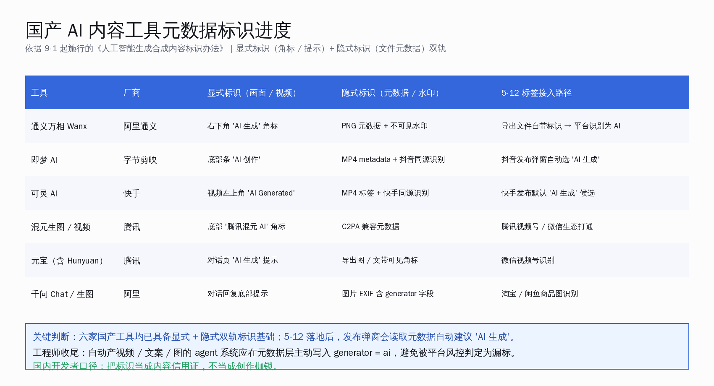
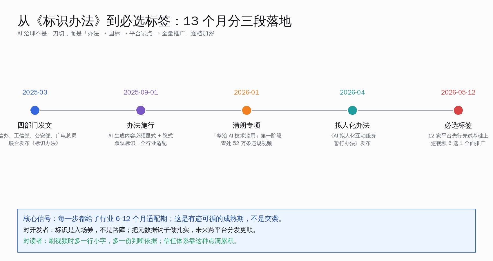
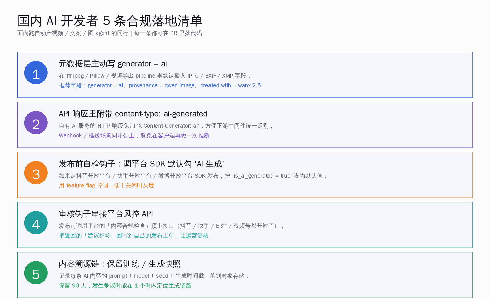
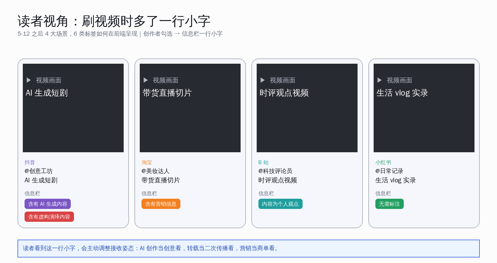

# 网信办 6 类必选标签：抖音快手 12 家同步上线

> 5 月 12 日，中央网信办的署名稿件登上新华网头条。明确事项有三件：发布短视频前，发布者必须在「含有虚构演绎内容 / 含有 AI 生成内容 / 含有营销信息 / 内容为转载 / 内容为个人观点 / 无需标注」6 类标签中选一项才能发；这套规则先在抖音、快手、腾讯、百度等 12 家平台试点跑通；存量短视频会分批回溯补标，未标注的账号严惩并公开曝光。这是 2025 年 9 月 1 日《人工智能生成合成内容标识办法》施行之后，落到产品层、覆盖到普通创作者的第一个全国动作。


刷开抖音准备发条小剧情，会发现发布弹窗多了一行。原本只让你勾「同城 / 不可见」的位置，现在多了 6 个橙色小标签，写着「含有虚构演绎内容」「含有 AI 生成内容」「含有营销信息」「内容为转载」「内容为个人观点」「无需标注」——必须选一个，否则发布按钮置灰。这一刻不是临时灰度，是从 5 月 12 日起，国内 12 家主流平台同步落地的新规。

新华网当天头条原话写得很清楚：「将内容标注设为短视频发布必经环节」「对存量短视频进行分批回溯，对未标注或未正确标注的，进行补标或纠正」「对未按要求标注的账号和责任落实不力的平台，依法严惩并公开曝光」。AIBase、新浪科技、新浪财经、网易当天跟进首发稿；中央网信办官网继续更新「清朗·整治 AI 技术滥用」第二阶段工作通报，1 月以来已查处 52 万条违规视频与 6.8 万个违规账号——这是底数。

本文围绕一个核心论点展开：**AI 生成内容第一次进入「必标」阶段，目标不是限制创作，而是让创作者和读者都有迹可循**。围绕这个核心，正文回答五件事：

- 6 类标签官方原话怎么写、各自适用边界在哪儿；
- 12 家平台是哪 12 家、按内容 / 社交 / 电商 / 搜索四象限怎么分；
- 国产 AI 内容工具（通义万相、即梦、可灵、混元、元宝、千问）已经在元数据层做了什么准备；
- 从 2025-03 四部门发文，到 9-1 办法施行，再到 2026-05-12 必选标签上线，13 个月分了几段；
- 国内 AI 开发者自动产视频 / 文案 / 图的 agent pipeline，要落 5 条具体合规钩子。

## 一、6 类标签的官方原话与适用边界



**核心判断**：6 类标签覆盖的不是「内容好不好」，而是「内容的身份是什么」。判断维度只有一个——读者刷到这条视频时，需不需要一个额外的解释框架。

新华网原文逐字列出的 6 个标签是：「含有虚构演绎内容」「含有 AI 生成内容」「含有营销信息」「内容为转载」「内容为个人观点」「无需标注」。发布者从这 6 项里**择一确认**才能完成发布。下面把每一类的适用边界与典型例子摆清楚：

- **含有虚构演绎内容**：剧情虚构、角色扮演、情景再现、摆拍演绎都算。常见案例是「街头采访」其实是剧本演绎、夫妻吵架小剧场、医生讲诊摆拍。判断口径——只要画面里有人按脚本表演，就该选这一项。
- **含有 AI 生成内容**：AI 文生图、AI 配音、AI 数字人、AI 换脸、AI 自动剪辑生成的镜头都在范围内。判断口径——视频里只要有一秒画面、声音或人物是 AI 合成出来的，就该勾选。
- **含有营销信息**：广告植入、品牌带货、推广合作、商单内容。判断口径——只要这条视频拿了品牌方的钱或换了实物，就该选。日常自发安利不要紧。
- **内容为转载**：搬运他人作品、剪辑合集、引用海外片段二次传播。判断口径——视频主体不是自己原创拍摄的，就归这类。
- **内容为个人观点**：时评、行业点评、读后感、个人解读。判断口径——表达的是主观判断而不是客观事实，就该选。
- **无需标注**：纯原创实录、客观事实记录、技术教程、生活 vlog。判断口径——前 5 类都不沾边，才能选这一项。

值得注意的是，这 6 类**不是互斥**——一条 AI 生成的带货短剧，既有「AI 生成内容」又有「营销信息」又有「虚构演绎」，这种叠加场景下规则要求按主要属性勾选，平台允许多选的情况下应尽量都勾。新华网原文里用的是「必选标签」「必经环节」两个词，平台落到产品层的处理是发布弹窗里 6 个橙色 chip，未选则发布按钮置灰。

整体看，6 类标签**不是一刀切的内容审查**，而是给读者一个「这条内容是什么身份」的明示。读者刷到时，知道这是一段 AI 合成的画面、知道这是一条带货视频、知道这是一段虚构演绎，会自行调整接收姿态。对创作者而言，标签其实是一种内容信用证——勾对了，读者反而更愿意看完；勾错或不勾，平台风控扣权重，长期看反而吃亏。

## 二、12 家平台四象限：内容、社交、电商、搜索全覆盖



**核心判断**：12 家平台不是随便挑的——内容、社交、电商、本地服务、搜索五条主赛道每条都覆盖了头部，等于在国内短视频生态里全网铺开。

新华网 5/12 头条字面提到的是「抖音、快手、腾讯、百度等 12 家主流平台」。结合中央网信办 2025 年公开亮牌的 15 家持牌新闻信息服务平台名单和 AIBase 当天报道里的扩展信息，本文整理的 12 家是这套：

- **内容平台 4 家**：抖音（字节）、快手（快手集团）、微信视频号 / 公众号（腾讯）、B 站（哔哩哔哩）。这一档是短视频与中长内容的主战场，每天产出的 UGC 量级最大，标签首先在这里跑通。
- **社交 / 内容社区 2 家**：小红书、微博。小红书的笔记发布页和微博的视频通道分别落地。
- **电商平台 4 家**：淘宝（含闲鱼）、京东、拼多多、美团（含点评）。商品短视频、直播切片、探店视频都纳入范围；其中最值得国内开发者注意的是商品介绍短视频——AI 自动生成的商品图、AI 配音的卖点讲解视频，都要主动勾「AI 生成」。
- **搜索 / 钱包入口 2 家**：百度（含好看视频、百家号）、支付宝（生活号）。这一档是国内大流量入口，标签落到这里意味着创作者中心也跟着调整。

12 家平台的共同点是**用户基数都过亿、内容承载都横跨短视频与图文**。新华网原话里写「先行先试」，意味着这套机制是先在这 12 家平台跑流程、跑技术、跑用户教育，跑顺了之后再向其他平台推广。

各平台具体的落地路径，公开口径上能看到的有几条：

- **抖音**：发布页 6 个 chip 已上线，AI 生成内容由即梦同源识别自动建议；
- **快手**：创作中心发布弹窗同步上线，可灵 AI 出的视频自动建议 AI 标签；
- **腾讯视频号 / 公众号**：腾讯系按视频号统一推进，混元生成的内容会自动带元数据标识；
- **B 站**：稿件页新增 6 类标签选择，UP 主投稿弹窗必选；
- **小红书**：笔记发布页同步上线，覆盖图文与视频笔记两种；
- **微博**：正文发布与视频发布两条通道都做了改造；
- **淘宝 / 京东 / 拼多多 / 美团**：商品详情页短视频、直播切片、店铺视频统一接入；
- **百度 / 支付宝**：好看视频、百家号、生活号等创作通道分别上线。

这套覆盖意味着**几乎所有国内主流的 UGC 出口都在第一批名单里**。AI agent 自动产视频 / 文案的同行不要存侥幸——任何一个平台漏勾，长期都会被风控记账。

## 三、国产 AI 工具的元数据准备：显式 + 隐式双轨已经就位



**核心判断**：六家国产 AI 内容工具——通义万相、即梦、可灵、混元、元宝、千问——在 2025-09-01《标识办法》施行后，已经完成了显式 + 隐式双轨标识的基础工程；5-12 必选标签上线后，平台发布弹窗会自动读取这些元数据，给创作者建议「AI 生成」。

「显式标识」按 2025-09-01 施行的《标识办法》原文定义是「在生成合成内容或者交互场景界面中添加的，以文字、声音、图形等方式呈现并可以被用户明显感知到的标识」，简单说就是画面上看得见的角标、视频里听得见的提示。「隐式标识」是「采取技术措施在生成合成内容文件数据中添加的，不易被用户明显感知到的标识」，对应到工程层就是 IPTC / EXIF / XMP 元数据字段、不可见水印、C2PA 兼容签名。

六家工具的进展可以摆一张表：

- **通义万相 Wanx（阿里通义）**：导出图右下角自带 "AI 生成" 角标，PNG 元数据里写 generator 字段，叠加阿里自研的不可见水印。导出文件传到淘宝 / 闲鱼时，平台自动识别为 AI 生成。
- **即梦 AI（字节剪映）**：视频底部条显示「AI 创作」，MP4 metadata 里带字节体系的标识。同源识别让抖音发布弹窗自动建议「AI 生成」。
- **可灵 AI（快手）**：视频左上角显式 "AI Generated"，MP4 标签接入快手内容图谱，快手发布默认候选「AI 生成」。
- **混元生图 / 混元视频（腾讯）**：底部角标 "腾讯混元 AI"，元数据兼容 C2PA 协议；微信视频号识别后自动建议。
- **元宝（腾讯，含 Hunyuan）**：对话页显示「AI 生成」提示，导出图与文档带可见角标。
- **千问（阿里）**：对话回复底部提示「由通义千问生成」，生图的 EXIF 字段含 generator = qwen-image，淘宝 / 闲鱼商品图上传识别。

这套双轨标识基础工程，从产品视角看至少有三层价值：

1. **创作者侧**：不用手动勾，发布弹窗就预填好「AI 生成」候选，省事；
2. **平台侧**：风控系统不靠人肉抽审，机器读元数据就能判断，覆盖率高；
3. **读者侧**：刷到 AI 生成视频时，画面里有角标、视频里有提示、平台标签里又勾了「AI 生成」，三层叠加，信任体系更扎实。

5-12 必选标签上线之后，AI 工具元数据 + 平台发布弹窗的联动会进一步加密。后续可以预期的产品演进是：原生 AI 视频 / 图工具导出的文件，平台识别准确率会持续提升；非原生工具产的 AI 内容（比如开源模型本地跑出来的）需要创作者手动勾。

## 四、从 2025-03 四部门发文，到 5-12 必选标签：13 个月分三段落地



**核心判断**：AI 治理不是一刀切，是按「办法 → 国标 → 平台试点 → 全量推广」分档加密，给行业留了 6-12 个月的适配窗口。

把官方时间线拉一遍：

- **2025-03**：网信办、工信部、公安部、广电总局四部门联合发布《人工智能生成合成内容标识办法》，明确显式 + 隐式双轨标识要求，给出 6 个月行业适配期。
- **2025-09-01**：《标识办法》正式施行，AI 生成内容必须按规则做标识；与《互联网信息服务深度合成管理规定》《生成式人工智能服务管理暂行办法》衔接配套。
- **2026-01**：中央网信办启动「清朗·整治 AI 技术滥用」专项行动第一阶段，1-5 月累计查处违规视频 52 万条、违规账号 6.8 万个，给行业树标杆。
- **2026-04**：网信办公开征求《人工智能拟人化互动服务管理暂行办法（征求意见稿）》，把治理边界从内容生成延伸到 AI 数字人交互场景。
- **2026-05-12**：在 12 家平台先行先试基础上，6 类必选标签从「平台试点」推到「全量推广」，短视频发布弹窗 6 选 1 落到全国数亿创作者面前。

这套节奏对国内行业的提示意义很明确：**每一步都留了 6-12 个月适配期，不是突袭**。2025-03 发文到 2025-09-01 施行，留了 6 个月；2025-09-01 到 2026-01 专项整治，留了 4 个月让平台与工具厂商完成自查；2026-01 到 2026-05-12 必选标签，又给了 4 个月让 12 家平台跑通试点。每一段都有缓冲，是有迹可循的成熟期。

对开发者而言，5-12 必选标签的上线，标志着 AI 生成内容从「合规雏形」走入「产品默认」。下一段大概率是把 6 类标签机制从短视频扩展到图文、直播、播客等更多内容形态——这也是 AI 拟人化互动服务暂行办法在 2026-04 落地后自然延伸的方向。

## 五、国内 AI 开发者 5 条合规落地清单



**核心判断**：自动产视频 / 文案 / 图 agent pipeline 的同行，把 5 条钩子落到代码里，未来跨平台分发的合规摩擦会显著小一截。这一节属于合规红线建议——CLAUDE.md 默认不写「国内开发者该怎么做」，但内容标识属于明确的合规红线，给具体建议是负责任的做法。

**第 1 条：元数据层主动写 generator = ai**

在 AI 内容导出 pipeline 里默认插入 IPTC / EXIF / XMP 字段。Python 端用 Pillow 处理 PNG / JPG：

```python
from PIL import Image
from PIL.PngImagePlugin import PngInfo

img = generated_image  # 来自 AI 模型的 PIL Image
metadata = PngInfo()
metadata.add_text("generator", "qwen-image")
metadata.add_text("provenance", "ai-generated")
metadata.add_text("created-with", "wanx-2.5")
img.save("output.png", pnginfo=metadata)
```

视频用 ffmpeg 写 metadata：

```bash
ffmpeg -i input.mp4 -metadata generator="ai" \
  -metadata provenance="ai-generated" \
  -metadata created-with="kling-1.5" \
  -c copy output.mp4
```

推荐字段：`generator = ai`、`provenance = qwen-image` / `wanx-2.5` / `kling-1.5`、`created-with = pipeline-name`。

**第 2 条：API 响应里附带 content-type 标识**

自有 AI 服务对外的 HTTP 响应头加 `X-Content-Generator: ai`，让下游中间件统一识别。FastAPI 示例：

```python
@app.post("/generate/image")
async def generate(prompt: str):
    img_bytes = await run_inference(prompt)
    return Response(
        content=img_bytes,
        media_type="image/png",
        headers={
            "X-Content-Generator": "ai",
            "X-Generator-Model": "qwen-image-2.0",
            "X-Generated-At": datetime.utcnow().isoformat(),
        },
    )
```

Webhook / 推送场景同步带上，避免下游再做一次推断。这一点对内部 agent pipeline 尤其重要——一条 AI 生成的素材在内部流转 N 个环节，每个环节都能读到原始来源。

**第 3 条：发布前自检钩子，调平台 SDK 默认勾「AI 生成」**

通过抖音 / 快手 / 微博等开放平台 SDK 发布时，把 `is_ai_generated = true` 设为默认值。以抖音开放平台为例：

```python
client.video.upload(
    video_file=video_path,
    title=title,
    content_label={"is_ai_generated": True},  # 默认开
    label_required="ai_generated",  # 6 类必选 chip 之一
)
```

用 feature flag 控制，便于关闭时灰度。AI agent 发布的内容默认勾上「AI 生成」，对应平台风控等级会更友善——不是惩罚，是信用证。

**第 4 条：审核钩子串接平台风控 API**

发布前调用平台「内容合规预审」接口（抖音、快手、B 站、视频号都开放了），把返回的「建议标签」回写到自己的发布工单，由运营复核。这一步能解决一个典型场景：自动生成的剧情短视频，平台预审建议「虚构演绎 + AI 生成」两个标签都勾——AI 自己往往只勾 AI 生成，漏掉虚构演绎。审核钩子兜底。

**第 5 条：内容溯源链，保留训练 / 生成快照**

记录每条 AI 内容的 prompt + model + seed + 生成时间戳，落到对象存储。保留 90 天，发生争议时能在 1 小时内定位生成链路。结构示例：

```json
{
  "content_id": "vid_20260513_001",
  "prompt": "城市夜景 AI 生成短片，舒缓配乐",
  "model": "wanx-2.5",
  "seed": 42,
  "generated_at": "2026-05-13T10:23:45+08:00",
  "operator": "agent-publisher-v3",
  "downstream_platforms": ["douyin", "kuaishou", "video-account"]
}
```

这 5 条放一起，是把 AI agent 自动发布 pipeline 的合规层做扎实。**核心不是「应付检查」，是把 AI 生成内容的身份信息从源头携带到平台，让平台、读者、监管三方都有迹可循**。

## 六、读者怎么看：刷视频时多了一行小字



把视角切回普通读者：5 月 12 日之后刷抖音、快手、视频号、小红书，会发现视频信息栏多了一行小字——「含有 AI 生成内容」或「内容为转载」或「含有营销信息」。这一行字看上去普通，但意义不小。

第一层意义是**降低误判**。过去读者刷到一条「街头采访」式视频，看完才知道是剧本演绎，会有上当感；现在视频开头一行「含有虚构演绎内容」，预期对齐了，看完反而觉得有意思。

第二层意义是**重塑 AI 内容的信任锚点**。AI 生成的画面越来越逼真，读者眼睛分辨不出来；这一行标签是平台 + 创作者 + 工具厂商共同给出的「身份证」。读者看到标签，会主动调整接收姿态——更愿意把 AI 生成视频当作创意作品看，而不是误以为是真实记录。

第三层意义是**对中文 AI 内容生态长期友好**。国内 AI 工具厂商（通义、即梦、可灵、混元、元宝、千问）的产品力已经够强，差的是用户对 AI 生成内容的信任感。必选标签把信任问题从「逐条争议」变成「机制保障」，长期看，国产 AI 内容工具有更大的发挥空间。

## 七、下一步：从短视频扩展到全内容形态

新华网 5/12 头条只写了短视频。但放到行业演进视角，6 类标签机制很可能在未来 6-12 个月扩展到更多内容形态：

- **直播切片**：电商直播切片本质是短视频，电商平台已经在跑试点；
- **图文笔记**：小红书已经把图文笔记纳入 6 类标签，其他平台跟进是自然路径；
- **播客 / 音频**：AI 配音、AI 主播越来越多，标识需求同样存在；
- **长视频 / 影视剪辑**：B 站、视频号长视频的标识机制可能差异化处理。

中央网信办 2026-04 公开征求意见的《人工智能拟人化互动服务管理暂行办法》是另一条平行线，把治理边界从内容生成延伸到 AI 数字人交互场景。两条线汇合后，国内 AI 内容生态的合规框架就基本搭起来了。

## 八、写在结尾

把整篇文章压成一句话：**5 月 12 日是 AI 生成内容进入「必标」阶段的起点。6 类标签、12 家平台、6 家国产 AI 工具元数据双轨已就位、9-1 办法 → 5-12 必选标签的 8 个月衔接节奏给行业留足了缓冲——这是有迹可循的成熟期，不是突袭**。

对国内开发者：把 5 条合规钩子（元数据写入 / API 标识 / SDK 默认勾选 / 风控预审 / 溯源链）落到 agent pipeline 里，未来跨平台分发的合规摩擦会显著小一截。标识是入场券，不是路障。

对国内读者：刷视频时多了一行小字，多了一份判断依据。AI 内容生态的信任体系，就是靠这种点滴累积。

中文 AI 内容这条赛道，国产工具的产品力已经在 2025 年补到了第一阵营；2026 年补的是合规体系与信任锚点。把工具做扎实、把合规做扎实、把读者体验做扎实——三件事一起做的国内同行，正在这条曲线上。

## 关键官方源

- 新华网 2026-05-12 头条：[news.cn/20260512/e47fa9f300684eddbff2c8568eee922c/c.html](https://news.cn/20260512/e47fa9f300684eddbff2c8568eee922c/c.html)
- 中央网信办：[人工智能生成合成内容标识办法（2025-03-14 印发，2025-09-01 施行）](https://www.cac.gov.cn/2025-03/14/c_1743654684782215.htm)
- 中央网信办：[清朗·整治 AI 技术滥用专项行动第一阶段工作通报](https://www.cac.gov.cn/2025-06/20/c_1752129980667315.htm)
- 中央网信办：[人工智能拟人化互动服务管理暂行办法（2026-04-10 发布）](https://www.cac.gov.cn/2026-04/10/c_1777558395078289.htm)
- 国家标准全文公开系统：[网络安全技术 人工智能生成合成内容标识方法](https://std.samr.gov.cn/gb/search/gbDetailed?id=301E0388CB75788DE06397BE0A0AE1B4)
- AIBase 5/12 跟进报道：[网信办发布短视频标注新规：AI 生成及虚构内容列入必选标签](https://www.chinaz.com/ainews/27909.shtml)
- 普华永道合规解读：[《人工智能生成合成内容标识办法》合规解码（PDF）](https://www.pwccn.com/zh/tmt/method-identifying-synthetic-content-generated-ai-sep2025.pdf)
