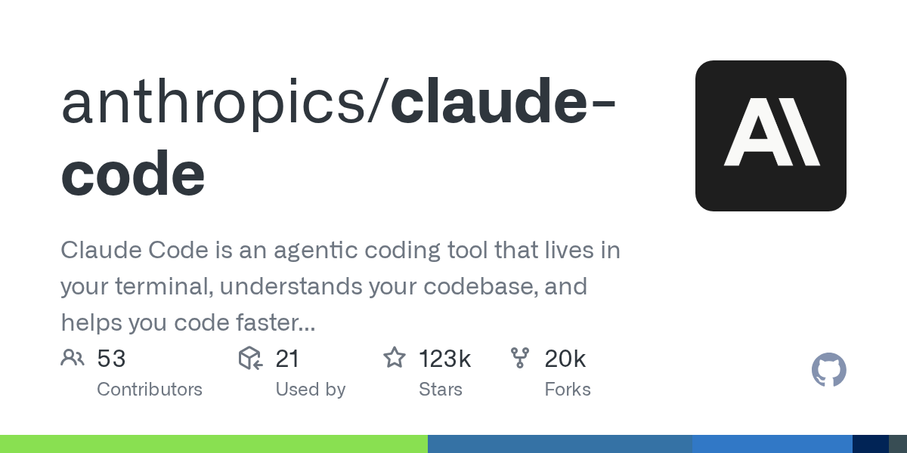
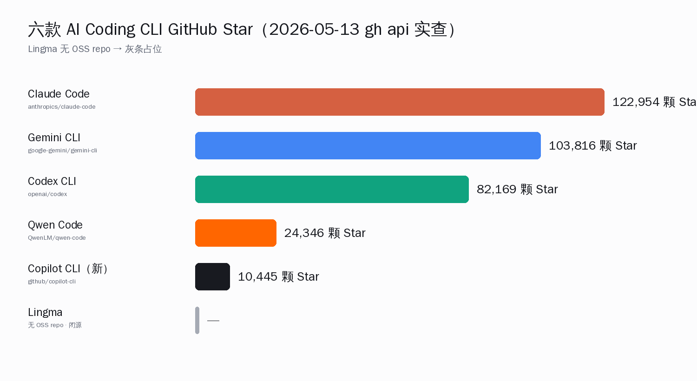
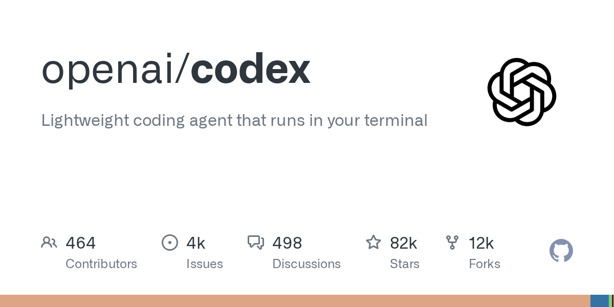
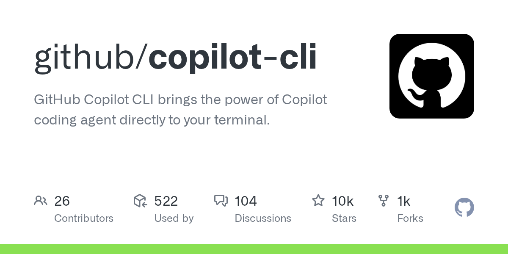
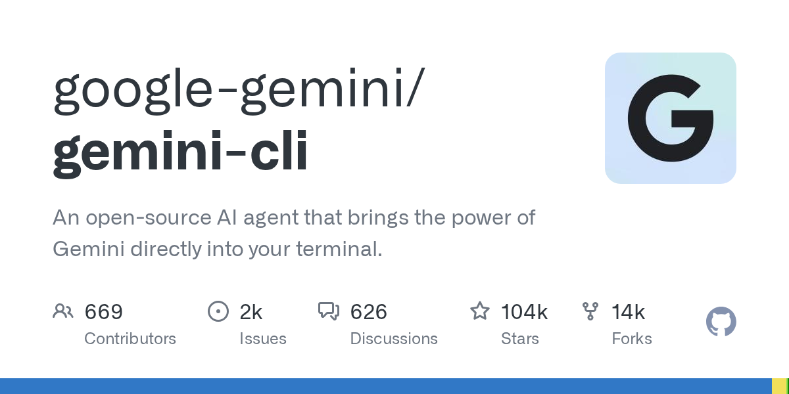
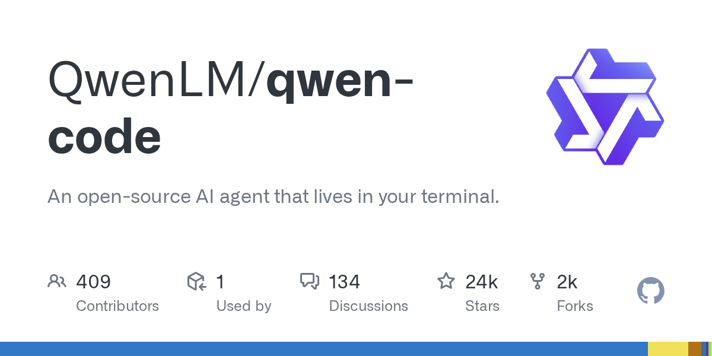
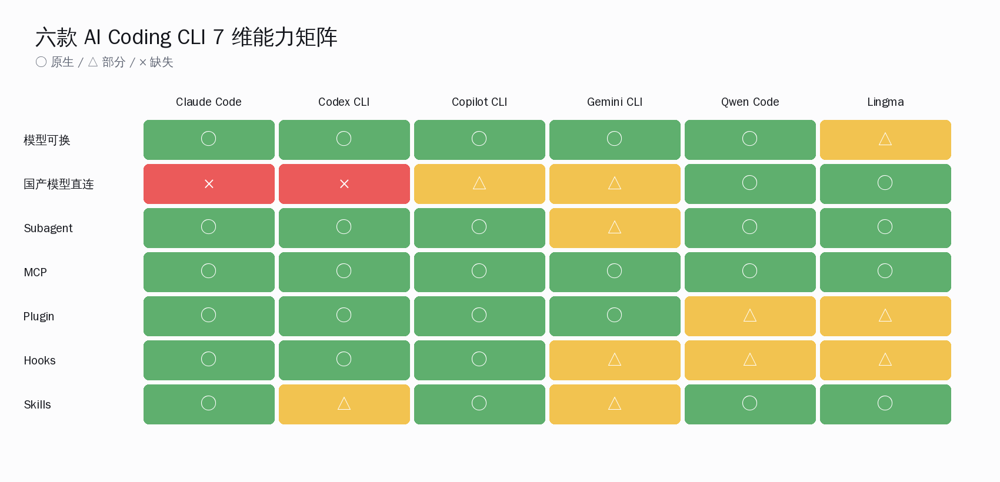
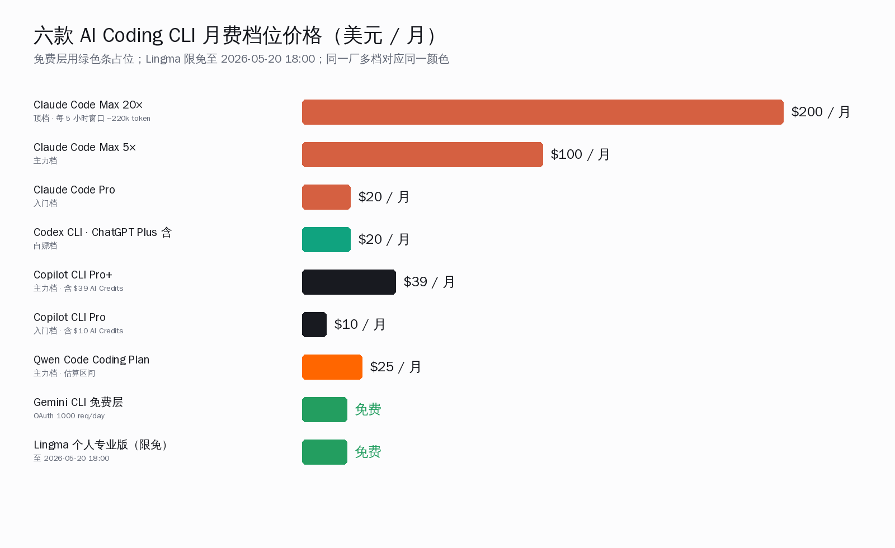
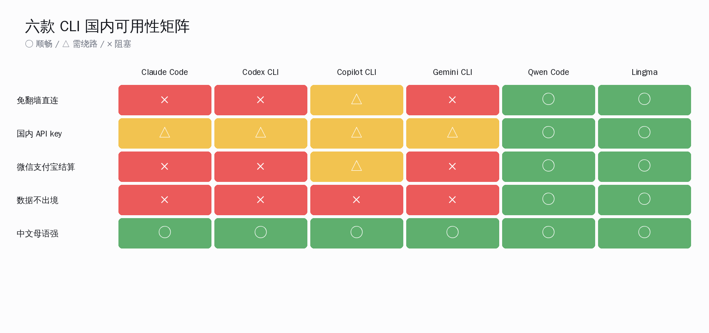
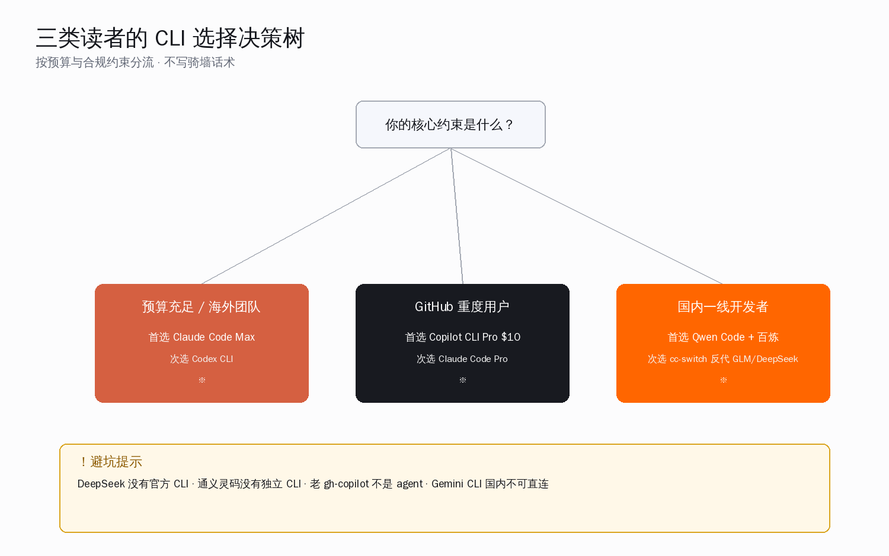

# Claude Code 的 5 个对手实测：Codex、Copilot CLI、Gemini CLI、Qwen Code 谁值得用

5 月 12 日下午 V2EX 一个上海开发者发了条「Claude Code Max 每月 200 美元真的扛不住，国内有什么平替」的帖子，下面 60 多条回复分成 5 个阵营——Codex 党、新 Copilot CLI 党、Gemini CLI 党、Qwen Code 党、cc-switch 反代党。同一天 r/ClaudeAI 一条「我换回 Copilot CLI 了」的帖子在 12 小时内冲到 200 多赞，评论区 Sonnet 4.5 / GPT-5.4 / Qwen3-Coder-Plus 的支持者吵成一团。

国内开发者最常问的「Claude Code 我装不了 / 付不起，换什么」这件事，目前没有一篇把 6 个 CLI 摆到同一台机器、同一截止日（2026-05-13）、同样用 `gh api` 与 `npm view` 实查数据、给出明确推荐的中文横评。

> **本文要回答的事**：5 个 CLI（Codex、新 Copilot CLI、Gemini CLI、Qwen Code、通义灵码）在 2026-05-13 这个时点的真实位置——硬数据 + 7 维能力矩阵 + 价格矩阵 + 国内可用性矩阵；三类读者（海外团队 / GitHub 重度用户 / 国内开发者）该选哪个；以及两条避坑——DeepSeek 没有官方 CLI、通义灵码没有独立 CLI。

## 一、6 个工具的硬基本面（gh api / npm 实查）

`gh api repos/{owner}/{repo}` 5 月 13 日实查 + `npm view <pkg>` 拉取最新版本号，6 行表一次摆齐：

| 工具 | repo | Star | Fork | 最新版本 | 创建日期 | 主语言 | License |
|---|---|---|---|---|---|---|---|
| Claude Code（参照系） | anthropics/claude-code | **122,962** | 20,294 | 2.1.140 | 2025-02-22 | Shell | 无 SPDX |

| OpenAI Codex CLI | openai/codex | 82,169 | 11,871 | 0.130.0 | 2025-04-13 | **Rust** | Apache-2.0 |
| GitHub Copilot CLI（新版） | github/copilot-cli | 10,445 | 1,471 | `@github/copilot` 1.0.46 | 2023-01-06 | Shell | NOASSERTION |
| Google Gemini CLI | google-gemini/gemini-cli | 103,816 | 13,618 | 0.42.0 | 2025-04-17 | TypeScript | Apache-2.0 |
| Qwen Code（阿里） | QwenLM/qwen-code | 24,346 | 2,361 | 0.15.10 | 2025-06-26 | TypeScript | Apache-2.0 |
| 通义灵码 Lingma | 无 OSS repo | - | - | Lingma IDE v0.3.0+ | - | - | 闭源 |

观测要点：

- **Codex CLI 已经是 Rust 重写后的版本**：npm `@openai/codex` 从 2025-07-08 的 `0.2.0` 起切到 Rust 实现，与 2025 年初的 TypeScript 版本不是同一份代码——这也是为什么仓库主语言显示 Rust 96.1%。
- **Gemini CLI Star 数仅次于 Claude Code**：103,816 颗，发版节奏极快，5 月 12 日同一天发 v0.42.0 与 v0.43.0-preview.0。
- **Qwen Code 是 fork 自 Gemini CLI**：QwenLM 团队官方自述「parser-level adaptations to better support Qwen-Coder models」，本体框架与 Gemini CLI 共享同一份代码树。
- **新版 Copilot CLI 是 2025-09-25 才发的新产品**：npm `@github/copilot` 的 `0.0.1` 时间戳是 2025-09-25，与 2023 年起就有的老 `gh copilot suggest/explain` extension（只会解释命令）不是同一个产品。
- **通义灵码不存在独立 CLI**：经实查 `npm view lingma / @alibaba/lingma / @tongyi/lingma` 全部 404，「灵码 CLI」是误传——所有 agent 能力都在 Lingma IDE（基于 VS Code OSS 自研的桌面应用）或 IDE 插件里运行。

数据来源：`gh api repos/{owner}/{repo}`、`npm view <pkg> time --json`、Lingma 官方 changelog（https://help.aliyun.com/zh/lingma/product-overview/changelogs-of-lingma-ide）。

## 二、五家定位各一段：默认模型、独到能力、价格

### 2.1 OpenAI Codex CLI

OpenAI 官方编码 agent CLI，2025-04 开源、Apache-2.0。早期 TypeScript，2025 下半年完全 Rust 重写，仓库 96%+ Rust。默认模型 GPT-5.4 / GPT-5.3-Codex；支持 MCP、子 agent 并行、approval mode、`codex exec` 非交互模式、`AGENTS.md` 配置文件、hooks、plugin 架构。计费绑定 ChatGPT Plus / Pro / Business / Edu / Enterprise 订阅，也支持 API key BYO（含 Azure OpenAI）。最近 30 天近 30 个 alpha + 数个 stable，发版极频。**注意**：与 2021 年那个老 Codex（codex-davinci-002 API）完全无关——老 Codex 2023 年 3 月已下线，这是 2025 年全新命名重启的产品线。

来源：https://developers.openai.com/codex/cli/、https://github.com/openai/codex、npm `@openai/codex`。

### 2.2 GitHub Copilot CLI（新版 agentic）

GitHub 2025-09-25 公开预览，把 Copilot coding agent 搬到终端。默认模型 **Claude Sonnet 4.5**（GitHub 官方文档明写），`/model` 切换，也可挂自定义 OpenAI 兼容 / Azure OpenAI / Anthropic endpoint。核心能力：`/fleet` 拆任务并行跑 subagent + Autopilot 模式 + Plan / Ask / Execute 三态 + Skills + Hooks + MCP + Copilot Memory + GitHub.com 原生集成（PR / Issue / Actions）。所有 GitHub Copilot 订阅（Free / Pro $10 / Pro+ $39 / Business $19 / Enterprise $39）都含 Copilot CLI 不另收费，但 2026-06-01 起改 usage-based billing，每月给等额 AI Credits（Pro $10 含 $10 credits）。

来源：https://docs.github.com/en/copilot/concepts/agents/about-copilot-cli、https://github.blog/news-insights/company-news/github-copilot-is-moving-to-usage-based-billing/。

### 2.3 Google Gemini CLI

Google 2025-06 开源，Apache-2.0，TypeScript，103.8k Star。默认模型 gemini-2.5-pro / gemini-2.5-flash，2026 年新增 Gemini 3 系列 1M context。**免费层最慷慨**：用个人 Google 账号 OAuth 登录得到 60 req/min + 1000 req/day（README 明示）；API key 直连也给 1000 req/day with Gemini 3。支持 MCP、自定义 extensions、`@google/gemini-cli` npm 直装。**中国大陆访问需走代理，Google AI 服务在国内不可直连**。

来源：https://github.com/google-gemini/gemini-cli、Gemini CLI authentication docs。

### 2.4 Qwen Code（阿里 / 通义实验室）

Qwen 团队 2025-06-26 开源，Apache-2.0，**fork 自 Google Gemini CLI**。默认模型 Qwen3-Coder-Plus / 480B-A35B / 30B-A3B，2026 上半年升级到 Qwen3.5-Plus、Qwen3.6-Plus。认证：2026-04-15 之后 OAuth 通道关闭，目前以 API key（阿里云百炼 `sk-xxx`、ModelScope `ms-xxx`、OpenRouter、Fireworks、Anthropic、Google GenAI、本地 Ollama / vLLM 全部 OpenAI 兼容）或订阅阿里云 Coding Plan 月费为主。`@qwen-code/qwen-code` 0.15.10。**免费策略 4 月收紧**：HN 用户反映「Alibaba discontinued Qwen Code's free tier almost on the spot, with a 2-day transitory drop from 1,000 to 100 free requests a day」。

来源：https://github.com/QwenLM/qwen-code、https://help.aliyun.com/zh/model-studio/coding-plan-faq、https://news.ycombinator.com/item?id=47249343。

### 2.5 通义灵码 Lingma（IDE Agent，非 CLI）

**重要事实**：通义灵码目前没有独立 CLI 产品。形态是三种——JetBrains / VS Code / Visual Studio 插件、Lingma IDE（基于 VS Code OSS 自研桌面应用，含 Quest 自主编程 Beta）、PAI 平台内置版本。所有 agent 能力都在 IDE 图形界面运行，没有 `lingma` shell 命令。Lingma IDE v0.3.0（2026-02-05）首推 Quest 自主编程，含 subagent + planning agent + Skills + Commands + 多会话并行。默认模型 Qwen3-Coder。**个人专业版限时免费至 2026-05-20 18:00 截止**，之后回归阶梯定价。MCP 支持自 v0.2.4（2025-12-04）起。

来源：https://lingma.aliyun.com/、https://help.aliyun.com/zh/lingma/product-overview/changelogs-of-lingma-ide。

### 2.6 DeepSeek「CLI」的真相（避坑）

**DeepSeek 官方没有出 CLI 产品**。npm 上能搜到的 `deepseek-cli@1.0.2` 是社区个人作者 `beatyoup` 2024 年发的 OpenAI SDK 包装层，~15KB，只支持基本 chat / 调模型，**不是 agent**，~1 年未更新。国内开发者用 DeepSeek 写代码的主流路径是：把 DeepSeek API 当 Anthropic 兼容 endpoint 接入 Claude Code（通过 `claude-code-router`、`cc-switch`、`cc-desktop-switch` 等转发工具），而不是单独装 `deepseek-cli`。本文后续不把 DeepSeek 单列为 CLI 产品。

来源：`npm view deepseek-cli`、https://github.com/musistudio/claude-code-router、https://github.com/farion1231/cc-switch。

## 三、7 维能力对比矩阵

把 6 个工具按读者最关心的 7 个维度做横向对比——表格 + 热力图双重呈现。

| 能力 | Claude Code | Codex CLI | Copilot CLI（新） | Gemini CLI | Qwen Code | Lingma（IDE 内） |
|---|---|---|---|---|---|---|
| **模型可换** | ✓ API / Bedrock / Vertex / 反代 | ✓ API key / Azure | ✓ `/model`（含 Claude / GPT / 自定义） | ✓ 多 Gemini 型号 | ✓ OpenAI 兼容 / Anthropic / Ollama | 部分（IDE 选 Qwen） |
| **国产模型直接支持** | 需反代 | 需反代 | 可挂 Anthropic 兼容 | 可（自定义 endpoint） | **原生 Qwen3-Coder + 阿里云百炼** | **原生 Qwen3-Coder** |
| **Subagent / 并行** | ✓（Agent + subagent_type） | ✓ | ✓（`/fleet` 任务图） | 有限（Agent Session Protocol） | ✓（继承 Gemini CLI） | ✓（v0.3.0+） |
| **MCP** | ✓ 完整生态 | ✓ | ✓ | ✓ | ✓ | ✓（v0.2.4+） |
| **Plugin / Extension** | ✓ plugin + marketplace | ✓ plugin | ✓ Skills + custom agents | ✓ Custom Extensions | 有限 | IDE 插件市场 |
| **Hooks** | ✓（exec form + 多事件） | ✓ | ✓ | 有限 | 部分 | 部分 |
| **Skills** | ✓（2025-10 起强力） | rules / config | ✓ Skills 体系 | 有限 | ✓（v0.15.10 codegraph skill） | ✓（Skills 体系 v0.3.0+） |

读这张矩阵的方式：

- **生态成熟度**：Claude Code > Copilot CLI（新版） > Codex CLI > Gemini CLI ≈ Qwen Code > Lingma
- **国产模型直接支持**：Qwen Code / Lingma > 其他都需要反代
- **Subagent / 并行**：Claude Code、Codex CLI、新版 Copilot CLI（`/fleet`）三家最成熟

每一条都对应着不同读者画像的选择——Section 七会给出明确推荐。

## 四、价格矩阵：把单位拉齐看真实门槛

把 6 个工具的入门价、主力档、顶档以及国内购买的实际可行性摆到一张表里：

| 工具 | 入门 | 主力档 | 顶档 | 国内购买 |
|---|---|---|---|---|
| Claude Code | Pro $20/月 | Max $100/月（5×） | Max $200/月（20×）+ Team $100/seat | 无官方支付通道；走 anyrouter / Magic 聚合反代或个人订阅海外卡 |
| Codex CLI | ChatGPT Plus $20/月含 | Pro / Business / Edu | Enterprise；API key 按 GPT-5 token 计费 | 同 ChatGPT，OpenAI 不直接支持国内卡 |
| Copilot CLI | Free（限额） / Pro $10/月（含 $10 AI Credits） | Pro+ $39/月 / Business $19/seat | Enterprise $39/seat；2026-06-01 起全员 usage-based | GitHub 微信 / 支付宝渠道存在但不稳定 |
| Gemini CLI | Google OAuth 免费 60 req/min + 1000 req/day | API key 1000 req/day 含 Gemini 3 | Google Cloud Vertex AI 按 token | Google AI 国内不可直连 |
| Qwen Code | 阿里云百炼新用户 70M+ token 免费 90 天 | Coding Plan 包月 | Token Plan 团队版 by seat | **支持微信 / 支付宝 / 企业对公**，国内最顺 |
| Lingma | 个人专业版限免至 2026-05-20 18:00 | 企业标准版包年 8 折 | 企业定制 | **支持阿里云体系内一切支付方式** |

几个细节读者容易忽略：

- **Copilot CLI $10 Pro 档实际是当下最划算入门档**。$10 直接拿到默认 Claude Sonnet 4.5，比 Claude Code Pro $20 / Codex CLI 绑 ChatGPT Plus $20 都便宜，但 2026-06-01 起 usage-based billing 上线，实际成本要看每月 AI Credits 怎么消耗——重度用户可能踩穿。
- **Gemini CLI 1000 req/day 免费层**是 5 个工具里最慷慨的，但前提是「人在境外 + Google 账号 OAuth 顺畅」，国内用户实际落地要算上代理成本。
- **Qwen Code 4 月免费层从 1000 req/day 急降到 100 req/day**，海外社区抱怨「没沟通就调整」；但反过来，阿里云百炼新用户的 70M+ token 免费 90 天体验阶段还是足够普通用户跑半年的小项目。

## 五、真实用户原话 8 条

V2EX、HN、知乎、独立测评博客近 30 天的高频原话，每条带链接 + 平台标签：

1. **V2EX dismantle**：「目前综合体验最好的是 Claude Code，其次是 Codex。」——https://www.v2ex.com/t/1172123
2. **V2EX BQsummer**：「换回 Copilot 了，Sonnet 4.5 / GPT-5 都能自己选，10 刀还便宜。」——同帖
3. **V2EX tracyliu**：「cc 第一无争议（即便是反代的 api 都很强）。」——同帖
4. **V2EX WhatIf**：「qwen code 免费，简单用用不报太大期望的话还不错。」——同帖
5. **V2EX WhatIf**（Gemini CLI 限额）：「一天只有 300 万 token 一般就是卡在这个上面。」——同帖
6. **HN 评论（Qwen3-Coder 主题）**：「Qwen 3 Coder marks the first time an open-source coding model actually competes with paid LLMs like Sonnet and Opus. The code quality is genuinely impressive.」——https://news.ycombinator.com/item?id=47249343
7. **colobu.com 测评**：「Gemini CLI 在数据分析任务中未能完成此任务，生成了不连贯的 Notebook；Claude Code 在所有任务中表现最佳，是涉及高度信任的专业工作流程的理想选择。」——https://colobu.com/2025/11/01/
8. **知乎 Vibe Coding 实践指南**：「Gemini CLI 目前可以免费使用，而 Claude Code 使用 Claude 模型的费用可能比较高，使用国内的 Kimi K2 模型可以作为平替。」——https://zhuanlan.zhihu.com/p/1933178505870414828

## 六、国内可用性矩阵

国内开发者最关心的「装得了 / 付得起 / 用得顺」三件事整合成一张表：

| 工具 | 翻墙 | 国内 API key | 中文交互 | 隐私合规 |
|---|---|---|---|---|
| Claude Code | 是（Anthropic 直连不通） | 需 cc-switch / claude-code-router 反代国产模型 | 良好（Sonnet / Opus 中文强） | 数据出境，对企业敏感 |
| Codex CLI | 是（OpenAI 直连不通） | BYO Azure OpenAI 中国版可能可行；社区反代普遍 | 良好（GPT-5 中文强） | 同上 |
| Copilot CLI | 部分（GitHub.com 国内可访问，模型推理走海外） | 可挂自定义 endpoint | 良好（默认 Sonnet 4.5） | 微软出境合规相对完善，仍出境 |
| Gemini CLI | **是**，Google AI 国内全面不可直连 | 仅自定义 endpoint 工作正常 | 良好（Gemini 中文不错） | 数据出境 |
| Qwen Code | **否**（阿里云国内直连） | **原生**百炼 sk-xxx / ModelScope ms-xxx | **优秀**（Qwen 中文母语） | **数据不出境**，等保备案完备 |
| Lingma | **否**（阿里云国内服务） | 原生绑定阿里云账号 | **优秀** | **数据不出境**，含企业知识库本地化 |

合规一栏的差距是国内团队选型时容易被低估的硬约束——金融、政务、医疗等需要数据不出境的行业，Qwen Code / Lingma 是 6 个里唯二可以无障碍走完合规审批的选择。

## 七、三类读者各推一条电路（决策表）

把读者按场景分三类，给出明确推荐——不写「各有优劣」「因人而异」这种骑墙话术。

| 读者画像 | 第一推荐 | 第二备选 | 不推荐 |
|---|---|---|---|
| **海外团队 / 个人，预算充足** | Claude Code Max $100-200/月 | Codex CLI（ChatGPT Plus $20 顺带） | Gemini CLI（免费但能力一档差） |
| **GitHub 重度用户 / 全栈个人** | **Copilot CLI Pro $10/月** | Claude Code Pro $20/月 | 老 `gh-copilot` extension（只是命令解释，不是 agent） |
| **国内一线 AI 开发者** | **Qwen Code + 阿里云百炼** | Claude Code + cc-switch 反代 GLM-4.6 / DeepSeek-V3 | DeepSeek `deepseek-cli` 社区包（停更，不是 agent） |
| **国内企业 / 私有部署** | **Lingma 企业版（IDE 形态）** | Qwen Code（自建百炼或 Coding Plan） | Gemini CLI（合规直接卡住） |
| **预算极限 / 学生 / 个人项目** | Gemini CLI 免费层（人在境外） | Qwen Code（阿里云百炼新用户 70M token） | Claude Code（贵） |

**避坑提示再重复一次**：

- DeepSeek 没有官方 CLI，npm `deepseek-cli` 是 2024 年个人作品，别当生产工具用
- 通义灵码没有独立 CLI，所有「Lingma CLI」说法都是误传
- Gemini CLI 在国内无翻墙不可用，免费层虽诱人但门槛实际很高
- 新 Copilot CLI（`@github/copilot`）与老 `gh copilot suggest/explain` 不是同一个产品——前者 2025-09-25 才发，后者只是命令解释器

## 八、回到核心论断

回到开篇那个问题——「Claude Code 我装不了 / 付不起，换什么」？答案有三层：

1. **对绝大多数国内开发者**：Qwen Code 是当前最顺的电路。原生支持千问系列 + 国内直连 + 微信 / 支付宝结算 + Coding Plan 包月，叠加阿里云百炼新用户的免费 token，能让一个 indie 开发者把 AI 写代码这件事在自己工作流里跑通半年。免费层收紧是事实，但 100 req/day 对学习用途仍够。

2. **对预算充足的海外或外企团队**：Claude Code 仍是综合体验第一档，发版节奏稳定（npm 时间戳显示平均 25.4 小时一版）、Skills / plugin / subagent 生态最成熟、V2EX 与海外测评都把它评为综合最佳。Codex CLI 适合已经订了 ChatGPT Plus 的用户顺带白嫖，Rust 重写后启动快、发版极频。

3. **对 GitHub 重度用户**：新 Copilot CLI $10/月直接拿 Claude Sonnet 4.5 + `/fleet` 并行 + GitHub.com 原生集成，性价比击穿入门档。2026-06-01 改 usage-based 后要重新算账，但目前 6 月之前这一个月是 6 个工具里**单价最低 + 默认模型最强**的入门窗口。

这一两年我们看到的是非常友好的局面——海外 Claude Code / Codex CLI / Copilot CLI / Gemini CLI 在比着发版，国内 Qwen Code / Lingma 在比着开放给开发者，价格区间从月费 $200 一路覆盖到完全免费。每个国内开发者都能找到一条适合自己钱包和工作流的电路；前辈们已经把可行路径趟出来，剩下的事是把工具用得更深、把生产力打磨得更扎实。

把 6 个工具一次性看完，结论可以浓缩成一句：**不必神化 Claude Code，也不必神话「国产替代」——按自己的工作场景挑那一条最顺的电路，剩下的就是把它用到位**。这一篇横评要做的事到这里就完成了。
