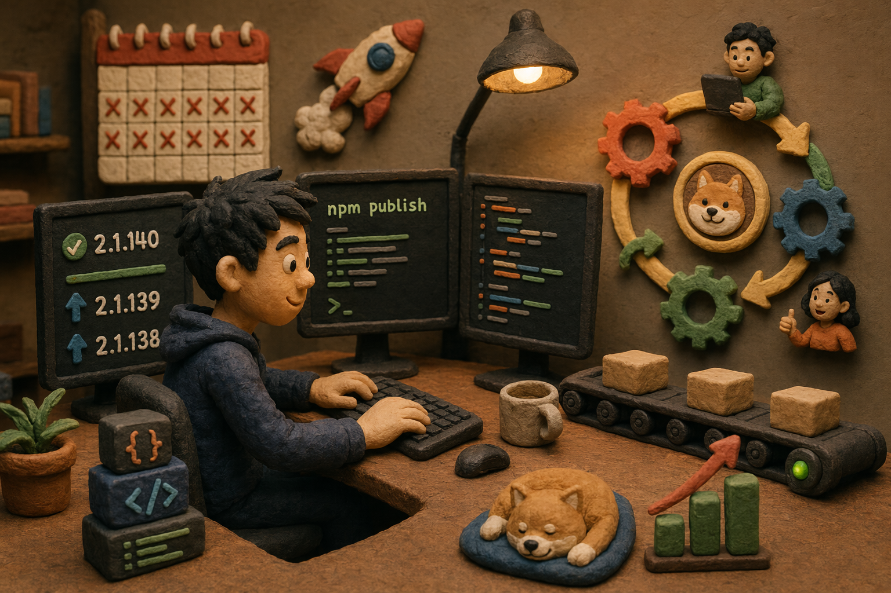
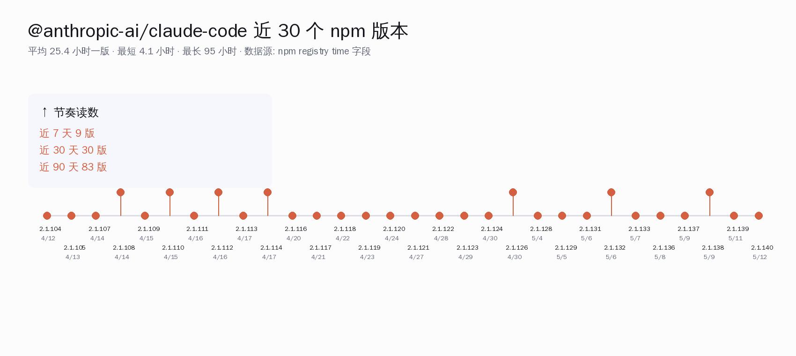
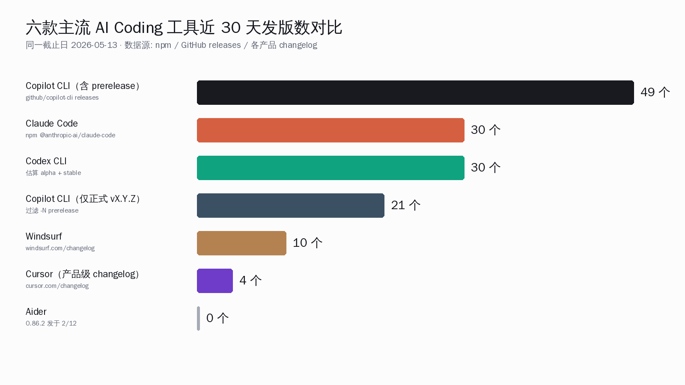
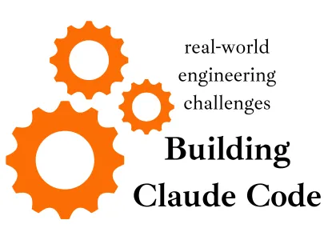
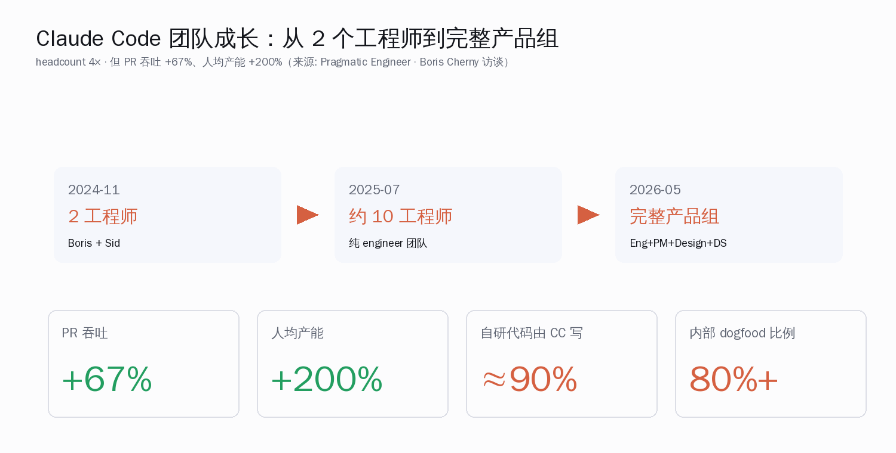
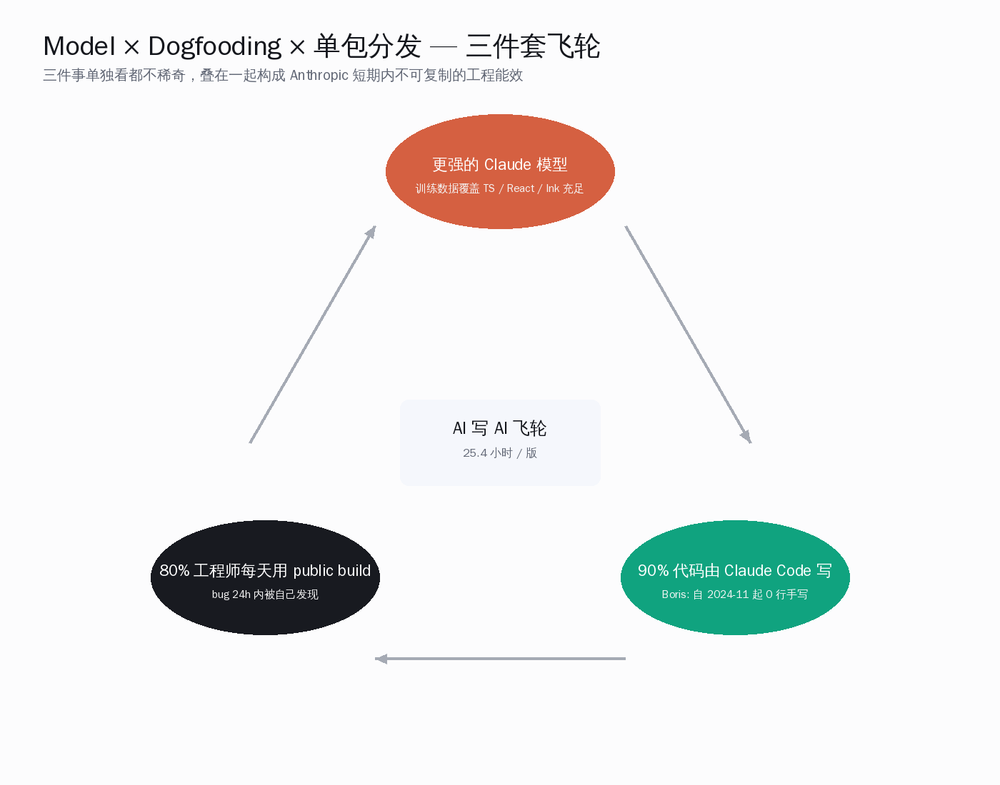
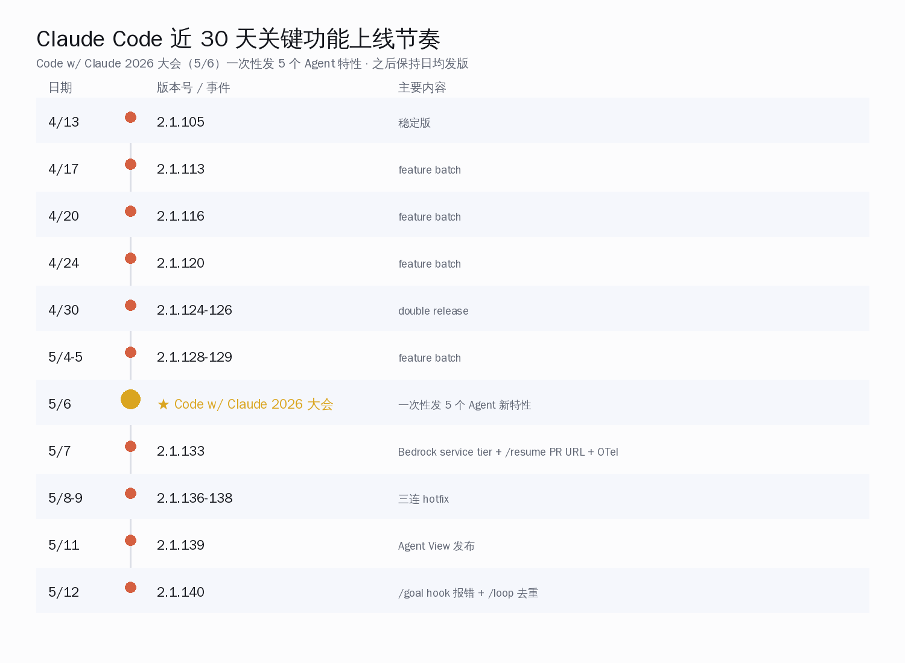

# Claude Code 凭什么 25 小时一版：把 npm 时间戳和工程文化摆到一起看

5 月 12 日晚上 19:50，`@anthropic-ai/claude-code` 在 npm 上推了 `2.1.140`；前一晚 18:09 是 `2.1.139`；再往前两天连发 `2.1.136 / 2.1.137 / 2.1.138`。打开 `npm view @anthropic-ai/claude-code time --json` 把时间戳按序排一遍，过去 7 天 9 个版本、过去 30 天 30 个版本、过去 90 天 83 个版本——平均每 25.4 小时一个新版本号被推上 npm registry，最短两次发版只隔 4 小时 6 分钟。

**这一篇要回答的事**：Claude Code 的发版密度是不是营销话术？如果是真实数据，背后是什么样的组织、工程文化、技术栈组合让一个团队能稳定保持「平均每天一版」的产出节奏？以及——这种节奏的代价是什么，国内开发者能学的部分是哪一段？

> **核心论断**：Claude Code 的发版密度在主流 AI Coding 工具里处于明显第一档，这不是单纯的「快」，而是「模型 × Dogfooding × npm 单包分发」三件套叠加出来的飞轮——四个层面拆开看都很清晰，组合在一起就是别人短时间内学不来的工程纪律。

## 一、把数据先摆齐：npm 时间戳不会撒谎

把 `npm view @anthropic-ai/claude-code time --json` 输出的最近 30 个版本号 + 时间戳列成表，节奏一目了然——`2.1.140`（5/12 19:50）→ `2.1.139`（5/11 18:09）→ `2.1.138`（5/9 05:57）→ `2.1.137`（5/9 00:04）→ `2.1.136`（5/8 16:30）……同一天连发两版（5/9 / 5/6 / 4/30 / 4/17 / 4/15 / 4/14 各出现一次）是常态。

把节奏统计成一张总表，方便和后面对手做横向对照：

| 维度 | 数字 | 数据源 |
|---|---|---|
| 近 7 天 npm 发版数 | 9 个 | npm `@anthropic-ai/claude-code` time 字段 |
| 近 30 天 npm 发版数 | 30 个 | 同上 |
| 近 90 天 npm 发版数 | 83 个 | 同上 |
| npm 上历史总版本数 | 406 个 | 首发 2025-02-24，跨度 ≈ 14.6 月 |
| 近 30 版本平均间隔 | 25.4 小时 | 中位 21.8 小时 / 最短 4.1 / 最长 95 |
| GitHub Star（5/13 实查） | 122,962 颗 | `gh api repos/anthropics/claude-code` |
| GitHub Fork | 20,294 个 | 同上 |
| Issues open | 10,878 条 | 同上 |
| 建仓时间 | 2025-02-22 | 同上 |

把 Claude Code 的发版节奏放进一张柱状图里，和读者每天接触的 Cursor、Copilot CLI、Aider 放到同一截止日（2026-05-13）做对照：

| 工具 | 近 30 天发版 | 近 90 天发版 | 口径说明 |
|---|---|---|---|
| **Claude Code（Anthropic）** | **30** | **83** | npm 单一可信源 |
| GitHub Copilot CLI（含 prerelease）| 49 | 100+ | repo `github/copilot-cli` releases |
| GitHub Copilot CLI（正式 vX.Y.Z）| 21 | 42 | 过滤掉 `-N` prerelease |
| Cursor（产品级 changelog）| ≤5 条公开条目 | 个位数 | cursor.com/changelog |
| Windsurf | ~10 个版本 | ~15 个 | windsurf.com/changelog |
| Aider（aider-chat） | 0 个 | 1 个 | 上一版 0.86.2 发于 2026-02-12 |

口径上要诚实说明一点：Cursor 是 IDE 形态，发版本身要走 Electron 多平台打包，每条 changelog 条目背后是更大的一次集成，颗粒度不直接可比；Copilot CLI 的 `vX.Y.Z` 正式 release 30 天 21 个，看起来接近 Claude Code，但功能面（一个独立 CLI）远小于 Claude Code 的「CLI + Agent SDK + Plugin/MCP marketplace + Web UI + IDE 集成 + Windows native」并行赛道。**即便把口径修到对自己最不利，Claude Code 仍是第一档，并列只有 Copilot CLI 的全 prerelease 口径。**

数据来源：npm registry 时间字段、`gh api repos/anthropics/claude-code/releases`、Pragmatic Engineer 报道、四家产品 changelog 页面（cursor.com / windsurf.com / pypi.org/aider-chat / github.com/github/copilot-cli/releases）。

## 二、团队为什么不止「快」，还能「稳」

Pragmatic Engineer 的 Gergely Orosz 4 月在 *How Claude Code is built* 里给出一组数字：Claude Code 2024 年 11 月起步时只有 2 个工程师——Boris Cherny 和 Sid Bidasaria，到 2025 年 7 月扩到约 10 人，现在已经是「engineers + PM + Design + Data Science」完整产品团队。

这组数字真正让人意外的不是 headcount 翻倍，而是 PR 吞吐**+67%**。一般规律是团队从 10 人扩到 40 人，人均产能因为协调成本下降、PR review 排队、新人 ramp-up 等因素普遍下滑；Anthropic 这组数字反过来。

把这组反规模递减的数据拆开看，三条原因可以从公开资料里抠出来：

- **角色边界主动模糊**。Cat Wu（Claude Code 产品负责人）在 Lenny Rachitsky 4 月的播客里讲过一句被广泛转发的原话——「PMs are doing some engineering work. Engineers are doing PM work. Designers are PMing and also landing code.」把传统 PRD 评审 → 设计稿 → 工程实现的三段流程合并成一个人一条电路。
- **一线工程师每天 10-30 PR**。Boris Cherny 在 *The Man Who Built Claude Code Was Changed By It* 的访谈里直接说：「Every day I ship like 10 20 30 PRs something like that.」同段还透露「100% of my code is written by Claude Code. I have not edited a single line by hand since November 2024.」「At the moment I have like five agents running while we're recording this.」
- **内部发版 60-100 次/天**。同样来自 Gergely Orosz 的总结：「Internal releases: 60–100 per day（每一次 npm package change）. External releases: ~1 per day.」也就是说我们在 npm 看到的 25 小时一版只是「对外发布」的水位，对内的迭代频次是这个数字的几十倍。

Cat Wu 4 月接受 Lenny 采访时还讲了一句被 Lenny Rachitsky 在 X 上单独发了一条推文转发的概括——**「Anthropic's product development timelines have gone from six months to one month, sometimes one week, sometimes one day.」**这句话不是口号，是上面那组「每天 10-30 PR」的另一种说法。

## 三、Dogfooding 飞轮：90% 代码由 Claude Code 写

Claude Code 这个项目的工程能效里，最容易低估的一项是它「自己写自己」的程度。Gergely Orosz 给出的数字是「Around 90% of Claude Code is written with Claude Code」，Boris Cherny 在访谈里给出的个人数字更极端——从 2024 年 11 月开始他没有手写过一行代码。

把这件事和「80%+ 写代码的 Anthropic 工程师每天都用 public 版本的 Claude Code」叠在一起，飞轮就成型了：

读这张图的方式是：

1. **更强的 Claude 模型** → 模型本身能写出更复杂的 Claude Code（90% 自研代码由它写）
2. **更复杂的 Claude Code** → 内部 80% 工程师每天用 → bug 24 小时内被自己人发现并修复
3. **更可靠的 Claude Code** → 反过来让模型在更多真实场景里被打磨，反馈数据回流到模型训练

这个回路里有一个细节值得拉出来单独看：4 月 23 日 Anthropic 工程团队公开过一份 postmortem。文中承认有一个性能缓存 bug 从 3 月 26 日一直存活到 4 月 10 日，期间多次 dogfooding 没捕到，原因是**内部 staff 用的不是 public build，而是带未发布功能的 test build**。事后 Anthropic 把「更大比例的内部 staff 切到与 public 完全一致的 build」明文写进改进项。

这是「自己写自己」回路的代价：当内部使用的版本和对外发布的版本不同时，dogfooding 的信号就有空隙。后续 CHANGELOG 里 hotfix 密度大、`2.1.140` 一版列 13 条独立修复，本质上是对这一空隙的兜底机制。**发版快不等于无 bug；它意味着「出了 bug 24 小时内有新版本可以装」。** 这是 Anthropic 显式选择的权衡，不是无意。

## 四、技术栈：选 TypeScript + Bun + Ink 是「让模型自己写自己」的延伸决策

Claude Code 的核心代码是 TypeScript，渲染层用 Ink（React for CLI）+ Yoga 布局，运行时用 Bun。Gergely Orosz 援引 Anthropic 工程团队的说法，这套技术栈的选择刻意「on distribution」——选用模型在训练数据里见得最多的语言栈，让 AI 写 AI 时准确度最高。

把这套选择和「单 npm 包分发」放到一起，发版成本的数量级差距就出来了：

| 维度 | Claude Code | Cursor / Windsurf |
|---|---|---|
| 形态 | npm 单包 + 命令行 | Electron 桌面应用 |
| 分发链路 | `npm publish` 一行 | 多平台 binary + auto-update channel |
| 单次发版操作成本 | 数分钟 | 数小时（含 Mac notarization、Windows code-signing 等） |
| 用户升级路径 | `npm i -g @anthropic-ai/claude-code@latest` | 等客户端自动检测 + 提示重启 |
| AI 写自己代码的可行性 | 高（TS 训练数据丰富） | 低（IDE 工程量大、跨进程通信复杂） |

近 30 天 Claude Code 真正落地的新东西，按 CHANGELOG 配版本号摆一遍：

| 版本 | 日期 | 主要新功能 |
|---|---|---|
| 2.1.140 | 2026-05-12 | Agent `subagent_type` 模糊匹配；`/goal` 在 hook 禁用时友好报错；symlinked settings hot-reload 修复；`claude --bg` 后台服务修复；`/loop` 去重 |
| 2.1.139 | 2026-05-11 | **Agent View（Research Preview）**：`claude agents` 命令统一查看 running / blocked / done 全部会话 |
| 2.1.138 / 137 / 136 | 2026-05-09 / 09 / 08 | 三连 hotfix |
| 2.1.133 | 2026-05-07 | Bedrock service tier env、`/resume` 接受 PR URL、OpenTelemetry 改进 |
| 2.1.129 / 128 | 2026-05-05 / 04 | feature batch |
| 2.1.126 / 124 | 2026-04-30 | feature batch + hotfix |
| 2.1.120 / 116 / 113 | 2026-04-24 / 20 / 17 | feature batch |

5 月 6 日 Anthropic 在旧金山办的 *Code w/ Claude 2026* 大会上，一次性发了 5 个 Agent 新特性（Simon Willison 当天的实况博文记录在 simonwillison.net/2026/May/6）。把这条线和 npm 时间戳对齐，能看到一次大会的发布并不是「攒一波再放」，而是「日常发版节奏 + 大会节点重点曝光」的并行。

## 五、外部观察者的判断

把 V2EX、HN、知乎、英文测评里的高频原话收一遍，外部感受和 npm 数据是对得上的：

- Builder.io 一份月度梳理直陈：「Keeping up with Anthropic in 2026 has been difficult, with a new release almost every day and a major one every two weeks.」
- CLSkills 4 月一篇五天专评写道：「Five releases shipped in six days, including hotfixes within 48 hours of bug reports.」
- Stack Overflow / NxCode 2026 调研给出的数字：Claude Code 在开发者中 46% 「most loved」率，Cursor 19%，Copilot 9%。
- 量子位 4 月一篇「Claude Code 更新废了！」反过来证明用户对每一次发版都高度敏感——一个用户感知到「思考深度下降 67%」的版本会在中文社区形成实时舆论反馈，逼着 Anthropic 一天内出新版。
- 知乎一篇标题里写「Claude Code 2.1 重磅更新解析：1096 次提交背后的技术革命」，1096 这个 commit 数字直接说明对外一版本背后对内的迭代规模。

V2EX 上一位用户的评价更直白：「目前综合体验最好的是 Claude Code，其次是 Codex。」同帖另一位则说「换回 Copilot 了，Sonnet 4.5 / GPT-5 都能自己选，10 刀还便宜」——这恰好是下一篇要展开的话题（替代品评测），本篇按下不表。

## 六、国内开发者读得到的启示

国内开发者读到这里，会很自然地问：这套节奏能学吗？把可学和不可学的部分拆开看会清楚一些。

**可学的三件事**：

1. **AI 写 AI 的复利不是玄学**。一个 AI Coding 工具自己 100% 用自己写，复利会很快显现。国内团队即便用国产模型（千问 / DeepSeek / Kimi），只要把「日常写代码 80% 走 AI agent」这件事坚持执行半年，工程能效会有非线性变化。
2. **分发越轻，发版越快**。Cursor 和 Windsurf 卡在 Electron 的天花板上不是技术不行，是分发链路决定的。如果做 CLI、做 npm/pip 包、做 Web 服务，发版成本天然低一个数量级——国内做 AI Coding 工具的团队完全有机会用同样的形态参与，无需复刻 Electron 路径。
3. **Dogfooding 严格度 > 测试覆盖率**。Anthropic 4 月 23 日 postmortem 给出的教训非常具体：内部 staff 用的版本要和 public 版本一致，否则 dogfooding 的信号会失真。这条经验国内任何团队都能直接复用。

**短期内不容易学的部分**：

- Boris Cherny 个人一天 10-30 PR、5 个 agent 并发跑的工作流，背后是 Anthropic 内部三年累计的 prompt 库、Claude Sonnet 4.6 / 4.7 模型本体、Claude Code 自己工具链的协同。国内同行用国产模型搭同样的工作流，模型能力上限会成为短期瓶颈——目前千问 / DeepSeek 的最强组合已经能完成 70-80% 的同类任务，但还差一截。
- Anthropic「engineer 数 4x、人均产能 +200%」的反规模递减需要很强的招聘画像（engineer with great product taste）、敢于让工程师同时承担 PM 和 Designer 角色的组织授权，以及对应的薪酬包。这是组织能力问题，不是工具问题。

我们这一代国内 AI 开发者的幸运在于，AI Coding 工具已经从「炫技 demo」走到了「日常生产力」这一档——Claude Code 把发版节奏拉到 25 小时一版的同时，国内同行有 Qwen Code、通义灵码、Trae 这类原生 CLI / IDE Agent 跟进；前辈已经把可行路径趟出来，剩下的事是把工具用得更深、把自己的工程纪律打磨出来。

## 七、把核心论断再说一遍

回到开篇那个问题——Claude Code 凭什么能稳定保持 25 小时一版？答案不是「快」，是「这个团队选择了一组让发版本身变便宜的事情」：

- **数据层**：npm 时间戳每天都在更新，密度是真实的，不是营销话术
- **组织层**：团队从 2 → 10 → 完整产品组，角色边界主动模糊，PR 吞吐反规模递减
- **Dogfooding 层**：90% 代码由 Claude Code 写、80% 工程师每天用 public 版本、4 月 23 日 postmortem 后把内部 / 外部 build 拉齐
- **技术栈层**：TypeScript + Bun + Ink + npm 单包，刻意选择模型最熟、分发最轻的组合

这四件事任何一件单独看都不算稀奇，叠在一起就是别人短时间内学不来的工程纪律。国内开发者真正能从这套节奏里带走的，不是「我们也要日发一版」的目标，而是「把 AI 写代码这件事在自己的工作流里推到 80%+，把分发链路砍短，把 dogfooding 严格度提上来」这三个具体动作——这三件事做下来，半年后回头看会发现自己也走出了类似的复利曲线。

发版快从来不是终点，而是一组工程文化纪律的副产品。Claude Code 把这件事公开摆出来，对所有国内 AI Coding 工具团队都是一份现成的工程参考——不必照抄，看清楚里面的因果就够了。
