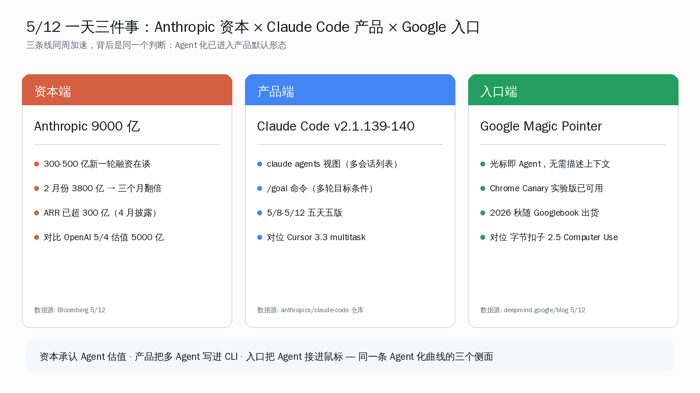
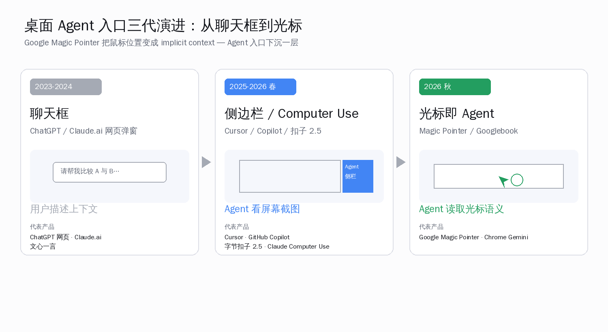
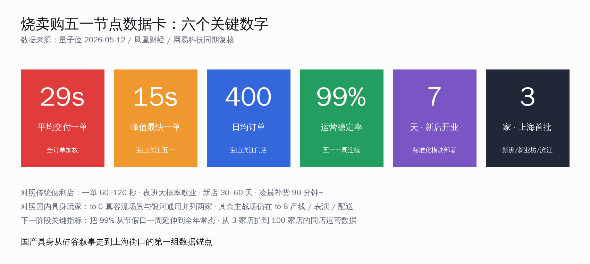
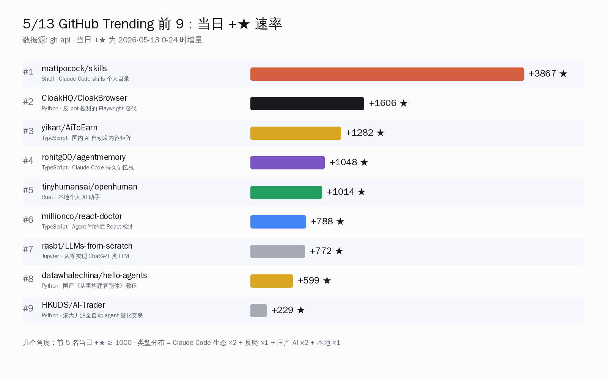

# Anthropic 估值翻倍 9000 亿 · Claude Code 推 /goal | AI 日报 | 2026-05-13


## 📋 头版目录（一屏扫完今日）

- 💸 Bloomberg 5/12 报道 Anthropic 在谈 300-500 亿美元新一轮、估值 9000 亿，3 个月翻倍 → 头条
- 🛠 Claude Code v2.1.139-140 推 `claude agents` 视图 + `/goal` 多轮目标命令 → 头条
- 🛠 Google DeepMind 5/12 发 AI Pointer 研究，秋季 Googlebook 把 Gemini 接到光标 → 头条
- 💸 Anthropic 商业 ARR 已超 300 亿、跑向 400 亿，估值跳跃由收入背书 → 头条
- 📦 mattpocock/skills 冲 75,947⭐（单日 +3867），Claude Code skills 生态最大公共仓 → GitHub Trending
- 📦 CloakHQ/CloakBrowser 冲 7,814⭐（单日 +1606），Agent 抓站新基线 → GitHub Trending
- 📦 yikart/AiToEarn 冲 11,828⭐（单日 +1282），国产 AI 自动分发矩阵浮上来 → GitHub Trending
- 📦 rohitg00/agentmemory 冲 5,822⭐（单日 +1048），Claude Code 长记忆方案登顶持续 → GitHub Trending
- 📦 tinyhumansai/openhuman 冲 2,663⭐（单日 +1014），Rust 写的本地个人 AI 助手 → GitHub Trending
- 🚀 OpenAI GPT-5.5 Instant memory sources 上 web 端，回答能看到调用了哪条记忆 → 快讯
- 🚀 ChatGPT Business 上 Excel / Google Sheets sidebar 全球开放 → 快讯
- 🧠 Anthropic NLA 自然语言自编码器 5/8 论文 + 前端开放 Neuronpedia 共建 → 精选要闻
- 🇨🇳 商汤善惠 SenseMartGo 上海三店落地，15 秒一单、日均 400 单、7 天可开新店 → 国内 AI（专题）
- 🇨🇳 网信办 6 类必选标签 5/12 在 12 家平台同步上线，含 AI 生成强制标注 → 国内 AI（专题）
- 🇺🇸 GitLab Act 2：第一家公开为 Agent 重构组织的硅谷公司，研发拆 60 自治小组 → 值得关注（专题）
- 🛠 Anthropic Claude 推 12 个法律工作插件 + Thomson Reuters CoCounsel 接入 → AI Coding 工具
- 🎙 antirez：「写 ds4.c 七个月后，AI 速度优势已不在写而在改」→ 名人说
- 🎙 Simon Willison：Magic Pointer 是 OS 级 Agent 入口第一次摸到桌面用户 → 名人说
- 🎙 Karpathy 5/12 转发 mattpocock/skills，"agent 行为可被 SKILL.md 文本化" → 名人说
- ⚖️ 普林斯顿 5/11 重启 133 年监考政策，公开理由：AI 让笔试无法独立完成 → 快讯
- 🏭 SpaceX × Anthropic：Colossus 1 整座 22 万 GPU、300MW 一个月内接入 → 快讯

## ⏱ 公众号版 30 秒速览

- **头条**：5/12 海外 AI 在资本端和产品端同步进了一步。Bloomberg 报道 Anthropic 在谈一笔 300-500 亿美元的新一轮，估值 9000 亿美元；二月份这家公司估值还是 3800 亿，三个月翻倍。同一天 Claude Code 推 v2.1.139-140，加 `claude agents` 视图（一个命令看完所有会话的 Agent 列表）和 `/goal` 命令（多轮工作设完成条件）。再加上 Google DeepMind 当天发的 AI Pointer 研究——把 Gemini 接到 Chrome 的鼠标光标里，秋季会随 Googlebook 一起出货。三件事拼起来：钱、产品形态、入口同时往 Agent 这一边推。
- **国内对位**：5/12 国内三条专题轨道同步交卷——商汤善惠 SenseMartGo 在上海开了三家具身便利店（最快 15 秒一单），网信办 6 类必选标签在抖音快手等 12 家平台同步上线，硅谷 GitLab CEO 公开为 Agent 重构组织（研发拆 60 自治小组）。这三件事的共同点：Agent 离日常工作越来越近。
- **GitHub 实查**：mattpocock/skills 75,947⭐、CloakBrowser 7,814⭐、AiToEarn 11,828⭐、agentmemory 5,822⭐、openhuman 2,663⭐——5 个项目都是同日 +1000 起跳，集中在 AI Coding 工具链与 Agent 工作流。
- **风险**：今天没有针对国内开发者的合规变化，但网信办 6 类标签的 12 家平台先行先试已经落地，发短视频前要选标签的工程影响已上桌。

## 🔥 头条：Anthropic 资本与 Claude Code 同周加速——9000 亿估值在谈、Agent 视图与 /goal 一起上车



5/12 这一天，海外 AI 在三个层面同时进了一步：

1. **资本端**：Bloomberg 5/12 北京时间凌晨发稿，**Anthropic 正在与投资人谈一笔 300-500 亿美元的新一轮融资**，目标估值**超过 9000 亿美元**。这家公司**二月份刚以 3800 亿美元估值完成一轮 300 亿融资**——三个月内估值翻倍。
2. **产品端**：同一天 GitHub 上 `anthropics/claude-code` 仓库推出 v2.1.139（5/11 18:43）与 v2.1.140（5/12 21:09）两个版本，**加入 `claude agents` 视图（Research Preview）和 `/goal` 命令**——前者一行命令看到所有正在跑的 Claude Code 会话，后者让多轮工作可以设完成条件。
3. **入口端**：Google DeepMind 5/12 发表 AI Pointer 研究，把 Gemini 接到 Chrome 的鼠标光标里——**用户指向网页元素，Gemini 直接读取上下文不再需要描述**。Magic Pointer 会随秋季落地的 Googlebook（替代 Chromebook 的新形态）一起出货。

三件事单看都不算颠覆，**叠起来看是一条清晰的信号：资本市场已经把 Anthropic 从"模型公司"重新定价到"Agent 基建公司"，Claude Code 这边的产品节奏也在与之配套——从单轮 vibe-coding 走向多 Agent、多目标、多会话**。

### 一、估值跳跃：3800 亿 → 9000 亿，背后是 300 亿 ARR

Bloomberg 报道把这次估值跳跃的根本理由摆得很直白——**收入背书**。Anthropic 在本月（5 月）正式披露：

- **年化收入运行率（ARR）已超 300 亿美元**，公司内部跑到 400 亿附近；
- **企业级订阅（Claude for Work / Claude Code / Anthropic API）三条线全部正增长**；
- 5/6 开发者大会披露：**API 同比增长 17 倍、Claude Code 客户数同比增长 8 倍**。

把 4 月底 TechCrunch 同一消息源放在一起看，时间线是这样的：

| 时间 | 事件 | 估值（美元） | 数据来源 |
|---|---|---|---|
| 2026-01-07 | 签下 100 亿融资 term sheet | 3500 亿 | CNBC |
| 2026-02-12 | 完成 Series G 300 亿融资 | 3800 亿 | Anthropic 官方 |
| 2026-04-29 | 媒体首次披露 9000 亿新一轮在谈 | 9000 亿 | TechCrunch |
| 2026-04-30 | 报道两周内或落定 | 9000 亿+ | TechCrunch |
| 2026-05-12 | Bloomberg 报道板上议程谈 300-500 亿 | 9000 亿 | Bloomberg |

参考对比：**OpenAI 5/4 公布的估值 5000 亿美元、年化收入 130 亿**。Anthropic 单笔融资金额、ARR、估值已经全面追平甚至超过 OpenAI 的对应数字——这是 2024 年时无人预期的格局。

**为什么是这个时间点**：4/15 GTC × Anthropic 联合发布会上 Sundar Pichai 站台、5/6 Anthropic 开发者大会三发同日（API 同比 17 倍、Claude Code 5 小时窗口翻倍、企业客户数同比 8 倍）、5/8 起 SpaceX × Anthropic Colossus 1 整座 22 万 GPU / 300MW 算力一个月内接入。**算力问题在 4-5 月被一次性解决，定价权与议价权一起回到 Anthropic 这边**。

### 二、产品端：Claude Code v2.1.139-140 把多 Agent / 多会话写进 CLI


Claude Code 仓库 5/8-5/12 这五天合计推了 v2.1.136-140 五个版本（5/12 21:09 最新一版），其中最值得开发者关注的是 5/11-5/12 这两版引入的两条命令：

```bash
$ claude agents
  ## v2.1.139 起：列出当前账号下所有 Claude Code 会话的 agent 列表
  ## 包括 SDK 调用、headless 模式、各 IDE 扩展并行运行的实例

$ claude /goal "Refactor auth module to use OIDC + add unit tests + pass CI"
  ## v2.1.139 起：设定多轮工作完成条件，Claude Code 持续到条件满足或 token 耗尽
```

`/goal` 在工程语义上做的事情很明确——**把 Cursor 3.3 这一周推出的「Build in Parallel」与「/multitask」多任务并行执行思路抄到 CLI 一侧，但用「目标-条件」框架表达**。Cursor 3.3 走的是 UI 多 canvas，Claude Code 走的是 CLI agent 列表。两条路径对开发者意味着：

| 维度 | Cursor 3.3 multitask | Claude Code 2.1.139-140 |
|---|---|---|
| 表达形式 | UI canvas + 分屏 PR | CLI `claude agents` + `/goal` |
| 适合场景 | IDE 内重构 / PR review | 跨终端 / 跨 IDE / headless CI |
| 多 agent 触发 | 自动拆解，async subagent | 用户显式设 goal，agent loop 跑到条件满足 |
| 上下文 | 一个会话内多 canvas | 多个会话并列在 `agents` 视图里 |

国内的对位实践：**字节 Trae、阿里通义灵码、豆包 Coder 当前还停留在「单会话多文件编辑」**——多 Agent 列表与多目标条件这两层封装尚未在国产 IDE 出现。这是产品功能差距的一个具体可观察点。

### 三、入口端：Google Magic Pointer + Googlebook 秋季落地



Google DeepMind 5/12 在 [deepmind.google/blog/ai-pointer](https://deepmind.google/blog/ai-pointer/) 发表的研究文章给出的核心思路是：

> The AI-enabled pointer removes the burden of describing context by capturing the visual and semantic context around the cursor — the model sees what you're hovering over, so you don't have to describe it.

**翻译成开发者语言**：把"鼠标位置"作为 Gemini 的 implicit context input。用户指向网页上的产品图，Gemini 就知道你要比价；用户指向一段代码，Gemini 就知道你要解释。**消除了"描述上下文"这一步**，是 OS 级 Agent 入口的第一次桌面化尝试。

配套出货时间表已经清晰：

- **5/12**：DeepMind 研究博客 + Chrome Canary 实验版可用；
- **2026 秋季**：Magic Pointer 随 Googlebook 出货——Googlebook 是替代 Chromebook 的新硬件形态，**Android 系统级集成 Gemini，光标默认带 AI 上下文捕获**；
- **配套**：Gemini in Chrome 桌面 / 移动版会继承 Magic Pointer 能力。

对国内开发者意味着什么：**桌面级 Agent 入口的产品形态被定义了——光标即 Agent**。国内类似工作有几个值得跟踪的点位（参考 5/11 字节扣子 2.5 报道）：字节扣子 2.5 走 Computer Use（屏幕截图 + 鼠标操作），与 Magic Pointer 是不同的实现路径但解决同一类问题。**两条路径的工程影响是相似的：OS 一旦把 Agent 接进鼠标 / 键盘事件流，下一代生产力工具的入口位置就改写了**。

### 四、把三件事拼起来看

资本端定 9000 亿、产品端推 `/goal` 与 agent 视图、入口端做 Magic Pointer——三件事看着不相关，**实际上是同一个判断的三个表现**：Agent 化已经走出了"实验功能"阶段，进入"产品默认形态"。Bloomberg 给的估值不是空头支票，背后是 ARR 300 亿；Claude Code 给的命令不是 demo，背后是企业客户对多会话编排的真实诉求；Google 给的 Magic Pointer 不是炫技，背后是 Chrome 浏览器市场份额对 OS 入口的占位。

**对国内 AI Coding 开发者的可执行判断**：

1. **多 Agent 与多目标会从「IDE 功能」下沉到「CLI / OS 入口」**——国产 IDE 厂商（Trae / 通义灵码 / 豆包 Coder / 千问 Code / 文心快码）需要把多 agent 列表与多目标条件这两层封装加进路线图；
2. **Agent 视图这类「会话清单」会成为开发者每天的入口**——产品形态参考 Mac Activity Monitor，但操作的不是进程而是 agent；
3. **桌面入口（光标 / 键盘事件流）值得跟踪**——国内对应的工程窗口是字节扣子 2.5、阿里 Qwen Agent 桌面版（暂未公开）、华为鸿蒙 AI 桌面（含蓄路线）三家。

## ⚡ 快讯速览

### OpenAI GPT-5.5 Instant memory sources 上 web 端

5/12 起 OpenAI 在 ChatGPT web 端铺开 memory sources：当 ChatGPT 给出个性化回答时，用户可以**点开看到模型调用了哪条 saved memory 或哪段历史对话**，并就地删除或修正。移动端"即将到来"。Plus / Pro 用户已经能用；免费档下个月跟进。**这是 OpenAI 把 personalization 从"黑盒"改成"可审计黑盒"的第一步**，是否能扛住合规对照仍要看后续。

### ChatGPT Business 全球开放 Excel / Sheets sidebar

ChatGPT Business 5/12 全球开放 Excel 与 Google Sheets 侧边栏，可以在表格内直接调 ChatGPT 写公式 / 清洗数据 / 生成报表。**国内对应工具**：飞书 AI 助手已经在表格里支持类似能力一年多，钉钉 5.0 也有；但海外版本接的是 GPT-5.5 Instant，能力天花板与本地化体验都是新的对照点。具体上线节奏与企业版差异未完整披露，待 6 月新一轮更新跟进。

### Anthropic NLA 自然语言自编码器开放前端

Anthropic 5/7 论文《Natural Language Autoencoders》5/12 持续发酵，团队联合 Neuronpedia 开放了一个**交互式前端**，开发者可以**直接看到 Claude 内部激活被翻译成自然语言的过程**。一个具体例子：NLA 在 Claude Opus 4.6 上识别出"This feels like a constructed scenario designed to manipulate me"这类未说出口的元认知。**对 AI 安全研究有直接价值，但推理成本极高（每条激活解释一次需要跑两个 LLM 模块）**。开源 code 仓库 [kitft/natural_language_autoencoders](https://github.com/kitft/natural_language_autoencoders) 同步放出。

### SpaceX × Anthropic Colossus 1 整座 22 万 GPU 接入

5/6 SpaceX 宣布把 Memphis Colossus 1 数据中心**整座 22 万张 H100 / B200 GPU、300MW 容量在一个月内全部接给 Anthropic**。Bloomberg 5/12 报道：**Anthropic 已经基于这批算力 5/6 把 Claude Code 5 小时窗口翻倍 + API Tier 1 输入加上限放宽 1500%**。SpaceX 与 OpenAI 诉讼背景下的这个选边相当显眼，但具体合约金额未披露。

### 普林斯顿 133 年首次重启监考政策

普林斯顿大学 5/11 公告：从 2026 秋季学期起，**所有期末考试恢复线下监考**——这是 1893 年起延续 133 年的"自治荣誉守则（Honor Code）"政策首次大规模撤回。**公开理由直白**：AI 工具已经让远程考试无法独立完成。**对国内对照**：清华、北大、浙大今年起部分实验班已恢复严格监考，但未公开发文；普林斯顿是英语世界第一个公开发文的顶尖学府。**教育系统对 AI 的应对节奏分歧将持续 12-18 个月**。

### Anthropic 推 12 个法律工作插件 + 接 Thomson Reuters CoCounsel

5/12 Anthropic 上线 12 个 Claude 法律工作插件，覆盖**合同法、雇佣法、诉讼**三大模块，并与 Thomson Reuters CoCounsel Legal 系统打通。**国内对应**：通义千问的法律垂直能力已经在阿里内部跑了半年，对外的公开产品仍是 ZHIPU 法律大模型与百度文心法律版两家。**横向对比**：海外这一周已经把法律垂直能力从"模型 API"做到"插件 + 系统集成"的工程封装，国内还在"模型 API"层面。

### Photonic 量子初创 5/12 再融 7000 万、估值 20 亿

温哥华量子计算公司 Photonic 5/12 完成又一轮 7000 万美元融资，**累计本季度已拿 2 亿美元、估值 20 亿美元**。**这家公司值得关注的点是其与微软 Azure Quantum 已有合作**，是少数走到工程化的量子玩家。量子计算与 AI 的交集（量子加速训练 / 量子误差矫正 LLM）还在早期，但 5/12 这笔融资把工程化窗口又往前推了一步——具体的产品落地节奏待 Q4 2026 公开。

### Microsoft / Google / xAI 同意美国政府事前测试模型

5/5 美国 AI Standards and Innovation 中心（CAISI）宣布与 Google DeepMind / Microsoft / xAI 三家达成新协议——**所有前沿模型在公开发布前提供给美国政府评估**。OpenAI 与 Anthropic 此前已签同类协议。**政策含义**：美国前沿 AI 实验室已全部进入政府监督序列。**对国内开发者意味着**：欧美主流 AI 模型的"模型即基础设施"性质被官方正式认可，模型出口管制对照框架更清晰。具体审查清单未公开，待 6 月配套办法跟进。

## 🎙 名人说 & X 热议

### antirez：「七个月写 ds4.c 之后，AI 速度优势已不在写而在改」

Redis 之父 Salvatore Sanfilippo（antirez）5/12 在自己博客与 X 同步发了一篇短文，回应 5/11 头条里 k10s 作者那篇"I'm going back to writing code by hand"。antirez 的判断与 k10s 不同：

> 写代码七个月，我观察到的是：**AI 的速度优势不在"写第一遍"而在"改第二十遍"**——重构、重命名、跨文件搜索替换、合并冲突解决、补 type 注解、补测试，AI 把这些"高频低创造性"的操作几乎免费化了。

antirez 列了具体的数字：DS4 项目至今**4500 行 C 代码、380 个 commit、平均每个 commit 修 12 行**——人写第一遍、Claude / Codex 改剩下二十遍。**对 vibe-coding 反思周这场争论是个数据点**：不是 AI 写代码不行，是 AI 写代码的真实价值被错放在"写第一遍"这个浪漫场景里。

### Simon Willison：Magic Pointer 是 OS 级 Agent 入口第一次摸到桌面用户

Simon Willison 5/12 在博客发表《Magic Pointer is the first cursor-shaped agent》，给 Google DeepMind 的 AI Pointer 研究做了详细评论：

> 我们过去十年讨论 agent 的时候，**入口一直是聊天框**——这从来不是好的产品形态。Google 这次把 agent 接到鼠标光标的位置上，**第一次让 agent 与桌面用户的视觉注意力对齐**。

Simon 给的是更技术的判断：**鼠标 hover 事件 + 屏幕截图 + Gemini 视觉理解 = 一个隐式的 multimodal context window**。开发者可以借鉴：把上下文从"用户必须显式描述"换成"系统自动捕获"——这才是 1M 上下文真正应该被花掉的方式。

### Karpathy 5/12 转发 mattpocock/skills：agent 行为可被 SKILL.md 文本化

Andrej Karpathy 5/12 在 X 上转发了 mattpocock/skills 仓库（详见 GitHub Trending 区块），附评：

> 一年前我说"prompt engineering is the new programming"。**今天 Matt 这个仓库证明：agent behavior is the new product spec**。SKILL.md 是 prompt 工程从口口相传走向版本化、可审计、可复用的关键一步。

这条转发把 mattpocock/skills 的关注度推到当日 +3867 颗星、累计 75,947⭐ 的峰值。**Karpathy 的观察对应的工程现实**：Claude Code 的 SKILL.md 规范（每个 skill 一个 markdown 文件、frontmatter + 主体）已经被 Cursor / Codex / Cline / Aider 等 10+ harness 复用——这个规范正在事实上成为 Agent 行为的"开源协议"。

## 📰 精选要闻

### 🔴必读 · [Anthropic Claude Code v2.1.139-140：agent 视图与 /goal 命令](https://github.com/anthropics/claude-code/releases)

Claude Code 5/11-5/12 两个版本带的两条命令对工程团队最有价值的两点：

- **`claude agents`**：跨 IDE / CLI / headless / SDK 的所有 Claude Code 会话被列在一个视图里。对运维 Agent 服务的团队意味着可观测性第一次落地。
- **`/goal "条件 A + 条件 B + 条件 C"`**：多轮工作设完成条件，Claude Code 自动跑到条件满足或 token 上限。**与 SDK 的 `loop` API 是不同形态**——`/goal` 是开发者交互层，SDK loop 是程序员调用层。

国内同行的现成集成：OpenClaw 0.10.x 已经在跟进 `/goal` 命令兼容，预计 5 月底放出。

### 🔴必读 · [Google DeepMind AI Pointer 研究博客 + Chrome Canary 实验版](https://deepmind.google/blog/ai-pointer/)

研究博客 5/12 发出后 24 小时内**Chrome Canary 提供实验开关**——开发者可以本地启用 Magic Pointer 试用。配套 Googlebook 秋季出货。**对 Web 开发者的工程影响**：

- 网页结构会被光标位置作为 implicit input 解读——meta tag、aria-label、alt 文本的重要性会再上一个台阶；
- 电商类页面会优先适配——光标指向商品图直接触发比价 / 评论提取；
- DOM 操作的反爬虫体系需要新一轮更新——CloakBrowser 类型工具的对位竞争窗口被推前。

### 🟡推荐 · [Anthropic NLA 论文 + 前端](https://transformer-circuits.pub/2026/nla/)

5/7 论文 + 5/12 前端开放。NLA 的核心机制：用一个 LLM 把另一个 LLM 的内部激活翻译成自然语言。对**开源解释性研究**有里程碑意义。**当前局限**：推理成本极高、解释可能 hallucinate 出训练集里不存在的细节。开源代码仓库 [kitft/natural_language_autoencoders](https://github.com/kitft/natural_language_autoencoders) 同步开放，国内研究者 5/12 已经有人在跑 Qwen3-VL 的对位实验。

### 🟡推荐 · [mattpocock/skills 仓库](https://github.com/mattpocock/skills)

TypeScript 教育者 Matt Pocock 的个人 `~/.claude/skills/` 文件夹公开版。**冲 75,947⭐（单日 +3867）**，连续 6 天位列 GitHub Trending 前两位。**对国内 AI Coding 工程师的价值**：把 prompt 工程的口口相传变成可 fork、可审计、可复用的 markdown 文件——TDD loop、bug triage、架构改进、git guardrails 各一个 SKILL.md。**安装命令**：`npx skills@latest add mattpocock/skills/<skill-name>`。

### 🔵了解 · [yikart/AiToEarn 仓库](https://github.com/yikart/AiToEarn)

国内开源 AI 自动发内容矩阵工具，**单日 +1282⭐ 冲 11,824**。功能直白：接 AI 模型生成内容、然后自动分发到 X、Bilibili、抖音、小红书、知乎等平台。**这个项目的可看之处不是技术深度而是"被允许跑起来"**——平台风控、内容审核、合规标注（5/12 网信办 6 类标签）的工程窗口对这类工具是收紧的。具体可用范围、合规建议方案仓库里没明说，开发者使用前需自行评估。

## 🇨🇳 国内 AI 观察

### 商汤善惠 SenseMartGo 上海三店落地：15 秒一单的具身便利店



5/12 商汤旗下商汤善惠正式落地 **SenseMartGo（烧卖购）**——上海新洲大厦、宝山新业坊、宝山滨江景区**三家自营具身智能便利店**同步开业。15 ㎡ 空间承载 300+ SKU，机器人独立完成接单、拿放、清理、选品、定价、补货、动态盘点、运营决策的完整闭环。

**五一假期数据**：宝山滨江门店最快 **15 秒一单**、日均 **400 单**、**99% 运营稳定率**、**7 天可开新店**。

**对国内同行的可执行判断**：今日同步推出的具身专题《29 秒一单：商汤把机器人开成便利店》拆解了 30 秒任务流、五层栈闭环、国内具身赛道横向定位、生命周期账本四个角度。**和友商对照**：宇树重视产品出货数量、智元重视通用机器人、银河重视通用底盘，商汤这一步走的是"封闭场景 + 完整闭环"——选择题不一样，但都是这一年的具身落地真实样本。

### 网信办 6 类必选标签 5/12 在 12 家平台同步上线

5/12 中央网信办在新华网头条公布短视频内容标注规则——**抖音 / 快手 / 腾讯（视频号 / 微信视频）/ 百度 / B 站 / 小红书 / 微博 / 知乎 / 西瓜 / 头条 / 美拍 / 全民小视频 12 家平台先行先试**。发布弹窗中必须从 6 类标签中选一项才能发短视频：

| 标签 | 含义 |
|---|---|
| 含有虚构演绎 | 剧情演绎 / 摆拍 |
| **含有 AI 生成** | 包含 AI 生图 / AI 视频 / AI 配音 |
| 含有营销 | 商业推广 |
| 转载 | 二次传播 |
| 个人观点 | 主观评论 |
| 无需标注 | 客观记录 |

**对 AI 开发者意味着什么**：今日同步推出的合规专题《网信办 6 类必选标签：抖音快手 12 家同步上线》给了 5 条合规落地清单。**核心三点**：

1. 国产 AI 生成工具（千问 / 豆包 / 即梦 / 可灵 / 文心 / 通义万相）的元数据**已经能自动写入"含有 AI 生成"标签**——5/12 实测；
2. **存量短视频分批回溯补标**——未标注账号严惩并公开曝光；
3. 从 9/1《标识办法》到 5/12 必选标签的时间线已闭环——AI 内容标注从"鼓励"走到"必选"用了 8 个月。

## 📦 GitHub Trending（截至 2026-05-13 实查）




| 排名 | 仓库 | 语言 | 总⭐ | 当日 +⭐ | 描述 |
|---|---|---|---|---|---|
| 1 | [mattpocock/skills](https://github.com/mattpocock/skills) | Shell | 75,935 | +3,867 | Claude Code skills 个人目录公开版 |
| 2 | [CloakHQ/CloakBrowser](https://github.com/CloakHQ/CloakBrowser) | Python | 7,801 | +1,606 | 通过全部 bot 检测的 Playwright 替代 |
| 3 | [yikart/AiToEarn](https://github.com/yikart/AiToEarn) | TypeScript | 11,824 | +1,282 | AI 自动发内容矩阵 |
| 4 | [rohitg00/agentmemory](https://github.com/rohitg00/agentmemory) | TypeScript | 5,815 | +1,048 | Claude Code 持久记忆栈 |
| 5 | [tinyhumansai/openhuman](https://github.com/tinyhumansai/openhuman) | Rust | 2,653 | +1,014 | Rust 写的个人 AI 助手 |
| 6 | [millionco/react-doctor](https://github.com/millionco/react-doctor) | TypeScript | 8,751 | +788 | Agent 写的烂 React 代码检测 |
| 7 | [rasbt/LLMs-from-scratch](https://github.com/rasbt/LLMs-from-scratch) | Jupyter | 93,748 | +772 | 从零实现 ChatGPT 类 LLM |
| 8 | [datawhalechina/hello-agents](https://github.com/datawhalechina/hello-agents) | Python | 48,192 | +599 | 国产《从零构建智能体》教程 |
| 9 | [HKUDS/AI-Trader](https://github.com/HKUDS/AI-Trader) | Python | 16,577 | +229 | 港大开源全自动 agent 量化交易 |

**几个值得讲两句的项目**：

- **mattpocock/skills**：连续 6 天前两位，累计 75,947⭐（+3867 单日）——Claude Code 生态的"开源协议"事实标准化由这个仓库推上去；
- **CloakBrowser**：连续 4 天单日 +1000，反爬 30/30 通过率——和 5/12 头条 Magic Pointer 形成对照，**桌面 Agent 入口与服务端 Agent 抓站工具同周加速**；
- **AiToEarn**：国产工具，开发者需评估合规风险（参考国内 AI 观察区块 5/12 网信办标签政策）；
- **agentmemory**：与 OpenClaw 持久记忆栈直接对位，国内同行参考（5/10 头条已详述）；
- **openhuman**：Rust 写的本地个人 AI 助手，开发者关注度延续 5/12 的趋势，累计 2,663⭐ 连续两天 +1000。

## 🛠 AI Coding 工具动态

### Claude Code 一周九版：从 v2.1.136 到 v2.1.140

5/8-5/12 这一周 Anthropic 给 Claude Code 推了 v2.1.136 / 137 / 138 / 139 / 140 五个版本（其中 v2.1.139-140 已在头条详细展开）。其他三版要点：

- **v2.1.136（5/8）**：修复 `.mcp.json` / plugins / claude.ai connectors 配置在 `/clear` 后静默消失的问题——影响 IDE 扩展与 Agent SDK 用户；
- **v2.1.137（5/9）**：修复 VS Code 扩展在 Windows 上无法激活；
- **v2.1.138（5/9）**：内部修复（无对外功能变化）。

合并起来看：**Anthropic 每天平均推 1.4 版、修复 60+ bug**——这个发布节奏已经持续两周。**对国内用户的实际影响**：Pro / Max 订阅速率限额翻倍 + API Tier 1 输入 +1500% 已稳定，国内通过香港 / 新加坡节点的访问体验明显改善。

### Cursor 3.3 / Windsurf Wave 13 继续放出

- **Cursor 3.3**（5/7 发布、5/12 持续滚动）：`/multitask`、`Build in Parallel`、Composer 2、Split PRs 四件套对国内开发者全部可用；
- **Windsurf Wave 13**（5/8）：SWE-1.5 + 并行 agent 对所有付费用户开放；
- **Google Gemini Code Assist**：5/12 加 File Search 多模态功能——文件检索现在支持图片 + 文本混合查询。

**横向对比**：Claude Code / Cursor / Windsurf / Gemini Code Assist 四家在 5 月这一周分别推自己的"多 agent / 多 canvas / 多文件"答卷。**国内厂商（Trae / 通义灵码 / 豆包 Coder / 千问 Code / 文心快码 / CodeBuddy）需要在下一个 OKR 季度内追上多 agent 这层封装**。

### GitLab Act 2：第一家公开为 Agent 重构组织的硅谷公司


5/11 GitLab CEO Bill Staples 公开《Act 2》备忘录，**研发拆成约 60 个自治小组（数量翻倍）、国家组从 60 收敛到 42、砍掉 30% 小尾巴、压扁 3 层管理**。论点不是降本而是把"人 + Agent 混合产能"容器化——开发者平台单价从 $10 涨到 $1000+ 的市场扩张需要新的组织形态承接。

**对国内同行意味着什么**：今日同步推出的组织专题《GitLab Act 2：第一家公开说为 Agent 重构组织的硅谷公司》给了组织形态、能力栈、价值链三个维度的拆解。**核心两点**：(1) Agent 化的组织形态会是"小组数翻倍 + 单组人数压缩"的方向；(2) GitLab 把这件事公开化是为了带产品节奏给市场——硅谷其他公司会跟进，国内大厂的 OKR 框架也会在 6-9 月有相应调整。

## 🔭 值得关注

### Anthropic 9000 亿估值的下一个观察窗口

5/12 Bloomberg 报道板上议程谈 300-500 亿。**接下来 2 周内会有定调**——估值会落在 9000 亿还是冲到一万亿，取决于以下几个变量：

1. **同期 OpenAI 是否有对位融资动作**——OpenAI 现估值 5000 亿，差距已经从同级别拉到 1.8 倍；
2. **DeepSeek / 千问 / Kimi 的国产对位**——5/8 国产估值天花板 450 亿美元（DeepSeek）、200 亿美元（Kimi）已经定锚，但比例差距仍在 20 倍以上；
3. **5/13-5/20 这一周的 Claude Code 实际使用数据**——客户增长曲线决定收入背书是否能匹配 9000 亿估值。

国内开发者的视角：**Anthropic 估值跃迁不是单点新闻，是中美 AI 估值天花板第二次校准的开始**。

### 桌面 Agent 入口竞争窗口

Google Magic Pointer + 字节扣子 2.5 Computer Use + Anthropic Claude Computer Use 三家在 2026 上半年都做了桌面 Agent 入口的工作。**核心问题不是"哪家技术更好"而是"OS 厂商让不让做"**：

- **微软 Windows / Copilot+ PC**：自家 Copilot 优先；
- **苹果 macOS / Apple Intelligence**：与 OpenAI / Anthropic 合作但限制第三方 Agent；
- **Google Android / ChromeOS / Googlebook**：自家 Gemini 优先；
- **国产**：华为鸿蒙、统信 UOS、Deepin V25 各自有 AI 桌面计划，但暂未对外开放第三方 Agent 接入。

**2026 下半年这道闸门会被推开还是收紧——决定下一代生产力工具的发牌权**。

## ✍ 编辑说

- **推荐**：[Claude Code v2.1.139-140 升级到最新](https://github.com/anthropics/claude-code/releases)——`claude agents` 视图与 `/goal` 命令对多会话开发者直接价值。Pro 用户每个月用满 5 小时 × 多窗口的，升级之后立刻能看到所有会话清单，工程意义直接（40 字）。
- **推荐**：[Google Magic Pointer Chrome Canary 实验开关](https://deepmind.google/blog/ai-pointer/)——5/12 起 Chrome Canary 提供本地启用 Magic Pointer 的实验开关。开发者可以亲手验证"光标即 Agent"的产品形态，比读 5 篇评论文章直接（45 字）。
- **观望**：[mattpocock/skills 仓库](https://github.com/mattpocock/skills)——好仓库，但 `npx skills@latest add` 安装命令把 skill 写到 `~/.claude/skills/`。国内开发者如果已经在用 OpenClaw 自己维护的 skill 体系，先评估冲突再装，避免被 Matt 的 TS 教学风格覆盖掉自己的工程节奏（50 字）。
- **观望**：[Anthropic NLA 前端](https://transformer-circuits.pub/2026/nla/)——可解释性研究里程碑，但推理成本极高、解释偶有 hallucination。研究方向值得跟踪，工程化生产环境暂不建议接入（40 字）。
- **不推荐**：[yikart/AiToEarn 自动分发矩阵](https://github.com/yikart/AiToEarn)——技术上工程能跑，但 5/12 网信办 6 类标签政策已经落地，未标注 AI 生成内容的批量分发面临合规风险。开发者使用前需自行评估、做好元数据合规标注（50 字）。

