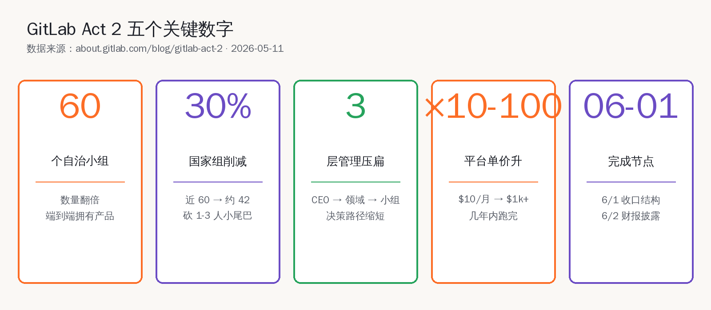
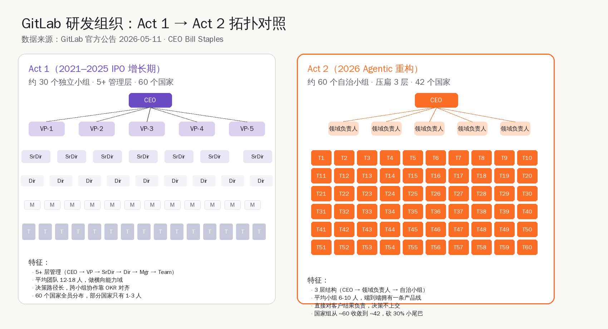
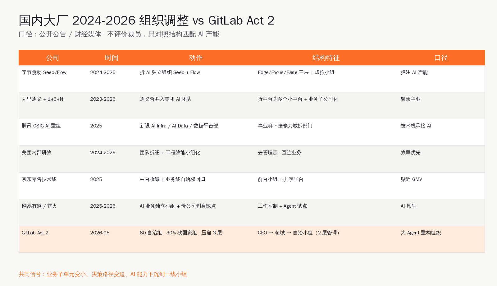
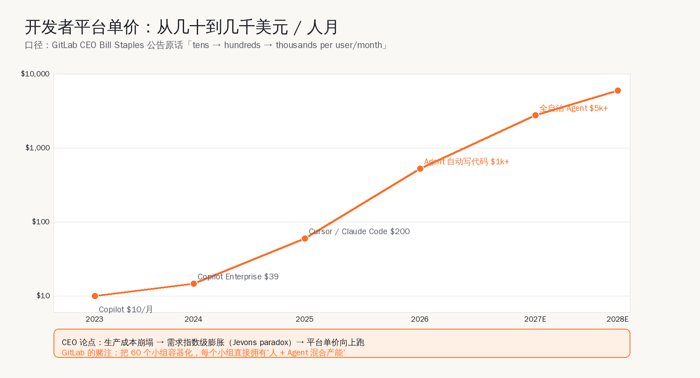
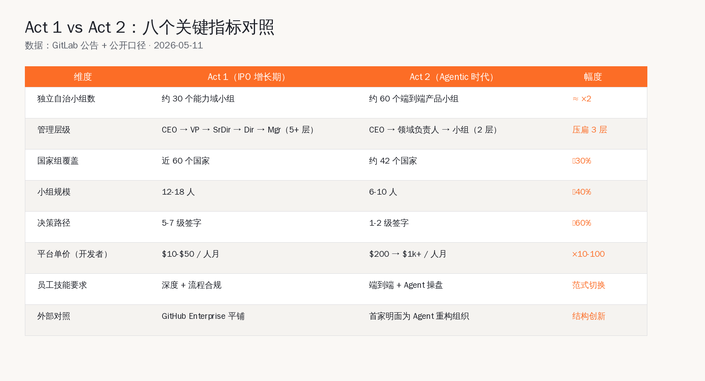
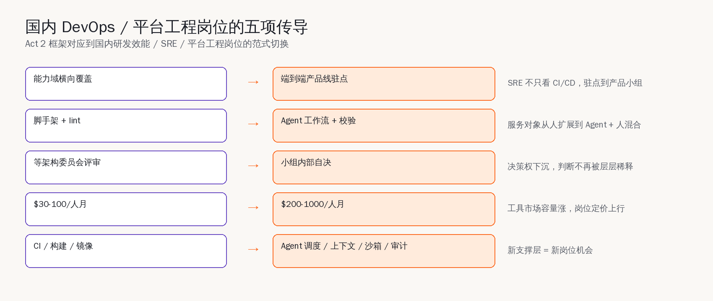

# GitLab Act 2：第一家公开说为 Agent 重构组织的硅谷公司

5 月 3 日那篇 `CTO Exodus`，咱们国内同行看到的是「Anthropic 拿 MTS 头衔挖技术一号位」的被动现象 —— Coinbase / Microsoft / Stripe 的 CTO 一个接一个走，行业默认的解读是「AI 把工程顶层抽空了」。这次想说的是另外一件事，方向完全反过来：**有公司主动把整套研发组织拆掉，明面上说'是为了承接 Agent 写代码的产能膨胀'**。这种事，在硅谷上市公司里，2026 年 5 月 11 日才出现第一例。

5 月 11 日盘后，GitLab CEO Bill Staples 在 `about.gitlab.com/blog/gitlab-act-2/` 发了公司战略第二幕公告，标题就叫 `GitLab Act 2`。Simon Willison 当天就转贴了 (`simonwillison.net/2026/May/11/gitlab-act-2/`)，挑出来的那段原话是：

> The agentic era multiplies demand for software. The constraint was the cost and time of producing and managing it. That constraint is collapsing.
>
> ——「Agent 时代让软件需求成倍增长。过去的瓶颈是生产和管理软件的成本与时间，这个瓶颈正在崩塌。」

国内媒体当晚翻成了「GitLab 大重组」「人员收缩」之类的标题，路径熟到不能再熟。咱们这篇不走这个叙事 —— 写另一件更值得做平台工程 / DevOps / SRE 的同行琢磨的事：**Bill Staples 给出的组织结构方案，到底长什么样，为什么说这是行业第一次明面上'为 Agent 重构组织'，国内字节 / 阿里 / 腾讯 2024-2026 那一轮组织调整里有没有一样的信号**。

把所有数字摆在前面：研发口拆成约 60 个自治小组（独立小组数量翻倍）；国家组从近 60 个收敛到约 42 个（砍 30% 小尾巴）；压扁 3 层管理（CEO → 领域负责人 → 自治小组，2 层级签字到底）；6 月 1 日前完成新结构定型，6 月 2 日财报披露最终范围与财务影响；CEO 公开口径里，开发者平台单价从去年的「几十美元 / 人月」走到今年的「几百美元 / 人月」，未来朝「几千美元 / 人月」走。

这五个数字单看每一个都不稀奇。稀奇的是它们被一起摆出来作为同一个动作的支撑，并且 CEO 在公告里反复强调一句话 ——「This is not an AI optimization or cost-cutting exercise（这不是 AI 优化或省成本行动）」。这是 Act 2 这次组织手术和过去十年所有「大厂砍人」的根本分界线。

## 一、Bill Staples 公告原话：四句锚定 Act 2 战略

为了避免被二手媒体的叙事带偏，先把 CEO 公告里被多次复读的四句话原话摆出来，这是后面所有分析的锚点。

第一句，定义动作类型：

> Software will be built by machines, directed by people.
>
> ——「软件由机器写，由人指挥。」

第二句，定义需求面：

> The agentic era multiplies demand for software.
>
> ——「Agentic 时代让软件需求成倍增长。」

第三句，定义价格趋势：

> Last year, the developer platform market used to be measured in tens of dollars per user per month, this year it is hundreds per user per month and headed to thousands.
>
> ——「去年开发者平台的单价是几十美元 / 人月，今年是几百，正在朝几千走。」

第四句，定义这次手术的性质和心态：

> I want to do this once, and do it right, and not revisit our structure anytime in the foreseeable future.
>
> ——「我希望一次做完做对，可见的未来里不再动结构。」

四句话连起来读，CEO 想传达的核心逻辑非常直白：**需求面在膨胀，单价在抬，所以现在不是缩规模的时候，是把组织重新装到一个能承接需求和价格双爆发的容器里**。这个容器叫 60 个自治小组、2 层管理、42 个国家组、端到端拥有客户结果。

## 二、组织拓扑：Act 1 树状深结构 → Act 2 扁平蜂巢

Act 1 的 GitLab 组织长什么样？2021 年 IPO 之后的几年里，它的研发口大致是这个形态：CEO 下面是若干 VP（产品 / 工程 / DevSecOps / 销售 / 客户成功 / 安全等），VP 下面是 Senior Director、Director、Manager，最底层才是真正写代码的小组。从 CEO 到一线工程师，平均 5 到 7 层签字。每个小组平均 12 到 18 人，做的是「横向能力域」 —— 比如「CI Runner 内核组」「鉴权组」「GitLab Pages 组」 ——大家各自负责一段能力，跨小组协作靠 OKR 对齐和半年度规划。

Act 2 的拓扑变了。CEO 下面直接是「领域负责人」一层（公告里叫 `Domain Leaders`），领域负责人下面就是约 60 个端到端自治小组，每个小组 6 到 10 人。从 CEO 到一线 2 层管理签字到底，决策路径砍掉了 3 层。

更关键的不是层数，是**小组的职能定义**变了。Act 1 的小组按「能力域」切，Act 2 的小组按「端到端产品线」切。一个 Act 2 自治小组会同时包含：产品经理、设计、前后端工程师、SRE / 平台工程师、Agent 操盘手（公告里叫 `agent operators`，是一个新出现的岗位类型）、商业化对接人。这种切法的好处是单个小组就是一个最小可独立交付的业务单元，决策不需要跨小组同步。

这个变化用国内同行更熟悉的话讲：**从「中台 + 前台」结构切换到「子公司化的单元自治」结构**。阿里 2023 年「1+6+N」改革的逻辑也是这个 —— 把横向中台拆掉，业务集团各自拿回自治权。区别在于阿里的「1+6+N」是为了应对集团治理和上市需求，GitLab 的 60 自治组是为了承接 Agent 写代码带来的产能膨胀。

为什么 Agent 时代需要这种拓扑？Bill Staples 在公告里给的解释是：当一条产品线的代码产能从「一个 10 人小组写 6 个月」变成「一个 6 人小组 + 若干 Agent 在 2 周内写完」，决策的速度必须跟上产能的速度。**5 层管理签字的流程在过去是质量保证，在 Agent 时代是产能瓶颈本身。**

## 三、为什么国家组要砍 30%

GitLab 是 all-remote 公司的代表 —— 全球 60 多个国家都有员工，传统上这是它的招聘和品牌优势。这次砍 30% 的国家组，公告里说得很直白：「在我们运营的将近 60 个国家中，有相当一部分国家只有 1 到 3 名员工，这种规模在协作上、合规上、税务上都很难维持。」

这是 Act 1 全球扩张期的副产品。IPO 之前为了把品牌渗透到尽可能多的市场，GitLab 会因为「一个高级工程师恰好住在那」而在某个国家开账户、走当地税务和合规。Agent 时代来了之后，这种「碎片化分布」的代价远大于收益 —— 单个国家 1-3 人的合规成本、税务申报成本、跨时区协作成本，远超那 1-3 人能产生的工程产出。

砍到 42 个国家组之后，GitLab 仍然是 all-remote 公司，但分布会向工程产出密度高、税务和合规成本可控的国家收敛。

这件事的国内对照其实很多。字节跳动 2024 年起把若干海外小据点收编，把工程产能向新加坡 / 北美湾区 / 上海 / 北京几个高密度节点集中；阿里通义 2025 年把分散在多个 BU 的模型小组合并入集团统一的 AI 团队；腾讯 CSIG 2025 年新设 AI Infra 部、AI Data 部、数据计算平台部，把分散在事业群下的能力按维度重新切分；网易雷火 / 有道把 AI 业务单独拎成工作室制小组，独立运营。

口径上的共同信号很清楚 —— **业务子单元变小、决策路径变短、AI 能力下沉到一线小组**。区别在于国内大厂的官方公告会把动作包装成「聚焦主业」「提升效能」「押注未来」，GitLab 是直白说「为 Agent 重构组织」。

## 四、压扁 3 层管理：决策速度跟上产能速度

Act 2 公告里关于管理层的描述用词非常具体：「在某些职能部门，我们将移除多达 3 层管理结构，让领导更接近一线工作」。把这句话翻译到日常协作语境里 —— 过去一个一线工程师提出「我想做这个功能」，需要经过 Manager → Director → Senior Director → VP → CEO 这套流程，每一层都有自己的优先级排序、半年规划、KR 完成度需要照顾。一个简单决策从提出到落地，平均 2 到 4 周。

Act 2 想做到的是 1 到 2 天。一线小组对客户结果直接负责，领域负责人只在小组之间的资源协调和边界冲突上才介入。日常的产品决策、技术决策、招聘决策、外包决策，小组内部完成签字。

这件事说起来容易做起来难。咱们国内做平台工程的同行都知道，**压扁管理层的真正难点不是少几个 VP 头衔，是怎么让一线小组同时具备「业务判断 + 技术判断 + 资源调度」的能力**。Act 1 时代这三项能力是分到不同管理层的 —— VP 看业务、Director 看技术栈、Manager 看资源调度。Act 2 一锅端到 6-10 人小组里，要求每个小组里至少有 2-3 个能做完整三项判断的资深成员。

这对人才结构提出了非常具体的要求：**少而精，高密度高带宽**。这也是为什么 Act 2 同步会调整薪酬结构 —— 公告里提到「会把节省下的大部分预算重新投入到核心员工的留存和升级上」。

## 五、平台单价：从 $10 到 $1k+，谁在为这个曲线买单

Bill Staples 公告里最具体的商业判断是这一段：**去年 $10-$50/人月，今年 $200/人月，未来几年向 $1k+/人月走**。这个曲线是支撑整个 Act 2 战略的核心商业假设。

把这个曲线和实际市场对一对会发现它并不夸张。2023 年 GitHub Copilot 的标准订阅是 $10/人月、企业版 $19/人月；2024 年 Copilot Enterprise $39/人月、Cursor Pro $20/人月；2025 年 Cursor Business / Claude Code Pro / Windsurf 等专业版集中在 $50-$200/人月区间，Claude Code Max 套餐已经摸到 $200/人月；2026 年开始陆续有「按 Agent 工时计费」的方案出来，按公开口径单个开发者覆盖一组 Agent，能跑到 $500-$1500/人月。

CEO 在赌的是「这条曲线还有 3-5 年的上行空间」。逻辑是 Jevons 悖论 —— 生产成本崩塌（写代码越来越便宜）会带动总需求的爆发（需要写的代码越来越多），代码生产工具的总市场份额会扩大，单价反而会因为「附带的 Agent 算力 + 模型 token 成本」拉高。这个判断 Simon Willison 也认同，他在转贴里说「这是 GitLab 财务激励驱动的 Jevons-paradox-inspired hope，但论点本身站得住」。

国内对位的判断曲线长什么样？咱们做 DevOps / SRE 工具的同行能直接对照 ——

- **字节火山引擎 + 豆包 + Trae** 的开发者套件目前还在「让你用起来」的拉新期，单价主力在 $0-$50/人月（很多还是免费额度）；
- **阿里通义灵码 + 千问** 的企业版进入 $30-$100/人月区间；
- **百度 Comate** 在 ¥150-¥500/人月（折合 $20-$70）；
- **腾讯云 CodeMaker** 集成在腾讯云生态里，按月配额 + 调用量计费，单开发者综合成本接近 $30-$80。

国内单价比海外低一个数量级。但 Bill Staples 的曲线如果在海外跑通，国内厂商会有 12-18 个月的时间窗口跟进 —— 这件事对国内做研发效能 / 平台工程的工程师是好消息，意味着工具市场的容量会涨，岗位的商业价值会被重新定价。

## 六、Act 1 vs Act 2 八指标对照

把 Act 1 和 Act 2 拆成 8 个具体维度对照：

| 维度 | Act 1（IPO 增长期） | Act 2（Agentic 时代） | 幅度 |
| --- | --- | --- | --- |
| 独立自治小组数 | 约 30 个能力域小组 | 约 60 个端到端产品小组 | ≈ ×2 |
| 管理层级 | CEO→VP→SrDir→Dir→Mgr（5+ 层） | CEO→领域负责人→小组（2 层） | 压扁 3 层 |
| 国家组覆盖 | 近 60 个国家 | 约 42 个国家 | −30% |
| 小组规模 | 12-18 人 | 6-10 人 | −40% |
| 决策路径 | 5-7 级签字 | 1-2 级签字 | −60% |
| 平台单价（开发者） | $10-$50 / 人月 | $200 → $1k+ / 人月 | ×10-100 |
| 员工技能要求 | 深度 + 流程合规 | 端到端 + Agent 操盘 | 范式切换 |
| 外部对照 | GitHub Enterprise 平铺 | 首家明面为 Agent 重构组织 | 结构创新 |

最值得国内同行关注的是「员工技能要求」这一行。Act 1 时代 GitLab 招的是「精通 Go / Ruby / Vue / Kubernetes 的资深工程师」；Act 2 招的是「能同时操盘 3-5 个 Agent 完成端到端交付、对客户结果负责、有产品判断能力的复合型工程师」。这是岗位定义层面的范式切换。

## 七、为什么这件事和国内 DevOps / 平台工程岗位有关

讲到这里有必要把视角收回国内。咱们做 DevOps / SRE / 平台工程 / 研发效能的工程师，过去几年大家的岗位定义大致是「保障 CI / CD pipeline 稳定 + 优化构建速度 + 维护内部工具链 + 推广最佳实践」。这一套岗位定义在 Act 1 时代是合理的 —— 大公司有 5-7 层管理结构，平台工程需要服务那个结构。

Agent 时代来了之后，这套岗位定义会怎么变化？参照 GitLab Act 2 给的答案：

**第一，岗位会从「能力域横向覆盖」转向「端到端产品线驻点」**。一个 SRE 不再只看 CI/CD，他会驻点到一个具体产品小组里，跟产品经理、工程师、Agent 操盘手一起，对一条产品线的可用性、性能、成本端到端负责。

**第二，「Agent 操盘手」会变成研发效能岗位的子类**。过去咱们做研发效能是给人写脚手架、写 lint 规则、写 CI 模板。未来会给 Agent 写工作流、写校验规则、写降级策略 —— 本质都是「平台工程」，但服务对象从「人类工程师」扩展到「Agent + 人类工程师混合产能」。

**第三，决策权会下沉**。Act 2 把 5 层管理压成 2 层之后，平台工程小组的决策权会从「等架构委员会评审」变成「小组内部自决」。这对资深平台工程师是利好 —— 你的判断会被直接采纳，不再被层层稀释。

**第四，单价提升对岗位薪酬有传导**。开发者平台单价从 $10 涨到 $1k+，国内研发效能岗位的薪酬中位数有相应的上行空间。当然这个传导需要 12-18 个月时间窗口，且需要国内厂商把产品做到能匹配单价的程度。

**第五，'人 + Agent 混合产能'要求平台工程提供新的支撑层**。过去咱们做内部平台，主要是给人类工程师提供 CI、构建缓存、依赖镜像、镜像仓库这些基础设施。Agent 时代要新增的支撑层包括：Agent 调度（多个 Agent 之间的工作流编排）、上下文管理（让 Agent 不用每次都重新读完整个代码库）、安全沙箱（防止 Agent 执行越权操作）、产出审计（让人类工程师能快速 review 大量 Agent 生成代码）。这五项每一项都是新的平台工程子方向，对应新的岗位机会。

## 八、CTO Exodus 和 GitLab Act 2 是同一件事的两面

回到开篇那篇 5 月 3 日的 `CTO Exodus`。当时观察到的是 Coinbase / Microsoft / Stripe 等公司 CTO 一个接一个被 Anthropic 用 MTS 头衔挖走，这是「人才流动」层面 AI 重塑工程顶层的信号。GitLab Act 2 是「组织结构」层面的同一件事 —— **顶层管理岗位的价值在 Agent 时代被重估，多余的中间层会被压扁，节省下来的预算会重新分配给真正的复合型核心员工**。

两件事方向一致：

- CTO Exodus：传统大公司的工程顶层岗位含金量下降，AI 公司用更高薪资 + 更扁平的结构挖走头部人才；
- GitLab Act 2：传统大公司主动把自己的工程组织扁平化，把中间层的预算转移给一线核心员工。

差别在于 CTO Exodus 是被动的（人才流失），Act 2 是主动的（组织自我手术）。Bill Staples 选了第二条路 —— 我不等人才被挖走，我先把组织结构调整到能留住核心人才、能匹配 Agent 产能的形态。

这种主动性是 Act 2 真正值得国内同行学习的部分。**国内大厂过去几年的组织调整，大多数被外界解读为「降本」叙事 —— 减员、合并、关 BU**。Bill Staples 的 Act 2 把同样的动作（减国家组、压管理层、并团队）讲出了一个完全不同的叙事 —— 不是降本，是为了承接下一波产能膨胀的容器扩容。

国内字节、阿里、腾讯实际上做的事和 Act 2 高度相似 —— 拆中台、做小组、压扁层级、把 AI 能力下沉。差别在于叙事 —— 国内的官方口径更偏「合规 + 财务 + 战略聚焦」，GitLab 的口径直接是「Agent 时代」。叙事差别背后是上市公司治理结构的差别 —— GitLab 作为美股公司可以把 Agent 时代这种长期判断直接讲给投资人，国内 BU 调整的官方口径要顾及更复杂的多边期待。

## 九、6 月 1 日完成、6 月 2 日财报披露 —— 接下来 3 周的看点

公告里给的时间线非常紧凑：

- 5 月 11 日（已发生）：CEO 公告 Act 2 整体方向
- 5 月 12 日 - 6 月 1 日：内部完成新结构定型、岗位映射、薪酬调整、人才安置
- 6 月 1 日：新结构正式生效
- 6 月 2 日：Q1 财报 + Act 2 最终范围 + 财务影响披露
- 6 月 10 日：GitLab Transcend 大会公布 Agent 产品路线图

国内做 DevOps 工具、平台工程、研发效能的同行，接下来 3 周可以重点看这几个点：

**第一，6 月 2 日财报披露之后，看 Act 2 实际的人员变动数和省下的现金流口径**。这两个数据会回答一个问题 —— Bill Staples 说的「不是降本」是真还是包装。如果省下的现金流大部分确实重新投入研发，CEO 的叙事就站得住；如果大部分进了利润口径，那这场重组的实质就和过去几轮硅谷规模收缩没区别。

**第二，6 月 10 日 Transcend 大会看新产品路线图**。Act 2 的组织结构是为承接什么样的产品形态设计的？60 个自治小组每个小组负责一条端到端产品线，那么 GitLab 下一代产品会从单一 DevSecOps 平台变成 60 条独立产品线吗？还是 60 条小线最终拼装成一个更大的 Agent 操作系统？这个答案直接决定 GitLab 接下来 3 年的产品长什么样，也决定 GitHub / Bitbucket / Codeberg / Gitee 这些竞品要不要跟进。

**第三，看国内厂商的回应**。Bill Staples 这一手公开把「为 Agent 重构组织」摆到桌面之后，国内字节火山引擎 / 阿里通义 / 腾讯云 CODING 这些做 DevOps 平台的团队大概率会内部讨论是否要跟进类似动作。咱们国内同行能看到的第一波信号会是公开的招聘 JD 变化 —— 如果国内厂商开始在 JD 里写「端到端小组」「Agent 操盘手」「产品线全栈负责」这类岗位定义，说明 Act 2 的范式开始本地化扩散。

**第四，看 GitHub、Atlassian、Bitbucket 这些直接竞品的反应**。GitHub 在 Copilot Workspace 和 Coding Agent 上已经投了 2 年，组织上还是微软体系的传统事业部结构；Atlassian 的 Rovo Agent 也在 2025 年起加力。它们会不会跟进 60 自治组这种激进结构？大概率不会一比一抄，但可以预期接下来 2-3 个季度财报上能看到「按产品线重组事业部」「按 Agent 工作流拆小组」这类官方口径出现。GitLab 抢跑 Act 2 这一手，会给行业先树一个范式参考。

## 十、Agentic 时代多了一种「公司形态」的可能性

Act 2 这件事本身的技术含量不高 —— 拆小组、压管理层、收国家组，所有动作都是过去 30 年硅谷管理学教材里反复写过的。值得记住的是 Bill Staples 这次公开承认的事情：**Agent 时代不是「让现有公司继续运转得更高效」，是「让公司形态本身被重新设计」**。

这是一个很积极的信号。它意味着 Agentic 时代不是「人类被 Agent 替代」的零和故事，而是「人类组织结构因为 Agent 产能扩容而必须升级」的扩张故事。在这个故事里，能写代码的工程师、能操盘 Agent 的工程师、能拥有端到端产品线的工程师，价值会被重估到更高。

咱们国内做 DevOps / 平台工程 / 研发效能的工程师，处在这个故事的正中间。字节、阿里、腾讯、美团、京东这几年做的小组化、扁平化、AI 下沉，是同一条路径的国内版本。Bill Staples 的 Act 2 给了一个公开的、可以被引用的、来自上市公司 CEO 的叙事框架 —— 这个框架对国内同行最大的价值是它把「为什么我们应该这样调整」讲明白了，不只是「降本增效」的官方话术。

接下来 3 周，6 月 2 日财报、6 月 10 日 Transcend 大会会给出 Act 2 是真改革还是包装重组的答案。咱们继续盯着。

---

**主要来源**：
- Simon Willison 2026-05-11 转贴 ([simonwillison.net/2026/May/11/gitlab-act-2/](https://simonwillison.net/2026/May/11/gitlab-act-2/))
- GitLab Act 2 官方公告 2026-05-11 ([about.gitlab.com/blog/gitlab-act-2/](https://about.gitlab.com/blog/gitlab-act-2/))
- 国内对位资料：21 经济报道 / 虎嗅 / 53AI / 华尔街见闻 2024-2026 期间字节 / 阿里 / 腾讯 AI 组织调整公开报道
