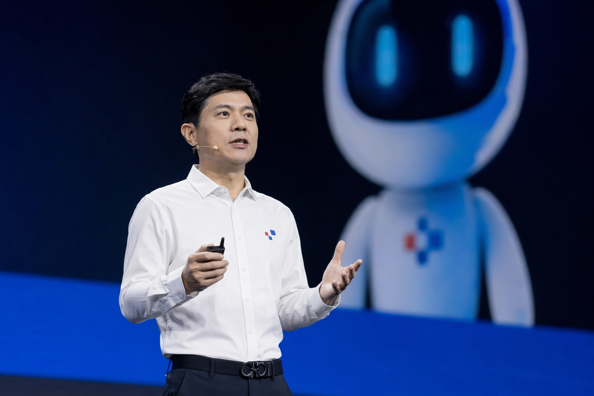
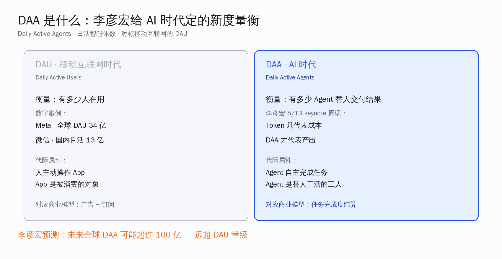
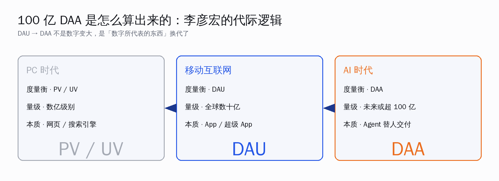
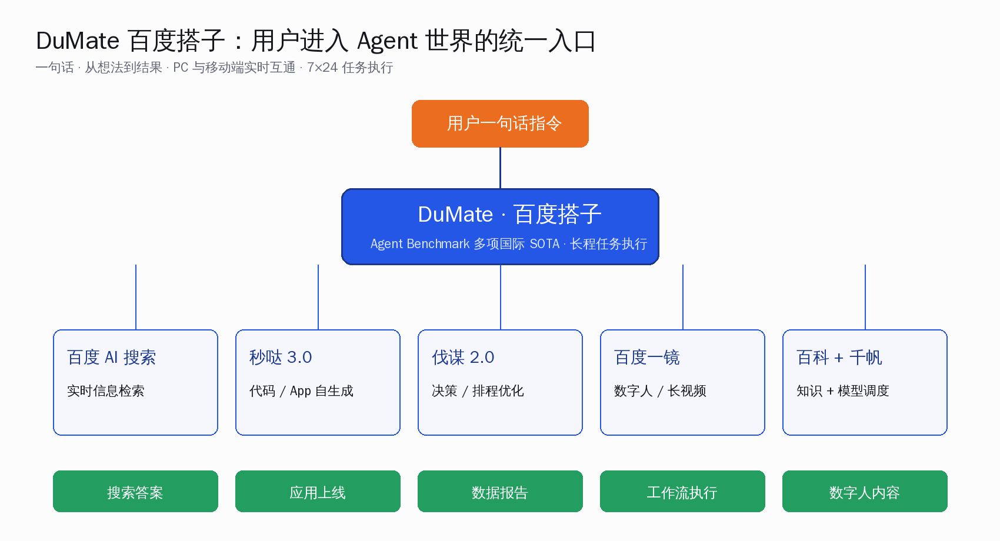
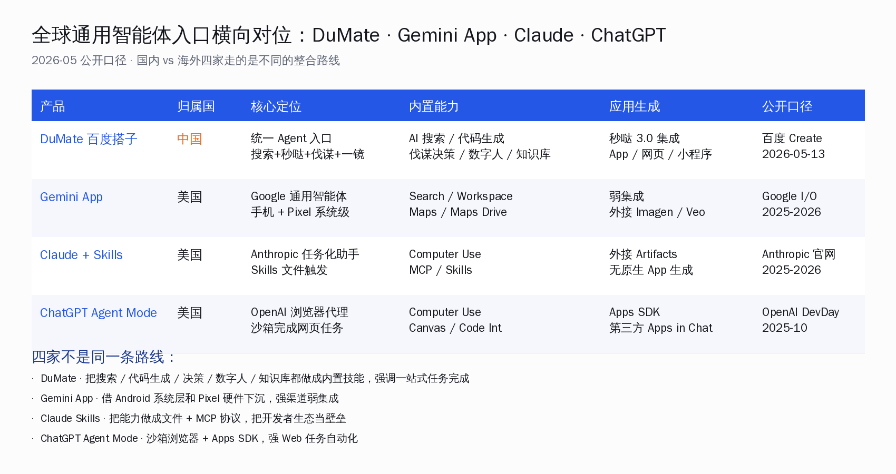
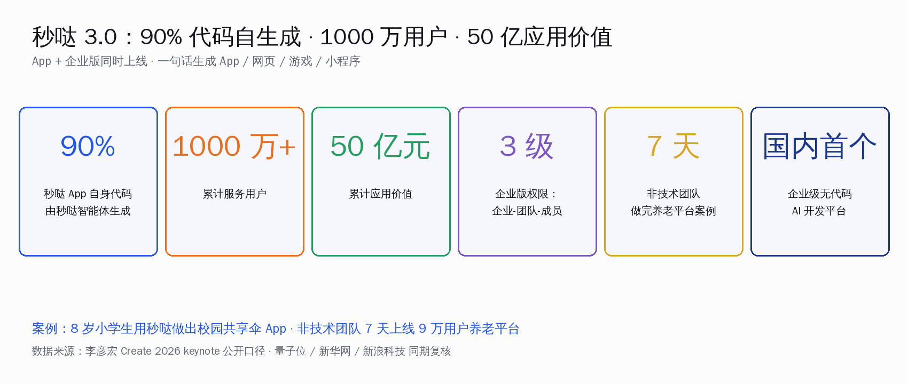
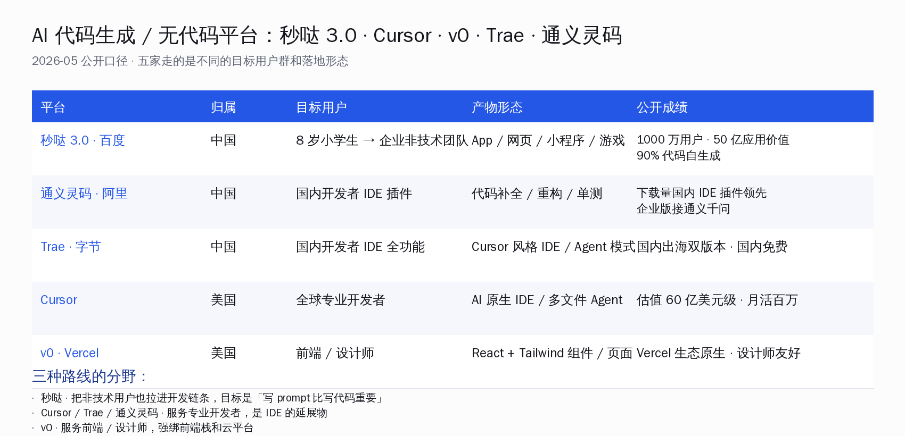
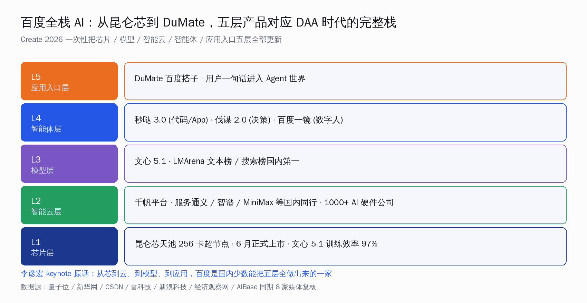

# AI 时代不再算 Token，李彦宏改算 DAA

> 5 月 13 日，北京。百度 Create 2026 开发者大会上，李彦宏在开幕 keynote 里抛出了一个新词：**DAA · 日活智能体数**。同一句话里他给这个词配了一组判断——Token 只代表成本不代表收益，DAA 才是 AI 时代真正的度量衡，未来全球 DAA 可能超过 100 亿。这是国内一线 AI 公司第一次正面把"AI 时代该用什么尺子量"这件事摆到台面上。同场发布的通用智能体 DuMate（百度搭子）、秒哒 3.0、伐谋 2.0、文心 5.1 与昆仑芯天池 256 卡超节点，整套是用来证明这把尺子能立起来的实物。

过去两年，国内同行讨论 AI 公司值不值钱，绕来绕去的核心数字就是 token——一个模型一天烧多少 token、卖多少 token、毛利率几个点。token 是 OpenAI 早期把大模型说成"通用工具"时留下来的口径，被所有云厂商和模型公司沿用至今，连国内招股说明书里都开始把 token 调用量当增长曲线。**问题是 token 这把尺子，量的是耗电不是干活**——一个模型反复在内部 think、最后输出 5 个字交付一份报告，烧的 token 没准是只输出结果的 100 倍，谁付钱、付多少、值不值，token 这把尺子里看不见。

**5 月 13 日北京，李彦宏在 Create 2026 大会上把这件事说穿了。** 他在 keynote 原话是："Token 只代表成本，并不代表收益，衡量的是投入，而不是产出。"紧接着他抛出 DAA：**Daily Active Agents · 日活智能体数**——衡量"有多少 Agent 在给人类干活、并交付结果"，对标移动互联网时代的 DAU，并预测全球 DAA 未来可能超过 100 亿（[量子位 5 月 13 日头条](https://www.qbitai.com/2026/05/416762.html)、[新华网同期报道](http://www.news.cn/info/20260513/5c28f6e56ef3497e81fa7d0106e5c12d/c.html)、[新浪科技分析](https://finance.sina.com.cn/tech/roll/2026-05-13/doc-inhxtqxr4637509.shtml)，三家公开口径一致）。

**这件事的意义不在"百度又开了一次发布会"，而在它把 AI 商业模型的尺子换了一把。** 国内开发者过去两年苦的是同一件事——做了一个能跑的 Agent，老板问"这玩意儿赚多少钱"，答 token 数会被问"那毛利呢"、答 API 调用次数会被问"那粘性呢"，没有一把对得上口的尺子。李彦宏把 DAA 摆出来，是在国内 AI 行业第一次给"AI 时代的 GDP"投了一票——**算被替代掉的工作量，不算烧掉的算力**。

本文围绕一个核心论点展开：**AI 商业模型的尺子，正从"算 Token 卖算力"换成"算 DAA 卖任务完成度"——这是国内一线 AI 公司第一次正面立这件事**。围绕这个核心，本文回答四个问题：

- DAA 这把尺子和 DAU、Token 的本质区别在哪、为什么李彦宏说它配得上"AI 时代度量衡"；
- DuMate（百度搭子）这个通用入口长什么样，和 Google Gemini App / Claude Skills / ChatGPT Agent Mode 比怎么定位；
- 秒哒 3.0 把非技术用户拉进开发链条意味着什么，和国内 IDE 路线（通义灵码 / Trae）+ 海外 Cursor / v0 的分野在哪；
- 百度从昆仑芯到 DuMate 这五层全栈，给国内开发者留下了哪几个能直接接的口子。

## 一、DAA 是什么：把"AI 时代的 GDP"摆到台面上

先把这把尺子拆开看。**DAU**（Daily Active Users）量的是有多少人在主动用 App，量级目前最高的是 Meta 全球 34 亿 DAU、微信国内月活 13 亿。这把尺子在移动互联网时代撑了 15 年——App 是被消费的对象，人主动操作，对应的商业模型是广告和订阅。**Token** 量的是模型一天烧了多少计算单位，对应的是云厂商和模型公司的成本——它能算清楚一份 PPT 生成花了多少算力，但回答不了"这份 PPT 替谁完成了几个工时的活"。

**DAA 量的是另一件事——有多少个 Agent 在替人交付结果**。李彦宏在 keynote 里给的对标很直接：DAU 对应"有多少人在用"，DAA 对应"有多少 Agent 在干活"。从代际逻辑上看，三把尺子是这样接续的：

- **PC 时代 · PV / UV** — 网页是被消费的对象，量的是点击量和访问数，数亿量级。
- **移动互联网 · DAU** — App 是被消费的对象，人主动操作，全球数十亿。
- **AI 时代 · DAA** — Agent 是替人干活的工人，量的是任务完成数，未来或超 100 亿。

100 亿这个数字往大说不夸张。**地球人口 80 亿、每个人配 1 个常用 Agent 就接近 100 亿，配 5 个就过 400 亿**——而日常生活里一个人同时跑的 App 就经常超过 5 个，未来跑 5 个 Agent 不是难题。难的是另一件事——**这 100 亿个 Agent 谁来付钱**。Token 模型里付钱的是用算力的那一方，DAA 模型里付钱的是要交付结果的那一方——后者更接近真实价值流动。这两年国内同行在 SaaS、AI Coding、Agent 落地上的所有讨论，其实都在等这件事：**有没有一把尺子，能把"被替代掉的工作量"算成生意**。

李彦宏在 keynote 里给了一个上下文里很关键的判断："衡量一个平台和生态的繁荣，更应该看的是 DAA 这个指标。"这句话往下抠一层——百度自己也在用这把尺子要求自己。秒哒一年累计 1000 万用户、50 亿应用价值的数字，正是按 DAA 逻辑算出来的"被替代掉的工作"——不是 SaaS 订阅费、不是云算力计费，而是替企业内非技术团队完成的开发工作量化估值。

**这件事对国内开发者意味着什么？** 至少有三层判断：

- **找融资 / 写商业计划书的同行**：写 token 用量数据增长曲线，已经过时了。写 DAA、写"我的 Agent 一天替企业完成多少笔出库、多少份合同审核、多少条客服工单"，这是 2026 年开始投资人愿意听的故事。
- **企业内做 AI 落地的工程师**：跟老板汇报"我们部署了 Claude / 通义 / Kimi"没意义，汇报"我们部署的 Agent 一天替运营团队完成了 800 笔订单审核"，老板才点头。DAA 是给企业内 AI 落地负责人也准备的尺子。
- **做 Agent 平台的同行**：API 调用次数 / 月活开发者数量，这两个老指标 2026 年正在让位给一个新指标——日活 Agent 数。同行在哪个尺子上跑得快，资本市场就投谁。

李彦宏这次还顺便扔了一个判断："Token 不一定代表终局"——这句话是说给 OpenAI 听的，也是说给国内的同行听的。**国内 AI 公司过去两年讲故事讲累了 token 模型，现在终于有人正面立了另一把尺子。** 立得起来不一定靠百度一家，但至少国内行业的对话节奏，从此可以围着 DAA 转。

## 二、DuMate：百度想做的"AI 时代统一入口"长什么样

DAA 这把尺子摆出来后，需要一个东西来承载——一个能让普通用户一句话就生成 Agent、并且让 Agent 替自己干活的入口。**DuMate（百度搭子）就是百度给这把尺子配的"入口产品"**。

李彦宏在 keynote 给 DuMate 的定位是这么一句："一句话，实现从'想法'到'结果'自动执行。" 听起来像营销，但拆开看技术架构其实很清楚：DuMate 是一个中枢，下面挂着 5 项内置技能——百度 AI 搜索 / 秒哒 3.0 / 伐谋 2.0 / 百度一镜 / 百科与千帆模型调度，由 DuMate 自己负责任务分解、技能调用、长程执行。**PC 端和移动端实时互通**——这是百度在工程上的小心思，意思是用户在公司电脑上让 DuMate 执行一个 4 小时的市场调研任务，离开公司用手机也能接着看进度、追加指令，**"7×24 小时 AI 助手陪伴"** 这句话不是话术，是把任务态从设备绑死改成账号绑死。

DuMate 公开口径里有两条硬指标：

- **多项国际权威 Agent Benchmark 达到 SOTA**（公开口径未列具体榜单名字 — 量子位、CSDN、雷科技三家复核口径一致，本文按公开口径转述，不外推具体榜单。）
- **能力清单**：搜索、编码、深度研究、数据分析、应用创建（[新华网 5/13 报道](http://www.news.cn/info/20260513/5c28f6e56ef3497e81fa7d0106e5c12d/c.html) / [量子位 5/13 头条](https://www.qbitai.com/2026/05/416762.html)）

把 DuMate 和海外几家通用智能体放在一起对位，会发现一件有意思的事——**大家走的不是同一条路线**。

四家通用智能体入口的分野，简单一句话总结：

- **DuMate · 百度（中国）** — 把搜索 / 代码生成 / 决策 / 数字人 / 知识库全做成内置技能，**强调"一站式任务完成"**。优势是百度自有产品矩阵完整、能力之间内部耦合度高；约束是封闭生态——目前还没看到给第三方 Agent 开放接入。
- **Gemini App · Google（美国）** — 借 Android 系统层和 Pixel 硬件下沉，**强渠道弱集成**。Search / Workspace / Maps / Drive 这些 Google 自家服务接得最深，但 App 内的"任务自动执行"目前还偏轻。
- **Claude + Skills · Anthropic（美国）** — 把能力做成 Skills 文件 + MCP 协议，**把开发者生态当壁垒**。Computer Use 和 Skills 在 dev 圈口碑很好，但没有原生 App 生成、没有数字人这类 C 端门面。
- **ChatGPT Agent Mode · OpenAI（美国）** — 沙箱浏览器 + Apps SDK，**强 Web 任务自动化**。Agent Mode 能在网页上完成实际操作，Apps SDK 允许第三方 Apps in Chat。

**国内开发者最直接的判断是这样**：DuMate 是国内目前能力清单最完整的一家通用智能体入口——搜索 + 代码生成 + 决策 + 数字人 + 知识库五样都自有，这件事在国内只有百度做齐了（阿里通义体系也接近，但通义灵码 / 通义 App / 千问 chat 散在不同入口、还没整合）。**对于做 to-C Agent 应用的国内同行，DuMate 的价值是"统一入口"，对于做 to-B Agent 应用的国内同行，DuMate 内嵌的伐谋 2.0 和秒哒 3.0 是直接能调的能力底座。**

一个工程上的细节值得国内同行记下：DuMate 强调"任务态实时同步"。意思是 PC 启动一个 Agent 任务，手机端立刻能接力——这件事看似工程小事，其实是 Agent 长程任务能不能从"演示"走到"日常"的关键。**移动设备很容易掉电、关页、切换网络，要把一个 4 小时的市场调研任务一直挂在后台执行，必须有"任务状态服务端持有 + 多端实时同步"的工程能力。** 这一层做扎实，DAA 这把尺子才能不被"中途断掉"的任务数稀释。

## 三、秒哒 3.0：把非技术用户拉进开发链条这件事

秒哒 3.0 是这次 Create 2026 大会上数字最硬的一个产品。先把六个数字摆开看：

- **90% 代码自生成** — 秒哒 App 自身 90% 的代码由秒哒智能体自动生成。
- **1000 万+ 用户** — 累计服务用户数。
- **50 亿元应用价值** — 累计帮用户创造的经济与效率价值。
- **3 级权限** — 企业版的「企业-团队-成员」分层权限模型。
- **7 天** — 一个非技术团队用秒哒做出 9 万用户养老平台的实测时间（[网易科技 5/13 现场报道](https://www.163.com/dy/article/KSRESU3U0511DSSR.html)）。
- **国内首个** — 企业级无代码 AI 开发平台公开口径（[扬子晚报 5/13 报道](https://www.yangtse.com/news/kj/202605/t20260513_352444.html)）。

这几个数字之间的关系值得拆一遍。**90% 代码自生成不是营销话术，它是秒哒 3.0 的内部"狗粮"指标**——一个用 AI 代码生成做产品的公司，自己的 App 90% 都不是工程师手写的，才有底气把同样的能力卖给客户。**1000 万用户 / 50 亿应用价值是 DAA 模型的初步验证**——按李彦宏立的 DAA 尺子，秒哒过去一年累计替用户完成了 50 亿元等值的开发工作。这个数字落到单用户头上，平均 500 元的应用价值——粗看不大，但秒哒上 8 岁小学生开发一个校园共享伞 App 这种长尾价值场景，本来就不是按企业级 SaaS 报价的。

秒哒 3.0 相对 2.0 的核心升级，按 Create 2026 keynote 公开口径，是三件事：

- **App 形态打通**：原来秒哒只能生成网页、游戏、小程序，3.0 加上原生 iOS / Android App（Android 已上线，iOS 在路上），并且支持自动打包和热更新（[网易科技 5/13 报道](https://www.163.com/dy/article/KSRESU3U0511DSSR.html)）。
- **移动端创建**：手机直接通过语音 / 文字输入生成 App、调试、发布全流程闭环（无需切回 PC）——李彦宏现场演示了一个手机直接生成的会议社交 App "Smart Circle"。
- **企业版 = 国内首个企业级无代码 AI 开发平台**：三级权限、多团队管理、资源隔离、SLA 保障、租户隔离、内容安全检测、运行时防护，把"AI 生成的应用能不能上生产"这件事正式做到企业可用。

把秒哒 3.0 放回国内外 AI 代码生成 / 无代码平台赛道里看，会发现它和 Cursor、Trae、通义灵码、v0 走的不是同一条路。

五家工具的目标用户和产物形态有明显分野：

- **秒哒 3.0（中国）** — 目标用户是 8 岁小学生 → 企业非技术团队，产物是 App / 网页 / 小程序 / 游戏，**把"会说话"放在"会写代码"前面**。这是国内第一家把"非程序员也能做 App"作为核心产品定位的大厂级平台。
- **通义灵码（中国）/ Trae（中国）/ Cursor（美国）** — 目标用户都是专业开发者，产物是代码补全 / IDE 形态——它们是 IDE 的延展物。三家差异在生态：通义灵码绑通义千问、Trae 绑火山方舟 + 国内 + 出海双版本（国内免费）、Cursor 绑 Claude / GPT 主流模型。
- **v0 · Vercel（美国）** — 目标用户是前端 / 设计师，产物是 React + Tailwind 组件 / 页面，强绑 Vercel 平台。

**三种路线的本质分野是这样**：秒哒走的是"把不懂代码的人也拉进开发链条"，Cursor / Trae / 通义灵码走的是"把懂代码的人提速 10 倍"，v0 走的是"前端 / 设计师专用工具"。**这三条路不是替代关系，是补充关系——它们对应着开发者群体扩大的三个不同方向**。

对国内开发者最直接的判断：

- **如果你是专业开发者**，秒哒 3.0 不是给你用的——Cursor / 通义灵码 / Trae 是给你用的。
- **如果你是企业内非技术团队负责人**（产品经理 / 运营 / 销售），秒哒 3.0 是 2026 年第一个值得认真试的国内平台，它直接解决了"想法到上线"的瓶颈，企业版的三级权限和 SLA 保障让 IT 部门不再卡。
- **如果你是创业者**，秒哒企业版的「应用价值结算」逻辑，是 DAA 模型在 B 端的第一个真实落地样本——把 50 亿应用价值拆到 1000 万用户头上，每个用户平均 500 元，这是一个能跑的单位经济。

值得国内同行单独记下的一件事：**李彦宏在 keynote 里讲秒哒 3.0 时提到一句"日抛型软件变得合理，市场可能被放大 10 倍"**。这句话其实在重新定义"App 的生命周期"——过去 App 要存活几年才回本，未来 App 可能存活几天就被替代，但市场总量因为生成成本骤降反而扩大 10 倍。这件事对应着 DAA 这把尺子的另一层含义——**Agent 时代不只是 Agent 数量变多，还可能是 App 数量变多 + App 寿命变短 + 总量被放大**。

## 四、百度全栈五层：国内同行视角对比能接的几个口子

Create 2026 这次大会的另一个亮点，是百度一次性把五层全栈产品都更新了一遍——这件事在国内同行里目前只有阿里能对位，但阿里的产品矩阵分散在通义、千问、夸克几个不同入口。**百度这次的整合度是国内目前最高的一家**。

按从底到顶的栈层看：

- **L1 · 芯片层** — 昆仑芯天池 256 卡超节点已点亮，6 月正式上市。文心 5.1 在昆仑芯全国产集群上完成训练，**有效训练率达 97%**——这是国产算力栈替代英伟达的关键工程指标（[CSDN 5/13 报道](https://blog.csdn.net/csdnnews/article/details/161049406)）。
- **L2 · 智能云层** — 千帆平台服务通义、智谱、MiniMax 等国内同行；公开口径已服务 **1000+ AI 硬件公司 + 30+ 具身智能企业**。
- **L3 · 模型层** — 文心 5.1 登 **LMArena 文本榜、搜索榜国内第一**（[雷科技 5/13 报道](https://www.leikeji.com/article/76700)）。
- **L4 · 智能体层** — 秒哒 3.0（代码 / App 生成） · 伐谋 2.0（决策 / 排程优化） · 百度一镜（数字人 / 长视频）三件套，覆盖 to-C / to-B 主要场景。
- **L5 · 应用入口层** — DuMate · 百度搭子，用户一句话进入 Agent 世界。

伐谋 2.0 这条线值得多说两句——它做的是国内同行最弱的一块，**决策 / 排程优化**。生产排程、物流规划、工艺优化三大场景，公开口径数字有两个：**全球首套码头智能管控系统 A-TOS 实现 10.21% 的绝对指标提升**、MLE-Bench评测**15 道最难题目中拿下 9 项第一**。决策智能这件事过去两年国内 Agent 公司讨论得不多，因为它对工业、物流、制造业的需求洞察要求很高、和大模型公司常规打法不接轨。**伐谋 2.0 把这一层补上，国内做 to-B AI 落地的同行第一次有了一个能直接调的决策能力底座**。

对国内开发者来说，这五层里**直接能接的口子**有以下几个：

- **L4 接 DuMate 内嵌能力** — 通过百度智能云 API 直接调用秒哒（代码生成）/ 伐谋（决策）/ 一镜（数字人），不必自建。
- **L3 接文心 5.1** — 千帆平台调用，LMArena 国内排名第一，对替换 OpenAI / Anthropic 模型的国内项目是直接选项。
- **L1 接昆仑芯** — 6 月天池 256 卡超节点上市后，国内做大模型预训练的团队多一个国产算力栈选项。
- **L2 接千帆平台** — 千帆原本就是国内开发者用得最多的模型云平台之一，这次升级后新增的 Agent 编排能力是新口子。

国内全栈五层都自有的好处是什么？**它让"国产 AI 栈替代海外栈"这件事，从"模型层替代"上升到了"五层联动替代"**。过去国内项目用海外模型 + 海外云 + 海外开发工具，现在可以全程跑在国内栈上——这对受出口管制约束的金融、政企、央国企客户尤其关键。**百度这次发布的整套，对国内 AI 自主可控这件事，是工程层面的一次集体推进**。

## 五、海外对位横评与国内 AI 行业的视角判断

把 DAA 这件事放在全球 AI 行业的脉络里看一遍，更能看清楚百度这次的位置。

**海外四家通用智能体平台的现状**：

- **Google Gemini App** — 2025 I/O 后下沉到 Android 系统层和 Pixel 硬件，是渠道最强的一家。但 Google 内部对"Agent 这件事到底是 App 形态还是 OS 形态"的判断还在摇摆，Gemini App 的"任务自动执行"做得不深。
- **Anthropic Claude Skills** — 把 Agent 能力做成文件级的 Skills 触发，加上 MCP 协议，把开发者生态当壁垒。这条路在 dev 圈口碑非常好——尤其是 Computer Use 在 SWE-bench 上的表现。Skills 这套范式 2025 年下半年开始被 dev 圈广泛接受。
- **OpenAI ChatGPT Agent Mode** — 2025 年 10 月 DevDay 推出的沙箱浏览器代理，加上同期发布的 Apps SDK 允许第三方 Apps in Chat，强 Web 任务自动化路线。这条路的弱点是"沙箱内浏览器"的可信度——网页代理在金融、政企场景目前还没大规模落地。
- **百度 DuMate** — 国内目前唯一把搜索 + 代码 + 决策 + 数字人 + 知识库五项能力全做成内置的通用智能体入口，路线和上述三家都不一样。

**四家的路线分野映射到 DAA 模型上是这样**：Google 走的是"DAA 跟着系统级渠道下沉"、Anthropic 走的是"DAA 跟着开发者生态外溢"、OpenAI 走的是"DAA 跟着 Web 自动化扩展"、百度走的是"DAA 跟着自有产品矩阵闭环"。**没有哪条路线天然占优——四家都在赌一条不同的路径，谁先把 DAA 这把尺子在自己赛道上跑通**。

对国内做 Agent 的同行最实在的判断：

- **看百度做 DAA 立尺子**这件事，比看具体哪个产品 SOTA 更值得关注——尺子立得起来，国内整个 AI 产业的对话节奏就跟着换了；
- **DuMate 五项内置能力**是国内目前唯一齐全的，对做 Agent 平台 / Agent 应用的同行，是一个能直接调用的能力底座；
- **秒哒 3.0 把非技术用户拉进开发链条**是 DAA 模型在 B 端的第一个真实样本，应用价值 50 亿的口径不一定能复刻，但"按交付结果结算"的逻辑可以学；
- **昆仑芯天池 256 卡 6 月上市**是国产算力栈替代英伟达的关键节点——做大模型预训练的国内团队应该把 6 月当成一个评估窗口。

李彦宏在 keynote 收尾时讲了一段三维 AI 进化论——智能体进化（从被动响应到主动执行）、个体进化（普通个体演变为超级个体）、组织进化（从人与人的分工到人与 Agent 的混合编队）。这三句话听上去像愿景，落到工程上就是：**每个国内开发者都将经历一次"从写代码到指挥 Agent"的能力升级，每家国内公司都将经历一次"团队结构包含 Agent"的组织升级**。

## 六、给国内同行的几条直接建议

把这次 Create 2026 的信号浓缩成几条可以直接拿走的判断：

- **如果你在做 AI 创业 / 给老板写商业计划**：开始用 DAA 这把尺子写故事，token 调用量 / API 月活在 2026 年的资本市场上越来越没说服力，"我的 Agent 一天替企业完成多少工时"这个数才是接下来的硬指标。
- **如果你在企业内做 AI 落地**：盯住三个口子——DuMate（统一入口能力借鉴）/ 秒哒 3.0 企业版（非技术团队做应用）/ 伐谋 2.0（决策 / 排程优化场景）。这三个里 to-B 性价比最高的是伐谋——决策智能这一层国内同行做的少，先用上的企业更可能拉开效率差。
- **如果你是专业开发者**：秒哒 3.0 不是给你的，但它指向的"非技术用户也能做应用"对你不是威胁是机会——专业开发者的角色会从"自己写"转向"指挥 Agent 写 + 把关质量"，秒哒这种平台越普及，专业开发者越值钱。
- **如果你做模型 / 算力相关**：6 月昆仑芯天池 256 卡超节点上市是一个观察节点——国内同行可以拿它和英伟达 H200 / B200 集群做对比测试，国产算力栈替代的工程证据这一年会越来越多。

**回到核心论点上**：AI 商业模型的尺子，正从"算 Token 卖算力"换成"算 DAA 卖任务完成度"。这件事不是百度一家立得起来的，但国内一线 AI 公司里第一个正面把这件事摆到台面上的，是 5 月 13 日北京 Create 2026 大会上的李彦宏。**国内开发者从这一天开始，做 Agent、做模型、做应用，多了一把和海外同行不在同一条曲线上的尺子。**

100 亿 DAA 这个数字在 2026 年看上去远，但移动互联网时代 DAU 从亿到十亿用了七八年，AI 时代 DAA 从亿到百亿，可能比想象中快。这件事对国内 AI 行业来说，是节奏被换、对话被换、判断标准被换——**国内同行第一次站在和海外同行同一个起跑线上立尺子的位置**。这是 Create 2026 这次大会最值得记住的事。

DAA 这把尺子能不能立得起来，要看接下来两件事：一是百度自己的 DuMate / 秒哒 3.0 / 伐谋 2.0 能不能把 DAA 数字跑出来给行业看；二是阿里、字节、腾讯、华为、智谱、月之暗面、MiniMax 这些国内一线公司会不会跟着用这把尺子。**信号已经摆出来了，剩下的就交给 2026 年下半年的工程战场。**
