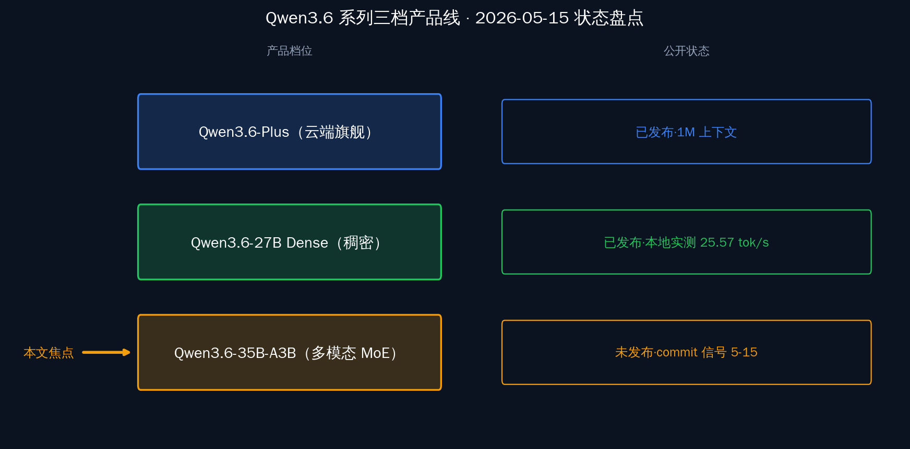
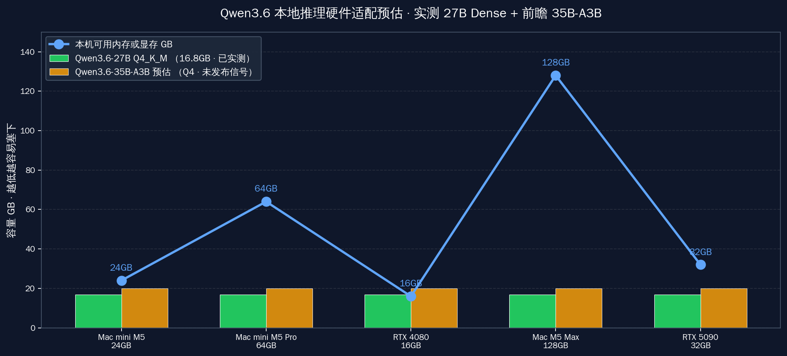

# Qwen3.6 多模态 MoE 下周见？仓库露底

**前置声明：本文是基于公开 commit 的前瞻分析，不是官方发布。阿里通义千问团队尚未官方确认 Qwen3.6-35B-A3B 多模态版本的具体发布时间，本文所有"下周见"的预期仅是基于历史节奏的推断。**

今早 7 点 11 分，QwenLM/qwen-code 仓库合入一条很短的 commit，编号 4c18f13，标题写着「为 Qwen3.6-35B-A3B 量化变体加上图像 + 视频支持」。只动了 10 行代码：两行模型名匹配的正则，外加 8 行单元测试。表面看是工程上的小修补，往后退一步看就有意思了——qwen-code 是阿里通义千问团队官方维护的本地代码代理仓库，今早这条 commit 把一个**还没正式发布**的模型档位（Qwen3.6-35B-A3B）写进了本地推理框架的默认配置表。配置里直接点名了量化命名格式 `Qwen3.6-35B-A3B-NVFP4`，说明 Qwen 团队下一档混合专家（MoE）多模态模型的本地侧适配工作已经接近收尾。

## 一、commit 4c18f13 到底露了什么底

打开 [QwenLM/qwen-code 仓库的这条 commit](https://github.com/QwenLM/qwen-code/commit/4c18f13)，改动只有两个文件：

- `packages/core/src/core/modalityDefaults.ts`：在模型模态默认配置表里新增一条正则规则，`/^qwen3\.6-35b/` 匹配的模型名默认开启 `image: true, video: true`
- `packages/core/src/core/modalityDefaults.test.ts`：对应的单元测试，断言模型名 `qwen3.6-35b-a3b-nvfp4` 输入到默认模态函数后，返回的 `image` 和 `video` 字段为真

commit message 原文很克制：

> "feat(core): add image+video support for Qwen3.6-35B-A3B quant variants" — qwen-code commit `4c18f13`（2026-05-15 07:11 UTC）

但描述段里的几句话信号很强：

> "Add modality pattern for qwen3.6-35b model names, enabling image and video input for locally-hosted Qwen3.6-35B-A3B models (e.g. SGLang's default model name: Qwen3.6-35B-A3B-NVFP4). Previously these fell through to the text-only catch-all, blocking all image content."

关键词「locally-hosted」指本地托管而非云 API，等于明确告诉读者：Qwen 团队优先把本地推理路径补齐。提到「SGLang's default model name: Qwen3.6-35B-A3B-NVFP4」更具体——SGLang 是高吞吐推理框架，NVFP4 是英伟达 4 比特浮点量化格式，这意味着已经有量化产物在测试环境里被加载。最后那个「quant variants」（量化变体）用的是复数，言下之意会出多档量化精度，4-bit / 8-bit / FP16 多版本同步是大概率走向。

这条 commit 由社区开发者 @Dinsmoor 与 Qwen-Coder 团队共同署名（co-authored-by: `qwen-coder@alibabacloud.com`）。阿里云内部账号往社区代码仓库推送的标准做法就是这样，等于半官方确认。

## 二、Qwen3.6 系列已知的两条线

35B-A3B 这一档的位置，要放到 Qwen3.6 系列里看。基于 [insiderllm 在 4 月底整理的综合指南](https://insiderllm.com/guides/qwen-3-6-local-ai-guide/) 与 [量子位 4 月的报道](https://www.qbitai.com/2026/04/394704.html)，Qwen3.6 目前公开的有三档：

| 版本 | 类型 | 参数量 | 主打场景 | 公开状态 |
|---|---|---|---|---|
| Qwen3.6-27B Dense | 稠密模型 | 27B 全激活 | 单卡本地推理 / 编码任务 | 已发布（4 月）|
| Qwen3.6-Plus | 云端旗舰 | 未公开 | 1M 上下文长文档 / 复杂推理 | 已发布（4 月）|
| Qwen3.6-35B-A3B | 混合专家 MoE | 35B 总参数 / 3B 活跃 | 多模态 + 本地部署 | **未发布（commit 信号）** |

量子位对 Qwen3.6-Plus 的评价直白：

> "几乎直逼 Claude Opus 4.5" — 量子位

> "1M 上下文直接拉满" — 量子位

> "速度和生成体验感比 Claude 更夯" — 量子位

注意这些评价指的是 **Qwen3.6-Plus（云端）**，不是即将到来的 35B-A3B。本地版的实测体验需要等模型权重正式开放后才能下定论，本文不替它背书。

## 三、Qwen3.6-27B Dense 已经能在桌面跑

35B-A3B 还没来，但同期的 Qwen3.6-27B Dense 已经能跑很久了。Simon Willison 在 4 月 24 日给出过一次公开实测：

> "Q4_K_M GGUF (16.8GB file) on llama-server at 65K context and clocked 25.57 tok/s generating a pelican SVG" — [Simon Willison 博客](https://simonwillison.net/2026/Apr/24/deepseek-v4/)

GGUF 量化格式（GPT-Generated Unified Format）的 Q4_K_M 是 4 比特中等精度档位，文件 16.8GB 装得下：

- **单卡 RTX 4080（16GB）** 配合 CPU 卸载够跑
- **Mac mini M5（24GB 统一内存）** 余量充足
- **Mac M5 Max（128GB 统一内存）** 全部驻显存还有大把空间留给 KV cache

每秒 25.57 token 的生成速度，65K 的上下文窗口——这个性能已经能支撑日常代码补全、技术文档翻译、长论文总结这类高频用例。Qwen3.6-27B 把"国产模型本地能用"这件事钉死了。35B-A3B 来的时候，本地侧的人群基础已经搭好。

## 四、35B-A3B 多模态意味着什么

把 commit 信号、系列已知信息和历史节奏拼到一起，35B-A3B 多模态版如果真的下周发布，意义最直观的就一条：国产基座少见的「代码 + 多模态 + 长上下文」三件套同框。过去这三块在国产基座里通常是分线推进——Qwen3-Coder 主攻代码、Qwen-VL 主攻视觉、Qwen3.6-Plus 主攻长上下文，开发者要在不同场景里反复切换模型权重。35B-A3B 把这三块拼到同一档 MoE 上，本地一份就能覆盖混合输入的真实工作流，是一次结构性的整合。

35B-A3B 也是当下消费级硬件能跑的最大 MoE 规格。总参数 35B、活跃 3B 的 MoE 结构意味着推理时只有 3B 参数真正参与计算，对显存带宽的压力远小于稠密 35B。这一档在 4-bit 量化（NVFP4 或 GGUF Q4_K_M）下，对硬件的真实要求大致落在「24GB 显存配 32GB 内存」或「64GB 统一内存」这一线，Mac mini M5 Pro 64GB / Mac M5 Max / 单卡 RTX 5090 + 大内存 PC 都覆盖得到。

放到同档海外旗舰的对照里更清楚。同档海外开源 MoE 多模态基座今年陆续开放，但产品取向各不相同——一类押注超长上下文（百万级窗口），一类追求极致视觉理解密度，还有一类专注极小化端侧部署。35B-A3B 如果按 commit 透出的方向走（NVFP4 量化、本地 SGLang 适配、图像与视频输入并行），更像是在做"中等规格、多模态完备、本地框架原生支持"这条路线，首要约束是「在自家开发机上完整跑起来」。这恰好是国内开发者社区呼声最大、海外社区也长期缺位的那个空白点。

## 五、国内开发者在等待期可以做什么

commit 给的信号是「框架适配就绪」，不是「模型权重发布」。从历史节奏看，Qwen 团队 commit 露底到正式发布平均 7-14 天——上次 Qwen3-Coder 的发布节奏也是先在 qwen-code 仓库做模型名注册、再过一周左右上 ModelScope 与 HuggingFace。等待期可以把准备工作做扎实：

- **硬件侧**：手头是 Mac mini 24GB 用户，看看是否需要升级到 64GB Pro 档位以预留 KV cache 空间；M5 Max 128GB 用户可以提前装好 SGLang 与 llama.cpp 双套环境
- **软件侧**：升级 qwen-code 到最新版（截至 2026-05-15 是 v0.15.12-preview，预计 35B-A3B 多模态会在 v0.16 release 一并打通），跟踪仓库 release 页面
- **量化产物**：留意 ModelScope 与 HuggingFace 上的 GGUF 社区量化（Unsloth / Bartowski 等社区贡献者通常会在官方权重开放后 24 小时内提供 Q4_K_M / Q5_K_M / Q8_0 全档量化）
- **多模态输入接口**：提前熟悉 qwen-code 现有的图像与视频输入 API（modalityDefaults 配置表的其它模型条目都能跑通，先用 Qwen-VL 系列做接口磨合）

## 结尾：保持期待，不预设结论

一条 10 行的 commit 不是新闻发布会。它说明 Qwen 团队把多模态 + MoE + 本地部署这条产品线的工程准备工作做到了哪一步，仅此而已。**Qwen3.6-35B-A3B 多模态版本还没正式发布、官方还没给出明确时间表、本地实测的真实体感也还没人能拿出来。** 下周一到下周三，三件事值得盯——qwen-code 仓库的 v0.16 release 进度、ModelScope 上 Qwen3.6 系列的新模型卡、阿里通义千问公众号的更新。这三项里只要落地两项，多模态版的正式发布就基本到了眼前。在那之前，把硬件和工具链准备好，比反复猜测发布日期更有用。

---

## 参考资料

- qwen-code commit 4c18f13（image+video for Qwen3.6-35B-A3B）：https://github.com/QwenLM/qwen-code/commit/4c18f13
- QwenLM/qwen-code 仓库：https://github.com/QwenLM/qwen-code
- QwenLM/Qwen3-Coder 模型仓库：https://github.com/QwenLM/Qwen3-Coder
- insiderllm Qwen3.6 综合指南：https://insiderllm.com/guides/qwen-3-6-local-ai-guide/
- 量子位 Qwen3.6-Plus 报道：https://www.qbitai.com/2026/04/394704.html
- Simon Willison Qwen3.6-27B 本地实测：https://simonwillison.net/2026/Apr/24/deepseek-v4/
